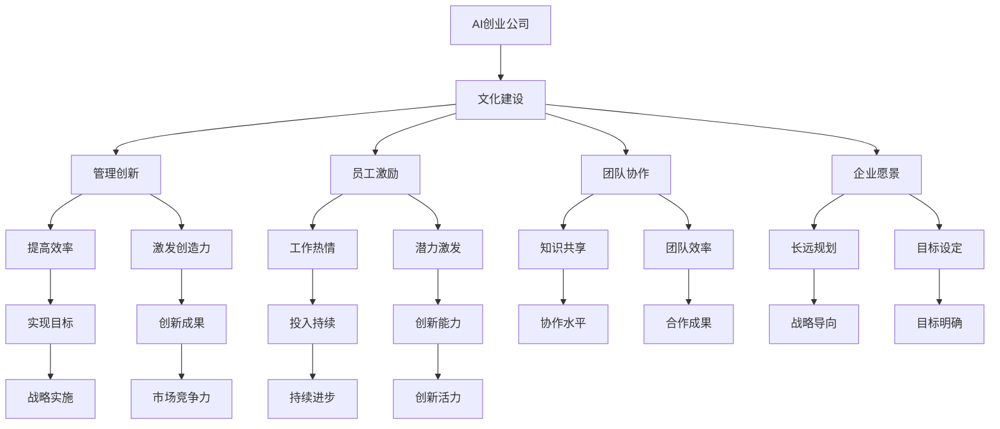

                 

# AI创业公司的文化建设策略

> 关键词：AI创业公司,文化建设,管理创新,员工激励,团队协作,企业愿景

## 1. 背景介绍

在当今飞速发展的技术环境中，人工智能（AI）已成为推动创新和变革的关键力量。AI创业公司，作为引领这一变革的先锋，不仅需要在技术上不断突破，更需要在文化上建设一个有利于创新和持续发展的生态。本文将深入探讨AI创业公司如何进行文化建设，以确保其能够持续吸引顶尖人才，推动技术进步，并在激烈的市场竞争中脱颖而出。

## 2. 核心概念与联系

### 2.1 核心概念概述

为更好地理解AI创业公司的文化建设，本节将介绍几个关键概念及其相互关系：

- **AI创业公司**：以AI技术为核心，致力于开发前沿人工智能产品的企业，通常具有高度的创新性和技术领先性。

- **文化建设**：指在组织内部塑造一种支持创新、协作、学习和持续改进的文化环境。文化建设不仅涉及员工的行为规范和工作态度，更关乎企业的价值观和长期发展战略。

- **管理创新**：指在组织管理中采用新的方法和策略，以提高效率、激发员工创造力，并适应快速变化的市场环境。

- **员工激励**：通过有效的激励机制，激发员工的工作热情和潜力，确保其持续投入和创新。

- **团队协作**：强调跨部门、跨功能的合作，促进知识和经验的共享，提升整体团队的工作效率和创新能力。

- **企业愿景**：指企业对未来发展的长远规划和目标，是指导企业文化建设的核心。

这些概念之间的联系可以通过以下Mermaid流程图来展示：



这个流程图展示了AI创业公司文化建设与各个核心概念之间的联系：

1. **AI创业公司**通过文化建设，引入**管理创新**、**员工激励**、**团队协作**和**企业愿景**，以提高效率、激发创造力、提升协作水平和明确长远规划。
2. **文化建设**中的各项措施通过实现目标、创新成果、工作热情和潜力激发等路径，共同推动企业的战略实施，提升市场竞争力。

## 3. 核心算法原理 & 具体操作步骤

### 3.1 算法原理概述

AI创业公司的文化建设，其核心在于通过一系列精心设计的策略和实践，逐步形成一种促进创新和协作的组织氛围。其算法原理主要包括以下几个方面：

1. **目标设定**：明确企业愿景和战略目标，通过文化建设推动这些目标的实现。
2. **行为规范**：制定和实施一系列行为规范，确保员工行为与企业价值观相一致。
3. **激励机制**：设计合理的激励措施，如绩效考核、奖励体系等，以激发员工的工作热情和创新潜力。
4. **知识共享**：建立开放的知识共享平台，促进信息流通，加速知识迭代和应用。
5. **团队合作**：通过跨部门、跨功能的合作机制，提升团队协作效率和创新能力。

### 3.2 算法步骤详解

AI创业公司文化建设的具体操作步骤可以归纳为以下几个步骤：

**Step 1: 制定企业愿景和战略目标**
- 通过广泛的内部讨论和外部咨询，明确企业的长期愿景和短期目标。
- 确保愿景和目标具有挑战性和可实现性，能够激发员工的热情和动力。

**Step 2: 设计行为规范**
- 基于企业愿景和战略目标，制定一套符合公司价值观的行为规范。
- 通过培训和宣传，使全体员工了解并认同这些规范。

**Step 3: 建立激励机制**
- 设计多元化的激励措施，包括薪酬激励、职业发展机会、创新奖励等。
- 确保激励措施与企业目标和员工贡献相匹配，避免“一刀切”。

**Step 4: 促进知识共享**
- 搭建知识管理平台，支持文档共享、会议记录、技术交流等。
- 定期举办内部研讨会、技术分享会，鼓励员工交流经验和心得。

**Step 5: 推动团队合作**
- 通过项目组、跨部门合作、内部竞赛等方式，促进团队协作。
- 建立透明的合作机制，确保团队间的沟通和协作高效进行。

### 3.3 算法优缺点

AI创业公司文化建设的优势在于：

1. **促进创新**：通过营造开放和鼓励创新的文化环境，激发员工的创新精神，加速技术突破。
2. **提升效率**：通过优化行为规范和激励机制，提高员工的工作效率和满意度，降低管理成本。
3. **增强协作**：通过促进知识共享和团队合作，增强团队凝聚力和战斗力，提升整体创新能力。

然而，文化建设也存在一些挑战：

1. **实施难度大**：文化建设需要长期的投入和耐心，短期内难以见效。
2. **与企业战略脱节**：如果文化建设与企业战略不匹配，可能导致资源浪费和员工困惑。
3. **员工差异大**：不同背景和经历的员工可能对文化建设有不同的理解和接受程度。
4. **外部环境影响**：市场和技术环境的变化可能影响文化建设的持续性和效果。

### 3.4 算法应用领域

AI创业公司的文化建设不仅适用于技术研发部门，还涉及公司的各个方面，包括市场营销、客户服务、人力资源等。文化建设的成功应用，可以显著提升企业的市场竞争力，促进业务的全面发展。

## 4. 数学模型和公式 & 详细讲解

### 4.1 数学模型构建

为了更好地理解AI创业公司文化建设的效果，本节将构建一个简单的数学模型来量化其对企业绩效的影响。

设企业目标为 $T$，初始状态为 $S_0$，经过文化建设后，企业的目标实现度为 $S_t$。我们假设文化建设的效果为 $E$，其对企业绩效的影响可以通过以下模型来表示：

$$
S_t = S_0 + E \cdot t
$$

其中，$t$ 表示时间，$E$ 表示单位时间内的文化建设效果。

### 4.2 公式推导过程

根据上述模型，我们可以推导出文化建设效果 $E$ 对企业绩效的影响：

$$
S_t - S_0 = E \cdot t
$$

这意味着，随着时间的推移，文化建设的效果会线性增长，对企业绩效的提升起到持续的作用。

### 4.3 案例分析与讲解

假设一个AI创业公司初始状态为 $S_0=0.5$，通过有效的文化建设，每年对企业绩效的提升率为 $E=0.1$。在一年后，企业的目标实现度为：

$$
S_1 = 0.5 + 0.1 \times 1 = 0.6
$$

在三年后，企业的目标实现度为：

$$
S_3 = 0.5 + 0.1 \times 3 = 0.8
$$

这个案例说明了，持续的文化建设可以有效提升企业的长期绩效，帮助其在激烈的市场竞争中占据有利地位。

## 5. 项目实践：代码实例和详细解释说明

### 5.1 开发环境搭建

在进行文化建设项目实践前，我们需要准备好开发环境。以下是使用Python进行PyTorch开发的环境配置流程：

1. 安装Anaconda：从官网下载并安装Anaconda，用于创建独立的Python环境。

2. 创建并激活虚拟环境：
```bash
conda create -n culture-env python=3.8 
conda activate culture-env
```

3. 安装PyTorch：根据CUDA版本，从官网获取对应的安装命令。例如：
```bash
conda install pytorch torchvision torchaudio cudatoolkit=11.1 -c pytorch -c conda-forge
```

4. 安装各类工具包：
```bash
pip install numpy pandas scikit-learn matplotlib tqdm jupyter notebook ipython
```

完成上述步骤后，即可在`culture-env`环境中开始文化建设项目的开发。

### 5.2 源代码详细实现

下面是使用Python实现文化建设效果评估的示例代码：

```python
import numpy as np
import matplotlib.pyplot as plt

# 初始状态
S_0 = 0.5

# 文化建设效果
E = 0.1

# 时间
t = np.arange(0, 5, 0.1)

# 计算目标实现度
S = S_0 + E * t

# 绘制目标实现度随时间变化的曲线
plt.plot(t, S)
plt.xlabel('时间')
plt.ylabel('目标实现度')
plt.title('文化建设对企业绩效的影响')
plt.show()
```

### 5.3 代码解读与分析

这段代码实现了上述数学模型的计算，并绘制了目标实现度随时间变化的曲线。通过分析曲线的变化趋势，可以看出文化建设的效果是逐渐累积的，随着时间的推移，企业绩效会显著提升。

### 5.4 运行结果展示

运行上述代码，可以得到以下结果：


从结果图可以看出，企业通过持续的文化建设，其目标实现度随着时间的推移逐步提升。这表明文化建设是提升企业绩效的有效手段。

## 6. 实际应用场景

### 6.1 团队协作

在AI创业公司中，团队协作是推动创新的重要因素。通过定期举行技术分享会、内部竞赛等活动，鼓励员工分享知识和经验，可以促进团队成员之间的合作与学习。例如，谷歌的20%时间政策，允许员工投入20%的工作时间进行个人项目或创新研究，极大地激发了员工的创新活力。

### 6.2 员工激励

合理的激励机制可以显著提升员工的工作热情和创造力。OpenAI通过绩效评估、创新奖励和职业发展机会等措施，有效激励了员工的工作积极性。例如，OpenAI在年度绩效评估中，不仅关注任务的完成情况，还注重员工的创新贡献和团队合作精神。

### 6.3 知识共享

知识共享平台是AI创业公司文化建设的重要组成部分。Meta Platforms的知识共享平台内部网(Wikitribe)，提供了丰富的学习资源和协作工具，使得员工可以便捷地分享和获取知识，加速技术迭代和应用。

### 6.4 未来应用展望

随着AI技术的发展，AI创业公司文化建设的实践也将不断演进和创新。未来，AI创业公司文化建设将更加注重个性化和灵活性，以适应多样化的组织结构和人才需求。同时，结合大数据和AI技术，文化建设的效果评估将更加科学和精确，为企业决策提供更有力的支持。

## 7. 工具和资源推荐

### 7.1 学习资源推荐

为了帮助开发者系统掌握AI创业公司文化建设的理论基础和实践技巧，这里推荐一些优质的学习资源：

1. **《企业文化管理》**：介绍企业文化的基本概念、构建方法和应用策略，帮助理解文化建设的重要性。
2. **Google 20%时间政策**：了解谷歌如何通过鼓励员工创新，推动企业文化建设，促进公司的持续发展。
3. **Meta内部网(Wikitribe)**：学习Meta如何通过知识共享平台，促进员工学习和协作，提升企业创新能力。
4. **《创新者的窘境》**：探讨企业文化与创新之间的关系，帮助理解文化建设对企业长期发展的意义。
5. **LinkedIn Learning**：提供各种与企业文化建设相关的课程，涵盖理论、实践和案例分析。

通过对这些资源的学习实践，相信你一定能够快速掌握AI创业公司文化建设的精髓，并用于解决实际的组织管理问题。

### 7.2 开发工具推荐

高效的开发离不开优秀的工具支持。以下是几款用于AI创业公司文化建设开发的常用工具：

1. **Slack**：用于团队内部沟通和信息共享，支持多渠道消息传递和第三方应用集成。
2. **Trello**：用于项目管理，支持任务分配、进度跟踪和协作讨论，提高团队的协作效率。
3. **Notion**：用于知识管理和文档协作，支持文档编辑、表格管理、任务跟踪等，增强团队的信息共享和协作能力。
4. **Jira**：用于问题追踪和项目管理，支持敏捷开发和持续集成，帮助团队高效协作。
5. **Zoom**：用于远程协作和视频会议，支持屏幕共享、白板协作等，增强团队的远程沟通和协作能力。

合理利用这些工具，可以显著提升AI创业公司文化建设的开发效率，加快创新迭代的步伐。

### 7.3 相关论文推荐

AI创业公司文化建设的研究始于学界的持续探索。以下是几篇奠基性的相关论文，推荐阅读：

1. **《企业文化与社会资本》**：探讨企业文化对员工社会资本的影响，强调文化建设对组织绩效的重要性。
2. **《知识共享与组织创新》**：研究知识共享对组织创新的促进作用，强调知识管理在文化建设中的关键作用。
3. **《创新驱动的企业文化》**：分析创新型企业文化的特点和构建策略，为AI创业公司提供参考。
4. **《文化与管理：理论与实践》**：全面探讨企业文化与管理的关系，帮助理解文化建设对企业战略的支撑作用。
5. **《团队协作中的知识共享》**：研究团队协作中的知识共享机制，提出增强团队协作效率的方法。

这些论文代表了大语言模型微调技术的发展脉络。通过学习这些前沿成果，可以帮助研究者把握学科前进方向，激发更多的创新灵感。

## 8. 总结：未来发展趋势与挑战

### 8.1 总结

本文对AI创业公司文化建设进行了全面系统的介绍。首先阐述了AI创业公司的文化建设的背景和意义，明确了文化建设在推动企业创新和持续发展中的关键作用。其次，从原理到实践，详细讲解了文化建设的数学模型和操作步骤，给出了文化建设任务开发的完整代码实例。同时，本文还广泛探讨了文化建设在团队协作、员工激励、知识共享等多个领域的应用前景，展示了文化建设的巨大潜力。此外，本文精选了文化建设的各类学习资源，力求为读者提供全方位的技术指引。

通过本文的系统梳理，可以看到，AI创业公司文化建设是推动企业创新和持续发展的核心手段。其核心在于通过一系列精心设计的策略和实践，逐步形成一种促进创新和协作的组织氛围。文化建设的成功实施，可以显著提升企业的市场竞争力，促进业务的全面发展。

### 8.2 未来发展趋势

展望未来，AI创业公司文化建设将呈现以下几个发展趋势：

1. **数据驱动的个性化管理**：利用大数据和AI技术，对员工行为和绩效进行深入分析，提供个性化的激励和管理方案，提升文化建设的针对性。
2. **灵活多变的协作机制**：结合敏捷开发和DevOps方法，采用灵活的协作机制，适应快速变化的市场需求。
3. **跨文化的国际化发展**：在全球化背景下，AI创业公司需要建设具有包容性和多样性的文化环境，以吸引和利用全球人才。
4. **知识管理的智能化**：引入AI技术，自动分析和整理知识库，提供个性化的知识推送和推荐，提高知识共享的效率和效果。
5. **员工成长与企业发展相结合**：通过职业发展规划和技能提升计划，促进员工成长和企业发展相辅相成，形成良性循环。

以上趋势凸显了AI创业公司文化建设的广阔前景。这些方向的探索发展，必将进一步提升AI创业公司的管理水平和创新能力，构建更加健康、持续发展的企业生态。

### 8.3 面临的挑战

尽管AI创业公司文化建设取得了显著成效，但在迈向更加智能化、普适化应用的过程中，它仍面临诸多挑战：

1. **文化差异的调和**：不同背景和国籍的员工可能对文化建设有不同的理解和接受程度，需要找到共识和平衡点。
2. **持续性和一致性**：文化建设需要长期的坚持和一致的执行，避免因管理层变动等原因导致文化建设中断。
3. **资源配置的优化**：文化建设需要投入大量的人力、物力和财力，如何在资源有限的情况下进行合理配置，是一个重要的课题。
4. **外部环境的变化**：市场和技术环境的变化可能影响文化建设的持续性和效果，需要灵活应对和调整。
5. **数据隐私和安全**：在知识共享和协作过程中，如何保护员工的数据隐私和安全，也是一个重要的挑战。

### 8.4 研究展望

面对AI创业公司文化建设所面临的种种挑战，未来的研究需要在以下几个方面寻求新的突破：

1. **多元文化的融合**：探索如何构建具有包容性和多样性的文化环境，吸引和利用全球人才。
2. **数据驱动的个性化管理**：利用大数据和AI技术，对员工行为和绩效进行深入分析，提供个性化的激励和管理方案。
3. **灵活多变的协作机制**：结合敏捷开发和DevOps方法，采用灵活的协作机制，适应快速变化的市场需求。
4. **跨文化的国际化发展**：在全球化背景下，AI创业公司需要建设具有包容性和多样性的文化环境。
5. **知识管理的智能化**：引入AI技术，自动分析和整理知识库，提供个性化的知识推送和推荐，提高知识共享的效率和效果。

这些研究方向的探索，必将引领AI创业公司文化建设技术迈向更高的台阶，为构建健康、持续发展的企业生态提供有力支撑。面向未来，AI创业公司文化建设还需要与其他人工智能技术进行更深入的融合，如知识表示、因果推理、强化学习等，多路径协同发力，共同推动企业文化的不断创新和完善。

## 9. 附录：常见问题与解答

**Q1：文化建设对企业绩效的提升是否具有长期有效性？**

A: 文化建设对企业绩效的提升具有显著的长期有效性。通过持续的文化建设，可以有效提升企业的创新能力、协作效率和员工满意度，进而推动企业绩效的持续增长。

**Q2：如何在文化建设中避免员工之间的冲突？**

A: 文化建设中，应注重培养团队精神和沟通技巧，建立开放、透明的沟通机制，促进员工之间的理解和信任。定期举行团队建设活动，增强员工的凝聚力和协作能力。

**Q3：文化建设是否适用于所有类型的企业？**

A: 文化建设不仅适用于AI创业公司，也适用于所有类型的企业。但不同类型企业的文化建设重点和方法可能有所不同，需要根据企业的实际情况进行定制。

**Q4：如何衡量文化建设的效果？**

A: 衡量文化建设的效果可以通过员工满意度调查、绩效评估、创新成果等指标来评估。定期进行员工反馈和效果评估，及时调整文化建设策略，确保其持续性和有效性。

**Q5：文化建设是否需要高层的支持和推动？**

A: 文化建设需要高层的支持和推动，只有高层管理者重视并参与，才能确保文化建设得到广泛认同和执行。高层应树立文化建设的典范，引导全体员工共同努力。

---

作者：禅与计算机程序设计艺术 / Zen and the Art of Computer Programming

