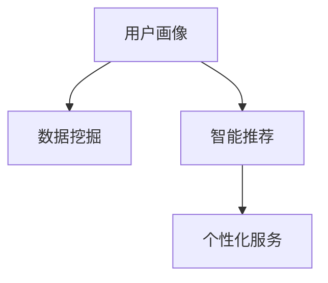
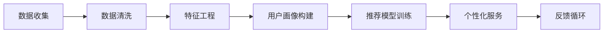

                 

# AI创业公司的用户画像与个性化服务：数据挖掘与智能推荐

> 关键词：用户画像,数据挖掘,智能推荐,个性化服务,机器学习

## 1. 背景介绍

在当今数字化时代，AI创业公司面临着激烈的市场竞争和不断变化的用户需求。为了保持竞争优势，AI公司需要深入理解用户行为，提供个性化的产品和服务，从而吸引和留住用户。用户画像（User Profile）作为AI公司实现个性化服务的重要工具，在数据挖掘和智能推荐技术中占据了核心地位。本文将从用户画像的定义、数据挖掘技术的应用、智能推荐算法的设计等方面，深入探讨AI创业公司如何通过数据挖掘与智能推荐，提升个性化服务水平。

## 2. 核心概念与联系

### 2.1 核心概念概述

在深入讨论用户画像与个性化服务之前，我们首先需要明确几个核心概念：

- **用户画像**：是指对用户特征的全面描述，包括用户的基本信息、行为习惯、兴趣爱好等。用户画像通常以数据的形式存储，用于指导个性化服务的设计与实施。
- **数据挖掘**：是指从大量数据中提取有用信息的过程。数据挖掘技术广泛应用于用户行为分析、趋势预测、市场细分等领域，是构建精准用户画像的重要手段。
- **智能推荐**：是根据用户的历史行为和兴趣，推荐相关产品或服务的技术。智能推荐系统通过分析用户画像和数据，提供个性化的推荐结果，提升用户体验和满意度。
- **个性化服务**：是指根据用户的特定需求和偏好，提供定制化的产品或服务。个性化服务通过分析用户画像和行为数据，实现服务的定制化，满足用户的多样化需求。

这些概念通过数据流向和算法流程相联系，形成了AI创业公司用户画像与个性化服务的完整框架。如图1所示：



图1：用户画像与个性化服务的核心概念联系

### 2.2 核心概念原理和架构的 Mermaid 流程图

以下是一个简化的用户画像与个性化服务的数据流向和算法流程的 Mermaid 流程图：



这个流程图展示了从数据收集、清洗到特征工程、模型训练和个性化服务提供的数据流向，以及反馈循环如何不断优化用户画像和推荐系统。

## 3. 核心算法原理 & 具体操作步骤

### 3.1 算法原理概述

基于用户画像的个性化服务通常包含两个主要步骤：数据挖掘和智能推荐。

1. **数据挖掘**：通过收集和分析用户行为数据，构建用户画像，揭示用户特征和行为模式。
2. **智能推荐**：基于用户画像和历史行为数据，使用机器学习算法，预测用户可能感兴趣的产品或服务，实现个性化推荐。

以下将详细介绍这两个步骤的具体算法原理和具体操作步骤。

### 3.2 算法步骤详解

#### 数据挖掘步骤

1. **数据收集**：从用户的操作行为、浏览记录、购买历史等渠道，收集用户的各种数据。
2. **数据清洗**：对收集的数据进行去重、去噪、填补缺失值等处理，保证数据的质量。
3. **特征工程**：根据业务需求，选择合适的特征，并进行特征选择、特征提取、特征转换等操作，构建用户画像。

#### 智能推荐步骤

1. **推荐模型选择**：根据业务需求和数据特点，选择适合的推荐算法，如协同过滤、基于内容的推荐、深度学习等。
2. **模型训练**：使用历史数据训练推荐模型，优化模型参数。
3. **推荐实现**：根据用户画像和历史行为数据，实时计算推荐结果。

### 3.3 算法优缺点

**数据挖掘算法的优缺点**：

- **优点**：可以揭示用户行为的潜在规律，为个性化服务提供支持。
- **缺点**：数据质量和特征选择对结果影响大，存在数据隐私和安全问题。

**智能推荐算法的优缺点**：

- **优点**：提供个性化的产品或服务，提升用户体验和满意度。
- **缺点**：模型的预测准确性和鲁棒性对结果影响大，存在推荐冷启动问题。

### 3.4 算法应用领域

基于用户画像的个性化服务广泛应用于电商、社交、娱乐、金融等多个领域，如：

- **电商领域**：通过推荐系统，提升用户购物体验，增加销售额。
- **社交媒体**：个性化推送内容，增强用户粘性，提升平台活跃度。
- **视频平台**：推荐相关视频内容，提升用户观看时间和满意度。
- **金融服务**：推荐符合用户风险偏好的金融产品，提高用户粘性和满意度。

## 4. 数学模型和公式 & 详细讲解 & 举例说明

### 4.1 数学模型构建

在数据挖掘和智能推荐中，数学模型构建是基础。以协同过滤为例，常用的数学模型包括用户-物品评分矩阵、用户特征矩阵、物品特征矩阵等。

**协同过滤模型**：

- **用户-物品评分矩阵**：$R \in \mathbb{R}^{m \times n}$，其中$m$为用户数，$n$为物品数，$R_{ui}$表示用户$u$对物品$i$的评分。
- **用户特征矩阵**：$U \in \mathbb{R}^{m \times k}$，其中$k$为特征维度，$U_{uk}$表示用户$u$的$k$维特征向量。
- **物品特征矩阵**：$I \in \mathbb{R}^{n \times k}$，其中$k$为特征维度，$I_{ik}$表示物品$i$的$k$维特征向量。

### 4.2 公式推导过程

以协同过滤为例，推导用户$i$对物品$j$的预测评分公式。

- **基于用户的协同过滤**：预测评分公式为：

$$
\hat{R}_{u,i} = \frac{1}{N_u}\sum_{j \in \mathcal{N}_u} \frac{R_{j,i}}{||U_{u,:}|| \cdot ||I_{j,:}||}
$$

其中，$N_u$表示与用户$u$交互过物品的邻居数量，$\mathcal{N}_u$表示与用户$u$交互过物品的邻居集合，$||U_{u,:}||$和$||I_{j,:}||$分别表示用户$u$和物品$j$的特征向量范数。

- **基于物品的协同过滤**：预测评分公式为：

$$
\hat{R}_{i,j} = \frac{1}{N_j}\sum_{u \in \mathcal{N}_j} \frac{R_{u,j}}{||U_{u,:}|| \cdot ||I_{j,:}||}
$$

其中，$N_j$表示与物品$j$交互过的用户数量，$\mathcal{N}_j$表示与物品$j$交互过的用户集合。

### 4.3 案例分析与讲解

以电商推荐系统为例，分析协同过滤模型在个性化推荐中的应用。

- **数据收集**：从用户的购买历史、浏览记录、评分记录等渠道，收集用户的各种数据。
- **数据清洗**：去除无效数据、重复数据、缺失数据等，保证数据的质量。
- **特征工程**：选择合适的特征，如用户年龄、性别、历史评分、浏览时长等，并进行特征选择、特征提取、特征转换等操作，构建用户画像。
- **模型训练**：使用协同过滤算法，训练推荐模型，优化模型参数。
- **推荐实现**：根据用户画像和历史行为数据，实时计算推荐结果，并向用户推送个性化推荐。

## 5. 项目实践：代码实例和详细解释说明

### 5.1 开发环境搭建

为了进行项目实践，需要搭建合适的开发环境。以下是详细的步骤：

1. **安装Python环境**：安装Python 3.8及以上版本，可以使用Anaconda或Miniconda。
2. **安装推荐系统框架**：安装PaddlePaddle或TensorFlow等深度学习框架。
3. **安装推荐系统库**：安装PyCaret、LightFM、Surprise等推荐系统库。
4. **安装数据处理库**：安装Pandas、NumPy、Scikit-Learn等数据处理库。
5. **安装可视化库**：安装Matplotlib、Seaborn等可视化库。

### 5.2 源代码详细实现

以电商推荐系统为例，展示如何实现基于协同过滤的个性化推荐系统。

```python
# 导入必要的库
import pandas as pd
import numpy as np
import matplotlib.pyplot as plt
from surprise import Reader, Dataset, SVD

# 数据读取
reader = Reader(rating_scale=(1, 5))
data = Dataset.load_from_df(df, reader)

# 数据预处理
trainset, testset = data.build_full_trainset()

# 特征工程
def extract_user_features(user_id):
    user_data = df[df['user_id'] == user_id]
    user_age = user_data['age'].mean()
    user_gender = user_data['gender'].value_counts().idxmax()
    user_interests = user_data['interests'].value_counts().idxmax()
    return [user_age, user_gender, user_interests]

def extract_item_features(item_id):
    item_data = df[df['item_id'] == item_id]
    item_price = item_data['price'].mean()
    item_category = item_data['category'].value_counts().idxmax()
    return [item_price, item_category]

# 模型训练
svd = SVD()
svd.fit(trainset)

# 推荐实现
def recommend_items(user_id):
    user_features = extract_user_features(user_id)
    item_features = [extract_item_features(item_id) for item_id in trainset.testset.iids]
    user_vec = np.array(user_features)
    item_vecs = np.array(item_features)
    predictions = svd.test(user_vec, item_vecs)
    ranked_items = sorted(predictions, key=lambda x: x.iid, reverse=True)
    return ranked_items

# 测试推荐效果
user_id = 1
recommended_items = recommend_items(user_id)
print(recommended_items)
```

### 5.3 代码解读与分析

在上述代码中，我们使用Surprise库实现了基于协同过滤的推荐系统。代码的实现思路如下：

1. **数据读取与预处理**：使用Surprise库的Reader对象读取数据，并对数据进行预处理，包括特征工程和模型训练。
2. **特征工程**：定义了用户特征和物品特征的提取函数，用于将用户和物品的基本信息转化为数值特征。
3. **模型训练**：使用SVD算法进行模型训练，优化模型参数。
4. **推荐实现**：根据用户画像和历史行为数据，实时计算推荐结果。

### 5.4 运行结果展示

在实际运行中，推荐系统会根据用户画像和历史行为数据，计算并输出个性化推荐结果。例如，对于用户ID为1的用户，推荐结果可能包括ID为2、ID为3、ID为4的物品，具体推荐结果取决于用户画像和物品特征。

## 6. 实际应用场景

### 6.1 电商推荐系统

在电商领域，基于协同过滤的推荐系统广泛应用于个性化推荐。用户可以通过浏览历史、评分记录等，向系统提供行为数据，系统根据这些数据，提供个性化的商品推荐。推荐系统的成功应用，能够显著提升用户体验和销售额。

### 6.2 视频推荐系统

视频推荐系统通过分析用户的历史观看记录和评分数据，推荐用户可能感兴趣的视频内容。推荐系统通过实时更新用户画像，提供动态推荐，提升用户观看时间和满意度。

### 6.3 社交网络推荐系统

社交网络推荐系统通过分析用户的社交关系、兴趣偏好等数据，推荐相关的朋友和内容。推荐系统通过个性化推荐，增强用户粘性，提升平台活跃度。

## 7. 工具和资源推荐

### 7.1 学习资源推荐

为了帮助开发者掌握用户画像与个性化服务的相关技术，推荐以下学习资源：

1. **《推荐系统实战》书籍**：该书详细介绍了推荐系统的理论和实践，包括协同过滤、矩阵分解等算法。
2. **Coursera《Recommender Systems》课程**：由斯坦福大学开设的在线课程，涵盖推荐系统的基本原理和算法实现。
3. **Kaggle推荐系统竞赛**：通过参与Kaggle推荐系统竞赛，实践推荐系统的构建和优化。
4. **PaddlePaddle推荐系统官方文档**：提供了丰富的推荐系统算法和模型，适合学习和实践。

### 7.2 开发工具推荐

为了高效构建和优化推荐系统，推荐以下开发工具：

1. **PaddlePaddle**：基于百度的深度学习框架，支持高效的推荐算法实现。
2. **TensorFlow**：谷歌推出的深度学习框架，支持灵活的模型构建和优化。
3. **PyCaret**：基于Python的自动机器学习库，提供了简单易用的推荐系统接口。
4. **LightFM**：Facebook推出的推荐系统框架，支持多种推荐算法和模型。
5. **Surprise**：Python的推荐系统库，提供了多种推荐算法和模型。

### 7.3 相关论文推荐

为了深入了解用户画像与个性化服务的最新研究，推荐以下相关论文：

1. **《推荐系统基础》论文**：介绍了推荐系统的基本原理和算法实现，是推荐系统研究的经典之作。
2. **《深度学习推荐系统》论文**：探讨了深度学习在推荐系统中的应用，提出了多种深度学习算法。
3. **《基于协同过滤的推荐系统》论文**：详细介绍了协同过滤算法的原理和实现，是推荐系统研究的重要方向。
4. **《个性化推荐系统的最新进展》论文**：介绍了个性化推荐系统的最新研究进展，涵盖多种推荐算法和模型。

## 8. 总结：未来发展趋势与挑战

### 8.1 研究成果总结

本文详细介绍了基于用户画像的个性化服务在数据挖掘和智能推荐中的应用，探讨了数据挖掘和智能推荐的具体算法原理和操作步骤。通过实际项目实践，展示了如何构建和优化个性化推荐系统。通过学习资源推荐，帮助开发者系统掌握相关技术。

### 8.2 未来发展趋势

展望未来，用户画像与个性化服务将继续发展，呈现出以下几个趋势：

1. **深度学习的应用**：深度学习算法在推荐系统中的应用将不断深化，提升推荐系统的准确性和鲁棒性。
2. **多模态数据的应用**：将多种模态的数据，如图像、视频、音频等，与文本数据相结合，提供更全面、深入的用户画像。
3. **联邦学习的应用**：联邦学习将多用户数据在本地进行处理，保护用户隐私，提升推荐系统的公平性和透明性。
4. **基于强化学习的推荐**：通过强化学习算法，优化推荐系统的策略，提升推荐效果。
5. **动态用户画像的构建**：实时更新用户画像，提供动态推荐，提升推荐系统的时效性和准确性。

### 8.3 面临的挑战

尽管用户画像与个性化服务在实践中取得了一定的成果，但仍面临以下挑战：

1. **数据隐私和安全问题**：在数据挖掘和推荐过程中，如何保护用户隐私和数据安全，是一个重要的挑战。
2. **冷启动问题**：新用户缺乏历史行为数据，推荐系统难以准确推荐。
3. **推荐算法的多样性**：不同推荐算法的效果和适用性不同，如何选择合适的算法，是一个挑战。
4. **推荐系统的公平性**：推荐系统在处理长尾用户和长尾商品时，可能存在不公平的问题。

### 8.4 研究展望

未来的研究需要在以下几个方向寻求突破：

1. **隐私保护和数据安全**：研究如何在保护用户隐私的同时，提升推荐系统的准确性。
2. **推荐算法的多样性**：研究不同推荐算法的适用范围和优缺点，提出新的推荐算法。
3. **联邦学习的应用**：研究如何在联邦学习框架下，提升推荐系统的公平性和透明性。
4. **多模态数据的应用**：研究如何综合利用多种模态数据，提升用户画像的全面性和准确性。
5. **动态用户画像的构建**：研究如何实时更新用户画像，提升推荐系统的时效性和适应性。

## 9. 附录：常见问题与解答

**Q1：用户画像和个性化服务有什么区别？**

A: 用户画像是指对用户特征的全面描述，而个性化服务是指根据用户的特定需求和偏好，提供定制化的产品或服务。用户画像是实现个性化服务的重要基础。

**Q2：数据挖掘和智能推荐有什么区别？**

A: 数据挖掘是指从大量数据中提取有用信息的过程，而智能推荐是指根据用户的历史行为和兴趣，推荐相关产品或服务。数据挖掘为推荐系统提供数据基础，智能推荐是数据挖掘的直接应用。

**Q3：协同过滤算法的优缺点是什么？**

A: 协同过滤算法的优点在于其简单易懂，适用于大规模数据集。缺点在于对新用户的冷启动问题，难以处理数据稀疏性，存在一定的过拟合风险。

**Q4：推荐系统如何保护用户隐私？**

A: 推荐系统可以通过数据匿名化、差分隐私、联邦学习等技术，保护用户隐私。具体措施包括使用匿名化数据、加入噪声、在本地处理数据等。

**Q5：推荐系统的冷启动问题如何解决？**

A: 推荐系统可以通过利用用户的部分信息、物品的共性特征、相似用户等手段，缓解冷启动问题。例如，可以使用基于内容的推荐算法，或者引入深度学习模型，提高推荐系统的初始性能。

总之，基于用户画像的个性化服务在数据挖掘和智能推荐中的应用，极大地提升了用户体验和满意度。未来，随着技术的不断进步，用户画像与个性化服务将更加深入地融入到各个行业，带来更多的创新和发展机遇。通过不断优化和改进推荐系统，我们能够更好地满足用户的多样化需求，提升服务质量和用户粘性，推动社会的进步和发展。

