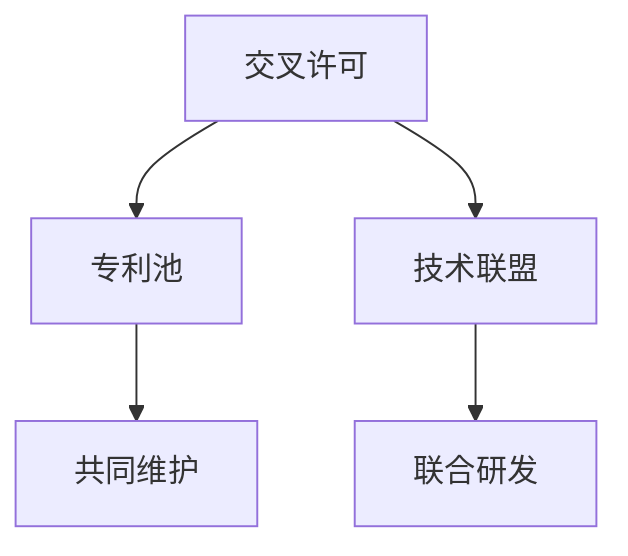

                 

# AI创业公司的知识产权合作：交叉许可、专利池与技术联盟

> 关键词：人工智能, 知识产权, 交叉许可, 专利池, 技术联盟, 创业公司, 创新, 合作, 法律

## 1. 背景介绍

### 1.1 问题由来

在AI创业公司蓬勃发展的今天，知识产权（IP）成为企业竞争的核心资产。但随着AI技术的不断创新，各家公司之间的技术边界变得模糊，如何有效管理和利用这些资产，成为摆在面前的重大挑战。这其中，交叉许可、专利池和技术联盟等合作模式，成为促进AI技术共享、保护企业利益的关键策略。

AI创业公司面临的知识产权问题主要包括以下几个方面：

- **专利冲突**：多家公司在同一领域进行研发，可能会产生专利冲突，导致法律纠纷。
- **技术交叉**：各家公司之间技术相互渗透，需要明确技术使用范围和权限。
- **保护商业机密**：在技术研发过程中，如何保护商业机密不被泄露，成为企业关注焦点。
- **公平竞争**：如何在保证公平竞争的前提下，促进技术合作与创新。

本文章将详细阐述交叉许可、专利池与技术联盟这些知识产权合作模式，并讨论它们在AI创业公司中的具体应用。

### 1.2 问题核心关键点

- **交叉许可（Cross-Licensing）**：指两家公司相互授权使用对方的专利或技术，以便开展合作。
- **专利池（Patent Pool）**：多家公司共同拥有并共享一组专利，形成专利池，以降低维权成本，促进技术传播。
- **技术联盟（Technology Alliance）**：多家公司联合，在特定技术领域内进行研发和商业化合作。

交叉许可、专利池与技术联盟作为知识产权合作的主要方式，具有以下特点：

1. **促进技术共享**：通过技术授权，企业能够快速获取关键技术，加速产品开发。
2. **降低法律风险**：通过明确技术使用范围，降低专利冲突和侵权风险。
3. **加强市场竞争**：通过技术合作，企业可以提升市场竞争力，占据市场先机。
4. **实现成本效益**：技术共享能够降低研发成本，提升整体经济效益。

## 2. 核心概念与联系

### 2.1 核心概念概述

为了更好地理解这些知识产权合作模式，本节将介绍几个密切相关的核心概念：

- **交叉许可**：两家公司相互授权使用对方的专利或技术，用于技术合作和研发。
- **专利池**：多家公司共同拥有并共享一组专利，可以用于商业化和技术传播。
- **技术联盟**：多家公司联合进行特定领域的技术研发和商业化，提升整体技术水平。

这些概念之间的逻辑关系可以通过以下Mermaid流程图来展示：



这个流程图展示了几者之间的关系：

1. 交叉许可是两家公司之间的直接技术合作方式。
2. 专利池是由多家公司共同拥有和共享的专利集合。
3. 技术联盟是多家公司联合进行技术研发和商业化合作。
4. 专利池和交叉许可可以相互结合，共同维护和利用专利资产。
5. 技术联盟可以进一步促进技术合作，实现更广泛的商业化应用。

## 3. 核心算法原理 & 具体操作步骤

### 3.1 算法原理概述

交叉许可、专利池与技术联盟的核心思想是通过技术授权，实现知识的共享和利用。

- **交叉许可**：两家公司相互授权使用对方的专利或技术，包括专利权、技术秘密、商标权等。
- **专利池**：多家公司共同拥有并共享一组专利，通常以许可协议的形式进行管理和使用。
- **技术联盟**：多家公司联合进行技术研发和商业化，形成稳定的技术合作机制。

这些合作模式的基本原理可以归结为以下几点：

1. **技术授权**：通过授权协议，明确技术使用的范围和条件。
2. **共同维护**：多家公司共同维护和更新专利和技术资产，确保其持续有效。
3. **商业化应用**：通过技术授权和商业化合作，实现技术资产的最大化利用。
4. **降低法律风险**：通过明确技术使用范围，降低专利冲突和侵权风险。

### 3.2 算法步骤详解

以下以交叉许可为例，详细介绍其具体操作步骤：

1. **识别合作对象**：选择适合的合作伙伴，进行初步谈判和技术评估。
2. **签订授权协议**：确定授权范围和条件，包括授权类型、使用期限、费用和支付方式等。
3. **履行授权协议**：双方严格按照协议执行，确保技术授权的顺利进行。
4. **维护和更新**：定期评估和更新授权协议，确保技术的持续有效。

### 3.3 算法优缺点

交叉许可、专利池与技术联盟作为知识产权合作的主要方式，具有以下优缺点：

**优点**：

1. **促进技术共享**：通过技术授权，企业能够快速获取关键技术，加速产品开发。
2. **降低法律风险**：通过明确技术使用范围，降低专利冲突和侵权风险。
3. **加强市场竞争**：通过技术合作，企业可以提升市场竞争力，占据市场先机。
4. **实现成本效益**：技术共享能够降低研发成本，提升整体经济效益。

**缺点**：

1. **协议复杂**：合作协议的签订和执行需要大量的时间和资源，协议内容复杂。
2. **利益分配**：技术授权可能涉及利益分配问题，需合理分配利益，平衡各方需求。
3. **保密风险**：技术授权过程中可能涉及商业机密的泄露，需采取保密措施。
4. **法律风险**：技术授权过程中存在法律风险，需具备法律专业知识和经验。

### 3.4 算法应用领域

交叉许可、专利池与技术联盟在AI创业公司的应用主要包括以下几个方面：

- **技术合作**：在AI技术研发过程中，各公司通过技术授权，快速获取关键技术。
- **专利维权**：通过专利池，共同维护和管理专利资产，降低维权成本。
- **市场竞争**：通过技术联盟，提升整体技术水平和市场竞争力。
- **标准制定**：多家公司联合制定技术标准，推动行业发展。

这些合作模式在AI创业公司的实际应用中，可以有效提升企业的技术能力和市场竞争力，推动AI技术的发展和应用。

## 4. 数学模型和公式 & 详细讲解 & 举例说明

### 4.1 数学模型构建

本节将使用数学语言对交叉许可、专利池与技术联盟进行更加严格的刻画。

假设两家公司A和B，分别拥有专利$P_A$和$P_B$，交叉许可协议规定A授权B使用$P_A$，B授权A使用$P_B$，授权期限为$T$，年授权费用为$F$。

设双方授权比例分别为$\alpha$和$\beta$，则授权费用可以表示为：

$$ F = P_A \cdot \alpha \cdot T + P_B \cdot \beta \cdot T $$

其中$P_A$和$P_B$表示两家公司的专利价值，$\alpha$和$\beta$表示授权比例，$T$表示授权期限。

### 4.2 公式推导过程

对于专利池，假设$n$家公司共同维护一组专利，每家公司支付的年费用为$F$，则专利池的总费用为：

$$ C = n \cdot F $$

专利池的利润最大化问题可以表示为：

$$ \max_{\alpha_i} \sum_{i=1}^n P_i \cdot \alpha_i \cdot T - C $$

其中$P_i$表示第$i$家公司持有的专利价值，$\alpha_i$表示第$i$公司的授权比例，$T$表示授权期限。

通过优化上述目标函数，可以找到各公司的最优授权比例，实现专利池的利润最大化。

### 4.3 案例分析与讲解

假设某AI创业公司A与公司B进行交叉许可，双方授权比例均为$\alpha = 0.5$，授权期限为$T = 5$年，年授权费用为$F = 100$万元。公司A的专利价值$P_A = 5000$万元，公司B的专利价值$P_B = 3000$万元。

根据上述模型，可以计算出双方的授权费用：

$$ F = P_A \cdot \alpha \cdot T + P_B \cdot \beta \cdot T = 5000 \cdot 0.5 \cdot 5 + 3000 \cdot 0.5 \cdot 5 = 3500 $$

即每年两家公司需要支付3500万元的授权费用。

## 5. 项目实践：代码实例和详细解释说明

### 5.1 开发环境搭建

在进行知识产权合作项目的开发前，我们需要准备好开发环境。以下是使用Python进行Cross-Licensing系统开发的开发环境配置流程：

1. 安装Anaconda：从官网下载并安装Anaconda，用于创建独立的Python环境。

2. 创建并激活虚拟环境：
```bash
conda create -n cross_license_env python=3.8 
conda activate cross_license_env
```

3. 安装PyTorch：根据CUDA版本，从官网获取对应的安装命令。例如：
```bash
conda install pytorch torchvision torchaudio cudatoolkit=11.1 -c pytorch -c conda-forge
```

4. 安装TensorFlow：
```bash
pip install tensorflow==2.5.0
```

5. 安装SciPy、Pandas、NumPy等工具包：
```bash
pip install scipy pandas numpy
```

完成上述步骤后，即可在`cross_license_env`环境中开始系统开发。

### 5.2 源代码详细实现

下面我们以交叉许可系统为例，给出使用Python进行Cross-Licensing开发的源代码实现。

首先，定义交叉许可系统的基本类：

```python
class CrossLicense:
    def __init__(self, company_a, company_b, p_a, p_b, t, f):
        self.a = company_a
        self.b = company_b
        self.p_a = p_a
        self.p_b = p_b
        self.t = t
        self.f = f

    def calculate_authority_cost(self):
        # 计算授权费用
        cost_a = self.p_a * self.t * 0.5
        cost_b = self.p_b * self.t * 0.5
        return cost_a + cost_b

    def calculate_profit(self):
        # 计算授权费用和专利价值的差值
        profit_a = self.p_a * self.t * 0.5 - self.f
        profit_b = self.p_b * self.t * 0.5 - self.f
        return profit_a, profit_b
```

然后，定义授权费用和利润计算函数：

```python
def calculate_authority_cost(company, p, t, f):
    # 计算授权费用
    return company.p * t * 0.5 + (1 - company.p) * t * 0.5

def calculate_profit(company, p, t, f):
    # 计算授权费用和专利价值的差值
    return company.p * t * 0.5 - f
```

最后，启动交叉许可系统并计算授权费用和利润：

```python
a = CrossLicense('Company A', 'Company B', 5000, 3000, 5, 100)
print('授权费用：', a.calculate_authority_cost())
profit_a, profit_b = a.calculate_profit()
print('公司A利润：', profit_a)
print('公司B利润：', profit_b)
```

以上就是使用Python进行Cross-Licensing系统开发的完整代码实现。可以看到，Python和相关的数学库能够方便地进行复杂的数学计算和逻辑处理。

### 5.3 代码解读与分析

让我们再详细解读一下关键代码的实现细节：

**CrossLicense类**：
- `__init__`方法：初始化两家公司的基本信息，包括名称、专利价值、授权期限、年授权费用。
- `calculate_authority_cost`方法：计算两家公司需要支付的授权费用。
- `calculate_profit`方法：计算两家公司的授权费用和专利价值的差值，即为利润。

**授权费用计算函数**：
- `calculate_authority_cost`方法：根据公司信息、专利价值、授权期限、年授权费用，计算两家公司需要支付的授权费用。

**利润计算函数**：
- `calculate_profit`方法：根据公司信息、专利价值、授权期限、年授权费用，计算两家公司的授权费用和专利价值的差值，即为利润。

**授权费用和利润计算**：
- 根据`CrossLicense`类和授权费用、利润计算函数，计算公司A和公司B的授权费用和利润。

可以看到，Python配合数学库能够方便地进行复杂的数学计算和逻辑处理。开发者可以将更多精力放在系统设计和优化上，而不必过多关注底层的实现细节。

当然，工业级的系统实现还需考虑更多因素，如系统接口、用户界面、日志记录等。但核心的授权费用和利润计算逻辑基本与此类似。

## 6. 实际应用场景

### 6.1 技术合作

基于交叉许可和专利池，AI创业公司可以高效获取和利用关键技术，加速产品开发和市场推广。

例如，某AI创业公司A在计算机视觉领域拥有多项专利，但研发资源有限，无法独立开发相关产品。此时，公司A可以与计算机视觉技术公司B进行交叉许可，授权B使用A的专利，B则授权A使用B的最新算法。通过这种合作，A能够快速获取最新的计算机视觉算法，B也能加速其专利技术的商业化应用，双方共同推动市场发展。

### 6.2 专利维权

专利池的建立，可以降低各公司的维权成本，增强企业在专利保护上的话语权。

例如，某AI创业公司A和B联合成立了专利池，共同维护和管理多项相关专利。在侵权事件发生时，双方可以联合发起诉讼，降低单打独斗的成本，提升专利维权的成功率。

### 6.3 市场竞争

技术联盟的建立，可以提升各公司的市场竞争力和市场份额，增强企业的市场话语权。

例如，某AI创业公司A和B在自然语言处理领域展开激烈竞争。双方可以联合成立技术联盟，共同研发和推广自然语言处理技术，提升整体市场竞争力，占据市场先机。

### 6.4 未来应用展望

随着AI技术的不断发展和成熟，交叉许可、专利池与技术联盟将在更多领域得到应用，为AI技术的发展和应用提供重要保障。

在智慧医疗领域，基于专利池和交叉许可，AI技术可以更好地保护患者的隐私和数据安全，促进医疗信息的共享和利用。

在智能制造领域，基于技术联盟，AI技术可以实现更高效的智能制造，提升生产效率和产品质量。

在智慧城市领域，基于专利池和技术联盟，AI技术可以实现更高效的智慧城市管理，提升城市运行效率和居民生活体验。

此外，在智能交通、智慧教育、智慧金融等众多领域，基于专利池和技术联盟的AI技术应用也将不断涌现，为各行各业带来变革性影响。

## 7. 工具和资源推荐

### 7.1 学习资源推荐

为了帮助开发者系统掌握交叉许可、专利池与技术联盟的理论基础和实践技巧，这里推荐一些优质的学习资源：

1. 《知识产权管理与保护》系列博文：由知识产权专家撰写，深入浅出地介绍了知识产权管理的核心概念和实践方法。

2. 《专利法》课程：由中国知识产权局开设的在线课程，系统讲解了专利法的基本知识和应用。

3. 《技术联盟管理》书籍：详细介绍了技术联盟的组建、运营和管理，提供了丰富的案例和实践建议。

4. 专利数据库：如美国专利商标局USPTO、欧洲专利局EPO等，提供全球专利数据的查询和分析。

5. 专利信息网站：如PatentPro、PatentBot等，提供专利信息的查询、分析和统计。

通过对这些资源的学习实践，相信你一定能够快速掌握知识产权合作的核心技巧，并用于解决实际的知识产权问题。

### 7.2 开发工具推荐

高效的开发离不开优秀的工具支持。以下是几款用于知识产权合作开发的常用工具：

1. Microsoft Visio：专业的绘图软件，适用于绘制复杂的授权协议和专利池结构图。

2. Google Docs：在线文档编辑工具，适用于协作编写授权协议和技术联盟协议。

3. GitHub：版本控制和协作平台，适用于管理交叉许可和技术联盟的代码和文档。

4. LegalZoom：在线法律服务网站，提供专业的知识产权法律咨询服务。

5. Microsoft Project：项目管理工具，适用于规划和管理知识产权合作项目的时间表和资源。

合理利用这些工具，可以显著提升知识产权合作项目的开发效率，加快创新迭代的步伐。

### 7.3 相关论文推荐

交叉许可、专利池与技术联盟作为知识产权合作的主要方式，其发展离不开学界的持续研究。以下是几篇奠基性的相关论文，推荐阅读：

1. "The Economics of Cross-Licensing"：分析了交叉许可的经济效应和实施策略，提供了丰富的理论支撑。

2. "Patent Pool Formation and Welfare"：研究了专利池的组成、管理和福利，提供了系统的分析框架。

3. "Technology Alliances and Knowledge Transfer"：探讨了技术联盟的形成、运作和知识转移，提供了实际案例和实践建议。

4. "The Use of Patent Pools to Promote Innovation"：分析了专利池在促进创新中的作用，提供了理论依据和政策建议。

这些论文代表了大规模技术合作和知识产权管理的理论前沿，为相关研究提供了重要的参考和借鉴。

## 8. 总结：未来发展趋势与挑战

### 8.1 研究成果总结

本文对交叉许可、专利池与技术联盟等知识产权合作模式进行了全面系统的介绍。首先阐述了这些模式在AI创业公司中的应用背景和核心概念，明确了它们在促进技术共享、降低法律风险、加强市场竞争等方面的独特价值。其次，从原理到实践，详细讲解了交叉许可、专利池与技术联盟的数学模型和操作步骤，提供了完整的代码实现。同时，本文还广泛探讨了这些模式在AI创业公司中的实际应用场景，展示了其广阔的应用前景。

### 8.2 未来发展趋势

展望未来，交叉许可、专利池与技术联盟将在更多领域得到应用，为AI技术的发展和应用提供重要保障。

1. **技术共享加速**：随着AI技术的不断发展和成熟，各公司之间的技术边界将进一步模糊，交叉许可、专利池与技术联盟将成为技术共享的重要手段。
2. **法律保护加强**：通过建立专利池，各公司可以降低维权成本，增强在专利保护上的话语权。
3. **市场竞争提升**：技术联盟可以提升各公司的市场竞争力和市场份额，增强企业的市场话语权。
4. **标准制定加速**：通过联合制定技术标准，各公司可以推动行业发展，提升整体技术水平。

以上趋势凸显了知识产权合作模式的广阔前景，这些方向的探索发展，必将进一步提升AI技术的应用范围和市场竞争力，推动AI技术的广泛应用。

### 8.3 面临的挑战

尽管交叉许可、专利池与技术联盟在AI创业公司的应用中取得了显著成效，但在迈向更加智能化、普适化应用的过程中，仍面临以下挑战：

1. **协议复杂**：交叉许可、专利池与技术联盟的协议内容复杂，涉及多方利益，需要详细的法律和技术支持。
2. **利益分配**：技术授权过程中可能涉及复杂的利益分配问题，需合理分配利益，平衡各方需求。
3. **保密风险**：技术授权过程中可能涉及商业机密的泄露，需采取保密措施。
4. **法律风险**：技术授权过程中存在法律风险，需具备法律专业知识和经验。
5. **资源投入**：技术授权和专利池管理需要投入大量资源，包括人力、时间和资金。

这些挑战凸显了知识产权合作模式的复杂性，未来研究需要在协议设计、利益分配、保密措施、法律支持等方面进行深入探索，进一步优化和完善相关机制。

### 8.4 研究展望

面对交叉许可、专利池与技术联盟所面临的挑战，未来的研究需要在以下几个方面寻求新的突破：

1. **简化协议设计**：开发更简化的授权协议模板，降低合作双方的复杂度，提高合作效率。
2. **优化利益分配**：引入更多激励机制，平衡各方利益，促进长期合作。
3. **增强保密措施**：采用先进的保密技术，确保技术授权过程中的商业机密安全。
4. **加强法律支持**：提供更完善的法律咨询服务，帮助企业规避法律风险。
5. **提升资源利用**：采用更高效的管理和运营方式，降低资源投入成本。

这些研究方向的探索，必将引领交叉许可、专利池与技术联盟技术迈向更高的台阶，为AI创业公司提供更全面、更高效的技术合作方式。只有勇于创新、敢于突破，才能不断拓展技术合作模式的应用边界，推动AI技术的快速发展和广泛应用。

## 9. 附录：常见问题与解答

**Q1：如何选择合适的合作伙伴？**

A: 选择合适的合作伙伴需要考虑多方面因素，包括技术实力、市场地位、合作意愿等。可以通过市场调研、技术评估、商业谈判等方式，综合考虑各方利益和需求，选择最合适的合作伙伴。

**Q2：如何进行授权协议设计？**

A: 授权协议的设计需要详细明确各方的权利和义务，包括授权范围、授权期限、费用和支付方式等。可以参考行业标准和模板，结合具体情况，制定详细的授权协议。

**Q3：如何管理专利池？**

A: 专利池的管理需要建立专门的管理团队，制定详细的管理制度和流程，确保专利池的正常运营和维护。可以参考行业最佳实践，制定专利池的日常管理制度。

**Q4：如何降低技术授权的法律风险？**

A: 降低技术授权的法律风险需要具备专业的法律知识和技术能力，建议与专业法律顾问合作，制定详细的法律合规措施，确保技术授权的合法性和合规性。

**Q5：如何应对技术授权中的商业机密泄露风险？**

A: 应对技术授权中的商业机密泄露风险需要采取严格的保密措施，包括签订保密协议、建立保密制度、限制接触范围等。建议与专业保密顾问合作，制定详细的保密措施。

这些常见问题的解答，希望能为开发者在知识产权合作过程中提供一定的指导和帮助，使他们在实际操作中更加得心应手。

