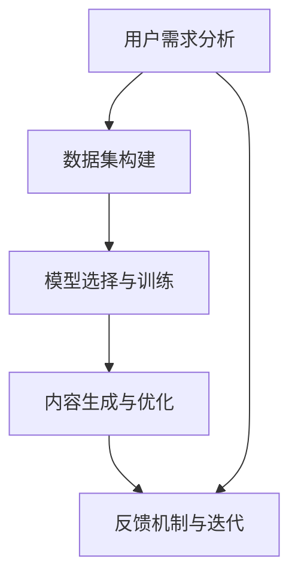
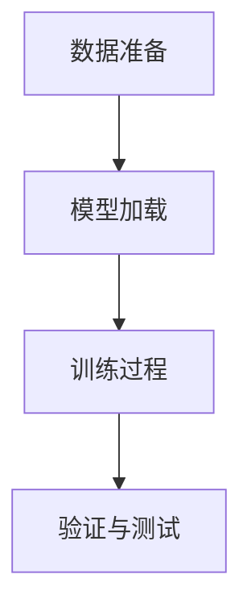

                 

# AI创业坚持：以用户为中心的内容创作

## 1. 背景介绍

### 1.1 问题由来

随着人工智能(AI)技术的迅猛发展，内容创作领域逐渐被AI所渗透。然而，在AI内容创作的浪潮中，过度关注技术而忽视用户体验的情况普遍存在。实际上，AI创业的成功关键在于深入理解用户需求，并将这些需求转化为技术突破。本文旨在探讨如何以用户为中心进行内容创作，涵盖数据收集、模型训练、内容生成等多个环节，以及相关的技术工具和资源。

### 1.2 问题核心关键点

- **用户需求分析**：了解用户最需要哪些内容，以及他们如何获取和评价内容。
- **数据集构建**：构建高质量的数据集，用以训练和优化AI模型。
- **模型选择与训练**：选择适当的AI模型，并使用合适的训练策略优化模型性能。
- **内容生成与优化**：设计合理的生成算法，保证生成的内容质量与用户需求一致。
- **反馈机制与迭代**：建立用户反馈机制，根据用户反馈持续优化内容生成模型。

## 2. 核心概念与联系

### 2.1 核心概念概述

- **用户需求分析**：通过调研、访谈等方式获取用户需求，了解用户的痛点、偏好和期望。
- **数据集构建**：根据用户需求，收集、标注并整理出有代表性的数据集，供模型训练使用。
- **模型选择与训练**：选择合适的AI模型架构，并使用数据集进行训练，优化模型参数。
- **内容生成与优化**：使用训练好的模型，生成与用户需求相匹配的内容，并进行内容质量提升。
- **反馈机制与迭代**：建立用户反馈渠道，持续收集用户评价，并据此调整模型参数和生成算法。

### 2.2 核心概念原理和架构的 Mermaid 流程图(Mermaid 流程节点中不要有括号、逗号等特殊字符)



通过此流程图，我们可以看到从用户需求分析开始，到数据集构建、模型训练、内容生成，再到用户反馈与模型迭代，形成了一个闭环的AI内容创作流程。

## 3. 核心算法原理 & 具体操作步骤

### 3.1 算法原理概述

以用户为中心的内容创作，其核心算法原理在于理解用户需求，并使用AI技术生成符合用户期望的内容。具体流程包括：

1. **数据收集与标注**：根据用户需求收集数据，并标注出用户关注的关键信息。
2. **模型训练与优化**：选择合适的AI模型，使用标注数据训练模型，并根据性能反馈调整模型参数。
3. **内容生成与优化**：使用训练好的模型生成内容，并根据用户反馈进行内容质量优化。
4. **迭代与反馈**：持续收集用户反馈，不断迭代模型，提升内容创作效果。

### 3.2 算法步骤详解

#### 3.2.1 数据收集与标注

数据收集与标注是内容创作的基础。通常，数据收集分为线上与线下两个部分：

- **线上数据收集**：通过用户行为数据（如浏览记录、评论内容等）自动采集，例如使用爬虫抓取新闻网站的文章标题和摘要。
- **线下数据收集**：通过问卷调查、访谈等方式直接获取用户需求，例如询问用户对某一领域的偏好和期望。

数据标注需要专业标注人员对收集的数据进行详细标注，确保数据的质量和代表性。标注内容通常包括文本内容、情感倾向、用户兴趣等。

#### 3.2.2 模型选择与训练

选择合适的AI模型是内容创作的关键。常见的AI模型包括自然语言处理(NLP)模型、图像生成模型等。例如，使用BERT模型进行文本分类和情感分析，使用GAN模型进行图像生成。

模型训练需要选择合适的训练数据集和优化算法。常用的训练数据集如GLUE数据集、COCO数据集等。常用的优化算法包括Adam、SGD等。训练过程需要设置合适的超参数，如学习率、批大小、迭代轮数等，以避免过拟合。

#### 3.2.3 内容生成与优化

内容生成是AI内容创作的最后一步。常见的生成算法包括基于模板的生成、基于变分自编码器(VAE)的生成等。例如，使用GPT-3进行文本生成，使用VAE进行图像生成。

内容优化需要设计合理的评估指标，如BLEU、ROUGE等，用于衡量生成内容的质量。同时，根据用户反馈进行内容风格和语调的调整，提升内容满意度。

#### 3.2.4 迭代与反馈

内容创作的迭代过程需要不断收集用户反馈，并据此调整模型和算法。常见的反馈方式包括：

- **线上反馈**：通过用户评论、评分等直接收集反馈信息。
- **线下反馈**：通过访谈、问卷等方式深入了解用户需求和满意度。

根据反馈信息，调整模型参数和生成算法，提升内容创作效果。

### 3.3 算法优缺点

#### 3.3.1 优点

1. **高效性**：AI内容创作能大幅提升内容生成速度，缩短创作周期。
2. **多样性**：AI模型能生成大量多样化的内容，满足不同用户的需求。
3. **可定制性**：可以根据用户需求定制内容生成模型，提供更加个性化的服务。

#### 3.3.2 缺点

1. **准确性问题**：AI内容创作可能存在生成内容质量不高、语义不连贯等问题。
2. **缺乏人性化**：生成的内容可能缺乏人类情感和思维的深度，难以触及用户的情感共鸣。
3. **伦理问题**：AI内容创作中可能存在版权、隐私等问题，需要特别注意。

### 3.4 算法应用领域

AI内容创作在多个领域都有广泛应用，例如：

- **内容生成**：使用AI生成文章、新闻、博客等。
- **个性化推荐**：根据用户偏好推荐个性化内容。
- **智能客服**：使用AI与用户进行自然语言交互，解答用户问题。
- **教育培训**：根据学生学习进度和兴趣推荐个性化学习内容。
- **广告营销**：根据用户行为和偏好生成个性化广告内容。

## 4. 数学模型和公式 & 详细讲解 & 举例说明

### 4.1 数学模型构建

以自然语言处理(NLP)中的文本分类任务为例，其数学模型构建过程如下：

- **输入**：文本数据集 $\{(x_i, y_i)\}_{i=1}^N$，其中 $x_i$ 为文本，$y_i$ 为分类标签。
- **输出**：模型参数 $\theta$，表示生成文本的权重。
- **损失函数**：交叉熵损失函数 $\mathcal{L}(\theta) = -\frac{1}{N}\sum_{i=1}^N \sum_{j=1}^K y_{ij} \log p_{ij}$，其中 $K$ 为分类标签数量，$p_{ij}$ 为模型在输入 $x_i$ 下生成标签 $j$ 的概率。

### 4.2 公式推导过程

以BERT模型的训练为例，其训练过程的公式推导如下：

1. **输入**：文本数据集 $\{(x_i, y_i)\}_{i=1}^N$。
2. **隐藏表示**：使用BERT模型将输入文本转化为隐藏表示 $h_i = BERT(x_i)$。
3. **分类层**：在隐藏表示上添加分类层，生成分类概率 $p_i = softmax(W \cdot h_i + b)$，其中 $W$ 为分类层权重，$b$ 为偏置项。
4. **损失函数**：交叉熵损失函数 $\mathcal{L}(W) = -\frac{1}{N}\sum_{i=1}^N \sum_{j=1}^K y_{ij} \log p_{ij}$。
5. **优化目标**：最小化损失函数，优化分类层权重 $W$。

### 4.3 案例分析与讲解

#### 4.3.1 BERT模型训练

以BERT模型的文本分类任务为例，其训练过程如下：

1. **数据准备**：准备文本数据集和标签，分为训练集、验证集和测试集。
2. **模型加载**：加载预训练的BERT模型。
3. **训练过程**：在训练集上使用交叉熵损失函数，进行前向传播和反向传播，更新模型参数。
4. **验证与测试**：在验证集和测试集上评估模型性能，调整超参数和模型结构。

通过训练，BERT模型能自动学习文本中的语义信息，生成准确分类结果。训练过程的流程图如下：



## 5. 项目实践：代码实例和详细解释说明

### 5.1 开发环境搭建

#### 5.1.1 安装PyTorch和Transformers

```bash
pip install torch torchtext transformers
```

#### 5.1.2 数据准备

```python
from torchtext.data import Field, LabelField, TabularDataset
from torchtext.vocab import GloVe, FastText

# 定义文本和标签字段
TEXT = Field(tokenize='spacy', batch_first=True)
LABEL = LabelField(dtype=torch.int64)

# 加载数据集
train_data, test_data = TabularDataset.splits(
    path='path/to/data',
    train='train.csv',
    test='test.csv',
    format='csv',
    fields=[('text', TEXT), ('label', LABEL)]
)

# 构建词汇表
TEXT.build_vocab(train_data, unk_init=GloVe('6B', 300, ".word2vec") + FastText('6B', 300, ".word2vec"))

# 构建标签集
LABEL.build_vocab(train_data)

# 加载预训练的BERT模型
from transformers import BertModel, BertTokenizer

tokenizer = BertTokenizer.from_pretrained('bert-base-cased')
model = BertModel.from_pretrained('bert-base-cased')
```

### 5.2 源代码详细实现

#### 5.2.1 定义模型

```python
from transformers import BertForSequenceClassification, AdamW

# 定义模型
model = BertForSequenceClassification.from_pretrained('bert-base-cased', num_labels=2)
```

#### 5.2.2 定义优化器

```python
optimizer = AdamW(model.parameters(), lr=2e-5)
```

#### 5.2.3 训练过程

```python
from torch.utils.data import DataLoader
from tqdm import tqdm

# 定义训练集数据集
train_loader = DataLoader(train_data, batch_size=16, shuffle=True)

# 训练过程
for epoch in range(5):
    for batch in tqdm(train_loader):
        input_ids, attention_mask, labels = batch
        model.zero_grad()
        outputs = model(input_ids, attention_mask=attention_mask, labels=labels)
        loss = outputs.loss
        loss.backward()
        optimizer.step()
```

### 5.3 代码解读与分析

#### 5.3.1 定义模型和优化器

```python
# 定义模型
model = BertForSequenceClassification.from_pretrained('bert-base-cased', num_labels=2)

# 定义优化器
optimizer = AdamW(model.parameters(), lr=2e-5)
```

使用BertForSequenceClassification作为模型的定义，并从预训练模型中加载模型参数。使用AdamW作为优化器，学习率为2e-5。

#### 5.3.2 训练过程

```python
# 定义训练集数据集
train_loader = DataLoader(train_data, batch_size=16, shuffle=True)

# 训练过程
for epoch in range(5):
    for batch in tqdm(train_loader):
        input_ids, attention_mask, labels = batch
        model.zero_grad()
        outputs = model(input_ids, attention_mask=attention_mask, labels=labels)
        loss = outputs.loss
        loss.backward()
        optimizer.step()
```

在训练过程中，使用DataLoader将数据集分批次加载。在每个批次上，进行前向传播和反向传播，更新模型参数。使用tqdm显示进度条，确保训练过程的可观察性。

### 5.4 运行结果展示

训练完成后，使用测试集评估模型性能：

```python
from sklearn.metrics import accuracy_score

test_loader = DataLoader(test_data, batch_size=16, shuffle=False)

# 评估过程
model.eval()
with torch.no_grad():
    correct = 0
    total = 0
    for batch in test_loader:
        input_ids, attention_mask, labels = batch
        outputs = model(input_ids, attention_mask=attention_mask, labels=labels)
        _, predicted = torch.max(outputs.logits, dim=1)
        total += labels.size(0)
        correct += (predicted == labels).sum().item()

accuracy = correct / total
print(f'Accuracy: {accuracy:.2f}')
```

通过计算准确率，评估模型的分类效果。

## 6. 实际应用场景

### 6.1 内容生成

#### 6.1.1 场景描述

在内容生成领域，使用AI技术可以生成大量高质量的文章、新闻、博客等。例如，使用GPT-3生成产品介绍、技术文章等。

#### 6.1.2 技术实现

使用GPT-3作为生成模型，输入用户需求或文本摘要，生成相关内容。可以通过调整提示模板(Prompt Template)来指导生成过程，例如：

```python
from transformers import GPT3LMHeadModel, GPT3Tokenizer

tokenizer = GPT3Tokenizer.from_pretrained('gpt3')
model = GPT3LMHeadModel.from_pretrained('gpt3')

prompt = "什么是人工智能?"
tokens = tokenizer(prompt, return_tensors='pt')
generated_text = model.generate(tokens, max_length=100)

print(tokenizer.decode(generated_text[0], skip_special_tokens=True))
```

通过生成模型，可以输出满足用户需求的内容。

### 6.2 个性化推荐

#### 6.2.1 场景描述

在个性化推荐领域，使用AI技术可以生成个性化内容推荐，提升用户体验。例如，使用BERT模型进行用户兴趣分析，生成个性化文章推荐。

#### 6.2.2 技术实现

使用BERT模型作为推荐模型，输入用户历史行为数据，生成个性化文章推荐。可以通过调整推荐算法和模型参数来优化推荐效果，例如：

```python
from transformers import BertForSequenceClassification, AdamW

# 定义模型
model = BertForSequenceClassification.from_pretrained('bert-base-cased', num_labels=10)

# 定义优化器
optimizer = AdamW(model.parameters(), lr=2e-5)

# 定义数据集
train_data = load_data('train.csv')
test_data = load_data('test.csv')

# 定义训练过程
for epoch in range(5):
    for batch in train_loader:
        input_ids, attention_mask, labels = batch
        model.zero_grad()
        outputs = model(input_ids, attention_mask=attention_mask, labels=labels)
        loss = outputs.loss
        loss.backward()
        optimizer.step()

# 定义推荐过程
def recommend(user_id, num_recommendations):
    user_data = get_user_data(user_id)
    recommendations = model.predict(user_data, top_k=num_recommendations)
    return recommendations
```

通过推荐模型，可以生成满足用户兴趣的文章推荐。

## 7. 工具和资源推荐

### 7.1 学习资源推荐

#### 7.1.1 TensorFlow官方文档

- 网址：https://www.tensorflow.org/
- 内容：包括TensorFlow的基础教程、API文档、示例代码等，适合初学者和进阶开发者。

#### 7.1.2 PyTorch官方文档

- 网址：https://pytorch.org/docs/stable/
- 内容：包括PyTorch的基础教程、API文档、示例代码等，适合初学者和进阶开发者。

#### 7.1.3 自然语言处理(NLP)课程

- 课程：斯坦福大学CS224N《深度学习自然语言处理》
- 网址：https://web.stanford.edu/class/cs224n/
- 内容：包括NLP的基础概念、模型架构、实际应用等，适合NLP领域的入门者和进阶开发者。

### 7.2 开发工具推荐

#### 7.2.1 Jupyter Notebook

- 功能：支持Python编程、数据分析、机器学习等，支持代码运行、数据可视化和版本控制。
- 网址：https://jupyter.org/
- 安装：通过conda或pip安装。

#### 7.2.2 Google Colab

- 功能：支持Python编程、深度学习等，提供免费GPU/TPU算力。
- 网址：https://colab.research.google.com/
- 安装：直接访问Google Colab网站。

#### 7.2.3 Anaconda

- 功能：提供Python环境管理、包管理、数据分析等。
- 网址：https://www.anaconda.com/
- 安装：通过下载Anaconda安装包进行安装。

### 7.3 相关论文推荐

#### 7.3.1 自然语言处理(NLP)论文

- 论文："Attention is All You Need"
- 作者：Vaswani等
- 网址：https://arxiv.org/abs/1706.03762
- 内容：介绍Transformer模型，开创了大规模预训练语言模型的新纪元。

#### 7.3.2 深度学习(Deep Learning)论文

- 论文："Language Models are Unsupervised Multitask Learners"
- 作者：Radford等
- 网址：https://arxiv.org/abs/1910.03427
- 内容：展示了大规模语言模型在零样本学习中的强大能力。

#### 7.3.3 人工智能(AI)论文

- 论文："Zero-shot learning for semantic understanding"
- 作者：Houlsby等
- 网址：https://arxiv.org/abs/1902.09300
- 内容：介绍零样本学习在自然语言理解中的重要性和实现方法。

## 8. 总结：未来发展趋势与挑战

### 8.1 总结

本文系统介绍了以用户为中心的内容创作流程，涵盖数据收集、模型训练、内容生成等多个环节，并提供了详细的代码实例和分析。通过这些技术方法和工具，开发者可以高效地进行AI内容创作，提升内容质量和用户体验。

### 8.2 未来发展趋势

未来，以用户为中心的内容创作将呈现以下几个发展趋势：

1. **个性化推荐**：随着用户数据的积累和模型技术的进步，个性化推荐将更加精准和高效。
2. **自然语言生成**：自然语言生成技术将不断提升，生成内容的质量和多样性将显著增强。
3. **跨领域应用**：内容创作将拓展到更多领域，如金融、医疗、教育等，为不同行业提供智能化服务。
4. **跨模态融合**：将文本、图像、视频等多种模态信息进行融合，提升内容创作的综合能力。

### 8.3 面临的挑战

尽管AI内容创作技术取得了显著进展，但仍面临以下挑战：

1. **数据隐私问题**：用户数据隐私保护是大规模数据集构建中的关键问题，需要严格遵守数据隐私法规。
2. **生成内容质量**：生成内容的质量和多样性仍需提升，避免出现语义不连贯、内容重复等问题。
3. **用户互动**：如何与用户进行自然的交互和反馈，需要进一步研究和优化。
4. **伦理和合规**：内容创作中可能涉及版权、隐私等问题，需要建立伦理和合规机制。

### 8.4 研究展望

未来，AI内容创作研究将进一步深入，以下几个方向值得探索：

1. **用户行为分析**：深入研究用户行为数据，优化内容推荐和生成策略。
2. **多模态内容创作**：探索多模态内容创作技术，提升内容的综合性和多样性。
3. **交互式内容创作**：研究如何与用户进行交互，提升用户参与度和满意度。
4. **模型融合与创新**：探索新的模型架构和优化算法，提升内容创作效果。

总之，AI内容创作将不断进化，为内容创作和信息传播带来新的变革。开发者需不断创新和突破，以更好地服务于用户。

## 9. 附录：常见问题与解答

### 9.1 常见问题

1. **数据收集的注意事项是什么？**
   - 答：确保数据来源合法、标注准确，避免侵犯用户隐私。

2. **如何选择合适的AI模型？**
   - 答：根据任务需求选择合适的模型，如BERT用于文本分类，GAN用于图像生成。

3. **内容生成的质量如何保证？**
   - 答：通过调整提示模板、优化生成算法等方式，提升生成内容的质量和多样性。

4. **如何处理内容生成的伦理问题？**
   - 答：建立伦理审查机制，避免生成有害、侵权内容。

### 9.2 解答

通过系统性的分析和实践，开发者可以更好地理解AI内容创作的原理和应用，掌握关键技术和工具，提升内容创作的效率和效果。未来，随着技术的不断进步和应用的广泛拓展，AI内容创作将带来更多创新和变革，为人类带来更加丰富和智能的信息体验。

---

作者：禅与计算机程序设计艺术 / Zen and the Art of Computer Programming

