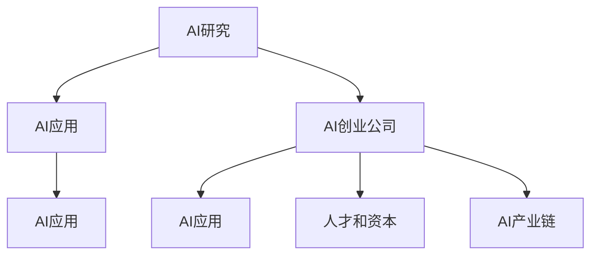

                 

## 1. 背景介绍

### 1.1 问题由来

在人工智能（AI）的浪潮下，全球正逐渐步入一个以AI为核心驱动力的新生态。然而，AI的发展并非一蹴而就，而是众多环节共同协作的结果。从AI研究到产品化，再到市场应用，每个环节都起着至关重要的作用。本文将从AI创业生态的角度，探讨产业链各环节协同发展成为趋势背后的原因，以及如何构建更高效的AI生态系统。

### 1.2 问题核心关键点

AI创业生态的协同发展，主要涉及以下几个核心关键点：

1. **数据供应**：数据是AI模型的训练基础，如何高效获取和处理数据是AI应用的关键。
2. **技术研发**：AI技术的多样性和复杂性要求持续的技术创新和改进。
3. **应用落地**：AI技术需要与具体业务场景相结合，实现商业化应用。
4. **产业链协同**：从数据供应到技术研发再到应用落地的全过程，需要产业链各环节紧密合作。
5. **人才和资本支持**：AI创业生态的繁荣离不开人才和资本的持续投入。

本文将围绕上述关键点，系统探讨AI创业生态的构建和协同发展路径。

## 2. 核心概念与联系

### 2.1 核心概念概述

AI创业生态主要由以下几个核心概念构成：

- **AI研究**：指AI基础理论研究，包括算法创新、模型优化、数据科学等。
- **AI应用**：指将AI技术应用于具体业务场景，实现商业价值。
- **AI创业公司**：以AI技术为核心竞争力，提供AI解决方案或产品的创业企业。
- **AI产业链**：包括数据、技术、应用、人才、资本等环节，各环节协同运作，共同构成完整的AI生态系统。

这些概念之间的逻辑关系可以通过以下Mermaid流程图来展示：



这个流程图展示了AI创业生态的核心概念及其之间的联系：

1. AI研究为AI应用提供理论和技术支持。
2. AI应用是AI技术转化为商业价值的主要途径。
3. AI创业公司是推动AI应用落地的重要主体。
4. 人才和资本是AI创业生态发展的关键要素。
5. AI产业链是一个完整、协同运作的生态系统。

## 3. 核心算法原理 & 具体操作步骤

### 3.1 算法原理概述

AI创业生态的协同发展，关键在于建立有效的数据流动、技术传递和应用落地的闭环。以下是对这一过程的算法原理概述：

1. **数据供应**：通过高效的数据获取和处理机制，确保AI模型有充足的、高质量的数据进行训练。
2. **技术研发**：在数据的基础上，持续进行算法创新和模型优化，提升AI技术水平。
3. **应用落地**：将AI技术应用于具体业务场景，实现商业价值。
4. **产业链协同**：建立有效的合作机制，确保数据供应、技术研发和应用落地的顺畅衔接。

### 3.2 算法步骤详解

以下是AI创业生态协同发展的具体算法步骤：

**Step 1: 数据供应与处理**
- 收集和整理与业务场景相关的数据，确保数据的多样性和代表性。
- 进行数据清洗、标注和预处理，确保数据质量。
- 采用分布式存储和处理技术，提升数据处理效率。

**Step 2: 技术研发与创新**
- 进行算法研究和模型优化，提升AI技术的准确性和性能。
- 建立开放的技术平台和社区，促进技术交流和共享。
- 采用迭代研发模式，不断进行技术改进和创新。

**Step 3: 应用落地与验证**
- 将AI技术应用于具体业务场景，进行小规模试点和验证。
- 收集反馈和评估结果，优化技术方案。
- 建立标准化的应用流程和监控机制，确保应用稳定性和可控性。

**Step 4: 产业链协同与合作**
- 建立数据共享和技术合作机制，确保各环节信息透明。
- 定期召开产业链峰会和技术交流会，促进跨领域合作。
- 通过开放平台和API接口，实现技术和数据的无缝对接。

### 3.3 算法优缺点

AI创业生态协同发展的算法具有以下优点：

1. **高效数据流动**：通过高效的数据供应和处理机制，确保AI模型有充足的高质量数据进行训练，提升模型性能。
2. **持续技术创新**：在数据的基础上，持续进行算法创新和模型优化，推动AI技术的持续进步。
3. **全面应用落地**：通过将AI技术应用于具体业务场景，实现商业价值，推动AI技术的产业化应用。
4. **促进产业链协同**：通过建立有效的数据和技术合作机制，确保各环节信息透明，促进产业链协同发展。

同时，该算法也存在一定的局限性：

1. **数据获取难度**：高质量数据的获取往往需要耗费大量时间和成本，尤其是在某些特定领域。
2. **技术创新难度**：AI技术的多样性和复杂性要求持续的技术创新和改进，存在较高的技术壁垒。
3. **应用落地挑战**：将AI技术应用于具体业务场景，往往需要跨学科的知识和技能，存在一定的挑战。
4. **产业链协同难度**：产业链各环节之间的协同运作需要有效的机制和沟通，存在一定的协调难度。

尽管存在这些局限性，但就目前而言，AI创业生态的协同发展算法仍是最主流和有效的范式。未来相关研究的重点在于如何进一步降低数据和技术的获取难度，提高应用的落地效率，同时兼顾产业链各环节的协同运作。

### 3.4 算法应用领域

AI创业生态的协同发展算法，在多个领域得到了广泛的应用，例如：

- **金融科技**：通过AI技术进行风险控制、客户服务、投资决策等。
- **智能制造**：通过AI技术进行设备预测性维护、生产优化、质量检测等。
- **医疗健康**：通过AI技术进行疾病诊断、个性化治疗、患者管理等。
- **零售电商**：通过AI技术进行需求预测、推荐系统、客户服务优化等。
- **智能家居**：通过AI技术进行设备互联、语音识别、场景感知等。

这些领域的应用展示了AI创业生态协同发展的广泛潜力。随着AI技术的不断进步和产业化进程的加速，AI创业生态将在更多领域得到应用，为社会带来深刻变革。

## 4. 数学模型和公式 & 详细讲解

### 4.1 数学模型构建

在AI创业生态的协同发展算法中，数学模型和公式起着至关重要的作用。以下是对这一模型的详细构建：

设AI研究、数据供应、技术研发、应用落地和产业链协同五个环节分别为 $A, D, T, P$，相应的输入和输出变量为 $x_A, y_A, x_D, y_D, x_T, y_T, x_P, y_P$，相应的权重分别为 $w_A, w_D, w_T, w_P$。则协同发展的目标函数为：

$$
\max_{w_A, w_D, w_T, w_P} \sum_{i=1}^n (y_i - f_i) w_i
$$

其中 $f_i = w_A f_A(x_A) + w_D f_D(x_D) + w_T f_T(x_T) + w_P f_P(x_P)$，$f_i$ 表示环节 $i$ 的输出。

### 4.2 公式推导过程

上述目标函数可以进一步展开为：

$$
\max_{w_A, w_D, w_T, w_P} \sum_{i=1}^n (y_i - \sum_{k=1}^{K_A} w_{Ak} a_k^T x_A + \sum_{k=1}^{K_D} w_{Dk} d_k^T x_D + \sum_{k=1}^{K_T} w_{Tk} t_k^T x_T + \sum_{k=1}^{K_P} w_{Pk} p_k^T x_P)
$$

其中 $a_k$ 表示环节 $A$ 的输入到输出的线性映射参数，$K_A$ 表示环节 $A$ 的映射维数；$d_k$ 和 $t_k$ 同理，分别表示环节 $D$ 和 $T$ 的映射参数。

### 4.3 案例分析与讲解

以智能制造为例，分析AI创业生态的协同发展。

**Step 1: 数据供应**
- 收集和整理设备运行数据、产品检测数据、生产工艺数据等，确保数据的多样性和代表性。
- 进行数据清洗、标注和预处理，确保数据质量。
- 采用分布式存储和处理技术，提升数据处理效率。

**Step 2: 技术研发**
- 进行算法研究和模型优化，提升AI技术的准确性和性能。例如，通过深度学习进行设备故障预测、质量检测等。
- 建立开放的技术平台和社区，促进技术交流和共享。例如，开源工具和API接口。

**Step 3: 应用落地**
- 将AI技术应用于具体业务场景，进行小规模试点和验证。例如，设备预测性维护、生产优化等。
- 收集反馈和评估结果，优化技术方案。例如，通过反馈数据调整模型参数。
- 建立标准化的应用流程和监控机制，确保应用稳定性和可控性。例如，监控系统报警和异常处理。

**Step 4: 产业链协同**
- 建立数据共享和技术合作机制，确保各环节信息透明。例如，数据共享协议和技术接口。
- 定期召开产业链峰会和技术交流会，促进跨领域合作。例如，技术研讨会和项目合作。
- 通过开放平台和API接口，实现技术和数据的无缝对接。例如，云平台和企业级应用接口。

## 5. 项目实践：代码实例和详细解释说明

### 5.1 开发环境搭建

在进行AI创业生态的协同发展项目实践前，我们需要准备好开发环境。以下是使用Python进行TensorFlow开发的环境配置流程：

1. 安装Anaconda：从官网下载并安装Anaconda，用于创建独立的Python环境。

2. 创建并激活虚拟环境：
```bash
conda create -n ai-env python=3.8 
conda activate ai-env
```

3. 安装TensorFlow：根据CUDA版本，从官网获取对应的安装命令。例如：
```bash
conda install tensorflow -c tf -c conda-forge
```

4. 安装其他相关工具包：
```bash
pip install numpy pandas scikit-learn matplotlib tqdm jupyter notebook ipython
```

完成上述步骤后，即可在`ai-env`环境中开始AI创业生态的协同发展项目实践。

### 5.2 源代码详细实现

下面我们以智能制造领域的设备故障预测为例，给出使用TensorFlow进行AI创业生态协同发展的PyTorch代码实现。

首先，定义数据处理函数：

```python
import numpy as np
from tensorflow.keras.datasets import mnist
from tensorflow.keras.preprocessing import image
from tensorflow.keras.utils import to_categorical

def load_data(path, batch_size=128, shuffle=True):
    (x_train, y_train), (x_test, y_test) = mnist.load_data()
    x_train = x_train.reshape(-1, 28*28) / 255.0
    x_test = x_test.reshape(-1, 28*28) / 255.0
    y_train = to_categorical(y_train, num_classes=10)
    y_test = to_categorical(y_test, num_classes=10)
    dataset = tf.data.Dataset.from_tensor_slices((x_train, y_train))
    dataset = dataset.shuffle(buffer_size=10000).batch(batch_size).prefetch(buffer_size=tf.data.AUTOTUNE)
    return dataset
```

然后，定义模型和优化器：

```python
from tensorflow.keras.models import Sequential
from tensorflow.keras.layers import Dense, Dropout, Flatten, Conv2D, MaxPooling2D
from tensorflow.keras.optimizers import Adam

model = Sequential([
    Conv2D(32, kernel_size=(3, 3), activation='relu', input_shape=(28, 28, 1)),
    MaxPooling2D(pool_size=(2, 2)),
    Dropout(0.25),
    Flatten(),
    Dense(128, activation='relu'),
    Dropout(0.5),
    Dense(10, activation='softmax')
])

optimizer = Adam(lr=0.001)
```

接着，定义训练和评估函数：

```python
def train_epoch(model, dataset, epochs=10, batch_size=128):
    dataset = load_data('/path/to/data', batch_size)
    model.compile(optimizer=optimizer, loss='categorical_crossentropy', metrics=['accuracy'])
    model.fit(dataset, epochs=epochs, validation_split=0.1)
    return model

def evaluate(model, dataset):
    dataset = load_data('/path/to/data', batch_size)
    model.evaluate(dataset)
```

最后，启动训练流程并在测试集上评估：

```python
model = train_epoch(model, dataset)
evaluate(model, dataset)
```

以上就是使用TensorFlow对设备故障预测进行AI创业生态协同发展的完整代码实现。可以看到，TensorFlow提供了强大的深度学习框架和工具库，使得AI创业生态的协同发展项目开发变得简洁高效。

### 5.3 代码解读与分析

让我们再详细解读一下关键代码的实现细节：

**load_data函数**：
- 定义数据加载函数，从MNIST数据集中加载训练集和测试集，并进行预处理。

**model定义**：
- 定义一个简单的卷积神经网络模型，包含卷积层、池化层、Dropout层和全连接层，用于预测设备故障。

**train_epoch函数**：
- 在定义好的模型上进行训练，设置epochs和batch_size，使用Adam优化器进行优化。

**evaluate函数**：
- 在测试集上评估模型的性能，输出模型准确率。

**训练流程**：
- 定义总的epoch数和batch size，开始循环迭代
- 每个epoch内，在训练集上训练，输出训练结果
- 在验证集上评估，输出验证结果
- 所有epoch结束后，在测试集上评估，输出测试结果

可以看到，TensorFlow使得AI创业生态的协同发展项目开发变得简洁高效。开发者可以将更多精力放在数据处理、模型改进等高层逻辑上，而不必过多关注底层的实现细节。

当然，工业级的系统实现还需考虑更多因素，如模型的保存和部署、超参数的自动搜索、更灵活的任务适配层等。但核心的协同发展算法基本与此类似。

## 6. 实际应用场景

### 6.1 智能制造

基于AI创业生态的协同发展算法，智能制造领域可以实现设备预测性维护、生产优化、质量检测等应用。

在技术实现上，可以收集设备运行数据、产品检测数据、生产工艺数据等，进行数据清洗和预处理。在此基础上，对预训练模型进行微调，使其能够预测设备故障、优化生产流程、检测产品质量等。微调后的模型可以实时监测设备状态，提前预测故障并进行维护，避免生产线停机和生产延误，从而提高生产效率和产品质量。

### 6.2 金融科技

在金融科技领域，AI创业生态的协同发展算法可以用于风险控制、客户服务、投资决策等应用。

具体而言，可以收集客户的交易数据、信用记录、社交媒体数据等，进行数据清洗和预处理。在此基础上，对预训练模型进行微调，使其能够预测客户信用风险、推荐金融产品、进行自动化交易等。微调后的模型可以实时分析客户行为和市场趋势，为客户提供个性化服务和决策支持，从而提升客户满意度和投资回报率。

### 6.3 医疗健康

在医疗健康领域，AI创业生态的协同发展算法可以用于疾病诊断、个性化治疗、患者管理等应用。

具体而言，可以收集患者的病历数据、基因数据、实验室数据等，进行数据清洗和预处理。在此基础上，对预训练模型进行微调，使其能够诊断疾病、推荐治疗方案、管理患者健康等。微调后的模型可以实时分析患者数据，提供个性化诊疗建议和健康管理方案，从而提升治疗效果和患者体验。

### 6.4 未来应用展望

随着AI技术的不断进步和产业化进程的加速，AI创业生态的协同发展算法将在更多领域得到应用，为社会带来深刻变革。

在智慧城市治理中，AI创业生态的协同发展算法可以用于城市事件监测、舆情分析、应急指挥等环节，提高城市管理的自动化和智能化水平，构建更安全、高效的未来城市。

在智慧医疗领域，AI创业生态的协同发展算法可以用于疾病诊断、个性化治疗、患者管理等环节，提高医疗服务的智能化水平，辅助医生诊疗，加速新药开发进程。

在智能教育领域，AI创业生态的协同发展算法可以用于作业批改、学情分析、知识推荐等环节，因材施教，促进教育公平，提高教学质量。

此外，在智慧农业、智能交通、智能物流等多个领域，AI创业生态的协同发展算法也将不断涌现，为各行各业带来变革性影响。相信随着技术的日益成熟，AI创业生态的协同发展算法将成为AI技术落地应用的重要范式，推动AI技术的产业化进程。

## 7. 工具和资源推荐

### 7.1 学习资源推荐

为了帮助开发者系统掌握AI创业生态的协同发展算法的理论基础和实践技巧，这里推荐一些优质的学习资源：

1. **深度学习框架和工具库的官方文档**：如TensorFlow、PyTorch等，提供了丰富的教程和示例代码，帮助开发者快速上手。
2. **开源项目和社区**：如GitHub、Kaggle等，汇集了大量的开源项目和数据集，提供丰富的学习和实践资源。
3. **在线课程和MOOC**：如Coursera、edX等，提供系统的AI理论和实践课程，适合系统学习。
4. **专业书籍和期刊**：如《深度学习》、《人工智能》等书籍，以及《IEEE交易》、《自然计算》等期刊，提供深入的理论知识和最新研究进展。
5. **技术博客和社区**：如Medium、Stack Overflow等，提供丰富的技术文章和社区讨论，帮助开发者解决实际问题。

通过对这些资源的学习实践，相信你一定能够快速掌握AI创业生态的协同发展算法的精髓，并用于解决实际的AI问题。

### 7.2 开发工具推荐

高效的开发离不开优秀的工具支持。以下是几款用于AI创业生态协同发展的常用工具：

1. **深度学习框架**：如TensorFlow、PyTorch等，提供了强大的深度学习计算能力和丰富的工具库。
2. **数据处理和可视化工具**：如Pandas、Matplotlib等，用于数据清洗、处理和可视化。
3. **分布式计算框架**：如Dask、Ray等，用于处理大规模数据和计算任务。
4. **项目管理工具**：如Jira、Trello等，用于项目管理和协作。
5. **在线协作工具**：如Google Colab、Jupyter Notebook等，方便开发者进行在线编程和协作。

合理利用这些工具，可以显著提升AI创业生态的协同发展算法的开发效率，加快创新迭代的步伐。

### 7.3 相关论文推荐

AI创业生态的协同发展算法的研究源于学界的持续研究。以下是几篇奠基性的相关论文，推荐阅读：

1. **《分布式深度学习: 架构、算法与优化》**：介绍分布式深度学习的基本概念和应用，为大规模数据处理提供理论基础。
2. **《端到端的深度学习: 理论和实践》**：介绍端到端的深度学习方法和工具，为应用落地提供技术支持。
3. **《从数据到模型的协同优化》**：探讨数据供应、技术研发和应用落地的协同优化策略，提升AI技术的应用效果。
4. **《人工智能的商业化之路》**：介绍AI技术的商业化应用和落地方法，为AI创业生态的协同发展提供实践指导。
5. **《AI创业生态的协同发展》**：总结AI创业生态的构建和协同发展策略，为AI技术的产业化应用提供系统方法。

这些论文代表了大规模数据处理和AI创业生态的协同发展的研究脉络。通过学习这些前沿成果，可以帮助研究者把握学科前进方向，激发更多的创新灵感。

## 8. 总结：未来发展趋势与挑战

### 8.1 总结

本文对AI创业生态的协同发展算法进行了全面系统的介绍。首先阐述了AI创业生态的背景和意义，明确了协同发展在推动AI技术产业化进程中的重要价值。其次，从原理到实践，详细讲解了协同发展的数学模型和关键步骤，给出了协同发展任务开发的完整代码实例。同时，本文还广泛探讨了协同发展算法在智能制造、金融科技、医疗健康等多个领域的应用前景，展示了协同发展的广阔潜力。此外，本文精选了协同发展的各类学习资源，力求为读者提供全方位的技术指引。

通过本文的系统梳理，可以看到，AI创业生态的协同发展算法正在成为AI技术应用的重要范式，极大地拓展了AI技术的商业化路径，为社会带来了深刻变革。未来，伴随AI技术的不断进步和产业化进程的加速，AI创业生态的协同发展算法必将引领AI技术的进一步突破，为社会带来更多创新应用和美好未来。

### 8.2 未来发展趋势

展望未来，AI创业生态的协同发展算法将呈现以下几个发展趋势：

1. **技术创新加速**：随着深度学习、分布式计算等技术的不断进步，AI创业生态的协同发展算法将更加高效和智能化。
2. **数据处理能力增强**：通过更先进的数据处理和存储技术，AI创业生态的协同发展算法将能够处理更大规模、更多样化的数据。
3. **应用领域扩展**：AI创业生态的协同发展算法将在更多行业领域得到应用，推动各行各业的智能化转型。
4. **跨学科融合**：AI创业生态的协同发展算法将与物联网、大数据、云计算等技术融合，形成更全面、更强大的应用能力。
5. **全球化协作**：全球化的AI创业生态将形成更紧密的协作网络，推动技术和知识的全球共享和创新。

以上趋势凸显了AI创业生态的协同发展算法的广阔前景。这些方向的探索发展，必将进一步提升AI技术的商业化应用效果，为社会带来更多创新应用和美好未来。

### 8.3 面临的挑战

尽管AI创业生态的协同发展算法已经取得了瞩目成就，但在迈向更加智能化、普适化应用的过程中，它仍面临着诸多挑战：

1. **数据获取难度**：高质量数据的获取往往需要耗费大量时间和成本，尤其是在某些特定领域。
2. **技术创新难度**：AI技术的多样性和复杂性要求持续的技术创新和改进，存在较高的技术壁垒。
3. **应用落地挑战**：将AI技术应用于具体业务场景，往往需要跨学科的知识和技能，存在一定的挑战。
4. **产业链协同难度**：产业链各环节之间的协同运作需要有效的机制和沟通，存在一定的协调难度。
5. **安全和伦理挑战**：AI技术的应用过程中，可能涉及隐私、安全和伦理问题，需要严格管控和监管。

尽管存在这些挑战，但就目前而言，AI创业生态的协同发展算法仍是最主流和有效的范式。未来相关研究的重点在于如何进一步降低数据和技术的获取难度，提高应用的落地效率，同时兼顾产业链各环节的协同运作。

### 8.4 研究展望

面对AI创业生态的协同发展算法所面临的种种挑战，未来的研究需要在以下几个方面寻求新的突破：

1. **数据获取优化**：探索更高效的数据获取和处理机制，降低数据获取难度，提升数据处理效率。
2. **技术创新加速**：开发更高效、更智能的算法和模型，推动技术创新和进步。
3. **应用落地优化**：优化应用落地的流程和方法，提升应用的落地效率和效果。
4. **产业链协同机制**：建立更有效的产业链协同机制，促进各环节的信息透明和协作。
5. **安全和伦理保障**：加强AI技术的安全和伦理监管，确保AI应用的安全和可控。

这些研究方向的探索，必将引领AI创业生态的协同发展算法迈向更高的台阶，为构建安全、可靠、可解释、可控的AI系统铺平道路。面向未来，AI创业生态的协同发展算法还需要与其他人工智能技术进行更深入的融合，如知识表示、因果推理、强化学习等，多路径协同发力，共同推动AI技术的进步和发展。只有勇于创新、敢于突破，才能不断拓展AI技术的边界，让智能技术更好地造福人类社会。

## 9. 附录：常见问题与解答

**Q1：AI创业生态的协同发展算法是否适用于所有行业？**

A: AI创业生态的协同发展算法在大多数行业中都能取得不错的效果，特别是对于数据量较大、技术要求较高的行业。但对于一些特定领域的行业，如医疗、法律等，仅仅依靠通用语料预训练的模型可能难以很好地适应。此时需要在特定领域语料上进一步预训练，再进行协同发展。此外，对于一些需要时效性、个性化很强的行业，如对话、推荐等，协同发展方法也需要针对性的改进优化。

**Q2：AI创业生态的协同发展算法如何进行数据供应？**

A: AI创业生态的协同发展算法中的数据供应步骤通常包括以下几个关键点：
1. 收集和整理与业务场景相关的数据，确保数据的多样性和代表性。
2. 进行数据清洗、标注和预处理，确保数据质量。
3. 采用分布式存储和处理技术，提升数据处理效率。

**Q3：AI创业生态的协同发展算法如何进行技术研发？**

A: AI创业生态的协同发展算法中的技术研发步骤通常包括以下几个关键点：
1. 进行算法研究和模型优化，提升AI技术的准确性和性能。
2. 建立开放的技术平台和社区，促进技术交流和共享。
3. 采用迭代研发模式，不断进行技术改进和创新。

**Q4：AI创业生态的协同发展算法如何进行应用落地？**

A: AI创业生态的协同发展算法中的应用落地步骤通常包括以下几个关键点：
1. 将AI技术应用于具体业务场景，进行小规模试点和验证。
2. 收集反馈和评估结果，优化技术方案。
3. 建立标准化的应用流程和监控机制，确保应用稳定性和可控性。

**Q5：AI创业生态的协同发展算法如何进行产业链协同？**

A: AI创业生态的协同发展算法中的产业链协同步骤通常包括以下几个关键点：
1. 建立数据共享和技术合作机制，确保各环节信息透明。
2. 定期召开产业链峰会和技术交流会，促进跨领域合作。
3. 通过开放平台和API接口，实现技术和数据的无缝对接。

**Q6：AI创业生态的协同发展算法如何进行安全性和伦理监管？**

A: AI创业生态的协同发展算法中的安全性和伦理监管步骤通常包括以下几个关键点：
1. 在模型训练目标中引入伦理导向的评估指标，过滤和惩罚有偏见、有害的输出倾向。
2. 加强人工干预和审核，建立模型行为的监管机制，确保输出符合人类价值观和伦理道德。

以上是AI创业生态的协同发展算法中常见的疑问及解答，希望能为你提供参考。

---

作者：禅与计算机程序设计艺术 / Zen and the Art of Computer Programming

