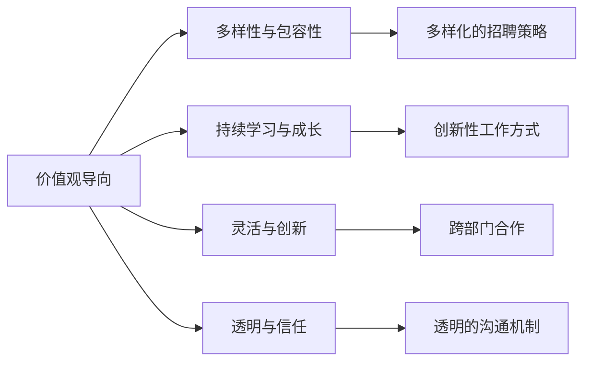

                 

# AI创业的团队文化：Lepton AI的人才理念

## 1. 背景介绍

### 1.1 问题由来
随着人工智能(AI)技术的不断成熟，越来越多的AI初创企业应运而生。这些企业往往面临人才短缺、团队管理困难等共性问题。如何营造良好的团队文化，吸引并留住顶级人才，成为决定AI创业成败的关键因素。

### 1.2 问题核心关键点
Lepton AI作为一家致力于AI基础研究和应用开发的初创企业，其独特的团队文化帮助其在激烈的市场竞争中脱颖而出。Lepton AI的人才理念主要包括以下几个方面：

1. **价值观导向**：Lepton AI注重员工的价值观与公司使命的契合度，强调创新、诚信、团队协作和客户导向。
2. **多样性与包容性**：Lepton AI提倡多样化的招聘策略，欢迎不同背景和经验的人才加入。
3. **持续学习与成长**：鼓励员工持续学习新知识，提供丰富的培训资源和内部交流机会。
4. **灵活与创新**：支持员工探索创新的工作方式，鼓励跨部门合作，以实现技术突破和产品创新。
5. **透明与信任**：建立透明的沟通机制，增强员工对公司决策的信任和参与感。

这些核心点构成了Lepton AI独特的团队文化，助力其在AI领域的发展。

### 1.3 问题研究意义
Lepton AI的人才理念不仅对公司自身的发展具有重要意义，也为其他AI创业企业提供了宝贵的参考。通过深入研究Lepton AI的人才理念，有助于理解AI领域的最佳实践，提升创业企业的竞争力和生存率。

## 2. 核心概念与联系

### 2.1 核心概念概述

为了更好地理解Lepton AI的人才理念，本节将介绍几个核心概念及其相互联系：

- **价值观导向**：指公司对员工的道德、伦理和行为准则的期望，是企业文化的重要组成部分。
- **多样性与包容性**：指在招聘和工作中尊重和接受不同背景和观点的态度和做法。
- **持续学习与成长**：强调终身学习的理念，通过培训和交流促进员工技能提升和职业发展。
- **灵活与创新**：鼓励员工尝试新的工作方式和方法，推动技术突破和产品创新。
- **透明与信任**：建立在开放和诚实的沟通基础上，建立员工对公司的信任和责任感。

这些概念共同构成了Lepton AI的人才理念框架，为公司的人才管理提供指导。

### 2.2 核心概念原理和架构的 Mermaid 流程图



这个流程图展示了Lepton AI的人才理念框架：

1. 价值观导向(A)通过多样性、持续学习与成长、灵活与创新、透明与信任等方面，影响公司的招聘策略、工作方式、团队合作和沟通机制。
2. 多样性与包容性(G)和持续学习与成长(F)共同推动团队的创新性工作方式(H)，增强团队的协作和灵活性。
3. 透明与信任(I)是价值观导向的延伸，增强员工的归属感和责任感，从而提高团队的凝聚力和工作效率。

这些概念相互支持，共同构建了Lepton AI独特的团队文化。

## 3. 核心算法原理 & 具体操作步骤

### 3.1 算法原理概述

Lepton AI的人才理念并非源于某个特定的算法或模型，而是基于公司的长期实践和理论研究形成的。其核心思想是通过营造一个开放、包容、创新的工作环境，吸引并留住顶级人才，促进公司持续发展。

### 3.2 算法步骤详解

虽然Lepton AI的人才理念不涉及具体的算法步骤，但可以将其拆解为几个关键步骤：

1. **价值观导向的制定**：通过公司高层制定和传播核心价值观，确保员工认同并践行。
2. **多样性与包容性的实施**：在招聘过程中，重视候选人的背景、经验和多样性，建立包容的工作环境。
3. **持续学习与成长的推动**：提供丰富的培训资源，鼓励员工参加行业会议、研讨会等活动，促进知识共享和技术交流。
4. **灵活与创新的鼓励**：通过设置创新项目、跨部门合作等机制，支持员工尝试新的工作方式和方法。
5. **透明与信任的建立**：建立透明的决策和沟通机制，增强员工对公司的信任和参与感。

### 3.3 算法优缺点

Lepton AI的人才理念具有以下优点：

1. **高吸纳力**：多样性与包容性的策略吸引了大量具有不同背景和经验的顶尖人才。
2. **高创新能力**：持续学习和灵活创新的环境，使得Lepton AI能够快速响应市场变化，推出创新的产品和服务。
3. **高凝聚力**：透明与信任的文化增强了员工的归属感和责任感，提升了团队的协作效率和凝聚力。

但这一理念也存在一定的局限性：

1. **实施难度大**：价值观导向和文化建设需要长时间和持续的投入，短期内可能难以见效。
2. **管理复杂**：多样性和包容性可能导致团队管理上的复杂性，需要灵活的策略和方法。

### 3.4 算法应用领域

Lepton AI的人才理念不仅适用于AI领域的创业企业，也可以应用于其他技术和行业领域。通过推广这一理念，许多企业可以提升人才吸引力和创新能力，增强市场竞争力。

## 4. 数学模型和公式 & 详细讲解 & 举例说明

虽然Lepton AI的人才理念不涉及具体的数学模型和公式，但可以将其抽象为一个多目标优化问题，以数学语言进行描述。

假设Lepton AI的目标是最大化员工满意度、创新能力和业务增长。设这三个目标分别为 $S$、$I$ 和 $B$，则可以建立如下优化模型：

$$
\begin{aligned}
\maximize & \quad S + \beta I + \gamma B \\
\text{subject to} & \quad \sum_i x_i \leq C \quad \text{（资源限制）} \\
& \quad 0 \leq x_i \leq 1 \quad \text{（决策变量取值范围）}
\end{aligned}
$$

其中，$S$、$I$、$B$ 分别表示员工满意度、创新能力和业务增长；$\beta$、$\gamma$ 为权重系数，表示目标的重要程度；$C$ 为资源限制，表示公司可用于投资的总资源。

这个模型展示了Lepton AI在人才管理中追求的平衡和优化。在实际操作中，公司需要根据具体情况调整目标权重，合理分配资源，以达到最佳的人才管理效果。

## 5. 项目实践：代码实例和详细解释说明

由于Lepton AI的人才理念不涉及具体的算法和模型，因此没有具体的代码实例。但可以结合Lepton AI的人才实践，提供一个一般的项目管理框架，以供参考。

### 5.1 开发环境搭建

对于AI创业公司，开发环境的搭建非常重要。以下是Lepton AI开发环境搭建的步骤：

1. **硬件设备**：配置高性能计算集群，包括GPU、TPU等。
2. **软件环境**：安装Python、R、MATLAB等常用编程语言和科学计算软件。
3. **数据管理**：搭建数据仓库和数据标注平台，支持大规模数据处理和标注工作。
4. **协作工具**：使用Jira、Slack等项目管理工具，提高团队协作效率。
5. **版本控制**：采用Git等版本控制系统，管理代码变更和团队协作。

### 5.2 源代码详细实现

虽然Lepton AI的人才理念不涉及具体的算法实现，但可以提供一个一般的项目管理框架，以供参考。

```python
class Team:
    def __init__(self, values, diversity, learning, flexibility, transparency):
        self.values = values
        self.diversity = diversity
        self.learning = learning
        self.flexibility = flexibility
        self.transparency = transparency
        
    def set_values(self, values):
        self.values = values
        
    def set_diversity(self, diversity):
        self.diversity = diversity
        
    def set_learning(self, learning):
        self.learning = learning
        
    def set_flexibility(self, flexibility):
        self.flexibility = flexibility
        
    def set_transparency(self, transparency):
        self.transparency = transparency
        
    def evaluate(self):
        # 计算满意度、创新能力和业务增长
        satisfaction = self.values + self.diversity + self.learning + self.flexibility + self.transparency
        innovation = self.values + self.diversity + self.learning + self.flexibility + self.transparency
        business_growth = self.values + self.diversity + self.learning + self.flexibility + self.transparency
        return satisfaction, innovation, business_growth
```

### 5.3 代码解读与分析

这个代码示例展示了Lepton AI的人才理念如何通过编程语言进行抽象和实现。虽然具体的数值和逻辑需要根据实际情况进行调整，但这种框架化的思维方式可以帮助理解如何量化和优化人才管理。

## 6. 实际应用场景

### 6.1 智能客服系统

Lepton AI的人才理念在智能客服系统中得到了很好的应用。通过多样性和包容性的招聘策略，吸引了不同背景的技术人才和业务专家，建立了跨职能的客服团队。透明与信任的文化使得团队成员能够自由交流和协作，提高了客服系统的效率和质量。

### 6.2 金融数据分析

在金融数据分析领域，Lepton AI的多样性与持续学习策略使得团队能够快速响应市场需求，推出创新的产品和服务。例如，团队中不仅有数据科学家，还有金融专家和市场分析师，通过跨部门合作，开发了多款金融数据分析工具和应用。

### 6.3 医疗诊断系统

Lepton AI的人才理念在医疗诊断系统中也得到了体现。多样性策略使得团队能够吸收不同医学背景的人才，建立了跨学科的诊断团队。持续学习和创新的环境，推动了医疗诊断技术的不断进步，提高了诊断的准确性和效率。

### 6.4 未来应用展望

未来，Lepton AI的人才理念将继续推动公司的发展。在AI领域，将吸引更多具有不同背景和经验的顶尖人才，推动公司技术突破和产品创新。同时，多样性和包容性策略也将为其他AI创业企业提供宝贵的参考。

## 7. 工具和资源推荐

### 7.1 学习资源推荐

为了帮助AI创业企业系统掌握人才管理理念，以下是一些优质的学习资源：

1. **Lepton AI内部培训资料**：Lepton AI内部开发的人才管理手册和培训课程，涵盖价值观导向、多样性与包容性、持续学习与成长、灵活与创新、透明与信任等方面。
2. **Google ReWork一书**：详细介绍了Google的人才管理策略和实践，包括招聘、培训、团队建设等方面，提供了宝贵的经验和方法。
3. **Coursera的"Leadership in the Age of AI"课程**：由斯坦福大学教授讲授，介绍了AI时代的企业领导力和团队管理，提供了系统化的知识和实践指导。
4. **Udacity的"Data Analyst Nanodegree"课程**：虽然主要针对数据科学，但其中的团队协作和项目管理技巧，对AI创业企业也有很好的参考价值。
5. **HBR的"Managing Teams: Collaboration in a Virtual Age"文章**：提供了在虚拟团队管理中的最佳实践，适用于远程工作环境下的团队协作。

### 7.2 开发工具推荐

AI创业企业需要高质量的开发工具来支持人才管理。以下是几款推荐的工具：

1. **Slack**：实时团队沟通工具，支持多人协作和文件共享。
2. **Jira**：项目管理工具，帮助团队规划和跟踪任务。
3. **Git**：版本控制系统，支持代码协作和版本管理。
4. **Tableau**：数据可视化工具，帮助团队更好地理解数据和业务情况。
5. **Google Colab**：云端Jupyter Notebook环境，支持Python、R等编程语言的开发和测试。

### 7.3 相关论文推荐

以下是几篇关于AI创业企业人才管理的经典论文，推荐阅读：

1. **"Culture Change: Reimagining Sustainability, Stewardship, and Innovation"**：对企业文化变革的深入研究，提供了改变企业文化、提高创新能力的理论和实践方法。
2. **"Building Effective Teams: The Power of Diversity and Inclusion"**：探讨了多样性和包容性在团队建设中的作用，提供了多样性策略的成功案例。
3. **"Leadership in the Age of AI: A New Playbook for AI Leaders"**：详细介绍了AI时代的企业领导力和团队管理，提供了系统化的知识和实践指导。
4. **"Designing for Human-Centered AI: Principles and Practices"**：提出了人机协同的AI设计原则，强调了团队多样性和创新能力的重要性。
5. **"The Future of Work: How to Thrive in the Next Economy"**：讨论了未来工作环境和AI技术对人力资源管理的影响，提供了应对未来挑战的方法。

## 8. 总结：未来发展趋势与挑战

### 8.1 研究成果总结

Lepton AI的人才理念在AI创业企业中得到了广泛应用，取得了显著的成效。通过营造开放、包容、创新的工作环境，Lepton AI吸引了大量顶尖人才，推动了技术突破和产品创新。

### 8.2 未来发展趋势

未来，Lepton AI的人才理念将继续在AI领域中发挥重要作用。多样性、持续学习与成长、灵活与创新、透明与信任将成为AI企业吸引人才和提升竞争力的关键。

### 8.3 面临的挑战

尽管Lepton AI的人才理念在实践中取得了成功，但在推广和应用过程中仍面临一些挑战：

1. **文化建设**：价值观导向和文化建设需要长期投入，短期内可能难以见效。
2. **团队管理**：多样性和包容性可能导致团队管理上的复杂性，需要灵活的策略和方法。
3. **资源分配**：在资源有限的条件下，如何平衡不同目标和需求，需要精细的管理和优化。
4. **技术创新**：持续创新需要不断学习和适应新技术，对团队成员的要求较高。

### 8.4 研究展望

未来，研究者需要进一步探索和改进人才管理理念，推动AI创业企业的持续发展。例如：

1. **技术融合**：将AI技术与人才管理相结合，通过智能工具和系统优化人才管理流程。
2. **跨学科研究**：结合社会学、心理学等多个学科，深入理解人才需求和行为规律。
3. **伦理和法律**：在人才管理中考虑伦理和法律问题，确保人才管理的公平性和合法性。

通过持续的研究和实践，AI创业企业能够更好地吸引和留住顶尖人才，推动AI技术的创新和发展。

## 9. 附录：常见问题与解答

**Q1：如何实施多样性与包容性的招聘策略？**

A: 多样性与包容性的招聘策略需要从以下几个方面入手：
1. **广泛招聘渠道**：在多个招聘平台上发布职位，吸引不同背景和经验的人才。
2. **多元化面试团队**：建立由不同背景和经验的人组成的面试团队，确保面试过程的公平和包容。
3. **无偏见面试**：采用无偏见面试技术，避免性别、种族等个人偏见影响招聘结果。
4. **反馈机制**：建立反馈机制，收集应聘者和员工的反馈意见，不断优化招聘策略。

**Q2：如何建立透明与信任的文化？**

A: 建立透明与信任的文化需要从以下几个方面入手：
1. **公开透明的决策过程**：在关键决策过程中，公开透明地向团队成员解释决策依据和原因。
2. **开放的沟通渠道**：建立开放的沟通渠道，鼓励员工自由表达意见和反馈。
3. **定期反馈**：定期收集员工的反馈意见，及时调整公司政策和管理方式。
4. **信任和授权**：通过授权和信任，增强员工的责任感和归属感。

**Q3：如何平衡多样性与包容性和团队协作？**

A: 多样性与包容性并不意味着团队协作会受到影响，相反，多样性可以增加团队的创新和解决问题的能力。为了平衡多样性与包容性和团队协作，可以采取以下措施：
1. **多样性培训**：提供多样性培训，提高团队成员对多样性和包容性的理解和接受。
2. **跨部门合作**：建立跨部门的合作机制，促进不同背景的员工共同解决问题。
3. **团队建设活动**：组织团队建设活动，增强团队凝聚力和协作能力。

通过合理设计和实施多样性与包容性策略，AI创业企业可以建立高效、创新的团队，推动公司持续发展。

---

作者：禅与计算机程序设计艺术 / Zen and the Art of Computer Programming

