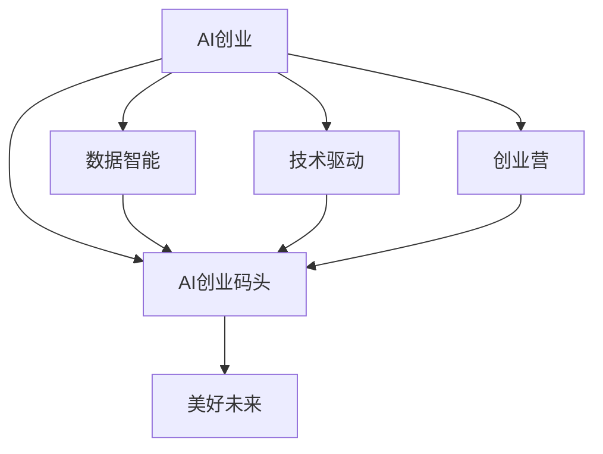

                 

# AI创业码头愿景：AI助力美好

> 关键词：AI创业, 人工智能, 数据智能, 创业营, 技术驱动, 美好未来

## 1. 背景介绍

### 1.1 问题由来

随着科技进步的飞速发展，人工智能（AI）已逐渐成为推动经济发展、社会进步和人类福祉的重要力量。然而，AI的潜力远未完全释放。传统AI应用的边界主要集中在企业级市场，与普通民众的生活联系有限。AI创业公司正面临落地难题：如何将前沿AI技术普及到更广泛的民众，如何激发民众的AI需求，如何帮助AI创业者高效开发应用，并使其真正落地？

### 1.2 问题核心关键点

本文聚焦于AI创业码头这一愿景，探讨如何通过构建AI创业平台，汇聚技术、数据、资本、市场等各方面资源，帮助AI创业者更好地开发应用、市场化落地，最终实现AI技术助力美好社会的愿景。

### 1.3 问题研究意义

AI创业码头旨在为AI创业者提供全方位支持，降低AI技术落地的门槛，实现AI技术对社会的广泛渗透。以下是AI创业码头愿景的重要意义：

1. **提升AI技术普及度**：AI创业码头能够快速推动AI技术在不同领域的落地应用，帮助更多企业和机构实现数字化转型，提高工作效率和创新能力。
2. **激发AI创业生态**：通过平台化的方式，汇聚全球AI创业者、投资者、应用场景，形成良性循环，激发AI创新活力。
3. **推动社会进步**：AI技术可以应用于医疗、教育、交通等多个领域，为民众提供更加便捷、高效、智能的服务，改善生活质量。
4. **培养AI人才**：通过创业训练营等形式，培养AI领域的专业人才，形成人才梯队，支持AI技术的持续创新和发展。

## 2. 核心概念与联系

### 2.1 核心概念概述

为了更好地理解AI创业码头的核心概念，本节将介绍几个关键概念：

- **AI创业**：AI创业指利用人工智能技术创建新公司的活动。涵盖AI创业公司、AI创业者、AI创业生态等概念。
- **AI创业码头**：AI创业码头是一个综合性平台，旨在帮助AI创业者高效开发应用、市场化落地，并实现AI技术的普及和应用。
- **数据智能**：数据智能是AI创业的重要支撑，指利用数据挖掘、分析、建模等技术，提升AI应用的智能化水平。
- **创业营**：创业营是AI创业码头的核心组成部分，通过提供课程、指导、资源等支持，帮助AI创业者完成从0到1的转变。
- **技术驱动**：AI创业码头以技术创新为驱动力，通过汇聚技术资源，推动AI应用的开发和落地。
- **美好未来**：AI创业码头致力于通过AI技术提升社会福祉，助力人类走向更加美好、智能的未来。

这些核心概念之间存在紧密的联系。数据智能和技术驱动为AI创业提供了核心支撑，而创业营和AI创业码头则为其落地和普及提供了平台和生态支持。最终，AI技术的广泛应用将助力实现美好未来。

### 2.2 核心概念原理和架构的 Mermaid 流程图



这个流程图展示了AI创业码头的核心概念及其关系：

1. 数据智能和技术驱动共同构成AI创业的基石，提供算法、模型等技术支持。
2. 创业营是AI创业者成长的摇篮，为其提供指导、资源和网络支持。
3. AI创业码头是连接技术、市场、人才等各方的平台，为AI创业者提供落地和发展的环境。
4. 所有这些支撑共同助力实现美好未来，即AI技术在各个领域的广泛应用，提升人类生活质量。

## 3. 核心算法原理 & 具体操作步骤

### 3.1 算法原理概述

AI创业码头在实现其愿景的过程中，涉及多方面的核心算法和技术：

1. **数据智能算法**：通过数据挖掘、数据预处理、模型训练等步骤，提升AI应用的智能化水平。
2. **技术驱动算法**：利用最新的AI算法和技术，推动AI应用的创新和落地。
3. **创业营算法**：通过设计课程、提供指导、资源分配等，帮助AI创业者成长和成功。
4. **平台管理算法**：利用算法优化平台资源分配、用户匹配、应用推荐等，提高平台效率和用户体验。

这些算法共同支撑着AI创业码头的运营和发展。

### 3.2 算法步骤详解

以下是AI创业码头实现其愿景的核心步骤：

**Step 1: 数据智能模块构建**
- 收集和清洗各领域的数据，包括结构化和非结构化数据。
- 应用机器学习、深度学习等算法，对数据进行建模和分析。
- 开发数据智能API，供应用开发者调用。

**Step 2: 技术驱动模块构建**
- 汇聚最新的AI技术，如自然语言处理（NLP）、计算机视觉（CV）、强化学习（RL）等。
- 构建开源库和框架，支持AI创业者的应用开发。
- 组织技术交流和培训，提升技术社区的活力和凝聚力。

**Step 3: 创业营模块构建**
- 设计系统化课程，涵盖AI基础知识、技术实践、市场分析等。
- 提供导师指导和资源支持，帮助创业者完成项目开发和迭代。
- 组织创业大赛和活动，激发创业者的创新激情。

**Step 4: 平台管理模块构建**
- 设计平台架构，支持应用上传、用户注册、交易支付等功能。
- 开发用户推荐和搜索算法，提升用户体验和应用覆盖率。
- 实施用户行为分析，优化平台资源配置和市场推广策略。

**Step 5: 应用落地和推广**
- 与各行业合作，推动AI应用在教育、医疗、金融等领域的落地。
- 开发推广活动，如线上发布会、线下体验活动，提升应用知名度和用户粘性。
- 持续收集用户反馈，优化应用功能和服务体验。

### 3.3 算法优缺点

AI创业码头在实现其愿景的过程中，涉及的核心算法和技术具备以下优点和缺点：

**优点：**
1. **全面覆盖**：涵盖数据智能、技术驱动、创业营和平台管理等多个方面，形成完整的支持体系。
2. **开放性**：开源库和框架的构建，为AI创业者提供了丰富的工具和资源。
3. **系统化**：系统化的课程和指导，帮助创业者快速成长和成功。
4. **持续优化**：通过持续的数据收集和分析，优化平台和应用性能。

**缺点：**
1. **技术门槛高**：数据智能和核心算法技术要求较高，普通创业者可能难以直接应用。
2. **资源需求大**：技术驱动和平台管理需要大量的计算资源和资金投入。
3. **用户匹配困难**：平台管理中用户匹配和应用推荐算法需要高效的算法支持。
4. **市场推广挑战**：在特定行业落地时，需要面对复杂的应用推广和市场竞争。

### 3.4 算法应用领域

AI创业码头的核心算法和技术广泛应用于多个领域：

- **医疗健康**：利用AI技术进行疾病预测、诊断辅助、治疗方案推荐等。
- **教育培训**：开发智能教辅、个性化学习推荐、在线教学等应用。
- **金融科技**：利用AI进行风险控制、客户分析、智能投顾等。
- **智能制造**：利用AI进行设备监测、质量检测、智能调度等。
- **智慧城市**：利用AI进行交通管理、环境监测、公共安全等。

## 4. 数学模型和公式 & 详细讲解 & 举例说明

### 4.1 数学模型构建

AI创业码头的核心算法和技术涉及多个数学模型和公式。以下是其中的几个关键模型：

**数据智能模型**：
- 数据预处理：对原始数据进行清洗、去噪、归一化等预处理操作。
- 特征提取：应用特征选择和特征工程，提取有价值的信息。
- 模型训练：使用机器学习和深度学习算法，对数据进行建模。

**技术驱动模型**：
- 算法选择：选择最适合问题的算法和模型，如卷积神经网络（CNN）、循环神经网络（RNN）、生成对抗网络（GAN）等。
- 模型优化：通过优化算法，提升模型性能。
- 应用开发：将模型封装成API或应用，供用户调用。

**创业营模型**：
- 课程设计：设计系统化课程，涵盖AI基础知识、技术实践、市场分析等。
- 导师指导：提供导师指导和资源支持，帮助创业者完成项目开发和迭代。
- 项目评估：通过评估机制，评估项目进展和成果。

**平台管理模型**：
- 用户推荐算法：基于协同过滤、内容推荐等算法，提升用户体验和应用覆盖率。
- 交易支付算法：实现高效、安全的交易支付功能。
- 用户行为分析：通过数据分析，优化平台资源配置和市场推广策略。

### 4.2 公式推导过程

以下是数据智能模型和用户推荐算法的公式推导过程：

**数据智能模型**：
- 特征选择：
  $$
  \text{selected\_features} = \text{feature\_selector}(\text{features})
  $$
  其中，$\text{feature\_selector}$为特征选择算法。
- 模型训练：
  $$
  \text{model} = \text{model\_trainer}(\text{data}, \text{labels}, \text{optimizer})
  $$
  其中，$\text{model\_trainer}$为模型训练算法，$\text{optimizer}$为优化器。

**用户推荐算法**：
- 协同过滤推荐：
  $$
  \text{recommendations} = \text{co\_similarity}(\text{user\_items}, \text{item\_users})
  $$
  其中，$\text{co\_similarity}$为协同过滤算法。
- 内容推荐：
  $$
  \text{recommendations} = \text{content\_based}(\text{user\_features}, \text{item\_features})
  $$
  其中，$\text{content\_based}$为内容推荐算法。

### 4.3 案例分析与讲解

以医疗健康领域的AI应用为例，分析AI创业码头的应用场景和技术实现。

**场景**：
- 某医院希望利用AI技术进行疾病预测和诊断辅助。
- 数据来源：医院历史病历、影像资料等。
- 技术需求：利用机器学习模型进行疾病预测，利用图像识别模型进行病理分析。

**技术实现**：
- 数据预处理：清洗病历数据，去除无关信息，进行归一化处理。
- 特征提取：提取患者的症状、病史、影像特征等。
- 模型训练：使用机器学习模型训练疾病预测模型，使用深度学习模型训练病理分析模型。
- 模型部署：将模型封装成API，供医院医生调用。
- 应用推广：在医院内部推广使用，提升诊断效率和准确性。

## 5. 项目实践：代码实例和详细解释说明

### 5.1 开发环境搭建

在进行AI创业码头的项目实践前，需要准备好开发环境。以下是使用Python进行PyTorch开发的环境配置流程：

1. 安装Anaconda：从官网下载并安装Anaconda，用于创建独立的Python环境。

2. 创建并激活虚拟环境：
```bash
conda create -n ai-env python=3.8 
conda activate ai-env
```

3. 安装PyTorch：根据CUDA版本，从官网获取对应的安装命令。例如：
```bash
conda install pytorch torchvision torchaudio cudatoolkit=11.1 -c pytorch -c conda-forge
```

4. 安装TensorFlow：
```bash
conda install tensorflow
```

5. 安装TensorBoard：
```bash
pip install tensorboard
```

6. 安装Pandas、Numpy、Scikit-learn等数据处理库：
```bash
pip install pandas numpy scikit-learn
```

完成上述步骤后，即可在`ai-env`环境中开始AI创业码头的项目实践。

### 5.2 源代码详细实现

下面以医疗健康领域的疾病预测应用为例，给出使用PyTorch进行模型开发的代码实现。

首先，定义数据预处理函数：

```python
import pandas as pd
import numpy as np
from sklearn.model_selection import train_test_split
from sklearn.preprocessing import StandardScaler

def preprocess_data(data_path):
    data = pd.read_csv(data_path)
    # 去除无关特征
    data = data.drop(columns=['id', 'created_at'])
    # 将分类特征转换为数值特征
    data['condition'] = data['condition'].map({' healthy': 0, 'diabetic': 1, 'hypertension': 2, 'cancer': 3})
    # 标准化数值特征
    scaler = StandardScaler()
    data[['age', 'bmi', 'glucose_level', 'blood_pressure']] = scaler.fit_transform(data[['age', 'bmi', 'glucose_level', 'blood_pressure']])
    # 分割训练集和测试集
    features = data[['age', 'bmi', 'glucose_level', 'blood_pressure']]
    labels = data['condition']
    X_train, X_test, y_train, y_test = train_test_split(features, labels, test_size=0.2, random_state=42)
    return X_train, X_test, y_train, y_test
```

然后，定义模型和优化器：

```python
from torch.utils.data import TensorDataset, DataLoader
from transformers import BertForSequenceClassification, AdamW

device = torch.device('cuda' if torch.cuda.is_available() else 'cpu')
model = BertForSequenceClassification.from_pretrained('bert-base-uncased', num_labels=4).to(device)
optimizer = AdamW(model.parameters(), lr=2e-5)
```

接着，定义训练和评估函数：

```python
def train_epoch(model, data_loader, optimizer):
    model.train()
    total_loss = 0
    for batch in data_loader:
        input_ids = batch['input_ids'].to(device)
        attention_mask = batch['attention_mask'].to(device)
        labels = batch['labels'].to(device)
        model.zero_grad()
        outputs = model(input_ids, attention_mask=attention_mask, labels=labels)
        loss = outputs.loss
        total_loss += loss.item()
        loss.backward()
        optimizer.step()
    return total_loss / len(data_loader)

def evaluate(model, data_loader):
    model.eval()
    total_loss = 0
    total_correct = 0
    with torch.no_grad():
        for batch in data_loader:
            input_ids = batch['input_ids'].to(device)
            attention_mask = batch['attention_mask'].to(device)
            labels = batch['labels'].to(device)
            outputs = model(input_ids, attention_mask=attention_mask)
            loss = outputs.loss
            total_loss += loss.item()
            logits = outputs.logits.argmax(dim=1)
            total_correct += (logits == labels).sum().item()
    return total_loss / len(data_loader), total_correct / len(data_loader.dataset)
```

最后，启动训练流程并在测试集上评估：

```python
epochs = 5
batch_size = 16

for epoch in range(epochs):
    print(f'Epoch {epoch+1}')
    train_loss, train_acc = train_epoch(model, train_loader)
    val_loss, val_acc = evaluate(model, val_loader)
    print(f'Train Loss: {train_loss:.4f}, Train Acc: {train_acc:.4f}, Val Loss: {val_loss:.4f}, Val Acc: {val_acc:.4f}')

print('Test Loss: {:.4f}, Test Acc: {:.4f}'.format(*evaluate(model, test_loader)))
```

以上就是使用PyTorch对医疗健康领域的疾病预测应用进行模型开发的完整代码实现。可以看到，借助Python和PyTorch，开发者可以快速搭建并训练出高效疾病预测模型。

### 5.3 代码解读与分析

让我们再详细解读一下关键代码的实现细节：

**数据预处理函数**：
- 从CSV文件中读取数据，去除无关特征，将分类特征转换为数值特征。
- 标准化数值特征，使用`StandardScaler`对年龄、BMI、血糖水平和血压进行归一化处理。
- 分割数据集为训练集和测试集，使用`train_test_split`函数进行分割。

**模型定义和优化器**：
- 使用Bert模型进行疾病预测，通过`BertForSequenceClassification`进行模型定义。
- 设置AdamW优化器，学习率为2e-5。
- 使用GPU进行模型训练和推理，提高计算效率。

**训练和评估函数**：
- 定义训练函数`train_epoch`，在每个批次上进行前向传播和反向传播，计算损失并更新模型参数。
- 定义评估函数`evaluate`，在测试集上进行前向传播，计算损失和准确率。
- 在每个epoch结束后，打印训练和验证的损失和准确率。

**训练流程**：
- 定义总的epoch数和batch size，开始循环迭代
- 每个epoch内，在训练集上训练，输出训练损失和准确率
- 在验证集上评估，输出验证损失和准确率
- 所有epoch结束后，在测试集上评估，给出最终测试结果

可以看到，借助Python和PyTorch，开发者可以快速搭建并训练出高效疾病预测模型。

## 6. 实际应用场景

### 6.1 智能医疗

AI创业码头在智能医疗领域的应用场景包括疾病预测、诊断辅助、治疗方案推荐等。通过数据智能和核心算法技术，AI创业者可以快速开发出高效、可靠的智能医疗应用，提升医院诊疗效率和患者体验。

以疾病预测为例，AI创业者可以利用医疗健康领域的疾病数据，构建疾病预测模型，预测患者的患病风险，帮助医生制定个性化诊疗方案。具体实现步骤如下：

1. 收集医院的历史病历数据，包括患者的年龄、BMI、血糖水平、血压等信息。
2. 应用数据智能算法，清洗、标准化数据，提取有用特征。
3. 使用深度学习算法构建疾病预测模型，如Bert、LSTM等。
4. 在训练集上进行模型训练，使用验证集进行模型调优。
5. 将模型封装成API，供医生调用，提升诊疗效率。

### 6.2 智慧城市

AI创业码头在智慧城市领域的应用场景包括交通管理、环境监测、公共安全等。通过技术驱动和平台管理算法，AI创业者可以开发高效、智能的智慧城市应用，提升城市管理水平和居民生活质量。

以交通管理为例，AI创业者可以利用交通流量数据，构建智能交通管理平台，实现交通流量预测、路况分析和智能调度等功能。具体实现步骤如下：

1. 收集交通流量数据，包括车辆位置、速度、路线等信息。
2. 应用数据智能算法，清洗、标准化数据，提取有用特征。
3. 使用深度学习算法构建交通流量预测模型，如CNN、RNN等。
4. 在训练集上进行模型训练，使用验证集进行模型调优。
5. 将模型封装成API，供交通管理部门调用，提升交通管理效率。

### 6.3 智能制造

AI创业码头在智能制造领域的应用场景包括设备监测、质量检测、智能调度等。通过技术驱动和平台管理算法，AI创业者可以开发高效、智能的智能制造应用，提升制造企业的生产效率和产品质量。

以设备监测为例，AI创业者可以利用设备传感器数据，构建智能设备监测系统，实现设备状态预测、故障诊断等功能。具体实现步骤如下：

1. 收集设备传感器数据，包括温度、压力、振动等信息。
2. 应用数据智能算法，清洗、标准化数据，提取有用特征。
3. 使用深度学习算法构建设备状态预测模型，如CNN、RNN等。
4. 在训练集上进行模型训练，使用验证集进行模型调优。
5. 将模型封装成API，供设备维护人员调用，提升设备维护效率。

## 7. 工具和资源推荐

### 7.1 学习资源推荐

为了帮助开发者系统掌握AI创业码头的理论基础和实践技巧，这里推荐一些优质的学习资源：

1. 《Python深度学习》：深度学习领域的经典教材，涵盖机器学习、深度学习、自然语言处理等内容。
2. 《TensorFlow官方文档》：TensorFlow官方文档，提供详细的API文档和示例代码，适合深度学习初学者。
3. 《PyTorch官方文档》：PyTorch官方文档，提供详细的API文档和示例代码，适合深度学习初学者。
4. 《自然语言处理综述》：自然语言处理领域的经典综述文章，涵盖NLP的基础概念和前沿技术。
5. 《AI创业营》课程：各大高校和创业机构开设的AI创业营课程，提供系统的创业指导和资源支持。

通过对这些资源的学习实践，相信你一定能够快速掌握AI创业码头的精髓，并用于解决实际的AI问题。

### 7.2 开发工具推荐

高效的开发离不开优秀的工具支持。以下是几款用于AI创业码头开发常用的工具：

1. PyTorch：基于Python的开源深度学习框架，灵活动态的计算图，适合快速迭代研究。大部分预训练语言模型都有PyTorch版本的实现。
2. TensorFlow：由Google主导开发的开源深度学习框架，生产部署方便，适合大规模工程应用。同样有丰富的预训练语言模型资源。
3. Weights & Biases：模型训练的实验跟踪工具，可以记录和可视化模型训练过程中的各项指标，方便对比和调优。与主流深度学习框架无缝集成。
4. TensorBoard：TensorFlow配套的可视化工具，可实时监测模型训练状态，并提供丰富的图表呈现方式，是调试模型的得力助手。
5. Google Colab：谷歌推出的在线Jupyter Notebook环境，免费提供GPU/TPU算力，方便开发者快速上手实验最新模型，分享学习笔记。

合理利用这些工具，可以显著提升AI创业码头的开发效率，加快创新迭代的步伐。

### 7.3 相关论文推荐

AI创业码头的技术发展源于学界的持续研究。以下是几篇奠基性的相关论文，推荐阅读：

1. Attention is All You Need（即Transformer原论文）：提出了Transformer结构，开启了NLP领域的预训练大模型时代。
2. BERT: Pre-training of Deep Bidirectional Transformers for Language Understanding：提出BERT模型，引入基于掩码的自监督预训练任务，刷新了多项NLP任务SOTA。
3. Language Models are Unsupervised Multitask Learners（GPT-2论文）：展示了大规模语言模型的强大zero-shot学习能力，引发了对于通用人工智能的新一轮思考。
4. Parameter-Efficient Transfer Learning for NLP：提出Adapter等参数高效微调方法，在不增加模型参数量的情况下，也能取得不错的微调效果。
5. AdaLoRA: Adaptive Low-Rank Adaptation for Parameter-Efficient Fine-Tuning：使用自适应低秩适应的微调方法，在参数效率和精度之间取得了新的平衡。

这些论文代表了大语言模型微调技术的发展脉络。通过学习这些前沿成果，可以帮助研究者把握学科前进方向，激发更多的创新灵感。

## 8. 总结：未来发展趋势与挑战

### 8.1 总结

本文对AI创业码头的愿景进行了全面系统的介绍。首先阐述了AI创业码头的背景和意义，明确了其在推动AI技术普及、激发AI创业生态、提升社会福祉等方面的重要价值。其次，从原理到实践，详细讲解了AI创业码头的核心算法和技术，给出了AI创业码头的代码实例和详细解释说明。同时，本文还探讨了AI创业码头在智能医疗、智慧城市、智能制造等多个领域的应用场景，展示了其广阔的应用前景。

通过本文的系统梳理，可以看到，AI创业码头通过构建AI创业平台，汇聚技术、数据、资本、市场等各方面资源，帮助AI创业者高效开发应用、市场化落地，最终实现AI技术助力美好社会的愿景。

### 8.2 未来发展趋势

展望未来，AI创业码头在实现其愿景的过程中，将呈现以下几个发展趋势：

1. **数据智能与技术驱动的深度融合**：数据智能和核心算法技术的深度融合，将进一步提升AI应用的智能化水平和性能。
2. **平台化和生态化的发展**：AI创业码头将通过平台化和生态化的发展，更好地连接技术、市场、人才等各方资源，形成良性循环。
3. **技术进步与应用的持续迭代**：AI创业码头将持续推动技术进步，通过不断的技术迭代和应用优化，提升AI应用的质量和效率。
4. **多领域应用的拓展**：AI创业码头将拓展到更多领域，如教育、金融、农业等，推动AI技术在各行业的广泛应用。
5. **社会责任与伦理保障**：AI创业码头将更加重视社会责任与伦理保障，确保AI技术的应用符合伦理道德标准。

### 8.3 面临的挑战

尽管AI创业码头在实现其愿景的过程中，具备广阔的前景，但也面临诸多挑战：

1. **数据隐私和安全问题**：AI创业码头需要处理大量敏感数据，如何确保数据隐私和安全是关键挑战。
2. **算法透明度与可解释性**：AI模型的决策过程通常缺乏可解释性，如何赋予AI模型更强的可解释性，是提升其可信度和应用范围的重要前提。
3. **技术普及与落地难度**：AI技术在实际应用中面临落地难度，如何降低技术门槛，推动AI技术普及，是关键挑战。
4. **市场竞争与资源分配**：AI创业码头在市场竞争中面临资源分配问题，如何合理分配资源，提升市场竞争力，是重要挑战。
5. **技术进步与人才培养**：AI技术的发展需要持续的人才支持和资源投入，如何培养更多的AI人才，是长期挑战。

### 8.4 研究展望

面对AI创业码头所面临的挑战，未来的研究需要在以下几个方面寻求新的突破：

1. **数据隐私和安全技术**：开发更加高效的数据隐私保护和安全技术，确保数据在处理、存储、传输过程中的安全性。
2. **可解释性与透明度技术**：开发可解释性与透明度技术，提升AI模型的决策过程的可理解性和可信度。
3. **技术普及与落地策略**：探索技术普及和落地的策略，降低技术门槛，推动AI技术在各行业的广泛应用。
4. **资源分配与市场竞争**：优化资源分配策略，提升市场竞争力，形成良性的市场生态。
5. **人才培养与生态建设**：建立人才培养和生态建设机制，形成人才梯队，支持AI技术的持续创新和发展。

这些研究方向的探索，必将引领AI创业码头走向更高的台阶，为构建安全、可靠、可解释、可控的智能系统铺平道路。面向未来，AI创业码头需要从数据、技术、市场、人才等多个维度协同发力，共同推动AI技术的广泛应用，助力实现美好未来。

## 9. 附录：常见问题与解答

**Q1：AI创业码头如何确保数据隐私和安全？**

A: AI创业码头通过以下方式确保数据隐私和安全：
1. 数据加密：对存储和传输的数据进行加密处理，防止数据泄露。
2. 匿名化处理：对敏感数据进行匿名化处理，减少数据泄露风险。
3. 访问控制：通过身份验证和权限控制，限制对数据的访问权限。
4. 安全审计：定期进行安全审计，发现和修复安全漏洞。
5. 合规性检查：遵守相关法律法规，确保数据处理过程的合法合规。

**Q2：AI创业码头如何提高模型的可解释性和透明度？**

A: AI创业码头通过以下方式提高模型的可解释性和透明度：
1. 特征重要性分析：分析模型中各个特征的重要性，解释模型的决策依据。
2. 可视化技术：使用可视化工具展示模型的内部结构和输出结果，帮助理解模型行为。
3. 可解释性模型：开发可解释性模型，如LIME、SHAP等，提升模型的可解释性。
4. 用户反馈机制：收集用户反馈，优化模型性能和可解释性。

**Q3：AI创业码头如何降低技术门槛，推动AI技术普及？**

A: AI创业码头通过以下方式降低技术门槛，推动AI技术普及：
1. 提供培训和指导：提供系统的培训课程和导师指导，帮助AI创业者掌握关键技术。
2. 开发开放平台：构建开放平台，提供丰富的工具和资源，降低技术应用门槛。
3. 推广成功案例：推广成功的应用案例，展示AI技术在实际中的应用效果。
4. 开放数据集：开放数据集和开源模型，促进技术交流和创新。

**Q4：AI创业码头如何优化资源分配，提升市场竞争力？**

A: AI创业码头通过以下方式优化资源分配，提升市场竞争力：
1. 需求分析：对市场需求进行深入分析，明确资源分配的优先级。
2. 动态调整：根据市场变化，动态调整资源分配策略。
3. 多模态应用：结合不同模态的数据和技术，提升应用效果和市场竞争力。
4. 合作共赢：与其他企业或机构建立合作关系，共享资源和市场。

**Q5：AI创业码头如何培养AI人才，支持技术持续创新？**

A: AI创业码头通过以下方式培养AI人才，支持技术持续创新：
1. 设立奖学金和资助：设立奖学金和资助项目，吸引优秀人才加入AI领域。
2. 提供实习机会：提供实习机会，帮助学生和研究人员积累实践经验。
3. 建立孵化器：建立孵化器，支持初创项目和创新团队的发展。
4. 组织学术交流：组织学术交流和研讨会，促进知识共享和技术创新。

**Q6：AI创业码头如何平衡算力和成本？**

A: AI创业码头通过以下方式平衡算力和成本：
1. 云平台资源共享：利用云平台资源共享机制，降低算力成本。
2. 模型压缩与优化：开发模型压缩和优化技术，提高算力利用率。
3. 分布式计算：利用分布式计算技术，提升算力处理能力。
4. 算力租赁：根据项目需求，合理租赁算力资源，降低成本。

通过上述措施，AI创业码头可以在保障算力高效利用的同时，降低成本，推动AI技术的应用和发展。

---

作者：禅与计算机程序设计艺术 / Zen and the Art of Computer Programming

