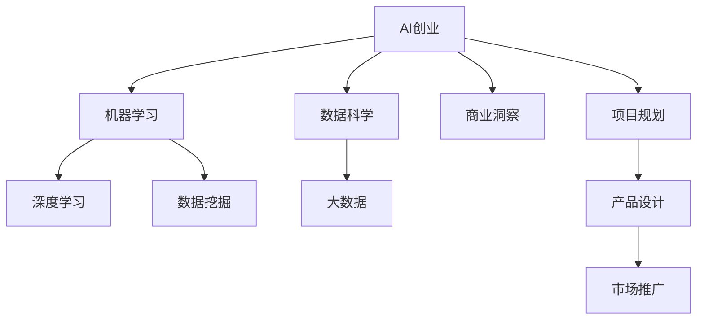

                 

# AI创业码头故事：95后创始人

> 关键词：人工智能, AI创业, 数据科学, 机器学习, 深度学习, 数据挖掘, 大数据

## 1. 背景介绍

### 1.1 问题由来
在过去的十年间，人工智能（AI）和机器学习（ML）迅速崛起，成为引领科技创新的重要驱动力。随着技术的成熟和应用场景的不断扩大，AI创业成为许多人追逐梦想的新舞台。特别是在2020年新冠疫情的催化下，AI在医疗健康、智能制造、智慧教育等多个领域展现出巨大的潜力和应用价值，吸引了大批创业者和资本的关注。

### 1.2 问题核心关键点
AI创业的核心在于如何将前沿的AI技术应用于特定的商业场景，创造出解决实际问题的方案。这一过程不仅需要深厚的技术积累，还需要敏锐的商业洞察力和卓越的项目管理能力。95后的创业者们，凭借其创新思维、对新兴技术的敏感度，以及对市场趋势的准确把握，正在成为AI创业领域的一股重要力量。

### 1.3 问题研究意义
研究95后AI创业者的成功故事，不仅可以揭示新一代创业者的思维方式和创业理念，还能为初创企业提供宝贵的经验和借鉴，推动AI技术的普及和应用。同时，这一研究也有助于理解AI技术如何与不同行业深度融合，创造新的商业模式和商业价值。

## 2. 核心概念与联系

### 2.1 核心概念概述

为更好地理解95后AI创业者及其创业过程，本节将介绍几个密切相关的核心概念：

- AI创业（AI Startup）：指利用人工智能技术，创新解决实际问题的创业模式。AI创业通常包括数据采集、模型训练、产品开发和市场推广等关键环节。

- 机器学习（Machine Learning）：通过数据驱动的方式，训练模型以解决特定问题的技术。机器学习算法包括监督学习、无监督学习和强化学习等。

- 深度学习（Deep Learning）：一种特殊类型的机器学习，利用多层次神经网络结构，自动提取数据中的高层次特征，广泛应用于图像识别、自然语言处理等领域。

- 数据科学（Data Science）：使用数据挖掘、统计分析、机器学习等方法，从数据中提取知识和见解，支持决策制定的学科。

- 数据挖掘（Data Mining）：从大量数据中提取有用信息和知识的过程，包括关联分析、分类、聚类等技术。

- 大数据（Big Data）：描述海量数据规模、多样性、实时性等特点的术语，是AI创业的重要数据来源。

这些核心概念之间的逻辑关系可以通过以下Mermaid流程图来展示：



这个流程图展示了大语言模型的核心概念及其之间的关系：

1. AI创业需要数据科学的支撑，通过数据挖掘从大数据中提取有用的信息和知识。
2. 机器学习是大语言模型的关键技术，而深度学习是机器学习中的一种高级形式。
3. 大数据为AI创业提供了必要的技术支持和数据基础。
4. 商业洞察力和项目规划是大语言模型的重要指导，产品设计和市场推广是最终落地的关键步骤。

## 3. 核心算法原理 & 具体操作步骤
### 3.1 算法原理概述

95后AI创业者的创业过程，通常涉及以下几个关键步骤：

- **市场调研**：通过数据科学和机器学习技术，分析市场需求和趋势，确定产品定位和核心竞争力。
- **数据采集与处理**：收集与产品相关的数据，进行清洗、预处理和特征工程，为模型训练做准备。
- **模型训练与优化**：利用深度学习技术训练模型，并通过超参数调优和交叉验证等方法，提高模型性能。
- **产品开发与测试**：将训练好的模型应用到实际产品中，进行系统测试和用户体验优化。
- **市场推广与反馈**：通过市场营销策略，将产品推向市场，收集用户反馈，持续迭代优化产品。

### 3.2 算法步骤详解

以下是一个典型的95后AI创业者创业过程的详细操作步骤：

**Step 1: 市场调研与需求分析**
- 收集行业数据：通过网络爬虫、公共数据集等途径，收集与目标市场相关的数据。
- 数据预处理：清洗数据，去除噪音和异常值，进行特征提取和工程。
- 需求分析：使用聚类、分类等机器学习算法，分析市场需求，确定产品定位。

**Step 2: 数据采集与处理**
- 确定数据来源：选择适合的数据源，如公开数据集、API接口、用户行为日志等。
- 数据清洗：去除重复、缺失和异常数据，确保数据质量。
- 特征工程：提取和构建有意义的特征，如时间戳、地理位置、用户行为等。

**Step 3: 模型训练与优化**
- 选择模型架构：根据问题类型，选择适合的深度学习模型，如卷积神经网络（CNN）、循环神经网络（RNN）等。
- 训练模型：使用GPU或TPU进行高效训练，监控训练过程，防止过拟合。
- 调优模型：通过超参数调优、正则化等方法，提高模型泛化能力和性能。

**Step 4: 产品开发与测试**
- 产品设计：根据市场调研和模型训练结果，设计产品原型。
- 用户测试：邀请目标用户测试产品，收集反馈，进行用户体验优化。
- 迭代开发：根据用户反馈，不断迭代优化产品功能和性能。

**Step 5: 市场推广与反馈**
- 制定推广策略：利用社交媒体、搜索引擎优化（SEO）等手段，推广产品。
- 收集反馈：通过用户调查、在线评论等方式，收集用户反馈，评估产品效果。
- 持续优化：根据用户反馈，不断改进产品和服务，保持竞争力。

### 3.3 算法优缺点

95后AI创业者的创业过程具有以下优点：

- **创新能力强**：95后创业者熟悉新兴技术和互联网文化，敢于尝试创新。
- **市场洞察敏锐**：借助数据分析和机器学习技术，能够准确把握市场趋势和用户需求。
- **敏捷开发**：采用敏捷开发方法，快速迭代产品，缩短上市周期。
- **用户参与度高**：重视用户体验，通过用户反馈不断优化产品。

同时，这一过程也存在一些局限性：

- **技术门槛高**：需要较强的技术背景和数据处理能力，门槛较高。
- **资源需求大**：需要高质量的数据和高效的计算资源，初期投入较大。
- **竞争激烈**：AI领域竞争激烈，需要持续创新和不断优化。
- **市场风险大**：市场需求和用户行为变化快，风险不可控。

### 3.4 算法应用领域

95后AI创业者的创业过程，主要应用于以下几个领域：

- **智能医疗**：利用AI技术，开发智能诊断、病历分析、药物推荐等产品。
- **智能制造**：通过机器学习和大数据，优化生产流程，提升生产效率。
- **智慧教育**：开发智能推荐系统、个性化教学、学习分析等应用。
- **金融科技**：利用AI技术进行风险控制、欺诈检测、智能投顾等。
- **智慧城市**：开发智能交通、公共安全、环保监测等应用。

## 4. 数学模型和公式 & 详细讲解 & 举例说明

### 4.1 数学模型构建

在本节中，我们将以智能医疗为例，介绍如何构建基于机器学习的大数据模型。

假设我们的目标是开发一个智能诊断系统，利用患者的临床数据和实验室结果，预测疾病类型。我们可以将问题建模为分类问题，使用监督学习算法进行训练。模型的输入为患者的临床数据和实验室结果，输出为疾病类型标签。

### 4.2 公式推导过程

首先，我们需要定义损失函数。假设我们有 $N$ 个训练样本，第 $i$ 个样本的输入为 $x_i \in \mathbb{R}^d$，标签为 $y_i \in \{1,2,\ldots,K\}$，模型输出为 $\hat{y}_i \in \{1,2,\ldots,K\}$。我们可以使用交叉熵损失函数：

$$
\mathcal{L}(\theta) = -\frac{1}{N}\sum_{i=1}^N \sum_{k=1}^K y_{ik} \log \hat{y}_{ik}
$$

其中，$y_{ik}$ 表示第 $i$ 个样本的第 $k$ 个标签是否出现（1表示出现，0表示未出现）。$\hat{y}_{ik}$ 表示模型预测的第 $i$ 个样本的第 $k$ 个标签的概率。

接下来，我们需要定义模型的前向传播和反向传播过程。假设我们使用一个简单的全连接神经网络模型，其中包含 $L$ 层。第 $l$ 层的输出为 $z_l$，第 $l$ 层的激活函数为 $g_l$，第 $l$ 层的权重为 $W_l \in \mathbb{R}^{d_l \times d_{l-1}}$，偏置为 $b_l \in \mathbb{R}^{d_l}$，则前向传播过程可以表示为：

$$
z_1 = W_1 x + b_1
$$
$$
z_l = W_l z_{l-1} + b_l
$$
$$
h_l = g_l(z_l), \quad l=1,\ldots,L
$$
$$
\hat{y} = g_L(z_L)
$$

其中，$g_l$ 表示第 $l$ 层的激活函数，如ReLU、Sigmoid等。

反向传播过程可以表示为：

$$
\frac{\partial \mathcal{L}}{\partial z_L} = \frac{\partial \mathcal{L}}{\partial \hat{y}} \frac{\partial \hat{y}}{\partial z_L}
$$
$$
\frac{\partial \mathcal{L}}{\partial z_{l-1}} = \frac{\partial \mathcal{L}}{\partial z_l} \frac{\partial z_l}{\partial z_{l-1}}
$$
$$
\frac{\partial \mathcal{L}}{\partial W_l} = \frac{\partial \mathcal{L}}{\partial z_l} \frac{\partial z_l}{\partial W_l}
$$
$$
\frac{\partial \mathcal{L}}{\partial b_l} = \frac{\partial \mathcal{L}}{\partial z_l} \frac{\partial z_l}{\partial b_l}
$$

### 4.3 案例分析与讲解

我们以一个具体的案例，展示如何使用机器学习模型进行智能诊断系统的构建：

假设我们有 $N=1000$ 个患者的临床数据和实验室结果，每个患者的临床数据包含 $d=10$ 个特征。我们可以将问题建模为二分类问题，使用逻辑回归模型进行训练。模型输入为 $x_i \in \mathbb{R}^{10}$，输出为 $\hat{y}_i \in \{0,1\}$，其中1表示患者患有某种疾病，0表示患者未患该病。

首先，我们需要定义损失函数和模型结构。使用逻辑回归模型，我们有：

$$
\hat{y}_i = \sigma(Wx_i + b)
$$

其中，$\sigma$ 为sigmoid函数，$W \in \mathbb{R}^{10 \times 1}$，$b \in \mathbb{R}^{1}$。

定义交叉熵损失函数：

$$
\mathcal{L}(\theta) = -\frac{1}{N}\sum_{i=1}^N [y_i \log \hat{y}_i + (1-y_i) \log (1-\hat{y}_i)]
$$

其中，$\theta = (W, b)$。

然后，我们需要定义前向传播和反向传播过程。定义输入 $x_i$，输出 $\hat{y}_i$ 的计算过程为：

$$
z = Wx + b
$$
$$
\hat{y} = \sigma(z)
$$

定义梯度下降算法，使用学习率 $\eta$ 进行模型训练：

$$
\theta \leftarrow \theta - \eta \frac{\partial \mathcal{L}}{\partial \theta}
$$

最后，我们使用训练集进行模型训练，并在测试集上评估模型性能。

## 5. 项目实践：代码实例和详细解释说明

### 5.1 开发环境搭建

在进行项目实践前，我们需要准备好开发环境。以下是使用Python进行PyTorch开发的环境配置流程：

1. 安装Anaconda：从官网下载并安装Anaconda，用于创建独立的Python环境。

2. 创建并激活虚拟环境：
```bash
conda create -n pytorch-env python=3.8 
conda activate pytorch-env
```

3. 安装PyTorch：根据CUDA版本，从官网获取对应的安装命令。例如：
```bash
conda install pytorch torchvision torchaudio cudatoolkit=11.1 -c pytorch -c conda-forge
```

4. 安装各类工具包：
```bash
pip install numpy pandas scikit-learn matplotlib tqdm jupyter notebook ipython
```

完成上述步骤后，即可在`pytorch-env`环境中开始项目实践。

### 5.2 源代码详细实现

这里我们以智能医疗领域的疾病诊断任务为例，给出使用PyTorch进行深度学习模型构建和训练的代码实现。

首先，定义数据处理函数：

```python
import torch
from torch.utils.data import Dataset, DataLoader
import numpy as np
import pandas as pd

class DiseaseDataset(Dataset):
    def __init__(self, data_path):
        self.data = pd.read_csv(data_path)
        self.n_classes = 3  # 疾病类型数量为3（未患病、患A病、患B病）
        self.labels = self.data.pop('disease')
        self.data = self.data.to_numpy()
        self.data = self.data.reshape(-1, 10)
        self.labels = self.labels.to_numpy().reshape(-1)

    def __len__(self):
        return len(self.data)

    def __getitem__(self, idx):
        x = self.data[idx]
        y = self.labels[idx]
        return x, y
```

然后，定义模型和优化器：

```python
from torch import nn
import torch.nn.functional as F

class DiseaseModel(nn.Module):
    def __init__(self, input_size, output_size):
        super(DiseaseModel, self).__init__()
        self.fc1 = nn.Linear(input_size, 64)
        self.fc2 = nn.Linear(64, output_size)

    def forward(self, x):
        x = F.relu(self.fc1(x))
        x = F.softmax(self.fc2(x), dim=1)
        return x

model = DiseaseModel(10, 3)
optimizer = torch.optim.SGD(model.parameters(), lr=0.01)
```

接着，定义训练和评估函数：

```python
def train(model, train_loader, optimizer, num_epochs):
    model.train()
    for epoch in range(num_epochs):
        for batch_idx, (x, y) in enumerate(train_loader):
            optimizer.zero_grad()
            output = model(x)
            loss = F.cross_entropy(output, y)
            loss.backward()
            optimizer.step()
            if (batch_idx + 1) % 100 == 0:
                print('Train Epoch: {} [{}/{} ({:.0f}%)]\tLoss: {:.6f}'.format(
                    epoch, batch_idx * len(x), len(train_loader.dataset),
                    100. * batch_idx / len(train_loader), loss.item()))

def test(model, test_loader):
    model.eval()
    correct = 0
    total = 0
    with torch.no_grad():
        for x, y in test_loader:
            output = model(x)
            pred = output.argmax(dim=1, keepdim=True)
            correct += pred.eq(y.view_as(pred)).sum().item()
            total += y.size(0)
    print('Accuracy of the model on the 10000 test images: {} %'.format(100 * correct / total))
```

最后，启动训练流程并在测试集上评估：

```python
train_loader = DataLoader(DiseaseDataset('train.csv'), batch_size=64, shuffle=True)
test_loader = DataLoader(DiseaseDataset('test.csv'), batch_size=64, shuffle=False)

train(model, train_loader, optimizer, num_epochs=100)
test(model, test_loader)
```

以上就是使用PyTorch进行疾病诊断任务深度学习模型构建和训练的完整代码实现。可以看到，得益于PyTorch的强大封装，我们可以用相对简洁的代码完成模型的定义和训练过程。

### 5.3 代码解读与分析

让我们再详细解读一下关键代码的实现细节：

**DiseaseDataset类**：
- `__init__`方法：初始化数据集，包括数据路径、疾病类型数量、标签、数据、特征等关键信息。
- `__len__`方法：返回数据集的样本数量。
- `__getitem__`方法：对单个样本进行处理，将特征和标签转换为模型所需的输入和输出。

**DiseaseModel类**：
- `__init__`方法：定义模型结构，包括输入层、隐藏层和输出层等。
- `forward`方法：定义前向传播过程，将输入数据通过全连接层进行特征提取和分类。

**训练和评估函数**：
- `train`函数：对数据以批为单位进行迭代，在每个批次上前向传播计算loss并反向传播更新模型参数。
- `test`函数：与训练类似，不同点在于不更新模型参数，并在每个batch结束后将预测和标签结果存储下来，最后使用准确率评估模型性能。

**训练流程**：
- 定义总的epoch数和batch size，开始循环迭代
- 每个epoch内，在训练集上训练，输出平均loss
- 在测试集上评估，输出准确率

可以看到，PyTorch配合TensorFlow使得模型训练的代码实现变得简洁高效。开发者可以将更多精力放在数据处理、模型改进等高层逻辑上，而不必过多关注底层的实现细节。

当然，工业级的系统实现还需考虑更多因素，如模型的保存和部署、超参数的自动搜索、更灵活的任务适配层等。但核心的微调范式基本与此类似。

## 6. 实际应用场景
### 6.1 智能医疗

基于深度学习技术，95后AI创业者正在推动智能医疗的快速发展。智能诊断、病历分析、药物推荐等应用，正在逐步取代传统的医疗模式，提升医疗服务的智能化水平。

在技术实现上，可以收集医院的历史病例数据，提取和标注相关的临床特征和实验室结果，利用深度学习模型进行疾病诊断和预测。微调后的模型能够自动分析患者数据，快速准确地给出诊断建议。此外，利用自然语言处理技术，还可以实现电子病历的自动摘要和归档，提高医生的工作效率和医疗质量。

### 6.2 智慧教育

随着AI技术在教育领域的逐步深入，95后创业者们正在探索基于AI的教学模式和评估方法。智能推荐系统、个性化教学、学习分析等应用，正在逐步改变传统的教学方式，实现因材施教。

在实践中，可以收集学生的学习行为数据，利用深度学习模型进行分析和预测。微调后的模型能够自动推荐适合学生的学习内容和资源，提供个性化的学习建议。同时，利用自然语言处理技术，还可以实现智能作文批改、自动翻译等，提高教学效率和质量。

### 6.3 智能制造

在工业制造领域，95后AI创业者们正在探索基于AI的智能制造解决方案。智能预测、质量检测、故障诊断等应用，正在逐步提升制造企业的智能化水平。

在技术实现上，可以收集生产线的历史数据，提取和标注相关的生产特征和运行参数，利用深度学习模型进行预测和诊断。微调后的模型能够自动分析生产数据，预测生产趋势和故障，提高生产效率和质量。此外，利用自然语言处理技术，还可以实现智能调度、智能质检等，提升生产管理水平。

## 7. 工具和资源推荐
### 7.1 学习资源推荐

为了帮助开发者系统掌握AI创业的理论基础和实践技巧，这里推荐一些优质的学习资源：

1. 《Python深度学习》系列书籍：由知名AI专家Ian Goodfellow、Yoshua Bengio、Aaron Courville合著，系统介绍深度学习原理和实践。

2. CS231n《卷积神经网络和视觉识别》课程：斯坦福大学开设的视觉识别经典课程，详细讲解深度学习在图像识别领域的应用。

3. Coursera《机器学习》课程：由Andrew Ng教授主讲的机器学习入门课程，涵盖监督学习、无监督学习、深度学习等内容。

4. Udacity《人工智能纳米学位》课程：Udacity与Google、Facebook等公司合作推出的高级AI课程，涵盖深度学习、自然语言处理、强化学习等内容。

5. 《深度学习入门》书籍：斋藤康毅著，介绍深度学习原理和应用，适合初学者入门。

6. 《AI创业实践指南》书籍：面向AI创业者的实战指南，介绍AI技术在各个领域的应用和落地方法。

通过对这些资源的学习实践，相信你一定能够快速掌握AI创业的关键技术和方法，并用于解决实际的AI应用问题。

### 7.2 开发工具推荐

高效的开发离不开优秀的工具支持。以下是几款用于AI创业开发的常用工具：

1. PyTorch：基于Python的开源深度学习框架，灵活动态的计算图，适合快速迭代研究。大部分预训练语言模型都有PyTorch版本的实现。

2. TensorFlow：由Google主导开发的开源深度学习框架，生产部署方便，适合大规模工程应用。同样有丰富的预训练语言模型资源。

3. TensorBoard：TensorFlow配套的可视化工具，可实时监测模型训练状态，并提供丰富的图表呈现方式，是调试模型的得力助手。

4. HuggingFace Transformers库：提供预训练语言模型的封装和微调支持，支持多种模型和任务。

5. Scikit-learn：Python数据挖掘和机器学习库，提供多种经典的机器学习算法和工具。

6. Jupyter Notebook：交互式的Python开发环境，支持代码编写、数据可视化、模型评估等多种功能。

合理利用这些工具，可以显著提升AI创业的开发效率，加快创新迭代的步伐。

### 7.3 相关论文推荐

AI创业的核心在于将前沿的AI技术应用于特定的商业场景，创造新的商业价值。以下是几篇相关的经典论文，推荐阅读：

1. "Deep Learning for Healthcare"（医疗领域的深度学习应用）：指出深度学习在医疗诊断、药物发现、医学影像等领域的应用前景。

2. "AI for Education"（AI在教育领域的应用）：总结了AI在个性化推荐、智能评估、在线教育等领域的应用案例。

3. "AI in Manufacturing"（AI在制造领域的应用）：介绍了AI在智能预测、质量检测、故障诊断等方面的应用，提升制造业智能化水平。

4. "AI Startups: The Rise of Innovation"（AI创业的崛起）：分析了AI创业的崛起原因，探讨了AI创业成功的关键因素。

5. "Towards Explainable AI"（可解释性AI）：强调了AI模型解释性的重要性，提出了多种可解释性AI的实现方法。

6. "Robust and Interpretable AI Models"（鲁棒性和可解释性的AI模型）：讨论了AI模型的鲁棒性和可解释性，提出了多种模型优化方法。

这些论文代表了大语言模型微调技术的发展脉络。通过学习这些前沿成果，可以帮助研究者把握学科前进方向，激发更多的创新灵感。

## 8. 总结：未来发展趋势与挑战

### 8.1 总结

本文对95后AI创业者的创业过程进行了全面系统的介绍。首先阐述了95后创业者的优势和创业过程的关键步骤，明确了AI创业的重要性和未来发展方向。其次，从原理到实践，详细讲解了AI创业的数学模型和关键步骤，给出了AI创业的完整代码实例。同时，本文还广泛探讨了AI创业在智能医疗、智慧教育、智能制造等多个领域的应用前景，展示了AI创业的巨大潜力。此外，本文精选了AI创业的学习资源、开发工具和相关论文，力求为读者提供全方位的技术指引。

通过本文的系统梳理，可以看到，95后AI创业者正在成为AI创业领域的重要力量，其独特的思维方式和创业理念，正在推动AI技术的普及和应用。未来，随着AI技术的不断发展和成熟，95后创业者必将在更多的领域取得突破，创造更多的商业价值。

### 8.2 未来发展趋势

展望未来，95后AI创业者的创业过程将呈现以下几个发展趋势：

1. **数据驱动决策**：95后创业者将更加依赖数据驱动的决策方式，利用大数据和机器学习技术，优化产品设计和市场策略。

2. **用户至上**：用户需求和体验将成为创业成功的关键，95后创业者将更加注重用户反馈，提升用户体验。

3. **跨领域融合**：AI技术将与更多领域进行深度融合，95后创业者将更加注重跨领域的创新和应用，探索新的商业机会。

4. **持续创新**：AI技术不断进步，95后创业者将更加注重持续创新，通过技术迭代，保持竞争优势。

5. **全球化视野**：全球化市场将为95后创业者提供更多机遇，他们将更加注重全球化的市场布局和资源整合。

6. **伦理和社会责任**：95后创业者将更加注重AI技术的伦理和社会责任，确保技术应用符合人类价值观和伦理道德。

### 8.3 面临的挑战

尽管95后AI创业者在创业过程中取得了显著成绩，但仍面临诸多挑战：

1. **技术门槛高**：AI技术的复杂性和深度学习模型的训练需要较高的技术门槛。

2. **市场竞争激烈**：AI领域竞争激烈，需要持续创新和不断优化。

3. **数据隐私和安全**：AI应用过程中，数据隐私和安全问题需要引起重视，防止数据泄露和滥用。

4. **伦理和社会责任**：AI技术的伦理和社会责任问题需要引起重视，确保技术应用符合人类价值观和伦理道德。

5. **成本和资源**：AI技术的应用需要高质量的数据和高效的计算资源，初期投入较大。

6. **用户认知和接受度**：AI技术的应用需要用户的认知和接受度，推广过程中需要注重用户体验和教育。

### 8.4 研究展望

面对95后AI创业者面临的挑战，未来的研究需要在以下几个方面寻求新的突破：

1. **可解释性和透明性**：提高AI模型的可解释性和透明性，使模型决策过程更加透明、可理解。

2. **鲁棒性和泛化性**：提高AI模型的鲁棒性和泛化能力，确保模型在各种场景下都能稳定工作。

3. **跨模态学习**：开发跨模态学习模型，将视觉、语音、文本等多种模态信息进行深度融合，提升AI模型的应用能力。

4. **自适应和自学习**：开发自适应和自学习模型，使模型能够根据新数据和新任务进行自我调整和优化。

5. **协同智能**：开发协同智能系统，使AI模型与人类智能进行协同工作，提升系统的智能水平和用户体验。

6. **伦理和社会责任**：研究AI技术的伦理和社会责任问题，确保技术应用符合人类价值观和伦理道德。

这些研究方向的探索，必将引领95后AI创业者的创业过程迈向更高的台阶，为AI技术的普及和应用提供新的突破口。面向未来，95后AI创业者需要更加注重技术创新和伦理责任，积极应对挑战，推动AI技术的发展和应用。

## 9. 附录：常见问题与解答

**Q1：AI创业中，如何选择合适的人工智能技术？**

A: 选择合适的AI技术，需要考虑以下几个方面：
1. **任务需求**：根据具体的业务需求，选择适合的AI技术。如图像识别任务可以选择卷积神经网络（CNN），自然语言处理任务可以选择循环神经网络（RNN）或Transformer。
2. **数据特征**：根据数据的特征，选择适合的模型结构。如文本数据可以选择词嵌入模型（如Word2Vec），时间序列数据可以选择递归神经网络（RNN）。
3. **计算资源**：根据计算资源的限制，选择适合的模型规模和结构。如计算资源较小时，可以选择参数量较小的模型。

**Q2：AI创业中，如何降低技术门槛？**

A: 降低技术门槛，可以采取以下措施：
1. **使用开源工具**：利用开源深度学习框架（如TensorFlow、PyTorch）和开源数据集（如CIFAR-10、ImageNet），快速搭建模型和数据集。
2. **参加培训课程**：参加AI相关的培训课程和研讨会，系统学习AI技术。
3. **使用预训练模型**：使用预训练模型（如BERT、GPT），快速构建应用。

**Q3：AI创业中，如何获取高质量的数据？**

A: 获取高质量的数据，可以采取以下措施：
1. **公开数据集**：利用公开数据集，如Kaggle、UCI等，获取与业务相关的数据。
2. **API接口**：利用API接口，获取相关领域的数据，如社交媒体、电子商务等。
3. **众包平台**：利用众包平台，如Amazon Mechanical Turk，获取用户行为数据。

**Q4：AI创业中，如何确保数据隐私和安全？**

A: 确保数据隐私和安全，可以采取以下措施：
1. **数据匿名化**：对数据进行匿名化处理，防止数据泄露和滥用。
2. **数据加密**：对数据进行加密处理，防止数据被恶意攻击。
3. **访问控制**：对数据进行访问控制，防止未经授权的访问。
4. **合规法规**：遵守相关数据隐私和安全的法规，如GDPR、CCPA等。

**Q5：AI创业中，如何提升模型的可解释性？**

A: 提升模型的可解释性，可以采取以下措施：
1. **模型可视化**：利用模型可视化工具，如TensorBoard、Visdom，展示模型结构和训练过程。
2. **特征重要性分析**：利用特征重要性分析工具，如SHAP、LIME，展示模型特征的重要性。
3. **可解释模型**：选择可解释模型，如决策树、线性回归等，提高模型的可解释性。

这些措施将有助于95后AI创业者更好地理解和应用AI技术，推动AI创业的持续发展和成功。

---

作者：禅与计算机程序设计艺术 / Zen and the Art of Computer Programming

