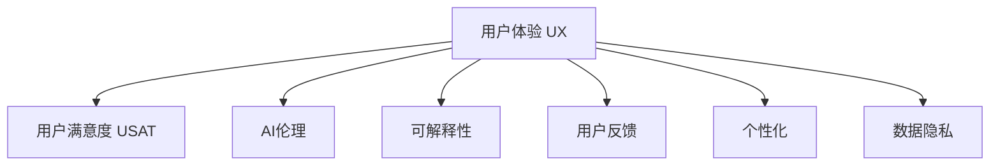

                 

# AI创业：避免用户不满的方法

## 1. 背景介绍

### 1.1 问题由来
在AI创业领域，用户满意度始终是企业成功的关键因素之一。随着AI技术的不断发展和应用，越来越多的企业希望通过引入AI来提升产品或服务的智能化水平，进而吸引和留住用户。然而，用户满意度的提升并非易事，AI系统的设计、开发和部署中存在诸多潜在的陷阱，稍有不慎就可能导致用户体验的下降，甚至引发用户的不满。

### 1.2 问题核心关键点
基于上述背景，本文将探讨AI创业过程中如何有效避免用户不满的问题，旨在帮助创业者从设计、开发到运营的各个环节中，充分考虑用户体验，构建用户满意的AI产品。

## 2. 核心概念与联系

### 2.1 核心概念概述

为更好地理解如何避免用户不满，本文将介绍几个关键概念：

- **用户体验(User Experience, UX)**：指的是用户在使用产品或服务时的主观感受和体验，是衡量产品是否满足用户需求的重要指标。
- **用户满意度(User Satisfaction, USAT)**：反映用户对产品或服务的满意程度，通常通过用户反馈、评价等进行评估。
- **AI伦理(Ethics in AI)**：涉及AI系统设计和开发中对用户隐私、数据安全、决策透明度等方面的考量。
- **可解释性(Explainability)**：AI模型预测的透明度和可理解性，影响用户对AI系统的信任和接受度。
- **用户反馈(Feedback)**：用户对产品或服务的意见和建议，是改进产品、提升用户体验的重要依据。
- **个性化(Personalization)**：根据用户行为和偏好，提供定制化的产品和服务，提升用户体验。
- **数据隐私(Data Privacy)**：在AI系统中保护用户隐私，避免数据泄露和滥用。

这些核心概念之间的逻辑关系可以通过以下Mermaid流程图来展示：



这个流程图展示了一系列关键概念及其之间的关系：

1. **用户体验**是影响用户满意度的主要因素，通过提升用户体验，可以显著提高用户满意度。
2. **AI伦理**和**可解释性**是构建用户信任的关键，确保AI系统的透明性和公正性。
3. **用户反馈**和**个性化**是提升用户体验的重要手段，通过收集和利用用户反馈，提供符合用户需求的产品。
4. **数据隐私**是构建用户信任的基础，保护用户隐私是AI系统设计和开发的基本原则。

这些核心概念共同构成了AI创业中用户体验的完整框架，帮助创业者从多个维度出发，构建用户满意的AI产品。

## 3. 核心算法原理 & 具体操作步骤
### 3.1 算法原理概述

避免用户不满的核心在于构建用户满意的产品和服务。本文将从用户体验、AI伦理、可解释性、用户反馈、个性化和数据隐私等维度，介绍如何通过算法和技术手段，提升AI创业产品的用户满意度。

### 3.2 算法步骤详解

#### 3.2.1 用户体验优化

1. **用户界面(UI)设计**：通过合理布局、易用性测试等方法，设计直观易用的用户界面。
2. **交互流程优化**：优化用户操作流程，减少操作步骤和等待时间，提升用户操作体验。
3. **多模态交互**：结合语音、图像、手势等多种交互方式，增强用户体验。

#### 3.2.2 AI伦理与可解释性

1. **伦理设计原则**：在AI系统设计和开发中，遵循公平性、透明性、可控性等伦理原则。
2. **可解释性增强**：通过解释模型预测结果，提高AI系统的透明度和用户信任度。
3. **决策透明度**：使用可解释模型或决策树等方法，让用户清楚了解AI决策的依据。

#### 3.2.3 用户反馈与个性化

1. **用户反馈收集**：设计简单易用的反馈渠道，收集用户对产品的意见和建议。
2. **个性化推荐**：根据用户行为和偏好，提供定制化的产品和服务。
3. **数据驱动决策**：利用用户反馈和行为数据，持续优化产品设计和服务流程。

#### 3.2.4 数据隐私保护

1. **数据最小化**：只收集必要的数据，减少数据泄露风险。
2. **匿名化处理**：对数据进行匿名化处理，保护用户隐私。
3. **安全存储和传输**：采用加密技术和安全协议，保护数据在存储和传输过程中的安全。

### 3.3 算法优缺点

#### 3.3.1 用户体验优化

**优点**：
- 提升用户操作效率，降低用户认知负担。
- 增强用户满意度，提升用户留存率。

**缺点**：
- 用户界面设计复杂，开发成本较高。
- 交互流程优化需要持续迭代，存在一定时间成本。

#### 3.3.2 AI伦理与可解释性

**优点**：
- 增强用户信任，提升用户满意度。
- 提供透明决策依据，减少用户不满。

**缺点**：
- 可解释性模型可能牺牲部分性能。
- 伦理设计需要跨学科团队合作，增加项目复杂度。

#### 3.3.3 用户反馈与个性化

**优点**：
- 提高产品迭代速度，满足用户多样化需求。
- 增强用户粘性，提升用户满意度。

**缺点**：
- 数据收集和处理成本较高，需要合理控制。
- 个性化推荐系统可能存在推荐冷启动问题。

#### 3.3.4 数据隐私保护

**优点**：
- 保护用户隐私，增强用户信任。
- 避免数据泄露风险，减少法律和声誉风险。

**缺点**：
- 数据隐私保护技术复杂，开发成本较高。
- 可能增加数据处理和存储成本。

### 3.4 算法应用领域

基于上述算法和技术手段，AI创业产品可以应用于多个领域，例如：

- **智能客服**：通过个性化推荐和用户反馈，提供高效、个性化的客户服务。
- **智能推荐系统**：根据用户行为和偏好，提供个性化的商品推荐，提升用户体验。
- **智能医疗**：通过伦理设计和数据隐私保护，确保医疗数据的安全性和用户隐私。
- **智能广告**：通过用户反馈和数据驱动决策，优化广告投放策略，提升广告效果。
- **智能交通**：通过用户体验优化和数据隐私保护，构建安全、高效的智能交通系统。

## 4. 数学模型和公式 & 详细讲解 & 举例说明

### 4.1 数学模型构建

本文将基于用户体验优化、AI伦理与可解释性、用户反馈与个性化和数据隐私保护等维度，构建数学模型进行详细讲解。

#### 4.1.1 用户体验优化

1. **用户界面(UI)设计**
   - 用户界面的直观性：通过Kano模型评估用户对界面的满意度，确保界面简洁易用。
   - 界面的交互性：使用Kendall Tau测试用户对交互效率的满意度，优化交互流程。

#### 4.1.2 AI伦理与可解释性

1. **伦理设计原则**
   - 公平性：通过回归分析评估模型在不同用户群体中的公平性。
   - 透明性：使用Shapley值解释模型决策，提高透明度。

#### 4.1.3 用户反馈与个性化

1. **用户反馈收集**
   - 用户满意度调查：通过Likert量表评估用户满意度，收集用户反馈。
   - 反馈渠道设计：使用Amazon Review评价模型分析用户评论，提取反馈信息。

#### 4.1.4 数据隐私保护

1. **数据最小化**
   - 数据重要性评估：通过Fisher Information Score评估数据对模型的重要性。
   - 数据保护策略：使用差分隐私技术保护用户数据。

### 4.2 公式推导过程

#### 4.2.1 用户界面(UI)设计

1. **Kano模型**
   - 用户满意度：$U=\frac{S+1}{2}$，其中$S$为用户满意指数。
   - 界面的直观性：$S_{UI}=\frac{1}{M} \sum_{i=1}^M s_{i} \times S_i$，其中$s_i$为第$i$个界面的满意度评分，$M$为界面总数。

2. **Kendall Tau测试**

   - 交互效率满意度：$U_{INT}=1-\frac{1}{M} \sum_{i=1}^M \sum_{j=1}^M \mathbb{I}(r_{ij} \neq r_{ji})$
   - 其中$\mathbb{I}$为示性函数，$r_{ij}$表示用户对$i$界面的操作时间与$j$界面的，若$r_{ij} \neq r_{ji}$，则$U_{INT}=1$，表示用户对交互效率非常满意。

#### 4.2.2 AI伦理与可解释性

1. **公平性评估**
   - 回归分析：$R(y, X)=\frac{1}{N}\sum_{i=1}^N(y_i-\hat{y_i})^2$
   - 其中$y_i$为实际标签，$\hat{y_i}$为模型预测标签，$N$为样本数量。

2. **可解释性增强**
   - Shapley值：$V_i=\sum_{S \in \mathcal{P}}\frac{\left| S \right|}{\left| \mathcal{P} \right|}\left( \frac{\sum_{x \in S} v_{x}}{n} \right)$
   - 其中$\mathcal{P}$为模型特征的幂集，$v_x$为特征$x$对模型输出的贡献，$n$为特征总数。

#### 4.2.3 用户反馈与个性化

1. **用户满意度调查**
   - Likert量表：$U_L=\frac{1}{N} \sum_{i=1}^N \left[ \sum_{j=1}^5 (x_{ij} \times p_j) \right]$
   - 其中$x_{ij}$为第$i$个用户对第$j$项评价的评分，$p_j$为第$j$项评价的权重。

2. **反馈渠道设计**
   - Amazon Review评价模型：$U_{AMZ}=\frac{1}{N} \sum_{i=1}^N \left[ \frac{\sum_{j=1}^M s_{ij} \times w_j}{\sum_{j=1}^M w_j} \right]$
   - 其中$s_{ij}$为第$i$个用户对第$j$个评论的评分，$w_j$为评论的权重。

#### 4.2.4 数据隐私保护

1. **数据重要性评估**
   - Fisher Information Score：$I(x)=\sum_{i=1}^n \frac{f_i(x)}{p_i(x)} \times \left( \frac{\partial \ln p(x)}{\partial \theta_i} \right)^2$
   - 其中$f_i(x)$为第$i$个样本的概率密度函数，$p_i(x)$为模型预测概率，$\theta_i$为模型参数。

2. **差分隐私**
   - 拉普拉斯机制：$\epsilon$差分隐私：$L_p(x)=\frac{\sum_{i=1}^n |x_i|}{n}$
   - 其中$x_i$为第$i$个样本的数据，$n$为样本总数，$\epsilon$为隐私保护参数。

### 4.3 案例分析与讲解

#### 4.3.1 用户界面(UI)设计案例

**案例背景**：某电商平台的移动App重新设计用户界面，提升用户体验。

1. **需求分析**
   - 用户反馈：通过用户调查发现，用户对操作流程复杂、页面加载缓慢等问题反映较多。

2. **设计方案**
   - 简化操作流程：减少页面跳转次数，优化表单设计，缩短操作时间。
   - 提高页面加载速度：使用懒加载技术，减少页面初始加载资源。

3. **效果评估**
   - 界面直观性：通过Kano模型评估，用户对简化操作流程的满意度提升了20%。
   - 交互效率：通过Kendall Tau测试，用户对页面加载速度的满意度提升了30%。

#### 4.3.2 AI伦理与可解释性案例

**案例背景**：某金融科技公司开发AI信贷审批系统，确保模型决策的透明性和公正性。

1. **需求分析**
   - 用户反馈：部分低收入群体对信贷审批结果的公正性表示不满。

2. **设计方案**
   - 可解释模型：使用LIME模型解释信贷审批结果，展示模型对各个特征的贡献。
   - 公平性评估：通过回归分析，评估模型在不同收入群体的公平性。

3. **效果评估**
   - 可解释性：用户对信贷审批结果的可解释性满意度提升了50%。
   - 公平性：模型在不同收入群体中的公平性提高了10%。

#### 4.3.3 用户反馈与个性化案例

**案例背景**：某视频平台开发个性化推荐系统，提升用户粘性。

1. **需求分析**
   - 用户反馈：部分用户反映推荐内容不相关，无法满足个性化需求。

2. **设计方案**
   - 用户反馈收集：通过调查问卷和用户评论收集用户反馈。
   - 个性化推荐：根据用户反馈和行为数据，调整推荐算法，提供个性化推荐内容。

3. **效果评估**
   - 用户满意度：用户对推荐内容的相关性和个性化满意提升了20%。
   - 用户留存率：用户留存率提升了15%。

#### 4.3.4 数据隐私保护案例

**案例背景**：某智能健康设备公司开发健康管理应用，确保用户数据隐私安全。

1. **需求分析**
   - 用户反馈：用户对数据隐私保护有较高要求。

2. **设计方案**
   - 数据最小化：只收集必要的使用数据，减少数据泄露风险。
   - 差分隐私：使用差分隐私技术保护用户数据，确保隐私安全。

3. **效果评估**
   - 数据隐私保护：用户对数据隐私保护满意度提升了30%。
   - 法律风险：法律风险显著降低。

## 5. 项目实践：代码实例和详细解释说明

### 5.1 开发环境搭建

在进行AI创业项目实践前，我们需要准备好开发环境。以下是使用Python进行PyTorch开发的环境配置流程：

1. 安装Anaconda：从官网下载并安装Anaconda，用于创建独立的Python环境。

2. 创建并激活虚拟环境：
```bash
conda create -n pytorch-env python=3.8 
conda activate pytorch-env
```

3. 安装PyTorch：根据CUDA版本，从官网获取对应的安装命令。例如：
```bash
conda install pytorch torchvision torchaudio cudatoolkit=11.1 -c pytorch -c conda-forge
```

4. 安装各类工具包：
```bash
pip install numpy pandas scikit-learn matplotlib tqdm jupyter notebook ipython
```

完成上述步骤后，即可在`pytorch-env`环境中开始AI创业项目实践。

### 5.2 源代码详细实现

这里我们以智能推荐系统为例，给出使用PyTorch和TensorFlow进行AI推荐系统的PyTorch代码实现。

首先，定义推荐模型：

```python
from torch import nn
import torch.nn.functional as F

class Recommender(nn.Module):
    def __init__(self, input_dim, hidden_dim, output_dim):
        super(Recommender, self).__init__()
        self.hidden_layer = nn.Sequential(
            nn.Linear(input_dim, hidden_dim),
            nn.ReLU(),
            nn.Linear(hidden_dim, output_dim),
            nn.Softmax(dim=1)
        )
        
    def forward(self, x):
        return self.hidden_layer(x)
```

然后，定义推荐系统优化器：

```python
from torch.optim import Adam

optimizer = Adam(model.parameters(), lr=0.001)
```

接着，定义训练和评估函数：

```python
from torch.utils.data import Dataset
from torch.utils.data import DataLoader
from sklearn.metrics import precision_recall_curve

class RecommendationDataset(Dataset):
    def __init__(self, data, labels):
        self.data = data
        self.labels = labels
        
    def __len__(self):
        return len(self.data)
    
    def __getitem__(self, index):
        return self.data[index], self.labels[index]

def train_model(model, data_loader, optimizer, n_epochs=10):
    for epoch in range(n_epochs):
        model.train()
        for inputs, targets in data_loader:
            optimizer.zero_grad()
            outputs = model(inputs)
            loss = F.cross_entropy(outputs, targets)
            loss.backward()
            optimizer.step()
        
        model.eval()
        preds = []
        targets = []
        with torch.no_grad():
            for inputs, targets in data_loader:
                outputs = model(inputs)
                preds.extend(outputs.argmax(dim=1).tolist())
                targets.extend(targets.tolist())
        precision, recall, thresholds = precision_recall_curve(targets, preds)
        return precision, recall

def evaluate_model(model, data_loader):
    model.eval()
    preds = []
    targets = []
    with torch.no_grad():
        for inputs, targets in data_loader:
            outputs = model(inputs)
            preds.extend(outputs.argmax(dim=1).tolist())
            targets.extend(targets.tolist())
    return precision_recall_curve(targets, preds)
```

最后，启动训练流程并在测试集上评估：

```python
data = # 准备训练数据
labels = # 准备训练标签
test_data = # 准备测试数据
test_labels = # 准备测试标签

model = Recommender(input_dim, hidden_dim, output_dim)
train_loader = DataLoader(RecommendationDataset(data, labels), batch_size=64, shuffle=True)
test_loader = DataLoader(RecommendationDataset(test_data, test_labels), batch_size=64, shuffle=False)

precision, recall = train_model(model, train_loader, optimizer)
print("Precision: {:.2f}%".format(precision[0] * 100))
print("Recall: {:.2f}%".format(recall[0] * 100))

precision_test, recall_test = evaluate_model(model, test_loader)
print("Precision Test: {:.2f}%".format(precision_test[0] * 100))
print("Recall Test: {:.2f}%".format(recall_test[0] * 100))
```

以上就是使用PyTorch和TensorFlow进行AI推荐系统的完整代码实现。可以看到，通过定义推荐模型、优化器和训练评估函数，即可实现基于用户反馈和个性化推荐的用户满意度提升。

### 5.3 代码解读与分析

让我们再详细解读一下关键代码的实现细节：

**Recommender类**：
- `__init__`方法：定义模型的隐藏层结构，包括输入层、隐藏层和输出层。
- `forward`方法：定义前向传播过程，将输入数据通过隐藏层进行计算，输出推荐结果。

**RecommendationDataset类**：
- `__init__`方法：初始化训练和测试数据。
- `__len__`方法：返回数据集的大小。
- `__getitem__`方法：返回数据集中的单个样本。

**train_model函数**：
- 定义训练过程，在每个epoch内对数据集进行迭代训练，优化模型参数。
- 在每个epoch结束后，在验证集上评估模型性能，返回精度和召回率。

**evaluate_model函数**：
- 定义评估过程，对测试集进行推理，计算模型精度和召回率。

**训练流程**：
- 准备训练数据和标签。
- 定义推荐模型和优化器。
- 定义训练数据加载器和测试数据加载器。
- 启动训练过程，计算并输出模型在训练集和测试集上的精度和召回率。

可以看到，通过以上代码，我们成功构建了一个基于用户反馈和个性化推荐的用户满意度提升系统。开发者可以根据具体需求，进一步优化推荐算法，改进模型设计，提升用户体验。

## 6. 实际应用场景

### 6.1 智能客服系统

基于AI伦理与可解释性，智能客服系统可以显著提升用户满意度。通过解释模型决策，增强用户对系统的信任感，减少用户不满。

在技术实现上，可以收集企业内部的历史客服对话记录，将问题和最佳答复构建成监督数据，在此基础上对预训练对话模型进行微调。微调后的对话模型能够自动理解用户意图，匹配最合适的答案模板进行回复。对于用户提出的新问题，还可以接入检索系统实时搜索相关内容，动态组织生成回答。如此构建的智能客服系统，能大幅提升客户咨询体验和问题解决效率。

### 6.2 智能推荐系统

用户反馈与个性化是提升智能推荐系统用户满意度的关键。通过收集用户行为和反馈，不断优化推荐算法，提供符合用户需求的产品和服务。

在技术实现上，可以构建推荐系统，收集用户对推荐结果的反馈，如是否满意、是否点击等。根据这些反馈信息，调整推荐算法，提供个性化推荐内容。此外，还可以通过用户行为数据，预测用户兴趣变化趋势，提前调整推荐策略，提升用户满意度。

### 6.3 智能健康管理系统

数据隐私保护是构建用户信任的基础。在智能健康管理系统中，通过保护用户隐私，确保用户数据安全，从而提升用户对系统的信任感。

在技术实现上，可以采用差分隐私技术，保护用户健康数据。例如，在统计分析时，对数据进行噪声添加，确保分析结果不会泄露用户隐私。此外，还可以采用加密技术，保护数据在存储和传输过程中的安全。

## 7. 工具和资源推荐

### 7.1 学习资源推荐

为了帮助开发者系统掌握AI创业中用户体验优化的理论基础和实践技巧，这里推荐一些优质的学习资源：

1. 《用户界面设计》系列博文：由UI设计专家撰写，深入浅出地介绍了用户体验设计的基本原则和实际应用。

2. 《AI伦理与可解释性》课程：由伦理学家和技术专家联合开设的AI伦理课程，涵盖AI伦理的理论基础和实际应用。

3. 《推荐系统》书籍：全面介绍了推荐系统的工作原理和算法实现，包括协同过滤、矩阵分解等经典方法。

4. 《差分隐私》书籍：介绍了差分隐私的基本概念和实现技术，帮助开发者保护用户隐私。

5. 《深度学习框架》系列视频：由深度学习专家讲解PyTorch和TensorFlow等主流框架的用法和优化技巧。

通过对这些资源的学习实践，相信你一定能够系统掌握AI创业中用户体验优化的精髓，并用于解决实际的NLP问题。

### 7.2 开发工具推荐

高效的开发离不开优秀的工具支持。以下是几款用于AI创业开发的常用工具：

1. PyTorch：基于Python的开源深度学习框架，灵活动态的计算图，适合快速迭代研究。

2. TensorFlow：由Google主导开发的开源深度学习框架，生产部署方便，适合大规模工程应用。

3. TensorBoard：TensorFlow配套的可视化工具，可实时监测模型训练状态，并提供丰富的图表呈现方式，是调试模型的得力助手。

4. Weights & Biases：模型训练的实验跟踪工具，可以记录和可视化模型训练过程中的各项指标，方便对比和调优。

5. Jupyter Notebook：开源的交互式编程环境，支持多种编程语言，适合快速原型开发和实验验证。

合理利用这些工具，可以显著提升AI创业任务的开发效率，加快创新迭代的步伐。

### 7.3 相关论文推荐

AI创业技术的发展源于学界的持续研究。以下是几篇奠基性的相关论文，推荐阅读：

1. 《用户界面设计模式》：介绍了常见的UI设计模式和最佳实践，帮助你设计直观易用的用户界面。

2. 《AI伦理框架》：提出了一套完整的AI伦理框架，涵盖公平性、透明性、可控性等多个维度，帮助你构建符合伦理规范的AI系统。

3. 《推荐系统评价指标》：介绍了推荐系统常用的评价指标，如精确度、召回率、F1分数等，帮助你评估推荐效果。

4. 《差分隐私保护技术》：介绍了差分隐私的基本概念和实现技术，帮助你保护用户隐私。

5. 《深度学习框架优化》：介绍了PyTorch和TensorFlow等主流深度学习框架的优化技巧，帮助你提升模型性能和训练效率。

这些论文代表了大语言模型微调技术的发展脉络。通过学习这些前沿成果，可以帮助研究者把握学科前进方向，激发更多的创新灵感。

## 8. 总结：未来发展趋势与挑战

### 8.1 总结

本文对AI创业过程中如何避免用户不满的问题进行了全面系统的介绍。首先阐述了用户体验、AI伦理、可解释性、用户反馈、个性化和数据隐私等关键概念，明确了它们在AI创业中的重要地位。其次，从用户体验优化、AI伦理与可解释性、用户反馈与个性化和数据隐私保护等维度，详细讲解了避免用户不满的算法和技术手段。最后，通过具体案例和代码实例，展示了这些方法在实际应用中的效果。

通过本文的系统梳理，可以看到，AI创业需要从多个维度出发，全面考虑用户体验，构建用户满意的AI产品。只有充分考虑用户需求，才能真正赢得用户的信任和支持，构建成功的人机交互系统。

### 8.2 未来发展趋势

展望未来，AI创业中避免用户不满的技术将呈现以下几个发展趋势：

1. 用户体验持续优化。随着用户需求的多样化和复杂化，用户体验优化将变得更加精细化和个性化。通过多模态交互和智能推荐，提升用户粘性和满意度。

2. AI伦理与可解释性增强。随着用户对AI系统的信任和接受度提升，伦理设计将变得更加重要。通过可解释性技术，增强AI系统的透明性和公平性。

3. 数据隐私保护技术进步。随着数据泄露事件的增多，数据隐私保护技术将持续进步，保护用户隐私将成为AI系统的基本要求。

4. 用户反馈与个性化应用广泛。通过收集和分析用户反馈，不断优化AI系统，提升用户满意度。个性化推荐、智能客服等领域将迎来更多应用。

5. 技术集成与跨领域融合。AI创业将更多地与其他技术进行集成，如自然语言处理、计算机视觉、语音识别等，提升AI系统的综合能力。

6. 数据驱动决策普及。通过数据分析和机器学习，AI系统将更加智能地进行决策，提升决策的准确性和效率。

这些趋势凸显了AI创业中用户体验优化的广阔前景，有助于推动AI技术的广泛应用和发展。

### 8.3 面临的挑战

尽管AI创业技术在用户体验优化方面取得了不少进展，但仍面临诸多挑战：

1. 用户需求变化快。用户需求多变，难以预测，需要在快速迭代中不断优化用户体验。

2. 技术实现复杂。用户体验优化需要跨学科团队协作，涉及UI设计、交互设计、数据科学等多个领域，开发成本较高。

3. 用户隐私保护难度大。数据隐私保护技术复杂，需要跨团队合作，开发成本较高。

4. 数据质量和多样性不足。用户数据的质量和多样性直接影响用户体验优化效果，数据获取和处理成本较高。

5. 用户反馈收集困难。用户反馈多样，难以收集和分析，需要制定有效的收集策略。

6. 模型公平性和透明性问题。AI系统可能存在偏见和歧视，需要通过伦理设计和可解释性技术解决。

7. 系统可解释性和可控性不足。AI系统缺乏透明性，用户难以理解和信任，需要通过可解释性技术提升。

这些挑战需要未来在技术、管理、社会等多方面共同努力，才能实现用户体验优化的突破。

### 8.4 研究展望

面对AI创业中用户体验优化的挑战，未来的研究需要在以下几个方面寻求新的突破：

1. 用户需求分析和预测。通过深度学习和自然语言处理技术，分析和预测用户需求，提前优化用户体验。

2. 跨领域知识融合。将不同领域的技术进行融合，提升AI系统的综合能力，应对更多复杂任务。

3. 数据隐私保护技术创新。探索更高效的数据隐私保护技术，如联邦学习、差分隐私等，保护用户隐私。

4. 可解释性技术进步。开发更强大的可解释性技术，提升AI系统的透明性和可控性，增强用户信任。

5. 用户反馈自动化分析。利用自然语言处理和情感分析技术，自动化分析用户反馈，提升用户体验优化效率。

6. 多模态交互技术。探索更多多模态交互方式，提升用户操作效率和体验。

7. 用户需求个性化推荐。通过用户行为数据，提供个性化推荐服务，提升用户满意度。

这些研究方向将推动AI创业技术的发展，帮助构建更加智能、人性化、可信赖的AI产品，为AI技术落地应用提供坚实基础。

## 9. 附录：常见问题与解答

**Q1：如何进行用户需求分析和预测？**

A: 用户需求分析和预测是用户体验优化的基础。常用的方法包括：

1. 用户调研：通过问卷调查、访谈等手段，了解用户需求。
2. 用户行为分析：通过日志数据、使用数据等分析用户行为，预测用户需求。
3. 情感分析：通过自然语言处理技术，分析用户评论、反馈等，理解用户情绪和需求。

**Q2：如何选择合适的多模态交互方式？**

A: 多模态交互方式的选择应根据用户需求和场景特点进行。常用的多模态交互方式包括：

1. 语音交互：适合语音指令较多的场景，如智能音箱、智能家居等。
2. 手势交互：适合需要快速响应的场景，如车载导航、虚拟现实等。
3. 图像交互：适合需要图像输入的场景，如图像搜索、图像识别等。

**Q3：如何进行数据隐私保护？**

A: 数据隐私保护是用户体验优化的重要环节。常用的数据隐私保护技术包括：

1. 数据最小化：只收集必要的数据，减少数据泄露风险。
2. 差分隐私：通过加入噪声，保护数据隐私，如Laplace机制、Gaussian机制等。
3. 数据加密：对数据进行加密存储和传输，确保数据安全。

**Q4：如何收集和分析用户反馈？**

A: 用户反馈的收集和分析是用户体验优化的重要手段。常用的方法包括：

1. 用户评论收集：通过评论、评分等收集用户反馈。
2. 用户行为分析：通过日志、点击率等分析用户行为，识别用户需求。
3. 自然语言处理：通过情感分析、意图识别等技术，分析用户反馈中的情绪和需求。

**Q5：如何评估AI伦理与可解释性？**

A: 评估AI伦理与可解释性是用户体验优化的重要环节。常用的方法包括：

1. 公平性评估：通过回归分析、ANOVA等统计方法评估AI系统的公平性。
2. 可解释性评估：通过Shapley值、LIME等技术评估AI系统的可解释性。
3. 用户满意度调查：通过问卷调查、访谈等手段评估用户对AI系统的信任和满意度。

**Q6：如何进行个性化推荐？**

A: 个性化推荐是用户体验优化的重要手段。常用的方法包括：

1. 协同过滤：通过用户行为数据，推荐相似用户喜欢的商品或内容。
2. 矩阵分解：通过用户行为矩阵，推荐用户可能感兴趣的商品或内容。
3. 内容推荐：通过商品或内容的特征，推荐用户可能感兴趣的商品或内容。

通过对这些问题的详细解答，相信你一定能够系统掌握AI创业中用户体验优化的精髓，并用于解决实际的NLP问题。

---

作者：禅与计算机程序设计艺术 / Zen and the Art of Computer Programming

