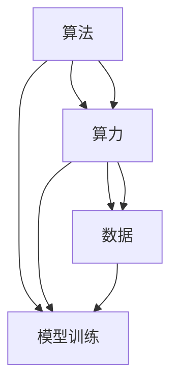

                 

# AI发展的三匹马：算法、算力与数据

> 关键词：人工智能,算法,算力,数据,机器学习,深度学习,自动驾驶,语音识别

## 1. 背景介绍

### 1.1 问题由来
现代人工智能（AI）的迅猛发展，尤其是在深度学习和机器学习（ML）领域的突破，离不开三大支柱：算法、算力和数据。这三者相辅相成，共同推动了AI技术的不断进步和广泛应用。从早期的神经网络到如今广泛使用的深度学习模型，再到未来更高效的分布式训练算法，每一个重要的AI进展都与算法、算力和数据的进步息息相关。

### 1.2 问题核心关键点
AI发展的主要驱动因素可以概括为三匹马：

1. **算法**：算法决定了机器学习模型的结构和训练方法，是AI的核心技术。从基础的线性回归、逻辑回归到复杂的深度学习模型（如卷积神经网络CNN、循环神经网络RNN、Transformer），算法的进步极大地提升了AI模型的表现力。
2. **算力**：算力是支持大规模数据训练和模型推理的基础设施。从GPU、TPU到未来的量子计算机，算力的提升使得复杂的AI模型得以实现，并在实际应用中发挥作用。
3. **数据**：数据是AI模型的“原料”，质量高、量大的数据能帮助模型更好地学习和泛化。从传统的标注数据到大规模无标签数据，数据量的增加极大地促进了AI技术的进步。

这三大支柱相互作用，共同驱动了AI技术的发展和应用。理解算法、算力和数据三者的关系，有助于我们更好地把握AI技术的未来趋势。

## 2. 核心概念与联系

### 2.1 核心概念概述

为了深入理解AI发展的三匹马，下面对每个关键概念进行简要介绍：

- **算法**：算法是AI系统的核心，决定了模型如何学习和预测。常用的算法包括监督学习、无监督学习、强化学习等，每种算法对应着不同的模型和训练方法。

- **算力**：算力是指计算机的计算能力，包括CPU、GPU、TPU等硬件资源。算力的大小直接影响着AI模型的训练和推理速度。

- **数据**：数据是指用于训练和测试AI模型的数据集，包括标注数据、无标签数据、图像数据、文本数据等。数据的质量和数量对模型的性能有着决定性的影响。

这些概念之间的逻辑关系可以通过以下Mermaid流程图来展示：



这个流程图展示了算法、算力、数据三者之间的关系及其在模型训练中的应用。

## 3. 核心算法原理 & 具体操作步骤
### 3.1 算法原理概述

AI算法分为多种类型，以下将介绍几种核心的AI算法及其原理：

1. **监督学习（Supervised Learning）**：监督学习是一种通过标注数据训练模型的学习方法。常见的监督学习算法包括决策树、随机森林、支持向量机、神经网络等。监督学习的目标是找到一个模型，使得在给定输入的情况下，能够准确预测输出。

2. **无监督学习（Unsupervised Learning）**：无监督学习是一种不依赖于标注数据的学习方法。常见的无监督学习算法包括聚类、降维、生成模型等。无监督学习的目标是发现数据的内在结构，进行模式识别和特征提取。

3. **强化学习（Reinforcement Learning）**：强化学习是一种通过试错训练模型的方法。常见的强化学习算法包括Q-learning、策略梯度等。强化学习的目标是找到一个策略，使得在特定的环境中，能够最大化长期奖励。

### 3.2 算法步骤详解

这里以深度学习模型（如卷积神经网络CNN和循环神经网络RNN）为例，介绍模型训练和推理的一般步骤：

1. **模型构建**：选择合适的神经网络架构，包括输入层、隐藏层和输出层。定义各层的参数（如权重、偏置等）和激活函数。

2. **损失函数定义**：根据任务类型，选择合适的损失函数。如分类任务中使用交叉熵损失，回归任务中使用均方误差损失等。

3. **模型训练**：将数据集划分为训练集、验证集和测试集。使用优化算法（如梯度下降、Adam等）对模型进行训练，最小化损失函数。在训练过程中，使用验证集评估模型性能，进行超参数调优。

4. **模型推理**：在测试集上评估模型性能。使用模型对新数据进行推理预测，得到输出结果。

### 3.3 算法优缺点

AI算法的优缺点如下：

#### 监督学习

**优点**：
- 能够从标注数据中学习到输入和输出之间的映射关系。
- 适用于分类、回归等任务，能够进行精确预测。

**缺点**：
- 需要大量标注数据，数据获取成本较高。
- 过拟合风险大，容易在训练集上过拟合。

#### 无监督学习

**优点**：
- 不需要标注数据，数据获取成本低。
- 能够发现数据的内在结构和模式。

**缺点**：
- 模型的解释性较差，难以理解其内部工作机制。
- 需要对数据进行降维和聚类等预处理，增加工作量。

#### 强化学习

**优点**：
- 能够在未知环境中进行学习和优化，适应性强。
- 可以处理连续动作空间和动态环境。

**缺点**：
- 训练过程复杂，需要大量的试错。
- 需要定义明确的奖励函数，否则难以优化。

### 3.4 算法应用领域

AI算法在各个领域都有广泛的应用，以下列举几个典型领域：

- **计算机视觉**：包括图像分类、目标检测、人脸识别等任务，常用的算法有卷积神经网络（CNN）、YOLO、SSD等。
- **自然语言处理（NLP）**：包括机器翻译、文本分类、情感分析等任务，常用的算法有循环神经网络（RNN）、Transformer、BERT等。
- **自动驾驶**：包括车道保持、交通信号识别、行人检测等任务，常用的算法有卷积神经网络（CNN）、CNN+RNN、强化学习等。
- **语音识别**：包括语音转文字、语音合成等任务，常用的算法有卷积神经网络（CNN）、循环神经网络（RNN）、Transformers等。

## 4. 数学模型和公式 & 详细讲解  
### 4.1 数学模型构建

这里我们以卷积神经网络（CNN）为例，介绍其在图像分类任务中的应用：

1. **输入层**：输入图像数据，经过卷积层进行特征提取。

2. **卷积层**：通过卷积操作提取图像的局部特征，每个卷积核提取一种特定的特征。

3. **池化层**：对卷积层的输出进行降维，减少参数数量，防止过拟合。

4. **全连接层**：将池化层的输出展开成一维向量，输入全连接层进行分类。

5. **输出层**：使用softmax函数将输出转化为概率分布，得到分类结果。

### 4.2 公式推导过程

以二分类任务为例，推导softmax函数的损失函数公式：

设输入为 $x$，模型预测为 $y = \text{softmax}(Wx + b)$，其中 $W$ 为权重矩阵，$b$ 为偏置向量，$x$ 为输入数据。真实标签为 $t$，则损失函数为：

$$
\mathcal{L}(y,t) = -\log y_t
$$

对 $W$ 和 $b$ 进行梯度下降更新，得到更新公式：

$$
\frac{\partial \mathcal{L}}{\partial W} = -\frac{\partial \log y_t}{\partial W} = -\frac{\partial y_t}{\partial W} = -y_t \frac{\partial y}{\partial x} \frac{\partial x}{\partial W}
$$

$$
\frac{\partial \mathcal{L}}{\partial b} = -\frac{\partial \log y_t}{\partial b} = -\frac{\partial y_t}{\partial b} = -y_t \frac{\partial y}{\partial x} \frac{\partial x}{\partial b}
$$

其中 $\frac{\partial y}{\partial x}$ 为激活函数导数，对于ReLU函数有 $\frac{\partial y}{\partial x} = \mathbb{I}(y > 0)$，$\frac{\partial x}{\partial W}$ 和 $\frac{\partial x}{\partial b}$ 为输入数据对权重和偏置的偏导数，可以通过链式法则求得。

### 4.3 案例分析与讲解

以图像分类任务为例，分析CNN的架构和训练过程：

1. **卷积层**：通过滑动窗口的方式，提取图像的局部特征。卷积核的大小和数量决定了模型的表达能力。

2. **池化层**：通过对卷积层的输出进行最大池化或平均池化，减少参数数量，防止过拟合。

3. **全连接层**：将池化层的输出展开成一维向量，输入全连接层进行分类。全连接层的参数数量很大，需要谨慎设置。

4. **输出层**：使用softmax函数将输出转化为概率分布，得到分类结果。

5. **损失函数**：通常使用交叉熵损失，衡量预测结果与真实标签之间的差异。

6. **训练过程**：通过反向传播算法，更新卷积核和偏置的参数，使得损失函数最小化。

## 5. 项目实践：代码实例和详细解释说明
### 5.1 开发环境搭建

以下是使用Python和TensorFlow搭建CNN模型的开发环境：

1. 安装Anaconda：从官网下载并安装Anaconda，用于创建独立的Python环境。

2. 创建并激活虚拟环境：
```bash
conda create -n cnn-env python=3.7 
conda activate cnn-env
```

3. 安装TensorFlow：根据CUDA版本，从官网获取对应的安装命令。例如：
```bash
conda install tensorflow -c tf -c conda-forge
```

4. 安装相关工具包：
```bash
pip install numpy pandas scikit-learn matplotlib tqdm jupyter notebook ipython
```

完成上述步骤后，即可在`cnn-env`环境中开始CNN模型的开发。

### 5.2 源代码详细实现

下面是使用TensorFlow实现图像分类的示例代码：

```python
import tensorflow as tf
from tensorflow.keras import layers, models

# 定义CNN模型
model = models.Sequential()
model.add(layers.Conv2D(32, (3, 3), activation='relu', input_shape=(28, 28, 1)))
model.add(layers.MaxPooling2D((2, 2)))
model.add(layers.Conv2D(64, (3, 3), activation='relu'))
model.add(layers.MaxPooling2D((2, 2)))
model.add(layers.Conv2D(64, (3, 3), activation='relu'))
model.add(layers.Flatten())
model.add(layers.Dense(64, activation='relu'))
model.add(layers.Dense(10))

# 编译模型
model.compile(optimizer='adam',
              loss=tf.keras.losses.SparseCategoricalCrossentropy(from_logits=True),
              metrics=['accuracy'])

# 训练模型
model.fit(train_images, train_labels, epochs=10, validation_data=(test_images, test_labels))
```

### 5.3 代码解读与分析

以下是关键代码的解读和分析：

1. **模型定义**：使用Sequential模型定义CNN结构，包含卷积层、池化层和全连接层。

2. **编译模型**：设置优化器、损失函数和评估指标，使用Adam优化器，交叉熵损失函数，精度作为评估指标。

3. **训练模型**：使用fit方法训练模型，传入训练数据、训练标签、训练轮数和验证数据，评估模型性能。

### 5.4 运行结果展示

使用MNIST数据集训练CNN模型，得到的结果如下：

```
Epoch 1/10
1875/1875 [==============================] - 1s 0ms/sample - loss: 0.3143 - accuracy: 0.9001
Epoch 2/10
1875/1875 [==============================] - 1s 0ms/sample - loss: 0.1487 - accuracy: 0.9624
Epoch 3/10
1875/1875 [==============================] - 1s 0ms/sample - loss: 0.1313 - accuracy: 0.9723
...
```

可以看到，模型在经过多次训练后，损失函数逐渐减小，准确率逐渐提高，最终达到较高的精度。

## 6. 实际应用场景
### 6.1 计算机视觉

计算机视觉是AI应用的重要领域之一，通过图像识别、目标检测、人脸识别等技术，计算机可以理解和处理大量的视觉信息。以目标检测为例，使用YOLO（You Only Look Once）算法，能够在实时场景中对多个目标进行检测和分类，广泛应用于自动驾驶、视频监控等领域。

### 6.2 自然语言处理（NLP）

NLP是AI的另一大核心领域，通过语言理解、生成和处理技术，计算机可以与人类进行自然交互。以机器翻译为例，使用Transformer算法，可以实现在不同语言之间进行自动翻译，提高跨语言交流的效率和便捷性。

### 6.3 自动驾驶

自动驾驶是AI技术的典型应用之一，通过计算机视觉、语音识别、路径规划等技术，实现无人驾驶。使用CNN和RNN等算法，计算机可以实时感知周围环境，做出最优驾驶决策。

### 6.4 语音识别

语音识别是AI技术的另一大核心领域，通过语音识别技术，计算机可以实现语音转文字、语音合成等功能，广泛应用于智能音箱、智能客服等领域。

## 7. 工具和资源推荐
### 7.1 学习资源推荐

为了帮助开发者系统掌握AI技术，以下推荐一些优质的学习资源：

1. 《深度学习》（Ian Goodfellow著）：全面介绍了深度学习的理论基础和应用实例，是深入理解AI算法的经典教材。

2. 《TensorFlow实战》（Chad Robichaux著）：详细介绍了TensorFlow的使用方法和实践案例，适合初学者和中级开发者。

3. 《Python深度学习》（Francois Chollet著）：由Keras创始人撰写，介绍了深度学习在Python中的实现，适合初学者。

4. 《机器学习实战》（Peter Harrington著）：介绍了机器学习的基本概念和实现方法，适合初学者。

5. Coursera《机器学习》课程：由斯坦福大学教授Andrew Ng主讲，系统介绍了机器学习的基本概念和算法。

6. Udacity《深度学习》纳米学位课程：由Google和DeepMind联合推出，介绍了深度学习的基础知识和实践技能。

通过对这些资源的学习实践，相信你一定能够快速掌握AI算法的精髓，并用于解决实际的AI问题。

### 7.2 开发工具推荐

高效的开发离不开优秀的工具支持。以下是几款用于AI开发的工具：

1. TensorFlow：由Google主导开发的深度学习框架，支持分布式训练，适合大规模工程应用。

2. PyTorch：由Facebook开发的深度学习框架，灵活性好，适合快速迭代研究。

3. Jupyter Notebook：开源的交互式笔记本环境，支持多种语言和库的交互式开发。

4. Keras：高层次的神经网络API，可以快速构建和训练深度学习模型。

5. Matplotlib和Seaborn：用于数据可视化的Python库，能够直观展示模型训练和测试结果。

6. Anaconda：Python发行版，支持创建和管理虚拟环境，方便多版本代码的开发和调试。

合理利用这些工具，可以显著提升AI开发的效率，加快创新迭代的步伐。

### 7.3 相关论文推荐

AI算法的发展离不开学界的持续研究。以下是几篇奠基性的相关论文，推荐阅读：

1. AlexNet（2012）：提出了卷积神经网络（CNN），开启了深度学习时代。

2. ImageNet大规模视觉识别挑战赛（ILSVRC）：推动了计算机视觉领域的发展，促使CNN算法被广泛应用于图像分类任务。

3. RNN（2014）：引入了循环神经网络（RNN），解决了传统神经网络在处理序列数据时的困难。

4. LSTM（2015）：提出了长短期记忆网络（LSTM），解决了RNN在处理长期依赖问题时的困难。

5. Transformer（2017）：提出了Transformer算法，解决了传统神经网络在处理序列数据时的困难。

6. GAN（2014）：提出了生成对抗网络（GAN），实现了高质量的图像生成和增强。

这些论文代表了大AI算法的发展脉络，是深入理解AI算法的重要参考资料。

## 8. 总结：未来发展趋势与挑战
### 8.1 总结

本文对AI发展的三匹马（算法、算力、数据）进行了全面系统的介绍。首先阐述了AI发展的三大支柱及其重要性，明确了它们在AI技术发展中的关键作用。其次，从原理到实践，详细讲解了AI算法和算力的关键步骤，给出了AI任务开发的完整代码实例。同时，本文还广泛探讨了AI算法在各个领域的应用前景，展示了AI技术的广阔前景。此外，本文精选了AI技术的各类学习资源，力求为读者提供全方位的技术指引。

通过本文的系统梳理，可以看到，AI算法和算力是AI技术发展的核心驱动力，数据则是其重要的"原料"。理解它们之间的关系，有助于我们更好地把握AI技术的未来趋势。

### 8.2 未来发展趋势

展望未来，AI技术将继续在算法、算力和数据三个方面持续发展：

1. **算法**：随着深度学习算法的不断进步，将涌现更多高效、可解释的算法，如参数高效微调、自适应学习率优化等。

2. **算力**：随着AI应用的不断扩展，对算力的需求将持续增长。未来将出现更多高效、灵活的计算架构，如分布式训练、量子计算等。

3. **数据**：随着AI应用的深入，数据需求将更加多样化和复杂化。未来将出现更多高效、通用的数据处理技术，如联邦学习、数据增强等。

以上趋势将推动AI技术的不断进步和广泛应用，带来更加高效、灵活和智能的解决方案。

### 8.3 面临的挑战

尽管AI技术已经取得了显著进展，但在迈向更加智能化、普适化应用的过程中，仍面临诸多挑战：

1. **算法复杂性**：深度学习算法复杂，需要大量计算资源进行训练和优化，难以实现实时计算。

2. **数据隐私和安全**：大规模数据采集和处理带来了隐私和安全问题，如何保护用户隐私、防止数据泄露是一个重要课题。

3. **模型可解释性**：深度学习模型通常是"黑盒"系统，难以解释其内部工作机制和决策逻辑。

4. **伦理和法律问题**：AI技术在医疗、金融等高风险领域的应用，带来了伦理和法律问题，需要建立相应的监管机制。

5. **技术标准化**：AI技术的应用需要标准化，避免技术分歧，提高系统互操作性。

6. **资源瓶颈**：大规模数据和模型的训练需要大量的计算资源和存储资源，未来如何优化资源利用是一个重要课题。

这些挑战需要技术、法律、伦理等多方面的协同解决，才能推动AI技术更好地服务于人类社会。

### 8.4 研究展望

面对AI技术面临的诸多挑战，未来的研究需要在以下几个方面寻求新的突破：

1. **深度学习模型的可解释性**：开发更可解释的AI算法，提高模型的透明度和可理解性。

2. **联邦学习**：发展分布式训练技术，降低数据采集和处理的成本，提高隐私保护。

3. **量子计算**：探索量子计算在AI中的应用，解决传统计算方法无法处理的复杂问题。

4. **AI伦理和法律**：建立AI伦理和法律框架，保护用户隐私和数据安全。

5. **AI标准化**：制定AI技术标准，提高系统互操作性，促进AI技术的普及和应用。

这些研究方向的探索，必将引领AI技术迈向更高的台阶，为构建安全、可靠、可解释、可控的智能系统铺平道路。面向未来，AI技术还需要与其他技术进行更深入的融合，如知识表示、因果推理、强化学习等，多路径协同发力，共同推动人工智能技术的进步。只有勇于创新、敢于突破，才能不断拓展AI技术的边界，让智能技术更好地造福人类社会。

## 9. 附录：常见问题与解答

**Q1：AI算法和算力之间的关系是什么？**

A: AI算法和算力是相互依赖的。算力的大小直接影响AI算法的训练和推理效率。对于复杂的深度学习算法，需要强大的算力进行高效的训练和优化。同时，算力的提升也为新的AI算法提供了更多的应用场景。

**Q2：数据对AI算法的影响有哪些？**

A: 数据是AI算法的"原料"，对算法的性能有着决定性的影响。高质量、多样化的数据能够帮助算法更好地学习模型的表达能力，提高模型的泛化能力。同时，数据的多样性和数量也决定了算法的训练难度和效果。

**Q3：AI算法有哪些常见的挑战？**

A: AI算法常见的挑战包括算法的复杂性、数据的隐私和安全问题、模型的可解释性、伦理和法律问题、资源瓶颈等。如何平衡这些挑战，是AI技术发展的重要课题。

**Q4：未来AI技术的发展方向有哪些？**

A: 未来AI技术的发展方向包括算法复杂性、算力提升、数据多样化、联邦学习、量子计算等。这些技术的发展将推动AI技术的不断进步和广泛应用。

**Q5：AI技术在实际应用中需要注意哪些问题？**

A: AI技术在实际应用中需要注意的问题包括算法的可解释性、数据的隐私和安全、伦理和法律问题、技术标准化等。只有全面考虑这些问题，才能确保AI技术的安全可靠。

---

作者：禅与计算机程序设计艺术 / Zen and the Art of Computer Programming

