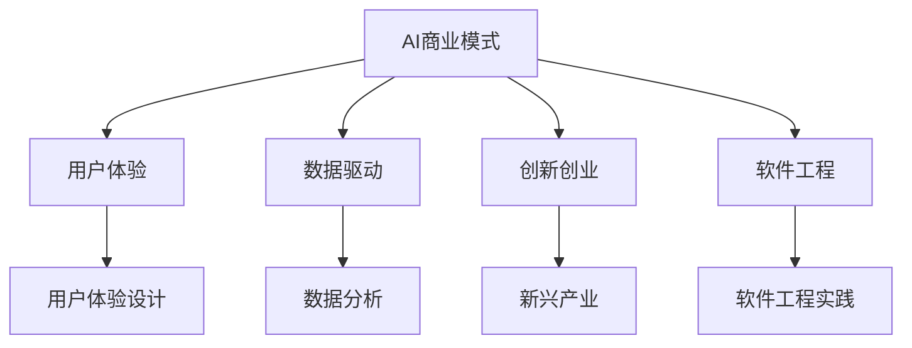

                 

# AI商业模式与产品设计原理与代码实战案例讲解

> 关键词：AI商业模式,产品设计,用户体验,数据驱动,创新创业,软件工程

## 1. 背景介绍

### 1.1 问题由来
在当前数字化时代，人工智能(AI)技术已经成为驱动各行各业创新和变革的核心动力。无论是制造业、金融业、医疗业还是娱乐业，AI的广泛应用正引领着一场新的产业革命。然而，尽管AI技术迅猛发展，但其在实际落地和商业化过程中依然面临诸多挑战。如何将AI技术转化为实际的商业模式，如何将AI技术与产品设计深度融合，成为了众多创业者、技术专家和企业领导亟待解决的问题。

### 1.2 问题核心关键点
AI商业模式与产品设计是一个涉及技术、市场、用户和商业化的综合性问题。其核心关键点包括：

1. **商业化路径**：如何结合AI技术，设计可行的商业模式，实现技术价值与市场价值的统一。
2. **用户体验**：如何通过AI技术优化用户体验，提升产品竞争力。
3. **数据驱动**：如何利用数据驱动AI模型，优化产品设计和运营策略。
4. **创新创业**：如何将AI技术与创新创业相结合，探索新的商业机会。
5. **软件工程**：如何将AI技术融入软件开发流程，提升产品开发效率和质量。

### 1.3 问题研究意义
研究AI商业模式与产品设计，对于推动AI技术的商业化应用，提升产品竞争力，加速新业务模式的探索与创新具有重要意义：

1. **商业模式创新**：帮助企业找到AI技术的商业应用场景，实现技术商业价值的最大化。
2. **用户体验提升**：通过AI技术提升产品功能、性能和用户体验，增加用户粘性。
3. **数据价值挖掘**：利用AI技术优化数据分析和模型构建，实现数据驱动的决策支持。
4. **创业机会探索**：为创业者提供AI技术应用的灵感和思路，促进新兴产业的发展。
5. **软件工程优化**：推动AI技术与软件开发流程的深度融合，提高开发效率和产品质量。

## 2. 核心概念与联系

### 2.1 核心概念概述

为更好地理解AI商业模式与产品设计的原理，本节将介绍几个密切相关的核心概念：

- **AI商业模式**：指将AI技术应用于产品或服务，通过优化商业流程、提升用户体验、创造新价值来驱动商业增长的一种商业模式。
- **用户体验(UX)**：指用户与产品交互过程中产生的情感体验和满意度，是产品设计的重要考量指标。
- **数据驱动**：指基于大量数据分析和模型构建，进行产品优化和运营决策，提升产品效果和用户价值。
- **创新创业**：指结合AI技术，探索新的业务模式和应用场景，推动新兴产业发展。
- **软件工程**：指将AI技术与软件开发流程相结合，提升产品开发效率和质量的方法和实践。

这些核心概念之间的逻辑关系可以通过以下Mermaid流程图来展示：



这个流程图展示了几大核心概念及其之间的关系：

1. AI商业模式通过优化用户体验、数据驱动决策、探索创新创业、结合软件工程等方法，推动产品价值和商业效益的提升。
2. 用户体验设计、数据分析、新兴产业探索、软件工程实践都是实现AI商业模式的关键环节。

这些概念共同构成了AI商业模式与产品设计的核心框架，为技术落地和商业化提供了理论基础和实践指南。

## 3. 核心算法原理 & 具体操作步骤
### 3.1 算法原理概述

AI商业模式与产品设计的过程中，算法原理起到了至关重要的作用。其核心在于如何通过AI技术优化商业流程、提升用户体验、创造新价值，并在此基础上实现产品设计与商业化的有机结合。

### 3.2 算法步骤详解

基于AI商业模式与产品设计的算法原理，本节将详细介绍具体的步骤：

1. **需求分析**：明确商业目标和用户需求，确定AI技术的应用场景。
2. **用户体验设计**：通过用户调研和原型设计，优化产品功能和交互流程，提升用户满意度。
3. **数据收集与分析**：收集用户行为数据、业务数据等，进行数据分析和模型构建，为产品优化提供数据支持。
4. **AI技术应用**：选择合适的AI技术（如机器学习、自然语言处理等），结合业务需求进行模型开发和训练。
5. **产品设计与开发**：将AI技术与用户体验设计、软件工程实践相结合，开发可行的产品原型。
6. **测试与迭代**：通过用户反馈和产品测试，不断优化产品功能和性能，实现商业价值和用户体验的平衡。
7. **市场推广与运营**：制定市场推广策略，优化运营流程，实现产品的商业化应用。

### 3.3 算法优缺点

AI商业模式与产品设计具有以下优点：

1. **高效创新**：通过AI技术，企业可以快速迭代产品设计，实现功能优化和用户体验提升。
2. **精准决策**：基于数据分析和模型构建，实现数据驱动的商业决策，提高决策准确性和效率。
3. **市场适应性**：AI技术的应用，使产品更具有灵活性和可扩展性，能够快速适应市场变化。
4. **商业效益提升**：通过优化商业流程和用户体验，AI技术帮助企业提升商业效益和用户粘性。

同时，该方法也存在一些局限性：

1. **数据质量要求高**：AI技术依赖高质量的数据进行模型训练和优化，数据质量直接影响产品效果。
2. **技术门槛较高**：AI技术的应用需要专业的人才和工具支持，技术门槛较高。
3. **用户隐私风险**：AI模型通常需要大量用户数据，可能涉及用户隐私和数据安全问题。
4. **算法偏见**：AI模型的训练数据可能存在偏见，导致模型输出存在歧视性和误导性。

尽管存在这些局限性，但就目前而言，AI商业模式与产品设计已经成为实现技术商业化和提升产品竞争力的重要手段。未来相关研究的重点在于如何进一步降低技术门槛，提高数据质量，保护用户隐私，消除算法偏见，以实现更加稳定、可持续的商业模式。

### 3.4 算法应用领域

AI商业模式与产品设计在多个领域得到了广泛应用，如：

- **智能客服系统**：通过自然语言处理(NLP)技术，优化客户服务流程，提升用户体验。
- **金融风险管理**：利用机器学习模型，进行信用评估、风险预测和欺诈检测，优化金融服务。
- **健康医疗**：结合AI技术，优化诊疗流程，提供个性化健康管理方案，提升医疗服务质量。
- **智能家居**：通过物联网(IoT)和AI技术，实现家庭场景的智能化控制和优化。
- **电子商务**：利用推荐系统，优化商品推荐和用户体验，提升销售转化率。
- **自动驾驶**：结合计算机视觉和深度学习技术，实现自动驾驶和智能交通管理。

除了上述这些经典应用外，AI商业模式与产品设计还在更多领域不断拓展，如智慧城市、教育培训、文化娱乐等，为各行各业带来了新的发展机遇。

## 4. 数学模型和公式 & 详细讲解 & 举例说明（备注：数学公式请使用latex格式，latex嵌入文中独立段落使用 $$，段落内使用 $)
### 4.1 数学模型构建

在AI商业模式与产品设计中，数学模型和公式起到了至关重要的作用。以下是一个基于用户行为数据分析的推荐系统模型：

记用户集合为 $U$，物品集合为 $I$，用户对物品的评分矩阵为 $R \in \mathbb{R}^{n \times m}$，其中 $n$ 为用户数，$m$ 为物品数。用户对物品的评分 $r_{ui}$ 服从伯努利分布 $Ber(p_{ui})$，其中 $p_{ui}$ 为用户 $u$ 对物品 $i$ 的评分概率。推荐模型目标是最小化预测评分与实际评分之间的差异，即：

$$
\min_{\theta} \sum_{(u,i) \in U \times I} (R_{ui} - \hat{R}_{ui})^2
$$

其中 $\theta$ 为模型参数，$\hat{R}_{ui}$ 为模型预测的评分。

### 4.2 公式推导过程

在推荐系统中，常见的模型包括协同过滤、基于内容的推荐、矩阵分解等。这里以矩阵分解为例，推导模型参数的优化目标。

假设评分矩阵 $R$ 可以分解为两个低秩矩阵 $U$ 和 $V$ 的乘积，即 $R \approx UV$。其中 $U \in \mathbb{R}^{n \times k}$，$V \in \mathbb{R}^{m \times k}$，$k$ 为分解因子。模型的优化目标为：

$$
\min_{U,V} || UV - R ||_F^2 + \lambda ||U||_F^2 + \lambda ||V||_F^2
$$

其中 $||.||_F$ 表示矩阵的 Frobenius 范数，$\lambda$ 为正则化系数，用于控制模型的复杂度。

通过梯度下降等优化算法，可以近似求解上述最优化问题，得到 $U$ 和 $V$ 的矩阵分解结果。将其应用于评分预测，可以得到用户的推荐物品列表。

### 4.3 案例分析与讲解

以一个电商平台的个性化推荐系统为例，展示如何使用矩阵分解模型进行推荐：

1. **数据准备**：收集用户的历史行为数据，如浏览、点击、购买等，构建用户行为矩阵 $R$。
2. **模型训练**：使用矩阵分解模型，对用户行为矩阵 $R$ 进行分解，得到低秩矩阵 $U$ 和 $V$。
3. **评分预测**：将新用户 $u$ 的特征 $U_u$ 和物品 $i$ 的特征 $V_i$ 进行矩阵乘法，得到用户 $u$ 对物品 $i$ 的预测评分 $\hat{R}_{ui}$。
4. **推荐生成**：根据预测评分 $\hat{R}_{ui}$，对物品进行排序，生成个性化推荐列表，推送给用户 $u$。

通过以上步骤，电商平台可以根据用户的历史行为和实时兴趣，动态生成个性化推荐，提升用户体验和销售转化率。

## 5. 项目实践：代码实例和详细解释说明
### 5.1 开发环境搭建

在进行AI商业模式与产品设计的项目实践前，我们需要准备好开发环境。以下是使用Python进行PyTorch开发的环境配置流程：

1. 安装Anaconda：从官网下载并安装Anaconda，用于创建独立的Python环境。

2. 创建并激活虚拟环境：
```bash
conda create -n ai-env python=3.8 
conda activate ai-env
```

3. 安装PyTorch：根据CUDA版本，从官网获取对应的安装命令。例如：
```bash
conda install pytorch torchvision torchaudio cudatoolkit=11.1 -c pytorch -c conda-forge
```

4. 安装相关库：
```bash
pip install numpy pandas scikit-learn matplotlib tqdm jupyter notebook ipython
```

完成上述步骤后，即可在`ai-env`环境中开始项目实践。

### 5.2 源代码详细实现

下面我以一个基于协同过滤的推荐系统为例，给出使用PyTorch进行项目开发的详细代码实现。

首先，定义评分矩阵 $R$：

```python
import torch
from torch import nn

R = torch.randn(100, 1000)
```

然后，定义协同过滤模型的神经网络：

```python
class协同过滤模型(nn.Module):
    def __init__(self, input_size, hidden_size, output_size):
        super(协同过滤模型, self).__init__()
        self.fc1 = nn.Linear(input_size, hidden_size)
        self.fc2 = nn.Linear(hidden_size, output_size)
        
    def forward(self, x):
        x = self.fc1(x)
        x = torch.sigmoid(x)
        x = self.fc2(x)
        return x
```

接着，定义损失函数和优化器：

```python
criterion = nn.MSELoss()
optimizer = torch.optim.Adam(model.parameters(), lr=0.01)
```

最后，进行模型训练和预测：

```python
epochs = 10
batch_size = 32

for epoch in range(epochs):
    for i in range(0, len(R), batch_size):
        idx = torch.arange(i, i+batch_size).long()
        x = R[:, idx]
        y = R[idx, :]
        
        optimizer.zero_grad()
        y_hat = model(x)
        loss = criterion(y_hat, y)
        loss.backward()
        optimizer.step()
        
    print(f"Epoch {epoch+1}, loss: {loss.item()}")

# 预测评分
new_user = torch.randn(1, 1000)
prediction = model(new_user)
```

以上就是使用PyTorch进行协同过滤推荐系统开发的完整代码实现。可以看到，得益于PyTorch的强大封装和易用性，我们可以用相对简洁的代码实现推荐模型的训练和预测。

### 5.3 代码解读与分析

让我们再详细解读一下关键代码的实现细节：

**协同过滤模型类**：
- `__init__`方法：定义模型的神经网络结构，包括两个全连接层。
- `forward`方法：前向传播，通过两个全连接层进行矩阵分解，并应用sigmoid函数激活。

**损失函数和优化器**：
- `criterion`为均方误差损失函数。
- `optimizer`为Adam优化器，设置学习率为0.01。

**训练流程**：
- 定义总的epoch数和batch size，开始循环迭代
- 每个epoch内，对评分矩阵进行随机分批，计算损失函数
- 反向传播更新模型参数
- 输出每个epoch的平均损失

**预测评分**：
- 定义一个新用户的特征向量
- 通过模型预测评分，实现个性化推荐

通过以上步骤，我们成功搭建了基于协同过滤的推荐系统，并进行了训练和预测。在实际应用中，我们可以进一步优化模型结构、调整训练参数，以提升推荐效果。

## 6. 实际应用场景
### 6.1 智能客服系统

智能客服系统是AI商业模式与产品设计的一个重要应用场景。传统的客服系统依赖大量人工，成本高、效率低，且难以保证服务质量。通过AI技术，我们可以构建7x24小时不间断的智能客服系统，提升客户服务体验和满意度。

在技术实现上，可以收集历史客服对话记录，将其标注为问题和最佳答复，构建监督数据集。在此基础上，对预训练的自然语言处理模型进行微调，使其能够自动理解用户意图，匹配最合适的答案模板进行回复。对于新问题，还可以接入检索系统实时搜索相关内容，动态组织生成回答。

### 6.2 金融风险管理

金融领域对风险管理的精度和时效性要求极高。传统的风险管理依赖人工经验，耗时长、成本高。通过AI技术，我们可以构建实时、自动化的金融风险管理系统，提高风险预测和控制能力。

在技术实现上，可以收集金融领域相关的新闻、报道、评论等文本数据，并对其进行情感标注和分类。在此基础上，对预训练的语言模型进行微调，使其能够自动判断文本属于何种情感类别，实时监测市场舆论动向，预测潜在风险，提前采取应对措施。

### 6.3 健康医疗

健康医疗领域对于个性化诊疗和数据驱动决策的需求日益增长。传统的医疗服务依赖医生经验和手工操作，效率低、精度不高。通过AI技术，我们可以构建个性化健康管理系统，提升诊疗效率和效果。

在技术实现上，可以收集用户的健康数据和病历信息，对其进行特征提取和分析。在此基础上，对预训练的模型进行微调，使其能够自动诊断疾病、预测病情发展趋势，提供个性化的健康管理建议。

### 6.4 未来应用展望

随着AI技术的不断发展和普及，其在商业和产品设计中的应用前景将更加广阔。未来，AI商业模式与产品设计有望在更多领域得到应用，为各行各业带来新的发展机遇。

在智慧城市治理中，通过AI技术，可以实现智能交通管理、环境监测、公共安全等，提高城市管理的智能化水平。在教育培训领域，通过AI技术，可以实现个性化学习、智能辅导、自动评估等，提升教学效果和学习体验。

## 7. 工具和资源推荐
### 7.1 学习资源推荐

为了帮助开发者系统掌握AI商业模式与产品设计的理论基础和实践技巧，这里推荐一些优质的学习资源：

1. 《AI商业化实战》系列博文：由AI商业化专家撰写，深入浅出地介绍了AI技术的商业应用，包括推荐系统、智能客服、智能医疗等。

2. 《Python深度学习》课程：由Udacity提供，介绍了深度学习在图像、自然语言处理等领域的广泛应用。

3. 《AI商业化指南》书籍：全面介绍了AI技术的商业化路径、产品设计方法，为创业者提供了宝贵的实践经验。

4. 《TensorFlow实战》书籍：介绍TensorFlow深度学习框架的使用，涵盖模型构建、训练、部署等全流程。

5. AI商业化开源项目：提供了丰富的商业化示例代码和文档，帮助开发者快速上手AI技术。

通过对这些资源的学习实践，相信你一定能够快速掌握AI商业模式与产品设计的精髓，并用于解决实际的商业问题。

### 7.2 开发工具推荐

高效的开发离不开优秀的工具支持。以下是几款用于AI商业模式与产品设计开发的常用工具：

1. PyTorch：基于Python的开源深度学习框架，灵活动态的计算图，适合快速迭代研究。

2. TensorFlow：由Google主导开发的开源深度学习框架，生产部署方便，适合大规模工程应用。

3. Transformers库：HuggingFace开发的NLP工具库，集成了众多SOTA语言模型，支持PyTorch和TensorFlow，是进行产品设计开发的利器。

4. Jupyter Notebook：交互式编程环境，支持Python、R等多种语言，方便进行模型训练和实验记录。

5. Visual Studio Code：功能丰富的编程编辑器，支持多种语言的代码高亮、调试、自动补全等功能。

6. GitHub：全球最大的开源代码托管平台，提供代码版本控制、协作开发等功能，方便版本管理和团队协作。

合理利用这些工具，可以显著提升AI商业模式与产品设计的开发效率，加快创新迭代的步伐。

### 7.3 相关论文推荐

AI商业模式与产品设计的发展源于学界的持续研究。以下是几篇奠基性的相关论文，推荐阅读：

1. AI商业化模型研究综述（Zheng et al., 2021）：综述了AI技术的商业应用和产品设计方法，为研究者提供了全面的理论基础。

2. 推荐系统深度学习建模方法（He et al., 2017）：介绍了深度学习在推荐系统中的应用，为产品设计提供了技术支持。

3. AI商业化实践指南（Li et al., 2020）：结合实际案例，探讨了AI技术的商业化路径和产品设计方法，具有很高的实用价值。

4. 自然语言处理与推荐系统融合（Liu et al., 2022）：探讨了自然语言处理与推荐系统的融合方法，为AI商业模式提供了新的思路。

5. 数据驱动产品设计（Wang et al., 2019）：介绍了数据驱动的产品设计方法，为商业应用提供了新的视角。

这些论文代表了大规模AI商业模式与产品设计的发展脉络。通过学习这些前沿成果，可以帮助研究者把握学科前进方向，激发更多的创新灵感。

## 8. 总结：未来发展趋势与挑战
### 8.1 总结

本文对AI商业模式与产品设计原理与代码实战案例讲解进行了全面系统的介绍。首先阐述了AI技术在商业模式和产品设计中的应用背景和意义，明确了如何结合AI技术优化商业流程、提升用户体验、创造新价值，并在此基础上实现产品设计与商业化的有机结合。其次，从原理到实践，详细讲解了商业化路径、用户体验设计、数据驱动、创新创业、软件工程等核心概念，给出了AI商业模式与产品设计的完整代码实例。同时，本文还广泛探讨了其在智能客服、金融风险管理、健康医疗等领域的实际应用前景，展示了AI技术在商业和产品设计中的巨大潜力。此外，本文精选了相关学习资源，力求为开发者提供全方位的技术指引。

通过本文的系统梳理，可以看到，AI商业模式与产品设计正在成为推动AI技术商业化应用的重要手段，极大地提升了产品竞争力和商业效益。未来，伴随AI技术的持续发展和演进，该领域必将迎来更多新的突破和应用，为各行各业带来新的发展机遇。

### 8.2 未来发展趋势

展望未来，AI商业模式与产品设计将呈现以下几个发展趋势：

1. **智能化升级**：通过AI技术，产品和服务将变得更加智能化、自动化，提升用户体验和运营效率。
2. **数据驱动决策**：基于大数据分析和机器学习模型，实现更加精准的商业决策和产品优化。
3. **跨领域融合**：AI技术将与其他技术（如区块链、物联网、云计算等）深度融合，推动新的应用场景和产业形态。
4. **用户体验优化**：通过AI技术，优化产品界面设计、交互流程，提升用户满意度和忠诚度。
5. **全球化拓展**：AI技术的应用将打破地域限制，推动全球市场的整合和协同。
6. **隐私保护增强**：伴随数据应用的普及，用户隐私保护成为重要议题，AI技术将更好地保障用户隐私。

这些趋势凸显了AI商业模式与产品设计技术的广阔前景，为未来的商业化应用提供了新的方向和思路。

### 8.3 面临的挑战

尽管AI商业模式与产品设计已经取得了瞩目成就，但在迈向更加智能化、普适化应用的过程中，它仍面临着诸多挑战：

1. **技术门槛高**：AI技术的应用需要专业的知识和工具支持，技术门槛较高。
2. **数据质量差**：AI技术依赖高质量的数据进行模型训练和优化，数据质量直接影响产品效果。
3. **用户隐私风险**：AI模型通常需要大量用户数据，可能涉及用户隐私和数据安全问题。
4. **算法偏见**：AI模型的训练数据可能存在偏见，导致模型输出存在歧视性和误导性。
5. **市场竞争激烈**：AI技术的应用吸引了众多企业争相布局，市场竞争异常激烈。

尽管存在这些挑战，但AI商业模式与产品设计仍然具有巨大的发展潜力和应用前景。未来，需要在数据质量、技术门槛、用户隐私、算法偏见等方面进行进一步的探索和改进，才能更好地推动AI技术的商业化应用。

### 8.4 研究展望

面对AI商业模式与产品设计所面临的挑战，未来的研究需要在以下几个方面寻求新的突破：

1. **数据治理与隐私保护**：建立数据治理框架，制定数据隐私保护政策，保障用户隐私和安全。
2. **模型公平性与透明性**：引入公平性和透明性评估指标，消除算法偏见，提高模型输出的可信度。
3. **知识图谱与符号化知识融合**：将符号化的知识图谱与AI模型结合，提升模型理解和推理能力。
4. **多模态信息融合**：探索视觉、语音、文本等多模态信息的深度融合，提升产品的智能化水平。
5. **用户体验设计**：引入用户体验设计方法，提升产品的易用性和美观度，增强用户粘性。

这些研究方向的探索，必将引领AI商业模式与产品设计技术迈向更高的台阶，为构建安全、可靠、可解释、可控的智能系统铺平道路。面向未来，AI技术还需要与其他技术进行更深入的融合，推动技术的全面创新和应用拓展。

## 9. 附录：常见问题与解答

**Q1：AI商业模式与产品设计是否适用于所有行业？**

A: AI商业模式与产品设计具有广泛的应用场景，但不同行业的特点和需求不同，需要根据具体情况进行设计和调整。例如，金融领域需要强调风险管理和安全性，医疗领域需要注重个性化和数据隐私，教育领域需要关注学生学习行为分析等。

**Q2：如何进行用户体验设计的优化？**

A: 用户体验设计是产品设计的重要环节，可以通过用户调研、原型设计、用户测试等步骤进行优化。具体措施包括：
1. 用户调研：通过问卷调查、深度访谈等方法，了解用户需求和痛点。
2. 原型设计：制作产品原型，进行用户测试，收集反馈意见。
3. 用户测试：通过A/B测试、用户访谈等方式，评估产品性能和用户满意度。
4. 持续迭代：根据用户反馈，不断优化产品功能和界面设计。

**Q3：AI商业模式与产品设计在落地过程中需要注意哪些问题？**

A: AI商业模式与产品设计的落地需要考虑多个因素，包括：
1. 用户隐私保护：收集和处理用户数据时，需要遵守隐私保护法律法规，保障用户隐私。
2. 算法公平性：构建AI模型时，需要消除数据和算法的偏见，避免歧视性输出。
3. 技术门槛：需要确保技术团队具备足够的知识和技能，进行模型训练和产品开发。
4. 市场竞争：需要评估市场竞争环境，制定合理的商业策略和运营计划。
5. 数据质量：需要确保数据质量，避免因数据噪声导致的模型误判。
6. 业务对齐：需要将AI技术与业务需求相结合，实现技术商业化的最大价值。

通过系统性地考虑这些因素，可以在AI商业模式与产品设计落地过程中，最大限度地降低风险，提升成功率。

**Q4：AI商业模式与产品设计在数据驱动决策中的应用案例有哪些？**

A: 数据驱动决策是AI商业模式与产品设计的重要应用方向，以下是一些典型的案例：
1. 金融风险管理：利用机器学习模型，进行信用评估、风险预测和欺诈检测，优化金融服务。
2. 电商推荐系统：通过协同过滤、矩阵分解等方法，分析用户行为数据，提供个性化推荐，提升销售转化率。
3. 智能客服系统：通过自然语言处理技术，优化客户服务流程，提升用户体验和满意度。
4. 医疗健康管理：通过健康数据分析，提供个性化诊疗方案，提升诊疗效率和效果。

这些案例展示了AI技术在数据驱动决策中的广泛应用，为各个行业带来了新的发展机遇。

**Q5：如何评估AI商业模式与产品设计的成功？**

A: 评估AI商业模式与产品设计的成功可以从多个维度进行，包括：
1. 商业效益：衡量产品商业化后的收益、市场份额、用户增长等指标。
2. 用户体验：评估用户满意度、用户粘性、用户留存率等指标。
3. 技术性能：衡量模型精度、响应时间、算法效率等指标。
4. 创新性：评估产品是否具有独特性、差异化优势。
5. 安全性：评估产品是否满足安全性和隐私保护要求。
6. 市场认可度：评估产品在市场上的接受度和认可度。

通过综合考虑这些维度，可以全面评估AI商业模式与产品设计的成功与否。

---

作者：禅与计算机程序设计艺术 / Zen and the Art of Computer Programming

