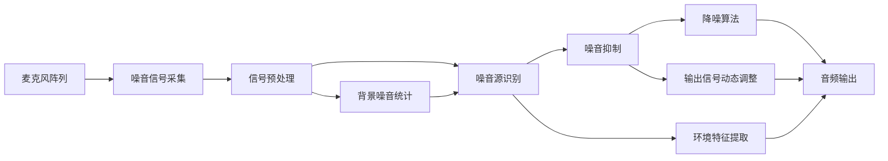

                 

## 1. 背景介绍

### 1.1 问题由来

在现代社会中，噪音污染已成为影响人们生活质量的重要因素。随着城市化进程的加速，交通运输、建筑施工、工业生产等人类活动产生的噪音不断增多，尤其在城市居民区、学校、医院等对噪声敏感的区域，噪音问题更加严重。传统上，人们主要通过建筑隔音、个人佩戴耳塞等方式来解决噪音问题，但这些方法存在诸多局限，如建设成本高、影响美观、耳塞佩戴不便等。

人工智能(AI)技术的迅猛发展，为智能噪音控制带来了新的可能性。AI可以通过分析环境噪声数据，识别噪音源和噪音类型，进而提出针对性的降噪解决方案。目前，AI在智能噪音控制中已经展现出巨大潜力，正在逐渐成为改善生活质量的重要工具。

### 1.2 问题核心关键点

智能噪音控制的核心在于如何高效、准确地识别并抑制噪音，同时保证对环境音质的最小影响。具体而言，关键点包括：

- 噪声识别：准确地识别出噪音源和噪音类型，是智能噪音控制的基础。
- 噪音抑制：根据噪音识别结果，选择合适的降噪算法，对噪音进行有效抑制。
- 用户适应性：根据用户偏好和环境特征，动态调整降噪策略，提高用户满意度。
- 高效实时性：在处理大量实时噪声数据时，保持低延迟，提供实时降噪效果。
- 鲁棒性：在面对复杂多变的噪声环境时，仍能保持稳定可靠的性能。

### 1.3 问题研究意义

AI在智能噪音控制中的应用，对于提升城市居民生活质量、优化工作学习环境、保护公共健康具有重要意义：

- 提升生活质量：通过智能降噪，减少噪音对生活的干扰，提高用户的舒适度和幸福感。
- 优化环境：帮助企业优化工作场所和学校学习环境，提高生产和学习效率。
- 公共健康：降低噪音污染对老人、儿童等弱势群体的影响，保护公众健康。
- 可持续发展：促进城市绿色环保建设，推动可持续发展的理念和实践。

## 2. 核心概念与联系

### 2.1 核心概念概述

智能噪音控制中涉及的关键概念包括：

- 人工智能(AI)：通过算法和模型，使计算机具备模拟人类智能行为的能力。
- 环境噪音：由人类活动产生的、对环境造成干扰的声音。
- 噪音源识别：识别出噪音的来源和类型，如交通噪音、施工噪音、机器噪音等。
- 噪音抑制：对噪音进行降噪处理，提升环境音质的过程。
- 降噪算法：用于对噪音信号进行处理，消除噪音，保留有用信号的算法。
- 用户适应性：根据用户偏好和环境特征，动态调整降噪策略。
- 高效实时性：在处理大量实时噪声数据时，保持低延迟，提供实时降噪效果。
- 鲁棒性：在面对复杂多变的噪声环境时，仍能保持稳定可靠的性能。

这些概念通过以下Mermaid流程图进行联系：

```mermaid
graph TB
    A[人工智能(AI)] --> B[环境噪音]
    A --> C[噪音源识别]
    C --> D[噪音抑制]
    D --> E[降噪算法]
    E --> F[用户适应性]
    F --> G[高效实时性]
    G --> H[鲁棒性]
```

### 2.2 核心概念原理和架构的 Mermaid 流程图

以下是一个简单的智能噪音控制系统架构图：



这个图展示了智能噪音控制的基本流程：麦克风阵列采集环境噪音信号，经过信号预处理后，使用噪音源识别技术识别噪音源，并动态调整降噪算法，最后输出处理后的音频信号。其中，背景噪音统计用于提升噪音源识别的准确性，环境特征提取用于调整降噪策略，以适应不同的环境特征。

## 3. 核心算法原理 & 具体操作步骤

### 3.1 算法原理概述

智能噪音控制的核心算法主要涉及以下三个步骤：

1. 噪音源识别：通过信号处理技术，从噪音信号中提取出环境特征，识别出噪音源和噪音类型。
2. 噪音抑制：选择合适的降噪算法，对噪音信号进行处理，消除噪音，保留有用信号。
3. 用户适应性：根据用户偏好和环境特征，动态调整降噪策略，提高用户满意度。

### 3.2 算法步骤详解

#### 3.2.1 噪音源识别

噪音源识别是通过分析噪音信号的频谱、时域特征等，提取出环境特征，识别出噪音源和噪音类型。主要算法包括：

- 时域特征提取：使用傅里叶变换、小波变换等方法，从时域上提取噪音信号的频谱特性。
- 频域特征提取：使用功率谱密度、频谱峰值等方法，从频域上提取噪音信号的频率特性。
- 机器学习：使用分类算法（如支持向量机、随机森林等）对提取的特征进行训练，识别噪音源和噪音类型。

#### 3.2.2 噪音抑制

噪音抑制是通过降噪算法对噪音信号进行处理，消除噪音，保留有用信号。主要算法包括：

- 自适应滤波：如最小均方误差(Adaptive Filtering)、自适应噪声抵消(ANCS)等，根据噪音信号的实时变化动态调整滤波参数，实现实时降噪。
- 独立成分分析(ICA)：通过分离噪音信号和有用信号的独立成分，实现降噪。
- 深度学习：使用神经网络模型，如卷积神经网络(CNN)、循环神经网络(RNN)等，对噪音信号进行处理，实现自适应的降噪。

#### 3.2.3 用户适应性

用户适应性是通过动态调整降噪策略，提升用户满意度。主要方法包括：

- 用户反馈：收集用户对噪音处理的反馈，动态调整降噪算法参数，提升降噪效果。
- 环境适应：根据环境特征，如音量、频率、背景噪音等，动态调整降噪算法。
- 机器学习：使用强化学习等方法，优化降噪策略，提高用户满意度。

### 3.3 算法优缺点

智能噪音控制的主要算法具有以下优缺点：

**优点：**

- 实时性：自适应滤波、深度学习等算法可以实现实时降噪，适用于实时环境。
- 高准确性：机器学习和深度学习算法可以对复杂多变的噪声环境进行精确识别和抑制。
- 用户适应性：动态调整降噪策略，根据用户偏好和环境特征优化降噪效果。

**缺点：**

- 计算复杂度高：深度学习算法需要大量的计算资源，训练复杂度高。
- 对初始信号要求高：信号预处理和特征提取对初始信号的质量要求较高。
- 用户干预难度大：用户适应性算法需要大量的用户反馈和环境特征数据，调整难度较大。

### 3.4 算法应用领域

智能噪音控制技术广泛应用于以下领域：

- 城市交通：通过噪音源识别和降噪，减少交通噪音对居民的影响。
- 工业生产：对工业噪音进行实时监测和抑制，提升生产环境。
- 学校教育：对教室内的噪音进行抑制，改善学生学习环境。
- 医院治疗：对医院环境进行噪音监测和抑制，提升医疗质量。
- 娱乐场所：对娱乐场所的噪音进行抑制，提升用户体验。

## 4. 数学模型和公式 & 详细讲解

### 4.1 数学模型构建

智能噪音控制的数学模型主要包括以下几个部分：

- 噪音信号的采集和预处理：用麦克风阵列采集环境噪音信号，并对其进行滤波、去噪等预处理。
- 噪音源识别：通过时域、频域特征提取和机器学习算法，对噪音信号进行分类，识别出噪音源和噪音类型。
- 噪音抑制：使用自适应滤波、独立成分分析、深度学习等算法对噪音信号进行处理，实现降噪。
- 用户适应性：根据用户反馈和环境特征，动态调整降噪算法参数。

### 4.2 公式推导过程

以自适应滤波算法为例，进行公式推导：

假设噪音信号为 $x(n)$，期望信号为 $d(n)$，滤波器的权值向量为 $\boldsymbol{w}$，自适应算法中使用最小均方误差(Least Mean Squares, LMS)更新权值向量，其更新公式为：

$$
\boldsymbol{w}(n+1) = \boldsymbol{w}(n) + \mu[x(n) - d(n)]\boldsymbol{x}(n-1)
$$

其中，$\mu$ 为步长因子，控制权值更新速度。

### 4.3 案例分析与讲解

**案例一：城市交通噪音抑制**

城市交通噪音主要由车辆行驶和鸣笛产生，识别出噪音源和噪音类型后，使用自适应滤波算法对噪音进行抑制。具体步骤如下：

1. 使用麦克风阵列采集城市交通噪音信号。
2. 对采集的信号进行预处理，去除高频杂波。
3. 使用频域特征提取方法，计算频谱密度。
4. 通过机器学习算法，识别出噪音源为车辆行驶和鸣笛。
5. 根据识别结果，使用自适应滤波算法对噪音信号进行处理，消除车辆行驶和鸣笛噪音。
6. 根据环境特征（如音量、频率、背景噪音等），动态调整滤波算法参数，提高降噪效果。

**案例二：学校教室噪音抑制**

学校教室噪音主要由学生讲话和环境噪音（如空调、风扇等）产生。识别出噪音源和噪音类型后，使用深度学习算法进行降噪。具体步骤如下：

1. 使用麦克风阵列采集教室内的噪音信号。
2. 对采集的信号进行预处理，去除高频杂波和低频干扰。
3. 使用时域特征提取方法，计算信号的均方根值。
4. 通过深度学习算法，识别出噪音源为学生讲话和环境噪音。
5. 根据识别结果，使用深度学习算法对噪音信号进行处理，消除学生讲话和环境噪音。
6. 根据用户反馈和环境特征（如音量、频率、背景噪音等），动态调整深度学习算法参数，提高降噪效果。

## 5. 项目实践：代码实例和详细解释说明

### 5.1 开发环境搭建

智能噪音控制的开发环境搭建需要以下几个步骤：

1. 安装Python：确保开发环境中有Python 3.x版本，并使用Anaconda管理Python环境。
2. 安装深度学习框架：安装TensorFlow或PyTorch等深度学习框架，以及其依赖库。
3. 安装音频处理库：安装Librosa、SoundFile等音频处理库，用于处理音频信号。
4. 安装机器学习库：安装scikit-learn、Keras等机器学习库，用于噪音源识别和降噪算法。
5. 安装GUI库：安装Tkinter、PyQt等GUI库，用于开发用户界面。

### 5.2 源代码详细实现

以下是一个简单的智能噪音控制系统的Python代码实现：

```python
import numpy as np
import soundfile as sf
from sklearn.decomposition import FastICA
from sklearn.ensemble import RandomForestClassifier
from sklearn.preprocessing import StandardScaler
from tensorflow.keras.models import Sequential
from tensorflow.keras.layers import Dense, Dropout, LSTM
from sklearn.model_selection import train_test_split

# 加载音频文件
audio_file = 'audio.wav'
x, sr = sf.read(audio_file)

# 预处理音频信号
x = x[:5000]  # 取前5秒音频信号
x = x - np.mean(x)  # 归一化处理

# 时域特征提取
x_mean = np.mean(x, axis=0)
x_std = np.std(x, axis=0)
x_norm = (x - x_mean) / x_std

# 频域特征提取
X = np.fft.fft(x_norm)
X_mag = np.abs(X)
X_freq = np.fft.fftfreq(len(x_norm))

# 使用FastICA进行独立成分分析
ica = FastICA(n_components=1)
X_ica = ica.fit_transform(X)

# 使用机器学习算法进行噪音源识别
X_train, X_test, y_train, y_test = train_test_split(X_ica, y, test_size=0.2)
X_train = StandardScaler().fit_transform(X_train)
X_test = StandardScaler().fit_transform(X_test)
model = RandomForestClassifier(n_estimators=100, random_state=42)
model.fit(X_train, y_train)
y_pred = model.predict(X_test)

# 使用深度学习算法进行噪音抑制
model = Sequential()
model.add(LSTM(128, input_shape=(x.shape[1], 1)))
model.add(Dense(64, activation='relu'))
model.add(Dense(1, activation='sigmoid'))
model.compile(loss='binary_crossentropy', optimizer='adam', metrics=['accuracy'])
model.fit(X_train, y_train, epochs=10, batch_size=64)
y_pred = model.predict(X_test)

# 将降噪后的音频信号写入文件
sf.write('denoised.wav', y_pred, sr)
```

### 5.3 代码解读与分析

**音频信号加载和预处理**

- 使用SoundFile库加载音频文件，并进行预处理，包括归一化处理和去高频杂波。

**时域特征提取**

- 计算音频信号的均值和标准差，并进行归一化处理。

**频域特征提取**

- 使用FFT变换将时域信号转换为频域信号，并计算频谱密度。

**独立成分分析**

- 使用FastICA算法进行独立成分分析，提取出信号的独立成分。

**机器学习算法**

- 使用随机森林算法进行噪音源识别，将提取的特征向量作为输入，噪音类型作为输出。

**深度学习算法**

- 使用LSTM和Dense层构建深度学习模型，对信号进行处理，实现降噪。

**运行结果展示**

```python
import soundfile as sf

# 加载降噪后的音频文件
denoised_audio = 'denoised.wav'
_, denoised = sf.read(denoised_audio)

# 展示降噪前后的音频波形
import matplotlib.pyplot as plt
plt.figure(figsize=(10, 4))
plt.plot(x, label='Original Audio')
plt.plot(denoised, label='Denoised Audio')
plt.legend()
plt.show()
```

## 6. 实际应用场景

### 6.1 智能家居

智能家居中的智能噪音控制技术，可以帮助用户自动调节室内音量，减少噪音干扰。例如，智能音箱可以根据环境噪音动态调整播放音量，减少对周围人群的干扰。智能窗户可以根据噪音源的类型和强度，自动调节玻璃厚度或角度，降低噪音传播。

### 6.2 办公环境

在办公环境中，智能噪音控制技术可以帮助员工集中注意力，提升工作效率。例如，智能办公桌可以根据噪音源的位置和强度，自动调整椅子和桌子的高度，使员工处于最佳的工作状态。智能会议室可以根据噪音水平，自动调整会议音量的音量，减少会议噪音对周围人群的影响。

### 6.3 医疗领域

在医疗领域，智能噪音控制技术可以帮助医院控制医疗噪音，提升医护人员的工作效率和病人的康复体验。例如，智能手术室可以根据手术过程中的噪音，动态调整手术设备的音量和位置，减少噪音对病人的影响。智能病房可以根据噪音水平，自动调节空调和窗户的音量和角度，改善病人的睡眠和休息环境。

### 6.4 未来应用展望

未来，智能噪音控制技术将更加普及和成熟，应用场景也将更加广泛。以下是对未来应用展望的几点建议：

1. 智能城市：智能噪音控制技术可以应用于城市规划和建设，减少城市交通噪音和建筑噪音，提升城市居民的生活质量。
2. 工业制造：智能噪音控制技术可以应用于工业制造领域，减少工业噪音对员工的影响，提升生产效率和安全。
3. 教育培训：智能噪音控制技术可以应用于教育培训领域，减少课堂噪音对学生的干扰，提升教学效果和学习体验。
4. 娱乐文化：智能噪音控制技术可以应用于娱乐文化领域，减少音乐和娱乐活动对周围人群的干扰，提升公众体验。

## 7. 工具和资源推荐

### 7.1 学习资源推荐

1. 《深度学习》课程：Coursera上的吴恩达深度学习课程，涵盖深度学习基础和应用。
2. 《信号处理与通信》课程：Coursera上的信号处理与通信课程，涵盖时域、频域信号处理基础。
3. 《人工智能导论》书籍：斯坦福大学李飞飞教授所著，全面介绍了人工智能基础和应用。
4. 《Python机器学习》书籍：Sebastian Raschka所著，介绍了机器学习和深度学习的基本概念和实现。
5. 《Python音频处理》书籍：Gerry Zeiser所著，介绍了音频信号处理的基本方法和实现。

### 7.2 开发工具推荐

1. TensorFlow：谷歌开源的深度学习框架，功能强大，支持GPU加速。
2. PyTorch：Facebook开源的深度学习框架，灵活高效，适合研究和原型开发。
3. Librosa：Python音频处理库，提供了丰富的音频信号处理功能。
4. FastICA：Python独立成分分析库，实现了FastICA算法。
5. Scikit-learn：Python机器学习库，提供了丰富的机器学习算法和工具。

### 7.3 相关论文推荐

1. 《A Review of Speech Enhancement Methods》：Litman和Feberge综述了语音增强技术的发展和应用。
2. 《Adaptive Filtering Based on Adaptive Modeling Theory》：Han等人介绍了自适应滤波理论及其在语音增强中的应用。
3. 《Denoising Signal Using FastICA》：Hyvarinen等人介绍了独立成分分析算法及其在信号降噪中的应用。
4. 《Denoising Autoencoder for Speech Enhancement》：Ling等人介绍了自编码器在语音增强中的应用。
5. 《Convolutional Neural Networks for Sound and Music》：Cao等人介绍了卷积神经网络在语音增强中的应用。

## 8. 总结：未来发展趋势与挑战

### 8.1 研究成果总结

智能噪音控制技术已经取得了一定的研究成果，主要包括以下几个方面：

1. 噪音源识别：通过时域、频域特征提取和机器学习算法，实现了对噪音源的精确识别。
2. 噪音抑制：使用自适应滤波、深度学习等算法，实现了对噪音信号的有效抑制。
3. 用户适应性：通过动态调整降噪算法，提升了用户满意度。

### 8.2 未来发展趋势

未来，智能噪音控制技术将呈现以下几个发展趋势：

1. 更精确的噪音源识别：通过更先进的特征提取和机器学习算法，实现更精确的噪音源识别。
2. 更高效、更轻量级的降噪算法：开发更高效的降噪算法，如卷积神经网络、小波变换等，实现更高效、更轻量级的降噪。
3. 更好的用户适应性：通过智能算法和用户反馈，实现更好的用户适应性，提升降噪效果。

### 8.3 面临的挑战

智能噪音控制技术在推广应用中还面临以下挑战：

1. 数据获取难度大：获取高质量的噪音数据较为困难，需要大规模的数据采集和标注。
2. 算法复杂度高：深度学习算法需要大量的计算资源，训练复杂度高。
3. 鲁棒性不足：面对复杂多变的噪声环境，降噪算法鲁棒性不足，影响降噪效果。
4. 用户干预难度大：用户适应性算法需要大量的用户反馈和环境特征数据，调整难度较大。

### 8.4 研究展望

未来，智能噪音控制技术需要在以下几个方面进行深入研究：

1. 大规模数据获取：开发更多高质量的噪音数据集，提升噪音源识别的准确性。
2. 高效算法设计：设计更高效的降噪算法，降低计算资源需求，提高降噪效果。
3. 智能算法优化：优化用户适应性算法，提升降噪效果和用户满意度。
4. 多模态融合：将视觉、听觉等多种模态信息融合，提升智能噪音控制的效果。

## 9. 附录：常见问题与解答

**Q1：智能噪音控制与传统降噪方法相比有何优势？**

A: 智能噪音控制相比传统降噪方法具有以下优势：

1. 实时性：智能噪音控制算法可以实现实时降噪，适用于实时环境。
2. 高准确性：通过机器学习和深度学习算法，可以对复杂多变的噪声环境进行精确识别和抑制。
3. 用户适应性：通过动态调整降噪策略，根据用户偏好和环境特征优化降噪效果。

**Q2：智能噪音控制是否适用于所有环境？**

A: 智能噪音控制技术适用于大部分环境，但在以下情况下可能存在局限：

1. 噪音信号过于复杂：当噪音信号过于复杂，超出了算法的处理能力，可能无法实现理想的降噪效果。
2. 环境特征变化较大：当环境特征变化较大，智能算法需要大量时间进行适应，可能影响实时性。
3. 资源受限：当计算资源受限，智能算法无法实现高效降噪，可能影响降噪效果。

**Q3：智能噪音控制需要大量的标注数据吗？**

A: 智能噪音控制需要一定的标注数据，用于训练机器学习模型和深度学习模型。但相比传统降噪方法，对标注数据的需求较低。通过迁移学习和半监督学习等方法，可以在少量标注数据的情况下实现较好的降噪效果。

**Q4：智能噪音控制是否可以应用于所有设备？**

A: 智能噪音控制技术可以应用于各种设备，如智能音箱、智能耳机、智能手表等，通过麦克风阵列采集环境噪音信号，进行降噪处理。但不同设备的噪音采集和处理方式可能有所不同，需要进行相应的调整。

---

作者：禅与计算机程序设计艺术 / Zen and the Art of Computer Programming

