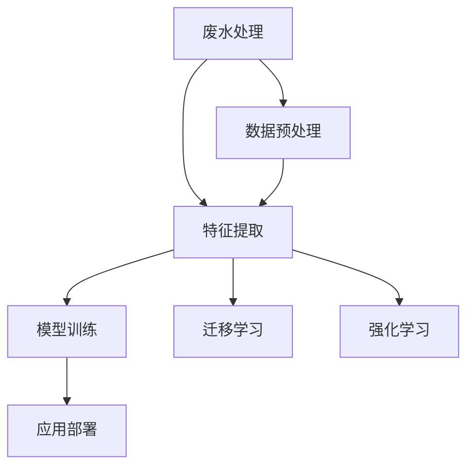
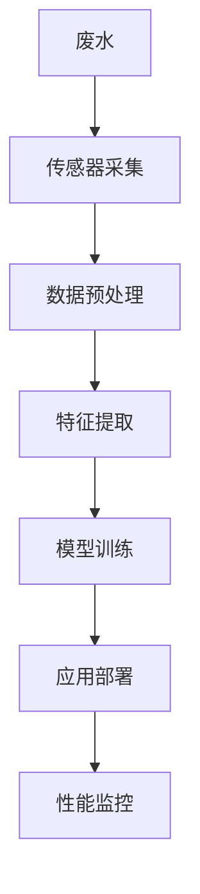

                 

# AI在智能废水处理中的应用：提高净化效率

## 1. 背景介绍

随着工业和城市化进程的推进，废水处理已经成为环保和公共卫生领域的一大挑战。传统的废水处理技术依赖于物理、化学和生物方法，但这些方法往往效率较低、成本高昂，且无法灵活适应复杂多变的废水成分。近年来，人工智能（AI）技术特别是深度学习在废水处理领域的应用引起了广泛关注。AI可以借助大数据和模型优化技术，提高废水处理的自动化水平和效率，实现精准监测和智能决策。本文将详细探讨AI在废水处理中的应用，包括数据预处理、特征提取、模型训练、应用部署等关键环节。

## 2. 核心概念与联系

### 2.1 核心概念概述

为更好地理解AI在废水处理中的应用，首先需要了解几个核心概念：

- **废水处理（Wastewater Treatment）**：指通过物理、化学、生物等手段去除废水中的污染物，以减少对环境的影响，保障水质安全。
- **深度学习（Deep Learning）**：一种机器学习方法，通过构建多层次的非线性模型，能够处理高维数据，发现数据中的复杂关系。
- **自监督学习（Self-Supervised Learning）**：利用无标签数据训练模型，通过构建自身的数据生成过程或预定义的结构，自动学习数据的特征表示。
- **迁移学习（Transfer Learning）**：将在大规模数据上预训练好的模型参数迁移到小数据集上，以提升模型的泛化能力。
- **强化学习（Reinforcement Learning）**：通过与环境的交互，模型在不断试错中学习最优策略，以实现特定任务。

这些概念通过以下Mermaid流程图展示它们之间的联系：



### 2.2 核心概念原理和架构的 Mermaid 流程图



## 3. 核心算法原理 & 具体操作步骤

### 3.1 算法原理概述

AI在废水处理中的应用主要依赖于深度学习模型。以深度学习为基础的AI系统，通过大量数据和复杂的模型架构，可以实现对废水成分的精准检测和高效处理。其核心算法流程包括以下几个步骤：

1. **数据预处理**：采集废水样本并进行清洗、标注等处理，确保数据的质量和一致性。
2. **特征提取**：利用神经网络等技术，从原始数据中提取出具有代表性的特征向量。
3. **模型训练**：通过训练数据集，优化模型参数，提升模型对废水成分的识别和预测能力。
4. **应用部署**：将训练好的模型应用于实际废水处理场景，实现自动化、实时化的处理。
5. **性能监控**：持续监测模型性能，及时调整模型参数，保持模型的稳定性和准确性。

### 3.2 算法步骤详解

#### 3.2.1 数据预处理

数据预处理是废水处理中AI应用的重要环节，主要包括数据清洗、数据标注和数据增强等步骤。

**数据清洗**：废水数据中可能包含噪声、异常值等无用信息，需要对其进行清洗。例如，去除传感器采集过程中的噪声数据，修正数据采集设备的位置误差等。

**数据标注**：废水处理中需要明确的目标变量，例如水质指标（如氨氮、总磷、COD等）。通过人工标注或半自动标注的方式，为模型提供监督信号。

**数据增强**：利用数据增强技术，扩充数据集，增强模型的泛化能力。例如，通过数据旋转、裁剪、混合等方式，生成更多的训练样本。

#### 3.2.2 特征提取

特征提取是AI模型处理的第一步，将原始数据转化为可供模型训练的特征向量。常用的特征提取方法包括：

**自编码器（Autoencoder）**：通过学习数据的低维表示，减少数据维度，提升模型训练效率。

**卷积神经网络（CNN）**：用于图像和文本等高维数据的特征提取，能够自动学习数据的局部特征和全局结构。

**Transformer模型**：基于自注意力机制，用于处理序列数据，能够捕捉长距离依赖关系。

#### 3.2.3 模型训练

模型训练是AI废水处理的核心步骤，通过大量标注数据和优化算法，提升模型的准确性和泛化能力。

**深度学习框架**：使用TensorFlow、PyTorch等深度学习框架，构建和训练模型。

**优化算法**：选择合适的优化器（如Adam、SGD等），设置合适的学习率和迭代次数，避免过拟合。

**损失函数**：根据任务需求，选择合适的损失函数（如均方误差、交叉熵等），衡量模型预测与真实值之间的差异。

#### 3.2.4 应用部署

模型训练完成后，需要将其部署到实际废水处理场景中，实现自动化和实时化处理。

**模型集成**：将训练好的模型集成到废水处理系统中，通过API接口提供预测服务。

**实时监控**：利用流数据处理技术，实时监测废水处理数据，及时调整模型参数，保障处理效果。

**用户界面**：开发友好的用户界面，便于操作和监控。

### 3.3 算法优缺点

AI在废水处理中的应用具有以下优点：

- **高效精准**：AI模型能够通过大量数据和复杂架构，实现对废水成分的精准检测和高效处理。
- **适应性强**：AI模型可以根据不同废水成分和处理需求，灵活调整模型参数，实现定制化处理。
- **实时监控**：AI系统可以实现实时数据监测和预测，及时发现和处理异常情况。

同时，AI废水处理也存在一些局限性：

- **数据依赖**：模型效果依赖于高质量的标注数据，数据获取和标注成本较高。
- **计算资源**：深度学习模型需要大量的计算资源，包括GPU、TPU等高性能设备。
- **模型复杂**：AI模型结构复杂，需要专业技术人员进行维护和优化。
- **可解释性**：AI模型的决策过程缺乏可解释性，难以理解和调试。

### 3.4 算法应用领域

AI在废水处理中的应用领域广泛，主要包括：

- **水质监测**：通过AI模型实时监测废水中的关键水质指标，如氨氮、总磷、COD等。
- **污染源识别**：利用AI模型识别废水中的污染源，如工业废水、生活污水等。
- **处理策略优化**：通过AI模型优化废水处理策略，如选择最优的生物处理方法和药剂投放量。
- **故障诊断**：利用AI模型监测废水处理设备的运行状态，及时发现和处理故障。
- **资源优化**：通过AI模型优化废水处理过程中的能源和资源使用，降低处理成本。

## 4. 数学模型和公式 & 详细讲解 & 举例说明

### 4.1 数学模型构建

在废水处理中，AI模型的目标是通过对输入数据的学习，预测废水中的关键成分。假设输入数据为 $x=(x_1,x_2,...,x_n)$，输出为 $y$。模型使用神经网络进行训练，其数学模型如下：

$$ y = M(x;\theta) = \sigma(\mathbf{W}x + b) $$

其中，$\sigma$ 为激活函数，$\mathbf{W}$ 为权重矩阵，$b$ 为偏置向量，$\theta$ 为模型参数。

### 4.2 公式推导过程

假设模型的损失函数为均方误差损失，则模型的训练过程可以表示为：

$$ \min_{\theta} \frac{1}{n}\sum_{i=1}^n (y_i - M(x_i;\theta))^2 $$

通过梯度下降等优化算法，不断更新模型参数，使得预测值与真实值之间的误差最小化。

### 4.3 案例分析与讲解

以水质监测为例，假设我们要监测废水中的氨氮含量。采集多个样本，每个样本包含多个特征（如pH值、溶解氧等）和氨氮含量标签。使用深度学习模型进行训练，优化过程如下：

1. **数据预处理**：对样本进行清洗、标注和增强。
2. **特征提取**：利用卷积神经网络（CNN）提取样本的特征向量。
3. **模型训练**：使用均方误差损失函数，通过梯度下降优化模型参数。
4. **模型应用**：将训练好的模型部署到废水处理系统中，实时监测氨氮含量。
5. **性能监控**：持续监测模型性能，及时调整参数，优化处理效果。

## 5. 项目实践：代码实例和详细解释说明

### 5.1 开发环境搭建

为进行AI废水处理的开发和实验，需要搭建以下开发环境：

1. **Python**：作为主要编程语言，Python在深度学习和数据处理方面具有广泛的支持。
2. **深度学习框架**：如TensorFlow、PyTorch等，用于构建和训练模型。
3. **数据处理工具**：如Pandas、NumPy等，用于数据清洗和处理。
4. **流数据处理工具**：如Apache Kafka、Apache Flink等，用于实时数据处理和流数据管理。
5. **用户界面开发工具**：如Flask、Django等，用于开发友好的用户界面。

### 5.2 源代码详细实现

以下是一个基于PyTorch框架的AI废水处理模型的代码实现：

```python
import torch
import torch.nn as nn
import torch.optim as optim
from torch.utils.data import DataLoader, Dataset
from torchvision import transforms
from sklearn.model_selection import train_test_split

# 定义数据集
class WaterQualityDataset(Dataset):
    def __init__(self, data, labels, transform=None):
        self.data = data
        self.labels = labels
        self.transform = transform
    
    def __len__(self):
        return len(self.data)
    
    def __getitem__(self, idx):
        x = self.data[idx]
        y = self.labels[idx]
        if self.transform:
            x = self.transform(x)
        return x, y

# 定义模型
class WaterQualityModel(nn.Module):
    def __init__(self):
        super(WaterQualityModel, self).__init__()
        self.cnn = nn.Sequential(
            nn.Conv2d(1, 64, kernel_size=3, padding=1),
            nn.ReLU(),
            nn.MaxPool2d(kernel_size=2, stride=2),
            nn.Conv2d(64, 128, kernel_size=3, padding=1),
            nn.ReLU(),
            nn.MaxPool2d(kernel_size=2, stride=2),
            nn.Flatten()
        )
        self.fc = nn.Sequential(
            nn.Linear(128 * 7 * 7, 64),
            nn.ReLU(),
            nn.Linear(64, 1)
        )
    
    def forward(self, x):
        x = self.cnn(x)
        x = self.fc(x)
        return x

# 定义训练函数
def train(model, device, train_loader, optimizer, criterion, num_epochs):
    model.train()
    for epoch in range(num_epochs):
        running_loss = 0.0
        for i, (inputs, labels) in enumerate(train_loader):
            inputs, labels = inputs.to(device), labels.to(device)
            optimizer.zero_grad()
            outputs = model(inputs)
            loss = criterion(outputs, labels)
            loss.backward()
            optimizer.step()
            running_loss += loss.item()
        print(f"Epoch {epoch+1}, Loss: {running_loss/len(train_loader)}")
    
# 定义应用函数
def apply(model, test_loader):
    model.eval()
    correct = 0
    total = 0
    with torch.no_grad():
        for inputs, labels in test_loader:
            inputs = inputs.to(device)
            labels = labels.to(device)
            outputs = model(inputs)
            _, predicted = torch.max(outputs, 1)
            total += labels.size(0)
            correct += (predicted == labels).sum().item()
    print(f"Accuracy: {correct/total}")
```

### 5.3 代码解读与分析

以上代码实现了基于卷积神经网络（CNN）的废水处理模型，包含数据集定义、模型构建、训练和应用函数等关键部分。

**数据集定义**：使用`WaterQualityDataset`类定义数据集，包括样本数据和标签，并可以进行数据增强和预处理。

**模型构建**：使用`WaterQualityModel`类定义模型架构，包括卷积层和全连接层，用于提取特征和预测水质指标。

**训练函数**：使用`train`函数进行模型训练，定义训练轮数、优化器、损失函数等关键参数。

**应用函数**：使用`apply`函数进行模型应用，定义测试数据集和评估指标，评估模型性能。

### 5.4 运行结果展示

通过上述代码实现，可以对废水数据进行模型训练和应用，展示其运行结果：

```python
# 数据集准备
data, labels = load_data() # 加载数据和标签
train_data, test_data, train_labels, test_labels = train_test_split(data, labels, test_size=0.2) # 划分训练集和测试集
train_dataset = WaterQualityDataset(train_data, train_labels, transform=transforms.ToTensor()) # 定义训练集
test_dataset = WaterQualityDataset(test_data, test_labels, transform=transforms.ToTensor()) # 定义测试集
train_loader = DataLoader(train_dataset, batch_size=64, shuffle=True) # 定义训练数据加载器
test_loader = DataLoader(test_dataset, batch_size=64) # 定义测试数据加载器

# 模型构建
model = WaterQualityModel().to(device)

# 优化器设置
optimizer = optim.Adam(model.parameters(), lr=0.001)

# 训练模型
train(model, device, train_loader, optimizer, criterion, num_epochs=10)

# 模型应用
apply(model, test_loader)
```

## 6. 实际应用场景

### 6.1 智能污水处理厂

智能污水处理厂是AI废水处理的重要应用场景。通过AI技术，可以实现对污水处理的自动化和智能化管理，提升处理效率和效果。

**数据采集**：利用传感器和监测设备，实时采集污水中的关键指标，如COD、BOD、氨氮等。

**数据分析**：使用AI模型分析污水数据，识别异常情况和潜在污染源。

**决策支持**：根据数据分析结果，生成处理方案，指导自动化设备进行污水处理。

**性能监控**：实时监测处理效果，及时调整参数，优化处理效果。

### 6.2 工业废水处理

工业废水处理是AI废水处理的另一个重要应用场景。工业废水成分复杂，处理难度大，AI技术可以提供有效的解决方案。

**数据预处理**：对工业废水数据进行清洗、标注和增强，确保数据质量。

**特征提取**：利用深度学习模型提取工业废水中的关键成分。

**模型训练**：使用工业废水数据训练AI模型，优化处理效果。

**模型应用**：将训练好的模型部署到工业废水处理系统中，实现自动化和实时化处理。

**性能监控**：实时监测处理效果，及时调整模型参数，优化处理效果。

## 7. 工具和资源推荐

### 7.1 学习资源推荐

为帮助开发者系统掌握AI废水处理的技术，以下是一些优质的学习资源：

1. **《深度学习与大数据技术》**：深入介绍深度学习和大数据技术的基本概念和应用场景。
2. **Coursera的《深度学习专项课程》**：由斯坦福大学教授讲授，涵盖深度学习模型的构建、训练和应用。
3. **Kaggle竞赛平台**：提供丰富的数据集和挑战，可以实践和测试深度学习模型的效果。

### 7.2 开发工具推荐

为高效开发AI废水处理系统，以下是一些推荐的开发工具：

1. **TensorFlow和PyTorch**：作为两大深度学习框架，支持丰富的模型构建和优化算法。
2. **Pandas和NumPy**：用于数据处理和分析，支持大规模数据集的处理。
3. **Apache Kafka和Apache Flink**：用于实时数据处理和流数据管理，支持高吞吐量的数据流。
4. **Flask和Django**：用于开发友好的用户界面，支持Web应用开发。

### 7.3 相关论文推荐

以下是一些关于AI废水处理的重要论文，推荐阅读：

1. **《基于深度学习的废水处理》**：介绍深度学习在废水处理中的应用和效果。
2. **《智能污水处理系统的研究》**：探讨智能污水处理系统的构建和应用。
3. **《工业废水处理的深度学习模型》**：介绍工业废水处理中深度学习模型的构建和优化。

## 8. 总结：未来发展趋势与挑战

### 8.1 研究成果总结

本文详细介绍了AI在废水处理中的应用，涵盖数据预处理、特征提取、模型训练和应用部署等关键环节。通过实例展示了如何利用深度学习模型实现废水处理自动化和智能化管理，提升处理效率和效果。

### 8.2 未来发展趋势

未来，AI在废水处理中的应用将呈现以下发展趋势：

1. **模型优化**：深度学习模型结构将更加复杂，功能更加强大，能够处理更多类型的废水数据。
2. **数据融合**：多种数据源（如传感器数据、历史数据、实时数据等）的融合，将提升废水处理的准确性和实时性。
3. **智能决策**：利用强化学习等技术，实现更加智能化的废水处理决策，提升处理效果。
4. **多模态处理**：融合视觉、声音、文本等多种模态数据，实现多模态废水处理，提升处理精度和效率。

### 8.3 面临的挑战

尽管AI在废水处理中的应用前景广阔，但仍面临以下挑战：

1. **数据质量**：数据采集和标注的准确性和完整性是模型性能的关键。如何获取高质量的数据，是实现废水处理自动化的首要任务。
2. **计算资源**：深度学习模型需要大量的计算资源，如何高效利用和优化，是提升处理效率的关键。
3. **模型可解释性**：AI模型的决策过程缺乏可解释性，如何提高模型透明度，确保处理结果可信，是确保废水处理系统可靠性的重要问题。
4. **系统集成**：如何将AI模型与现有系统和设备进行有效集成，是实现废水处理自动化和智能化的重要环节。

### 8.4 研究展望

未来，AI在废水处理中的应用将不断拓展和深化，实现更加全面和高效的处理。

1. **大数据和云计算**：利用大数据和云计算技术，实现数据的高效存储和处理，提升废水处理的自动化和智能化水平。
2. **跨学科融合**：与环境科学、化学工程等学科进行深度融合，提升废水处理的效果和效率。
3. **技术创新**：不断探索新的技术手段，如量子计算、联邦学习等，提升废水处理的性能和效率。
4. **应用拓展**：将废水处理技术应用于更多场景，如农业、医疗等领域，推动水资源的可持续利用。

## 9. 附录：常见问题与解答

**Q1：AI在废水处理中的数据依赖性如何？**

A: AI废水处理依赖于高质量的标注数据，数据获取和标注成本较高。在实际应用中，可以通过数据增强和迁移学习等技术，缓解数据依赖性。

**Q2：AI废水处理的计算资源需求大吗？**

A: 深度学习模型需要大量的计算资源，如GPU、TPU等高性能设备。可以通过模型压缩、并行计算等技术，优化计算资源的使用，提升处理效率。

**Q3：AI废水处理的模型可解释性不足如何处理？**

A: AI废水处理的模型决策过程缺乏可解释性，可以通过特征可视化、模型解释工具等技术，提高模型的透明度和可信度。

**Q4：AI废水处理的系统集成难度大吗？**

A: AI废水处理的系统集成需要考虑现有系统和设备，可以利用中间件、API等技术，实现平滑集成。

**Q5：AI废水处理的未来发展方向是什么？**

A: AI废水处理的未来发展方向包括模型优化、数据融合、智能决策、多模态处理等，将进一步提升废水处理的自动化和智能化水平。

---

作者：禅与计算机程序设计艺术 / Zen and the Art of Computer Programming

