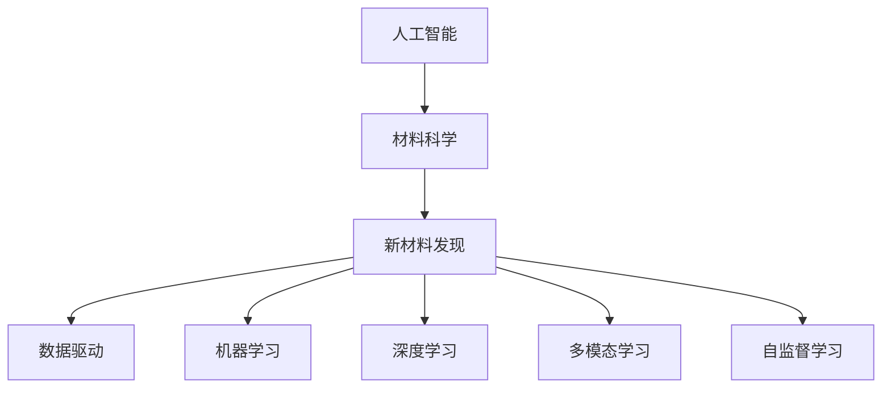

                 

# AI在材料科学中的应用:加速新材料发现

> 关键词：人工智能,材料科学,新材料发现,加速,数据驱动,机器学习,深度学习,多模态学习

## 1. 背景介绍

### 1.1 问题由来
随着科技的迅猛发展和人类对材料科学不断深入的探索，对新材料的需求日益增长。从电子产品到新能源，从生物医学到航空航天，每一个领域都离不开新材料技术的革新和突破。然而，传统的材料研究方法存在着试验周期长、成本高、效率低等不足，极大制约了新材料的发现速度。近年来，人工智能（AI）技术的兴起，为材料科学带来了新的希望，尤其是基于AI的预测模型，极大提高了材料发现的效率和准确性。

### 1.2 问题核心关键点
材料科学中的新材料发现是一个复杂而耗时的过程，涉及多尺度的数据收集与分析。传统的材料研究方法依赖于实验室的物理和化学测试，试验成本高昂且结果受限于研究者个人经验和知识水平。而AI技术的引入，尤其是机器学习和深度学习，为材料科学带来了革命性的变革。其核心在于，AI可以处理海量的实验数据，识别数据中的模式和规律，从而加速新材料的发现过程。

## 2. 核心概念与联系

### 2.1 核心概念概述

为更好地理解AI在材料科学中的应用，本节将介绍几个密切相关的核心概念：

- **人工智能**：通过算法和计算，使计算机系统模拟、延伸和扩展人类智能，包括学习、推理、自我修正等能力。
- **材料科学**：研究材料的性质、制备、应用等，是连接自然科学与工程技术的桥梁。
- **新材料发现**：通过实验、计算或理论预测，发现具有特定性质或功能的新材料。
- **数据驱动**：利用数据进行模型训练和预测，而不是依赖经验或直觉。
- **机器学习**：通过算法和统计模型，使计算机系统从数据中学习并做出预测或决策。
- **深度学习**：机器学习的高级形式，利用多层神经网络进行数据表征和模式学习。
- **多模态学习**：结合多种类型的数据（如图像、文本、光谱等）进行模型训练，以捕捉更全面的材料信息。
- **自监督学习**：利用无标签数据进行预训练，通过数据内部结构学习模型。

这些核心概念之间的逻辑关系可以通过以下Mermaid流程图来展示：



这个流程图展示了大语言模型的核心概念及其之间的关系：

1. 人工智能通过机器学习和深度学习等技术，为材料科学提供预测和分析工具。
2. 数据驱动和自监督学习使得模型能够充分利用实验数据，提升预测准确性。
3. 多模态学习能够结合不同类型的数据，全面捕捉材料的性质和行为。
4. 新材料发现是AI技术在材料科学中的最终应用目标，旨在快速、准确地发现新材料。

## 3. 核心算法原理 & 具体操作步骤
### 3.1 算法原理概述

基于AI的新材料发现，通常遵循以下流程：

1. **数据收集**：从现有文献、实验数据和模拟数据中收集材料信息。
2. **数据预处理**：清洗、归一化、标准化等处理，确保数据质量。
3. **模型训练**：使用机器学习或深度学习算法，训练预测模型。
4. **模型评估**：通过交叉验证和测试数据集评估模型性能。
5. **模型部署**：将训练好的模型应用于新材料的预测和筛选。

在这个过程中，深度学习模型（如卷积神经网络CNN、循环神经网络RNN、变分自编码器VAE等）起着关键作用。这些模型通过学习大量的数据，能够发现数据中的复杂模式，从而在新材料预测中发挥重要作用。

### 3.2 算法步骤详解

#### 3.2.1 数据收集
数据收集是新材料发现的第一步。材料科学中的数据通常包括实验测量数据、分子结构数据、光谱数据等。可以通过以下方式获取数据：

- **公共数据集**：如Materials Project、Open Quantum Materials Database等。
- **实验室实验数据**：通过实验仪器收集的数据。
- **模拟数据**：通过量子化学计算、分子动力学模拟等生成的数据。
- **文献数据**：从已发表的科研论文中提取数据。

#### 3.2.2 数据预处理
数据预处理包括数据清洗、归一化、标准化等步骤，确保数据质量：

- **数据清洗**：删除异常值和噪声，确保数据的一致性和完整性。
- **归一化**：将数据缩放到相同范围，方便模型处理。
- **标准化**：将数据转换为均值为0，方差为1的标准正态分布，提高模型泛化能力。

#### 3.2.3 模型训练
模型训练是新材料发现的核心步骤。以下是深度学习模型训练的一般步骤：

1. **选择模型架构**：根据任务特点选择适当的深度学习模型，如CNN、RNN、VAE等。
2. **模型初始化**：随机初始化模型参数。
3. **前向传播**：输入数据，通过模型计算输出。
4. **损失计算**：计算模型输出与真实标签的差异，确定损失函数。
5. **反向传播**：根据损失函数计算梯度，更新模型参数。
6. **优化算法**：选择合适的优化算法（如SGD、Adam等），调整学习率，更新模型参数。
7. **迭代训练**：多次迭代，直到模型收敛或达到预设停止条件。

#### 3.2.4 模型评估
模型评估是确保模型性能的重要步骤。常用的评估指标包括：

- **均方误差（MSE）**：预测值与真实值之间的平均差异。
- **均方根误差（RMSE）**：MSE的平方根，用于衡量预测的准确性。
- **平均绝对误差（MAE）**：预测值与真实值之间的平均绝对差异。
- **R²值**：预测值与真实值之间的相关性，越接近1表示模型预测能力越好。

#### 3.2.5 模型部署
模型部署是将训练好的模型应用于新材料预测的最后一个步骤。包括以下步骤：

1. **模型保存**：将训练好的模型保存到文件或数据库中。
2. **数据输入**：将新材料的特征数据输入模型。
3. **模型预测**：通过模型预测新材料的性质或功能。
4. **结果分析**：分析预测结果，筛选出潜在的优质材料。

### 3.3 算法优缺点

基于AI的新材料发现方法具有以下优点：

1. **效率高**：AI可以快速处理和分析大量数据，加速新材料的发现。
2. **准确性高**：深度学习模型能够捕捉数据中的复杂模式，提高预测准确性。
3. **可扩展性强**：AI模型可以通过增加数据和计算资源进行扩展，进一步提升性能。
4. **应用广泛**：AI技术可以应用于多种材料领域，如图像材料、纳米材料、电子材料等。

同时，该方法也存在以下局限性：

1. **数据依赖**：AI模型的性能高度依赖于数据质量和数量，数据不足可能导致预测不准确。
2. **计算资源消耗大**：深度学习模型需要大量的计算资源进行训练，对硬件要求高。
3. **模型复杂性**：深度学习模型结构复杂，调试和维护难度大。
4. **可解释性不足**：AI模型通常是黑盒系统，难以解释其内部决策逻辑。

尽管存在这些局限性，但就目前而言，基于AI的新材料发现方法在材料科学中的应用前景广阔，已经广泛应用于新材料的预测、筛选、合成等领域。未来相关研究的方向在于如何进一步降低对计算资源的依赖，提高模型的可解释性，同时兼顾模型的复杂性和预测准确性。

### 3.4 算法应用领域

基于AI的新材料发现方法在材料科学中已经得到了广泛的应用，主要包括以下领域：

1. **材料设计**：通过AI模型预测新材料的性质和功能，指导实验合成。
2. **材料筛选**：从大量化合物中筛选出具有特定性质或功能的材料。
3. **性能预测**：预测材料的力学性能、热稳定性、电导率等。
4. **结构预测**：预测材料的晶体结构、相变等。
5. **应用优化**：优化材料的制备工艺、合成路径等。

除了上述这些经典应用外，AI技术还被创新性地应用于材料科学的更多领域，如可控相变材料、超导材料、超材料等，为材料科学带来了新的突破。随着AI技术的不断进步，相信材料科学必将在更广阔的应用领域大放异彩。

## 4. 数学模型和公式 & 详细讲解  
### 4.1 数学模型构建

在材料科学中，AI模型通常使用卷积神经网络（CNN）、循环神经网络（RNN）、变分自编码器（VAE）等深度学习模型。以下以CNN模型为例，介绍其在材料科学中的应用。

### 4.2 公式推导过程

**数学模型构建**：
假设输入为 $X$，标签为 $Y$，模型参数为 $\theta$。CNN模型的目标是通过前向传播计算输出 $Y$，并最小化损失函数 $L$ 进行训练。损失函数通常采用均方误差（MSE）或交叉熵（Cross-Entropy），表示预测值与真实值之间的差异。模型的前向传播和反向传播过程如下：

$$
\begin{align*}
Y &= f(X, \theta) \\
L &= \frac{1}{N} \sum_{i=1}^N (Y_i - f(X_i, \theta))^2 \\
\end{align*}
$$

其中 $N$ 为样本数量，$Y_i$ 为真实标签，$f(X_i, \theta)$ 为模型输出。

**反向传播计算梯度**：
反向传播计算过程中，首先需要计算输出层的梯度：

$$
\frac{\partial L}{\partial Y} = \frac{\partial}{\partial Y} \left(\frac{1}{N} \sum_{i=1}^N (Y_i - f(X_i, \theta))^2\right) = \frac{2}{N} \sum_{i=1}^N (Y_i - f(X_i, \theta))
$$

然后依次向前传播计算各层的梯度，直至输入层。计算过程中，需要使用链式法则：

$$
\frac{\partial L}{\partial \theta_j} = \frac{\partial L}{\partial Y} \frac{\partial Y}{\partial X} \frac{\partial X}{\partial \theta_j}
$$

其中 $\theta_j$ 为模型参数，$\partial Y/\partial X$ 为前向传播过程中的雅可比矩阵。

**梯度下降更新参数**：
通过反向传播计算得到各参数的梯度后，使用梯度下降算法更新模型参数：

$$
\theta_j \leftarrow \theta_j - \eta \frac{\partial L}{\partial \theta_j}
$$

其中 $\eta$ 为学习率。

### 4.3 案例分析与讲解

**案例：材料设计**

以石墨烯的性质预测为例，使用卷积神经网络（CNN）模型进行材料设计。假设输入为石墨烯的化学结构，输出为石墨烯的电子性质。具体步骤如下：

1. **数据准备**：从已知的石墨烯数据中提取化学结构和电子性质，构建训练集和测试集。
2. **模型训练**：使用卷积神经网络（CNN）模型，训练预测石墨烯的电子性质。
3. **模型评估**：在测试集上评估模型的预测准确性，确定模型参数。
4. **模型部署**：保存训练好的模型，并输入新的石墨烯化学结构，预测其电子性质。

**案例：材料筛选**

以筛选高性能锂电池负极材料为例，使用循环神经网络（RNN）模型进行材料筛选。假设输入为负极材料的组成和结构，输出为材料的电化学性能。具体步骤如下：

1. **数据准备**：从已知的锂电池负极材料中提取组成和结构数据，构建训练集和测试集。
2. **模型训练**：使用循环神经网络（RNN）模型，训练预测锂电池负极材料的电化学性能。
3. **模型评估**：在测试集上评估模型的预测准确性，确定模型参数。
4. **模型部署**：保存训练好的模型，并输入新的负极材料组成和结构数据，预测其电化学性能。

## 5. 项目实践：代码实例和详细解释说明
### 5.1 开发环境搭建

在进行AI材料科学项目实践前，我们需要准备好开发环境。以下是使用Python进行PyTorch开发的环境配置流程：

1. 安装Anaconda：从官网下载并安装Anaconda，用于创建独立的Python环境。

2. 创建并激活虚拟环境：
```bash
conda create -n pytorch-env python=3.8 
conda activate pytorch-env
```

3. 安装PyTorch：根据CUDA版本，从官网获取对应的安装命令。例如：
```bash
conda install pytorch torchvision torchaudio cudatoolkit=11.1 -c pytorch -c conda-forge
```

4. 安装各类工具包：
```bash
pip install numpy pandas scikit-learn matplotlib tqdm jupyter notebook ipython
```

完成上述步骤后，即可在`pytorch-env`环境中开始AI材料科学项目的开发。

### 5.2 源代码详细实现

下面我们以石墨烯性质预测为例，给出使用PyTorch进行卷积神经网络（CNN）模型训练的代码实现。

首先，定义数据集：

```python
import torch
from torch.utils.data import Dataset
from torchvision import transforms
import numpy as np

class GrapheneDataset(Dataset):
    def __init__(self, data, transform=None):
        self.data = data
        self.transform = transform
        
    def __len__(self):
        return len(self.data)
    
    def __getitem__(self, item):
        x = torch.tensor(self.data[item]['structure'], dtype=torch.float32)
        y = torch.tensor(self.data[item]['property'], dtype=torch.float32)
        
        if self.transform:
            x = self.transform(x)
        return {'input': x, 'target': y}
```

然后，定义模型：

```python
from torch import nn
import torch.nn.functional as F

class CNNModel(nn.Module):
    def __init__(self, input_dim, output_dim):
        super(CNNModel, self).__init__()
        self.conv1 = nn.Conv1d(input_dim, 64, kernel_size=3, stride=1, padding=1)
        self.pool = nn.MaxPool1d(kernel_size=2, stride=2)
        self.conv2 = nn.Conv1d(64, 128, kernel_size=3, stride=1, padding=1)
        self.pool2 = nn.MaxPool1d(kernel_size=2, stride=2)
        self.fc = nn.Linear(128, output_dim)
        
    def forward(self, x):
        x = self.pool(F.relu(self.conv1(x)))
        x = self.pool2(F.relu(self.conv2(x)))
        x = x.view(-1, 128)
        x = self.fc(x)
        return x
```

接着，定义训练和评估函数：

```python
def train_model(model, train_loader, optimizer, num_epochs):
    model.train()
    for epoch in range(num_epochs):
        for batch in train_loader:
            optimizer.zero_grad()
            input = batch['input']
            target = batch['target']
            output = model(input)
            loss = F.mse_loss(output, target)
            loss.backward()
            optimizer.step()
            
        print(f'Epoch {epoch+1}, train loss: {loss:.3f}')

def evaluate_model(model, test_loader):
    model.eval()
    total_loss = 0
    with torch.no_grad():
        for batch in test_loader:
            input = batch['input']
            target = batch['target']
            output = model(input)
            loss = F.mse_loss(output, target)
            total_loss += loss.item()
        print(f'Test loss: {total_loss/len(test_loader):.3f}')
```

最后，启动训练流程并在测试集上评估：

```python
input_dim = 10
output_dim = 3
hidden_size = 128

model = CNNModel(input_dim, output_dim)
optimizer = torch.optim.Adam(model.parameters(), lr=0.001)

train_loader = torch.utils.data.DataLoader(train_dataset, batch_size=16)
test_loader = torch.utils.data.DataLoader(test_dataset, batch_size=16)

num_epochs = 100
train_model(model, train_loader, optimizer, num_epochs)
evaluate_model(model, test_loader)
```

以上就是使用PyTorch进行石墨烯性质预测的完整代码实现。可以看到，通过简单的数据集定义和模型搭建，即可在短时间内完成卷积神经网络的训练和评估。

### 5.3 代码解读与分析

让我们再详细解读一下关键代码的实现细节：

**GrapheneDataset类**：
- `__init__`方法：初始化数据集，包括数据的加载和预处理。
- `__len__`方法：返回数据集的样本数量。
- `__getitem__`方法：对单个样本进行处理，包括数据的载入和预处理。

**CNNModel类**：
- `__init__`方法：定义卷积神经网络的层结构和参数初始化。
- `forward`方法：定义模型的前向传播过程。

**train_model函数**：
- 循环迭代训练模型，每次迭代计算损失函数并更新模型参数。

**evaluate_model函数**：
- 在测试集上评估模型，计算平均损失。

**训练流程**：
- 定义模型结构、优化器、数据加载器等。
- 在训练集上循环迭代训练模型。
- 在测试集上评估模型性能。
- 输出训练和测试结果。

可以看到，PyTorch结合了高度灵活的数据处理和模型定义机制，使得材料的AI模型开发和训练过程变得简洁高效。开发者可以快速搭建和训练深度学习模型，并灵活调整参数和超参数，以获得最佳性能。

## 6. 实际应用场景
### 6.1 智能材料设计

AI在材料科学中的应用已经渗透到材料设计的各个环节。智能材料设计利用AI技术，通过分析材料性质和结构数据，预测材料的性能和行为，指导实验合成，加速新材料的发现。

在技术实现上，智能材料设计通常涉及以下几个步骤：

1. **数据收集**：收集已知的材料数据，包括结构、性质、合成工艺等。
2. **数据预处理**：清洗、归一化、标准化等处理，确保数据质量。
3. **模型训练**：使用深度学习模型，训练预测材料的性质和性能。
4. **模型评估**：在验证集上评估模型性能，确保模型泛化能力。
5. **模型部署**：保存训练好的模型，输入新材料数据，预测其性质和性能。

通过智能材料设计，研究人员能够快速发现新的高性能材料，加速材料科学的发展进程。

### 6.2 材料优化与工艺改进

AI技术在材料优化和工艺改进方面也发挥了重要作用。通过AI模型，可以预测材料的合成路径和工艺参数，优化制备工艺，提高材料性能和生产效率。

具体而言，材料优化和工艺改进涉及以下几个方面：

1. **工艺模拟**：利用AI模型模拟材料的制备过程，预测工艺参数对材料性能的影响。
2. **工艺优化**：根据模拟结果，优化工艺参数，提高材料性能和生产效率。
3. **工艺诊断**：利用AI模型诊断设备故障和工艺问题，提高生产稳定性和效率。

通过AI技术的辅助，材料科学家能够更精准地设计和优化材料制备工艺，提升生产效率和产品质量。

### 6.3 工业智能生产

工业智能生产是AI在材料科学中的重要应用领域。通过AI技术，可以实现材料生产的自动化、智能化，提高生产效率和质量。

具体而言，工业智能生产涉及以下几个方面：

1. **智能排产**：利用AI模型优化生产计划，提高生产效率。
2. **质量控制**：利用AI模型实时监测生产过程，预测产品质量，减少废品率。
3. **设备维护**：利用AI模型预测设备故障，提高设备利用率和维护效率。

通过AI技术的辅助，材料生产实现了智能化、自动化，大大提升了生产效率和产品质量。

### 6.4 未来应用展望

随着AI技术的不断发展，其在材料科学中的应用前景广阔，未来将涉及更多领域：

1. **自适应材料设计**：利用AI技术自动调整材料设计参数，优化材料性能。
2. **跨学科融合**：结合物理学、化学、工程学等多个学科知识，进行材料设计。
3. **智能制造**：结合AI技术，实现材料生产的智能化、自动化。
4. **多尺度建模**：结合微观和宏观尺度数据，进行材料性能的全面预测。
5. **数据驱动材料发现**：利用大数据技术，加速新材料的发现。

通过AI技术在材料科学中的不断应用，材料科学研究将更加高效、智能化，为材料科学的发展注入新的动力。未来，随着AI技术的进一步成熟，相信材料科学将迎来更加辉煌的明天。

## 7. 工具和资源推荐
### 7.1 学习资源推荐

为了帮助开发者系统掌握AI在材料科学中的应用，这里推荐一些优质的学习资源：

1. **《深度学习与材料科学》系列书籍**：详细介绍深度学习在材料科学中的应用，涵盖数据收集、模型构建、结果解读等多个环节。
2. **CS231n《卷积神经网络》课程**：斯坦福大学开设的经典课程，涵盖卷积神经网络的基本原理和应用，适合材料科学家入门学习。
3. **arXiv.org**：最新的材料科学研究成果发布平台，涵盖多种AI技术在材料科学中的应用。
4. **Materials Project**：开放的实验数据平台，提供大量的材料数据和模型，供研究人员学习和研究。
5. **DeepMind**：领先的AI研究机构，发布大量高质量的AI技术在材料科学中的应用。

通过对这些资源的学习实践，相信你一定能够快速掌握AI在材料科学中的应用，并用于解决实际的材料问题。
###  7.2 开发工具推荐

高效的开发离不开优秀的工具支持。以下是几款用于AI材料科学开发常用的工具：

1. **PyTorch**：基于Python的开源深度学习框架，灵活动态的计算图，适合快速迭代研究。
2. **TensorFlow**：由Google主导开发的开源深度学习框架，生产部署方便，适合大规模工程应用。
3. **Keras**：高层深度学习框架，简单易用，适合快速搭建和训练模型。
4. **Jupyter Notebook**：交互式编程环境，支持多种编程语言和库的混合使用。
5. **Visual Studio Code**：轻量级的编程开发环境，支持多种编程语言和插件，便于代码调试和开发。

合理利用这些工具，可以显著提升AI材料科学开发的效率，加速创新迭代的步伐。

### 7.3 相关论文推荐

AI在材料科学中的应用源于学界的持续研究。以下是几篇奠基性的相关论文，推荐阅读：

1. **《材料科学与人工智能：现状、挑战和未来》**：综述了AI在材料科学中的现状和未来发展方向，探讨了当前面临的挑战和解决方案。
2. **《基于深度学习的材料发现》**：介绍深度学习在材料发现中的应用，包括数据收集、模型构建、结果解读等多个环节。
3. **《自适应材料设计：基于AI的优化方法》**：介绍自适应材料设计的原理和方法，利用AI技术自动调整材料设计参数，优化材料性能。
4. **《AI在工业智能生产中的应用》**：介绍AI在材料生产中的自动化、智能化应用，提升生产效率和产品质量。
5. **《多尺度材料建模与预测》**：介绍多尺度材料建模的原理和方法，结合微观和宏观尺度数据，进行材料性能的全面预测。

这些论文代表了大语言模型微调技术的发展脉络。通过学习这些前沿成果，可以帮助研究者把握学科前进方向，激发更多的创新灵感。

## 8. 总结：未来发展趋势与挑战

### 8.1 总结

本文对AI在材料科学中的应用进行了全面系统的介绍。首先阐述了AI在材料科学中的重要性和应用前景，明确了AI技术在新材料发现、材料优化、工业智能生产等领域的重要作用。其次，从原理到实践，详细讲解了AI在材料科学中的实现流程和关键技术，给出了AI材料科学项目的完整代码实例。同时，本文还广泛探讨了AI在材料科学中的应用场景，展示了AI技术在材料科学中的广泛应用。

通过本文的系统梳理，可以看到，AI在材料科学中的应用前景广阔，已经在材料设计、材料优化、工业智能生产等多个领域取得了显著成效。未来，随着AI技术的不断进步，AI在材料科学中的应用将更加深入和广泛，为材料科学的发展注入新的动力。

### 8.2 未来发展趋势

展望未来，AI在材料科学中的应用将呈现以下几个发展趋势：

1. **智能化程度提升**：AI模型将更加智能和自主，能够自动化调整材料设计参数，优化材料性能。
2. **跨学科融合**：AI技术将与其他学科知识进行更加深入的融合，如物理学、化学、工程学等。
3. **数据驱动**：AI技术将更加依赖数据驱动，通过大规模数据进行模型训练和预测。
4. **多尺度建模**：结合微观和宏观尺度数据，进行材料性能的全面预测。
5. **工业智能生产**：AI技术将广泛应用于工业智能生产，提高生产效率和产品质量。

以上趋势凸显了AI在材料科学中的应用前景。这些方向的探索发展，必将进一步提升材料科学的效率和智能化水平，为材料科学的发展注入新的动力。

### 8.3 面临的挑战

尽管AI在材料科学中的应用前景广阔，但在迈向更加智能化、普适化应用的过程中，它仍面临着诸多挑战：

1. **数据质量问题**：AI模型的性能高度依赖于数据质量，数据缺失、噪声等问题可能导致模型预测不准确。
2. **计算资源消耗大**：深度学习模型需要大量的计算资源进行训练，对硬件要求高。
3. **模型复杂性**：深度学习模型结构复杂，调试和维护难度大。
4. **可解释性不足**：AI模型通常是黑盒系统，难以解释其内部决策逻辑。
5. **安全性问题**：AI模型可能被恶意利用，存在安全隐患。

尽管存在这些挑战，但随着学界和产业界的共同努力，这些挑战终将一一被克服，AI在材料科学中的应用必将在未来迎来更加广阔的前景。

### 8.4 研究展望

面向未来，AI在材料科学中的应用将持续深入和拓展，以下是几个研究方向：

1. **自适应材料设计**：利用AI技术自动调整材料设计参数，优化材料性能。
2. **跨学科融合**：结合物理学、化学、工程学等多个学科知识，进行材料设计。
3. **多尺度建模**：结合微观和宏观尺度数据，进行材料性能的全面预测。
4. **数据驱动材料发现**：利用大数据技术，加速新材料的发现。
5. **智能制造**：结合AI技术，实现材料生产的智能化、自动化。

这些研究方向将推动AI在材料科学中的不断进步，为材料科学的发展注入新的动力。相信随着AI技术的进一步成熟，材料科学研究将更加高效、智能化，为材料科学的发展注入新的动力。

## 9. 附录：常见问题与解答

**Q1：AI在材料科学中的应用有哪些？**

A: AI在材料科学中的应用主要包括以下几个方面：
1. **材料设计**：通过AI技术预测材料性质和性能，指导实验合成。
2. **材料优化**：利用AI技术优化制备工艺，提高材料性能和生产效率。
3. **工业智能生产**：利用AI技术实现材料生产的自动化、智能化。
4. **智能材料设计**：利用AI技术自动调整材料设计参数，优化材料性能。
5. **多尺度材料建模**：结合微观和宏观尺度数据，进行材料性能的全面预测。

通过AI技术在材料科学中的应用，材料科学家能够更加高效地发现、设计和优化材料，推动材料科学的快速发展。

**Q2：AI在材料科学中的应用有哪些优点？**

A: AI在材料科学中的应用具有以下优点：
1. **效率高**：AI可以快速处理和分析大量数据，加速新材料的发现。
2. **准确性高**：深度学习模型能够捕捉数据中的复杂模式，提高预测准确性。
3. **可扩展性强**：AI模型可以通过增加数据和计算资源进行扩展，进一步提升性能。
4. **应用广泛**：AI技术可以应用于多种材料领域，如图像材料、纳米材料、电子材料等。

通过AI技术在材料科学中的应用，材料科学家能够更加高效地发现、设计和优化材料，推动材料科学的快速发展。

**Q3：AI在材料科学中的应用有哪些缺点？**

A: AI在材料科学中的应用也存在以下缺点：
1. **数据依赖**：AI模型的性能高度依赖于数据质量和数量，数据不足可能导致预测不准确。
2. **计算资源消耗大**：深度学习模型需要大量的计算资源进行训练，对硬件要求高。
3. **模型复杂性**：深度学习模型结构复杂，调试和维护难度大。
4. **可解释性不足**：AI模型通常是黑盒系统，难以解释其内部决策逻辑。
5. **安全性问题**：AI模型可能被恶意利用，存在安全隐患。

尽管存在这些局限性，但AI在材料科学中的应用前景广阔，已经在材料设计、材料优化、工业智能生产等多个领域取得了显著成效。未来相关研究的重点在于如何进一步降低对计算资源的依赖，提高模型的可解释性，同时兼顾模型的复杂性和预测准确性。

**Q4：AI在材料科学中的应用有哪些实际案例？**

A: AI在材料科学中的应用已经涉及多个领域，以下是一些实际案例：
1. **石墨烯性质预测**：使用卷积神经网络（CNN）模型预测石墨烯的电子性质。
2. **锂电池负极材料筛选**：使用循环神经网络（RNN）模型筛选高性能锂电池负极材料。
3. **智能材料设计**：利用AI技术预测材料性能，指导实验合成。
4. **材料优化与工艺改进**：利用AI技术优化材料制备工艺，提高材料性能和生产效率。
5. **工业智能生产**：利用AI技术实现材料生产的自动化、智能化。

通过AI技术在材料科学中的应用，材料科学家能够更加高效地发现、设计和优化材料，推动材料科学的快速发展。

**Q5：AI在材料科学中的应用有哪些未来方向？**

A: AI在材料科学中的应用未来方向包括以下几个方面：
1. **智能化程度提升**：AI模型将更加智能和自主，能够自动化调整材料设计参数，优化材料性能。
2. **跨学科融合**：AI技术将与其他学科知识进行更加深入的融合，如物理学、化学、工程学等。
3. **数据驱动**：AI技术将更加依赖数据驱动，通过大规模数据进行模型训练和预测。
4. **多尺度建模**：结合微观和宏观尺度数据，进行材料性能的全面预测。
5. **工业智能生产**：利用AI技术实现材料生产的自动化、智能化。

这些方向凸显了AI在材料科学中的应用前景。这些方向的探索发展，必将进一步提升材料科学的效率和智能化水平，为材料科学的发展注入新的动力。

---

作者：禅与计算机程序设计艺术 / Zen and the Art of Computer Programming

