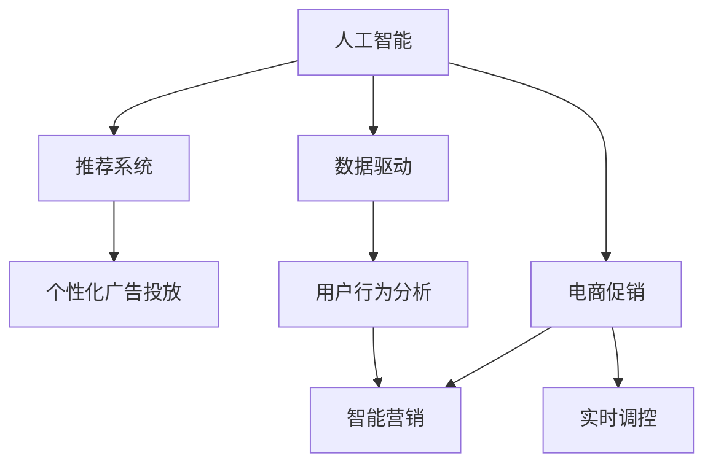

                 

# AI在电商促销中的实际应用

> 关键词：人工智能,电商,促销,广告推荐,用户行为分析,推荐系统

## 1. 背景介绍

### 1.1 问题由来
在电商领域，促销活动（如双十一、618等）是商家提升销售、增加用户粘性的重要手段。然而，由于用户需求多样，如何精准投放促销资源，吸引并转化用户，仍是众多商家面临的难题。传统手段往往依赖人工操作和简单的统计分析，效率低下、效果不佳。而人工智能（AI）的引入，为电商促销带来了新的希望，极大地提升了促销活动的效果和用户体验。

### 1.2 问题核心关键点
人工智能在电商促销中的实际应用，主要涉及以下几个关键点：
1. 数据驱动：通过大数据分析用户行为，理解用户需求，指导促销策略的设计和优化。
2. 推荐系统：使用推荐算法进行个性化广告投放，提升广告的点击率和转化率。
3. 用户行为分析：深入挖掘用户购买行为模式，预测用户购买意向，优化促销方案。
4. 智能营销：利用AI技术自动生成广告文案、优化广告素材，提升广告创意的吸引力和竞争力。
5. 实时调控：通过实时数据分析，动态调整促销策略，确保促销活动的效果最优。

## 2. 核心概念与联系

### 2.1 核心概念概述

为了更好地理解AI在电商促销中的应用，本节将介绍几个关键概念及其联系：

- 人工智能（AI）：以机器学习、深度学习为代表的技术，通过算法自动学习和优化，提升系统性能。
- 推荐系统：根据用户历史行为和兴趣，推荐合适的商品或服务，提升用户体验和转化率。
- 数据驱动：利用数据分析工具和技术，从海量数据中提取有价值信息，指导业务决策。
- 电商促销：通过各种优惠活动，如折扣、满减、满赠等，提升产品销量和用户粘性。
- 实时调控：在促销活动过程中，动态监测数据变化，及时调整策略，确保活动效果最优。

这些概念通过以下Mermaid流程图来展示其联系：



这个流程图展示了几者之间的联系：

1. AI通过数据驱动和电商促销，获取用户行为数据和业务需求，指导推荐系统的设计。
2. 推荐系统基于用户行为分析，进行个性化广告投放。
3. 电商促销结合智能营销，提升广告创意的质量和效果。
4. 实时调控基于数据驱动和用户行为分析，动态调整促销策略。

## 3. 核心算法原理 & 具体操作步骤
### 3.1 算法原理概述

在电商促销中，AI的应用主要体现在推荐系统和用户行为分析两个方面。以下将详细阐述这两个方向的算法原理。

### 3.2 算法步骤详解

#### 3.2.1 推荐系统

推荐系统通过协同过滤、基于内容的推荐、深度学习等方法，实现商品或服务的个性化推荐。其中，协同过滤算法是一种基于用户历史行为的推荐方法，包括用户-用户协同过滤和物品-物品协同过滤两种。以用户-用户协同过滤为例，其基本步骤如下：

1. 数据预处理：收集用户对商品的历史评分数据，形成用户-商品评分矩阵。
2. 相似度计算：计算用户之间的相似度，一般采用余弦相似度、皮尔逊相关系数等方法。
3. 推荐计算：根据相似度计算结果，推荐用户可能感兴趣的商品，通常使用加权平均法、KNN法等算法。

#### 3.2.2 用户行为分析

用户行为分析通过深度学习模型，挖掘用户行为特征，预测用户购买意向。以基于序列的深度学习模型为例，其基本步骤如下：

1. 数据预处理：收集用户在不同时间段内的行为数据，如浏览、点击、购买等，形成行为序列。
2. 特征提取：通过编码器网络（如RNN、LSTM、GRU等）提取行为序列中的特征。
3. 模型训练：使用序列标注模型（如CTC、Attention等）训练预测模型，预测用户是否会发生购买行为。
4. 预测优化：根据预测结果，调整推荐系统和促销策略，提升用户体验和转化率。

### 3.3 算法优缺点

#### 3.3.1 推荐系统的优缺点

推荐系统的优点在于：
1. 个性化：能够根据用户历史行为，推荐个性化的商品，提升用户体验。
2. 效果显著：通过优化推荐算法，可以显著提高广告的点击率和转化率。
3. 应用广泛：适用于多种电商场景，包括电商网站、APP等。

缺点在于：
1. 数据需求高：需要大量的用户行为数据进行训练，数据质量对推荐效果影响较大。
2. 冷启动问题：新用户或新商品往往缺乏足够的行为数据，难以进行有效推荐。
3. 计算复杂：推荐算法通常需要较长的计算时间，对于大规模数据集尤其明显。

#### 3.3.2 用户行为分析的优缺点

用户行为分析的优点在于：
1. 精确预测：通过深度学习模型，可以更精确地预测用户购买意向。
2. 实时调控：能够实时监测用户行为变化，动态调整促销策略。
3. 提高转化率：通过优化促销活动，提升用户购买率和转化率。

缺点在于：
1. 数据隐私：收集和分析用户行为数据，可能涉及隐私问题，需严格遵守法律法规。
2. 模型复杂：深度学习模型需要大量计算资源，训练和推理过程较复杂。
3. 用户流失：过度干预用户行为，可能导致用户反感和流失。

### 3.4 算法应用领域

AI在电商促销中的应用领域十分广泛，以下列举几个主要方向：

1. 个性化广告推荐：通过分析用户历史行为，推荐个性化的广告，提升广告的点击率和转化率。
2. 实时动态广告投放：基于用户实时行为数据，动态调整广告投放策略，实现最佳效果。
3. 用户行为预测：通过深度学习模型，预测用户购买意向，优化促销方案，提升用户体验和转化率。
4. 智能客服：利用自然语言处理技术，实现自动客服，提升客户满意度。
5. 价格优化：通过分析用户购买行为，动态调整商品价格，提升销售额。

## 4. 数学模型和公式 & 详细讲解  
### 4.1 数学模型构建

在电商促销中，推荐系统和用户行为分析涉及的数学模型较多。以下以协同过滤算法为例，详细讲解其数学模型和公式。

#### 4.1.1 用户-用户协同过滤

假设用户集为 $U=\{u_1,u_2,\cdots,u_M\}$，商品集为 $I=\{i_1,i_2,\cdots,i_N\}$，用户 $u_m$ 对商品 $i_n$ 的评分记为 $r_{mn}$。协同过滤的目标是推荐用户 $u_m$ 可能感兴趣的商品 $i_n$。设 $u_m$ 和 $u_n$ 之间的相似度为 $s_{mn}$，则协同过滤模型可表示为：

$$
\hat{r}_{mn} = \sum_{k=1}^K s_{mk}r_{kn} = \sum_{k=1}^K \alpha_{mk}r_{kn}
$$

其中 $\alpha_{mk}$ 为权重系数，可以通过训练得到。推荐结果可通过阈值 $T$ 进行筛选，即：

$$
\hat{r}_{mn} > T \Rightarrow i_n \text{ 推荐给 } u_m
$$

#### 4.1.2 物品-物品协同过滤

物品-物品协同过滤方法与用户-用户协同过滤类似，其基本思想是通过相似度计算，推荐用户可能感兴趣的商品。具体公式如下：

$$
\hat{r}_{mn} = \sum_{k=1}^K s_{kn}r_{km} = \sum_{k=1}^K \alpha_{kn}r_{km}
$$

### 4.2 公式推导过程

以用户-用户协同过滤为例，推导其公式。假设相似度计算方法为余弦相似度，则有：

$$
s_{mn} = \frac{\sum_{k=1}^K \alpha_{mk}\alpha_{nk}}{\sqrt{\sum_{k=1}^K (\alpha_{mk})^2}\sqrt{\sum_{k=1}^K (\alpha_{nk})^2}}
$$

将 $s_{mn}$ 代入推荐公式，得：

$$
\hat{r}_{mn} = \sum_{k=1}^K \alpha_{mk}\alpha_{nk}r_{kn}
$$

### 4.3 案例分析与讲解

以淘宝为例，分析其推荐系统的实现。淘宝的推荐系统通过深度学习和协同过滤算法，实现个性化推荐。其中，协同过滤算法用于推荐用户可能感兴趣的商品，而深度学习模型则用于用户行为预测和实时调控。

淘宝的推荐系统首先收集用户对商品的历史评分数据，形成用户-商品评分矩阵。然后，使用协同过滤算法，计算用户之间的相似度，进行个性化推荐。同时，淘宝还利用深度学习模型，预测用户购买意向，动态调整推荐策略，确保促销活动的效果最优。

## 5. 项目实践：代码实例和详细解释说明
### 5.1 开发环境搭建

在进行电商促销推荐系统的开发前，我们需要准备好开发环境。以下是使用Python进行TensorFlow开发的环境配置流程：

1. 安装Anaconda：从官网下载并安装Anaconda，用于创建独立的Python环境。

2. 创建并激活虚拟环境：
```bash
conda create -n tensorflow-env python=3.8 
conda activate tensorflow-env
```

3. 安装TensorFlow：根据CUDA版本，从官网获取对应的安装命令。例如：
```bash
conda install tensorflow tensorflow-gpu -c conda-forge
```

4. 安装其他依赖包：
```bash
pip install numpy pandas scikit-learn tensorflow-addons
```

完成上述步骤后，即可在`tensorflow-env`环境中开始推荐系统的开发。

### 5.2 源代码详细实现

下面我们以基于协同过滤的推荐系统为例，给出使用TensorFlow进行推荐系统开发的PyTorch代码实现。

首先，定义用户-商品评分矩阵：

```python
import numpy as np
from sklearn.metrics.pairwise import cosine_similarity

ratings = np.array([[5, 3, 2, 0, 0], 
                   [3, 4, 5, 0, 0], 
                   [0, 0, 0, 5, 4], 
                   [0, 0, 0, 3, 1]])
```

然后，计算用户之间的相似度：

```python
similarity = cosine_similarity(ratings)
```

接着，使用协同过滤算法进行推荐：

```python
def recommendation(ratings, similarity, user_id):
    user_vector = ratings[user_id]
    similarity_matrix = similarity[user_id].reshape(1, -1)
    recommendations = np.dot(similarity_matrix, user_vector)
    return np.argsort(recommendations)[::-1]
```

最后，测试推荐系统：

```python
print(recommendation(ratings, similarity, 0))
```

以上就是使用TensorFlow进行基于协同过滤的推荐系统的完整代码实现。可以看到，通过TensorFlow的强大功能，我们可以很方便地实现推荐算法，进行个性化推荐。

### 5.3 代码解读与分析

让我们再详细解读一下关键代码的实现细节：

**ratings数组**：
- 定义了一个3x5的评分矩阵，表示用户对商品的评分。

**cosine_similarity函数**：
- 使用sklearn库的余弦相似度计算方法，计算用户之间的相似度。

**recommendation函数**：
- 输入评分矩阵、相似度矩阵和用户ID，计算用户向量与每个商品的相似度，根据相似度排序，返回推荐的商品ID列表。

**测试代码**：
- 对用户ID为0的用户进行推荐，输出推荐结果。

**TensorFlow的优点**：
- 灵活性强：TensorFlow支持动态计算图，可以方便地实现复杂的推荐算法。
- 可扩展性强：支持多GPU、多分布式计算，可以高效处理大规模数据集。
- 社区支持强：社区活跃，资源丰富，学习资源和开发工具丰富。

## 6. 实际应用场景

### 6.1 智能推荐

智能推荐是电商促销中最重要的应用之一。通过推荐系统，电商平台可以根据用户历史行为，推荐个性化的商品，提升用户满意度和购买率。例如，京东的推荐系统通过深度学习模型，分析用户行为数据，实现实时推荐，显著提升了用户的点击率和购买率。

### 6.2 实时动态广告投放

实时动态广告投放是电商促销中另一个重要应用。通过分析用户实时行为数据，电商平台可以动态调整广告投放策略，实现最佳效果。例如，淘宝的推荐系统通过实时数据监测，动态调整广告投放，优化广告效果。

### 6.3 用户行为预测

用户行为预测在电商促销中具有重要的应用价值。通过预测用户购买意向，电商平台可以优化促销活动，提升用户体验和转化率。例如，美团通过深度学习模型，预测用户是否会预订餐厅，优化餐厅推荐策略，提高用户预订率。

### 6.4 未来应用展望

未来，随着AI技术的进一步发展，电商促销中的应用将更加广泛和深入。以下是几个可能的应用方向：

1. 跨平台推荐：通过跨平台数据共享，实现多平台之间的推荐，提升用户覆盖面和转化率。
2. 实时监控与反馈：通过实时监控用户行为数据，及时调整促销策略，提升效果。
3. 个性化推荐引擎：结合深度学习和协同过滤算法，构建更加智能的推荐引擎，提升推荐效果。
4. 智能客服与广告创意生成：利用自然语言处理技术和生成对抗网络（GAN），实现智能客服和自动广告创意生成，提升用户体验和广告创意的吸引力。

## 7. 工具和资源推荐
### 7.1 学习资源推荐

为了帮助开发者系统掌握AI在电商促销中的应用，这里推荐一些优质的学习资源：

1. TensorFlow官方文档：TensorFlow的官方文档详细介绍了TensorFlow的使用方法、API接口和最佳实践，是学习和使用TensorFlow的重要资源。

2. PyTorch官方文档：PyTorch的官方文档提供了详细的API文档和代码示例，是学习和使用PyTorch的重要资源。

3. 深度学习与推荐系统课程：由斯坦福大学、北京大学等名校开设的在线课程，系统介绍深度学习理论和推荐系统算法，适合初学者和进阶者学习。

4. 电商推荐系统实战：基于真实电商数据，讲解电商推荐系统的实现方法和技术要点，适合实战学习。

5. Kaggle竞赛：Kaggle平台上的电商推荐系统竞赛，通过实际数据和任务，锻炼推荐系统的设计和实现能力。

通过对这些资源的学习实践，相信你一定能够快速掌握AI在电商促销中的应用精髓，并用于解决实际的电商问题。

### 7.2 开发工具推荐

高效的开发离不开优秀的工具支持。以下是几款用于AI在电商促销应用的常用工具：

1. TensorFlow：基于Python的开源深度学习框架，灵活性高，易于扩展。
2. PyTorch：基于Python的开源深度学习框架，动态计算图，易于研究和开发。
3. Jupyter Notebook：轻量级的Web界面，支持多种编程语言，适合进行数据处理和模型调试。
4. Keras：基于TensorFlow和Theano的高级API，提供了简单易用的接口，适合快速原型开发。
5. Scikit-learn：基于Python的机器学习库，提供了丰富的算法和工具，适合数据预处理和特征工程。

合理利用这些工具，可以显著提升AI在电商促销中的应用开发效率，加快创新迭代的步伐。

### 7.3 相关论文推荐

AI在电商促销中的应用源于学界的持续研究。以下是几篇奠基性的相关论文，推荐阅读：

1. Wide & Deep Learning for Recommender Systems：介绍Wide & Deep模型，将浅层模型和深度模型结合，提升推荐系统的效果。
2. Learning Deep Architectures for AI：深度学习模型的介绍和应用，为电商推荐系统提供了理论基础。
3. Learning to Recommend: A Big-Rank Framework with Provable Guarantee：介绍深度学习模型的应用，提供推荐系统的理论分析和实验结果。
4. Mining Textual Bazaar: Mining and Analyzing Reviews to Improve Online Recommendations：通过分析用户评论，提升推荐系统的质量和效果。
5. Deep Neural Networks for Recommendation：深度学习模型在推荐系统中的应用，提供了推荐系统的实现方法和技术要点。

这些论文代表了大规模推荐系统的发展脉络。通过学习这些前沿成果，可以帮助研究者把握学科前进方向，激发更多的创新灵感。

## 8. 总结：未来发展趋势与挑战

### 8.1 研究成果总结

本文对AI在电商促销中的应用进行了全面系统的介绍。首先阐述了电商促销中存在的问题和挑战，明确了AI应用的重要性和潜力。其次，从推荐系统和用户行为分析两个方向，详细讲解了AI的应用原理和操作步骤，给出了具体的代码实现。同时，本文还探讨了AI在电商促销中的实际应用场景，展示了AI技术的广泛前景。此外，本文精选了AI在电商促销应用的各类学习资源，力求为读者提供全方位的技术指引。

通过本文的系统梳理，可以看到，AI在电商促销中的应用已经在多个方向上取得了显著成效，提升了电商平台的运营效率和用户体验。未来，伴随AI技术的不断进步，电商促销中的应用将更加广泛和深入，为电商平台带来更多商业价值。

### 8.2 未来发展趋势

展望未来，AI在电商促销中的应用将呈现以下几个发展趋势：

1. 推荐系统更加个性化：随着推荐算法的发展，推荐系统将更加个性化，能够精准匹配用户需求。
2. 实时数据处理能力更强：实时数据处理技术将进一步发展，支持更复杂、更快速的推荐算法。
3. 跨平台协同推荐：跨平台数据共享将更加普及，实现多平台之间的协同推荐。
4. 用户行为分析更加深入：深度学习模型的应用将更加广泛，挖掘用户行为特征的能力更强。
5. 智能客服和广告创意生成：利用自然语言处理技术和生成对抗网络（GAN），实现智能客服和自动广告创意生成。

### 8.3 面临的挑战

尽管AI在电商促销中的应用已经取得了显著成效，但在迈向更加智能化、普适化应用的过程中，它仍面临诸多挑战：

1. 数据隐私问题：电商平台的推荐系统和广告投放需要收集和分析大量用户行为数据，可能涉及隐私问题。
2. 冷启动问题：新用户和新商品往往缺乏足够的行为数据，难以进行有效推荐。
3. 计算资源需求高：深度学习模型的训练和推理需要大量计算资源，可能会影响系统的实时性和可扩展性。
4. 过度干预用户：过度干预用户行为，可能导致用户反感和流失。
5. 广告投放效果不理想：广告投放策略不当，可能导致用户点击率低、转化率低。

### 8.4 研究展望

面对AI在电商促销应用所面临的挑战，未来的研究需要在以下几个方面寻求新的突破：

1. 数据隐私保护：采用数据匿名化、联邦学习等技术，保护用户隐私，提高数据安全性。
2. 高效推荐算法：开发高效推荐算法，减少对数据量和计算资源的需求，提升推荐系统的实时性和可扩展性。
3. 跨平台协同推荐：通过跨平台数据共享，实现多平台之间的协同推荐，提升用户覆盖面和转化率。
4. 用户行为分析：结合深度学习和知识图谱，挖掘用户行为特征，提高预测精度。
5. 智能客服和广告创意生成：利用自然语言处理技术和生成对抗网络（GAN），实现智能客服和自动广告创意生成，提升用户体验和广告创意的吸引力。

这些研究方向的探索发展，必将引领AI在电商促销应用迈向更高的台阶，为电商平台带来更多商业价值。面向未来，AI在电商促销中的应用还需要与其他AI技术进行更深入的融合，如知识表示、因果推理、强化学习等，多路径协同发力，共同推动电商行业的发展。只有勇于创新、敢于突破，才能不断拓展AI在电商促销应用中的边界，让电商技术更好地服务于社会。

## 9. 附录：常见问题与解答

**Q1：电商促销中如何提升用户点击率和转化率？**

A: 电商促销中，提升用户点击率和转化率主要通过以下方式：

1. 个性化推荐：利用推荐系统，根据用户历史行为，推荐个性化的商品，提升用户点击率和购买率。
2. 广告创意优化：利用自然语言处理技术和生成对抗网络（GAN），自动生成广告创意，提升广告的吸引力和点击率。
3. 动态定价：通过分析用户行为数据，动态调整商品价格，优化促销策略，提高用户购买率和转化率。
4. 社交分享：通过社交媒体分享功能，扩大促销活动的覆盖面和影响力，提升用户点击率和购买率。

**Q2：电商推荐系统如何实现实时推荐？**

A: 电商推荐系统实现实时推荐主要通过以下方式：

1. 数据流处理：利用实时数据流处理技术，收集和分析用户行为数据，动态调整推荐策略。
2. 缓存优化：通过缓存技术，加快数据处理和模型推理，提高实时推荐的速度和效率。
3. 异步计算：利用异步计算技术，加速模型训练和推理，提升推荐系统的实时性。
4. 分布式计算：通过分布式计算技术，支持大规模数据处理和模型推理，提升推荐系统的可扩展性。

**Q3：电商广告投放如何优化？**

A: 电商广告投放优化主要通过以下方式：

1. 数据驱动：利用大数据分析用户行为数据，识别广告投放的关键因素，优化投放策略。
2. A/B测试：通过A/B测试，比较不同广告创意的效果，选择最优的广告投放方案。
3. 实时调整：通过实时数据监测，动态调整广告投放策略，提升广告效果。
4. 用户行为预测：利用深度学习模型，预测用户广告投放意向，优化广告投放策略。

**Q4：推荐系统中的冷启动问题如何解决？**

A: 推荐系统中的冷启动问题可以通过以下方式解决：

1. 利用用户兴趣标签：通过用户填写的兴趣标签，进行推荐。
2. 利用物品属性：通过物品属性信息，进行推荐。
3. 利用用户社交网络：通过用户社交网络信息，进行推荐。
4. 利用协同过滤：通过用户历史行为数据，进行推荐。
5. 利用深度学习模型：通过深度学习模型，进行推荐。

**Q5：如何保护电商平台的推荐系统和广告投放中的用户隐私？**

A: 电商平台在推荐系统和广告投放中保护用户隐私主要通过以下方式：

1. 数据匿名化：通过数据匿名化技术，保护用户隐私，避免数据泄露。
2. 联邦学习：通过联邦学习技术，在不共享用户数据的前提下，实现模型的协同训练。
3. 差分隐私：通过差分隐私技术，保护用户隐私，避免数据泄露。
4. 隐私计算：通过隐私计算技术，在不共享用户数据的前提下，实现模型的协同训练。

这些方法可以有效地保护用户隐私，确保电商平台的推荐系统和广告投放符合法律法规和用户需求。

