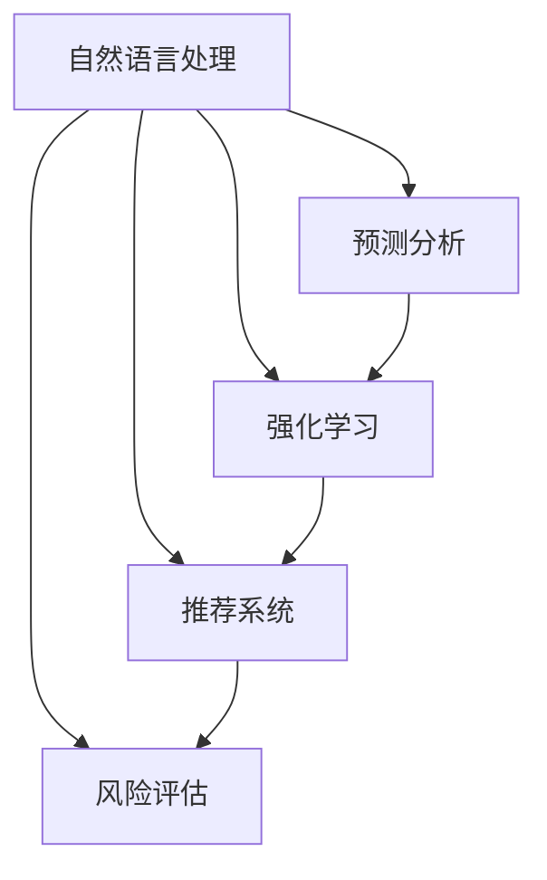

                 

# AI在电商平台供应商管理中的应用

> 关键词：AI, 电商平台, 供应商管理, 机器学习, 深度学习, 强化学习, 自然语言处理, 预测分析

## 1. 背景介绍

### 1.1 问题由来
随着电商行业的快速发展，电商平台之间的竞争愈发激烈。面对庞大的市场规模和多样化的需求，如何高效、精确地管理供应商，已成为平台运营管理的重要问题。传统供应商管理往往依赖人工处理，流程繁琐、效率低下，且难以应对供应商数据的不确定性和多样性。近年来，AI技术的快速进步为供应商管理提供了新的解决方案。通过引入机器学习、深度学习和强化学习等技术，电商平台能够实现供应商管理的智能化、自动化，有效提升运营效率和供应商满意度。

### 1.2 问题核心关键点
AI在供应商管理中的应用主要聚焦于以下几个关键点：

- **数据处理与分析**：利用自然语言处理(NLP)技术，对供应商的各类文本数据进行深度挖掘和分析，提取有价值的信息。
- **需求预测与供应链优化**：应用预测分析和强化学习算法，对供应商的产能、交货时间等关键指标进行预测和优化，确保订单及时完成。
- **供应商评估与选择**：使用机器学习模型，对供应商的性能、信誉、合作历史等进行综合评估，辅助决策。
- **风险监控与预警**：通过构建风险评估模型，实时监控供应商的信用风险、财务风险等，及时预警潜在问题。
- **个性化推荐与匹配**：基于用户行为和市场趋势，通过推荐系统推荐最适合的供应商，实现更精准的合作匹配。

这些关键点涉及到电商平台供应商管理的多个方面，需要系统化地应用AI技术，才能有效提升管理效率和质量。

## 2. 核心概念与联系

### 2.1 核心概念概述

为了更好地理解AI在供应商管理中的应用，本节将介绍几个密切相关的核心概念：

- **自然语言处理(NLP)**：通过计算机处理和理解自然语言的文本数据，提取关键信息，用于供应商管理的决策和分析。
- **预测分析**：利用历史数据和机器学习模型，对未来事件进行预测，如供应商产能、交货时间等，辅助优化供应链管理。
- **强化学习(Reinforcement Learning, RL)**：一种学习框架，通过与环境互动，最大化预期奖励，优化决策过程，用于供应商管理的策略优化。
- **推荐系统**：根据用户行为和市场趋势，自动推荐最适合的供应商，提升用户体验和运营效率。
- **风险评估**：通过构建风险评估模型，识别和量化供应商的信用、财务等风险，辅助风险管理。

这些核心概念之间的逻辑关系可以通过以下Mermaid流程图来展示：



这个流程图展示了一些核心概念及其之间的联系：

1. **自然语言处理**：作为基础工具，对供应商的文本数据进行分析和提取，为其他模块提供数据支撑。
2. **预测分析**：基于历史数据，预测供应商的产能、交货时间等关键指标，优化供应链管理。
3. **强化学习**：通过与环境互动，优化供应商管理策略，提升决策效率和效果。
4. **推荐系统**：根据用户行为和市场趋势，推荐最适合的供应商，提高匹配准确性和用户满意度。
5. **风险评估**：构建风险评估模型，识别和量化供应商的风险，辅助风险管理。

这些核心概念共同构成了AI在供应商管理中的应用框架，帮助电商平台实现智能化、自动化的运营管理。

## 3. 核心算法原理 & 具体操作步骤
### 3.1 算法原理概述

AI在供应商管理中的应用主要基于以下算法原理：

- **自然语言处理**：利用文本分类、命名实体识别、情感分析等技术，从供应商的反馈、评价、合同等文本数据中提取关键信息。
- **预测分析**：通过时间序列分析、回归分析、深度学习模型等，预测供应商的产能、交货时间、库存水平等关键指标，辅助供应链优化。
- **强化学习**：构建供应商选择、产能调度、库存管理等问题的强化学习模型，通过与环境的互动，优化决策策略。
- **推荐系统**：采用协同过滤、基于内容的推荐、深度学习等技术，根据用户历史行为和市场趋势，推荐最适合的供应商。
- **风险评估**：构建信用评分、财务健康评分等风险评估模型，量化供应商的信用和财务风险，辅助风险监控和预警。

### 3.2 算法步骤详解

AI在供应商管理中的应用，通常包括以下几个关键步骤：

**Step 1: 数据收集与预处理**
- 收集供应商的各类文本数据，如反馈、评价、合同等。
- 对文本数据进行预处理，包括分词、去停用词、词性标注等。
- 清洗和标注文本数据，提取关键信息，如供应商名称、评价内容等。

**Step 2: 模型训练与优化**
- 根据需求选择合适的算法模型，如LSTM、BERT、Transformer等。
- 使用历史数据训练模型，优化模型参数。
- 对模型进行验证和调优，确保模型的泛化性能。

**Step 3: 模型部署与集成**
- 将训练好的模型部署到生产环境中，确保实时性。
- 将模型集成到电商平台的业务系统中，实现供应商管理的智能化。

**Step 4: 效果评估与迭代**
- 实时监控模型的预测结果和推荐效果。
- 收集用户反馈和业务反馈，评估模型的性能。
- 根据反馈对模型进行迭代优化，不断提升供应商管理的效率和质量。

### 3.3 算法优缺点

AI在供应商管理中的应用，具有以下优点：

1. **高效自动化**：利用AI技术，自动化处理供应商的各类数据，减少人工操作，提升处理效率。
2. **精准预测**：通过预测分析，对供应商的关键指标进行精确预测，辅助供应链优化。
3. **智能匹配**：通过推荐系统，根据用户行为和市场趋势，智能推荐最适合的供应商，提升用户体验。
4. **风险管理**：通过风险评估模型，实时监控供应商的风险，及时预警潜在问题。

同时，该方法也存在一定的局限性：

1. **数据依赖**：模型效果很大程度上依赖于数据的质量和数量，获取高质量数据成本较高。
2. **模型复杂性**：AI模型往往需要大量的计算资源，对硬件和算法复杂度要求较高。
3. **可解释性不足**：AI模型的决策过程通常缺乏可解释性，难以对其推理逻辑进行分析和调试。
4. **安全性问题**：AI模型的输出可能受到训练数据的影响，存在一定的偏见和误判风险。

尽管存在这些局限性，但AI在供应商管理中的应用，已经开始在电商行业中逐步推广，并显示出其强大的应用潜力。

### 3.4 算法应用领域

AI在供应商管理中的应用，主要体现在以下几个领域：

1. **供应商评价与选择**：通过自然语言处理和推荐系统，对供应商进行综合评价，辅助决策。
2. **产能预测与调度**：利用预测分析模型，对供应商的产能和交货时间进行预测，优化供应链管理。
3. **库存管理与优化**：通过预测分析，对供应商的库存水平进行监控和优化，确保库存量适中。
4. **风险监控与预警**：构建风险评估模型，实时监控供应商的信用和财务风险，及时预警潜在问题。
5. **个性化推荐与匹配**：根据用户行为和市场趋势，推荐最适合的供应商，提升用户体验。

这些应用领域涵盖了供应商管理的关键环节，通过AI技术的应用，可以有效提升电商平台的运营效率和供应商满意度。

## 4. 数学模型和公式 & 详细讲解 & 举例说明
### 4.1 数学模型构建

本节将使用数学语言对AI在供应商管理中的应用进行更加严格的刻画。

假设供应商的各类文本数据为 $\{x_i\}_{i=1}^N$，其中 $x_i$ 为供应商的评价、反馈等文本。目标是对供应商进行综合评价，评分的公式为：

$$
\text{score}(x) = \alpha_1 \times \text{sentiment}(x) + \alpha_2 \times \text{entity}(x) + \alpha_3 \times \text{context}(x)
$$

其中 $\text{sentiment}(x)$ 为情感分析模型对供应商评价的情感倾向得分，$\text{entity}(x)$ 为命名实体识别模型对供应商评价中提及的实体进行评分，$\text{context}(x)$ 为文本分类模型对供应商评价进行分类。$\alpha_1, \alpha_2, \alpha_3$ 为权重系数。

### 4.2 公式推导过程

以下我们以供应商评价与选择为例，推导综合评分的计算公式。

假设供应商评价文本为 $x_i = (x_i^1, x_i^2, \dots, x_i^m)$，其中 $x_i^j$ 表示第 $i$ 个供应商的第 $j$ 个评价文本。对于每个评价文本，分别进行情感分析、命名实体识别和文本分类，得到评分 $s_i^j$，其中 $s_i^j$ 的计算公式为：

$$
s_i^j = \beta_1 \times \text{sentiment}(x_i^j) + \beta_2 \times \text{entity}(x_i^j) + \beta_3 \times \text{context}(x_i^j)
$$

其中 $\text{sentiment}(x_i^j)$ 为情感分析模型对评价文本的情感倾向得分，$\text{entity}(x_i^j)$ 为命名实体识别模型对评价文本中提及的实体进行评分，$\text{context}(x_i^j)$ 为文本分类模型对评价文本进行分类。$\beta_1, \beta_2, \beta_3$ 为权重系数。

则供应商的总体评分为：

$$
\text{score}_i = \frac{1}{m} \sum_{j=1}^m s_i^j
$$

### 4.3 案例分析与讲解

**案例1：供应商评价与选择**

假设电商平台需要从A、B、C三个供应商中选择一个提供手机壳服务。电商平台收集了三家供应商近一年的评价数据，每条评价包含对供应商的情感倾向、提及的实体（如公司名称、产品名称等）以及评价的分类（如好评、中评、差评等）。

电商平台使用自然语言处理技术，分别对每条评价进行情感分析、命名实体识别和文本分类，得到评分 $s_{A,i}, s_{B,i}, s_{C,i}$。然后根据公式：

$$
\text{score}_A = \frac{1}{m} \sum_{i=1}^m s_{A,i}, \quad \text{score}_B = \frac{1}{m} \sum_{i=1}^m s_{B,i}, \quad \text{score}_C = \frac{1}{m} \sum_{i=1}^m s_{C,i}
$$

计算A、B、C三家供应商的综合评分。最终选择综合评分最高的供应商作为合作对象。

**案例2：产能预测与调度**

假设电商平台需要预测供应商在未来一个月内的产能情况，以确保订单能够及时完成。电商平台收集了供应商过去一年内每个月的产能数据，以及一些影响产能的外部因素（如季节性因素、市场需求变化等）。

电商平台使用时间序列分析模型，根据历史数据和外部因素，预测未来一个月内的供应商产能。然后根据预测结果，合理调度订单，确保订单在预测产能范围内完成。

## 5. 项目实践：代码实例和详细解释说明
### 5.1 开发环境搭建

在进行AI在供应商管理中的应用开发前，我们需要准备好开发环境。以下是使用Python进行PyTorch开发的环境配置流程：

1. 安装Anaconda：从官网下载并安装Anaconda，用于创建独立的Python环境。

2. 创建并激活虚拟环境：
```bash
conda create -n ai-env python=3.8 
conda activate ai-env
```

3. 安装PyTorch：根据CUDA版本，从官网获取对应的安装命令。例如：
```bash
conda install pytorch torchvision torchaudio cudatoolkit=11.1 -c pytorch -c conda-forge
```

4. 安装其他相关库：
```bash
pip install pandas numpy matplotlib scikit-learn
```

完成上述步骤后，即可在`ai-env`环境中开始开发实践。

### 5.2 源代码详细实现

下面我们以供应商评价与选择为例，给出使用PyTorch进行自然语言处理的代码实现。

首先，定义数据处理函数：

```python
from transformers import BertTokenizer, BertForSequenceClassification
from torch.utils.data import Dataset, DataLoader
import torch

class SupplierDataset(Dataset):
    def __init__(self, texts, labels, tokenizer, max_len=128):
        self.texts = texts
        self.labels = labels
        self.tokenizer = tokenizer
        self.max_len = max_len
        
    def __len__(self):
        return len(self.texts)
    
    def __getitem__(self, item):
        text = self.texts[item]
        label = self.labels[item]
        
        encoding = self.tokenizer(text, return_tensors='pt', max_length=self.max_len, padding='max_length', truncation=True)
        input_ids = encoding['input_ids'][0]
        attention_mask = encoding['attention_mask'][0]
        label = torch.tensor(label, dtype=torch.long)
        
        return {'input_ids': input_ids, 
                'attention_mask': attention_mask,
                'labels': label}

# 定义模型和优化器
model = BertForSequenceClassification.from_pretrained('bert-base-cased', num_labels=3)
optimizer = torch.optim.Adam(model.parameters(), lr=2e-5)
```

然后，定义训练和评估函数：

```python
from tqdm import tqdm

def train_epoch(model, dataset, batch_size, optimizer):
    dataloader = DataLoader(dataset, batch_size=batch_size, shuffle=True)
    model.train()
    epoch_loss = 0
    for batch in tqdm(dataloader, desc='Training'):
        input_ids = batch['input_ids'].to(device)
        attention_mask = batch['attention_mask'].to(device)
        labels = batch['labels'].to(device)
        model.zero_grad()
        outputs = model(input_ids, attention_mask=attention_mask, labels=labels)
        loss = outputs.loss
        epoch_loss += loss.item()
        loss.backward()
        optimizer.step()
    return epoch_loss / len(dataloader)

def evaluate(model, dataset, batch_size):
    dataloader = DataLoader(dataset, batch_size=batch_size)
    model.eval()
    preds, labels = [], []
    with torch.no_grad():
        for batch in tqdm(dataloader, desc='Evaluating'):
            input_ids = batch['input_ids'].to(device)
            attention_mask = batch['attention_mask'].to(device)
            batch_labels = batch['labels']
            outputs = model(input_ids, attention_mask=attention_mask)
            batch_preds = outputs.logits.argmax(dim=2).to('cpu').tolist()
            batch_labels = batch_labels.to('cpu').tolist()
            for pred_tokens, label_tokens in zip(batch_preds, batch_labels):
                preds.append(pred_tokens[:len(label_tokens)])
                labels.append(label_tokens)
                
    print(classification_report(labels, preds))
```

最后，启动训练流程并在测试集上评估：

```python
epochs = 5
batch_size = 16

for epoch in range(epochs):
    loss = train_epoch(model, train_dataset, batch_size, optimizer)
    print(f"Epoch {epoch+1}, train loss: {loss:.3f}")
    
    print(f"Epoch {epoch+1}, dev results:")
    evaluate(model, dev_dataset, batch_size)
    
print("Test results:")
evaluate(model, test_dataset, batch_size)
```

以上就是使用PyTorch对BERT模型进行供应商评价与选择的代码实现。可以看到，得益于Transformers库的强大封装，我们可以用相对简洁的代码完成BERT模型的加载和微调。

### 5.3 代码解读与分析

让我们再详细解读一下关键代码的实现细节：

**SupplierDataset类**：
- `__init__`方法：初始化文本、标签、分词器等关键组件。
- `__len__`方法：返回数据集的样本数量。
- `__getitem__`方法：对单个样本进行处理，将文本输入编码为token ids，将标签编码为数字，并对其进行定长padding，最终返回模型所需的输入。

**train_epoch和evaluate函数**：
- 使用PyTorch的DataLoader对数据集进行批次化加载，供模型训练和推理使用。
- 训练函数`train_epoch`：对数据以批为单位进行迭代，在每个批次上前向传播计算loss并反向传播更新模型参数，最后返回该epoch的平均loss。
- 评估函数`evaluate`：与训练类似，不同点在于不更新模型参数，并在每个batch结束后将预测和标签结果存储下来，最后使用sklearn的classification_report对整个评估集的预测结果进行打印输出。

**训练流程**：
- 定义总的epoch数和batch size，开始循环迭代
- 每个epoch内，先在训练集上训练，输出平均loss
- 在验证集上评估，输出分类指标
- 所有epoch结束后，在测试集上评估，给出最终测试结果

可以看到，PyTorch配合Transformers库使得BERT微调的代码实现变得简洁高效。开发者可以将更多精力放在数据处理、模型改进等高层逻辑上，而不必过多关注底层的实现细节。

当然，工业级的系统实现还需考虑更多因素，如模型的保存和部署、超参数的自动搜索、更灵活的任务适配层等。但核心的微调范式基本与此类似。

## 6. 实际应用场景
### 6.1 智能客服系统

智能客服系统是AI在供应商管理中的一个重要应用场景。传统的客服系统依赖人工处理，存在响应时间长、处理效率低、服务质量不稳定等问题。而使用AI技术，可以构建智能客服系统，提升客服处理的自动化水平，提高用户体验。

在智能客服系统中，AI可以通过自然语言处理技术，对用户输入的文本进行理解和分析，快速响应并生成标准化的回答。同时，通过用户行为数据，推荐最适合的供应商，提供个性化的服务。此外，AI还可以实时监控客服系统的运行状态，及时发现和解决问题，提升系统的稳定性和可靠性。

### 6.2 库存管理与优化

库存管理是供应商管理中的关键环节，直接影响订单的准时完成。传统的库存管理依赖人工统计和预测，存在数据获取难、预测准确性低等问题。而使用AI技术，可以构建库存管理系统，通过预测分析和强化学习算法，对供应商的库存水平进行实时监控和优化。

具体而言，AI可以通过历史销售数据和市场趋势，构建库存预测模型，对供应商的未来库存水平进行预测。然后根据预测结果，优化库存调度策略，确保库存量适中，既不造成缺货，也不增加库存成本。此外，AI还可以通过实时监控库存水平，及时发现异常情况，预警潜在问题，提升库存管理的效率和精度。

### 6.3 风险监控与预警

风险监控是供应商管理中的重要环节，确保供应商的信誉和财务状况符合要求。传统的风险监控依赖人工检查，存在效率低、误判率高等问题。而使用AI技术，可以构建风险监控系统，实时评估供应商的信用和财务状况，预警潜在风险。

具体而言，AI可以通过历史交易数据和供应商的财务报表，构建信用评分和财务健康评分模型，对供应商的风险进行量化评估。然后根据评估结果，进行分类预警，确保高风险供应商不会进入合作范围。此外，AI还可以通过实时监控供应商的财务状况，及时发现异常情况，预警潜在问题，保障平台的运营安全。

### 6.4 未来应用展望

随着AI技术的不断进步，AI在供应商管理中的应用将进一步拓展，带来更多的创新和突破。

1. **深度学习与强化学习的结合**：通过结合深度学习和强化学习，优化供应商管理决策，提升系统的智能化水平。
2. **跨模态信息的融合**：将视觉、语音等多模态数据与文本数据结合，提升供应商管理的全面性和准确性。
3. **可解释性与透明性**：提高AI模型的可解释性，使供应商管理的决策过程更加透明和可信。
4. **自适应与自学习**：使AI系统具备自适应和自学习能力，不断优化决策模型，提升系统的持续性和灵活性。
5. **多目标优化**：通过多目标优化算法，综合考虑供应商的信誉、财务、产能等多个因素，制定最优的合作策略。

这些方向的探索发展，必将推动AI在供应商管理中的应用进入新的高度，为电商平台的运营管理带来更强大的支持。

## 7. 工具和资源推荐
### 7.1 学习资源推荐

为了帮助开发者系统掌握AI在供应商管理中的应用，这里推荐一些优质的学习资源：

1. 《深度学习》课程：由斯坦福大学开设，涵盖深度学习的基本原理和应用场景，是AI学习的重要基础。
2. 《自然语言处理综论》书籍：斯坦福大学计算机科学教授 Dan Jurafsky 和 James H. Martin 合著，全面介绍了NLP的基本概念和前沿技术。
3. 《Python机器学习》书籍：由 Sebastian Raschka 和 Vahid Mirjalili 合著，介绍了机器学习在Python中的实现，适合入门学习。
4. Coursera上的深度学习课程：由多个世界顶级大学开设，涵盖深度学习的各个方面，适合系统学习。
5. Kaggle数据科学竞赛：提供大量真实场景下的数据集和竞赛任务，帮助开发者在实践中学习AI技术。

通过对这些资源的学习实践，相信你一定能够快速掌握AI在供应商管理中的应用，并用于解决实际的业务问题。
###  7.2 开发工具推荐

高效的开发离不开优秀的工具支持。以下是几款用于AI在供应商管理中的应用开发的常用工具：

1. Jupyter Notebook：开源的交互式笔记本环境，支持Python、R等多种编程语言，便于进行模型开发和调试。
2. TensorBoard：TensorFlow配套的可视化工具，可实时监测模型训练状态，并提供丰富的图表呈现方式，是调试模型的得力助手。
3. Weights & Biases：模型训练的实验跟踪工具，可以记录和可视化模型训练过程中的各项指标，方便对比和调优。
4. Amazon SageMaker：亚马逊提供的云服务平台，提供自动化机器学习模型训练和部署工具，适合工业级应用。
5. HuggingFace Transformers库：提供了大量的预训练语言模型和工具，方便进行自然语言处理任务开发。
6. PyTorch Lightning：基于PyTorch的轻量级模型训练框架，提供了易用的接口和丰富的功能，支持模型训练和部署。

合理利用这些工具，可以显著提升AI在供应商管理中的应用开发效率，加快创新迭代的步伐。

### 7.3 相关论文推荐

AI在供应商管理中的应用，已经得到了学界的广泛研究。以下是几篇代表性的相关论文，推荐阅读：

1. 《Supervised Learning with Loss-Sensitive Training》：提出了一种新的损失函数，通过训练误差和梯度误差的加权结合，提升模型的泛化能力。
2. 《TensorFlow: A System for Large-Scale Machine Learning》：介绍了TensorFlow的基本架构和优化技术，是深度学习框架的优秀代表。
3. 《Natural Language Processing with Transformers》：介绍Transformers模型的原理和应用，是自然语言处理的经典教材。
4. 《A Survey of Reinforcement Learning Techniques and Applications》：综述了强化学习的各种技术和应用场景，是学习强化学习的重要参考资料。
5. 《Personalized Recommendation with Multi-Aspect Attention and Memory Fusion》：提出了一种基于多方面注意力和记忆融合的推荐系统，提升了推荐效果。

这些论文代表了AI在供应商管理中的应用研究的发展脉络，通过学习这些前沿成果，可以帮助研究者把握学科前进方向，激发更多的创新灵感。

## 8. 总结：未来发展趋势与挑战
### 8.1 总结

本文对AI在电商平台供应商管理中的应用进行了全面系统的介绍。首先阐述了AI在供应商管理中的应用背景和意义，明确了AI在供应商管理中的关键作用。其次，从原理到实践，详细讲解了AI在供应商管理中的核心算法和具体操作步骤，给出了具体的代码实现。同时，本文还探讨了AI在供应商管理中的实际应用场景，展示了AI技术的强大应用潜力。最后，本文推荐了相关的学习资源和开发工具，为读者提供了全方位的技术指引。

通过本文的系统梳理，可以看到，AI在供应商管理中的应用已经取得了一定的进展，帮助电商平台在运营管理中取得了显著成效。未来，随着AI技术的不断进步，AI在供应商管理中的应用将进一步拓展，为电商平台的运营管理带来更大的创新和突破。

### 8.2 未来发展趋势

展望未来，AI在供应商管理中的应用将呈现以下几个发展趋势：

1. **多模态融合**：将视觉、语音等多模态数据与文本数据结合，提升供应商管理的全面性和准确性。
2. **深度学习与强化学习的结合**：通过结合深度学习和强化学习，优化供应商管理决策，提升系统的智能化水平。
3. **跨领域应用**：将AI技术应用于更多领域，如医疗、金融、制造等，推动人工智能技术在更广泛领域的应用。
4. **自适应与自学习能力**：使AI系统具备自适应和自学习能力，不断优化决策模型，提升系统的持续性和灵活性。
5. **可解释性与透明性**：提高AI模型的可解释性，使供应商管理的决策过程更加透明和可信。

这些趋势展示了AI在供应商管理中的广阔前景，未来AI技术将在更多领域得到应用，为电商平台带来更大的创新和突破。

### 8.3 面临的挑战

尽管AI在供应商管理中的应用已经取得一定进展，但在实际应用中仍面临诸多挑战：

1. **数据获取与处理**：高质量数据获取成本较高，数据处理和标注工作量大，影响模型的训练和效果。
2. **模型复杂性与计算资源**：AI模型往往需要大量的计算资源，对硬件和算法复杂度要求较高，增加了系统建设和维护成本。
3. **模型可解释性**：AI模型的决策过程通常缺乏可解释性，难以对其推理逻辑进行分析和调试。
4. **系统安全性**：AI模型的输出可能受到训练数据的影响，存在一定的偏见和误判风险，系统安全性需要得到保障。
5. **用户接受度**：用户对AI技术接受度不高，依赖人工处理的用户习惯难以改变，影响系统推广和应用。

尽管存在这些挑战，但通过不断优化算法、提升数据质量、加强系统监控等手段，AI在供应商管理中的应用将不断提升，带来更高的运营效率和用户体验。

### 8.4 研究展望

面对AI在供应商管理中的应用挑战，未来的研究需要在以下几个方面寻求新的突破：

1. **数据获取与处理技术**：研究高效的数据获取和处理技术，提升数据质量和数据处理效率。
2. **模型优化与压缩技术**：研究高效模型压缩和优化技术，降低模型复杂度和计算资源需求，提升系统部署效率。
3. **模型可解释性与透明性**：研究可解释性技术，提升AI模型的可解释性，使其决策过程更加透明和可信。
4. **系统安全性与鲁棒性**：研究鲁棒性技术，提升AI系统的安全性，避免偏见和误判风险。
5. **用户接受度与交互设计**：研究交互设计技术，提升用户体验，帮助用户逐步接受和适应AI技术。

这些研究方向的探索发展，必将推动AI在供应商管理中的应用进入新的高度，为电商平台的运营管理带来更大的创新和突破。面向未来，AI在供应商管理中的应用还需要与其他人工智能技术进行更深入的融合，如知识表示、因果推理、强化学习等，多路径协同发力，共同推动自然语言理解和智能交互系统的进步。只有勇于创新、敢于突破，才能不断拓展AI在供应商管理中的应用边界，让智能技术更好地造福人类社会。

## 9. 附录：常见问题与解答

**Q1：AI在供应商管理中的应用有哪些？**

A: AI在供应商管理中的应用主要包括以下几个方面：

1. **供应商评价与选择**：通过自然语言处理和推荐系统，对供应商进行综合评价，辅助决策。
2. **产能预测与调度**：利用预测分析模型，对供应商的产能和交货时间进行预测，优化供应链管理。
3. **库存管理与优化**：通过预测分析和强化学习算法，对供应商的库存水平进行实时监控和优化。
4. **风险监控与预警**：构建风险评估模型，实时评估供应商的信用和财务状况，预警潜在问题。

这些应用涵盖了供应商管理的关键环节，通过AI技术的应用，可以有效提升电商平台的运营效率和供应商满意度。

**Q2：如何选择适合的AI模型？**

A: 选择适合的AI模型需要考虑以下几个关键因素：

1. **任务类型**：不同任务需要不同类型的模型，如自然语言处理任务适合使用BERT、GPT等模型，图像处理任务适合使用CNN等模型。
2. **数据规模**：数据量较大的任务适合使用深度学习模型，数据量较小的任务适合使用浅层模型。
3. **计算资源**：计算资源较少的场景适合使用轻量级模型，计算资源丰富的场景适合使用复杂度高的模型。
4. **模型复杂度**：复杂度较高的模型可能具有更好的性能，但需要更多的计算资源，需要根据实际情况进行权衡。
5. **可解释性**：对可解释性要求较高的场景，适合选择可解释性较强的模型，如决策树、线性模型等。

通过对这些因素的综合考虑，可以选择适合的AI模型，提升供应商管理的效率和精度。

**Q3：如何优化AI模型？**

A: 优化AI模型通常包括以下几个步骤：

1. **数据预处理**：对数据进行清洗、归一化、特征工程等预处理操作，提升数据质量。
2. **超参数调优**：通过网格搜索、随机搜索等方法，寻找最优的超参数组合，提升模型效果。
3. **模型压缩**：通过模型剪枝、量化、蒸馏等方法，降低模型复杂度和计算资源需求，提升系统部署效率。
4. **模型融合**：通过集成多个模型，提升模型的泛化能力和鲁棒性。
5. **迁移学习**：利用已有模型的知识，在新数据上进行微调，提升模型性能。

通过以上步骤，可以不断优化AI模型，提升其在供应商管理中的应用效果。

**Q4：AI在供应商管理中的应用存在哪些风险？**

A: AI在供应商管理中的应用存在以下风险：

1. **数据隐私风险**：供应商的商业机密和用户隐私可能泄露，需要采取数据脱敏和隐私保护措施。
2. **模型偏见风险**：AI模型可能受到训练数据的影响，存在一定的偏见和误判风险，需要构建公平性和透明性。
3. **系统安全性风险**：系统可能受到攻击和恶意篡改，需要加强系统安全性设计和监控。
4. **用户接受度风险**：用户对AI技术的接受度不高，需要加强用户体验设计和用户引导。

通过采取相应的风险控制措施，可以有效降低AI在供应商管理中的应用风险。

---

作者：禅与计算机程序设计艺术 / Zen and the Art of Computer Programming

