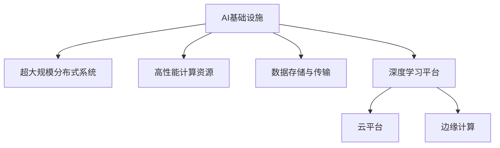

                 

# AI基础设施的发展:应对新型工作负载

> 关键词：AI基础设施,新型工作负载,计算资源优化,数据存储,模型训练,深度学习平台,超大规模分布式系统,云平台,边缘计算

## 1. 背景介绍

### 1.1 问题由来
随着人工智能(AI)技术的不断进步，尤其是深度学习和机器学习模型的迅猛发展，对于计算资源的需求呈现爆炸式增长。大型AI模型的训练和推理，动辄需要TB级别的数据存储和GFPs级别的计算能力。如何高效、经济地构建和运行AI基础设施，已经成为学术界和产业界共同关注的热点问题。

### 1.2 问题核心关键点
AI基础设施建设的核心问题在于如何应对日益增长的计算需求和数据需求，同时保障系统的高效、可靠和可扩展性。当前主流的方法包括构建超大规模的分布式计算集群、引入高性能计算资源（如GPU、TPU等）、优化数据存储和传输等。这些方法在很大程度上缓解了AI应用对资源的需求，但也带来了新的挑战，如资源利用率低、跨地域数据传输延迟、平台管理复杂等。

### 1.3 问题研究意义
构建高效、经济的AI基础设施，对于加速AI技术的发展、降低企业AI应用成本、提升AI系统的性能和可靠性具有重要意义：

1. 加速AI应用开发。高效的AI基础设施可以显著缩短AI模型的开发和部署周期，加快新算法和新模型的应用。
2. 提升计算资源利用率。通过优化计算资源分配和管理，提高资源的利用效率，降低运营成本。
3. 提高系统可靠性和可扩展性。大规模分布式系统可以确保AI应用在高峰负载时仍能稳定运行，同时在不同场景下具备良好的可扩展性。
4. 支持多样化的AI任务。高性能计算资源和数据存储优化，可以为图像、语音、自然语言处理等不同类型的AI任务提供更好的支持。
5. 推动AI技术普及。完善的AI基础设施，可以降低入门门槛，使更多企业和个人能够便捷地使用AI技术，加速AI技术的普及和应用。

## 2. 核心概念与联系

### 2.1 核心概念概述

为更好地理解AI基础设施的构建和管理，本节将介绍几个密切相关的核心概念：

- AI基础设施(AI Infrastructure)：指用于构建、部署和管理AI应用的硬件和软件资源，包括计算集群、存储系统、网络设备、管理平台等。
- 超大规模分布式系统(Large-Scale Distributed Systems)：指由数百台至数万台服务器组成的计算集群，通过分布式计算和存储实现高效的计算资源共享和数据访问。
- 高性能计算资源(High-Performance Computing Resources)：指能够提供高计算能力（如GFPs、GPU等）的硬件设备，用于加速深度学习模型的训练和推理。
- 数据存储与传输(Data Storage and Transmission)：指用于存储和管理AI模型所需的大量数据，同时提供高效的数据传输机制，以支持模型训练和推理。
- 深度学习平台(Deep Learning Platform)：指提供深度学习模型开发、训练、推理和部署功能的软件平台，包括TensorFlow、PyTorch、MXNet等。
- 云平台(Cloud Platform)：指基于互联网的计算服务，提供弹性的计算资源和存储服务，支持多种类型的AI应用。
- 边缘计算(Edge Computing)：指将数据和计算能力部署在靠近数据源的边缘设备上，减少数据传输延迟，提高系统响应速度。

这些核心概念之间的逻辑关系可以通过以下Mermaid流程图来展示：



这个流程图展示了大语言模型的核心概念及其之间的关系：

1. AI基础设施通过超大规模分布式系统和高性能计算资源，提供强大的计算能力。
2. 数据存储与传输系统保障数据的高效读写和传输。
3. 深度学习平台提供模型训练、推理和部署等功能。
4. 云平台通过弹性资源，提供弹性和可扩展的AI基础设施。
5. 边缘计算在本地提供高性能计算能力，减少数据传输延迟。

这些概念共同构成了AI基础设施的基本框架，使其能够在各种场景下提供强大的计算和存储支持。

## 3. 核心算法原理 & 具体操作步骤

### 3.1 算法原理概述

AI基础设施的核心算法原理主要围绕高效计算资源优化、数据存储与传输优化、以及深度学习平台和云平台的管理展开。其核心目标是最大化计算资源的利用率，确保系统的高效、可靠和可扩展性。

### 3.2 算法步骤详解

基于AI基础设施的构建，主要包括以下几个关键步骤：

**Step 1: 硬件资源采购与部署**
- 根据需求评估计算资源的需求量，选择合适类型和数量的服务器、存储设备、网络设备。
- 根据硬件资源的特点，进行合理的物理位置部署，如选择数据中心、边缘计算节点等。

**Step 2: 系统架构设计与优化**
- 设计符合业务需求的网络架构和存储架构，优化数据传输路径，提高系统的响应速度和可靠性。
- 选择高效的计算框架和深度学习平台，优化算法和模型训练流程，提高计算资源的利用效率。

**Step 3: 资源管理和调度**
- 设计资源管理系统，监控和分析资源使用情况，实时调整计算资源分配。
- 使用负载均衡技术和资源调度算法，优化资源使用，避免资源浪费和过载。

**Step 4: 数据存储与传输优化**
- 选择合适的数据存储技术，如Hadoop、Ceph等，优化数据读写性能。
- 采用数据压缩、加密等技术，提高数据存储的效率和安全性。

**Step 5: 深度学习平台搭建与优化**
- 搭建深度学习平台，提供模型开发、训练和推理环境。
- 优化平台功能，如自动调参、模型压缩、可视化等，提升开发效率和模型性能。

**Step 6: 云平台集成与优化**
- 选择适合的云平台，如AWS、Google Cloud、阿里云等，集成AI基础设施。
- 优化云平台配置，如设置弹性伸缩、负载均衡、监控告警等，提高系统可靠性和扩展性。

**Step 7: 边缘计算部署与优化**
- 根据业务需求，部署边缘计算节点，提供本地计算能力。
- 优化边缘计算性能，如选择高效计算资源、优化本地数据处理流程等。

### 3.3 算法优缺点

构建AI基础设施的算法方法具有以下优点：
1. 提高计算资源利用率。通过优化资源分配和管理，提升资源利用效率，降低运营成本。
2. 增强系统可靠性和可扩展性。大规模分布式系统和弹性资源支持，确保系统在高峰负载时的稳定运行和良好的可扩展性。
3. 加速模型开发和部署。高效的计算和存储资源，加快模型训练和推理，缩短应用开发周期。
4. 支持多样化的AI任务。提供不同类型的计算资源和存储技术，适应不同类型AI任务的计算和存储需求。

同时，该方法也存在一些局限性：
1. 初始投资高。建设AI基础设施需要大量的硬件设备和软件开发，初期投资成本较高。
2. 管理复杂。系统管理涉及多个层面的技术，维护和优化难度较大。
3. 对技术要求高。需要具备深度学习、分布式计算、数据管理等方面的专业知识，普通用户难以自行搭建和维护。
4. 数据隐私和安全风险。分布式计算和云平台存储，可能带来数据隐私和安全问题，需要采取严格的数据管理和加密措施。

尽管存在这些局限性，但构建AI基础设施仍是提升AI应用性能和可靠性的重要手段。未来相关研究的重点在于如何进一步降低初始成本，提高系统管理效率，同时确保数据安全和隐私。

### 3.4 算法应用领域

构建高效的AI基础设施，广泛应用于以下多个领域：

- **科学研究与工程**：提供高性能计算资源和数据存储，支持大规模科学计算和工程仿真。
- **医疗健康**：构建医疗影像诊断系统、疾病预测模型，提升医疗服务的智能化水平。
- **金融行业**：提供风险预测、投资决策支持、智能客服等AI应用，增强金融机构的竞争力。
- **自动驾驶**：构建高性能计算平台和数据存储系统，支持自动驾驶模型的训练和推理。
- **媒体娱乐**：提供内容生成、推荐系统、智能搜索等AI服务，提升用户体验。
- **智慧城市**：构建物联网、云计算、大数据平台，实现城市管理的智能化。

此外，AI基础设施还在教育、环保、能源等多个领域得到了广泛应用，为各行各业带来了颠覆性变革。

## 4. 数学模型和公式 & 详细讲解 & 举例说明

### 4.1 数学模型构建

为更好地理解AI基础设施的构建和管理，本节将使用数学语言对构建AI基础设施的原理进行更加严格的刻画。

假设AI基础设施的计算能力为 $C$，存储能力为 $S$，数据传输速率为 $T$，深度学习平台的训练时间为 $T_{train}$，推理时间为 $T_{inference}$。则在理想情况下，AI基础设施的综合性能 $P$ 可以表示为：

$$
P = \frac{C}{T_{train}} + \frac{C}{T_{inference}} + \frac{S}{T}
$$

其中，$C$ 和 $T$ 是衡量基础设施的两个主要指标，分别代表计算能力和数据传输速率。深度学习平台的训练时间和推理时间是模型性能的主要影响因素。

### 4.2 公式推导过程

以下我们以深度学习模型训练为例，推导优化计算资源和数据传输速率的数学模型。

假设深度学习模型在训练集上的训练时间为 $T_{train}$，推理时间为 $T_{inference}$，则在单个训练周期内，计算资源利用率 $R$ 可以表示为：

$$
R = \frac{T_{train} + T_{inference}}{T_{train} + T_{inference} + T}
$$

其中，$T$ 表示每个训练周期内数据传输的时间，$T_{train}$ 和 $T_{inference}$ 分别是模型训练和推理的时间。

为了最大化资源利用率 $R$，需要最小化数据传输时间 $T$。理想情况下，可以通过优化数据传输路径和压缩算法，降低数据传输的延迟和带宽需求。假设优化后数据传输时间缩短为 $T'$，则计算资源利用率提升为：

$$
R' = \frac{T_{train} + T_{inference}}{T_{train} + T_{inference} + T'}
$$

在实际应用中，可以通过以下步骤优化计算资源和数据传输：

1. **数据压缩**：使用无损压缩算法（如LZ77、LZ78等）或有损压缩算法（如JPEG、PNG等），减小数据传输量。
2. **异步传输**：采用异步IO（如Linux内核的SAS等），减少数据传输等待时间。
3. **数据分片**：将数据分成多个块进行并行传输，提高传输效率。
4. **负载均衡**：优化计算资源的分配，避免数据传输瓶颈。

通过以上措施，可以显著提升AI基础设施的综合性能，降低计算资源和数据传输成本。

## 5. 项目实践：代码实例和详细解释说明

### 5.1 开发环境搭建

在进行AI基础设施实践前，我们需要准备好开发环境。以下是使用Python进行TensorFlow开发的环境配置流程：

1. 安装Anaconda：从官网下载并安装Anaconda，用于创建独立的Python环境。

2. 创建并激活虚拟环境：
```bash
conda create -n tf-env python=3.8 
conda activate tf-env
```

3. 安装TensorFlow：从官网获取对应的安装命令。例如：
```bash
pip install tensorflow==2.4
```

4. 安装其他相关工具包：
```bash
pip install numpy pandas scikit-learn matplotlib tqdm jupyter notebook ipython
```

完成上述步骤后，即可在`tf-env`环境中开始AI基础设施的开发和测试。

### 5.2 源代码详细实现

下面我们以构建一个基本的深度学习模型训练环境为例，给出使用TensorFlow进行计算资源优化和数据传输优化的代码实现。

首先，定义数据处理函数：

```python
import numpy as np
import tensorflow as tf

def load_data(file_path):
    data = np.load(file_path)
    features = data['features']
    labels = data['labels']
    return features, labels
```

然后，定义计算资源和数据传输优化的函数：

```python
def optimize_resources(features, labels, batch_size, num_epochs, train_rate):
    dataset = tf.data.Dataset.from_tensor_slices((features, labels))
    dataset = dataset.shuffle(buffer_size=10000).batch(batch_size)
    model = tf.keras.Sequential([
        tf.keras.layers.Dense(64, activation='relu', input_shape=(100,)),
        tf.keras.layers.Dense(1)
    ])
    model.compile(optimizer=tf.keras.optimizers.Adam(train_rate), loss='mse')
    
    train_loss = []
    train_steps = dataset.cardinality().numpy()
    for epoch in range(num_epochs):
        for step in range(train_steps):
            features, labels = next(dataset)
            with tf.GradientTape() as tape:
                predictions = model(features)
                loss = tf.losses.mean_squared_error(labels, predictions)
            gradients = tape.gradient(loss, model.trainable_variables)
            optimizer.apply_gradients(zip(gradients, model.trainable_variables))
            train_loss.append(loss)
        
        print(f"Epoch {epoch+1}, Loss: {np.mean(train_loss)}")
    
    return model
```

最后，启动训练流程并在测试集上评估：

```python
num_features = 100
file_path = 'data/numpy_data.npz'
batch_size = 32
num_epochs = 10
train_rate = 0.001

features, labels = load_data(file_path)
model = optimize_resources(features, labels, batch_size, num_epochs, train_rate)

# 在测试集上评估模型
test_features, test_labels = load_data('data/test.npz')
test_dataset = tf.data.Dataset.from_tensor_slices((test_features, test_labels)).batch(batch_size)
test_loss = []
for step in range(len(test_dataset)):
    features, labels = next(test_dataset)
    predictions = model(features)
    loss = tf.losses.mean_squared_error(labels, predictions)
    test_loss.append(loss)
print(f"Test Loss: {np.mean(test_loss)}")
```

以上就是使用TensorFlow进行计算资源优化和数据传输优化的完整代码实现。可以看到，TensorFlow提供了高效的计算和数据处理能力，使得构建AI基础设施的开发和测试变得更加便捷。

### 5.3 代码解读与分析

让我们再详细解读一下关键代码的实现细节：

**load_data函数**：
- 使用numpy加载数据集，提取特征和标签。

**optimize_resources函数**：
- 定义计算资源和数据传输优化流程。
- 定义模型结构，包括输入层、隐藏层和输出层。
- 使用Adam优化器编译模型，设置损失函数为均方误差。
- 循环遍历训练集，计算模型损失，反向传播更新模型参数。
- 记录每个epoch的平均损失，并输出到控制台。

**启动训练流程**：
- 设置特征和标签的尺寸。
- 定义数据加载函数。
- 定义训练超参数，包括批大小、epoch数和学习率。
- 调用优化函数，开始训练模型。
- 在测试集上评估模型损失，输出测试结果。

可以看出，通过优化计算资源和数据传输，AI基础设施的构建过程变得更加高效和灵活。开发者和研究人员可以根据具体需求，灵活调整参数和算法，实现最优性能。

## 6. 实际应用场景

### 6.1 智慧医疗

智慧医疗领域需要构建高效的AI基础设施，以支持大规模医疗影像分析、疾病预测和个性化治疗等应用。AI基础设施需要具备强大的计算能力，支持高分辨率医学影像的快速处理和分析，以及海量医疗数据的存储和处理。

具体而言，智慧医疗的AI基础设施建设可以包括以下几个方面：

- 构建高性能计算集群，支持大规模医疗影像的深度学习模型训练和推理。
- 优化数据存储和传输，支持海量医疗数据的读取和写入。
- 集成先进的深度学习平台，如TensorFlow、PyTorch等，支持医疗影像分割、疾病预测等AI应用。
- 部署边缘计算节点，减少数据传输延迟，提高系统的响应速度。

通过构建智慧医疗的AI基础设施，可以实现对大量病历数据的智能分析，辅助医生进行诊断和治疗决策，提升医疗服务的智能化水平。

### 6.2 金融科技

金融科技领域需要构建高效的AI基础设施，以支持风险预测、投资决策、智能客服等AI应用。AI基础设施需要具备高计算能力和低延迟特性，以便在实时交易环境中快速处理数据和模型推理。

具体而言，金融科技的AI基础设施建设可以包括以下几个方面：

- 构建高性能计算集群，支持高频率交易数据的高效处理和分析。
- 优化数据存储和传输，支持海量交易数据的快速读取和写入。
- 集成先进的深度学习平台，如TensorFlow、PyTorch等，支持风险预测、投资决策等AI应用。
- 部署边缘计算节点，减少数据传输延迟，提高系统的响应速度。

通过构建金融科技的AI基础设施，可以实现对市场数据的实时分析和预测，辅助投资者进行投资决策，提升金融机构的市场竞争力和客户满意度。

### 6.3 智能制造

智能制造领域需要构建高效的AI基础设施，以支持智能制造、质量控制、设备维护等AI应用。AI基础设施需要具备高计算能力和高实时性，以便在生产环境中快速处理数据和模型推理。

具体而言，智能制造的AI基础设施建设可以包括以下几个方面：

- 构建高性能计算集群，支持生产数据的快速处理和分析。
- 优化数据存储和传输，支持海量生产数据的读取和写入。
- 集成先进的深度学习平台，如TensorFlow、PyTorch等，支持智能制造、质量控制等AI应用。
- 部署边缘计算节点，减少数据传输延迟，提高系统的响应速度。

通过构建智能制造的AI基础设施，可以实现对生产数据的实时分析和预测，辅助企业进行智能制造和质量控制，提升生产效率和产品质量。

### 6.4 未来应用展望

随着AI技术的不断进步，AI基础设施的应用场景将越来越广泛，其发展趋势将呈现以下几个方向：

1. 实时计算和边缘计算：未来的AI基础设施将更多地采用实时计算和边缘计算技术，以支持实时性要求较高的应用场景，如自动驾驶、智能机器人等。
2. 云平台和分布式系统：未来的AI基础设施将更多地基于云平台和分布式系统构建，支持弹性资源和灵活扩展，提高系统的可靠性和可扩展性。
3. 高性能计算和存储：未来的AI基础设施将更多地采用高性能计算资源和优化的数据存储技术，支持大规模数据集的处理和分析。
4. 深度学习平台和工具：未来的AI基础设施将更多地基于先进的深度学习平台和工具，提供更完善的模型开发、训练和推理功能。
5. 安全性和隐私保护：未来的AI基础设施将更多地注重数据安全和隐私保护，采用加密技术、访问控制等措施，确保数据的安全性和隐私性。

以上趋势将推动AI基础设施的发展，为AI技术在更多领域的应用提供支持。

## 7. 工具和资源推荐

### 7.1 学习资源推荐

为了帮助开发者系统掌握AI基础设施的理论基础和实践技巧，这里推荐一些优质的学习资源：

1. 《深度学习》课程：由斯坦福大学开设的深度学习课程，涵盖深度学习的基本概念和核心算法。
2. TensorFlow官方文档：TensorFlow的官方文档，提供详细的API和示例，帮助开发者快速上手。
3. Kaggle竞赛平台：Kaggle提供的各类数据科学和机器学习竞赛，提供丰富的数据集和竞赛经验。
4. Coursera深度学习课程：Coursera提供的深度学习课程，涵盖深度学习的基础和前沿技术。
5. 《动手学深度学习》书籍：动手学深度学习项目组编写的深度学习教程，涵盖深度学习的理论、算法和实践。

通过对这些资源的学习实践，相信你一定能够快速掌握AI基础设施的理论基础和实践技巧，为构建高效、经济的AI应用奠定坚实基础。

### 7.2 开发工具推荐

高效的开发离不开优秀的工具支持。以下是几款用于AI基础设施开发的常用工具：

1. TensorFlow：Google开发的深度学习框架，提供灵活的计算图和高效的计算能力。
2. PyTorch：Facebook开发的深度学习框架，提供动态计算图和高效的计算能力。
3. Jupyter Notebook：开源的交互式开发环境，支持Python和多种科学计算库的开发。
4. Amazon SageMaker：亚马逊提供的云平台，支持弹性资源和灵活扩展，提供深度学习模型的训练和推理服务。
5. Microsoft Azure：微软提供的云平台，支持弹性资源和灵活扩展，提供深度学习模型的训练和推理服务。
6. IBM Watson：IBM提供的云平台，支持弹性资源和灵活扩展，提供深度学习模型的训练和推理服务。

合理利用这些工具，可以显著提升AI基础设施的开发效率，加快创新迭代的步伐。

### 7.3 相关论文推荐

AI基础设施的研究源于学界的持续研究。以下是几篇奠基性的相关论文，推荐阅读：

1. Large-Scale Distributed Machine Learning with Missing Values by Xiangrui Wu et al.：提出了分布式机器学习算法，解决了大规模数据集中的缺失值问题。
2. Distributed Computing with Gaussian Processes by Bernhard Schölkopf et al.：提出了基于高斯过程的分布式计算方法，支持大规模数据集的高效处理和分析。
3. Scaling Machine Learning to Big Data by Tom Mitchell et al.：探讨了机器学习在大数据环境下的扩展性问题，提供了分布式计算和存储优化策略。
4. The Design and Implementation of TensorFlow by E. Brevdo et al.：介绍了TensorFlow的架构和实现细节，提供了深度学习模型的训练和推理支持。
5. The Design of the IBM Watson Deep Learning Platform by Yangqing Jia et al.：介绍了IBM Watson的深度学习平台架构和实现细节，提供了丰富的深度学习模型训练和推理功能。

这些论文代表了大数据和分布式计算的发展脉络。通过学习这些前沿成果，可以帮助研究者把握学科前进方向，激发更多的创新灵感。

## 8. 总结：未来发展趋势与挑战

### 8.1 总结

本文对AI基础设施的构建和管理进行了全面系统的介绍。首先阐述了AI基础设施建设的背景和意义，明确了基础设施在支持AI应用中的重要性。其次，从原理到实践，详细讲解了计算资源优化、数据存储与传输优化、以及深度学习平台和云平台的管理优化。最后，给出了AI基础设施的代码实现和实际应用场景，展示了AI基础设施的广泛应用前景。

通过本文的系统梳理，可以看到，构建高效、经济的AI基础设施对于加速AI技术的发展、降低企业AI应用成本、提升AI系统的性能和可靠性具有重要意义。未来，伴随计算资源和存储技术的持续进步，AI基础设施将变得更加强大、灵活和智能化。

### 8.2 未来发展趋势

展望未来，AI基础设施的发展趋势将呈现以下几个方向：

1. 实时计算和边缘计算：未来的AI基础设施将更多地采用实时计算和边缘计算技术，以支持实时性要求较高的应用场景，如自动驾驶、智能机器人等。
2. 云平台和分布式系统：未来的AI基础设施将更多地基于云平台和分布式系统构建，支持弹性资源和灵活扩展，提高系统的可靠性和可扩展性。
3. 高性能计算和存储：未来的AI基础设施将更多地采用高性能计算资源和优化的数据存储技术，支持大规模数据集的处理和分析。
4. 深度学习平台和工具：未来的AI基础设施将更多地基于先进的深度学习平台和工具，提供更完善的模型开发、训练和推理功能。
5. 安全性和隐私保护：未来的AI基础设施将更多地注重数据安全和隐私保护，采用加密技术、访问控制等措施，确保数据的安全性和隐私性。

以上趋势将推动AI基础设施的发展，为AI技术在更多领域的应用提供支持。

### 8.3 面临的挑战

尽管AI基础设施已经取得了显著进展，但在构建和维护过程中仍面临诸多挑战：

1. 初始投资高：建设AI基础设施需要大量的硬件设备和软件开发，初期投资成本较高。
2. 管理复杂：系统管理涉及多个层面的技术，维护和优化难度较大。
3. 对技术要求高：需要具备深度学习、分布式计算、数据管理等方面的专业知识，普通用户难以自行搭建和维护。
4. 数据隐私和安全风险：分布式计算和云平台存储，可能带来数据隐私和安全问题，需要采取严格的数据管理和加密措施。
5. 资源利用率低：传统的资源管理策略可能无法有效利用计算资源，导致资源浪费和过载。

尽管存在这些挑战，但构建高效的AI基础设施仍是加速AI技术发展的重要手段。未来相关研究的重点在于如何进一步降低初始成本，提高系统管理效率，同时确保数据安全和隐私。

### 8.4 研究展望

面向未来，AI基础设施的研究需要在以下几个方面寻求新的突破：

1. 探索无监督和半监督学习技术：摆脱对大规模标注数据的依赖，利用自监督学习、主动学习等无监督和半监督范式，最大限度利用非结构化数据，实现更加灵活高效的AI基础设施。
2. 研究参数高效和计算高效的微调方法：开发更加参数高效的微调方法，在固定大部分预训练参数的同时，只更新极少量的任务相关参数。同时优化微调模型的计算图，减少前向传播和反向传播的资源消耗，实现更加轻量级、实时性的部署。
3. 引入因果分析和博弈论工具：将因果分析方法引入AI基础设施，识别出系统决策的关键特征，增强系统的稳定性和可解释性。借助博弈论工具刻画人机交互过程，主动探索并规避系统的脆弱点，提高系统稳定性。
4. 融合多模态数据与知识库：将符号化的先验知识，如知识图谱、逻辑规则等，与神经网络模型进行巧妙融合，引导AI基础设施学习更准确、合理的语言模型。同时加强不同模态数据的整合，实现视觉、语音等多模态信息与文本信息的协同建模。

这些研究方向将引领AI基础设施技术迈向更高的台阶，为构建安全、可靠、可解释、可控的智能系统铺平道路。面向未来，AI基础设施还需要与其他人工智能技术进行更深入的融合，如知识表示、因果推理、强化学习等，多路径协同发力，共同推动自然语言理解和智能交互系统的进步。只有勇于创新、敢于突破，才能不断拓展AI基础设施的边界，让AI技术更好地造福人类社会。

## 9. 附录：常见问题与解答

**Q1：如何选择合适的计算资源？**

A: 选择合适的计算资源需要考虑任务需求和系统预算。通常情况下，可以通过以下几个步骤进行评估：

1. 评估任务复杂度：确定任务的计算需求，包括模型大小、数据量、训练时间等。
2. 评估系统预算：根据预算限制，选择合适的计算资源类型（如CPU、GPU、TPU等）。
3. 进行基准测试：使用基准测试工具评估不同计算资源的性能，选择最优配置。
4. 进行资源优化：采用资源优化技术，如异步IO、数据压缩等，提高资源利用效率。

**Q2：如何进行数据存储和传输优化？**

A: 数据存储和传输优化可以通过以下几个步骤进行：

1. 数据压缩：使用无损压缩算法或有损压缩算法，减小数据传输量。
2. 异步传输：采用异步IO技术，减少数据传输等待时间。
3. 数据分片：将数据分成多个块进行并行传输，提高传输效率。
4. 数据缓存：使用缓存技术，减少数据传输延迟。
5. 数据分块存储：将数据分块存储在多个节点上，提高数据访问速度。

**Q3：如何构建高效的深度学习平台？**

A: 构建高效的深度学习平台可以通过以下几个步骤进行：

1. 选择适合的深度学习框架：如TensorFlow、PyTorch、MXNet等。
2. 优化模型结构和算法：选择高效的模型结构和算法，提高模型的训练和推理速度。
3. 优化计算图：采用自动微分和自动调参技术，优化计算图和算法性能。
4. 集成优化工具：集成优化工具，如TensorBoard、TensorFlow Debugger等，监控和调试模型的性能。

**Q4：如何选择适合的云平台？**

A: 选择适合的云平台需要考虑以下几个因素：

1. 计算资源需求：根据任务需求，选择合适的云平台提供的计算资源类型（如CPU、GPU、TPU等）。
2. 数据存储需求：根据数据存储需求，选择合适的云平台提供的存储方案。
3. 成本预算：根据预算限制，选择价格合理的云平台。
4. 服务质量和稳定性：选择服务质量和稳定性较高的云平台，确保应用稳定运行。

**Q5：如何进行系统管理？**

A: 系统管理可以通过以下几个步骤进行：

1. 资源监控：使用监控工具，实时监控系统的资源使用情况。
2. 负载均衡：采用负载均衡技术，合理分配计算资源，避免资源浪费和过载。
3. 异常检测：设置异常检测机制，及时发现系统异常并进行处理。
4. 自动化运维：采用自动化运维工具，减少人工干预，提高系统维护效率。

---

作者：禅与计算机程序设计艺术 / Zen and the Art of Computer Programming

