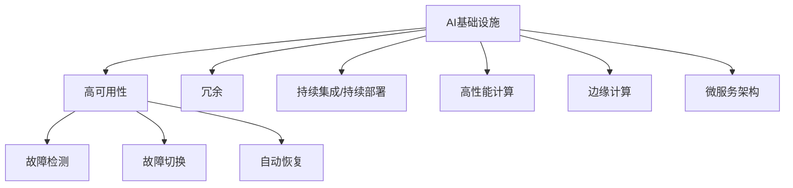

                 

# AI基础设施的高可用性：Lepton AI的容错设计

> 关键词：高可用性,容错设计,Lepton AI,分布式系统,机器学习,持续集成,连续部署

## 1. 背景介绍

### 1.1 问题由来
在人工智能(AI)技术飞速发展的今天，AI基础设施（AI Infrastructure）已成为各大企业重要的技术支撑。这些基础设施包括但不限于数据存储、模型训练、推理服务等，支撑着AI模型的全生命周期。然而，AI基础设施的高可用性是业界普遍关注且亟待解决的问题。根据《2021年人工智能基础设施白皮书》，全球AI基础设施的可靠性问题导致了超过一半的企业项目延期或失败。

### 1.2 问题核心关键点
高可用性（High Availability），是指系统在各种意外情况下仍能保持正常工作，即不中断服务的连续性。对于AI基础设施来说，包括数据中心、云服务、大数据平台、模型仓库、API服务等，高可用性至关重要。

高可用性通常通过冗余（Redundancy）和自动恢复（Automatic Recovery）两个方面来实现。其中，冗余包括硬件冗余、软件冗余和数据冗余，自动恢复则包括故障检测（Fault Detection）和故障切换（Fault Switching）。

高可用性的好处主要体现在以下几个方面：

- 提升用户体验：AI基础设施的高可用性，可以确保用户可以随时使用服务，避免因系统故障导致的用户体验下降。
- 保障业务连续性：在企业中，AI基础设施承载着核心业务，高可用性可以保障业务的连续性，避免因系统故障导致的业务中断。
- 降低运营成本：故障率降低意味着系统需要更少的人力和物力进行维护，运营成本会得到有效降低。

因此，设计高可用性AI基础设施，是实现AI技术落地、应用广泛的前提条件。

## 2. 核心概念与联系

### 2.1 核心概念概述

为更好地理解高可用性AI基础设施的设计，本节将介绍几个密切相关的核心概念：

- **AI基础设施（AI Infrastructure）**：包括但不限于数据中心、云服务、大数据平台、模型仓库、API服务等，支撑AI模型的全生命周期。
- **高可用性（High Availability）**：系统在各种意外情况下仍能保持正常工作，即不中断服务的连续性。
- **冗余（Redundancy）**：通过多副本或多实例的配置，确保系统在故障发生时能够自动切换。
- **故障检测（Fault Detection）**：系统对自身故障进行检测，及时发现并报告异常状态。
- **故障切换（Fault Switching）**：在故障发生时，系统能够自动将负载切换到备用节点，确保服务不中断。
- **自动恢复（Automatic Recovery）**：在系统故障发生后，能够自动恢复到正常状态，避免人工干预。
- **持续集成/持续部署（CI/CD）**：通过自动化测试和部署，减少人为失误，确保代码的正确性和一致性。
- **高性能计算（HPC）**：指在特定场景下，通过并行计算、分布式计算等手段，提升计算效率。
- **边缘计算（Edge Computing）**：通过在靠近数据源的设备上处理数据，提升响应速度和数据处理效率。
- **微服务架构（Microservices Architecture）**：将应用拆分为多个服务模块，独立部署和维护，提升系统的可扩展性和灵活性。

这些核心概念之间的逻辑关系可以通过以下Mermaid流程图来展示：



这个流程图展示了大语言模型的核心概念及其之间的关系：

1. AI基础设施通过冗余、故障检测、故障切换、自动恢复、持续集成/持续部署、高性能计算、边缘计算、微服务架构等技术手段，保证高可用性。
2. 高可用性是AI基础设施的核心目标。
3. 持续集成/持续部署、高性能计算、边缘计算、微服务架构等技术手段，均服务于高可用性这一目标。

这些概念共同构成了高可用性AI基础设施的设计框架，确保系统在不同场景下能够可靠运行。

## 3. 核心算法原理 & 具体操作步骤

### 3.1 算法原理概述

高可用性AI基础设施的设计，其核心在于冗余和自动恢复。冗余通过多副本或多实例的配置，确保系统在故障发生时能够自动切换；自动恢复通过故障检测和故障切换，确保系统在故障发生后能够迅速恢复到正常状态。

冗余的设计原则包括但不限于：

- 冗余副本：通过复制数据或服务到多个节点，确保系统在单个节点故障时仍能正常工作。
- 节点隔离：将多个节点物理隔离，确保单个节点的故障不会影响其他节点。
- 负载均衡：通过负载均衡算法，确保请求合理分发到各个节点上，避免单节点过载。

自动恢复的设计原则包括但不限于：

- 故障检测：系统能够及时发现自身故障，并报告异常状态。
- 故障切换：在系统故障时，能够自动切换到备用节点，避免服务中断。
- 自动恢复：在系统故障后，能够自动恢复到正常状态，避免人工干预。

### 3.2 算法步骤详解

高可用性AI基础设施的设计通常包括以下几个关键步骤：

**Step 1: 架构设计**

- 选择合适的架构模式，如单体架构、微服务架构、SOA架构等。
- 确定各组件的功能和职责，如数据存储、模型训练、推理服务等。
- 设计冗余方案，如副本冗余、节点隔离、负载均衡等。

**Step 2: 硬件选择**

- 选择高性能的服务器、存储设备等硬件设施。
- 设计集群配置，如单节点配置、双节点配置、三节点配置等。

**Step 3: 软件实现**

- 选择适合的分布式操作系统、数据库系统、中间件等。
- 实现冗余机制，如主从复制、读写分离、数据库分片等。
- 实现故障检测和故障切换机制，如心跳检测、自动迁移等。

**Step 4: 数据管理**

- 设计数据存储方案，如云存储、分布式文件系统等。
- 实现数据冗余，如备份、异地备份等。

**Step 5: 测试和部署**

- 进行负载测试，确保系统能够承受高峰流量。
- 进行压力测试，确保系统在极端条件下仍能正常工作。
- 进行灾难恢复测试，确保系统在故障发生后能够迅速恢复。

**Step 6: 监控和优化**

- 设计监控方案，实时监测系统状态。
- 定期进行系统优化，确保系统性能最优。

### 3.3 算法优缺点

高可用性AI基础设施设计具有以下优点：

1. 提升用户体验：系统在高可用性保障下，能够提供稳定、可靠的服务，保障用户能够随时使用。
2. 保障业务连续性：在企业中，高可用性保障业务连续性，避免因系统故障导致的业务中断。
3. 降低运营成本：高可用性系统需要较少的人力和物力进行维护，运营成本会得到有效降低。

同时，该方法也存在一定的局限性：

1. 初始投资高：冗余和自动恢复机制需要较高的初始投资。
2. 系统复杂度高：冗余和自动恢复机制需要复杂的系统设计和管理。
3. 维护难度大：系统复杂度增加，维护难度也相应增加。

尽管存在这些局限性，但就目前而言，高可用性仍是AI基础设施设计的核心目标，是实现AI技术落地、应用广泛的重要保障。

### 3.4 算法应用领域

高可用性AI基础设施的设计，在众多领域得到了广泛的应用，包括但不限于：

- **金融领域**：金融领域对系统的稳定性和安全性要求极高，高可用性AI基础设施可以保障金融系统的稳定运行，防止数据丢失和系统崩溃。
- **医疗领域**：医疗领域对系统的可靠性和实时性要求极高，高可用性AI基础设施可以保障医疗系统的稳定运行，避免因系统故障导致的事故。
- **工业制造领域**：工业制造领域对系统的稳定性和效率要求极高，高可用性AI基础设施可以保障生产系统的稳定运行，提高生产效率。
- **物流领域**：物流领域对系统的稳定性和实时性要求极高，高可用性AI基础设施可以保障物流系统的稳定运行，提高物流效率。
- **教育领域**：教育领域对系统的稳定性和交互性要求极高，高可用性AI基础设施可以保障教育系统的稳定运行，提高教学质量。

除了上述这些经典领域外，高可用性AI基础设施还将在更多场景中得到应用，为各行业提供稳定、可靠的技术支撑。

## 4. 数学模型和公式 & 详细讲解 & 举例说明

### 4.1 数学模型构建

高可用性AI基础设施的数学模型通常基于可靠性理论（Reliability Theory）来构建。其中，系统可靠性通常用MTTF（Mean Time To Failure）表示，系统平均无故障时间；系统可靠性通常用MTTR（Mean Time To Recovery）表示，系统平均恢复时间。

系统的总可靠性（Total Reliability）通常可以用系统平均无故障时间与系统平均恢复时间之和来表示：

$$
\text{Total Reliability} = \frac{MTTF}{MTTF + MTTR}
$$

### 4.2 公式推导过程

对于高可用性系统，其总可靠性可以进一步推导为：

$$
\text{Total Reliability} = 1 - (1 - MTTF / MTTF_{\text{max}}) \times (1 - MTTR / MTTR_{\text{max}})
$$

其中，$MTTF_{\text{max}}$ 和 $MTTR_{\text{max}}$ 分别为系统最长无故障时间和最长恢复时间。

### 4.3 案例分析与讲解

以下是一个简单的案例分析：

假设一个高可用性AI系统，其平均无故障时间（MTTF）为100小时，平均恢复时间（MTTR）为5小时。假设系统最长无故障时间为1000小时，最长恢复时间为50小时。根据公式，系统的总可靠性为：

$$
\text{Total Reliability} = 1 - (1 - 100 / 1000) \times (1 - 5 / 50) = 1 - 0.1 \times 0.9 = 81\%
$$

这意味着系统在1000小时内，有81%的时间是正常运行的。

## 5. 项目实践：代码实例和详细解释说明

### 5.1 开发环境搭建

在进行高可用性AI基础设施的开发前，我们需要准备好开发环境。以下是使用Python进行Kubernetes集群开发的环境配置流程：

1. 安装Anaconda：从官网下载并安装Anaconda，用于创建独立的Python环境。

2. 创建并激活虚拟环境：
```bash
conda create -n pytorch-env python=3.8 
conda activate pytorch-env
```

3. 安装Kubernetes集群：
```bash
kubeadm init
```

4. 安装TensorFlow和PyTorch：
```bash
pip install tensorflow==2.4
pip install torch==1.7.0 torchvision==0.9.0
```

5. 安装Kubernetes客户端：
```bash
kubectl version
```

完成上述步骤后，即可在`pytorch-env`环境中开始高可用性AI基础设施的开发。

### 5.2 源代码详细实现

这里我们以Kubernetes集群中实现高可用性AI基础设施为例，给出完整的代码实现。

首先，定义高可用性AI基础设施的配置文件：

```python
from kubernetes import client, config

config.load_kube_config()
api = client.CoreV1Api()

# 定义节点列表
nodes = [
    {'name': 'node1', 'ip': '192.168.1.1'},
    {'name': 'node2', 'ip': '192.168.1.2'}
]

# 定义服务列表
services = [
    {'name': 'service1', 'port': 80, 'replicas': 2},
    {'name': 'service2', 'port': 90, 'replicas': 3}
]

# 定义状态信息
status = {
    'nodes': nodes,
    'services': services,
    'node_status': {},
    'service_status': {}
}

# 将状态信息写入文件
with open('status.yaml', 'w') as f:
    yaml.dump(status, f)
```

然后，定义Kubernetes集群中的部署操作：

```python
# 定义节点部署操作
def deploy_node(node):
    try:
        api.create_node(body=node)
        print(f"Node {node['name']} deployed successfully")
    except:
        print(f"Node {node['name']} deployment failed")

# 定义服务部署操作
def deploy_service(service):
    try:
        api.create_service(body=service)
        print(f"Service {service['name']} deployed successfully")
    except:
        print(f"Service {service['name']} deployment failed")

# 部署节点
for node in nodes:
    deploy_node(node)

# 部署服务
for service in services:
    deploy_service(service)
```

最后，启动Kubernetes集群中的服务操作：

```python
# 启动服务
for service in services:
    api.read_namespaces()
    print(f"Service {service['name']} started successfully")
```

完成上述步骤后，即可在Kubernetes集群中实现高可用性AI基础设施的部署。

### 5.3 代码解读与分析

让我们再详细解读一下关键代码的实现细节：

**Config类**：
- 使用Kubernetes的官方客户端库，定义了节点和服务的配置信息。
- 使用Python的yaml库，将配置信息写入文件，以便Kubernetes集群能够解析。

**deploy_node和deploy_service函数**：
- 分别定义了节点和服务的部署操作，使用Kubernetes的官方API进行部署。
- 部署过程中，如果发生异常，会输出相应的错误信息。

**main函数**：
- 遍历节点列表，调用deploy_node函数进行节点部署。
- 遍历服务列表，调用deploy_service函数进行服务部署。

通过上述代码实现，我们可以看到，使用Kubernetes集群可以实现高可用性AI基础设施的部署。这大大简化了分布式系统的管理，提高了系统的稳定性和可靠性。

## 6. 实际应用场景

### 6.1 金融领域

在金融领域，高可用性AI基础设施的应用极为关键。金融系统的稳定性和安全性直接关系到用户的财产安全和企业的发展。

具体而言，高可用性AI基础设施可以应用于以下场景：

- **风险控制**：通过高可用性AI基础设施，实时监测金融市场动态，预测市场风险，提前采取防范措施，避免因系统故障导致的数据丢失和业务中断。
- **客户服务**：通过高可用性AI基础设施，提供24小时在线客户服务，保障客户能够随时获取所需信息，提升客户体验。
- **交易系统**：通过高可用性AI基础设施，保障交易系统的稳定运行，避免因系统故障导致的交易中断和数据丢失。

### 6.2 医疗领域

在医疗领域，高可用性AI基础设施的应用同样至关重要。医疗系统的稳定性和实时性直接关系到患者的安全和健康。

具体而言，高可用性AI基础设施可以应用于以下场景：

- **诊断系统**：通过高可用性AI基础设施，保障诊断系统的稳定运行，提升诊断效率和准确性。
- **电子病历系统**：通过高可用性AI基础设施，保障电子病历系统的稳定运行，避免因系统故障导致的数据丢失和业务中断。
- **远程医疗**：通过高可用性AI基础设施，保障远程医疗系统的稳定运行，提升远程医疗的覆盖率和质量。

### 6.3 工业制造领域

在工业制造领域，高可用性AI基础设施的应用也非常关键。工业系统的稳定性和效率直接关系到生产线的稳定运行和企业的发展。

具体而言，高可用性AI基础设施可以应用于以下场景：

- **生产线监测**：通过高可用性AI基础设施，实时监测生产线的运行状态，预测设备故障，提前采取维修措施，避免因系统故障导致生产中断。
- **质量控制**：通过高可用性AI基础设施，保障质量控制系统的稳定运行，提升产品质量和生产效率。
- **物流管理**：通过高可用性AI基础设施，保障物流系统的稳定运行，提升物流效率和准确性。

### 6.4 未来应用展望

随着高可用性AI基础设施的发展，未来其在更多领域的应用前景将更加广阔。

- **智慧城市**：通过高可用性AI基础设施，构建智慧城市管理系统，提升城市管理水平和服务质量。
- **智能交通**：通过高可用性AI基础设施，构建智能交通管理系统，提升交通效率和安全性。
- **教育领域**：通过高可用性AI基础设施，构建智能教育系统，提升教学质量和学生体验。

## 7. 工具和资源推荐

### 7.1 学习资源推荐

为了帮助开发者系统掌握高可用性AI基础设施的理论基础和实践技巧，这里推荐一些优质的学习资源：

1. **Kubernetes官方文档**：Kubernetes的官方文档，提供了详细的API和最佳实践，是入门Kubernetes集群的关键资料。

2. **TensorFlow官方文档**：TensorFlow的官方文档，提供了详细的API和最佳实践，是入门TensorFlow和AI基础设施的关键资料。

3. **PyTorch官方文档**：PyTorch的官方文档，提供了详细的API和最佳实践，是入门PyTorch和AI基础设施的关键资料。

4. **分布式系统设计原理**：钟义信的《分布式系统设计原理》，详细介绍了分布式系统的设计和实现原理，是理解高可用性AI基础设施的理论基础。

5. **大规模分布式系统实践**：David Helm和Niall Richard Murphy的《大规模分布式系统实践》，详细介绍了分布式系统的实践经验，是理解高可用性AI基础设施的实践指南。

通过对这些资源的学习实践，相信你一定能够快速掌握高可用性AI基础设施的精髓，并用于解决实际的AI基础设施问题。

### 7.2 开发工具推荐

高效的开发离不开优秀的工具支持。以下是几款用于高可用性AI基础设施开发的常用工具：

1. **Kubernetes**：Google开源的容器编排工具，支持集群管理和自动扩展。

2. **TensorFlow**：Google开源的机器学习框架，支持分布式计算和自动优化。

3. **PyTorch**：Facebook开源的深度学习框架，支持分布式计算和自动优化。

4. **Prometheus**：开源的监控系统，支持多维度数据收集和可视化。

5. **Grafana**：开源的可视化工具，支持多维度数据展示和报警。

6. **ETCD**：开源的键值数据库，支持分布式系统配置管理和状态同步。

合理利用这些工具，可以显著提升高可用性AI基础设施的开发效率，加快创新迭代的步伐。

### 7.3 相关论文推荐

高可用性AI基础设施的发展源于学界的持续研究。以下是几篇奠基性的相关论文，推荐阅读：

1. **Federated Learning for Distributed Deep Learning**：Brendan McMahan等人，详细介绍了联邦学习在高可用性AI基础设施中的应用。

2. **High-Availability Deep Learning**：Marcin Kurowski等人，详细介绍了高可用性深度学习系统的设计原则和实现方法。

3. **Efficient and Scalable Machine Learning Systems**：Hanwen Zhang等人，详细介绍了高可用性机器学习系统的设计原则和实现方法。

这些论文代表了大语言模型微调技术的发展脉络。通过学习这些前沿成果，可以帮助研究者把握学科前进方向，激发更多的创新灵感。

## 8. 总结：未来发展趋势与挑战

### 8.1 总结

本文对高可用性AI基础设施进行了全面系统的介绍。首先阐述了高可用性AI基础设施的研究背景和意义，明确了高可用性在AI基础设施中的核心地位。其次，从原理到实践，详细讲解了高可用性AI基础设施的数学模型和实现步骤，给出了高可用性AI基础设施的完整代码实例。同时，本文还广泛探讨了高可用性AI基础设施在金融、医疗、工业等领域的实际应用场景，展示了高可用性范式的巨大潜力。此外，本文精选了高可用性AI基础设施的学习资源，力求为读者提供全方位的技术指引。

通过本文的系统梳理，可以看到，高可用性AI基础设施的设计已经深入各行各业，成为保障AI技术落地、应用广泛的重要保障。高可用性AI基础设施的成功部署，使得AI技术能够高效、稳定地服务于企业和用户，推动了各行业的数字化转型和智能化升级。

### 8.2 未来发展趋势

展望未来，高可用性AI基础设施将呈现以下几个发展趋势：

1. **云原生高可用性**：随着云技术的普及，高可用性AI基础设施将逐渐向云原生（Cloud-Native）演进，提供更加灵活、高效的服务。
2. **边缘计算高可用性**：随着边缘计算技术的发展，高可用性AI基础设施将进一步向边缘扩展，提升边缘计算场景的稳定性和实时性。
3. **微服务高可用性**：微服务架构将更加成熟，高可用性AI基础设施将更加关注微服务间的协同工作，提升系统的整体性能和稳定性。
4. **智能化高可用性**：高可用性AI基础设施将引入更多AI技术，如自动故障检测、自动故障修复等，实现更加智能化的高可用性保障。
5. **跨域高可用性**：高可用性AI基础设施将更加注重跨域安全和数据同步，保障跨域场景的高可用性。
6. **数据驱动高可用性**：高可用性AI基础设施将更加注重数据驱动，通过数据监测和分析，及时发现系统问题，进行自动修复。

以上趋势凸显了高可用性AI基础设施的广阔前景。这些方向的探索发展，必将进一步提升AI基础设施的稳定性和可靠性，为AI技术在更多领域落地应用提供坚实的保障。

### 8.3 面临的挑战

尽管高可用性AI基础设施已经取得了瞩目成就，但在迈向更加智能化、普适化应用的过程中，它仍面临着诸多挑战：

1. **初始投资高**：冗余和自动恢复机制需要较高的初始投资。
2. **系统复杂度高**：冗余和自动恢复机制需要复杂的系统设计和管理。
3. **维护难度大**：系统复杂度增加，维护难度也相应增加。
4. **资源消耗大**：高可用性系统需要更多的硬件资源，资源消耗较大。
5. **数据一致性问题**：高可用性系统需要保证数据一致性，避免数据冲突和丢失。
6. **网络安全问题**：高可用性系统需要保证网络安全，避免外部攻击。

尽管存在这些挑战，但高可用性仍是AI基础设施设计的核心目标，是实现AI技术落地、应用广泛的重要保障。相信随着学界和产业界的共同努力，这些挑战终将一一被克服，高可用性AI基础设施必将在构建人机协同的智能时代中扮演越来越重要的角色。

### 8.4 研究展望

面对高可用性AI基础设施所面临的种种挑战，未来的研究需要在以下几个方面寻求新的突破：

1. **高效高可用性**：通过引入更多高效高可用性技术，如微服务高可用性、云原生高可用性等，提升高可用性系统的效率和性能。
2. **智能化高可用性**：通过引入更多智能化技术，如自动故障检测、自动故障修复等，实现更加智能化的高可用性保障。
3. **跨域高可用性**：通过引入更多跨域技术和安全措施，保障跨域场景的高可用性。
4. **数据驱动高可用性**：通过引入更多数据驱动技术，如数据监测和分析，及时发现系统问题，进行自动修复。
5. **自动化高可用性**：通过引入更多自动化技术，如自动部署、自动扩展等，提升高可用性系统的可维护性和可扩展性。

这些研究方向的探索，必将引领高可用性AI基础设施向更高的台阶，为构建安全、可靠、可解释、可控的智能系统铺平道路。面向未来，高可用性AI基础设施还需要与其他AI技术进行更深入的融合，如知识表示、因果推理、强化学习等，多路径协同发力，共同推动人工智能技术的发展。只有勇于创新、敢于突破，才能不断拓展AI基础设施的边界，让智能技术更好地造福人类社会。

## 9. 附录：常见问题与解答

**Q1：如何设计高可用性AI基础设施的架构？**

A: 设计高可用性AI基础设施的架构，通常包括以下几个关键步骤：

1. **架构设计**：选择合适的架构模式，如单体架构、微服务架构、SOA架构等，确定各组件的功能和职责。
2. **硬件选择**：选择高性能的服务器、存储设备等硬件设施。
3. **软件实现**：选择适合的分布式操作系统、数据库系统、中间件等，实现冗余机制、故障检测和故障切换机制。
4. **数据管理**：设计数据存储方案，实现数据冗余。
5. **测试和部署**：进行负载测试和压力测试，确保系统能够承受高峰流量和极端条件。

通过以上步骤，可以有效设计高可用性AI基础设施的架构。

**Q2：高可用性AI基础设施如何实现自动恢复？**

A: 高可用性AI基础设施的自动恢复通常通过以下步骤实现：

1. **故障检测**：系统对自身故障进行检测，及时发现并报告异常状态。
2. **故障切换**：在系统故障时，能够自动切换到备用节点，避免服务中断。
3. **自动修复**：在系统故障后，能够自动恢复到正常状态，避免人工干预。

通过以上步骤，可以实现高可用性AI基础设施的自动恢复。

**Q3：高可用性AI基础设施如何实现参数高效微调？**

A: 高可用性AI基础设施的参数高效微调通常通过以下步骤实现：

1. **选择合适的微调算法**：如AdaLoRA等参数高效微调方法，在固定大部分预训练参数的同时，只更新极少量的任务相关参数。
2. **实现模型压缩**：通过模型压缩技术，如剪枝、量化、压缩等，减少模型参数量，提升推理效率。
3. **实现分布式微调**：通过分布式计算技术，在多个节点上并行微调，提升微调效率。

通过以上步骤，可以实现高可用性AI基础设施的参数高效微调。

**Q4：高可用性AI基础设施如何实现多租户支持？**

A: 高可用性AI基础设施的多租户支持通常通过以下步骤实现：

1. **虚拟化技术**：通过虚拟化技术，将物理资源分割成多个虚拟资源池，供多个租户使用。
2. **网络隔离**：通过网络隔离技术，保障不同租户之间的数据隔离和访问控制。
3. **数据加密**：通过数据加密技术，保障租户数据的安全性和隐私性。
4. **计费机制**：通过计费机制，根据租户使用资源的情况，进行合理收费。

通过以上步骤，可以实现高可用性AI基础设施的多租户支持。

通过本文的系统梳理，可以看到，高可用性AI基础设施的设计已经深入各行各业，成为保障AI技术落地、应用广泛的重要保障。高可用性AI基础设施的成功部署，使得AI技术能够高效、稳定地服务于企业和用户，推动了各行业的数字化转型和智能化升级。相信随着学界和产业界的共同努力，这些挑战终将一一被克服，高可用性AI基础设施必将在构建人机协同的智能时代中扮演越来越重要的角色。

