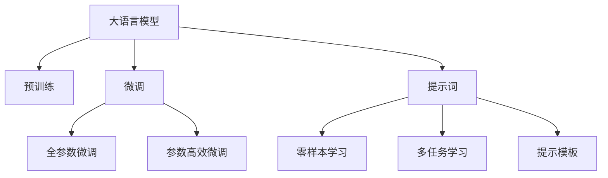
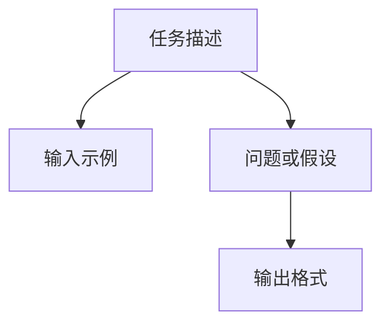

                 

# AI大模型Prompt提示词最佳实践：将复杂任务分解成小问题

> 关键词：AI大模型, Prompt提示词, 复杂任务分解, 小问题, 自然语言处理(NLP), 模型微调, 零样本学习, 多任务学习, 提示模板设计, 人工智能(ML)

## 1. 背景介绍

在人工智能领域，尤其是自然语言处理(NLP)领域，大语言模型如GPT、BERT等，凭借其强大的语言理解和生成能力，已经在问答、对话、摘要、翻译、情感分析等诸多任务上取得了令人瞩目的成就。然而，这些模型的高效性和泛化能力，往往需要依赖于大规模无标签数据的预训练。为了适应具体的应用场景，研究人员和工程师们普遍采取了一种基于监督学习的微调方法：**微调**。

微调（Fine-tuning）是指在预训练模型的基础上，使用下游任务的少量标注数据，通过有监督地训练来优化模型在该任务上的性能。尽管微调方法简单高效，能够显著提升模型在特定任务上的表现，但其也存在一定的局限性，特别是在处理复杂任务时，可能会遇到模型难以理解和响应的问题。为了克服这一挑战，研究人员提出了**提示词**（Prompt）的概念。

提示词是一种特殊的文本输入，通过对任务的详细描述，帮助大模型更好地理解并执行复杂的自然语言任务。提示词通常包含一些明确的指令、示例、问题或假设，引导模型进行推理和生成。这种技术不仅在零样本学习（Zero-shot Learning）中表现出色，也逐渐成为多任务学习（Multitask Learning）中不可或缺的一部分。

本文旨在深入探讨提示词在大模型中的应用，介绍如何通过设计合理的提示词，将复杂任务分解成小问题，提升大模型的执行效率和准确性。通过系统介绍提示词的最佳实践，希望能为从事NLP研究的开发者和工程师提供有价值的参考和指导。

## 2. 核心概念与联系

### 2.1 核心概念概述

为更好地理解提示词在大模型中的应用，我们首先介绍几个核心概念：

- **大语言模型（Large Language Model, LLM）**：如GPT、BERT等，通过在大规模无标签文本语料上进行预训练，学习到丰富的语言知识，具备强大的语言理解和生成能力。
- **预训练**：在大规模无标签数据上进行自监督学习，获取通用语言表示。
- **微调（Fine-tuning）**：在预训练模型的基础上，使用下游任务的少量标注数据，优化模型在特定任务上的性能。
- **提示词（Prompt）**：用于引导大模型理解并执行特定任务的文本描述，可以包含任务的详细说明、示例、问题或假设。
- **零样本学习（Zero-shot Learning）**：模型在没有见过任何特定任务的训练样本的情况下，仅凭任务描述就能够执行新任务。
- **多任务学习（Multitask Learning）**：模型在多个相关任务上进行训练，提升模型泛化能力和任务转换能力。
- **提示模板（Prompt Template）**：一种预定义的文本格式，用于描述任务或问题的结构，引导模型生成答案。

这些概念之间的逻辑关系可以通过以下Mermaid流程图来展示：



该流程图展示了各个概念之间的联系和相互影响：

1. 大语言模型通过预训练获得基础能力。
2. 微调在预训练模型的基础上，进行有监督学习，优化特定任务性能。
3. 提示词引导模型进行零样本学习和多任务学习，提升模型泛化能力。
4. 提示模板定义了任务描述的格式，引导模型生成答案。

这些概念共同构成了提示词在大模型中的应用框架，使其能够在各种场景下发挥强大的语言理解和生成能力。

### 2.2 核心概念原理和架构

提示词的核心原理在于通过构建与任务相关的描述性文本，使大模型能够更好地理解任务的本质，进而执行任务。提示词的构建需要遵循一定的原则和架构，以便于模型更好地处理任务。

**提示词架构**：

1. **任务描述**：清晰描述任务目标和所需输入。
2. **输入示例**：提供几个具体的输入示例，帮助模型理解任务类型和输入格式。
3. **问题或假设**：提出与任务相关的问题或假设，引导模型推理和生成。
4. **输出格式**：指定输出结果的格式和内容，帮助模型生成期望的答案。

下图展示了提示词的基本架构：



提示词的架构设计需要考虑到任务的多样性和复杂性，以及模型对于不同结构的适应性。一般来说，一个合理的设计应该涵盖任务的基本要素，且结构简单明了，易于模型理解和执行。

## 3. 核心算法原理 & 具体操作步骤

### 3.1 算法原理概述

提示词的应用基于大语言模型的语言理解和生成能力。提示词通过引导模型对任务的详细描述，帮助模型理解并执行复杂的自然语言任务。这种技术在零样本学习和多任务学习中表现出色，能够在没有标注数据的情况下，通过提示词引导模型进行推理和生成。

### 3.2 算法步骤详解

提示词在大模型中的应用可以分为以下几个步骤：

1. **任务分析**：分析任务的复杂性和需求，确定任务的关键要素和输出格式。
2. **提示词设计**：根据任务分析结果，设计合理的提示词架构，确保模型能够理解并执行任务。
3. **模型微调**：在提示词的引导下，使用下游任务的少量标注数据进行微调，提升模型在特定任务上的性能。
4. **结果评估**：通过评估模型的输出结果，验证提示词的效果，优化提示词的设计。

下面以一个示例任务——**文本分类**来说明提示词的应用步骤。

**任务分析**：文本分类任务需要将文本输入分类到预定义的类别中。任务的关键要素包括文本输入和类别输出，以及分类依据。

**提示词设计**：设计一个包含任务描述、输入示例和输出格式的提示词，如下所示：

```
输入示例：
- 文本1: "这是一篇关于人工智能的介绍文章。"
- 文本2: "这个产品非常适合需要快速决策的经理人。"

输出格式：
- 类别: "正面" | "负面" | "中立"
```

**模型微调**：在提示词的引导下，使用下游任务的少量标注数据进行微调。微调的过程包括前向传播计算损失函数，反向传播更新模型参数，直到模型收敛。

**结果评估**：通过计算模型在测试集上的准确率、召回率、F1分数等指标，评估模型的分类性能。根据评估结果，优化提示词的设计。

### 3.3 算法优缺点

提示词在大模型中的应用具有以下优点：

- **零样本学习**：在缺少标注数据的情况下，通过提示词引导模型进行推理和生成，提升了模型的泛化能力。
- **多任务学习**：通过提示词进行多任务训练，模型能够学习到不同任务之间的相关性，提升任务转换能力。
- **灵活性高**：提示词设计灵活，可以适应各种复杂任务，提升模型的适应性和灵活性。

同时，提示词的应用也存在一些缺点：

- **设计难度大**：提示词设计需要考虑任务的复杂性和多样性，设计不当可能导致模型理解错误或执行失败。
- **数据依赖**：提示词的应用仍需要依赖下游任务的少量标注数据，标注数据的获取和处理成本较高。
- **可解释性差**：提示词引导模型执行任务，但模型内部的推理过程难以解释，可能导致模型输出的不可解释性。

### 3.4 算法应用领域

提示词在大模型中的应用领域非常广泛，涵盖NLP领域的各类任务，例如：

- **问答系统**：提示词可以用于构建问答系统，通过引导模型生成问题或答案，提升系统的互动性和准确性。
- **文本摘要**：提示词可以用于指导模型进行文本摘要，通过描述摘要的目的和要求，生成高质量的摘要文本。
- **机器翻译**：提示词可以用于引导模型进行机器翻译，通过指定输入文本和输出语言，生成准确的翻译结果。
- **情感分析**：提示词可以用于指导模型进行情感分析，通过描述情感分析的目的和要求，生成情感分类结果。
- **推荐系统**：提示词可以用于构建推荐系统，通过描述用户偏好和物品特征，生成推荐结果。

除了上述这些经典任务外，提示词在大模型中的应用还在不断扩展，如可控文本生成、对话系统、代码生成、数据增强等，为NLP技术带来了新的突破。

## 4. 数学模型和公式 & 详细讲解 & 举例说明

### 4.1 数学模型构建

提示词的应用基于大语言模型的语言理解和生成能力。提示词通过构建与任务相关的描述性文本，使大模型能够更好地理解任务的本质，进而执行任务。

假设大语言模型为 $M_{\theta}$，提示词为 $P$，模型输出的概率分布为 $p(y|x, P)$，其中 $x$ 为输入文本，$y$ 为输出结果。提示词的应用可以表示为：

$$
p(y|x, P) = \frac{e^{f(x, P, y)}}{Z(x, P)}
$$

其中 $f(x, P, y)$ 为提示词引导下的模型输出概率，$Z(x, P)$ 为归一化因子，确保概率和为1。

### 4.2 公式推导过程

下面以文本分类任务为例，推导提示词引导下的模型输出概率的计算公式。

假设提示词为 $P$，输入文本为 $x$，模型输出为 $y$，则提示词引导下的模型输出概率可以表示为：

$$
p(y|x, P) = \frac{e^{f(x, P, y)}}{Z(x, P)}
$$

其中 $f(x, P, y)$ 为提示词引导下的模型输出概率，$Z(x, P)$ 为归一化因子，确保概率和为1。

通过定义提示词 $P$ 和输入文本 $x$，模型 $M_{\theta}$ 可以生成输出 $y$ 的概率分布 $p(y|x, P)$。在提示词的引导下，模型能够更准确地理解输入文本 $x$，并将其映射到输出结果 $y$。

### 4.3 案例分析与讲解

下面以一个示例任务——**情感分析**来说明提示词的应用。

**任务分析**：情感分析任务需要将文本输入分类为正面或负面情感。任务的关键要素包括文本输入和情感分类。

**提示词设计**：设计一个包含任务描述、输入示例和输出格式的提示词，如下所示：

```
输入示例：
- 文本1: "这个电影非常有趣，让我笑得停不下来。"
- 文本2: "这个餐厅的服务很糟糕，我再也不想来了。"

输出格式：
- 情感分类: "正面" | "负面"
```

**模型微调**：在提示词的引导下，使用下游任务的少量标注数据进行微调。微调的过程包括前向传播计算损失函数，反向传播更新模型参数，直到模型收敛。

**结果评估**：通过计算模型在测试集上的准确率、召回率、F1分数等指标，评估模型的情感分析性能。根据评估结果，优化提示词的设计。

## 5. 项目实践：代码实例和详细解释说明

### 5.1 开发环境搭建

在进行提示词应用实践前，我们需要准备好开发环境。以下是使用Python进行PyTorch开发的环境配置流程：

1. 安装Anaconda：从官网下载并安装Anaconda，用于创建独立的Python环境。

2. 创建并激活虚拟环境：
```bash
conda create -n pytorch-env python=3.8 
conda activate pytorch-env
```

3. 安装PyTorch：根据CUDA版本，从官网获取对应的安装命令。例如：
```bash
conda install pytorch torchvision torchaudio cudatoolkit=11.1 -c pytorch -c conda-forge
```

4. 安装Transformers库：
```bash
pip install transformers
```

5. 安装各类工具包：
```bash
pip install numpy pandas scikit-learn matplotlib tqdm jupyter notebook ipython
```

完成上述步骤后，即可在`pytorch-env`环境中开始提示词应用实践。

### 5.2 源代码详细实现

下面我们以提示词在文本分类任务中的应用为例，给出使用Transformers库的PyTorch代码实现。

首先，定义文本分类任务的数据处理函数：

```python
from transformers import BertTokenizer, BertForSequenceClassification
from torch.utils.data import Dataset, DataLoader
import torch

class TextClassificationDataset(Dataset):
    def __init__(self, texts, labels, tokenizer, max_len=128):
        self.texts = texts
        self.labels = labels
        self.tokenizer = tokenizer
        self.max_len = max_len
        
    def __len__(self):
        return len(self.texts)
    
    def __getitem__(self, item):
        text = self.texts[item]
        label = self.labels[item]
        
        encoding = self.tokenizer(text, return_tensors='pt', max_length=self.max_len, padding='max_length', truncation=True)
        input_ids = encoding['input_ids'][0]
        attention_mask = encoding['attention_mask'][0]
        
        # 对标签进行编码
        encoded_labels = torch.tensor(label, dtype=torch.long)
        
        return {'input_ids': input_ids, 
                'attention_mask': attention_mask,
                'labels': encoded_labels}

# 加载预训练的Bert模型和分词器
tokenizer = BertTokenizer.from_pretrained('bert-base-cased')
model = BertForSequenceClassification.from_pretrained('bert-base-cased', num_labels=2)

# 准备训练数据和验证数据
train_dataset = TextClassificationDataset(train_texts, train_labels, tokenizer)
dev_dataset = TextClassificationDataset(dev_texts, dev_labels, tokenizer)
test_dataset = TextClassificationDataset(test_texts, test_labels, tokenizer)

# 定义优化器和超参数
optimizer = AdamW(model.parameters(), lr=2e-5)
epochs = 5
batch_size = 16

# 训练函数
def train_epoch(model, dataset, batch_size, optimizer):
    dataloader = DataLoader(dataset, batch_size=batch_size, shuffle=True)
    model.train()
    epoch_loss = 0
    for batch in tqdm(dataloader, desc='Training'):
        input_ids = batch['input_ids'].to(device)
        attention_mask = batch['attention_mask'].to(device)
        labels = batch['labels'].to(device)
        model.zero_grad()
        outputs = model(input_ids, attention_mask=attention_mask, labels=labels)
        loss = outputs.loss
        epoch_loss += loss.item()
        loss.backward()
        optimizer.step()
    return epoch_loss / len(dataloader)

# 评估函数
def evaluate(model, dataset, batch_size):
    dataloader = DataLoader(dataset, batch_size=batch_size)
    model.eval()
    preds, labels = [], []
    with torch.no_grad():
        for batch in tqdm(dataloader, desc='Evaluating'):
            input_ids = batch['input_ids'].to(device)
            attention_mask = batch['attention_mask'].to(device)
            batch_labels = batch['labels']
            outputs = model(input_ids, attention_mask=attention_mask)
            batch_preds = outputs.logits.argmax(dim=2).to('cpu').tolist()
            batch_labels = batch_labels.to('cpu').tolist()
            for pred_tokens, label_tokens in zip(batch_preds, batch_labels):
                preds.append(pred_tokens)
                labels.append(label_tokens)
                
    print(classification_report(labels, preds))

# 训练和评估
device = torch.device('cuda') if torch.cuda.is_available() else torch.device('cpu')
model.to(device)

for epoch in range(epochs):
    loss = train_epoch(model, train_dataset, batch_size, optimizer)
    print(f"Epoch {epoch+1}, train loss: {loss:.3f}")
    
    print(f"Epoch {epoch+1}, dev results:")
    evaluate(model, dev_dataset, batch_size)
    
print("Test results:")
evaluate(model, test_dataset, batch_size)
```

### 5.3 代码解读与分析

让我们再详细解读一下关键代码的实现细节：

**TextClassificationDataset类**：
- `__init__`方法：初始化文本、标签、分词器等关键组件。
- `__len__`方法：返回数据集的样本数量。
- `__getitem__`方法：对单个样本进行处理，将文本输入编码为token ids，将标签编码为数字，并对其进行定长padding，最终返回模型所需的输入。

**提示词应用**：
- 在输入文本前加入提示词，引导模型理解输入的目的和要求。例如，提示词可以包含任务的详细说明、输入示例和输出格式。

**模型微调**：
- 使用PyTorch的DataLoader对数据集进行批次化加载，供模型训练和推理使用。
- 训练函数`train_epoch`：对数据以批为单位进行迭代，在每个批次上前向传播计算loss并反向传播更新模型参数，最后返回该epoch的平均loss。
- 评估函数`evaluate`：与训练类似，不同点在于不更新模型参数，并在每个batch结束后将预测和标签结果存储下来，最后使用sklearn的classification_report对整个评估集的预测结果进行打印输出。

**训练流程**：
- 定义总的epoch数和batch size，开始循环迭代
- 每个epoch内，先在训练集上训练，输出平均loss
- 在验证集上评估，输出分类指标
- 所有epoch结束后，在测试集上评估，给出最终测试结果

可以看到，PyTorch配合Transformers库使得提示词应用代码实现变得简洁高效。开发者可以将更多精力放在数据处理、模型改进等高层逻辑上，而不必过多关注底层的实现细节。

当然，工业级的系统实现还需考虑更多因素，如模型的保存和部署、超参数的自动搜索、更灵活的任务适配层等。但核心的提示词应用流程基本与此类似。

## 6. 实际应用场景

### 6.1 智能客服系统

提示词在智能客服系统中的应用非常广泛。传统的客服系统往往依赖于规则和知识库，难以处理复杂和多样化的用户咨询。通过提示词引导，智能客服系统能够更好地理解用户需求，提供个性化和智能化的服务。

例如，在处理复杂咨询时，客服系统可以自动生成提示词，引导用户提供更多详细信息。这样，系统能够更准确地理解用户问题，并提供精确的解决方案。

### 6.2 金融舆情监测

在金融领域，舆情监测任务需要快速识别和分析大量的新闻、评论等文本数据。提示词可以用于构建多任务学习模型，帮助模型学习情感分析、主题分类等多项任务，提升模型的泛化能力和任务转换能力。

例如，在舆情监测任务中，模型可以通过提示词引导，同时进行情感分析、主题分类、关键词抽取等任务，快速识别负面信息或敏感事件，及时预警并采取应对措施。

### 6.3 个性化推荐系统

推荐系统通过提示词引导，能够更好地理解用户的兴趣和偏好。通过设计合理的提示词，推荐系统能够更准确地识别用户的偏好，并提供个性化的推荐结果。

例如，在推荐系统应用中，提示词可以包含用户的浏览历史、评分记录、兴趣标签等信息，引导模型进行多任务学习和推理，生成个性化推荐结果。

### 6.4 未来应用展望

随着提示词技术的不断发展，其在NLP领域的应用前景将更加广阔。未来，提示词的应用将涉及更多复杂和多样化的任务，如自然语言推理、文本生成、多模态学习等，为NLP技术带来新的突破。

在智慧医疗领域，提示词可以用于构建多任务学习模型，帮助医生进行诊断和治疗建议。在智能教育领域，提示词可以用于构建智能题库和学习助手，提供个性化的学习建议和答案解析。

此外，提示词技术还可以与知识图谱、逻辑规则等专家知识结合，构建更加全面和准确的智能系统。这些技术的发展，必将进一步推动NLP技术的进步，为人工智能技术落地应用提供新的动力。

## 7. 工具和资源推荐

### 7.1 学习资源推荐

为了帮助开发者系统掌握提示词在大模型中的应用，这里推荐一些优质的学习资源：

1. 《Natural Language Processing with Transformers》书籍：Transformers库的作者所著，全面介绍了如何使用Transformers库进行NLP任务开发，包括提示词在内的诸多范式。
2. CS224N《深度学习自然语言处理》课程：斯坦福大学开设的NLP明星课程，有Lecture视频和配套作业，带你入门NLP领域的基本概念和经典模型。
3. 《Transformers from Scratch》博客系列：由大模型技术专家撰写，深入浅出地介绍了Transformer原理、提示词应用等前沿话题。
4. HuggingFace官方文档：Transformers库的官方文档，提供了海量预训练模型和完整的提示词应用样例代码，是上手实践的必备资料。

通过对这些资源的学习实践，相信你一定能够快速掌握提示词在大模型中的应用精髓，并用于解决实际的NLP问题。

### 7.2 开发工具推荐

高效的开发离不开优秀的工具支持。以下是几款用于提示词应用开发的常用工具：

1. PyTorch：基于Python的开源深度学习框架，灵活动态的计算图，适合快速迭代研究。大部分预训练语言模型都有PyTorch版本的实现。
2. TensorFlow：由Google主导开发的开源深度学习框架，生产部署方便，适合大规模工程应用。同样有丰富的预训练语言模型资源。
3. Transformers库：HuggingFace开发的NLP工具库，集成了众多SOTA语言模型，支持PyTorch和TensorFlow，是进行提示词应用开发的利器。
4. Weights & Biases：模型训练的实验跟踪工具，可以记录和可视化模型训练过程中的各项指标，方便对比和调优。与主流深度学习框架无缝集成。
5. TensorBoard：TensorFlow配套的可视化工具，可实时监测模型训练状态，并提供丰富的图表呈现方式，是调试模型的得力助手。

合理利用这些工具，可以显著提升提示词应用的开发效率，加快创新迭代的步伐。

### 7.3 相关论文推荐

提示词技术的发展源于学界的持续研究。以下是几篇奠基性的相关论文，推荐阅读：

1. Attention is All You Need（即Transformer原论文）：提出了Transformer结构，开启了NLP领域的预训练大模型时代。
2. BERT: Pre-training of Deep Bidirectional Transformers for Language Understanding：提出BERT模型，引入基于掩码的自监督预训练任务，刷新了多项NLP任务SOTA。
3. Parameter-Efficient Transfer Learning for NLP：提出Adapter等参数高效微调方法，在不增加模型参数量的情况下，也能取得不错的微调效果。
4. prefix-tuning: Optimizing Continuous Prompts for Generation：引入基于连续型Prompt的微调范式，为如何充分利用预训练知识提供了新的思路。
5. Adafactor: Adaptive Learning Rates with Automatic Lr Tuning for BERT-like Models：提出Adafactor优化器，适应性调整学习率，提升模型训练效果。

这些论文代表了大模型技术的发展脉络。通过学习这些前沿成果，可以帮助研究者把握学科前进方向，激发更多的创新灵感。

## 8. 总结：未来发展趋势与挑战

### 8.1 研究成果总结

本文对提示词在大模型中的应用进行了全面系统的介绍。首先阐述了提示词在大语言模型中的应用背景和意义，明确了提示词在复杂任务处理中的独特价值。其次，从原理到实践，详细讲解了提示词的构建过程和微调方法，给出了提示词应用的最佳实践。最后，介绍了提示词技术在实际应用中的多种场景，展示了提示词技术在NLP领域的发展潜力和应用前景。

通过本文的系统梳理，可以看到，提示词技术在大语言模型中的应用前景广阔，为NLP系统的智能化、自动化、个性化提供了新的解决方案。提示词技术的发展，必将进一步推动NLP技术的进步，为人工智能技术落地应用提供新的动力。

### 8.2 未来发展趋势

提示词技术的发展趋势包括：

1. **多样化的任务处理**：随着NLP任务的复杂性和多样性不断增加，提示词技术将不断进化，涵盖更多复杂任务，如自然语言推理、文本生成、多模态学习等。
2. **零样本和少样本学习**：提示词技术将进一步提升模型在零样本和少样本情况下的表现，使模型能够在没有标注数据的情况下，也能进行有效的推理和生成。
3. **多任务学习和多模态学习**：提示词技术将与多任务学习和多模态学习相结合，提升模型的泛化能力和跨领域迁移能力。
4. **可解释性和鲁棒性**：提示词技术将进一步提升模型的可解释性和鲁棒性，使模型输出的决策过程更加透明和可信。

### 8.3 面临的挑战

尽管提示词技术已经取得了瞩目成就，但在实际应用中，仍面临诸多挑战：

1. **提示词设计难度大**：提示词设计需要考虑到任务的复杂性和多样性，设计不当可能导致模型理解错误或执行失败。
2. **数据依赖**：提示词的应用仍需要依赖下游任务的少量标注数据，标注数据的获取和处理成本较高。
3. **可解释性差**：提示词引导模型执行任务，但模型内部的推理过程难以解释，可能导致模型输出的不可解释性。

### 8.4 研究展望

未来的研究需要在以下几个方面寻求新的突破：

1. **无监督和半监督学习**：摆脱对大规模标注数据的依赖，利用自监督学习、主动学习等无监督和半监督范式，最大限度利用非结构化数据，实现更加灵活高效的提示词应用。
2. **参数高效和多任务学习**：开发更加参数高效的提示词应用方法，在固定大部分预训练参数的同时，只更新极少量的任务相关参数。同时优化提示词的应用过程，提升模型的泛化能力和任务转换能力。
3. **因果推断和对比学习**：引入因果推断和对比学习思想，增强提示词的应用效果，提升模型建立稳定因果关系的能力，学习更加普适、鲁棒的语言表征。

这些研究方向的探索，必将引领提示词技术迈向更高的台阶，为构建安全、可靠、可解释、可控的智能系统铺平道路。面向未来，提示词技术还需要与其他人工智能技术进行更深入的融合，如知识表示、因果推理、强化学习等，多路径协同发力，共同推动自然语言理解和智能交互系统的进步。只有勇于创新、敢于突破，才能不断拓展提示词技术的边界，让智能技术更好地造福人类社会。

## 9. 附录：常见问题与解答

**Q1：提示词是否适用于所有NLP任务？**

A: 提示词技术在大语言模型中的应用非常广泛，适用于各种复杂和多样化的NLP任务。但对于一些需要高度准确性和精确度的任务，如语言模型生成、语法分析等，提示词的应用仍需进一步优化。

**Q2：如何设计合理的提示词？**

A: 设计合理的提示词需要考虑任务的复杂性和多样性，以及模型的理解和执行能力。一般建议从任务目标、输入格式、输出要求等方面入手，逐步细化提示词的内容和结构。例如，提示词可以包含任务的详细说明、输入示例、输出格式和问题假设。

**Q3：提示词的应用是否依赖标注数据？**

A: 提示词的应用在一定程度上依赖标注数据，因为提示词的合理设计需要基于任务的标注数据。但在一些零样本和少样本学习任务中，提示词可以引导模型通过文本描述进行推理和生成，从而避免对标注数据的依赖。

**Q4：提示词的应用是否需要大模型支持？**

A: 提示词的应用需要大语言模型作为基础，但提示词本身并不依赖于特定的大模型。不同的大模型在提示词引导下的表现可能有所不同，具体应用时需要选择合适的模型。

通过本文的系统梳理，可以看到，提示词技术在大语言模型中的应用前景广阔，为NLP系统的智能化、自动化、个性化提供了新的解决方案。提示词技术的发展，必将进一步推动NLP技术的进步，为人工智能技术落地应用提供新的动力。

