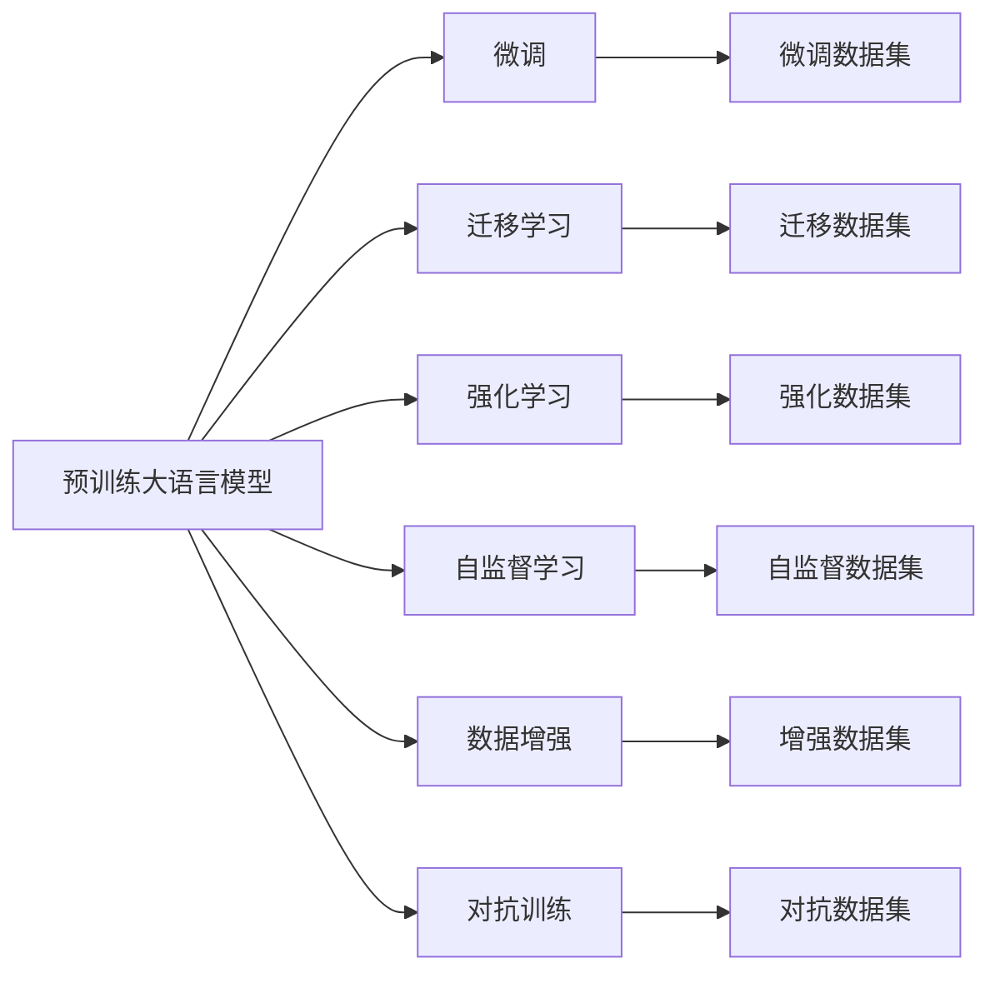

                 

# AI大模型创业：如何应对未来市场挑战？

## 1. 背景介绍

在人工智能(AI)领域，大模型已经成为引领技术发展的关键力量。自2018年BERT问世以来，预训练大语言模型在NLP、CV等诸多领域取得了显著的进展，推动了AI技术在各行业的应用落地。2021年GPT-3的横空出世，更是颠覆了人们对AI技术的认知，开启了大模型的黄金时代。

但随着大模型的火热发展，其在技术、市场、伦理等方面也面临着诸多挑战。如何克服这些挑战，充分利用大模型带来的机遇，已经成为创业者和行业从业者共同关注的问题。本文将从背景、核心概念、算法原理、具体操作、实际应用等多个维度，全面剖析大模型创业面临的挑战，并提供应对策略和建议。

## 2. 核心概念与联系

### 2.1 核心概念概述

**预训练大语言模型(Pretrained Large Language Model, PLM)**：通过自监督学习任务在大规模无标签数据上预训练，学习通用语言表示的模型。例如，BERT、GPT、T5等模型。

**微调(Fine-tuning)**：将预训练模型作为初始化参数，在下游任务有监督数据上进行微调，优化模型在特定任务上的表现。

**迁移学习(Transfer Learning)**：将预训练模型在不同任务之间进行迁移，利用模型在其他领域学到的知识来提升当前任务的表现。

**强化学习(Reinforcement Learning, RL)**：通过奖励信号指导模型行为，优化模型在复杂环境中的决策能力。

**自监督学习(Self-supervised Learning)**：利用无标签数据学习任务，如掩码语言模型、文本生成等，使得模型能够自动学习语言表示。

**数据增强(Data Augmentation)**：通过对数据集进行变换、扩充，增加数据的多样性，提升模型的泛化能力。

**对抗训练(Adversarial Training)**：通过加入对抗样本，增强模型对扰动的鲁棒性。

这些概念之间存在密切联系，共同构成了大模型创业的技术基础。通过理解这些核心概念的原理和应用，可以更好地把握大模型技术的发展脉络，应对市场挑战。

### 2.2 核心概念原理和架构的 Mermaid 流程图



## 3. 核心算法原理 & 具体操作步骤

### 3.1 算法原理概述

大模型的创业涉及多个核心算法的有机结合。其基本原理如下：

**预训练大模型**：在大量无标签文本数据上进行自监督预训练，学习到通用的语言表示。

**微调**：在预训练模型的基础上，利用下游任务的有标签数据进行有监督微调，优化模型在特定任务上的表现。

**迁移学习**：将预训练模型在不同任务之间进行迁移，利用模型在其他领域学到的知识提升当前任务的表现。

**强化学习**：通过奖励信号指导模型行为，优化模型在复杂环境中的决策能力。

**自监督学习**：利用无标签数据学习任务，使得模型能够自动学习语言表示。

**数据增强**：通过对数据集进行变换、扩充，增加数据的多样性，提升模型的泛化能力。

**对抗训练**：通过加入对抗样本，增强模型对扰动的鲁棒性。

### 3.2 算法步骤详解

**Step 1: 数据准备**
- 收集并准备预训练模型的数据集，以及目标任务的数据集。

**Step 2: 模型选择**
- 选择合适的预训练模型，例如BERT、GPT等。

**Step 3: 模型微调**
- 在预训练模型的基础上，使用目标任务的有标签数据进行微调，优化模型在该任务上的表现。

**Step 4: 迁移学习**
- 将微调后的模型在其它任务上进行迁移学习，进一步提升模型表现。

**Step 5: 强化学习**
- 使用强化学习的方法，优化模型的决策能力，适应复杂环境下的任务需求。

**Step 6: 数据增强**
- 通过对数据集进行变换、扩充，增加数据的多样性，提升模型的泛化能力。

**Step 7: 对抗训练**
- 加入对抗样本，增强模型对扰动的鲁棒性。

### 3.3 算法优缺点

大模型的创业算法具有以下优点：

**优点**：
- 通用性：大模型能够应用于多种任务，提升模型的泛化能力。
- 高效性：在预训练大模型的基础上进行微调，可以显著减少标注数据的需求，提高模型训练效率。
- 可扩展性：可以通过迁移学习、强化学习等方法，不断扩展模型的应用范围和能力。

**缺点**：
- 依赖数据：大模型的性能依赖于高质量、大规模的数据集，获取这些数据集的成本较高。
- 计算资源需求高：大模型通常需要高性能计算资源进行训练和推理，对硬件和网络的要求较高。
- 模型复杂度高：大模型的参数量巨大，模型结构复杂，难以理解其内部工作机制。

### 3.4 算法应用领域

大模型创业算法在NLP、CV、金融、医疗等多个领域得到了广泛应用：

- **NLP**：情感分析、问答系统、机器翻译、文本摘要等。
- **CV**：图像分类、目标检测、人脸识别、图像生成等。
- **金融**：风险评估、算法交易、舆情分析等。
- **医疗**：疾病诊断、药物研发、基因分析等。

## 4. 数学模型和公式 & 详细讲解

### 4.1 数学模型构建

以BERT为例，构建BERT模型的数学模型：

$$
\mathbf{H} = \text{Transformer}( \mathbf{X}, \mathbf{V}, \mathbf{Q}, \mathbf{K}, \mathbf{P})
$$

其中：
- $\mathbf{X}$：输入序列
- $\mathbf{V}$：词汇表
- $\mathbf{Q}$：查询向量
- $\mathbf{K}$：键向量
- $\mathbf{P}$：权重矩阵
- $\text{Transformer}$：Transformer结构

### 4.2 公式推导过程

BERT模型的公式推导过程如下：

$$
\begin{aligned}
\mathbf{H} &= \text{Transformer}( \mathbf{X}, \mathbf{V}, \mathbf{Q}, \mathbf{K}, \mathbf{P}) \\
&= \text{Attention}(\mathbf{X}, \mathbf{Q}, \mathbf{K}) \\
&= \text{Multi-head Attention}(\mathbf{X}, \mathbf{Q}, \mathbf{K}) + \mathbf{O}
\end{aligned}
$$

其中，$\text{Attention}$表示自注意力机制，$\text{Multi-head Attention}$表示多头注意力机制，$\mathbf{O}$表示线性变换。

### 4.3 案例分析与讲解

以情感分析为例，分析BERT模型在情感分析任务上的应用：

- 首先，收集情感标注数据集，将文本进行预处理，转化为BERT模型能够处理的格式。
- 在BERT模型上进行微调，优化模型在情感分类任务上的性能。
- 使用微调后的模型对新的文本数据进行情感分类，评估模型的效果。

## 5. 项目实践：代码实例和详细解释说明

### 5.1 开发环境搭建

使用Python和TensorFlow搭建大模型创业的开发环境：

```bash
conda create -n deep-learning python=3.8
conda activate deep-learning
pip install tensorflow transformers scikit-learn pandas
```

### 5.2 源代码详细实现

以下是一个基于BERT的情感分析微调项目的代码实现：

```python
import tensorflow as tf
import transformers

# 加载BERT模型和预训练参数
model = transformers.TFBertForSequenceClassification.from_pretrained('bert-base-uncased', num_labels=2)

# 加载训练数据
train_dataset = ...
dev_dataset = ...

# 定义训练函数
def train_epoch(model, dataset, batch_size, optimizer):
    ...
    
# 定义评估函数
def evaluate(model, dataset, batch_size):
    ...

# 训练模型
for epoch in range(5):
    loss = train_epoch(model, train_dataset, 16, optimizer)
    print(f"Epoch {epoch+1}, train loss: {loss:.3f}")
    
    print(f"Epoch {epoch+1}, dev results:")
    evaluate(model, dev_dataset, 16)
    
print("Test results:")
evaluate(model, test_dataset, 16)
```

### 5.3 代码解读与分析

在上述代码中，我们首先加载了预训练的BERT模型，并定义了训练和评估函数。在训练函数中，我们使用了TensorFlow的优化器和自定义的损失函数，对模型进行微调。在评估函数中，我们使用了sklearn的分类报告来评估模型的性能。

## 6. 实际应用场景

### 6.1 智能客服

大模型创业在智能客服领域具有重要应用价值：

- **需求**：智能客服系统需要处理大量的客户咨询，传统的客服方式依赖人工处理，效率低、成本高。
- **方案**：使用大模型创业算法，训练一个智能客服模型，能够自动理解客户问题并给出准确的回答。
- **效果**：显著提升客户咨询效率，减少人工干预，降低运营成本。

### 6.2 金融风控

金融风控是大模型创业的重要应用领域之一：

- **需求**：金融机构需要对海量数据进行风险评估，传统的规则引擎难以覆盖复杂场景。
- **方案**：使用大模型创业算法，训练一个金融风控模型，能够对客户行为进行动态分析，识别潜在风险。
- **效果**：提高风控模型的准确性和泛化能力，降低金融风险。

### 6.3 医疗诊断

大模型创业在医疗诊断领域同样具有重要价值：

- **需求**：医疗机构需要对患者进行疾病诊断，传统的诊断方法依赖经验和数据，难以保证诊断准确性。
- **方案**：使用大模型创业算法，训练一个医疗诊断模型，能够自动分析患者的病历数据，给出诊断建议。
- **效果**：提升诊断准确性，减少误诊率，提高医疗效率。

### 6.4 未来应用展望

大模型创业的未来应用前景广阔：

- **新兴领域**：随着技术的发展，大模型创业算法将逐渐应用于更多新兴领域，如自动驾驶、智能家居等。
- **模型优化**：未来将开发更加高效、可解释的模型，提升大模型创业算法的实用性。
- **算法融合**：未来将探索多种算法之间的协同作用，提升模型的整体表现。

## 7. 工具和资源推荐

### 7.1 学习资源推荐

- **《TensorFlow官方文档》**：TensorFlow的官方文档，详细介绍了TensorFlow的使用方法和最佳实践。
- **《Transformers官方文档》**：Transformers库的官方文档，提供了大量预训练模型的详细使用示例。
- **《深度学习入门》**：李沐的深度学习入门教程，适合初学者入门学习。
- **《动手学深度学习》**：李沐团队开发的深度学习课程，内容全面，适合进阶学习。

### 7.2 开发工具推荐

- **Jupyter Notebook**：Python的交互式开发环境，支持代码编写和实时运行。
- **Google Colab**：免费的GPU环境，支持高性能计算，适合大数据量的模型训练。
- **PyTorch**：高性能的深度学习框架，支持多种深度学习模型。
- **TensorFlow**：谷歌开源的深度学习框架，适合大规模模型的训练和部署。

### 7.3 相关论文推荐

- **《BERT: Pre-training of Deep Bidirectional Transformers for Language Understanding》**：BERT的论文，介绍了BERT模型的结构和训练方法。
- **《Attention is All You Need》**：Transformer的论文，介绍了Transformer的结构和原理。
- **《GPT-3: Language Models are Unsupervised Multitask Learners》**：GPT-3的论文，介绍了GPT-3模型的结构和性能。

## 8. 总结：未来发展趋势与挑战

### 8.1 总结

大模型创业作为AI领域的创新范式，正在改变各行业的生产方式和运营模式。本文系统地介绍了大模型创业的核心概念、算法原理、具体操作步骤、实际应用场景等，为创业者提供了全面的技术指引。通过本文的学习，相信读者能够更好地理解大模型创业的技术内涵，应对市场挑战，实现商业价值。

### 8.2 未来发展趋势

大模型创业的未来发展趋势如下：

- **技术升级**：未来将开发更加高效、可解释的模型，提升大模型创业算法的实用性。
- **算法融合**：未来将探索多种算法之间的协同作用，提升模型的整体表现。
- **数据拓展**：未来将探索更多数据源，增加数据的多样性，提升模型的泛化能力。
- **领域应用**：未来将逐渐应用于更多新兴领域，如自动驾驶、智能家居等。

### 8.3 面临的挑战

大模型创业面临的挑战如下：

- **数据依赖**：大模型的性能依赖于高质量、大规模的数据集，获取这些数据集的成本较高。
- **计算资源需求高**：大模型通常需要高性能计算资源进行训练和推理，对硬件和网络的要求较高。
- **模型复杂度高**：大模型的参数量巨大，模型结构复杂，难以理解其内部工作机制。
- **可解释性不足**：大模型通常像"黑盒"系统，难以解释其内部工作机制和决策逻辑。

### 8.4 研究展望

大模型创业的研究展望如下：

- **提升模型可解释性**：通过引入可解释的特征提取方法，提高大模型的可解释性。
- **优化模型结构**：通过压缩、稀疏化等方法，优化大模型的结构，提升推理速度和资源利用效率。
- **引入更多先验知识**：将符号化的先验知识，如知识图谱、逻辑规则等，与神经网络模型进行融合，提升模型的性能和可解释性。
- **多模态数据融合**：未来将探索视觉、语音等多模态数据的融合，提升大模型的多模态理解和生成能力。

## 9. 附录：常见问题与解答

### Q1：大模型创业的算法和模型如何选择？

A：选择合适的算法和模型需要根据具体的应用场景和需求进行评估。例如，BERT适用于文本分类、情感分析等任务，GPT适用于生成式任务，如对话生成、文本生成等。

### Q2：如何评估大模型创业算法的性能？

A：评估大模型创业算法的性能需要根据具体的任务需求进行评估。例如，对于情感分析任务，可以使用准确率、召回率、F1分数等指标进行评估。

### Q3：如何处理大模型的计算资源需求高的问题？

A：处理大模型的计算资源需求高的问题需要从硬件和算法两个方面进行优化。例如，可以使用分布式训练、模型压缩等方法来减少计算资源的消耗。

### Q4：如何提高大模型的可解释性？

A：提高大模型的可解释性需要从模型结构和训练方法两个方面进行优化。例如，可以通过引入可解释的特征提取方法，提高大模型的可解释性。

### Q5：大模型创业的未来发展方向是什么？

A：大模型创业的未来发展方向包括技术升级、算法融合、数据拓展、领域应用等多个方面。通过不断优化算法和模型，拓展数据来源，引入更多先验知识，大模型创业有望在更多领域实现落地应用。

作者：禅与计算机程序设计艺术 / Zen and the Art of Computer Programming

