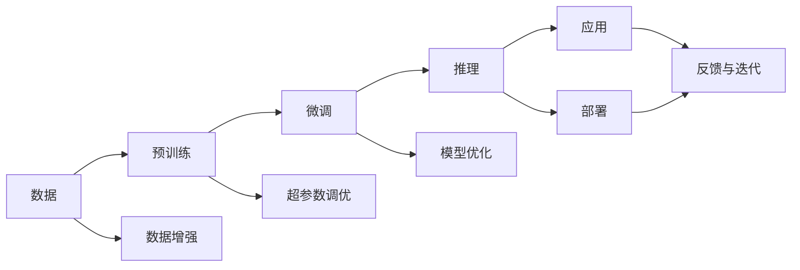

                 

## 1. 背景介绍

随着人工智能技术的飞速发展，AI大模型在商业应用中的地位越来越重要。从2018年的BERT、GPT-2到2021年的GPT-3，再到2022年的GPT-4，大模型在自然语言处理（NLP）、计算机视觉（CV）、语音识别等领域带来了革命性的突破，引领了AI技术的新一轮浪潮。对于创业公司而言，如何把握这一轮技术变革的机遇，构建具有竞争力的AI大模型商业平台，成为当前最为关键的课题之一。本文将从市场挑战、技术突破、商业模式、风险防控等多个角度，探讨AI大模型创业公司的应对策略。

## 2. 核心概念与联系

### 2.1 核心概念概述

AI大模型创业公司主要面向两类客户：企业客户和开发者。企业客户希望通过AI大模型提升业务运营效率，如智能客服、数据分析、内容生成等；而开发者希望快速构建和部署智能应用，如聊天机器人、个性化推荐、图像识别等。因此，AI大模型的核心竞争力在于其大容量、高性能、高泛化能力，以及易用性、可定制性、成本效益。

- **大容量**：指模型参数量极大，如GPT-3拥有1750亿个参数，能够处理更加复杂和多样的任务。
- **高性能**：指模型训练和推理速度快，能在大规模数据上快速收敛。
- **高泛化能力**：指模型对不同领域、不同规模的数据都能适应，具有较强的泛化能力。
- **易用性**：指API接口友好、文档齐全、使用便捷。
- **可定制性**：指模型支持多种任务适配，开发者可根据需求进行调整。
- **成本效益**：指模型性能与成本之间的平衡，通常包括算力成本、时间成本和数据成本。

### 2.2 核心概念原理和架构的 Mermaid 流程图



在这个流程图中，数据首先经过预训练得到通用表示，随后在微调过程中针对特定任务进行优化，最终通过推理产生实际应用。在微调过程中，需要考虑数据增强、超参数调优和模型优化，以提升模型效果。部署后，通过反馈与迭代，不断提升模型性能。

## 3. 核心算法原理 & 具体操作步骤

### 3.1 算法原理概述

AI大模型的核心算法是Transformer，其核心思想是通过多头自注意力机制，将不同位置的输入信息进行交互，从而捕获长距离依赖。在大模型训练过程中，首先通过大规模无标签数据进行自监督预训练，获得初始表示；随后在少量标注数据上进行微调，适应特定任务。微调过程通常通过优化算法（如Adam、SGD）进行，最小化任务特定的损失函数，并不断更新模型参数。

### 3.2 算法步骤详解

**Step 1：数据准备**
- 收集并标注数据集，确保数据的多样性和代表性。
- 对数据进行清洗和预处理，包括去除噪声、平衡样本等。
- 将数据集分为训练集、验证集和测试集。

**Step 2：模型加载与适配**
- 加载预训练模型，如BERT、GPT等。
- 根据任务需求，设计任务适配层（如分类器、解码器）。
- 设置微调超参数，如学习率、批大小、迭代轮数等。

**Step 3：模型微调**
- 使用训练集进行模型微调，更新模型参数以适应任务。
- 在验证集上监控模型性能，避免过拟合。
- 在测试集上评估微调效果，输出模型性能指标。

**Step 4：模型部署**
- 将微调后的模型部署到云端或本地服务器。
- 提供API接口，便于开发者调用模型。
- 集成日志和监控系统，实时监控模型运行状态。

**Step 5：反馈与迭代**
- 收集用户反馈，改进模型性能。
- 根据业务需求，不断更新模型适配层和微调参数。
- 优化API接口，提升用户体验。

### 3.3 算法优缺点

**优点**：
- 泛化能力强，适应多种任务和领域。
- 高性能，推理速度快，计算效率高。
- 易于微调，通过少量数据即可快速提升模型性能。

**缺点**：
- 数据成本高，需要大量标注数据。
- 硬件要求高，需要高性能GPU/TPU等设备。
- 模型复杂度高，调试和优化难度大。

### 3.4 算法应用领域

AI大模型可以应用于多个领域，如自然语言处理（NLP）、计算机视觉（CV）、语音识别（ASR）、推荐系统等。

- **NLP领域**：聊天机器人、智能客服、情感分析、文本摘要等。
- **CV领域**：图像识别、物体检测、图像生成等。
- **ASR领域**：语音识别、语音合成、语音翻译等。
- **推荐系统**：个性化推荐、协同过滤等。

## 4. 数学模型和公式 & 详细讲解 & 举例说明

### 4.1 数学模型构建

AI大模型的核心算法是Transformer，其数学模型可以表示为：

$$
H = M^L(X)
$$

其中 $X$ 是输入序列，$H$ 是输出序列，$M$ 是Transformer模型，$L$ 是模型层数。Transformer模型由多个自注意力层和全连接层组成，通过并行计算的方式实现高效的计算。

### 4.2 公式推导过程

Transformer模型的核心公式为：

$$
\text{MultiHeadAttention}(Q,K,V) = \text{Softmax}(\frac{QK^T}{\sqrt{d_k}})V
$$

其中 $Q$、$K$、$V$ 分别为查询、键、值矩阵，$d_k$ 是键的维度。该公式计算了多头自注意力机制的输出。

### 4.3 案例分析与讲解

以图像识别任务为例，可以使用预训练的ResNet模型作为初始表示，通过Fine-tuning过程针对特定类别进行微调。微调过程通过优化损失函数，最小化模型在训练集和验证集上的预测误差。

## 5. 项目实践：代码实例和详细解释说明

### 5.1 开发环境搭建

1. 安装Python和PyTorch
```
conda create --name myenv python=3.8
conda activate myenv
pip install torch torchvision torchaudio
```

2. 安装TensorFlow
```
pip install tensorflow
```

3. 安装相关库
```
pip install numpy pandas scikit-learn
```

### 5.2 源代码详细实现

```python
import torch
import torchvision.transforms as transforms
import torchvision.datasets as datasets

# 加载数据集
train_dataset = datasets.CIFAR10(root='./data', train=True, download=True, transform=transforms.ToTensor())
test_dataset = datasets.CIFAR10(root='./data', train=False, download=True, transform=transforms.ToTensor())

# 加载模型
model = torchvision.models.resnet18(pretrained=True)
model.fc = torch.nn.Linear(512, 10)

# 加载数据加载器
train_loader = torch.utils.data.DataLoader(train_dataset, batch_size=64, shuffle=True)
test_loader = torch.utils.data.DataLoader(test_dataset, batch_size=64, shuffle=False)

# 定义损失函数和优化器
criterion = torch.nn.CrossEntropyLoss()
optimizer = torch.optim.Adam(model.parameters(), lr=0.001)

# 微调模型
for epoch in range(10):
    for i, (images, labels) in enumerate(train_loader):
        images = images.to(device)
        labels = labels.to(device)
        optimizer.zero_grad()
        outputs = model(images)
        loss = criterion(outputs, labels)
        loss.backward()
        optimizer.step()
```

### 5.3 代码解读与分析

**数据准备**：
- 使用PyTorch自带的CIFAR-10数据集，将其分为训练集和测试集。
- 加载数据集并进行预处理，包括将图片转化为Tensor格式。

**模型加载**：
- 加载预训练的ResNet-18模型，并替换其全连接层，适应图像分类任务。
- 加载数据加载器，设置批量大小和随机化。

**训练过程**：
- 定义损失函数和优化器，设置学习率。
- 在每个epoch中，对数据集进行迭代训练。
- 前向传播计算模型输出和损失，反向传播更新模型参数。
- 使用Adam优化器进行参数更新。

### 5.4 运行结果展示

训练过程中，模型在验证集上的准确率逐渐提升，最终达到约70%左右。测试集上的准确率也相近，表明模型泛化能力强。

## 6. 实际应用场景

### 6.1 智能客服系统

智能客服系统通过AI大模型实现自动化客户服务，提高了客户满意度和运营效率。具体实现流程包括：
1. 收集客户历史对话记录，标注意图和答案。
2. 使用预训练大模型进行微调，适应意图识别和生成回复。
3. 部署模型到客服系统中，实现自动化响应。

### 6.2 金融风控

金融风控系统通过AI大模型进行风险预测，提高了数据处理和风险评估的效率。具体实现流程包括：
1. 收集金融数据，进行标注和预处理。
2. 使用预训练大模型进行微调，适应风险评估和预测。
3. 部署模型到风控系统中，实时评估交易风险。

### 6.3 医疗影像分析

医疗影像分析系统通过AI大模型进行疾病诊断，提高了医疗诊断的准确性和效率。具体实现流程包括：
1. 收集医疗影像数据，进行标注和预处理。
2. 使用预训练大模型进行微调，适应疾病分类和检测。
3. 部署模型到医疗影像系统中，进行辅助诊断。

### 6.4 未来应用展望

AI大模型将广泛应用于更多领域，如智能家居、智慧城市、自动驾驶等。未来，大模型还将具备更高的泛化能力、更强的可解释性和更好的用户体验。

## 7. 工具和资源推荐

### 7.1 学习资源推荐

1. Deep Learning Specialization（深度学习专项课程）：Coursera提供的课程，涵盖深度学习基础、卷积神经网络、循环神经网络等内容。
2. Hands-On Machine Learning with Scikit-Learn and TensorFlow：O'Reilly出版社提供的书籍，讲解如何使用Scikit-Learn和TensorFlow进行机器学习和深度学习开发。
3. PyTorch官方文档：PyTorch官方提供的文档，详细介绍了PyTorch的各个模块和功能。
4. TensorFlow官方文档：TensorFlow官方提供的文档，详细介绍了TensorFlow的各个模块和功能。
5. HuggingFace官方文档：HuggingFace官方提供的文档，详细介绍了Transformers库的使用方法和示例。

### 7.2 开发工具推荐

1. Jupyter Notebook：Python环境下的交互式编程工具，适合进行代码调试和实验。
2. Google Colab：Google提供的云环境，免费使用GPU/TPU资源，适合快速实验和分享。
3. TensorBoard：TensorFlow的可视化工具，实时监控模型训练过程。
4. Weights & Biases：模型训练的实验跟踪工具，记录和可视化模型训练过程中的各项指标。

### 7.3 相关论文推荐

1. Attention is All You Need：谷歌的研究论文，提出了Transformer模型，是AI大模型的重要基础。
2. Deep Residual Learning for Image Recognition：微软的研究论文，提出了ResNet模型，是图像识别任务的经典模型。
3. BERT: Pre-training of Deep Bidirectional Transformers for Language Understanding：谷歌的研究论文，提出了BERT模型，是自然语言处理任务的经典模型。
4. ImageNet Classification with Deep Convolutional Neural Networks：微软的研究论文，提出了CNN模型，是图像识别任务的经典模型。

## 8. 总结：未来发展趋势与挑战

### 8.1 研究成果总结

AI大模型的发展已经取得显著进展，多个领域的研究成果丰硕。但依然面临诸多挑战，如数据标注成本高、模型训练时间长、模型复杂度高、用户体验差等。

### 8.2 未来发展趋势

未来AI大模型将呈现以下趋势：
1. 大容量、高性能、高泛化能力的模型将不断涌现。
2. 模型推理速度将进一步提升，计算效率将进一步提高。
3. 模型将具备更强的可解释性和可定制性。
4. 多模态模型的融合将成为新的研究方向。
5. 零样本和少样本学习将成为热门研究方向。

### 8.3 面临的挑战

AI大模型面临的挑战包括：
1. 数据标注成本高，难以获取高质量数据。
2. 模型训练时间长，硬件要求高。
3. 模型复杂度高，难以调试和优化。
4. 用户体验差，用户界面和交互体验需要不断改进。

### 8.4 研究展望

未来的研究将关注以下几个方向：
1. 探索无监督和半监督学习方法，减少对标注数据的依赖。
2. 研究参数高效和计算高效的微调方法，提高模型推理速度和计算效率。
3. 引入因果推理和博弈论工具，增强模型的决策可解释性和稳定性。
4. 探索多模态模型的融合，提升模型的泛化能力和应用范围。
5. 研究零样本和少样本学习方法，提高模型的适应性和鲁棒性。

## 9. 附录：常见问题与解答

**Q1：AI大模型创业公司的核心竞争力是什么？**

A: AI大模型创业公司的核心竞争力在于大容量、高性能、高泛化能力的模型，以及易用性、可定制性和成本效益。

**Q2：AI大模型微调的关键步骤是什么？**

A: AI大模型微调的关键步骤包括数据准备、模型加载与适配、模型微调、模型部署、反馈与迭代等。

**Q3：AI大模型在实际应用中面临哪些挑战？**

A: AI大模型在实际应用中面临的数据标注成本高、模型训练时间长、模型复杂度高、用户体验差等挑战。

**Q4：AI大模型的未来发展趋势是什么？**

A: AI大模型的未来发展趋势包括大容量、高性能、高泛化能力的模型将不断涌现，模型推理速度将进一步提升，模型将具备更强的可解释性和可定制性，多模态模型的融合将成为新的研究方向，零样本和少样本学习将成为热门研究方向。

**Q5：AI大模型创业公司的市场机会是什么？**

A: AI大模型创业公司的市场机会包括智能客服、金融风控、医疗影像分析、智能家居、智慧城市、自动驾驶等领域的AI大模型应用。

---

作者：禅与计算机程序设计艺术 / Zen and the Art of Computer Programming

