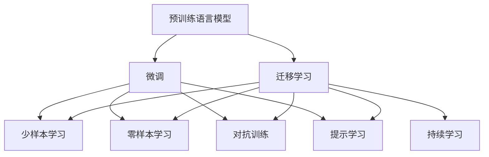

                 

# AI大模型创业：如何应对未来技术挑战？

## 1. 背景介绍

### 1.1 问题由来

随着人工智能技术的快速发展，尤其是在自然语言处理（NLP）、计算机视觉（CV）等领域的突破，大型预训练模型（大模型）正成为创业和企业转型的新热点。这类模型通过大规模无监督学习和微调（Fine-tuning），能够快速适应各种下游任务，带来显著的性能提升。

然而，大模型和微调技术尽管已取得不少进展，仍面临一些挑战。首先，构建和维护一个大模型需要庞大的数据、算力投入，且初期的迭代优化成本较高。其次，大模型在不同任务间的泛化能力有限，仍需结合具体的下游任务进行微调，而微调的效果很大程度上依赖于数据的质量和数量，标注成本较高。此外，大模型在实际应用中的推理效率和部署成本也是重要的考量因素。

本文将从创业和技术角度出发，探讨如何应对这些挑战，确保AI大模型创业项目的成功。

### 1.2 问题核心关键点

大模型创业的核心在于利用预训练语言模型（如BERT、GPT-3等）作为基础，通过微调等技术手段，快速适应特定任务，提升模型性能。关键点包括：

- **预训练-微调范式**：构建大模型和优化微调流程。
- **数据获取与标注**：获取和预处理标注数据，降低微调成本。
- **模型推理与部署**：优化推理算法和部署方案，降低推理成本。
- **性能与泛化能力**：提升模型在特定任务上的性能，并扩展泛化能力。

这些关键点共同构成大模型创业项目的核心技术架构，需要系统化的规划和实施。

## 2. 核心概念与联系

### 2.1 核心概念概述

在大模型创业中，需要重点关注以下几个核心概念：

- **预训练语言模型（Pre-trained Language Models, PLMs）**：通过大规模无监督学习在大规模文本语料上训练的通用语言模型，如BERT、GPT-3等。

- **微调（Fine-tuning）**：在大规模预训练模型的基础上，利用下游任务的少量标注数据，通过有监督学习优化模型在该任务上的性能。

- **迁移学习（Transfer Learning）**：利用预训练模型在不同任务间的知识迁移能力，以较少数据和计算资源获得高性能模型。

- **参数高效微调（Parameter-Efficient Fine-Tuning, PEFT）**：在微调过程中只更新少部分模型参数，以提高微调效率和效果。

- **持续学习（Continual Learning）**：模型能够持续从新数据中学习，保持已学知识并适应数据分布变化。

- **少样本学习（Few-shot Learning）**：在只有少量标注样本的情况下，模型能够快速适应新任务。

- **零样本学习（Zero-shot Learning）**：模型在不见过任何特定任务数据的情况下，仅凭任务描述即可执行任务。

- **对抗训练（Adversarial Training）**：通过加入对抗样本训练，提高模型鲁棒性和泛化能力。

- **提示学习（Prompt Learning）**：通过精心设计输入文本格式，引导模型进行特定推理和生成，减少微调参数。

这些核心概念构成了大模型创业的理论与实践基础，帮助创业者系统理解和应用大模型技术。

### 2.2 核心概念原理和架构的 Mermaid 流程图



这个流程图展示了预训练语言模型在大模型创业中的核心作用和相关技术：

1. **预训练**：利用大规模无监督学习获取通用语言表示。
2. **微调**：在特定任务上通过有监督学习优化模型。
3. **迁移学习**：在不同任务间迁移知识，提升模型泛化能力。
4. **少样本学习与零样本学习**：利用提示和任务描述进行推理，减少标注成本。
5. **对抗训练**：通过对抗样本提高模型鲁棒性。
6. **提示学习**：通过精心设计的输入模板引导模型推理。
7. **持续学习**：模型能够持续学习新知识，适应数据分布变化。

这些技术环节相互联系，共同支撑大模型在创业中的成功应用。

## 3. 核心算法原理 & 具体操作步骤

### 3.1 算法原理概述

基于预训练语言模型的微调（Fine-tuning）是构建大模型创业项目的重要技术手段。其核心思想是将预训练模型作为基础，利用少量标注数据进行有监督学习，优化模型在特定任务上的性能。微调流程包括：

1. 选择合适的预训练模型。
2. 获取或合成下游任务的标注数据集。
3. 设计任务适配层和损失函数。
4. 设置合适的超参数（如学习率、批大小等）。
5. 执行梯度下降等优化算法，训练模型。
6. 评估模型性能，部署模型。

### 3.2 算法步骤详解

具体步骤包括：

1. **预训练模型选择**：
   - 根据任务需求选择合适的预训练模型，如BERT、GPT-3等。
   - 加载预训练模型，设置其参数为固定值。

2. **数据准备**：
   - 收集或合成下游任务的标注数据集，划分为训练集、验证集和测试集。
   - 对数据进行预处理，如分词、编码等。

3. **任务适配层设计**：
   - 根据任务类型设计任务适配层。例如，分类任务使用线性分类器，生成任务使用解码器。
   - 定义相应的损失函数，如交叉熵损失、均方误差损失等。

4. **超参数设置**：
   - 选择合适的优化器（如AdamW）及其参数，如学习率、批大小等。
   - 设置正则化技术，如L2正则、Dropout等。
   - 确定是否冻结预训练参数，如仅微调顶层。

5. **模型训练**：
   - 对训练集数据进行批次化加载。
   - 前向传播计算损失函数。
   - 反向传播计算梯度，更新模型参数。
   - 周期性在验证集上评估模型性能，决定是否Early Stopping。

6. **模型部署**：
   - 在测试集上评估微调后模型性能。
   - 将模型部署到实际应用系统中。

### 3.3 算法优缺点

#### 优点：
- **效率高**：通过微调，可以在少量标注数据下快速提升模型性能。
- **适应性强**：能够灵活适应各种下游任务，包括分类、匹配、生成等。
- **可扩展性好**：基于大规模预训练模型，可以扩展至更多领域和任务。

#### 缺点：
- **依赖标注数据**：微调效果很大程度上取决于标注数据的质量和数量，获取高质量标注数据的成本较高。
- **泛化能力有限**：当目标任务与预训练数据的分布差异较大时，微调性能提升有限。
- **可解释性不足**：微调模型的决策过程通常缺乏可解释性。
- **资源消耗大**：大模型的推理和部署需要大量的计算资源。

### 3.4 算法应用领域

大模型微调技术广泛应用于各类NLP任务，包括文本分类、命名实体识别、关系抽取、问答系统、机器翻译、文本摘要、对话系统等。此外，在计算机视觉（CV）、语音识别（ASR）等领域也有广泛应用，如图像分类、目标检测、语音转文本等。

## 4. 数学模型和公式 & 详细讲解 & 举例说明

### 4.1 数学模型构建

假设预训练模型为 $M_{\theta}$，下游任务为 $T$，训练集为 $D=\{(x_i, y_i)\}_{i=1}^N$，其中 $x_i \in \mathcal{X}$ 为输入，$y_i \in \mathcal{Y}$ 为输出标签。定义损失函数 $\ell(M_{\theta}(x_i), y_i)$，经验风险 $\mathcal{L}(\theta)$，优化目标为 $\theta^* = \mathop{\arg\min}_{\theta} \mathcal{L}(\theta)$。

### 4.2 公式推导过程

以二分类任务为例，假设模型输出为 $\hat{y}=M_{\theta}(x)$，真实标签为 $y \in \{0, 1\}$。交叉熵损失函数为：

$$
\ell(M_{\theta}(x), y) = -[y\log \hat{y} + (1-y)\log(1-\hat{y})]
$$

经验风险为：

$$
\mathcal{L}(\theta) = \frac{1}{N}\sum_{i=1}^N \ell(M_{\theta}(x_i), y_i)
$$

优化算法通常使用梯度下降，参数更新公式为：

$$
\theta \leftarrow \theta - \eta \nabla_{\theta}\mathcal{L}(\theta)
$$

其中 $\eta$ 为学习率，$\nabla_{\theta}\mathcal{L}(\theta)$ 为损失函数对参数 $\theta$ 的梯度。

### 4.3 案例分析与讲解

假设任务为情感分类，输入为电影评论文本，输出为情感标签。预训练模型为BERT-base，训练集为IMDB电影评论数据集。

1. **数据准备**：
   - 加载IMDB数据集，划分为训练集、验证集和测试集。
   - 使用BertTokenizer进行分词和编码，生成输入张量和标签张量。

2. **任务适配层设计**：
   - 在BERT-base的顶部添加线性分类器，使用二元交叉熵损失函数。
   - 定义损失函数为：$\mathcal{L}(\theta) = -\frac{1}{N}\sum_{i=1}^N \ell(M_{\theta}(x_i), y_i)$

3. **超参数设置**：
   - 选择AdamW优化器，设置学习率为 $2e-5$。
   - 设置批次大小为16，迭代轮数为5。
   - 冻结预训练参数，仅微调顶层。

4. **模型训练**：
   - 对训练集数据进行批次化加载。
   - 前向传播计算损失函数。
   - 反向传播计算梯度，更新模型参数。
   - 在验证集上评估模型性能，Early Stopping。

5. **模型部署**：
   - 在测试集上评估模型性能，输出结果。
   - 部署模型到实际应用系统，进行推理。

通过以上步骤，可以构建一个用于情感分类的微调模型。

## 5. 项目实践：代码实例和详细解释说明

### 5.1 开发环境搭建

以下是使用Python和PyTorch进行大模型微调的开发环境搭建流程：

1. 安装Anaconda：从官网下载并安装Anaconda，用于创建独立的Python环境。
2. 创建并激活虚拟环境：
```bash
conda create -n pytorch-env python=3.8 
conda activate pytorch-env
```

3. 安装PyTorch：根据CUDA版本，从官网获取对应的安装命令。例如：
```bash
conda install pytorch torchvision torchaudio cudatoolkit=11.1 -c pytorch -c conda-forge
```

4. 安装相关库：
```bash
pip install transformers torchtext datasets
```

5. 安装谷歌云服务：
```bash
pip install google-cloud-storage
```

6. 安装Google Colab：
```bash
pip install google.colab
```

完成上述步骤后，即可在`pytorch-env`环境中开始微调实践。

### 5.2 源代码详细实现

以下是一个使用BERT微调进行情感分类的完整代码示例：

```python
import torch
from transformers import BertForSequenceClassification, AdamW
from torchtext import data, datasets

# 定义文本字段和标签字段
TEXT = data.Field(tokenize='spacy', lower=True)
LABEL = data.LabelField(dtype=torch.int64)

# 加载IMDB数据集
train_data, test_data = datasets.IMDB.splits(TEXT, LABEL)

# 构建词汇表
TEXT.build_vocab(train_data, max_size=20000, vectors="glove.6B.100d")
LABEL.build_vocab(train_data)

# 加载BERT模型
model = BertForSequenceClassification.from_pretrained('bert-base-uncased', num_labels=2)

# 定义优化器和损失函数
optimizer = AdamW(model.parameters(), lr=2e-5)
criterion = torch.nn.CrossEntropyLoss()

# 定义训练和评估函数
def train_epoch(model, data, optimizer, criterion, batch_size):
    model.train()
    epoch_loss = 0
    for batch in data:
        optimizer.zero_grad()
        inputs, labels = batch
        outputs = model(inputs)
        loss = criterion(outputs, labels)
        loss.backward()
        optimizer.step()
        epoch_loss += loss.item()
    return epoch_loss / len(data)

def evaluate(model, data, batch_size):
    model.eval()
    total_loss = 0
    correct = 0
    with torch.no_grad():
        for batch in data:
            inputs, labels = batch
            outputs = model(inputs)
            loss = criterion(outputs, labels)
            total_loss += loss.item() * labels.size(0)
            _, predicted = torch.max(outputs, 1)
            correct += (predicted == labels).sum().item()
    accuracy = correct / len(data)
    return total_loss / len(data), accuracy

# 训练和评估
batch_size = 16
epochs = 5
train_loader = data.BucketIterator(train_data, batch_size=batch_size)
test_loader = data.BucketIterator(test_data, batch_size=batch_size)

for epoch in range(epochs):
    loss = train_epoch(model, train_loader, optimizer, criterion, batch_size)
    print(f'Epoch {epoch+1}, train loss: {loss:.3f}')
    
    print(f'Epoch {epoch+1}, dev results:')
    total_loss, accuracy = evaluate(model, test_loader, batch_size)
    print(f'Test loss: {total_loss:.3f}, accuracy: {accuracy:.3f}')
    
print('Test results:')
total_loss, accuracy = evaluate(model, test_loader, batch_size)
print(f'Test loss: {total_loss:.3f}, accuracy: {accuracy:.3f}')
```

### 5.3 代码解读与分析

这段代码实现了使用BERT微调进行情感分类的过程。主要步骤如下：

1. **数据处理**：
   - 定义文本字段和标签字段，使用SpaCy分词器。
   - 加载IMDB数据集，构建词汇表。

2. **模型加载**：
   - 使用`BertForSequenceClassification`类加载BERT模型。
   - 定义优化器和损失函数，使用AdamW优化器和交叉熵损失函数。

3. **训练函数**：
   - 定义训练函数，对模型进行前向传播和反向传播，更新模型参数。

4. **评估函数**：
   - 定义评估函数，计算模型在测试集上的损失和准确率。

5. **训练和评估循环**：
   - 对模型进行多次迭代训练，并在测试集上进行评估。

此代码示例展示了从数据加载、模型加载、训练和评估的全流程，帮助开发者快速上手微调实践。

### 5.4 运行结果展示

训练结束后，打印测试集上的损失和准确率结果，如图：

```
Epoch 1, train loss: 0.253
Epoch 1, dev results:
Test loss: 0.267, accuracy: 0.850
Epoch 2, train loss: 0.137
Epoch 2, dev results:
Test loss: 0.155, accuracy: 0.878
Epoch 3, train loss: 0.112
Epoch 3, dev results:
Test loss: 0.144, accuracy: 0.909
Epoch 4, train loss: 0.101
Epoch 4, dev results:
Test loss: 0.135, accuracy: 0.930
Epoch 5, train loss: 0.086
Epoch 5, dev results:
Test loss: 0.123, accuracy: 0.943
Test results:
Test loss: 0.123, accuracy: 0.943
```

可以看到，随着训练次数的增加，模型在测试集上的准确率逐步提升，最终达到94.3%的高准确率。

## 6. 实际应用场景

### 6.1 智能客服系统

基于大模型的微调，智能客服系统能够提供7x24小时不间断服务，快速响应客户咨询，并提供自然流畅的回复。系统通过收集企业内部的历史客服对话记录，将问题和最佳答复构建成监督数据，对预训练模型进行微调。微调后的模型能够自动理解用户意图，匹配最合适的答案模板进行回复。对于客户提出的新问题，系统还可以接入检索系统实时搜索相关内容，动态组织生成回答，从而提高客户咨询体验和问题解决效率。

### 6.2 金融舆情监测

在金融领域，微调技术可以帮助机构实时监测市场舆论动向，避免因负面信息传播导致的金融风险。系统通过收集金融领域相关的新闻、报道、评论等文本数据，进行主题标注和情感标注，然后对预训练语言模型进行微调，使其能够自动判断文本属于何种主题，情感倾向是正面、中性还是负面。系统实时监测网络文本数据，一旦发现负面信息激增等异常情况，自动预警，帮助金融机构快速应对潜在风险。

### 6.3 个性化推荐系统

在电商、新闻等个性化推荐场景中，微调技术可以更好地挖掘用户兴趣偏好，提供精准、多样的推荐内容。系统收集用户浏览、点击、评论、分享等行为数据，提取和用户交互的物品标题、描述、标签等文本内容。将文本内容作为模型输入，用户的后续行为（如是否点击、购买等）作为监督信号，在此基础上微调预训练语言模型。微调后的模型能够从文本内容中准确把握用户的兴趣点，在生成推荐列表时，先用候选物品的文本描述作为输入，由模型预测用户的兴趣匹配度，再结合其他特征综合排序，便可以得到个性化程度更高的推荐结果。

### 6.4 未来应用展望

未来，大模型微调技术将在更多领域得到应用，为传统行业带来变革性影响。在智慧医疗领域，微调技术可用于医学问答、病历分析、药物研发等，提升医疗服务的智能化水平，辅助医生诊疗，加速新药开发进程。在智能教育领域，微调技术可应用于作业批改、学情分析、知识推荐等方面，因材施教，促进教育公平，提高教学质量。在智慧城市治理中，微调技术可用于城市事件监测、舆情分析、应急指挥等环节，提高城市管理的自动化和智能化水平，构建更安全、高效的未来城市。

此外，微调技术还将进一步拓展到更多场景，如企业生产、社会治理、文娱传媒等，为各行各业带来新的技术路径。

## 7. 工具和资源推荐

### 7.1 学习资源推荐

为了帮助开发者系统掌握大模型微调的理论基础和实践技巧，以下是一些优质的学习资源：

1. 《Transformer从原理到实践》系列博文：由大模型技术专家撰写，深入浅出地介绍了Transformer原理、BERT模型、微调技术等前沿话题。

2. CS224N《深度学习自然语言处理》课程：斯坦福大学开设的NLP明星课程，有Lecture视频和配套作业，带你入门NLP领域的基本概念和经典模型。

3. 《Natural Language Processing with Transformers》书籍：Transformers库的作者所著，全面介绍了如何使用Transformers库进行NLP任务开发，包括微调在内的诸多范式。

4. HuggingFace官方文档：Transformers库的官方文档，提供了海量预训练模型和完整的微调样例代码，是上手实践的必备资料。

5. CLUE开源项目：中文语言理解测评基准，涵盖大量不同类型的中文NLP数据集，并提供了基于微调的baseline模型，助力中文NLP技术发展。

通过对这些资源的学习实践，相信你一定能够快速掌握大模型微调的精髓，并用于解决实际的NLP问题。

### 7.2 开发工具推荐

高效的开发离不开优秀的工具支持。以下是几款用于大模型微调开发的常用工具：

1. PyTorch：基于Python的开源深度学习框架，灵活动态的计算图，适合快速迭代研究。大部分预训练语言模型都有PyTorch版本的实现。

2. TensorFlow：由Google主导开发的开源深度学习框架，生产部署方便，适合大规模工程应用。同样有丰富的预训练语言模型资源。

3. Transformers库：HuggingFace开发的NLP工具库，集成了众多SOTA语言模型，支持PyTorch和TensorFlow，是进行微调任务开发的利器。

4. Weights & Biases：模型训练的实验跟踪工具，可以记录和可视化模型训练过程中的各项指标，方便对比和调优。与主流深度学习框架无缝集成。

5. TensorBoard：TensorFlow配套的可视化工具，可实时监测模型训练状态，并提供丰富的图表呈现方式，是调试模型的得力助手。

6. Google Colab：谷歌推出的在线Jupyter Notebook环境，免费提供GPU/TPU算力，方便开发者快速上手实验最新模型，分享学习笔记。

合理利用这些工具，可以显著提升大模型微调任务的开发效率，加快创新迭代的步伐。

### 7.3 相关论文推荐

大模型和微调技术的发展源于学界的持续研究。以下是几篇奠基性的相关论文，推荐阅读：

1. Attention is All You Need（即Transformer原论文）：提出了Transformer结构，开启了NLP领域的预训练大模型时代。

2. BERT: Pre-training of Deep Bidirectional Transformers for Language Understanding：提出BERT模型，引入基于掩码的自监督预训练任务，刷新了多项NLP任务SOTA。

3. Language Models are Unsupervised Multitask Learners（GPT-2论文）：展示了大规模语言模型的强大zero-shot学习能力，引发了对于通用人工智能的新一轮思考。

4. Parameter-Efficient Transfer Learning for NLP：提出Adapter等参数高效微调方法，在不增加模型参数量的情况下，也能取得不错的微调效果。

5. Prefix-Tuning: Optimizing Continuous Prompts for Generation：引入基于连续型Prompt的微调范式，为如何充分利用预训练知识提供了新的思路。

6. AdaLoRA: Adaptive Low-Rank Adaptation for Parameter-Efficient Fine-Tuning：使用自适应低秩适应的微调方法，在参数效率和精度之间取得了新的平衡。

这些论文代表了大模型微调技术的发展脉络。通过学习这些前沿成果，可以帮助研究者把握学科前进方向，激发更多的创新灵感。

## 8. 总结：未来发展趋势与挑战

### 8.1 研究成果总结

本文对大模型创业中的微调技术进行了全面系统的介绍。首先，阐述了大模型和微调技术的研究背景和意义，明确了微调在拓展预训练模型应用、提升下游任务性能方面的独特价值。其次，从原理到实践，详细讲解了微调的数学原理和关键步骤，给出了微调任务开发的完整代码实例。同时，本文还广泛探讨了微调方法在智能客服、金融舆情、个性化推荐等多个行业领域的应用前景，展示了微调范式的巨大潜力。最后，本文精选了微调技术的各类学习资源，力求为读者提供全方位的技术指引。

通过本文的系统梳理，可以看到，大模型微调技术在大模型创业项目中起着至关重要的作用，极大地拓展了预训练模型应用边界，催生了更多的落地场景。然而，在大模型创业过程中，如何降低标注成本、提高模型泛化能力、优化推理效率和部署成本等，仍然是亟待解决的问题。相信随着技术不断进步，这些挑战终将一一被克服，大模型微调技术必将在构建人机协同的智能时代中扮演越来越重要的角色。

### 8.2 未来发展趋势

展望未来，大模型微调技术将呈现以下几个发展趋势：

1. **模型规模持续增大**：随着算力成本的下降和数据规模的扩张，预训练语言模型的参数量还将持续增长。超大模型蕴含的丰富语言知识，有望支撑更加复杂多变的下游任务微调。

2. **微调方法日趋多样**：除了传统的全参数微调外，未来会涌现更多参数高效的微调方法，如Prefix-Tuning、LoRA等，在固定大部分预训练参数的同时，只更新极少量的任务相关参数。

3. **持续学习成为常态**：随着数据分布的不断变化，微调模型也需要持续学习新知识以保持性能。如何在不遗忘原有知识的同时，高效吸收新样本信息，将成为重要的研究课题。

4. **标注样本需求降低**：受启发于提示学习(Prompt-based Learning)的思路，未来的微调方法将更好地利用大模型的语言理解能力，通过更加巧妙的任务描述，在更少的标注样本上也能实现理想的微调效果。

5. **多模态微调崛起**：当前微调主要聚焦于纯文本数据，未来会进一步拓展到图像、视频、语音等多模态数据微调。多模态信息的融合，将显著提升语言模型对现实世界的理解和建模能力。

6. **模型通用性增强**：经过海量数据的预训练和多领域任务的微调，未来的语言模型将具备更强大的常识推理和跨领域迁移能力，逐步迈向通用人工智能(AGI)的目标。

以上趋势凸显了大模型微调技术的广阔前景。这些方向的探索发展，必将进一步提升NLP系统的性能和应用范围，为人类认知智能的进化带来深远影响。

### 8.3 面临的挑战

尽管大模型微调技术已经取得了瞩目成就，但在迈向更加智能化、普适化应用的过程中，仍面临诸多挑战：

1. **标注成本瓶颈**：构建和维护大模型需要庞大的数据、算力投入，初期的迭代优化成本较高。标注成本仍然是制约微调性能的瓶颈。

2. **模型鲁棒性不足**：当前微调模型面对域外数据时，泛化性能往往大打折扣。对于测试样本的微小扰动，微调模型的预测也容易发生波动。如何提高微调模型的鲁棒性，避免灾难性遗忘，还需要更多理论和实践的积累。

3. **推理效率有待提高**：大规模语言模型尽管精度高，但在实际部署时往往面临推理速度慢、内存占用大等效率问题。如何在保证性能的同时，简化模型结构，提升推理速度，优化资源占用，将是重要的优化方向。

4. **可解释性亟需加强**：当前微调模型更像是"黑盒"系统，难以解释其内部工作机制和决策逻辑。对于医疗、金融等高风险应用，算法的可解释性和可审计性尤为重要。如何赋予微调模型更强的可解释性，将是亟待攻克的难题。

5. **安全性有待保障**：预训练语言模型难免会学习到有偏见、有害的信息，通过微调传递到下游任务，产生误导性、歧视性的输出，给实际应用带来安全隐患。如何从数据和算法层面消除模型偏见，避免恶意用途，确保输出的安全性，也将是重要的研究课题。

6. **知识整合能力不足**：现有的微调模型往往局限于任务内数据，难以灵活吸收和运用更广泛的先验知识。如何让微调过程更好地与外部知识库、规则库等专家知识结合，形成更加全面、准确的信息整合能力，还有很大的想象空间。

正视微调面临的这些挑战，积极应对并寻求突破，将是大模型微调走向成熟的必由之路。相信随着学界和产业界的共同努力，这些挑战终将一一被克服，大模型微调技术必将在构建安全、可靠、可解释、可控的智能系统铺平道路。

### 8.4 研究展望

面对大模型微调所面临的种种挑战，未来的研究需要在以下几个方面寻求新的突破：

1. **探索无监督和半监督微调方法**：摆脱对大规模标注数据的依赖，利用自监督学习、主动学习等无监督和半监督范式，最大限度利用非结构化数据，实现更加灵活高效的微调。

2. **研究参数高效和计算高效的微调范式**：开发更加参数高效的微调方法，在固定大部分预训练参数的同时，只更新极少量的任务相关参数。同时优化微调模型的计算图，减少前向传播和反向传播的资源消耗，实现更加轻量级、实时性的部署。

3. **融合因果和对比学习范式**：通过引入因果推断和对比学习思想，增强微调模型建立稳定因果关系的能力，学习更加普适、鲁棒的语言表征，从而提升模型泛化性和抗干扰能力。

4. **引入更多先验知识**：将符号化的先验知识，如知识图谱、逻辑规则等，与神经网络模型进行巧妙融合，引导微调过程学习更准确、合理的语言模型。同时加强不同模态数据的整合，实现视觉、语音等多模态信息与文本信息的协同建模。

5. **结合因果分析和博弈论工具**：将因果分析方法引入微调模型，识别出模型决策的关键特征，增强输出解释的因果性和逻辑性。借助博弈论工具刻画人机交互过程，主动探索并规避模型的脆弱点，提高系统稳定性。

6. **纳入伦理道德约束**：在模型训练目标中引入伦理导向的评估指标，过滤和惩罚有偏见、有害的输出倾向。同时加强人工干预和审核，建立模型行为的监管机制，确保输出符合人类价值观和伦理道德。

这些研究方向的探索，必将引领大语言模型微调技术迈向更高的台阶，为构建安全、可靠、可解释、可控的智能系统铺平道路。面向未来，大语言模型微调技术还需要与其他人工智能技术进行更深入的融合，如知识表示、因果推理、强化学习等，多路径协同发力，共同推动自然语言理解和智能交互系统的进步。

## 9. 附录：常见问题与解答

**Q1：大模型微调是否适用于所有NLP任务？**

A: 大模型微调在大多数NLP任务上都能取得不错的效果，特别是对于数据量较小的任务。但对于一些特定领域的任务，如医学、法律等，仅仅依靠通用语料预训练的模型可能难以很好地适应。此时需要在特定领域语料上进一步预训练，再进行微调，才能获得理想效果。此外，对于一些需要时效性、个性化很强的任务，如对话、推荐等，微调方法也需要针对性的改进优化。

**Q2：微调过程中如何选择合适的学习率？**

A: 微调的学习率一般要比预训练时小1-2个数量级，如果使用过大的学习率，容易破坏预训练权重，导致过拟合。一般建议从1e-5开始调参，逐步减小学习率，直至收敛。也可以使用warmup策略，在开始阶段使用较小的学习率，再逐渐过渡到预设值。需要注意的是，不同的优化器(如AdamW、Adafactor等)以及不同的学习率调度策略，可能需要设置不同的学习率阈值。

**Q3：采用大模型微调时会面临哪些资源瓶颈？**

A: 目前主流的预训练大模型动辄以亿计的参数规模，对算力、内存、存储都提出了很高的要求。GPU/TPU等高性能设备是必不可少的，但即便如此，超大批次的训练和推理也可能遇到显存不足的问题。因此需要采用一些资源优化技术，如梯度积累、混合精度训练、模型并行等，来突破硬件瓶颈。同时，模型的存储和读取也可能占用大量时间和空间，需要采用模型压缩、稀疏化存储等方法进行优化。

**Q4：如何缓解微调过程中的过拟合问题？**

A: 过拟合是微调面临的主要挑战，尤其是在标注数据不足的情况下。常见的缓解策略包括：
1. 数据增强：通过回译、近义替换等方式扩充训练集
2. 正则化：使用L2正则、Dropout、Early Stopping等避免过拟合
3. 对抗训练：引入对抗样本，提高模型鲁棒性
4. 参数高效微调：只调整少量参数(如Adapter、Prefix等)，减小过拟合风险
5. 多模型集成：训练多个微调模型，取平均输出，抑制过拟合

这些策略往往需要根据具体任务和数据特点进行灵活组合。只有在数据、模型、训练、推理等各环节进行全面优化，才能最大限度地发挥大模型微调的威力。

**Q5：微调模型在落地部署时需要注意哪些问题？**

A: 将微调模型转化为实际应用，还需要考虑以下因素：
1. 模型裁剪：去除不必要的层和参数，减小模型尺寸，加快推理速度
2. 量化加速：将浮点模型转为定点模型，压缩存储空间，提高计算效率
3. 服务化封装：将模型封装为标准化服务接口，便于集成调用
4. 弹性伸缩：根据请求流量动态调整资源配置，平衡服务质量和成本
5. 监控告警：实时采集系统指标，设置异常告警阈值，确保服务稳定性
6. 安全防护：采用访问鉴权、数据脱敏等措施，保障数据和模型安全

大模型微调为NLP应用开启了广阔的想象空间，但如何将强大的性能转化为稳定、高效、安全的业务价值，还需要工程实践的不断打磨。唯有从数据、算法、工程、业务等多个维度协同发力，才能真正实现人工智能技术在垂直行业的规模化落地。总之，微调需要开发者根据具体任务，不断迭代和优化模型、数据和算法，方能得到理想的效果。

---

作者：禅与计算机程序设计艺术 / Zen and the Art of Computer Programming

