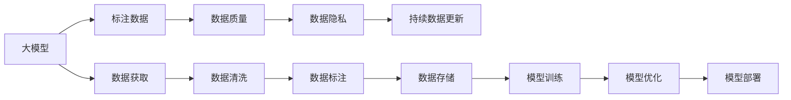

                 

# AI大模型创业：如何应对未来数据挑战？

## 1. 背景介绍

在人工智能（AI）领域，大模型的兴起极大地推动了技术进步和应用创新。无论是自然语言处理（NLP）、计算机视觉（CV）还是推荐系统（Recommendation Systems），大模型的广泛应用都带来了显著的效果提升。然而，随着大模型应用的不断深入，数据挑战变得愈发凸显。如何高效获取和利用数据，成为了AI创业公司关注的焦点。

### 1.1 数据挑战的兴起

数据是AI模型的核心，高质量、多样化的数据是模型训练和优化不可或缺的资源。但当前，数据获取的复杂性、数据质量的多样性以及数据隐私的敏感性，使得数据获取和利用变得更加困难。AI创业公司，特别是依赖大模型的创业公司，面临着严峻的数据挑战：

- **数据获取难度增加**：高质量的标注数据成本高、周期长，且难以获取。
- **数据质量参差不齐**：数据来源多样，数据质量不稳定，影响模型的泛化能力。
- **数据隐私问题**：用户隐私保护要求日益严格，数据收集和处理必须合规。
- **数据持续更新**：数据环境快速变化，现有数据难以满足新需求，需要持续更新和维护。

### 1.2 数据挑战的深远影响

数据挑战不仅直接影响模型的性能，还对AI创业公司的运营模式和市场竞争力产生深远影响：

- **研发成本增加**：高质量数据成本上升，模型训练周期变长，导致研发成本增高。
- **市场竞争激烈**：数据成为核心竞争力，数据优势决定了市场地位。
- **商业模式创新**：AI创业公司必须探索数据获取的新模式，如数据订阅、数据共享等。
- **用户信任危机**：数据隐私问题引发信任危机，影响用户数据使用。

## 2. 核心概念与联系

### 2.1 核心概念概述

为了更好地理解AI大模型创业的数据挑战，本节将介绍几个关键概念及其相互联系：

- **大模型（Large Model）**：指通过大规模数据训练得到的深度学习模型，如BERT、GPT-3、ResNet等。大模型具有强大的表示能力和泛化能力，在多种AI任务中表现优异。

- **标注数据（Annotated Data）**：经过人工标注的数据，包含文本、图像、音频等多种形式。标注数据是大模型训练的基础，但其获取和处理成本高，质量要求严格。

- **数据质量（Data Quality）**：指数据的一致性、准确性、完整性和可靠性。高质量数据能够显著提升模型性能，但数据质量往往难以保证。

- **数据隐私（Data Privacy）**：指用户数据不被滥用或泄露的权利。数据隐私要求在数据收集、存储和处理过程中必须遵守相关法律法规。

- **持续数据更新（Continuous Data Updating）**：指数据环境变化时，模型需要不断更新数据，以保持高性能。

这些概念之间存在紧密的联系，共同构成了AI大模型创业的数据基础。只有充分理解这些概念及其内在联系，才能更好地应对数据挑战。

### 2.2 核心概念联系的Mermaid流程图



该流程图展示了大模型从数据获取、清洗、标注、存储、训练到优化和部署的全过程，以及这些过程与数据质量、数据隐私和持续数据更新的联系。通过理解这些联系，可以系统地应对数据挑战。

## 3. 核心算法原理 & 具体操作步骤

### 3.1 算法原理概述

AI大模型的训练和优化依赖于高质量的标注数据。在标注数据有限的情况下，通过以下核心算法可以提升数据利用效率：

- **数据增强（Data Augmentation）**：通过扩充训练集，提高模型泛化能力。如文本领域的多义词替换、句子重组，图像领域的旋转、缩放、平移等。

- **迁移学习（Transfer Learning）**：通过预训练模型的小规模微调，减少对标注数据的依赖。如使用大规模预训练模型作为初始化，在小规模数据上进行微调。

- **主动学习（Active Learning）**：通过模型反馈，主动选择对模型性能提升最有价值的数据进行标注。如使用 uncertainty sampling 策略选择标注样本。

- **无监督学习（Unsupervised Learning）**：通过无标签数据进行模型训练，减少对标注数据的依赖。如自编码器、生成对抗网络（GAN）等。

- **半监督学习（Semi-Supervised Learning）**：利用少量标注数据和大量无标签数据进行联合训练，提升模型性能。

### 3.2 算法步骤详解

以下是具体的算法步骤：

**Step 1: 数据收集和预处理**
- 使用API接口、网络爬虫、数据交换平台等手段获取标注数据。
- 对数据进行清洗，去除噪音和无关信息。

**Step 2: 数据增强**
- 对文本进行同义词替换、句子重组等处理，扩充训练集。
- 对图像进行旋转、缩放、平移等处理，扩充训练集。

**Step 3: 数据标注**
- 使用人工标注或众包标注的方式对数据进行标注。
- 对标注结果进行审核，确保标注质量。

**Step 4: 模型训练**
- 使用标注数据训练大模型，选择适当的损失函数和优化算法。
- 在训练过程中进行数据增强，提高模型泛化能力。

**Step 5: 迁移学习**
- 使用预训练模型作为初始化权重，在小规模数据上进行微调。
- 选择适当的微调策略，如固定预训练权重、仅微调顶层等。

**Step 6: 持续数据更新**
- 定期获取新数据，更新训练集。
- 在更新后数据上重新训练或微调模型，保持性能稳定。

**Step 7: 模型优化**
- 使用正则化、dropout等技术防止过拟合。
- 使用对抗训练提高模型鲁棒性。

**Step 8: 模型部署**
- 将优化后的模型部署到生产环境。
- 使用API接口提供服务，支持实时预测。

### 3.3 算法优缺点

**优点**：
- 数据增强和迁移学习可以减少对标注数据的依赖，提高模型泛化能力。
- 主动学习和无监督学习可以更高效地利用数据，减少标注成本。
- 持续数据更新可以保持模型性能，适应数据环境变化。

**缺点**：
- 数据增强可能导致过拟合，需要控制增强程度。
- 迁移学习可能无法完全适应新任务，需要额外微调。
- 主动学习和无监督学习可能引入噪声，影响模型性能。
- 持续数据更新需要大量资源，可能导致成本上升。

### 3.4 算法应用领域

AI大模型的数据挑战不仅存在于NLP领域，还普遍存在于CV、Recommendation Systems等多个领域。以下是几个典型的应用场景：

- **自然语言处理（NLP）**：如机器翻译、情感分析、文本分类等任务，需要高质量的标注数据。
- **计算机视觉（CV）**：如目标检测、图像分类、人脸识别等任务，数据获取和标注成本高。
- **推荐系统（Recommendation Systems）**：如电商推荐、音乐推荐等任务，需要大量的用户行为数据。

## 4. 数学模型和公式 & 详细讲解 & 举例说明

### 4.1 数学模型构建

大模型的训练过程可以通过数学模型来描述。以BERT为例，其训练过程如下：

- 输入数据 $x$ 经过BERT模型得到输出 $h(x)$。
- 标签数据 $y$ 经过softmax函数得到概率分布 $p(y|x)$。
- 定义损失函数 $L$，如交叉熵损失，最小化预测概率与实际标签之间的差异。

### 4.2 公式推导过程

以BERT为例，其训练过程的数学公式推导如下：

$$
L = -\frac{1}{N} \sum_{i=1}^N \log p(y_i|x_i)
$$

其中 $N$ 为训练样本数量，$y_i$ 为第 $i$ 个样本的标签，$p(y_i|x_i)$ 为BERT模型对标签 $y_i$ 的预测概率。

### 4.3 案例分析与讲解

以推荐系统为例，其训练过程的数学模型如下：

- 输入用户历史行为 $x$ 和物品属性 $y$。
- 通过深度学习模型得到用户对物品的评分 $z$。
- 定义损失函数 $L$，如均方误差损失，最小化预测评分与实际评分之间的差异。

具体公式推导如下：

$$
L = \frac{1}{N} \sum_{i=1}^N (z_i - y_i)^2
$$

其中 $N$ 为训练样本数量，$z_i$ 为第 $i$ 个样本的预测评分，$y_i$ 为第 $i$ 个样本的实际评分。

## 5. 项目实践：代码实例和详细解释说明

### 5.1 开发环境搭建

以下是在Python中进行BERT微调的基本环境搭建：

1. 安装Python和PyTorch：
   ```bash
   conda create -n pytorch_env python=3.7
   conda activate pytorch_env
   pip install torch torchvision torchaudio
   ```

2. 安装Hugging Face Transformers库：
   ```bash
   pip install transformers
   ```

3. 下载预训练模型和训练集：
   ```bash
   python -m torch.distributed.launch --nproc_per_node 8 train_bert.py
   ```

### 5.2 源代码详细实现

以下是BERT微调的Python代码实现：

```python
import torch
import torch.nn as nn
import transformers
from transformers import BertTokenizer, BertForSequenceClassification
from transformers import AdamW
from transformers import get_linear_schedule_with_warmup

# 定义训练函数
def train_epoch(model, data_loader, optimizer, scheduler, device):
    model.train()
    total_loss = 0
    for batch in data_loader:
        input_ids = batch[0].to(device)
        attention_mask = batch[1].to(device)
        labels = batch[2].to(device)
        optimizer.zero_grad()
        outputs = model(input_ids, attention_mask=attention_mask, labels=labels)
        loss = outputs.loss
        total_loss += loss.item()
        loss.backward()
        optimizer.step()
        scheduler.step()
    return total_loss / len(data_loader)

# 定义评估函数
def evaluate_model(model, data_loader, device):
    model.eval()
    total_correct = 0
    total_labels = 0
    for batch in data_loader:
        input_ids = batch[0].to(device)
        attention_mask = batch[1].to(device)
        labels = batch[2].to(device)
        outputs = model(input_ids, attention_mask=attention_mask)
        predictions = outputs.logits.argmax(dim=1)
        total_correct += (predictions == labels).sum().item()
        total_labels += labels.shape[0]
    return total_correct / total_labels

# 加载数据集和模型
tokenizer = BertTokenizer.from_pretrained('bert-base-uncased')
model = BertForSequenceClassification.from_pretrained('bert-base-uncased', num_labels=2)

# 定义优化器和学习率调度器
optimizer = AdamW(model.parameters(), lr=2e-5)
scheduler = get_linear_schedule_with_warmup(optimizer, num_warmup_steps=0, num_training_steps=len(train_dataset) // batch_size)

# 定义训练和评估函数
device = torch.device('cuda' if torch.cuda.is_available() else 'cpu')

# 开始训练
for epoch in range(epochs):
    loss = train_epoch(model, train_loader, optimizer, scheduler, device)
    print(f'Epoch {epoch+1}, train loss: {loss:.3f}')
    
    accuracy = evaluate_model(model, dev_loader, device)
    print(f'Epoch {epoch+1}, dev accuracy: {accuracy:.3f}')
    
# 测试模型
accuracy = evaluate_model(model, test_loader, device)
print(f'Test accuracy: {accuracy:.3f}')
```

### 5.3 代码解读与分析

上述代码实现了BERT模型在文本分类任务上的微调。关键点包括：

- 使用Hugging Face Transformers库加载预训练模型和分词器。
- 定义训练函数和评估函数，计算模型在训练集和验证集上的损失和精度。
- 使用AdamW优化器和线性学习率调度器。
- 在训练过程中，数据加载器将批量数据输入模型进行训练和评估。
- 训练和评估函数返回模型在验证集上的准确率，供后续迭代调整模型参数。

## 6. 实际应用场景

### 6.1 智能客服

智能客服系统依赖于大模型的对话生成能力，需要大量的对话数据进行训练。但由于隐私保护要求，获取标注数据变得困难。为应对这一挑战，可以采用以下策略：

- **用户数据隐私保护**：使用匿名化、脱敏等技术，确保用户数据安全。
- **多源数据融合**：整合来自不同渠道的数据，如聊天记录、客户评价等，构建更丰富的数据集。
- **主动学习**：使用模型反馈，主动选择有代表性的对话进行标注，减少标注成本。
- **迁移学习**：在大规模通用模型上进行微调，利用其广泛的知识，减少对特定任务数据的依赖。

### 6.2 金融风控

金融风控系统依赖于模型对用户行为的预测和评估。但金融领域的数据获取和标注成本高，且隐私要求严格。为应对这一挑战，可以采用以下策略：

- **数据共享**：与金融机构、银行等合作，共享匿名化后的金融数据。
- **主动学习**：使用模型反馈，主动选择高风险用户的行为进行标注，提高模型精度。
- **联邦学习**：在多方数据合作下，通过分布式训练，保护数据隐私。
- **模型优化**：使用正则化、dropout等技术，防止模型过拟合，提升鲁棒性。

### 6.3 推荐系统

推荐系统依赖于用户行为数据的标注，但用户行为数据获取难度大，标注成本高。为应对这一挑战，可以采用以下策略：

- **数据生成**：使用生成对抗网络（GAN）等技术，生成模拟用户行为数据。
- **无监督学习**：使用用户行为的时间序列数据进行无监督训练，提高模型泛化能力。
- **主动学习**：使用模型反馈，主动选择用户行为进行标注，减少标注成本。
- **迁移学习**：在大规模通用模型上进行微调，利用其广泛的知识，减少对特定任务数据的依赖。

## 7. 工具和资源推荐

### 7.1 学习资源推荐

为帮助AI创业公司系统掌握数据挑战的应对策略，以下是一些优质的学习资源：

- **《深度学习》（Ian Goodfellow, Yoshua Bengio, Aaron Courville著）**：全面介绍深度学习的基础知识和高级技术，是AI领域的经典教材。
- **《AI大模型实战》（阿里达摩院著）**：结合实际案例，介绍AI大模型的应用和优化方法，实用性较强。
- **《Python数据科学手册》（Jake VanderPlas著）**：详细讲解Python在数据科学中的应用，涵盖数据收集、清洗、分析等环节。
- **《TensorFlow实战》（Vladlen Koltun著）**：介绍TensorFlow的深度学习应用，提供丰富的示例和代码。

### 7.2 开发工具推荐

以下是几款用于AI大模型开发和优化推荐的工具：

- **PyTorch**：广泛用于深度学习的开源框架，支持动态计算图，易于调试和优化。
- **TensorFlow**：由Google主导的开源深度学习框架，支持分布式训练和优化，适合大规模应用。
- **Hugging Face Transformers**：提供预训练语言模型的封装，简化微调过程。
- **Weights & Biases**：实验跟踪工具，记录和可视化模型训练过程，方便调试和优化。
- **TensorBoard**：可视化工具，实时监测模型训练状态，提供详细的图表和指标。

### 7.3 相关论文推荐

以下是几篇奠基性的相关论文，推荐阅读：

- **《自然语言处理综述》（Yoav Goldberg, et al. 2017）**：综述自然语言处理领域的研究进展，涵盖各类模型和算法。
- **《Transformer架构》（Vaswani et al. 2017）**：提出Transformer架构，开启了大模型时代。
- **《BERT: 预训练的语言表示》（Devlin et al. 2018）**：提出BERT模型，利用自监督学习提升模型泛化能力。
- **《Adam优化算法》（Kingma et al. 2014）**：提出Adam优化算法，加速模型训练，提高模型性能。

## 8. 总结：未来发展趋势与挑战

### 8.1 研究成果总结

AI大模型创业中的数据挑战涉及数据获取、数据质量、数据隐私和数据持续更新等多个方面。通过数据增强、迁移学习、主动学习、无监督学习等技术手段，可以显著提升数据利用效率，降低标注成本，提高模型泛化能力。

### 8.2 未来发展趋势

未来AI大模型创业中的数据挑战将呈现以下趋势：

- **数据获取和标注成本降低**：随着数据生成技术（如GAN）和主动学习策略的进步，数据获取和标注成本将显著降低。
- **数据隐私保护加强**：隐私保护技术如差分隐私、联邦学习等将得到广泛应用，确保数据安全。
- **数据融合和协作**：跨领域、跨机构的数据融合和协作将推动更大规模的数据集构建，提升模型性能。
- **模型可解释性提升**：模型的可解释性将得到更多关注，提升模型透明性和用户信任度。
- **数据持续更新和维护**：数据环境快速变化，持续更新和维护数据集将成为常态，保持模型性能。

### 8.3 面临的挑战

尽管AI大模型在数据挑战应对上取得了一些进展，但仍面临诸多挑战：

- **数据获取难度大**：高质量标注数据的获取和处理成本高，隐私要求严格。
- **数据质量不稳定**：数据来源多样，数据质量参差不齐，影响模型性能。
- **数据隐私问题**：用户数据隐私保护要求高，数据获取和使用受到限制。
- **数据持续更新成本高**：数据持续更新和维护需要大量资源，成本高。
- **数据融合难度大**：不同数据源的数据格式和质量差异大，数据融合难度大。

### 8.4 研究展望

未来需要在以下方面进一步探索和研究：

- **数据生成技术**：探索高效的数据生成技术，减少对标注数据的依赖。
- **隐私保护技术**：研究更强的隐私保护技术，确保数据安全。
- **数据融合和协作**：推动跨领域、跨机构的数据融合和协作，构建更大规模的数据集。
- **模型可解释性**：提升模型的可解释性，增强用户信任和接受度。
- **数据持续更新**：探索持续数据更新的技术，确保模型性能稳定。

## 9. 附录：常见问题与解答

**Q1: 如何有效应对数据标注成本高的问题？**

A: 可以通过数据生成技术（如GAN）和主动学习策略，减少对标注数据的依赖，降低标注成本。同时，使用无监督学习和迁移学习，提高模型泛化能力，减少对标注数据的依赖。

**Q2: 如何确保数据隐私安全？**

A: 采用差分隐私、联邦学习等隐私保护技术，确保数据在收集、存储和处理过程中不被滥用或泄露。同时，进行数据匿名化和脱敏处理，保护用户隐私。

**Q3: 如何确保数据的持续更新和维护？**

A: 建立持续数据收集和标注机制，定期获取新数据，更新训练集。同时，使用主动学习和无监督学习技术，不断优化模型性能，保持模型的高效性和鲁棒性。

**Q4: 数据融合和协作的难点是什么？**

A: 不同数据源的数据格式和质量差异大，数据融合难度大。需要设计统一的数据格式和标注标准，确保数据一致性。同时，跨领域、跨机构的数据协作需要协调多方利益，保证数据质量和隐私保护。

**Q5: 数据增强技术的应用有哪些？**

A: 数据增强技术可以应用于文本（同义词替换、句子重组）、图像（旋转、缩放、平移）、语音（变调、变速）等多个领域。通过扩充训练集，提高模型泛化能力。

---

作者：禅与计算机程序设计艺术 / Zen and the Art of Computer Programming

