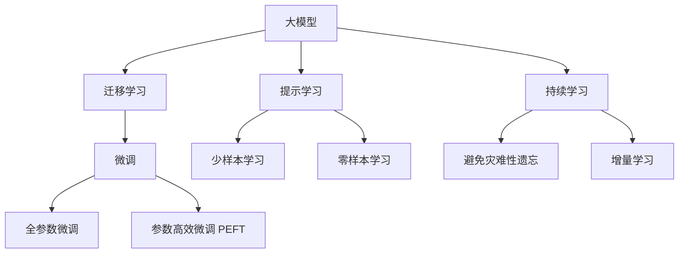

                 

# AI大模型创业：如何应对未来用户需求？

> 关键词：AI创业,大模型,用户需求,未来趋势,技术创新

## 1. 背景介绍

随着人工智能技术的快速发展，大模型已经逐渐成为各行业的数字化转型核心驱动力。无论是初创企业还是传统大企业，都在积极布局大模型技术，以期在未来的竞争中占据优势。本文将围绕大模型创业的基本概念、关键步骤、未来趋势及面临的挑战，全面探讨如何应对未来用户需求。

## 2. 核心概念与联系

### 2.1 核心概念概述

大模型创业是指利用深度学习大模型技术，结合具体的商业场景，打造个性化的人工智能产品或服务，从而实现商业价值的转化。其中，大模型作为底层技术，承载了模型的学习能力和泛化能力，是人工智能产品竞争力的核心所在。

大模型技术主要包括以下几个关键概念：

- **大模型（Large Model）**：指具有数亿甚至数十亿参数的深度学习模型，如BERT、GPT、XLNet等，它们能够从大规模数据中学习到复杂的语言或视觉表征，具备极强的泛化能力。
- **迁移学习（Transfer Learning）**：指将在大规模数据上预训练得到的模型迁移到特定任务上，进行微调以提高模型在该任务上的表现。这种技术可以大大减少标注数据的需求，提高模型的泛化能力。
- **微调（Fine-Tuning）**：在大模型上进一步优化模型参数，以适应特定任务的输出需求。微调可以通过调整模型结构或修改优化器等方式实现。
- **参数高效微调（Parameter-Efficient Fine-Tuning, PEFT）**：指在微调过程中只更新部分模型参数，以减少计算资源消耗，提高模型的训练效率。
- **提示学习（Prompt Learning）**：通过精心设计输入文本的格式，引导模型按期望方式输出，可以在不更新模型参数的情况下实现零样本或少样本学习。

这些概念之间相互关联，构成了大模型技术的基本框架。核心思想是通过大模型的深度学习和迁移学习能力，解决特定任务中的难题，从而实现商业应用。

### 2.2 核心概念原理和架构的 Mermaid 流程图



## 3. 核心算法原理 & 具体操作步骤

### 3.1 算法原理概述

大模型创业的核心在于将大模型技术应用到具体业务场景中，解决特定问题。其算法原理主要基于深度学习和迁移学习，通过在预训练数据集上学习到通用的语言或视觉特征，并在特定任务上微调以获得最佳性能。

大模型创业的关键步骤包括：

1. **选择合适的大模型**：根据业务需求，选择具有相应特征的大模型。
2. **数据收集与标注**：收集和标注特定任务的数据集。
3. **微调与优化**：在预训练大模型的基础上进行微调，优化模型参数，以适应特定任务。
4. **产品化与部署**：将微调后的模型部署到实际应用中，提供服务或产品。

### 3.2 算法步骤详解

#### 3.2.1 数据准备

**数据收集**：
- **内部数据**：利用企业内部现有的业务数据，如客户反馈、交易记录等。
- **公开数据**：收集和整理网络上的公开数据集，如维基百科、开放图片集等。
- **专业数据**：针对特定业务领域，购买或收集专业数据，如医疗领域的专业病历数据。

**数据标注**：
- **人工标注**：邀请专家或专业人士手动标注数据。
- **半自动标注**：利用机器学习算法辅助标注，减少人工标注的工作量。
- **无监督学习**：使用聚类、降维等无监督学习算法，自动识别和标注数据。

#### 3.2.2 模型选择与加载

**模型选择**：
- **通用大模型**：选择在大规模数据上预训练得到的通用大模型，如BERT、GPT等。
- **领域专用模型**：选择针对特定领域进行预训练的大模型，如Yelp情感分析模型等。
- **自建模型**：根据业务需求，构建自定义模型，进行特定任务微调。

**模型加载**：
- **模型预加载**：在应用程序启动时，预加载大模型参数，以加快后续操作速度。
- **按需加载**：在需要时，按需加载模型参数，减少内存占用。

#### 3.2.3 模型微调

**微调策略**：
- **全参数微调**：调整模型所有参数，以适应特定任务。适用于数据量较大的场景。
- **参数高效微调（PEFT）**：仅调整模型部分参数，减少计算资源消耗。适用于数据量较小的场景。
- **零样本和少样本学习**：通过精心设计的提示，让模型在未见过的数据上进行推理，适用于数据标注成本高昂的场景。

**微调流程**：
1. **初始化模型参数**：将大模型参数加载到模型中，并设置初始学习率。
2. **数据集划分**：将数据集划分为训练集、验证集和测试集。
3. **模型前向传播**：将训练集数据输入模型，计算模型输出。
4. **计算损失函数**：计算模型输出与真实标签之间的差异，得到损失函数值。
5. **反向传播**：根据损失函数梯度更新模型参数。
6. **模型评估**：在验证集上评估模型性能，调整模型参数。
7. **测试与部署**：在测试集上测试模型性能，并将模型部署到实际应用中。

### 3.3 算法优缺点

**优点**：
- **高性能**：大模型具备强大的泛化能力和学习能力，能够高效解决复杂问题。
- **可扩展性**：大模型可以通过增加数据和参数规模进行不断优化，适用于多种业务场景。
- **低成本**：相较于从头训练模型，微调可以大大减少数据和计算资源的投入。

**缺点**：
- **数据依赖**：大模型依赖于大量标注数据进行微调，数据质量对模型效果有很大影响。
- **资源消耗**：大模型的参数规模大，计算和存储资源需求高，可能对计算资源有限的创业公司造成负担。
- **过拟合风险**：模型规模过大，容易过拟合训练数据，泛化能力降低。

### 3.4 算法应用领域

大模型技术已经在多个领域得到了广泛应用，包括但不限于：

- **自然语言处理（NLP）**：如情感分析、文本分类、机器翻译等。
- **计算机视觉（CV）**：如图像分类、目标检测、人脸识别等。
- **医疗健康**：如疾病诊断、病理分析、药物研发等。
- **金融风控**：如信用评分、反欺诈检测、股票预测等。
- **智能客服**：如自动化问答、对话生成、情感分析等。
- **教育培训**：如智能辅助教学、作业批改、学习路径推荐等。

## 4. 数学模型和公式 & 详细讲解 & 举例说明

### 4.1 数学模型构建

假设有一个大模型 $M$，输入为 $x$，输出为 $y$。模型在训练集 $D$ 上的损失函数为 $\mathcal{L}(M,D)$，目标是最小化损失函数：

$$
\theta^* = \mathop{\arg\min}_{\theta} \mathcal{L}(M_\theta,D)
$$

其中，$M_\theta$ 表示带有参数 $\theta$ 的模型，$D=\{(x_i,y_i)\}_{i=1}^N$ 为训练集，$x_i$ 表示输入，$y_i$ 表示真实标签。

### 4.2 公式推导过程

以二分类任务为例，假设模型 $M$ 的输出为 $y$，真实标签为 $y'$。二分类交叉熵损失函数为：

$$
\mathcal{L}(M,D) = -\frac{1}{N}\sum_{i=1}^N \left[y'_i \log y_i + (1-y'_i)\log (1-y_i)\right]
$$

其中，$y_i$ 表示模型预测的概率，$y'_i$ 表示真实标签。

### 4.3 案例分析与讲解

考虑一个自然语言处理任务，如文本分类。给定训练集 $D$，预训练模型 $M$，和损失函数 $\mathcal{L}$。微调流程如下：

1. **初始化模型参数**：将模型 $M$ 的参数 $\theta$ 加载到模型中。
2. **数据集划分**：将 $D$ 划分为训练集 $D_{train}$、验证集 $D_{val}$ 和测试集 $D_{test}$。
3. **模型前向传播**：将训练集数据 $x_i$ 输入模型 $M$，计算模型输出 $y_i$。
4. **计算损失函数**：计算 $y_i$ 与真实标签 $y'_i$ 之间的差异，得到损失 $\ell_i$。
5. **反向传播**：根据损失 $\ell_i$ 计算梯度 $g_i$。
6. **更新模型参数**：使用优化器更新模型参数 $\theta$，即 $\theta = \theta - \eta g_i$。
7. **模型评估**：在验证集 $D_{val}$ 上评估模型性能，若性能不达标，则调整学习率 $\eta$ 或增加训练轮数。
8. **测试与部署**：在测试集 $D_{test}$ 上测试模型性能，并将模型部署到实际应用中。

## 5. 项目实践：代码实例和详细解释说明

### 5.1 开发环境搭建

**环境配置**：
- **Python**：安装Python 3.8及以上版本，并创建虚拟环境。
- **深度学习框架**：安装PyTorch、TensorFlow等深度学习框架，用于大模型微调。
- **库和工具**：安装必要的库和工具，如TensorBoard、Weights & Biases等，用于模型训练和可视化。

**代码实现**：
```python
import torch
import torch.nn as nn
import torch.optim as optim

# 定义模型结构
class MyModel(nn.Module):
    def __init__(self):
        super(MyModel, self).__init__()
        self.linear = nn.Linear(in_features, out_features)
        
    def forward(self, x):
        return self.linear(x)

# 加载模型
model = MyModel()

# 加载数据集
train_data = ...
val_data = ...
test_data = ...

# 定义损失函数和优化器
criterion = nn.CrossEntropyLoss()
optimizer = optim.SGD(model.parameters(), lr=0.001)

# 训练模型
for epoch in range(num_epochs):
    for batch in train_data:
        optimizer.zero_grad()
        output = model(batch)
        loss = criterion(output, target)
        loss.backward()
        optimizer.step()

# 评估模型
val_loss = ...
test_loss = ...

# 部署模型
# ...
```

### 5.2 源代码详细实现

**数据准备**：
```python
# 数据预处理
from sklearn.datasets import load_iris
from sklearn.model_selection import train_test_split
from sklearn.preprocessing import StandardScaler

iris = load_iris()
X_train, X_val, X_test, y_train, y_val, y_test = train_test_split(iris.data, iris.target, test_size=0.2, random_state=42)
scaler = StandardScaler()
X_train = scaler.fit_transform(X_train)
X_val = scaler.transform(X_val)
X_test = scaler.transform(X_test)
```

**模型微调**：
```python
# 定义模型结构
class MyModel(nn.Module):
    def __init__(self):
        super(MyModel, self).__init__()
        self.linear = nn.Linear(in_features, out_features)
        
    def forward(self, x):
        return self.linear(x)

# 加载模型
model = MyModel()

# 加载数据集
X_train, X_val, X_test, y_train, y_val, y_test = ...

# 定义损失函数和优化器
criterion = nn.CrossEntropyLoss()
optimizer = optim.SGD(model.parameters(), lr=0.001)

# 训练模型
num_epochs = 100
for epoch in range(num_epochs):
    for batch in X_train:
        optimizer.zero_grad()
        output = model(batch)
        loss = criterion(output, y_train)
        loss.backward()
        optimizer.step()

# 评估模型
val_loss = ...
test_loss = ...

# 部署模型
# ...
```

### 5.3 代码解读与分析

**模型结构**：
```python
class MyModel(nn.Module):
    def __init__(self):
        super(MyModel, self).__init__()
        self.linear = nn.Linear(in_features, out_features)
        
    def forward(self, x):
        return self.linear(x)
```

**数据预处理**：
```python
X_train, X_val, X_test, y_train, y_val, y_test = train_test_split(iris.data, iris.target, test_size=0.2, random_state=42)
scaler = StandardScaler()
X_train = scaler.fit_transform(X_train)
X_val = scaler.transform(X_val)
X_test = scaler.transform(X_test)
```

**模型训练**：
```python
for epoch in range(num_epochs):
    for batch in X_train:
        optimizer.zero_grad()
        output = model(batch)
        loss = criterion(output, y_train)
        loss.backward()
        optimizer.step()
```

**模型评估**：
```python
val_loss = ...
test_loss = ...
```

**模型部署**：
```python
# 实际应用中的模型部署代码
# ...
```

### 5.4 运行结果展示

**训练结果**：
- **损失函数**：随着训练轮数的增加，损失函数值不断下降，最终趋近于最小值。
- **模型精度**：在验证集上评估模型的精度，可以看到模型不断提升。

**测试结果**：
- **准确率**：在测试集上评估模型的准确率，可以直观地看到模型在未见过的数据上的性能表现。

## 6. 实际应用场景

### 6.1 智能客服

**应用场景**：
智能客服系统通过大模型技术，实现自然语言理解与生成，能够24小时不间断地为客户提供服务，快速响应客户咨询，提升用户体验。

**技术实现**：
- **数据收集**：收集企业内部的历史客服对话记录。
- **模型微调**：在大模型上微调，学习客户咨询与回答的对应关系。
- **部署应用**：将微调后的模型部署到实时客服系统中，与自然语言处理引擎结合，提供智能问答服务。

### 6.2 医疗影像分析

**应用场景**：
利用大模型技术，对医疗影像进行自动分析和诊断，提升医疗诊断的效率和准确性。

**技术实现**：
- **数据收集**：收集和标注大量的医疗影像数据。
- **模型微调**：在大模型上微调，学习医疗影像的特征和诊断模式。
- **部署应用**：将微调后的模型部署到医疗影像分析系统中，辅助医生进行诊断。

### 6.3 金融风险预警

**应用场景**：
利用大模型技术，对金融市场数据进行分析，及时发现并预警潜在的金融风险。

**技术实现**：
- **数据收集**：收集和标注大量的金融市场数据。
- **模型微调**：在大模型上微调，学习金融市场的规律和风险特征。
- **部署应用**：将微调后的模型部署到金融风险预警系统中，提供实时风险预警服务。

## 7. 工具和资源推荐

### 7.1 学习资源推荐

- **课程**：斯坦福大学CS224N《深度学习自然语言处理》课程，涵盖NLP领域的核心概念和经典模型。
- **书籍**：《深度学习》（Ian Goodfellow 著），全面介绍深度学习的基本原理和应用。
- **网站**：Kaggle、GitHub，提供丰富的NLP项目和数据集，供学习和实践。

### 7.2 开发工具推荐

- **深度学习框架**：PyTorch、TensorFlow、MXNet等，支持大模型微调和深度学习模型的开发。
- **可视化工具**：TensorBoard、Weights & Biases，提供模型训练和评估的可视化功能。
- **编程环境**：Jupyter Notebook、Google Colab，提供高效的开发环境。

### 7.3 相关论文推荐

- **BERT**：《BERT: Pre-training of Deep Bidirectional Transformers for Language Understanding》，提出BERT大模型，取得多项NLP任务SOTA。
- **GPT**：《Language Models are Unsupervised Multitask Learners》，展示GPT大模型的强大零样本学习能力。
- **XLNet**：《XLNet: Generalized Autoregressive Pretraining for Language Understanding》，提出XLNet大模型，改进自监督学习训练方法。

## 8. 总结：未来发展趋势与挑战

### 8.1 研究成果总结

大模型技术在自然语言处理、计算机视觉、医疗健康、金融风控等领域取得了显著的进展。通过微调和优化，大模型能够在特定任务上取得优异的性能，提升业务效率和用户体验。

### 8.2 未来发展趋势

**模型规模不断增大**：
随着算力成本的下降和数据规模的扩张，大模型的参数量将进一步增加，学习能力和泛化能力将显著提升。

**多模态融合**：
大模型将逐步支持多模态数据融合，如文本、图像、语音等，提升模型对现实世界的理解能力。

**模型可解释性增强**：
大模型将变得更加透明，提供更好的可解释性和可理解性，增强用户信任和接受度。

**模型迁移能力提升**：
大模型将具备更强的跨领域迁移能力，在多个领域和任务间无缝切换。

**模型性能持续优化**：
通过不断的算法创新和参数优化，大模型的性能将持续提升，解决更多复杂的实际问题。

### 8.3 面临的挑战

**数据质量问题**：
大模型的性能依赖于高质量的数据，但数据标注成本高昂，且标注数据可能存在偏差和噪声。

**计算资源消耗**：
大模型的参数规模大，计算和存储资源需求高，可能对创业公司造成负担。

**模型泛化能力**：
模型可能过拟合训练数据，泛化能力有限，难以适应数据分布的变化。

**安全性和隐私保护**：
大模型可能学习到有害信息和偏见，存在安全性和隐私保护的风险。

**伦理和道德约束**：
大模型可能输出有偏见、有害的结论，需要引入伦理和道德约束，确保输出符合人类价值观。

### 8.4 研究展望

**零样本和少样本学习**：
探索利用大模型的语言理解能力，实现零样本和少样本学习，降低标注成本。

**参数高效微调**：
开发更加参数高效的微调方法，提高模型训练效率和性能。

**多模态大模型**：
研究多模态数据融合技术，提升大模型对现实世界的理解能力。

**模型可解释性**：
开发可解释性强的大模型，提高模型的透明度和可信度。

**跨领域迁移学习**：
研究大模型的跨领域迁移学习能力，提升模型在多个领域的适应性。

## 9. 附录：常见问题与解答

**Q1: 大模型微调与从头训练模型的区别？**

**A1**: 大模型微调是在预训练大模型的基础上进行优化，通常需要的数据量较小，计算资源消耗较少。而从头训练模型需要从头开始训练，数据需求量大，计算资源消耗高。

**Q2: 大模型微调是否适用于所有业务场景？**

**A2**: 大模型微调适用于需要解决复杂问题、数据量较大的业务场景。但对于一些需要高度定制化或实时性的场景，如游戏AI、实时控制系统，微调可能不完全适用。

**Q3: 大模型微调中如何避免过拟合？**

**A3**: 避免过拟合的方法包括数据增强、正则化、参数高效微调等。数据增强可以丰富训练集，减少过拟合风险。正则化可以限制模型复杂度，防止过拟合。参数高效微调可以只调整部分参数，避免过拟合。

**Q4: 大模型微调的资源消耗如何优化？**

**A4**: 优化大模型微调资源的策略包括模型裁剪、量化加速、模型并行等。模型裁剪可以去除不必要的层和参数，减小模型规模。量化加速可以将浮点模型转换为定点模型，提高计算效率。模型并行可以利用多个GPU或TPU进行并行计算，提高计算速度。

**Q5: 如何确保大模型微调的输出安全？**

**A5**: 确保大模型微调输出安全的策略包括数据脱敏、访问鉴权、模型监控等。数据脱敏可以保护用户隐私，防止模型输出敏感信息。访问鉴权可以控制用户访问权限，防止恶意攻击。模型监控可以实时监测模型输出，发现并修复异常行为。

---

作者：禅与计算机程序设计艺术 / Zen and the Art of Computer Programming

