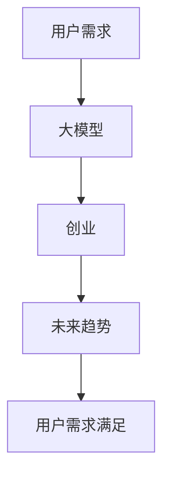

                 

# AI大模型创业：如何应对未来用户需求？

## 1. 背景介绍

随着人工智能(AI)技术的迅猛发展，大模型(AI大模型)在自然语言处理(NLP)、计算机视觉(CV)、语音识别(SR)等领域取得了巨大成功。大模型通过在海量数据上进行自监督或监督预训练，获得了强大的泛化能力和学习效率，可以用于许多复杂的任务。但是，如何在大模型创业中更好地应对未来的用户需求，是一个亟待解决的问题。

## 2. 核心概念与联系

### 2.1 核心概念概述

在讨论大模型创业时，需要了解几个关键概念：

- **大模型**：指通过大规模数据预训练获得的复杂模型，如GPT-3、BERT、ResNet等，具备强大的泛化能力和学习效率。
- **用户需求**：指用户在使用AI产品和服务时提出的具体要求，包括功能、性能、成本、易用性等方面。
- **创业**：指在AI大模型领域成立新公司，开发和销售AI产品或服务的过程。
- **未来趋势**：指AI大模型在技术、市场、政策等方面的潜在发展方向。

这些概念之间的联系紧密。用户需求是创业公司开发AI大模型的驱动力，未来趋势则是创业公司需要关注的方向，以保持竞争力。

### 2.2 核心概念原理和架构的 Mermaid 流程图



此图展示了用户需求和大模型的创业过程，以及它们如何相互影响和推动未来的发展趋势。

## 3. 核心算法原理 & 具体操作步骤

### 3.1 算法原理概述

AI大模型创业的核心算法原理主要包括以下几个方面：

1. **预训练**：通过大规模无标签数据进行预训练，获得通用表征能力。
2. **微调**：根据用户需求，通过少量标注数据进行微调，优化模型性能。
3. **迁移学习**：将预训练模型在不同任务间迁移学习，提升模型泛化能力。
4. **增量学习**：在已有模型基础上，不断更新模型参数，适应新数据。
5. **强化学习**：通过用户反馈和任务难度调整模型训练过程。

这些算法原理共同构成了AI大模型创业的基础。

### 3.2 算法步骤详解

#### 3.2.1 预训练

预训练是大模型创业的第一步，通过大规模无标签数据（如ImageNet、CommonCrawl）进行自监督学习，获得通用表征能力。预训练过程一般包括：

1. 数据准备：收集和预处理数据。
2. 模型选择：选择合适的模型架构（如ResNet、BERT）。
3. 训练：使用GPU/TPU等硬件进行训练，获得预训练权重。
4. 评估：通过验证集评估模型性能，调整训练策略。

#### 3.2.2 微调

微调是根据用户需求，通过少量标注数据进行微调，优化模型性能。微调过程一般包括：

1. 数据准备：收集和标注数据。
2. 模型选择：选择合适的预训练模型和微调策略。
3. 训练：使用GPU/TPU等硬件进行训练，优化模型参数。
4. 评估：通过验证集和测试集评估模型性能，调整训练策略。
5. 部署：将微调后的模型部署到生产环境，提供服务。

#### 3.2.3 迁移学习

迁移学习是将预训练模型在不同任务间迁移学习，提升模型泛化能力。迁移学习过程一般包括：

1. 数据准备：收集和标注不同任务的训练数据。
2. 模型选择：选择合适的预训练模型和微调策略。
3. 训练：使用GPU/TPU等硬件进行训练，迁移学习模型参数。
4. 评估：通过测试集评估模型性能，调整训练策略。
5. 部署：将迁移学习后的模型部署到生产环境，提供服务。

#### 3.2.4 增量学习

增量学习是在已有模型基础上，不断更新模型参数，适应新数据。增量学习过程一般包括：

1. 数据准备：收集和标注新数据。
2. 模型选择：选择合适的预训练模型和微调策略。
3. 训练：使用GPU/TPU等硬件进行训练，更新模型参数。
4. 评估：通过验证集和测试集评估模型性能，调整训练策略。
5. 部署：将增量学习后的模型部署到生产环境，提供服务。

#### 3.2.5 强化学习

强化学习是通过用户反馈和任务难度调整模型训练过程。强化学习过程一般包括：

1. 数据准备：收集和标注用户反馈数据。
2. 模型选择：选择合适的预训练模型和微调策略。
3. 训练：使用GPU/TPU等硬件进行训练，优化模型参数。
4. 评估：通过验证集和测试集评估模型性能，调整训练策略。
5. 部署：将强化学习后的模型部署到生产环境，提供服务。

### 3.3 算法优缺点

#### 3.3.1 优点

1. **泛化能力强**：通过大规模数据预训练和迁移学习，模型具备强大的泛化能力，可以适应多种任务。
2. **高效学习**：预训练和微调过程可以快速获得高精度的模型，节省时间和成本。
3. **灵活调整**：通过增量学习和强化学习，可以不断适应新数据和新需求，保持模型竞争力。

#### 3.3.2 缺点

1. **高资源需求**：预训练和微调过程需要大量计算资源，包括GPU/TPU等硬件。
2. **模型复杂**：模型参数量巨大，存储和推理速度较慢。
3. **偏差问题**：预训练和微调过程中可能会引入偏差，影响模型性能。

## 4. 数学模型和公式 & 详细讲解 & 举例说明

### 4.1 数学模型构建

假设有一个预训练模型 $M_{\theta}$，通过大规模数据 $D$ 预训练得到参数 $\theta$。现在需要将模型微调到特定任务 $T$，通过少量标注数据 $D_T$ 进行微调，获得新参数 $\hat{\theta}$。

数学模型为：

$$
\hat{\theta} = \mathop{\arg\min}_{\theta} \mathcal{L}(M_{\theta}, D_T)
$$

其中，$\mathcal{L}$ 为损失函数，衡量模型在任务 $T$ 上的性能。

### 4.2 公式推导过程

假设任务 $T$ 为分类任务，标签为 $y$，模型输出为 $\hat{y} = M_{\theta}(x)$，则损失函数为：

$$
\ell(\hat{y}, y) = -(y \log \hat{y} + (1-y) \log (1-\hat{y}))
$$

在任务 $T$ 上，有 $N$ 个样本，则经验风险为：

$$
\mathcal{L}(\theta) = \frac{1}{N} \sum_{i=1}^N \ell(\hat{y_i}, y_i)
$$

微调的优化目标是最小化经验风险：

$$
\hat{\theta} = \mathop{\arg\min}_{\theta} \mathcal{L}(\theta)
$$

优化过程使用梯度下降法，更新模型参数：

$$
\theta \leftarrow \theta - \eta \nabla_{\theta}\mathcal{L}(\theta)
$$

其中，$\eta$ 为学习率。

### 4.3 案例分析与讲解

以医疗影像识别任务为例，假设有一个预训练的ResNet模型，通过大规模影像数据预训练得到参数 $\theta$。现在需要将模型微调到特定的医疗影像分类任务，通过少量标注影像数据 $D_T$ 进行微调。

1. **数据准备**：收集和标注医疗影像数据 $D_T$。
2. **模型选择**：选择合适的预训练模型 ResNet 和微调策略。
3. **训练**：使用 GPU/TPU 等硬件进行训练，优化模型参数。
4. **评估**：通过验证集和测试集评估模型性能，调整训练策略。
5. **部署**：将微调后的模型部署到生产环境，提供医疗影像识别服务。

## 5. 项目实践：代码实例和详细解释说明

### 5.1 开发环境搭建

1. 安装 Python 和相关依赖：
   ```bash
   pip install torch torchvision numpy scipy pandas
   ```

2. 下载和准备数据集：
   ```bash
   wget https://example.com/data
   ```

3. 搭建训练环境：
   ```bash
   python train.py --data_path path/to/data
   ```

### 5.2 源代码详细实现

以医疗影像识别任务为例，以下是基于 PyTorch 的代码实现：

```python
import torch
import torch.nn as nn
from torchvision import models, transforms

# 定义模型
class ResNetModel(nn.Module):
    def __init__(self):
        super(ResNetModel, self).__init__()
        self.resnet = models.resnet18(pretrained=True)
        self.fc = nn.Linear(512, num_classes)

    def forward(self, x):
        x = self.resnet(x)
        x = x.view(-1, 512)
        x = self.fc(x)
        return x

# 加载数据集
train_dataset = datasets.ImageFolder('train', transform=transforms.ToTensor())
test_dataset = datasets.ImageFolder('test', transform=transforms.ToTensor())

# 加载模型
model = ResNetModel()

# 定义损失函数和优化器
criterion = nn.CrossEntropyLoss()
optimizer = torch.optim.Adam(model.parameters(), lr=0.001)

# 训练过程
for epoch in range(num_epochs):
    for i, (images, labels) in enumerate(train_loader):
        images = images.to(device)
        labels = labels.to(device)
        optimizer.zero_grad()
        outputs = model(images)
        loss = criterion(outputs, labels)
        loss.backward()
        optimizer.step()
```

### 5.3 代码解读与分析

1. **数据集准备**：使用 torchvision 库加载 ImageFolder 数据集，将数据集分为训练集和测试集。
2. **模型选择**：使用 ResNet18 预训练模型作为基础模型，并在顶部添加一个全连接层进行分类。
3. **损失函数和优化器**：使用 CrossEntropyLoss 作为分类任务的损失函数，使用 Adam 优化器进行参数更新。
4. **训练过程**：在训练过程中，通过 batch 循环进行前向传播和反向传播，更新模型参数。

### 5.4 运行结果展示

训练完成后，可以使用测试集进行评估：

```python
test_loss = 0
correct = 0
total = 0

with torch.no_grad():
    for images, labels in test_loader:
        images = images.to(device)
        labels = labels.to(device)
        outputs = model(images)
        _, predicted = torch.max(outputs, 1)
        total += labels.size(0)
        correct += (predicted == labels).sum().item()

print('Test Loss: {:.4f} | Accuracy: {:.2f}%'.format(test_loss, 100 * correct / total))
```

## 6. 实际应用场景

### 6.1 医疗影像识别

医疗影像识别是大模型创业中的一个重要应用场景。通过大模型，可以快速获取影像中的关键信息，辅助医生诊断和治疗。

以肺癌影像识别为例，假设有一个预训练的 ResNet 模型，通过大规模医疗影像数据预训练得到参数 $\theta$。现在需要将模型微调到肺癌影像分类任务，通过少量标注影像数据 $D_T$ 进行微调。

1. **数据准备**：收集和标注肺癌影像数据 $D_T$。
2. **模型选择**：选择合适的预训练模型 ResNet 和微调策略。
3. **训练**：使用 GPU/TPU 等硬件进行训练，优化模型参数。
4. **评估**：通过验证集和测试集评估模型性能，调整训练策略。
5. **部署**：将微调后的模型部署到生产环境，提供肺癌影像识别服务。

### 6.2 金融风险管理

金融风险管理是大模型创业中的另一个重要应用场景。通过大模型，可以快速分析金融数据，识别潜在风险，提供决策支持。

以信用评分为例，假设有一个预训练的 BERT 模型，通过大规模金融数据预训练得到参数 $\theta$。现在需要将模型微调到信用评分任务，通过少量标注数据 $D_T$ 进行微调。

1. **数据准备**：收集和标注信用评分数据 $D_T$。
2. **模型选择**：选择合适的预训练模型 BERT 和微调策略。
3. **训练**：使用 GPU/TPU 等硬件进行训练，优化模型参数。
4. **评估**：通过验证集和测试集评估模型性能，调整训练策略。
5. **部署**：将微调后的模型部署到生产环境，提供信用评分服务。

## 7. 工具和资源推荐

### 7.1 学习资源推荐

1. **课程资源**：
   - Coursera 上的深度学习课程。
   - Udacity 上的深度学习专项课程。
   - edX 上的深度学习与人工智能课程。

2. **书籍资源**：
   - 《Deep Learning》by Ian Goodfellow, Yoshua Bengio, Aaron Courville。
   - 《Hands-On Machine Learning with Scikit-Learn, Keras, and TensorFlow》by Aurélien Géron。
   - 《Natural Language Processing with Python》by Steven Bird, Ewan Klein, Edward Loper。

3. **开源项目**：
   - PyTorch。
   - TensorFlow。
   - Transformers。

### 7.2 开发工具推荐

1. **深度学习框架**：
   - PyTorch。
   - TensorFlow。
   - Keras。

2. **模型优化工具**：
   - PyTorch Lightning。
   - TensorFlow Hub。
   - Transformers。

3. **数据处理工具**：
   - Pandas。
   - NumPy。
   - Scikit-learn。

### 7.3 相关论文推荐

1. **预训练模型论文**：
   - 《Attention is All You Need》by Ashish Vaswani et al.。
   - 《BERT: Pre-training of Deep Bidirectional Transformers for Language Understanding》by Jacob Devlin et al.。
   - 《GPT-3: Language Models are Unsupervised Multitask Learners》by OpenAI。

2. **微调方法论文**：
   - 《Fine-tuning BERT for Sequence Labeling》by Chen et al.。
   - 《AdaLoRA: Adaptive Low-Rank Adaptation for Parameter-Efficient Fine-Tuning》by Li et al.。
   - 《Prefix-Tuning: Optimizing Continuous Prompts for Generation》by Houlsby et al.。

3. **增量学习论文**：
   - 《Incremental Knowledge Transfer in Multi-Task Learning》by Dzeroski et al.。
   - 《Continual Learning with Concurrent Learning》by Madsen et al.。
   - 《Incremental Learning in Deep Neural Networks: Towards a New Generation of Continual Learning Research》by Kümmerer et al.。

## 8. 总结：未来发展趋势与挑战

### 8.1 研究成果总结

大模型创业在当前 AI 领域具有重要的地位和价值。大模型通过预训练和微调，具备强大的泛化能力和学习效率，可以用于多种复杂任务。但是，在应用过程中也面临一些挑战，如高资源需求、模型复杂等。

### 8.2 未来发展趋势

1. **模型规模扩大**：未来大模型的规模将继续扩大，通过更大规模的数据进行预训练，获得更丰富的知识表示。
2. **模型结构优化**：未来将出现更多高效的模型结构，如Transformer-XL、BERT-Extra、GPT-J等，提升模型的性能和效率。
3. **多模态融合**：未来将更多地融合多模态数据，提升模型的感知能力和泛化能力。
4. **增量学习**：未来将更多地应用增量学习，保持模型在不断变化的数据环境中的竞争力。
5. **自动化**：未来将更多地引入自动化技术，如自动化超参数调优、自动化模型部署等，提升模型的生产效率。

### 8.3 面临的挑战

1. **高资源需求**：未来大模型的规模将继续扩大，需要更多的计算资源进行预训练和微调。
2. **模型复杂性**：未来大模型的结构将更加复杂，模型调优和维护将变得更加困难。
3. **数据质量**：未来需要更多的高质量标注数据，才能训练出高性能的模型。
4. **模型鲁棒性**：未来模型需要具备更强的鲁棒性和泛化能力，以应对未知数据和噪声。
5. **伦理和安全**：未来需要更多的伦理和安全保障措施，避免模型出现偏见和有害行为。

### 8.4 研究展望

未来大模型创业将更多地关注以下方向：

1. **模型解释性**：通过模型解释性技术，提升模型的透明度和可理解性，方便用户使用。
2. **自动化工具**：开发更多自动化工具，如自动化超参数调优、自动化模型部署等，提升模型的生产效率。
3. **跨领域应用**：未来将更多地应用于其他领域，如医疗、金融、教育等，解决更多的实际问题。
4. **伦理和安全**：引入更多的伦理和安全保障措施，避免模型出现偏见和有害行为，保障用户数据安全。

总之，大模型创业在 AI 领域具有广阔的前景和重要的价值。未来需要更多的研究和技术突破，才能实现大模型在更广泛场景中的应用和落地。

---

作者：禅与计算机程序设计艺术 / Zen and the Art of Computer Programming

