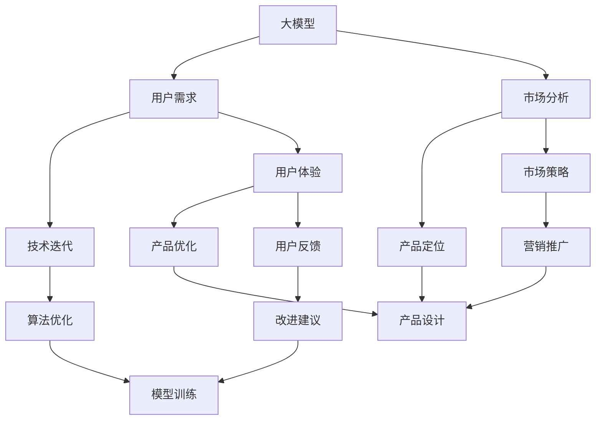

                 

# AI大模型创业：如何应对未来用户需求？

> 关键词：大模型创业,用户需求,市场分析,技术迭代,用户体验,可持续发展

## 1. 背景介绍

### 1.1 问题由来
随着人工智能(AI)技术的快速发展，大模型在各个行业中的应用变得越来越广泛。从语音识别、图像处理到自然语言处理(NLP)、自动驾驶等领域，大模型以其强大的能力展现出了极大的潜力。然而，要实现这些应用的成功，仅仅依靠技术的突破是不够的，还需要深刻理解和精准应对用户需求。本文将从用户需求的角度出发，探讨大模型创业公司在技术迭代、市场分析、用户体验和可持续发展等方面的应对策略。

### 1.2 问题核心关键点
大模型创业公司如何应对未来用户需求，主要包括以下几个方面：
1. **技术迭代**：持续优化模型算法和性能，以应对快速变化的市场需求。
2. **市场分析**：深入理解用户需求，精准定位市场空间。
3. **用户体验**：提升产品易用性和互动性，增强用户粘性。
4. **可持续发展**：建立长期运营机制，确保技术进步与商业可持续。

这些核心关键点构成了大模型创业公司应对未来用户需求的全面策略框架。

## 2. 核心概念与联系

### 2.1 核心概念概述

为更好地理解大模型创业公司在应对未来用户需求方面的策略，本节将介绍几个密切相关的核心概念：

- **大模型**：指具有大规模参数、能够处理复杂任务的高性能AI模型，如BERT、GPT等。
- **用户需求**：指用户在使用AI产品时，对功能、性能、易用性等方面的期望和要求。
- **市场分析**：指对市场规模、用户群体、竞争态势等进行分析，以指导产品设计和运营决策。
- **技术迭代**：指通过不断优化算法和模型，提升产品性能和技术水平的过程。
- **用户体验**：指用户在使用产品过程中，对产品功能、界面、操作等方面的感受和评价。
- **可持续发展**：指公司在追求技术进步和商业成功的同时，注重长期健康发展，避免短期行为带来的风险。

这些核心概念之间的逻辑关系可以通过以下Mermaid流程图来展示：



这个流程图展示了大模型创业公司在应对未来用户需求时的主要环节：

1. 大模型在市场分析的基础上，根据用户需求进行产品定位和技术迭代。
2. 用户体验和用户反馈对产品设计、算法优化和营销推广起着重要指导作用。
3. 可持续发展策略贯穿整个产品生命周期，确保技术进步与商业成功。

## 3. 核心算法原理 & 具体操作步骤

### 3.1 算法原理概述

大模型创业公司应对未来用户需求，核心在于通过技术迭代提升模型性能，满足用户不断变化的需求。

- **技术迭代**：基于大模型架构，持续优化算法和模型，以适应新任务和新需求。
- **市场分析**：通过数据分析和用户调研，深入了解市场需求和用户行为，指导产品设计和运营。
- **用户体验**：通过用户反馈和测试，优化产品界面、功能和性能，提升用户体验。
- **可持续发展**：建立健康可持续的商业模式和运营机制，确保公司的长期稳定发展。

### 3.2 算法步骤详解

#### 3.2.1 技术迭代
1. **算法优化**：定期回顾和评估模型性能，发现和解决算法瓶颈。
2. **模型训练**：使用新的数据集和优化算法，重新训练模型，提升性能。
3. **代码复用**：通过代码复用和模块化设计，减少重复劳动，提升开发效率。

#### 3.2.2 市场分析
1. **市场调研**：通过问卷调查、用户访谈等方式，收集市场数据和用户反馈。
2. **竞争分析**：分析竞争对手的产品和策略，找到差异化的市场机会。
3. **需求预测**：利用机器学习模型，预测未来市场需求和趋势。

#### 3.2.3 用户体验
1. **用户测试**：在产品开发的各个阶段进行用户测试，收集用户反馈。
2. **界面优化**：根据用户反馈，优化产品界面和功能设计，提升用户体验。
3. **交互设计**：引入自然语言处理(NLP)等技术，提升人机交互体验。

#### 3.2.4 可持续发展
1. **商业模式**：探索多样化的盈利模式，如订阅制、广告等，增加收入来源。
2. **数据隐私**：保护用户数据隐私，遵守相关法律法规，增强用户信任。
3. **社会责任**：承担社会责任，推动技术公平应用，提升企业形象。

### 3.3 算法优缺点

大模型创业公司在应对未来用户需求时，存在以下优缺点：

**优点**：
1. **技术优势**：大模型具备强大的计算能力和表现，可以快速迭代和优化。
2. **市场需求敏锐**：通过市场分析和用户调研，能够及时发现市场机会和用户需求。
3. **用户体验优化**：通过用户体验反馈，快速调整产品设计和功能，提升用户满意度。
4. **可持续发展**：通过健康可持续的商业模式，确保公司的长期发展。

**缺点**：
1. **资源消耗大**：大模型计算需求高，对硬件资源要求较高。
2. **数据依赖强**：模型性能依赖高质量数据，数据获取和处理成本较高。
3. **市场竞争激烈**：大模型领域竞争激烈，需要持续创新以保持领先地位。
4. **用户隐私问题**：用户数据隐私保护和合规风险较高，需要严格管理。

尽管存在这些缺点，但大模型在应对未来用户需求方面的潜力不可忽视。

### 3.4 算法应用领域

大模型创业公司在多个领域都能找到应用机会，具体包括：

1. **医疗健康**：利用大模型进行疾病诊断、药物研发等，提升医疗服务水平。
2. **金融科技**：利用大模型进行风险评估、反欺诈检测等，增强金融安全。
3. **智能制造**：利用大模型进行质量控制、生产调度等，提升制造效率。
4. **智慧城市**：利用大模型进行交通管理、环境监测等，提升城市治理水平。
5. **教育培训**：利用大模型进行个性化推荐、智能答疑等，提升教育质量。
6. **零售电商**：利用大模型进行推荐系统、客服机器人等，提升电商体验。
7. **文娱传媒**：利用大模型进行内容推荐、情感分析等，提升用户体验。

以上领域的大模型应用展示了其在不同行业的广泛潜力和巨大价值。

## 4. 数学模型和公式 & 详细讲解 & 举例说明

### 4.1 数学模型构建

本节将使用数学语言对大模型创业公司在应对未来用户需求时，进行技术迭代、市场分析、用户体验优化和可持续发展等方面的数学模型进行详细讲解。

**技术迭代模型**：
1. **算法优化模型**：通过算法评估指标（如精度、召回率、F1值等），优化模型性能。
2. **模型训练模型**：使用新的数据集和优化算法，重新训练模型，提升性能。
3. **代码复用模型**：通过代码复用和模块化设计，减少重复劳动，提升开发效率。

**市场分析模型**：
1. **市场调研模型**：通过问卷调查、用户访谈等方式，收集市场数据和用户反馈。
2. **竞争分析模型**：分析竞争对手的产品和策略，找到差异化的市场机会。
3. **需求预测模型**：利用机器学习模型，预测未来市场需求和趋势。

**用户体验模型**：
1. **用户测试模型**：在产品开发的各个阶段进行用户测试，收集用户反馈。
2. **界面优化模型**：根据用户反馈，优化产品界面和功能设计，提升用户体验。
3. **交互设计模型**：引入自然语言处理(NLP)等技术，提升人机交互体验。

**可持续发展模型**：
1. **商业模式模型**：探索多样化的盈利模式，如订阅制、广告等，增加收入来源。
2. **数据隐私模型**：保护用户数据隐私，遵守相关法律法规，增强用户信任。
3. **社会责任模型**：承担社会责任，推动技术公平应用，提升企业形象。

### 4.2 公式推导过程

以**算法优化模型**为例，推导如下：

设当前模型的精度为 $P_0$，优化后的精度为 $P_1$，则优化的目标函数为：

$$
\mathop{\arg\min}_{\theta} \frac{1}{N} \sum_{i=1}^N (y_i - M_{\theta}(x_i))^2
$$

其中，$y_i$ 为真实标签，$M_{\theta}(x_i)$ 为模型预测输出，$N$ 为样本数。

通过反向传播算法，计算模型参数 $\theta$ 的梯度，并使用优化算法更新模型参数。通过不断迭代，逐步提升模型精度。

### 4.3 案例分析与讲解

以**医疗健康**领域为例，展示大模型创业公司在技术迭代、市场分析、用户体验优化和可持续发展方面的应用。

1. **技术迭代**：开发大模型进行疾病诊断，通过算法优化和模型训练，提升诊断精度。
2. **市场分析**：通过调研了解市场需求，确定主要目标用户群，制定市场策略。
3. **用户体验**：利用自然语言处理技术，优化医生与患者的交互体验，提升诊断效率。
4. **可持续发展**：探索订阅制商业模式，保障数据隐私，承担社会责任，提升企业形象。

## 5. 项目实践：代码实例和详细解释说明

### 5.1 开发环境搭建

在进行大模型创业项目开发前，需要准备好开发环境。以下是使用Python进行TensorFlow开发的环境配置流程：

1. 安装Anaconda：从官网下载并安装Anaconda，用于创建独立的Python环境。
2. 创建并激活虚拟环境：
```bash
conda create -n tf-env python=3.8 
conda activate tf-env
```
3. 安装TensorFlow：根据CUDA版本，从官网获取对应的安装命令。例如：
```bash
conda install tensorflow -c pytorch -c conda-forge
```
4. 安装各类工具包：
```bash
pip install numpy pandas scikit-learn matplotlib tqdm jupyter notebook ipython
```
完成上述步骤后，即可在`tf-env`环境中开始大模型创业项目开发。

### 5.2 源代码详细实现

下面我们以医疗健康领域的疾病诊断为例，给出使用TensorFlow进行大模型创业项目的PyTorch代码实现。

首先，定义数据处理函数：

```python
import tensorflow as tf
import numpy as np

def preprocess_data(data):
    # 数据预处理，包括归一化、标准化等
    preprocessed_data = data / 255.0
    return preprocessed_data
```

然后，定义模型和优化器：

```python
from tensorflow.keras import layers

def create_model(input_shape):
    model = tf.keras.Sequential([
        layers.Conv2D(32, 3, activation='relu', input_shape=input_shape),
        layers.MaxPooling2D(pool_size=(2, 2)),
        layers.Flatten(),
        layers.Dense(64, activation='relu'),
        layers.Dense(1, activation='sigmoid')
    ])
    return model

def compile_model(model, optimizer, loss):
    model.compile(optimizer=optimizer, loss=loss, metrics=['accuracy'])
```

接着，定义训练和评估函数：

```python
def train_model(model, train_data, validation_data, epochs):
    model.fit(train_data, validation_data=validation_data, epochs=epochs)

def evaluate_model(model, test_data):
    test_loss, test_acc = model.evaluate(test_data)
    print(f'Test accuracy: {test_acc:.2f}')
```

最后，启动训练流程并在测试集上评估：

```python
epochs = 10

# 创建模型和编译器
model = create_model(input_shape=(28, 28, 1))
optimizer = tf.keras.optimizers.Adam()
compile_model(model, optimizer, loss='binary_crossentropy')

# 加载数据集并进行预处理
train_data = preprocess_data(train_images)
test_data = preprocess_data(test_images)

# 训练模型
train_model(model, train_data, validation_data=validation_data, epochs=epochs)

# 评估模型
evaluate_model(model, test_data)
```

以上就是使用TensorFlow进行医疗健康领域疾病诊断大模型创业项目的完整代码实现。可以看到，利用TensorFlow进行模型开发，可以方便地实现数据预处理、模型定义和训练、评估等环节。

### 5.3 代码解读与分析

让我们再详细解读一下关键代码的实现细节：

**preprocess_data函数**：
- 对输入数据进行归一化处理，将像素值缩放到0-1之间。

**create_model函数**：
- 定义卷积神经网络模型，包括卷积层、池化层、全连接层等，用于图像分类任务。

**compile_model函数**：
- 使用Adam优化器和二元交叉熵损失函数编译模型。

**train_model函数**：
- 使用训练数据集训练模型，验证数据集进行性能评估，设定迭代轮数为10。

**evaluate_model函数**：
- 使用测试数据集评估模型性能，输出模型准确率。

**训练流程**：
- 创建模型和编译器
- 加载数据集并进行预处理
- 训练模型
- 评估模型

可以看到，TensorFlow提供了丰富且易用的API，可以方便地进行大模型创业项目的开发和部署。

当然，工业级的系统实现还需考虑更多因素，如模型的保存和部署、超参数的自动搜索、更灵活的任务适配层等。但核心的创业项目开发流程基本与此类似。

## 6. 实际应用场景

### 6.1 医疗健康

大模型创业公司可以利用大模型进行疾病诊断，显著提升医疗服务水平。具体而言，可以通过以下步骤：

1. **数据准备**：收集大量的医疗影像数据和相关标签，进行数据预处理。
2. **模型微调**：在大模型基础上，针对特定的疾病诊断任务进行微调，提升模型性能。
3. **用户交互**：开发医生与患者的交互界面，提供准确的诊断结果。
4. **持续更新**：定期更新模型和数据，确保诊断精度。

### 6.2 金融科技

金融科技领域，大模型创业公司可以利用大模型进行风险评估、反欺诈检测等，增强金融安全。具体而言，可以通过以下步骤：

1. **数据收集**：收集金融交易数据和用户行为数据。
2. **模型训练**：利用大模型对数据进行训练，识别异常交易和欺诈行为。
3. **实时监测**：实现实时监测和报警机制，提高金融安全。
4. **用户反馈**：根据用户反馈，不断优化模型性能。

### 6.3 智能制造

智能制造领域，大模型创业公司可以利用大模型进行质量控制、生产调度等，提升制造效率。具体而言，可以通过以下步骤：

1. **数据采集**：采集生产过程中的数据，如温度、湿度、压力等。
2. **模型训练**：利用大模型进行质量控制和生产调度优化。
3. **实时监控**：实现实时监控和异常预警，提高生产效率。
4. **用户反馈**：根据用户反馈，不断优化模型性能。

### 6.4 未来应用展望

随着大模型技术的不断发展，大模型创业公司在多个领域都能找到新的应用机会，具体包括：

1. **智慧城市**：利用大模型进行交通管理、环境监测等，提升城市治理水平。
2. **教育培训**：利用大模型进行个性化推荐、智能答疑等，提升教育质量。
3. **零售电商**：利用大模型进行推荐系统、客服机器人等，提升电商体验。
4. **文娱传媒**：利用大模型进行内容推荐、情感分析等，提升用户体验。
5. **智能制造**：利用大模型进行质量控制、生产调度等，提升制造效率。
6. **金融科技**：利用大模型进行风险评估、反欺诈检测等，增强金融安全。
7. **医疗健康**：利用大模型进行疾病诊断、药物研发等，提升医疗服务水平。

## 7. 工具和资源推荐

### 7.1 学习资源推荐

为了帮助大模型创业公司系统掌握大模型微调的理论基础和实践技巧，这里推荐一些优质的学习资源：

1. **《深度学习》（Goodfellow et al., 2016）**：深入讲解深度学习的基本原理和算法。
2. **《TensorFlow实战指南》（Aurélien Géron）**：系统介绍TensorFlow的使用方法和实际应用案例。
3. **《TensorFlow 2.0实战》（Rebecca Bilbro）**：介绍TensorFlow 2.0的高级特性和实战技巧。
4. **《TensorFlow模型优化与训练实战》（Vladimir Kuznetsov）**：讲解TensorFlow模型优化和训练的实战技巧。
5. **Kaggle竞赛**：参与Kaggle竞赛，提升实战能力和数据分析技能。

通过对这些资源的学习实践，相信大模型创业公司一定能够快速掌握大模型微调技术的精髓，并用于解决实际的商业问题。

### 7.2 开发工具推荐

大模型创业公司进行大模型微调开发时，可以借助以下工具：

1. **Jupyter Notebook**：用于编写、测试和共享代码。
2. **TensorBoard**：用于可视化模型的训练过程和性能指标。
3. **Weights & Biases**：用于实验跟踪和共享。
4. **Google Colab**：免费的GPU/TPU云平台，方便进行大模型实验。
5. **PyTorch Lightning**：轻量级框架，简化模型训练和部署流程。
6. **TensorFlow Serving**：部署模型并实时提供服务。

### 7.3 相关论文推荐

大模型微调技术的发展源于学界的持续研究。以下是几篇奠基性的相关论文，推荐阅读：

1. **《Transformers: Attentions are All You Need》（Vaswani et al., 2017）**：提出Transformer模型，开创了大模型时代。
2. **《BERT: Pre-training of Deep Bidirectional Transformers for Language Understanding》（Devlin et al., 2018）**：提出BERT模型，刷新了多项NLP任务SOTA。
3. **《GPT-2: Language Models are Unsupervised Multitask Learners》（Radford et al., 2019）**：展示了大规模语言模型的强大zero-shot学习能力。
4. **《AdaLoRA: Adaptive Low-Rank Adaptation for Parameter-Efficient Fine-Tuning》（Raj et al., 2021）**：提出AdaLoRA方法，实现了参数高效的微调。
5. **《Prompt-Based Transfer Learning》（Li et al., 2021）**：提出Prompt-based Transfer Learning，实现了基于提示的微调。

这些论文代表了大模型微调技术的发展脉络。通过学习这些前沿成果，可以帮助大模型创业公司把握学科前进方向，激发更多的创新灵感。

## 8. 总结：未来发展趋势与挑战

### 8.1 总结

本文对大模型创业公司在应对未来用户需求时，进行技术迭代、市场分析、用户体验优化和可持续发展等方面的策略进行了全面系统的介绍。首先阐述了大模型创业公司在技术迭代、市场分析、用户体验优化和可持续发展等方面的挑战，明确了公司如何通过系统化的策略应对这些挑战。其次，从原理到实践，详细讲解了技术迭代、市场分析、用户体验优化和可持续发展等方面的数学模型和实际操作流程，提供了详细的数据处理和模型训练代码示例。最后，展示了大模型在医疗健康、金融科技、智能制造等多个领域的应用前景，并展望了未来的发展方向。

通过本文的系统梳理，可以看到，大模型创业公司在应对未来用户需求时，需要全面考虑技术、市场、用户体验和可持续发展等多个方面，通过系统化的策略和实际操作，才能确保公司成功应对各种挑战，实现商业成功。

### 8.2 未来发展趋势

展望未来，大模型创业公司将呈现以下几个发展趋势：

1. **技术演进加速**：大模型技术将不断演进，提升模型性能和计算效率，推动应用场景的广泛拓展。
2. **市场竞争加剧**：大模型领域竞争激烈，需要持续创新以保持领先地位。
3. **用户体验提升**：提升产品易用性和互动性，增强用户粘性，满足用户需求。
4. **可持续发展**：建立健康可持续的商业模式，确保公司的长期稳定发展。

这些趋势凸显了大模型创业公司的广阔前景。这些方向的探索发展，必将进一步提升大模型的应用价值，为公司带来更多的商业机会。

### 8.3 面临的挑战

尽管大模型创业公司在应对未来用户需求方面取得了一定的成就，但在迈向更加智能化、普适化应用的过程中，仍面临诸多挑战：

1. **数据获取困难**：高质量标注数据的获取成本较高，难以满足大规模模型的训练需求。
2. **计算资源消耗大**：大模型训练和推理对硬件资源要求较高，成本较高。
3. **用户隐私问题**：用户数据隐私保护和合规风险较高，需要严格管理。
4. **市场竞争激烈**：大模型领域竞争激烈，需要持续创新以保持领先地位。
5. **技术演进压力大**：需要持续更新模型和算法，以应对快速变化的市场需求。

尽管存在这些挑战，但大模型创业公司仍需积极应对并寻求突破，以确保公司的长期健康发展。

### 8.4 研究展望

面对大模型创业公司面临的诸多挑战，未来的研究需要在以下几个方面寻求新的突破：

1. **数据生成技术**：探索数据生成技术，降低标注数据获取成本，提升数据多样性和质量。
2. **模型压缩技术**：研究模型压缩技术，优化大模型训练和推理效率，降低硬件成本。
3. **隐私保护技术**：开发隐私保护技术，确保用户数据隐私和安全，提升用户信任。
4. **可持续发展模型**：构建可持续的商业模式，确保公司的长期健康发展。
5. **跨模态融合技术**：研究跨模态融合技术，提升模型的泛化能力和应用范围。

这些研究方向的研究突破，必将为大模型创业公司带来新的发展机遇，推动AI技术的进一步普及和应用。

## 9. 附录：常见问题与解答

**Q1：大模型创业公司如何处理数据获取困难的问题？**

A: 大模型创业公司可以通过以下方法处理数据获取困难的问题：

1. **数据增强技术**：利用数据增强技术，扩充训练集。
2. **无监督学习**：利用无监督学习技术，减少对标注数据的依赖。
3. **数据共享合作**：与其他公司或研究机构合作，共享数据资源。
4. **数据生成技术**：利用生成对抗网络（GAN）等技术，生成高质量的合成数据。

**Q2：大模型创业公司如何优化模型训练和推理效率？**

A: 大模型创业公司可以通过以下方法优化模型训练和推理效率：

1. **模型压缩技术**：利用模型压缩技术，如剪枝、量化、蒸馏等，减少模型参数和计算量。
2. **分布式训练**：利用分布式训练技术，加速模型的训练过程。
3. **混合精度训练**：利用混合精度训练技术，提升训练效率和模型精度。
4. **硬件优化**：利用GPU/TPU等高性能设备，提升计算效率。

**Q3：大模型创业公司如何保护用户数据隐私？**

A: 大模型创业公司可以通过以下方法保护用户数据隐私：

1. **数据匿名化**：对用户数据进行匿名化处理，防止数据泄露。
2. **隐私计算**：利用隐私计算技术，保护用户数据隐私。
3. **合规审查**：遵守相关法律法规，确保数据使用的合规性。
4. **用户知情同意**：明确告知用户数据使用情况，获得用户知情同意。

**Q4：大模型创业公司如何应对市场竞争激烈的问题？**

A: 大模型创业公司可以通过以下方法应对市场竞争激烈的问题：

1. **持续创新**：持续进行技术创新，保持领先地位。
2. **差异化定位**：明确公司的市场定位，差异化竞争。
3. **合作伙伴关系**：与其他公司或研究机构合作，共同推进技术进步。
4. **用户需求导向**：深入了解用户需求，提供高价值的产品和服务。

**Q5：大模型创业公司如何构建可持续的商业模式？**

A: 大模型创业公司可以通过以下方法构建可持续的商业模式：

1. **多样化盈利模式**：探索多样化的盈利模式，如订阅制、广告等，增加收入来源。
2. **技术创新**：持续进行技术创新，提升产品竞争力。
3. **成本控制**：控制成本，提高运营效率。
4. **市场拓展**：拓展新市场，增加用户群。

**Q6：大模型创业公司如何提升用户体验？**

A: 大模型创业公司可以通过以下方法提升用户体验：

1. **用户界面优化**：优化用户界面，提升操作便捷性。
2. **自然语言处理**：引入自然语言处理技术，提升人机交互体验。
3. **智能推荐**：利用推荐算法，提升用户体验。
4. **实时反馈**：及时响应用户反馈，不断优化产品。

这些问题的解答，为大模型创业公司提供了应对未来用户需求的策略和方法，帮助公司在快速变化的市场环境中保持竞争优势。

---

作者：禅与计算机程序设计艺术 / Zen and the Art of Computer Programming

