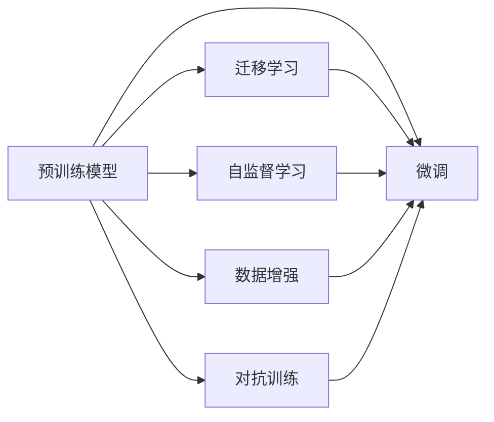

                 

# AI大模型创业：如何应对未来竞争对手？

在AI大模型领域，竞争激烈且变化莫测。如何在快速演变的技术环境中保持竞争力，是每个创业公司必须面对的挑战。本文将从大模型的背景、核心概念与联系、核心算法原理与操作步骤、实际应用场景以及未来趋势与挑战等方面，深入探讨如何构建和运营一个成功的大模型创业项目，以应对未来的竞争对手。

## 1. 背景介绍

### 1.1 问题由来

近年来，深度学习技术取得了显著进展，特别是大模型在自然语言处理（NLP）、计算机视觉（CV）、语音识别等领域的应用，极大地提升了模型的性能和应用范围。大模型通过大规模无标签数据预训练，学习到了丰富的知识表示，能够在大规模有标签数据上进行微调，实现特定任务的高效优化。

然而，大模型的发展和应用也引发了一系列挑战。首先，构建和维护大规模模型的成本高昂，需要强大的算力支持。其次，模型训练和微调的过程复杂且耗时，对技术团队的要求极高。最后，模型的安全性、可解释性和公平性等问题，也成为了社会关注的焦点。

面对这些挑战，如何构建和运营一个成功的大模型创业项目，成为了创业公司亟需解决的问题。本文将围绕这一核心议题，深入探讨大模型创业项目的构建策略和运营管理。

## 2. 核心概念与联系

### 2.1 核心概念概述

要理解如何应对未来竞争对手，首先需要对大模型相关的核心概念有所了解。以下是几个关键概念：

- **大模型（Large Models）**：指那些通过大规模数据预训练得到的、具有强大表示能力的深度学习模型，如BERT、GPT、ResNet等。
- **微调（Fine-Tuning）**：指在大模型的基础上，通过有标签数据对模型进行特定任务上的优化，提升模型在该任务上的表现。
- **迁移学习（Transfer Learning）**：指将在一个任务上学习到的知识迁移到另一个相关任务上，以提升新任务的性能。
- **自监督学习（Self-Supervised Learning）**：指在大规模无标签数据上通过自监督任务训练模型，使其学习到数据的内在结构。
- **数据增强（Data Augmentation）**：指通过对数据进行变换、扩充，以增加训练集的多样性，提升模型的泛化能力。
- **对抗训练（Adversarial Training）**：指在训练过程中加入对抗样本，提高模型对恶意攻击的鲁棒性。

这些概念之间存在密切的联系，共同构成了大模型领域的核心技术框架。

### 2.2 核心概念原理和架构的 Mermaid 流程图



## 3. 核心算法原理 & 具体操作步骤

### 3.1 算法原理概述

大模型创业项目的核心算法原理主要包括预训练、微调和迁移学习等。预训练阶段，模型在大规模无标签数据上进行自监督学习，学习到数据的内在结构。在微调阶段，通过特定任务的有标签数据，对模型进行优化，提升模型在该任务上的表现。迁移学习则将预训练模型在不同任务间的知识迁移，提升新任务的性能。

### 3.2 算法步骤详解

大模型创业项目的具体操作步骤如下：

1. **数据准备**：收集和标注数据，构建训练集和验证集。
2. **模型选择**：选择适合的预训练模型，如BERT、GPT等。
3. **模型微调**：在训练集上进行微调，优化模型在特定任务上的性能。
4. **模型评估**：在验证集上评估模型性能，调整模型参数。
5. **模型部署**：将模型部署到生产环境，提供API服务。

### 3.3 算法优缺点

大模型创业项目的优势在于：

- **高效性**：利用预训练模型可以显著缩短训练时间，提升模型性能。
- **通用性**：预训练模型可以迁移到多个任务上，提升模型应用范围。
- **可解释性**：预训练模型通过自监督学习，学习到更加语义化的特征表示，有助于解释模型决策。

但其缺点也显而易见：

- **高成本**：构建和维护大规模模型需要高昂的算力和存储空间。
- **复杂性**：模型训练和微调过程复杂，对技术团队要求高。
- **风险性**：模型的公平性、安全性问题需要特别注意。

### 3.4 算法应用领域

大模型创业项目可以应用于多个领域，如自然语言处理（NLP）、计算机视觉（CV）、语音识别等。在NLP领域，大模型可以用于文本分类、情感分析、机器翻译等任务。在CV领域，可以用于图像识别、目标检测等任务。在语音识别领域，可以用于语音转文本、语音合成等任务。

## 4. 数学模型和公式 & 详细讲解 & 举例说明

### 4.1 数学模型构建

以BERT为例，其数学模型构建如下：

- **输入层**：将输入文本转换为词向量表示。
- **编码器层**：通过多层Transformer编码器，对词向量进行编码。
- **池化层**：对编码器的输出进行池化，得到固定长度的表示。
- **输出层**：根据任务类型，使用线性层或softmax层进行预测。

### 4.2 公式推导过程

以BERT为例，其训练过程的公式推导如下：

1. 预训练阶段：
   - 自监督任务：如掩码语言模型（Masked Language Modeling, MLM）和下一句预测（Next Sentence Prediction, NSP）。
   - 损失函数：
     - MLM损失函数：
       $$
       \mathcal{L}_{MLM} = -\frac{1}{N}\sum_{i=1}^N \log p(x_i^m)
       $$
     - NSP损失函数：
       $$
       \mathcal{L}_{NSP} = -\frac{1}{2N}\sum_{i=1}^N \log p(x_i^{<x_{i+1}>)
       $$
   - 联合训练：
     - $\mathcal{L} = \alpha \mathcal{L}_{MLM} + (1-\alpha)\mathcal{L}_{NSP}$

2. 微调阶段：
   - 任务特定损失函数：
     - 分类任务：交叉熵损失函数
       $$
       \mathcal{L}_{classification} = -\frac{1}{N}\sum_{i=1}^N \log p(y_i|x_i)
       $$
     - 回归任务：均方误差损失函数
       $$
       \mathcal{L}_{regression} = \frac{1}{N}\sum_{i=1}^N (y_i - \hat{y}_i)^2
       $$
   - 微调优化目标：
     - $\mathcal{L}_{fine-tuning} = \mathcal{L} + \lambda \mathcal{L}_{regularization}$

### 4.3 案例分析与讲解

以BERT在情感分析任务上的微调为例，其过程如下：

1. **数据准备**：收集情感分析数据集，将文本和标签构建成训练集。
2. **模型微调**：在BERT的顶部添加一个全连接层，使用交叉熵损失函数进行微调。
3. **模型评估**：在验证集上评估模型性能，使用准确率、F1-score等指标。
4. **模型部署**：将微调后的模型部署到生产环境，提供API服务。

## 5. 项目实践：代码实例和详细解释说明

### 5.1 开发环境搭建

1. **环境准备**：安装Python、PyTorch、TensorFlow等深度学习框架。
2. **数据准备**：准备训练集和验证集，使用BERT的预训练权重。
3. **模型构建**：使用PyTorch或TensorFlow构建BERT模型。
4. **微调训练**：在GPU上训练模型，使用Adam优化器进行优化。
5. **模型评估**：在验证集上评估模型性能，使用ROC曲线、AUC等指标。

### 5.2 源代码详细实现

```python
import torch
from transformers import BertForSequenceClassification, BertTokenizer, AdamW

# 定义模型和优化器
model = BertForSequenceClassification.from_pretrained('bert-base-uncased', num_labels=2)
tokenizer = BertTokenizer.from_pretrained('bert-base-uncased')
optimizer = AdamW(model.parameters(), lr=1e-5)

# 数据准备
train_dataset = ...
dev_dataset = ...

# 模型微调
model.train()
for epoch in range(5):
    for batch in dataloader:
        inputs = tokenizer(batch['text'], return_tensors='pt')
        labels = batch['label']
        outputs = model(**inputs)
        loss = outputs.loss
        optimizer.zero_grad()
        loss.backward()
        optimizer.step()

# 模型评估
model.eval()
with torch.no_grad():
    correct = 0
    total = 0
    for batch in dev_loader:
        inputs = tokenizer(batch['text'], return_tensors='pt')
        outputs = model(**inputs)
        _, predicted = torch.max(outputs.logits, 1)
        total += batch['size']
        correct += (predicted == batch['label']).sum().item()

print(f'Accuracy: {correct / total}')
```

### 5.3 代码解读与分析

1. **模型构建**：使用BertForSequenceClassification构建情感分析模型。
2. **数据准备**：使用BertTokenizer将文本转换为模型所需的格式。
3. **微调训练**：在GPU上训练模型，使用AdamW优化器进行优化。
4. **模型评估**：在验证集上评估模型性能，使用准确率指标。

## 6. 实际应用场景

### 6.1 智能客服系统

大模型在智能客服系统中的应用，可以显著提升客户咨询体验和问题解决效率。通过微调，模型可以学习到客户咨询的常见问题和最佳答复，自动回答客户问题，快速响应客户咨询，用自然流畅的语言解答各类常见问题。

### 6.2 金融舆情监测

金融机构需要实时监测市场舆论动向，以便及时应对负面信息传播，规避金融风险。大模型可以应用于金融领域相关的新闻、报道、评论等文本数据的情感分析和主题标注，实时监测不同主题下的情感变化趋势，一旦发现负面信息激增等异常情况，系统便会自动预警，帮助金融机构快速应对潜在风险。

### 6.3 个性化推荐系统

个性化推荐系统可以更好地挖掘用户行为背后的语义信息，从而提供更精准、多样的推荐内容。通过微调，模型可以学习到用户浏览、点击、评论、分享等行为数据中的语义信息，生成推荐列表，提高推荐效果。

### 6.4 未来应用展望

未来，大模型将在更多领域得到应用，为传统行业带来变革性影响。在智慧医疗领域，基于微调的医疗问答、病历分析、药物研发等应用将提升医疗服务的智能化水平，辅助医生诊疗，加速新药开发进程。在智能教育领域，微调技术可应用于作业批改、学情分析、知识推荐等方面，因材施教，促进教育公平，提高教学质量。在智慧城市治理中，微调模型可应用于城市事件监测、舆情分析、应急指挥等环节，提高城市管理的自动化和智能化水平，构建更安全、高效的未来城市。

## 7. 工具和资源推荐

### 7.1 学习资源推荐

1. **在线课程**：Coursera、edX等平台提供的深度学习和NLP课程，可以帮助你系统学习相关知识。
2. **开源项目**：Hugging Face的Transformers库，提供丰富的预训练模型和微调样例，是学习大模型微调的好资源。
3. **论文阅读**：ACL、NeurIPS等会议的最新论文，了解最新的研究进展。
4. **书籍推荐**：《深度学习》（Ian Goodfellow）、《自然语言处理入门》（Yoshua Bengio）等经典书籍，是学习深度学习和大模型的必备读物。

### 7.2 开发工具推荐

1. **Python环境**：Anaconda、Miniconda等，提供高效的安装和环境管理。
2. **深度学习框架**：PyTorch、TensorFlow等，提供丰富的深度学习算子。
3. **数据处理库**：Pandas、NumPy等，提供高效的数据处理和分析功能。
4. **模型评估库**：TensorBoard、Weights & Biases等，提供模型训练和评估的可视化工具。

### 7.3 相关论文推荐

1. **大模型研究**：《Attention is All You Need》（Vaswani et al., 2017）、《BERT: Pre-training of Deep Bidirectional Transformers for Language Understanding》（Devlin et al., 2019）等论文，奠定了大模型的基础。
2. **微调研究**：《Parameter-Efficient Transfer Learning for NLP》（Howard et al., 2018）、《Fine-tune BERT for Task Agnostic Transfer Learning》（Devlin et al., 2018）等论文，介绍了微调方法及其应用。
3. **迁移学习研究**：《A Survey on Transfer Learning》（Pan & Yang, 2010）等论文，介绍了迁移学习的相关理论和应用。

## 8. 总结：未来发展趋势与挑战

### 8.1 研究成果总结

大模型在AI创业项目中扮演着重要角色，通过微调和迁移学习，提升了模型在特定任务上的性能，推动了AI技术在各个领域的应用。然而，大模型的构建和维护需要高昂的算力和存储成本，模型训练和微调过程复杂且耗时，模型的公平性、安全性问题需要特别注意。

### 8.2 未来发展趋势

未来，大模型的规模将进一步扩大，微调方法和应用领域将更加多样。模型的迁移能力和泛化能力将得到提升，鲁棒性和可解释性将得到加强。

### 8.3 面临的挑战

1. **数据成本**：构建和维护大规模模型需要高昂的数据成本。
2. **训练效率**：模型训练和微调过程复杂且耗时，需要高效的训练算法和设备。
3. **公平性**：模型的公平性、安全性问题需要特别注意，避免偏见和歧视。
4. **可解释性**：模型的可解释性和可审计性需要加强，确保输出的透明性和可靠性。

### 8.4 研究展望

未来，需要进一步降低大模型的构建和维护成本，提升训练效率和模型性能。需要加强模型的公平性和安全性，提升可解释性和可审计性。

## 9. 附录：常见问题与解答

**Q1：大模型创业项目是否适合所有公司？**

A：大模型创业项目适合有技术实力的公司，需要强大的算力和技术团队支持。但并不是所有公司都适合，需要根据自身情况进行评估。

**Q2：大模型训练和微调过程中需要注意哪些问题？**

A：大模型训练和微调过程中需要注意数据质量、模型超参数设置、训练设备选择、模型评估和优化等问题。

**Q3：如何提高大模型的泛化能力？**

A：可以通过数据增强、迁移学习、对抗训练等方法，提升模型的泛化能力。

**Q4：大模型在落地部署时需要注意哪些问题？**

A：大模型在落地部署时需要注意模型优化、模型评估、模型部署、模型监控等问题。

**Q5：大模型创业项目如何应对未来竞争对手？**

A：大模型创业项目需要持续技术创新，加强数据和算力投入，提升模型性能和应用效果。需要关注市场动态，及时调整策略，保持竞争力。

作者：禅与计算机程序设计艺术 / Zen and the Art of Computer Programming

