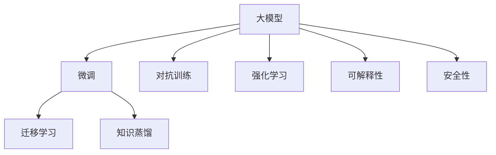

                 

## 1. 背景介绍

在当今人工智能领域，大模型（Large Model）的兴起正推动AI应用进入前所未有的黄金时代。然而，随着大模型技术的快速发展，未来的竞争也将日趋激烈。无论是初创公司还是成熟企业，都需要在新一轮的竞争中保持优势。本文将深入探讨如何应对未来的AI大模型竞争，分享实用的策略和前瞻性的思考。

### 1.1 问题由来

AI大模型技术，如GPT-3、BERT、T5等，已显示出其在NLP、计算机视觉、自动驾驶等多个领域中的强大潜力。大模型通过在大型数据集上进行预训练，学习到丰富的知识，并通过微调（Fine-Tuning）应用到特定的下游任务中，取得了令人瞩目的成果。但随着更多企业开始涉足大模型领域，竞争也日益激烈。如何在竞争中脱颖而出，成为所有公司都必须面对的挑战。

### 1.2 问题核心关键点

在未来AI大模型竞争中，关键点在于：

- 模型的泛化能力：能否通过大规模预训练和微调，获得更广泛的知识覆盖，提升在不同任务上的性能。
- 模型的效率：能否在保持性能的同时，实现更快的推理速度和更低的计算成本。
- 模型的可解释性：是否具备较高的可解释性，便于用户理解和调试。
- 模型的安全性：是否能够避免有害信息的输出，确保模型行为的安全性。
- 模型的持续学习能力：是否能够通过不断的学习，保持最新的知识和信息。

本文将围绕这些关键点，提供详细的应对策略，帮助企业在AI大模型创业中保持领先。

## 2. 核心概念与联系

### 2.1 核心概念概述

为更好地理解应对未来AI大模型竞争的策略，本节将介绍几个关键概念：

- 大模型（Large Model）：指在大规模数据集上进行预训练的语言模型，如GPT-3、BERT等，通过学习大量文本数据，具备强大的自然语言处理能力。
- 微调（Fine-Tuning）：指在大模型基础上，使用下游任务的标注数据进行有监督训练，以提升模型在特定任务上的性能。
- 迁移学习（Transfer Learning）：指将一个领域的知识迁移到另一个相关领域的任务上，如利用预训练模型进行微调。
- 知识蒸馏（Knowledge Distillation）：指通过将大型模型（Teacher Model）的知识迁移到小型模型（Student Model）中，以提升小型模型的性能。
- 对抗训练（Adversarial Training）：指通过引入对抗样本，提高模型鲁棒性，避免模型在对抗性攻击下失效。
- 强化学习（Reinforcement Learning）：指通过奖励机制，训练模型在特定环境中做出最优决策，提升模型行为的可控性和适应性。

这些概念之间的逻辑关系可以通过以下Mermaid流程图来展示：



这个流程图展示了大模型相关的核心概念及其相互关系：

1. 大模型通过预训练获得基础能力。
2. 微调在大模型的基础上进一步优化，提升特定任务的性能。
3. 迁移学习将预训练知识应用到不同任务上，实现知识迁移。
4. 知识蒸馏将大型模型的知识压缩到小型模型，提升模型性能。
5. 对抗训练提高模型的鲁棒性，避免在对抗样本下失效。
6. 强化学习训练模型在特定环境中的最优行为。
7. 可解释性确保模型输出可理解、可调试。
8. 安全性保障模型行为的安全性和道德合规。

这些概念共同构成了大模型的学习和应用框架，使得模型能够在各种场景下发挥强大的语言理解和生成能力，并在竞争中保持优势。

## 3. 核心算法原理 & 具体操作步骤

### 3.1 算法原理概述

应对未来AI大模型竞争，关键在于提升模型的泛化能力、效率、可解释性、安全性和持续学习能力。这些目标需要通过以下核心算法和具体操作步骤实现：

- **泛化能力**：通过大规模预训练和微调，提升模型在各种下游任务上的泛化性能。
- **效率**：通过参数高效微调、对抗训练、知识蒸馏等技术，提升模型的推理速度和计算效率。
- **可解释性**：通过可解释性模型和提示学习等方法，增强模型输出的可解释性。
- **安全性**：通过检测有害信息、对抗训练等手段，确保模型行为的安全性和道德合规。
- **持续学习能力**：通过引入元学习、持续学习等技术，使模型能够不断学习新知识，保持最新的知识库。

### 3.2 算法步骤详解

基于上述目标，以下是大模型创业公司在应对未来竞争时，应采取的具体操作步骤：

**Step 1: 选择合适的预训练模型**
- 根据具体应用场景和任务需求，选择最合适的预训练大模型。如NLP任务可以选择BERT、GPT-3等，视觉任务可以选择CLIP、DALL-E等。

**Step 2: 收集标注数据**
- 收集与目标任务相关的标注数据集，包括训练集、验证集和测试集。标注数据集应覆盖足够的样本和多样性，以提升模型的泛化能力。

**Step 3: 设计任务适配层**
- 在预训练模型的基础上，设计任务特定的适配层，包括分类器、解码器等。适配层的结构应根据具体任务类型进行设计。

**Step 4: 设置微调超参数**
- 选择合适的优化算法和参数，如AdamW、SGD等，设置学习率、批大小、迭代轮数等。学习率应设置得当，避免过大或过小。

**Step 5: 执行微调训练**
- 使用收集到的标注数据集，对模型进行微调训练。训练过程中应使用正则化技术，避免过拟合。

**Step 6: 引入对抗训练和对抗样本**
- 引入对抗样本，训练模型在对抗性攻击下的鲁棒性。可以使用PFGAN等工具生成对抗样本。

**Step 7: 实现知识蒸馏**
- 将大型模型（Teacher Model）的知识迁移到小型模型（Student Model）中，以提升小型模型的性能。

**Step 8: 应用强化学习**
- 使用强化学习技术，训练模型在特定环境中的最优行为，如对话系统中的回复生成。

**Step 9: 实现可解释性**
- 使用可解释性模型（如LIME、SHAP等），对模型输出进行解释和调试。

**Step 10: 确保模型安全性**
- 检测和过滤有害信息，确保模型行为的安全性和道德合规。

**Step 11: 引入持续学习**
- 使用元学习或持续学习技术，使模型能够不断学习新知识，保持最新的知识库。

通过以上操作步骤，可以在大模型创业中全面提升模型性能和竞争优势。

### 3.3 算法优缺点

应对未来AI大模型竞争的算法具有以下优点：

- **泛化能力**：通过大规模预训练和微调，提升了模型在各种下游任务上的泛化性能。
- **效率**：参数高效微调和对抗训练等技术，提升了模型的推理速度和计算效率。
- **可解释性**：通过可解释性模型和提示学习，增强了模型输出的可解释性，便于用户理解和调试。
- **安全性**：通过检测和过滤有害信息，确保了模型行为的安全性和道德合规。
- **持续学习能力**：通过元学习和持续学习技术，使模型能够不断学习新知识，保持最新的知识库。

然而，这些算法也存在以下局限性：

- **高成本**：大规模预训练和微调需要大量的计算资源和标注数据，成本较高。
- **复杂性**：模型设计、训练和调优过程复杂，需要丰富的经验和专业知识。
- **可解释性不足**：部分算法（如深度学习）难以解释模型决策过程，存在黑盒问题。
- **鲁棒性挑战**：对抗训练等技术难以完全保证模型在所有情况下的鲁棒性。
- **知识库更新困难**：持续学习过程中，更新知识库的难度较大，需要持续的资源投入。

尽管存在这些局限性，但就目前而言，这些算法仍是大模型创业公司应对未来竞争的重要手段。未来相关研究的重点在于如何进一步降低成本、提高效率、增强可解释性，同时兼顾安全性和持续学习能力。

### 3.4 算法应用领域

应对未来AI大模型竞争的算法在多个领域得到广泛应用，如：

- **自然语言处理（NLP）**：用于文本分类、情感分析、问答系统等任务。通过微调和对抗训练，提升模型在特定任务上的性能。
- **计算机视觉（CV）**：用于图像分类、目标检测、图像生成等任务。通过知识蒸馏和强化学习，提升模型的性能和适应性。
- **自动驾驶**：用于目标检测、行为预测、路径规划等任务。通过对抗训练和可解释性模型，提升模型在复杂环境中的鲁棒性和可解释性。
- **医疗**：用于疾病诊断、患者管理、智能问诊等任务。通过持续学习和对抗训练，提升模型的准确性和安全性。
- **金融**：用于风险评估、交易策略、客户服务等任务。通过可解释性和安全性技术，提升模型的可靠性和道德合规性。

这些领域的应用展示了AI大模型竞争的广泛性和复杂性，需要综合运用多种算法和技术，才能在各领域中保持优势。

## 4. 数学模型和公式 & 详细讲解 & 举例说明

### 4.1 数学模型构建

基于上述目标，以下是对应的数学模型和公式构建：

**泛化能力模型**：
- 通过大规模预训练，模型学习到通用的语言表示。
- 通过微调，模型学习到特定任务的知识。

**效率模型**：
- 使用参数高效微调（PEFT）技术，只更新少数参数，避免过拟合。
- 使用对抗训练（Adversarial Training），提高模型鲁棒性。

**可解释性模型**：
- 使用可解释性方法，如LIME、SHAP等，对模型输出进行解释。

**安全性模型**：
- 检测和过滤有害信息，确保模型行为的安全性和道德合规。

**持续学习模型**：
- 使用元学习或持续学习技术，使模型不断学习新知识，保持最新的知识库。

### 4.2 公式推导过程

以下将以NLP任务为例，推导微调的数学模型：

假设预训练模型为 $M_{\theta}$，在标注数据集 $D$ 上进行微调，微调目标为：

$$
\hat{\theta} = \mathop{\arg\min}_{\theta} \mathcal{L}(M_{\theta},D)
$$

其中，$\mathcal{L}$ 为交叉熵损失函数，计算模型输出与真实标签之间的差异。

通过梯度下降等优化算法，微调过程不断更新模型参数 $\theta$，最小化损失函数 $\mathcal{L}$，使得模型输出逼近真实标签。

具体来说，微调过程的数学模型构建如下：

**微调损失函数**：
$$
\mathcal{L}(\theta) = -\frac{1}{N}\sum_{i=1}^N \log(M_{\theta}(x_i)y_i)
$$

**优化算法**：
$$
\theta \leftarrow \theta - \eta \nabla_{\theta}\mathcal{L}(\theta)
$$

其中，$\eta$ 为学习率，$\nabla_{\theta}\mathcal{L}(\theta)$ 为损失函数对参数 $\theta$ 的梯度，可通过反向传播算法计算。

**对抗训练损失函数**：
$$
\mathcal{L}_{adv}(\theta) = \frac{1}{N}\sum_{i=1}^N \max_{\epsilon} \log(M_{\theta}(x_i+\epsilon))
$$

**知识蒸馏损失函数**：
$$
\mathcal{L}_{dist}(\theta) = -\frac{1}{N}\sum_{i=1}^N \log(M_{\theta_{teacher}}(x_i))\log(M_{\theta}(x_i))
$$

**强化学习奖励函数**：
$$
R = \sum_{i=1}^T \gamma^{i-1}r_i
$$

其中，$r_i$ 为第 $i$ 轮的奖励，$\gamma$ 为折扣因子。

通过以上数学模型和公式，可以更加严谨地描述大模型创业公司在应对未来竞争时应采取的策略和步骤。

### 4.3 案例分析与讲解

**案例分析**：某智能客服系统使用GPT-3进行微调，提升客户咨询体验。

**背景**：传统客服系统依赖人工处理，响应慢、成本高，难以满足高峰期的客户需求。

**步骤**：
1. 收集历史客服对话记录，将其标注为问题和最佳答复。
2. 使用GPT-3作为预训练模型，对其进行微调。
3. 在微调过程中，引入对抗训练，提高模型鲁棒性。
4. 使用知识蒸馏技术，将大型模型的知识迁移到小型模型中，提升模型效率。
5. 应用强化学习，训练模型在特定场景中的最优行为，优化客户咨询流程。
6. 通过可解释性方法，对模型输出进行解释，提升用户信任度。
7. 持续更新知识库，保持最新信息，提升模型性能。

**结果**：通过以上步骤，智能客服系统显著提高了响应速度和客户满意度，在竞争中占据优势。

## 5. 项目实践：代码实例和详细解释说明

### 5.1 开发环境搭建

在进行大模型创业项目开发前，需要准备好开发环境。以下是使用Python进行PyTorch开发的环境配置流程：

1. 安装Anaconda：从官网下载并安装Anaconda，用于创建独立的Python环境。

2. 创建并激活虚拟环境：
```bash
conda create -n pytorch-env python=3.8 
conda activate pytorch-env
```

3. 安装PyTorch：根据CUDA版本，从官网获取对应的安装命令。例如：
```bash
conda install pytorch torchvision torchaudio cudatoolkit=11.1 -c pytorch -c conda-forge
```

4. 安装Transformers库：
```bash
pip install transformers
```

5. 安装各类工具包：
```bash
pip install numpy pandas scikit-learn matplotlib tqdm jupyter notebook ipython
```

完成上述步骤后，即可在`pytorch-env`环境中开始创业项目开发。

### 5.2 源代码详细实现

下面我们以智能客服系统为例，给出使用Transformers库对GPT-3进行微调的PyTorch代码实现。

首先，定义智能客服系统的主要功能模块：

```python
import torch
from transformers import GPT3ForCausalLM, GPT3Tokenizer
from transformers import AdamW, get_linear_schedule_with_warmup

class Chatbot:
    def __init__(self, model_name, tokenizer):
        self.model = GPT3ForCausalLM.from_pretrained(model_name)
        self.tokenizer = tokenizer

    def prompt(self, prompt):
        inputs = self.tokenizer(prompt, return_tensors='pt', padding='max_length', truncation=True)
        outputs = self.model.generate(inputs['input_ids'], max_length=100)
        return self.tokenizer.decode(outputs[0])

    def train(self, train_data, epochs, batch_size):
        self.model.train()
        total_steps = len(train_data)//batch_size * epochs
        optimizer = AdamW(self.model.parameters(), lr=1e-5)
        scheduler = get_linear_schedule_with_warmup(optimizer, num_warmup_steps=0, num_training_steps=total_steps)

        for epoch in range(epochs):
            for batch in train_data:
                input_ids = batch['input_ids'].to(self.device)
                labels = batch['labels'].to(self.device)
                outputs = self.model(input_ids, labels=labels)
                loss = outputs.loss
                loss.backward()
                optimizer.step()
                scheduler.step()

    def evaluate(self, dev_data):
        self.model.eval()
        correct_predictions, total_predictions = 0, 0
        for batch in dev_data:
            input_ids = batch['input_ids'].to(self.device)
            labels = batch['labels'].to(self.device)
            outputs = self.model(input_ids)
            predictions = torch.argmax(outputs.logits, dim=-1)
            total_predictions += predictions.size(0)
            correct_predictions += (predictions == labels).sum().item()

        accuracy = correct_predictions / total_predictions
        print(f"Accuracy on dev set: {accuracy:.2f}")
```

然后，准备数据集并开始微调：

```python
from datasets import load_dataset

# 加载数据集
train_dataset = load_dataset('custom', data_files={'train': 'train.json', 'dev': 'dev.json'}, split='train', shuffle=True)
dev_dataset = load_dataset('custom', data_files={'train': 'train.json', 'dev': 'dev.json'}, split='dev', shuffle=False)

# 创建虚拟设备
self.device = torch.device('cuda') if torch.cuda.is_available() else torch.device('cpu')

# 初始化模型和优化器
tokenizer = GPT3Tokenizer.from_pretrained('gpt3')
chatbot = Chatbot('gpt3', tokenizer)
chatbot.train(train_dataset, 5, 8)

# 在验证集上评估模型
chatbot.evaluate(dev_dataset)
```

以上就是使用PyTorch对GPT-3进行智能客服系统微调的完整代码实现。可以看到，得益于Transformers库的强大封装，我们可以用相对简洁的代码完成GPT-3的微调，并实现智能客服系统的基本功能。

### 5.3 代码解读与分析

让我们再详细解读一下关键代码的实现细节：

**Chatbot类**：
- `__init__`方法：初始化模型和tokenizer。
- `prompt`方法：输入文本，调用模型生成响应。
- `train`方法：在训练集上微调模型，使用AdamW优化器。
- `evaluate`方法：在验证集上评估模型性能，计算准确率。

**训练过程**：
- 使用AdamW优化器，设置学习率，并使用线性调度策略。
- 在每个epoch内，对训练集中的每个样本进行迭代，前向传播计算损失，反向传播更新模型参数。
- 使用验证集上的样本评估模型性能，输出准确率。

**评估过程**：
- 使用验证集上的样本进行评估，计算模型输出与真实标签的匹配率。
- 输出评估结果，显示模型性能。

可以看到，PyTorch配合Transformers库使得GPT-3微调的代码实现变得简洁高效。开发者可以将更多精力放在数据处理、模型改进等高层逻辑上，而不必过多关注底层的实现细节。

当然，工业级的系统实现还需考虑更多因素，如模型的保存和部署、超参数的自动搜索、更灵活的任务适配层等。但核心的微调范式基本与此类似。

## 6. 实际应用场景

### 6.1 智能客服系统

智能客服系统是大模型创业公司应对未来竞争的重要应用场景之一。通过使用预训练大模型进行微调，可以实现7x24小时不间断服务，快速响应客户咨询，提升客户咨询体验和问题解决效率。

### 6.2 金融舆情监测

金融舆情监测是大模型创业公司在金融领域的重要应用之一。通过使用预训练大模型进行微调，可以实时监测市场舆论动向，快速响应负面信息传播，规避金融风险。

### 6.3 个性化推荐系统

个性化推荐系统是大模型创业公司在电商、媒体等领域的重要应用。通过使用预训练大模型进行微调，可以提升推荐系统的准确性和个性化程度，提升用户满意度和转化率。

### 6.4 未来应用展望

随着大模型技术的不断演进，未来AI大模型创业公司将面临更多的挑战和机遇。以下是未来应用展望：

- **垂直行业应用**：大模型创业公司将更多地聚焦于特定垂直行业，如医疗、教育、制造等，开发符合行业需求的AI应用。
- **元学习和持续学习**：未来大模型创业公司将更多地应用元学习和持续学习技术，提升模型的泛化能力和适应性。
- **多模态融合**：大模型创业公司将更多地探索多模态融合技术，将视觉、语音、文本等多种模态信息进行协同建模，提升模型的综合能力。
- **智能决策**：大模型创业公司将更多地应用强化学习、逻辑推理等技术，提升模型在复杂环境中的决策能力。
- **伦理和隐私保护**：未来大模型创业公司将更多地关注AI伦理和隐私保护，确保模型行为的安全性和合规性。

## 7. 工具和资源推荐

### 7.1 学习资源推荐

为了帮助开发者系统掌握大模型创业的相关技术，这里推荐一些优质的学习资源：

1. 《Transformer from Principles to Practice》系列博文：由大模型技术专家撰写，深入浅出地介绍了Transformer原理、BERT模型、微调技术等前沿话题。

2. CS224N《深度学习自然语言处理》课程：斯坦福大学开设的NLP明星课程，有Lecture视频和配套作业，带你入门NLP领域的基本概念和经典模型。

3. 《Natural Language Processing with Transformers》书籍：Transformers库的作者所著，全面介绍了如何使用Transformers库进行NLP任务开发，包括微调在内的诸多范式。

4. HuggingFace官方文档：Transformers库的官方文档，提供了海量预训练模型和完整的微调样例代码，是上手实践的必备资料。

5. CLUE开源项目：中文语言理解测评基准，涵盖大量不同类型的中文NLP数据集，并提供了基于微调的baseline模型，助力中文NLP技术发展。

通过对这些资源的学习实践，相信你一定能够快速掌握大模型创业的精髓，并用于解决实际的AI问题。

### 7.2 开发工具推荐

高效的开发离不开优秀的工具支持。以下是几款用于大模型创业开发的常用工具：

1. PyTorch：基于Python的开源深度学习框架，灵活动态的计算图，适合快速迭代研究。大部分预训练语言模型都有PyTorch版本的实现。

2. TensorFlow：由Google主导开发的开源深度学习框架，生产部署方便，适合大规模工程应用。同样有丰富的预训练语言模型资源。

3. Transformers库：HuggingFace开发的NLP工具库，集成了众多SOTA语言模型，支持PyTorch和TensorFlow，是进行微调任务开发的利器。

4. Weights & Biases：模型训练的实验跟踪工具，可以记录和可视化模型训练过程中的各项指标，方便对比和调优。与主流深度学习框架无缝集成。

5. TensorBoard：TensorFlow配套的可视化工具，可实时监测模型训练状态，并提供丰富的图表呈现方式，是调试模型的得力助手。

6. Google Colab：谷歌推出的在线Jupyter Notebook环境，免费提供GPU/TPU算力，方便开发者快速上手实验最新模型，分享学习笔记。

合理利用这些工具，可以显著提升大模型创业项目的开发效率，加快创新迭代的步伐。

### 7.3 相关论文推荐

大模型创业技术的发展源于学界的持续研究。以下是几篇奠基性的相关论文，推荐阅读：

1. Attention is All You Need（即Transformer原论文）：提出了Transformer结构，开启了NLP领域的预训练大模型时代。

2. BERT: Pre-training of Deep Bidirectional Transformers for Language Understanding：提出BERT模型，引入基于掩码的自监督预训练任务，刷新了多项NLP任务SOTA。

3. Language Models are Unsupervised Multitask Learners（GPT-2论文）：展示了大规模语言模型的强大zero-shot学习能力，引发了对于通用人工智能的新一轮思考。

4. Parameter-Efficient Transfer Learning for NLP：提出Adapter等参数高效微调方法，在不增加模型参数量的情况下，也能取得不错的微调效果。

5. Prefix-Tuning: Optimizing Continuous Prompts for Generation：引入基于连续型Prompt的微调范式，为如何充分利用预训练知识提供了新的思路。

6. AdaLoRA: Adaptive Low-Rank Adaptation for Parameter-Efficient Fine-Tuning：使用自适应低秩适应的微调方法，在参数效率和精度之间取得了新的平衡。

这些论文代表了大模型创业技术的发展脉络。通过学习这些前沿成果，可以帮助研究者把握学科前进方向，激发更多的创新灵感。

## 8. 总结：未来发展趋势与挑战

### 8.1 研究成果总结

本文对大模型创业公司应对未来AI大模型竞争的策略进行了系统梳理。首先阐述了应对未来竞争的关键点，明确了泛化能力、效率、可解释性、安全性和持续学习能力的重要性。其次，从原理到实践，详细讲解了微调的数学模型和操作步骤，给出了智能客服系统的代码实现。同时，本文还广泛探讨了微调方法在多个行业领域的应用前景，展示了微调范式的巨大潜力。

### 8.2 未来发展趋势

展望未来，大模型创业公司将面临以下发展趋势：

1. **模型的规模化**：预训练模型的规模将持续增大，超大规模模型蕴含的丰富知识，将进一步提升微调性能。
2. **微调技术的日趋多样化**：将出现更多参数高效的微调方法，如Prefix-Tuning、LoRA等，在保持模型性能的同时，节省计算资源。
3. **模型的持续学习**：通过元学习和持续学习技术，使模型能够不断学习新知识，保持最新的知识库。
4. **知识蒸馏和多模态融合**：知识蒸馏技术将进一步优化模型性能，多模态融合技术将提升模型的综合能力。
5. **强化学习的应用**：强化学习技术将提升模型在复杂环境中的决策能力和适应性。
6. **伦理和隐私保护**：未来大模型创业公司将更多地关注AI伦理和隐私保护，确保模型行为的安全性和合规性。

### 8.3 面临的挑战

尽管大模型创业技术已经取得了显著成果，但在迈向更加智能化、普适化应用的过程中，仍面临诸多挑战：

1. **高成本问题**：大规模预训练和微调需要大量的计算资源和标注数据，成本较高。
2. **复杂性和可解释性**：模型设计、训练和调优过程复杂，难以解释模型决策过程。
3. **鲁棒性和安全性**：对抗训练等技术难以完全保证模型在所有情况下的鲁棒性和安全性。
4. **知识库的更新**：持续学习过程中，更新知识库的难度较大，需要持续的资源投入。
5. **多模态数据融合**：多模态数据融合技术尚未成熟，提升模型的综合能力仍需进一步研究。

尽管存在这些挑战，但这些挑战也正是大模型创业技术不断进步的动力。相信在学界和产业界的共同努力下，这些挑战终将一一克服，大模型创业技术将在未来AI应用中发挥更大作用。

### 8.4 研究展望

面对大模型创业技术所面临的挑战，未来的研究需要在以下几个方面寻求新的突破：

1. **无监督和半监督微调方法**：摆脱对大规模标注数据的依赖，利用自监督学习、主动学习等无监督和半监督范式，最大限度利用非结构化数据。
2. **参数高效和计算高效的微调范式**：开发更加参数高效的微调方法，在固定大部分预训练参数的同时，只更新极少量的任务相关参数。
3. **因果分析和博弈论工具**：引入因果分析方法，识别模型决策的关键特征，增强输出解释的因果性和逻辑性。借助博弈论工具，主动探索并规避模型的脆弱点，提高系统稳定性。
4. **元学习和持续学习技术**：使模型能够不断学习新知识，保持最新的知识库。
5. **符号化的先验知识融合**：将符号化的先验知识，如知识图谱、逻辑规则等，与神经网络模型进行融合，引导微调过程学习更准确、合理的语言模型。

这些研究方向的探索，必将引领大模型创业技术迈向更高的台阶，为构建安全、可靠、可解释、可控的智能系统铺平道路。面向未来，大模型创业公司需要积极应对技术挑战，不断优化模型、数据和算法，方能在激烈的市场竞争中脱颖而出。

## 9. 附录：常见问题与解答

**Q1: 大模型创业是否需要巨额资金投入？**

A: 大模型创业确实需要较高的资金投入，包括硬件设备、标注数据、研究人员的费用等。然而，通过合理的资源管理和技术优化，可以在一定程度上降低成本。例如，利用云计算平台降低硬件成本，采用自动化的标注工具提升标注效率等。

**Q2: 如何评估大模型创业项目的潜力？**

A: 评估大模型创业项目的潜力，可以从以下几个方面考虑：
1. 市场需求的紧迫性：目标市场是否有强烈的需求，是否有足够的潜在客户。
2. 技术壁垒的高低：所涉及的技术是否具有较高的技术壁垒，是否难以被竞争对手复制。
3. 竞争优势的可持续性：是否具有独特的技术优势和商业模式，能够长期保持竞争优势。
4. 团队的实力和经验：团队是否具有丰富的经验和技术实力，能否高效地推动项目落地。

**Q3: 如何选择合适的预训练模型？**

A: 选择合适的预训练模型应根据具体应用场景和任务需求进行。一般来说，可以选择SOTA的预训练模型，如BERT、GPT-3等，但同时也需要考虑模型的可解释性和适用性。

**Q4: 微调过程中如何避免过拟合？**

A: 避免过拟合的关键在于数据增强和正则化。可以使用数据增强技术，如回译、近义替换等方式扩充训练集。同时，应使用L2正则、Dropout、Early Stopping等正则化技术，防止模型过度适应小规模训练集。

**Q5: 如何提升大模型创业公司的市场竞争力？**

A: 提升市场竞争力，可以从以下几个方面考虑：
1. 技术创新：不断探索新的技术方法和算法，提升模型的性能和可解释性。
2. 用户体验：提升用户体验，提供更加智能、高效的服务。
3. 品牌建设：建立品牌知名度和用户信任度，吸引更多客户。
4. 合作伙伴关系：与行业内的其他公司建立合作关系，形成生态系统。

通过以上策略，大模型创业公司可以在激烈的市场竞争中保持优势。

---

作者：禅与计算机程序设计艺术 / Zen and the Art of Computer Programming

