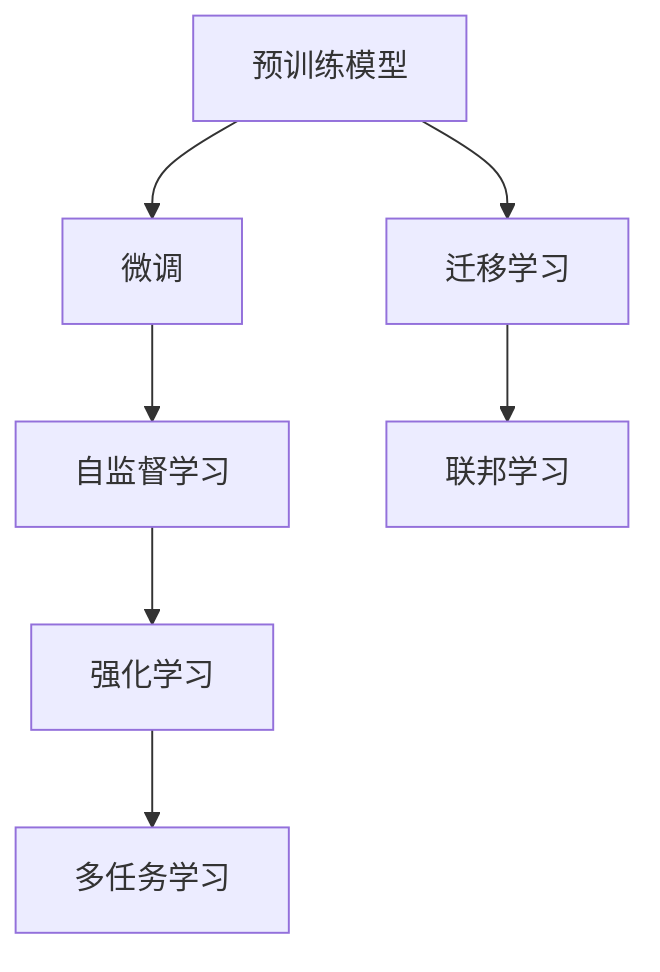

                 

## 1. 背景介绍

在人工智能领域，大模型已经成为推动技术创新的关键力量。从预训练语言模型（如BERT、GPT-3）到视觉模型（如DALL·E、Stable Diffusion），大模型的规模和能力都在不断攀升。大模型为解决复杂任务提供了强大的后盾，但也带来了新的挑战。对于创业公司来说，如何在AI大模型的浪潮中乘风破浪，成为值得深思的问题。

## 2. 核心概念与联系

### 2.1 核心概念概述

为了更好地理解大模型在创业中的应用，首先介绍几个核心概念：

- **大模型（Large Models）**：指在特定领域具有超大参数量、能够处理复杂任务的预训练模型，如GPT-3、BERT等。大模型具有强大的泛化能力和迁移学习能力。
- **预训练（Pre-training）**：在大规模无标签数据上训练模型，学习通用特征，以备下游任务微调使用。
- **微调（Fine-tuning）**：在大模型基础上，利用小规模标签数据进行有监督学习，调整模型参数以适应特定任务。
- **迁移学习（Transfer Learning）**：将预训练模型的知识迁移到新的任务或数据集上，提高学习效率和性能。
- **联邦学习（Federated Learning）**：多分布式节点协同训练模型，保护数据隐私的同时提升性能。
- **自监督学习（Self-supervised Learning）**：利用数据本身的结构信息进行无监督学习，减少对人工标注的依赖。
- **强化学习（Reinforcement Learning）**：通过与环境交互学习最优决策，适用于复杂动态系统的优化。

这些概念之间相互关联，构成了大模型创业的基石。

### 2.2 核心概念原理和架构的 Mermaid 流程图



## 3. 核心算法原理 & 具体操作步骤

### 3.1 算法原理概述

大模型创业的核心在于如何利用这些模型的优势，解决实际问题。这通常分为预训练和微调两个步骤。预训练在大规模数据上完成，学习通用的知识表示。微调则在小规模数据上，调整模型参数以适应特定任务。以下是一个简化的预训练和微调框架：


### 3.2 算法步骤详解

#### 3.2.1 预训练步骤

1. **选择预训练模型**：根据任务需求选择合适的预训练模型，如BERT、GPT-3、ViT等。
2. **数据准备**：收集大规模无标签数据，通常使用自然语言、图像、视频等。
3. **训练模型**：在大规模数据上训练模型，通常使用自监督任务（如掩码语言模型、自回归模型）。
4. **保存模型**：将训练好的模型保存，以便后续微调使用。

#### 3.2.2 微调步骤

1. **数据准备**：收集小规模标注数据，用于微调。
2. **模型加载**：加载预训练模型，并添加任务特定的输出层和损失函数。
3. **设置超参数**：设置学习率、优化器、正则化等超参数。
4. **训练模型**：在标注数据上训练模型，通常使用梯度下降优化算法。
5. **模型评估**：在验证集上评估模型性能，调整超参数。
6. **部署模型**：将微调后的模型部署到实际应用中。

### 3.3 算法优缺点

#### 3.3.1 优点

- **泛化能力强**：预训练模型在大规模数据上学习到的知识可以迁移到新的任务上，减少从头训练的成本。
- **性能提升显著**：微调可以在少量标注数据上快速提升模型性能，缩短开发周期。
- **技术门槛低**：基于开源模型和框架，创业公司可以快速上手并开始开发。

#### 3.3.2 缺点

- **数据依赖**：预训练和微调需要大量数据，数据收集和标注成本高。
- **模型复杂**：大规模模型参数量大，训练和推理复杂，硬件资源需求高。
- **过拟合风险**：小规模标注数据可能不足以避免模型过拟合。

### 3.4 算法应用领域

大模型微调技术在多个领域有广泛应用：

- **自然语言处理**：如文本分类、命名实体识别、情感分析等。
- **计算机视觉**：如图像分类、目标检测、图像生成等。
- **推荐系统**：如个性化推荐、广告推荐等。
- **金融科技**：如信用评分、风险预测等。
- **医疗健康**：如疾病诊断、药物发现等。

## 4. 数学模型和公式 & 详细讲解 & 举例说明

### 4.1 数学模型构建

大模型微调可以采用多种数学模型，如神经网络模型、图模型等。以神经网络模型为例，假设模型结构为 $f_{\theta}$，其中 $\theta$ 为模型参数。微调的数学模型为：

$$
\min_{\theta} \mathcal{L}(f_{\theta}, D)
$$

其中，$D$ 为标注数据集，$\mathcal{L}$ 为损失函数。常见的损失函数包括交叉熵损失、均方误差损失等。

### 4.2 公式推导过程

以二分类任务为例，假设模型的输出为 $y \in \{0,1\}$，实际标签为 $y^* \in \{0,1\}$。交叉熵损失函数为：

$$
\mathcal{L}(y, y^*) = -(y \log(y^*) + (1-y) \log(1-y^*))
$$

在微调过程中，损失函数可以表示为：

$$
\mathcal{L}(f_{\theta}, D) = \frac{1}{N} \sum_{i=1}^N \mathcal{L}(f_{\theta}(x_i), y_i^*)
$$

其中 $N$ 为样本数量。通过优化上述损失函数，可以更新模型参数 $\theta$，使模型更好地适应特定任务。

### 4.3 案例分析与讲解

假设我们有一个预训练的BERT模型，用于情感分析任务。我们可以在大规模电影评论数据上对其进行预训练，然后微调在小规模的餐厅评论数据上。具体步骤如下：

1. **数据准备**：收集大规模电影评论数据，用于预训练。
2. **模型加载**：加载预训练的BERT模型。
3. **微调训练**：在餐厅评论数据上微调BERT模型。
4. **模型评估**：在餐厅评论验证集上评估模型性能。

通过以上步骤，我们利用预训练模型在大规模数据上学习到的知识，在餐厅评论这个小样本数据集上进行微调，提升了模型在情感分析任务上的表现。

## 5. 项目实践：代码实例和详细解释说明

### 5.1 开发环境搭建

要开始大模型微调的实践，首先需要搭建开发环境。以下是一个Python环境搭建的示例：

1. **安装Python**：选择最新版本的Python进行安装，如使用Anaconda安装。
2. **安装PyTorch**：使用以下命令安装：
```bash
pip install torch torchvision torchaudio
```
3. **安装Transformers库**：使用以下命令安装：
```bash
pip install transformers
```
4. **安装其他依赖**：如Pandas、NumPy、Scikit-learn等。

### 5.2 源代码详细实现

以下是一个基于BERT进行情感分析任务微调的示例代码：

```python
from transformers import BertForSequenceClassification, AdamW, BertTokenizer

# 加载预训练模型
model = BertForSequenceClassification.from_pretrained('bert-base-uncased', num_labels=2)

# 加载分词器
tokenizer = BertTokenizer.from_pretrained('bert-base-uncased')

# 准备数据集
# ...

# 定义优化器
optimizer = AdamW(model.parameters(), lr=2e-5)

# 训练模型
# ...

# 评估模型
# ...
```

### 5.3 代码解读与分析

上述代码中，我们使用了BERT模型进行情感分析任务。以下是关键代码的解读：

1. **加载模型和分词器**：
```python
model = BertForSequenceClassification.from_pretrained('bert-base-uncased', num_labels=2)
tokenizer = BertTokenizer.from_pretrained('bert-base-uncased')
```

2. **数据准备**：
```python
train_data = ...
val_data = ...
test_data = ...
```

3. **模型训练**：
```python
model.train()
for batch in train_data:
    # 前向传播
    outputs = model(batch['input_ids'], attention_mask=batch['attention_mask'])
    # 计算损失
    loss = outputs.loss
    # 反向传播
    optimizer.zero_grad()
    loss.backward()
    optimizer.step()
```

4. **模型评估**：
```python
model.eval()
with torch.no_grad():
    for batch in val_data:
        # 前向传播
        outputs = model(batch['input_ids'], attention_mask=batch['attention_mask'])
        # 计算损失
        loss = outputs.loss
        # 计算预测结果
        predictions = outputs.predictions.argmax(dim=1).tolist()
        # ...
```

### 5.4 运行结果展示

运行上述代码后，可以在验证集上评估模型的性能，例如：

```python
print(f"Accuracy: {accuracy:.2f}%")
```

## 6. 实际应用场景

大模型微调技术已经广泛应用于多个领域，以下是几个典型的应用场景：

### 6.1 智能客服

智能客服系统可以利用预训练模型进行对话生成，通过微调模型来适应不同的客户需求。具体步骤如下：

1. **数据准备**：收集历史客服对话数据，标注问题和回复。
2. **模型加载**：加载预训练的对话生成模型。
3. **微调训练**：在标注数据上微调对话生成模型。
4. **系统部署**：将微调后的模型部署到智能客服系统中。

### 6.2 医疗影像诊断

在医疗影像诊断中，可以利用大模型进行图像分类和分割。具体步骤如下：

1. **数据准备**：收集医疗影像数据，标注为正常或异常。
2. **模型加载**：加载预训练的图像分类模型。
3. **微调训练**：在标注数据上微调图像分类模型。
4. **系统部署**：将微调后的模型集成到医疗影像系统中。

### 6.3 智能推荐系统

推荐系统可以利用大模型进行个性化推荐。具体步骤如下：

1. **数据准备**：收集用户行为数据和商品信息。
2. **模型加载**：加载预训练的推荐模型。
3. **微调训练**：在标注数据上微调推荐模型。
4. **系统部署**：将微调后的模型部署到推荐系统中。

## 7. 工具和资源推荐

### 7.1 学习资源推荐

为了更好地掌握大模型微调技术，以下是一些推荐的学习资源：

1. **《自然语言处理综述》**：涵盖NLP领域的基本概念和最新研究。
2. **《深度学习》（Goodfellow等）**：经典的深度学习教材，包含预训练和微调等内容。
3. **HuggingFace官方文档**：提供丰富的预训练模型和微调样例。
4. **TensorFlow官方文档**：包含TensorFlow框架的使用和微调技术。
5. **Kaggle竞赛**：参与NLP相关竞赛，实践微调技术。

### 7.2 开发工具推荐

以下是一些常用的开发工具：

1. **PyTorch**：Python深度学习框架，支持动态计算图。
2. **TensorFlow**：Google开源的深度学习框架，支持分布式训练。
3. **Jupyter Notebook**：交互式开发环境，适合Python和R等语言的开发。
4. **TensorBoard**：TensorFlow配套的可视化工具，用于监控和调试模型训练。

### 7.3 相关论文推荐

以下是一些关于大模型微调的经典论文：

1. **《语言模型是超级智能的跨领域学习者》（GPT-2论文）**：展示了大规模语言模型的零样本学习能力。
2. **《AdaLoRA: Adaptive Low-Rank Adaptation for Parameter-Efficient Fine-Tuning》**：提出了一种参数高效微调方法。
3. **《Fine-Tuning GPT-2 for Zero-Shot Question Answering》**：展示了如何利用GPT-2进行零样本问答。
4. **《基于Transformer的文本生成模型》**：介绍了Transformer模型在文本生成中的应用。
5. **《迁移学习》**：详细介绍了迁移学习的基本概念和应用。

## 8. 总结：未来发展趋势与挑战

### 8.1 总结

本文系统介绍了大模型微调技术在创业中的应用。预训练模型提供了强大的通用知识，微调技术可以快速适应特定任务。通过选择合适的预训练模型和微调方法，可以显著提升模型的性能和应用效果。

### 8.2 未来发展趋势

未来，大模型微调技术将呈现以下几个发展趋势：

1. **模型规模增大**：随着硬件性能提升和数据规模增加，预训练模型将变得更加庞大和强大。
2. **微调方法多样化**：除了传统的全参数微调，还有参数高效微调、半监督学习、自监督学习等方法。
3. **跨领域迁移学习**：模型可以更好地适应不同领域的数据，提高迁移能力。
4. **持续学习和增量学习**：模型需要不断更新以适应数据分布的变化。
5. **数据隐私保护**：在联邦学习和隐私保护框架下，模型训练和微调将更加安全。

### 8.3 面临的挑战

尽管大模型微调技术在不断发展，但也面临以下挑战：

1. **数据获取难度**：大规模标注数据获取成本高。
2. **模型复杂度高**：硬件资源需求大，训练和推理耗时。
3. **过拟合风险**：小规模数据可能不足以避免过拟合。
4. **模型可解释性不足**：缺乏对模型决策的透明解释。
5. **伦理和法律问题**：模型可能带来伦理和法律风险。

### 8.4 研究展望

为了应对这些挑战，未来的研究需要重点关注以下几个方面：

1. **数据生成和增强**：利用数据生成技术和数据增强方法，提升数据质量。
2. **模型压缩和加速**：优化模型结构，减少计算和存储成本。
3. **模型解释性增强**：开发模型解释工具，提高透明性和可解释性。
4. **伦理和安全保障**：制定伦理和法律标准，保护数据隐私和安全。

## 9. 附录：常见问题与解答

**Q1: 大模型微调是否适用于所有NLP任务？**

A: 大模型微调适用于大多数NLP任务，尤其是数据量较小的任务。对于某些特定领域（如医学、法律），可能需要进一步在特定领域语料上预训练，再进行微调。

**Q2: 如何选择合适的学习率？**

A: 微调的学习率一般比预训练时小1-2个数量级，建议使用warmup策略。可以通过交叉验证找到合适的学习率。

**Q3: 大模型微调时如何避免过拟合？**

A: 可以使用数据增强、正则化、对抗训练等方法。同时，选择合适的模型结构和优化器也很重要。

**Q4: 大模型微调过程中需要注意哪些问题？**

A: 需要关注模型的规模、数据的质量和量、硬件资源的使用等。同时，模型的可解释性和安全性也需要重视。

**Q5: 如何评估大模型的性能？**

A: 可以使用准确率、精确率、召回率等指标进行评估。同时，也可以进行A/B测试等实验方法进行比较。

---

作者：禅与计算机程序设计艺术 / Zen and the Art of Computer Programming

