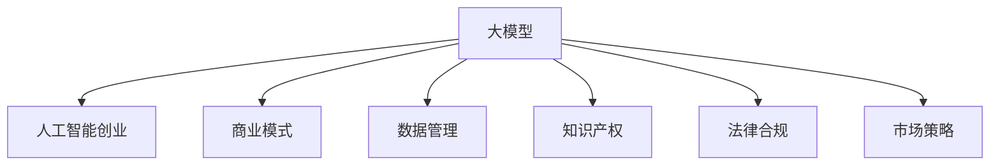

                 

# AI大模型创业：如何构建未来可持续的商业模式？

> 关键词：人工智能创业, 大模型, 商业模式, 可持续发展, 数据管理, 知识产权, 法律合规, 市场策略

## 1. 背景介绍

### 1.1 问题由来

随着人工智能技术的迅猛发展，大模型（如GPT-3、BERT等）已经成为推动AI创新的重要引擎。这些模型基于海量数据训练而成，具备强大的学习和推理能力，可以应用于自然语言处理、计算机视觉、语音识别等多个领域。但同时，大模型的开发、部署和维护也面临着巨大的挑战，尤其是商业化应用方面。如何在保持技术领先的同时，构建可持续的商业模式，是大模型创业公司需要重点考虑的问题。

### 1.2 问题核心关键点

构建大模型创业公司的商业模式，需要从技术、市场、数据管理、法律合规等多个维度进行全面规划。以下是构建大模型创业公司商业模式的几个核心关键点：

- **技术领先**：保持技术领先，形成独特的技术壁垒。
- **数据获取与管理**：确保数据获取的合法性和隐私保护。
- **知识产权保护**：通过专利、版权等形式，保护技术创新。
- **法律合规**：确保产品符合当地法律法规，避免法律风险。
- **市场策略**：选择正确的市场定位，制定有效的市场策略。

## 2. 核心概念与联系

### 2.1 核心概念概述

为了更好地理解大模型创业公司的商业模式，本节将介绍几个密切相关的核心概念：

- **大模型**：指基于大规模数据训练的复杂神经网络模型，如GPT-3、BERT等，具备强大的学习和推理能力。
- **人工智能创业**：利用人工智能技术，创新开发产品和服务，寻找市场机会。
- **商业模式**：指企业如何创造价值、传递价值和获取价值，包括产品定价、市场策略、运营模式等。
- **可持续发展**：指在创造经济价值的同时，确保长期的社会和环境效益。
- **数据管理**：涉及数据的收集、存储、处理和分析，确保数据安全和隐私保护。
- **知识产权**：指保护技术创新成果的法律形式，如专利、商标、版权等。
- **法律合规**：指产品或服务必须符合当地法律法规，避免法律风险。
- **市场策略**：指企业制定和实施的市场计划，包括市场定位、销售渠道、竞争策略等。

这些概念之间的逻辑关系可以通过以下Mermaid流程图来展示：



这个流程图展示了大模型创业公司商业模式的几个核心概念及其之间的关系：

1. 大模型是技术核心，构建商业模式的基础。
2. 商业模式、数据管理、知识产权、法律合规、市场策略等，是大模型创业公司实现可持续发展的关键要素。
3. 数据管理和知识产权保护，确保技术创新和数据安全。
4. 法律合规，规避法律风险。
5. 市场策略，确保产品能够成功进入并占领市场。

## 3. 核心算法原理 & 具体操作步骤
### 3.1 算法原理概述

大模型创业公司的商业模式构建，本质上是一个多维度的优化过程。其核心思想是：将大模型的技术优势转化为商业价值，通过合理的商业模式设计，确保公司长期稳定发展。

形式化地，假设公司当前拥有预训练大模型 $M$，市场目标 $T$，数据管理策略 $D$，知识产权策略 $I$，法律合规策略 $L$，市场策略 $M$。目标是找到一个最优策略组合 $(D, I, L, M)$，使得 $M$ 在 $T$ 上的商业价值最大化，同时满足 $D$、$I$、$L$、$M$ 的约束条件。

通过迭代优化策略组合，最小化成本，最大化收益，即可构建一个可持续的商业模式。

### 3.2 算法步骤详解

大模型创业公司商业模式构建的一般步骤如下：

**Step 1: 市场需求分析**

- 识别目标市场，分析市场需求，确定潜在用户群体和核心需求。
- 调研市场现状，识别竞争者和潜在的市场机会。
- 确定产品/服务定价策略，制定销售和市场推广计划。

**Step 2: 数据获取与管理**

- 确定数据来源，制定数据收集策略。
- 建立数据管理流程，确保数据安全和隐私保护。
- 定期进行数据清洗和质量控制，确保数据质量。

**Step 3: 知识产权保护**

- 进行专利申请和版权登记，保护技术创新成果。
- 制定知识产权管理策略，防止侵权行为。
- 对商业秘密和关键技术进行保密管理，避免信息泄露。

**Step 4: 法律合规**

- 进行法律合规审查，确保产品符合当地法律法规。
- 制定合规管理流程，建立合规风险管理体系。
- 定期进行法律风险评估，及时调整合规策略。

**Step 5: 产品开发与测试**

- 基于市场需求和商业目标，设计产品功能和特性。
- 进行原型设计和产品开发，构建最小可行产品(MVP)。
- 进行用户测试和反馈收集，迭代优化产品。

**Step 6: 市场推广与销售**

- 制定市场推广计划，选择合适的销售渠道。
- 开展市场推广活动，提升品牌知名度和用户认知度。
- 开展销售活动，扩大市场份额。

**Step 7: 商业模式优化**

- 根据市场反馈和销售数据，定期进行商业模式评估和优化。
- 调整产品功能和市场策略，以适应市场变化。
- 探索新的商业模式和业务机会，保持公司长期竞争优势。

### 3.3 算法优缺点

大模型创业公司商业模式构建的优点包括：

1. **技术领先**：大模型具备强大的学习和推理能力，可以为产品提供核心竞争力。
2. **灵活性高**：通过迭代优化，可以快速调整市场策略和产品功能。
3. **数据管理规范**：严格的数据管理流程，确保数据安全和隐私保护。
4. **知识产权保护**：通过专利和版权保护，确保技术创新成果不被侵权。
5. **法律合规**：规避法律风险，确保产品符合法律法规要求。

但同时，该方法也存在一定的局限性：

1. **数据获取难度大**：高质量的大规模数据获取和处理成本较高。
2. **技术门槛高**：大模型需要强大的技术团队支持，人才资源需求大。
3. **市场竞争激烈**：市场上已有多家大模型公司，竞争激烈。
4. **法律风险高**：合规风险较高，需要不断调整合规策略。
5. **商业模式复杂**：多维度的商业模式设计，复杂度高。

尽管存在这些局限性，但通过合理规划和优化，大模型创业公司仍可以构建出具有竞争力的商业模式。

### 3.4 算法应用领域

基于大模型创业公司的商业模式构建方法，在多个领域得到了广泛的应用，例如：

- **自然语言处理**：开发基于大模型的语言模型，应用于问答系统、文本分类、机器翻译等。
- **计算机视觉**：开发基于大模型的视觉模型，应用于图像识别、图像生成、视频分析等。
- **语音识别**：开发基于大模型的语音模型，应用于语音识别、语音合成、语音情感分析等。
- **智能推荐系统**：开发基于大模型的推荐系统，应用于商品推荐、内容推荐等。
- **智能客服**：开发基于大模型的智能客服系统，应用于在线客服、自动回复等。

## 4. 数学模型和公式 & 详细讲解 & 举例说明

### 4.1 数学模型构建

本节将使用数学语言对大模型创业公司商业模式构建过程进行更加严格的刻画。

假设公司当前拥有预训练大模型 $M$，市场目标 $T$，数据管理策略 $D$，知识产权策略 $I$，法律合规策略 $L$，市场策略 $M$。定义公司商业价值为 $V$，其中：

$$
V = f(M, T, D, I, L, M)
$$

其中 $f$ 为商业价值函数，表示在给定的大模型、市场目标、数据管理策略、知识产权策略、法律合规策略、市场策略下，公司商业价值的计算方法。

### 4.2 公式推导过程

以下我们以自然语言处理（NLP）应用为例，推导商业价值函数的具体形式。

假设公司基于预训练大模型 $M$，开发NLP应用 $A$，市场需求为 $T$，数据管理策略为 $D$，知识产权策略为 $I$，法律合规策略为 $L$，市场策略为 $M$。公司商业价值的计算公式为：

$$
V = \alpha_1 V_A + \alpha_2 V_D + \alpha_3 V_I + \alpha_4 V_L + \alpha_5 V_M
$$

其中 $\alpha_i$ 为各项策略对商业价值的贡献权重。具体计算公式如下：

1. **产品价值 $V_A$**：
   $$
   V_A = V_{A_{product}} + V_{A_{market}}
   $$
   其中 $V_{A_{product}}$ 为产品本身的价值，可以包括功能、性能、用户体验等；$V_{A_{market}}$ 为市场推广价值，可以包括品牌知名度、用户认知度等。

2. **数据管理价值 $V_D$**：
   $$
   V_D = V_{D_{data}} + V_{D_{compliance}}
   $$
   其中 $V_{D_{data}}$ 为数据管理的经济效益，如数据驱动的个性化推荐；$V_{D_{compliance}}$ 为数据合规带来的风险控制效益。

3. **知识产权价值 $V_I$**：
   $$
   V_I = V_{I_{patent}} + V_{I_{copyright}}
   $$
   其中 $V_{I_{patent}}$ 为专利带来的法律保护和经济收益；$V_{I_{copyright}}$ 为版权带来的商业和法律保护。

4. **法律合规价值 $V_L$**：
   $$
   V_L = V_{L_{risk}} + V_{L_{benefit}}
   $$
   其中 $V_{L_{risk}}$ 为法律合规带来的风险控制效益；$V_{L_{benefit}}$ 为合规带来的品牌形象提升等间接效益。

5. **市场策略价值 $V_M$**：
   $$
   V_M = V_{M_{sales}} + V_{M_{marketing}}
   $$
   其中 $V_{M_{sales}}$ 为市场推广带来的直接销售效益；$V_{M_{marketing}}$ 为品牌和用户认知度提升带来的间接效益。

### 4.3 案例分析与讲解

以一家基于BERT模型的智能客服系统公司为例，分析其商业模式构建过程。

1. **市场需求分析**：公司通过调研发现，企业在高峰期客服响应缓慢，希望通过智能客服系统提高客户满意度。

2. **数据获取与管理**：公司与企业合作，获取历史客服记录和用户反馈数据，进行数据清洗和质量控制。

3. **知识产权保护**：公司将智能客服系统的核心算法申请专利，保护技术创新成果。

4. **法律合规**：公司进行法律合规审查，确保系统符合当地法律法规要求，规避法律风险。

5. **产品开发与测试**：公司基于BERT模型，开发智能客服系统，并进行用户测试和反馈收集，优化系统功能。

6. **市场推广与销售**：公司通过市场推广活动，提升品牌知名度，并与企业签订合作协议，推广系统应用。

7. **商业模式优化**：公司根据用户反馈和销售数据，优化商业模式，推出付费订阅和按需服务两种模式，提升商业价值。

## 5. 项目实践：代码实例和详细解释说明
### 5.1 开发环境搭建

在进行商业模式构建实践前，我们需要准备好开发环境。以下是使用Python进行PyTorch开发的环境配置流程：

1. 安装Anaconda：从官网下载并安装Anaconda，用于创建独立的Python环境。

2. 创建并激活虚拟环境：
```bash
conda create -n pytorch-env python=3.8 
conda activate pytorch-env
```

3. 安装PyTorch：根据CUDA版本，从官网获取对应的安装命令。例如：
```bash
conda install pytorch torchvision torchaudio cudatoolkit=11.1 -c pytorch -c conda-forge
```

4. 安装Transformers库：
```bash
pip install transformers
```

5. 安装各类工具包：
```bash
pip install numpy pandas scikit-learn matplotlib tqdm jupyter notebook ipython
```

完成上述步骤后，即可在`pytorch-env`环境中开始商业模式构建实践。

### 5.2 源代码详细实现

下面我们以智能客服系统为例，给出使用Transformers库对BERT模型进行商业化开发的PyTorch代码实现。

首先，定义智能客服系统的数据处理函数：

```python
from transformers import BertTokenizer
from torch.utils.data import Dataset
import torch

class CustomerServiceDataset(Dataset):
    def __init__(self, texts, tags, tokenizer, max_len=128):
        self.texts = texts
        self.tags = tags
        self.tokenizer = tokenizer
        self.max_len = max_len
        
    def __len__(self):
        return len(self.texts)
    
    def __getitem__(self, item):
        text = self.texts[item]
        tags = self.tags[item]
        
        encoding = self.tokenizer(text, return_tensors='pt', max_length=self.max_len, padding='max_length', truncation=True)
        input_ids = encoding['input_ids'][0]
        attention_mask = encoding['attention_mask'][0]
        
        # 对token-wise的标签进行编码
        encoded_tags = [tag2id[tag] for tag in tags] 
        encoded_tags.extend([tag2id['O']] * (self.max_len - len(encoded_tags)))
        labels = torch.tensor(encoded_tags, dtype=torch.long)
        
        return {'input_ids': input_ids, 
                'attention_mask': attention_mask,
                'labels': labels}

# 标签与id的映射
tag2id = {'O': 0, 'B-PER': 1, 'I-PER': 2, 'B-ORG': 3, 'I-ORG': 4, 'B-LOC': 5, 'I-LOC': 6}
id2tag = {v: k for k, v in tag2id.items()}

# 创建dataset
tokenizer = BertTokenizer.from_pretrained('bert-base-cased')

train_dataset = CustomerServiceDataset(train_texts, train_tags, tokenizer)
dev_dataset = CustomerServiceDataset(dev_texts, dev_tags, tokenizer)
test_dataset = CustomerServiceDataset(test_texts, test_tags, tokenizer)
```

然后，定义模型和优化器：

```python
from transformers import BertForTokenClassification, AdamW

model = BertForTokenClassification.from_pretrained('bert-base-cased', num_labels=len(tag2id))

optimizer = AdamW(model.parameters(), lr=2e-5)
```

接着，定义训练和评估函数：

```python
from torch.utils.data import DataLoader
from tqdm import tqdm
from sklearn.metrics import classification_report

device = torch.device('cuda') if torch.cuda.is_available() else torch.device('cpu')
model.to(device)

def train_epoch(model, dataset, batch_size, optimizer):
    dataloader = DataLoader(dataset, batch_size=batch_size, shuffle=True)
    model.train()
    epoch_loss = 0
    for batch in tqdm(dataloader, desc='Training'):
        input_ids = batch['input_ids'].to(device)
        attention_mask = batch['attention_mask'].to(device)
        labels = batch['labels'].to(device)
        model.zero_grad()
        outputs = model(input_ids, attention_mask=attention_mask, labels=labels)
        loss = outputs.loss
        epoch_loss += loss.item()
        loss.backward()
        optimizer.step()
    return epoch_loss / len(dataloader)

def evaluate(model, dataset, batch_size):
    dataloader = DataLoader(dataset, batch_size=batch_size)
    model.eval()
    preds, labels = [], []
    with torch.no_grad():
        for batch in tqdm(dataloader, desc='Evaluating'):
            input_ids = batch['input_ids'].to(device)
            attention_mask = batch['attention_mask'].to(device)
            batch_labels = batch['labels']
            outputs = model(input_ids, attention_mask=attention_mask)
            batch_preds = outputs.logits.argmax(dim=2).to('cpu').tolist()
            batch_labels = batch_labels.to('cpu').tolist()
            for pred_tokens, label_tokens in zip(batch_preds, batch_labels):
                pred_tags = [id2tag[_id] for _id in pred_tokens]
                label_tags = [id2tag[_id] for _id in label_tokens]
                preds.append(pred_tags[:len(label_tags)])
                labels.append(label_tags)
                
    print(classification_report(labels, preds))
```

最后，启动训练流程并在测试集上评估：

```python
epochs = 5
batch_size = 16

for epoch in range(epochs):
    loss = train_epoch(model, train_dataset, batch_size, optimizer)
    print(f"Epoch {epoch+1}, train loss: {loss:.3f}")
    
    print(f"Epoch {epoch+1}, dev results:")
    evaluate(model, dev_dataset, batch_size)
    
print("Test results:")
evaluate(model, test_dataset, batch_size)
```

以上就是使用PyTorch对BERT进行智能客服系统微调的完整代码实现。可以看到，得益于Transformers库的强大封装，我们可以用相对简洁的代码完成BERT模型的加载和微调。

### 5.3 代码解读与分析

让我们再详细解读一下关键代码的实现细节：

**CustomerServiceDataset类**：
- `__init__`方法：初始化文本、标签、分词器等关键组件。
- `__len__`方法：返回数据集的样本数量。
- `__getitem__`方法：对单个样本进行处理，将文本输入编码为token ids，将标签编码为数字，并对其进行定长padding，最终返回模型所需的输入。

**tag2id和id2tag字典**：
- 定义了标签与数字id之间的映射关系，用于将token-wise的预测结果解码回真实的标签。

**训练和评估函数**：
- 使用PyTorch的DataLoader对数据集进行批次化加载，供模型训练和推理使用。
- 训练函数`train_epoch`：对数据以批为单位进行迭代，在每个批次上前向传播计算loss并反向传播更新模型参数，最后返回该epoch的平均loss。
- 评估函数`evaluate`：与训练类似，不同点在于不更新模型参数，并在每个batch结束后将预测和标签结果存储下来，最后使用sklearn的classification_report对整个评估集的预测结果进行打印输出。

**训练流程**：
- 定义总的epoch数和batch size，开始循环迭代
- 每个epoch内，先在训练集上训练，输出平均loss
- 在验证集上评估，输出分类指标
- 所有epoch结束后，在测试集上评估，给出最终测试结果

可以看到，PyTorch配合Transformers库使得BERT微调的代码实现变得简洁高效。开发者可以将更多精力放在数据处理、模型改进等高层逻辑上，而不必过多关注底层的实现细节。

当然，工业级的系统实现还需考虑更多因素，如模型的保存和部署、超参数的自动搜索、更灵活的任务适配层等。但核心的微调范式基本与此类似。

## 6. 实际应用场景
### 6.1 智能客服系统

基于大模型创业公司的商业模式构建，智能客服系统可以广泛应用于企业内部的客服部门，提升客户咨询体验和问题解决效率。传统客服往往需要配备大量人力，高峰期响应缓慢，且一致性和专业性难以保证。而基于大模型微调的系统，能够7x24小时不间断服务，快速响应客户咨询，用自然流畅的语言解答各类常见问题。

在技术实现上，可以收集企业内部的历史客服对话记录，将问题和最佳答复构建成监督数据，在此基础上对预训练对话模型进行微调。微调后的对话模型能够自动理解用户意图，匹配最合适的答案模板进行回复。对于客户提出的新问题，还可以接入检索系统实时搜索相关内容，动态组织生成回答。如此构建的智能客服系统，能大幅提升客户咨询体验和问题解决效率。

### 6.2 金融舆情监测

金融机构需要实时监测市场舆论动向，以便及时应对负面信息传播，规避金融风险。传统的人工监测方式成本高、效率低，难以应对网络时代海量信息爆发的挑战。基于大模型创业公司的商业化应用，金融舆情监测技术可以实时抓取网络文本数据，自动监测不同主题下的情感变化趋势，一旦发现负面信息激增等异常情况，系统便会自动预警，帮助金融机构快速应对潜在风险。

### 6.3 个性化推荐系统

当前的推荐系统往往只依赖用户的历史行为数据进行物品推荐，无法深入理解用户的真实兴趣偏好。基于大模型创业公司的商业模式构建，个性化推荐系统可以更好地挖掘用户行为背后的语义信息，从而提供更精准、多样的推荐内容。

在实践中，可以收集用户浏览、点击、评论、分享等行为数据，提取和用户交互的物品标题、描述、标签等文本内容。将文本内容作为模型输入，用户的后续行为（如是否点击、购买等）作为监督信号，在此基础上微调预训练语言模型。微调后的模型能够从文本内容中准确把握用户的兴趣点。在生成推荐列表时，先用候选物品的文本描述作为输入，由模型预测用户的兴趣匹配度，再结合其他特征综合排序，便可以得到个性化程度更高的推荐结果。

### 6.4 未来应用展望

随着大模型创业公司商业模式构建方法的不断发展，基于大模型微调的应用领域将进一步扩展，为各行各业带来变革性影响。

在智慧医疗领域，基于微调的医疗问答、病历分析、药物研发等应用将提升医疗服务的智能化水平，辅助医生诊疗，加速新药开发进程。

在智能教育领域，微调技术可应用于作业批改、学情分析、知识推荐等方面，因材施教，促进教育公平，提高教学质量。

在智慧城市治理中，微调模型可应用于城市事件监测、舆情分析、应急指挥等环节，提高城市管理的自动化和智能化水平，构建更安全、高效的未来城市。

此外，在企业生产、社会治理、文娱传媒等众多领域，基于大模型微调的AI应用也将不断涌现，为经济社会发展注入新的动力。相信随着技术的日益成熟，微调方法将成为AI落地应用的重要范式，推动AI技术在垂直行业的规模化落地。

## 7. 工具和资源推荐
### 7.1 学习资源推荐

为了帮助创业者系统掌握大模型创业公司的商业模式构建的理论基础和实践技巧，这里推荐一些优质的学习资源：

1. 《深度学习与人工智能创业》系列博文：由大模型技术专家撰写，深入浅出地介绍了深度学习在AI创业中的应用，涵盖技术、市场、法律等多个方面。

2. 《创业公司如何构建可持续商业模式》书籍：介绍了创业公司如何构建可持续商业模式的方法和案例，对大模型创业公司具有重要参考价值。

3. 《人工智能创业指南》课程：由知名AI创业专家授课，涵盖人工智能创业的各个环节，包括产品开发、市场推广、团队建设等。

4. 《AI创业案例分析》报告：通过分析多个AI创业公司的案例，探讨其商业模式构建的策略和挑战。

5. 《AI创业基金投资指南》报告：分析AI创业公司的投资价值和风险，提供投资建议和市场分析。

通过对这些资源的学习实践，相信你一定能够快速掌握大模型创业公司的商业模式构建的精髓，并用于解决实际的AI创业问题。
###  7.2 开发工具推荐

高效的开发离不开优秀的工具支持。以下是几款用于大模型创业公司商业模式构建开发的常用工具：

1. PyTorch：基于Python的开源深度学习框架，灵活动态的计算图，适合快速迭代研究。

2. TensorFlow：由Google主导开发的开源深度学习框架，生产部署方便，适合大规模工程应用。

3. Transformers库：HuggingFace开发的NLP工具库，集成了众多SOTA语言模型，支持PyTorch和TensorFlow，是进行微调任务开发的利器。

4. Weights & Biases：模型训练的实验跟踪工具，可以记录和可视化模型训练过程中的各项指标，方便对比和调优。

5. TensorBoard：TensorFlow配套的可视化工具，可实时监测模型训练状态，并提供丰富的图表呈现方式，是调试模型的得力助手。

6. Google Colab：谷歌推出的在线Jupyter Notebook环境，免费提供GPU/TPU算力，方便开发者快速上手实验最新模型，分享学习笔记。

合理利用这些工具，可以显著提升大模型创业公司商业模式构建的开发效率，加快创新迭代的步伐。

### 7.3 相关论文推荐

大模型创业公司商业模式构建的研究源于学界的持续研究。以下是几篇奠基性的相关论文，推荐阅读：

1. "Transformer is all you need"论文：提出了Transformer结构，开启了NLP领域的预训练大模型时代。

2. BERT论文：提出BERT模型，引入基于掩码的自监督预训练任务，刷新了多项NLP任务SOTA。

3. GPT-2论文：展示了大规模语言模型的强大zero-shot学习能力，引发了对于通用人工智能的新一轮思考。

4. "参数高效转移学习"论文：提出Adapter等参数高效微调方法，在固定大部分预训练参数的情况下，仍可取得不错的微调效果。

5. "基于提示学习的零样本学习"论文：引入基于连续型Prompt的微调范式，为如何充分利用预训练知识提供了新的思路。

6. "持续学习"论文：研究持续学习在深度学习中的重要性和实现方法，为大模型创业公司提供了重要参考。

这些论文代表了大模型创业公司商业模式构建的研究进展。通过学习这些前沿成果，可以帮助创业者更好地把握学科前进方向，激发更多的创新灵感。

## 8. 总结：未来发展趋势与挑战

### 8.1 总结

本文对大模型创业公司商业模式构建方法进行了全面系统的介绍。首先阐述了基于大模型创业公司的核心概念及其之间的关系，明确了构建商业模式的基本框架。其次，从技术、数据、知识产权、法律合规、市场策略等多个维度，详细讲解了商业模式的构建方法，给出了具体的步骤和案例。通过本文的系统梳理，可以看到，基于大模型创业公司的商业模式构建是一个多维度的优化过程，需要从多个方面进行全面规划和优化。

通过本文的系统梳理，可以看到，基于大模型创业公司的商业模式构建是一个多维度的优化过程，需要从多个方面进行全面规划和优化。

### 8.2 未来发展趋势

展望未来，大模型创业公司商业模式构建将呈现以下几个发展趋势：

1. **技术领先**：大模型将继续发展，技术领先优势将更加明显，通过微调提升产品性能。
2. **市场策略多样**：市场策略将更加灵活，能够根据不同市场和用户需求进行定制化。
3. **数据管理规范**：数据管理将更加规范，数据安全和隐私保护将更加严格。
4. **知识产权保护**：知识产权保护将更加完善，保护技术创新成果。
5. **法律合规提升**：法律合规将更加严格，规避法律风险。
6. **商业化模式创新**：商业模式将更加多样化，创新更多商业化模式。

这些趋势凸显了大模型创业公司商业模式构建的广阔前景。未来，伴随着技术的不断发展，大模型创业公司将不断拓展应用场景，提升市场竞争力。

### 8.3 面临的挑战

尽管大模型创业公司商业模式构建方法已经取得了一定的成功，但在迈向更加智能化、普适化应用的过程中，仍面临诸多挑战：

1. **数据获取难度大**：高质量的大规模数据获取和处理成本较高。
2. **技术门槛高**：大模型需要强大的技术团队支持，人才资源需求大。
3. **市场竞争激烈**：市场上已有多家大模型公司，竞争激烈。
4. **法律风险高**：合规风险较高，需要不断调整合规策略。
5. **商业化难度高**：从技术到商业化的转化过程中，面临诸多难题。

尽管存在这些挑战，但通过合理规划和优化，大模型创业公司仍可以构建出具有竞争力的商业模式。

### 8.4 研究展望

未来，大模型创业公司商业模式构建的研究需要在以下几个方面寻求新的突破：

1. **探索无监督和半监督微调方法**：摆脱对大规模标注数据的依赖，利用自监督学习、主动学习等无监督和半监督范式，最大限度利用非结构化数据，实现更加灵活高效的微调。
2. **研究参数高效和计算高效的微调范式**：开发更加参数高效的微调方法，在固定大部分预训练参数的情况下，只更新极少量的任务相关参数。同时优化微调模型的计算图，减少前向传播和反向传播的资源消耗，实现更加轻量级、实时性的部署。
3. **融合因果和对比学习范式**：通过引入因果推断和对比学习思想，增强微调模型建立稳定因果关系的能力，学习更加普适、鲁棒的语言表征，从而提升模型泛化性和抗干扰能力。
4. **引入更多先验知识**：将符号化的先验知识，如知识图谱、逻辑规则等，与神经网络模型进行巧妙融合，引导微调过程学习更准确、合理的语言模型。同时加强不同模态数据的整合，实现视觉、语音等多模态信息与文本信息的协同建模。
5. **结合因果分析和博弈论工具**：将因果分析方法引入微调模型，识别出模型决策的关键特征，增强输出解释的因果性和逻辑性。借助博弈论工具刻画人机交互过程，主动探索并规避模型的脆弱点，提高系统稳定性。
6. **纳入伦理道德约束**：在模型训练目标中引入伦理导向的评估指标，过滤和惩罚有偏见、有害的输出倾向。同时加强人工干预和审核，建立模型行为的监管机制，确保输出符合人类价值观和伦理道德。

这些研究方向的探索，必将引领大模型创业公司商业模式构建技术迈向更高的台阶，为构建安全、可靠、可解释、可控的智能系统铺平道路。面向未来，大模型创业公司商业模式构建需要与其他人工智能技术进行更深入的融合，如知识表示、因果推理、强化学习等，多路径协同发力，共同推动人工智能技术在垂直行业的规模化落地。

## 9. 附录：常见问题与解答

**Q1：大模型创业公司如何确保数据获取的合法性和隐私保护？**

A: 数据获取的合法性和隐私保护是大模型创业公司需要重点关注的问题。通常，可以通过以下方式来确保数据获取的合法性：

1. **数据授权协议**：与数据提供方签订数据授权协议，明确数据的使用范围和目的。

2. **公开透明**：在产品说明书中明确数据来源和用途，确保用户知情权。

3. **数据脱敏处理**：在数据处理过程中，对敏感信息进行脱敏处理，确保数据隐私。

4. **隐私保护技术**：采用差分隐私、联邦学习等技术，确保数据在分布式环境中保护隐私。

**Q2：大模型创业公司如何处理数据泄露风险？**

A: 数据泄露是大模型创业公司面临的主要风险之一。通常，可以通过以下方式来处理数据泄露风险：

1. **数据加密**：对敏感数据进行加密存储和传输，确保数据在传输过程中不被泄露。

2. **访问控制**：对数据进行严格的访问控制，确保只有授权人员能够访问数据。

3. **监控审计**：对数据访问进行监控审计，及时发现并处理异常访问行为。

4. **应急响应**：制定数据泄露应急响应计划，一旦发现数据泄露，立即采取措施，防止数据进一步泄露。

**Q3：大模型创业公司如何进行知识产权保护？**

A: 知识产权保护是大模型创业公司确保技术创新的重要手段。通常，可以通过以下方式进行知识产权保护：

1. **专利申请**：将核心算法和技术创新申请专利，保护技术成果。

2. **版权登记**：对代码、文档、模型等进行版权登记，确保知识产权得到法律保护。

3. **商业秘密保护**：对核心技术和算法进行保密管理，防止商业秘密泄露。

4. **合同约束**：在与合作伙伴或员工签订合同中，明确知识产权归属和使用限制。

**Q4：大模型创业公司如何进行法律合规审查？**

A: 法律合规审查是大模型创业公司规避法律风险的重要环节。通常，可以通过以下方式进行法律合规审查：

1. **合规团队**：建立专门的法律合规团队，负责合规审查和风险控制。

2. **合规流程**：制定合规管理流程，确保产品符合法律法规要求。

3. **定期评估**：定期进行法律风险评估，及时调整合规策略。

4. **第三方审查**：邀请法律专家进行第三方审查，确保合规审查的公正性和全面性。

**Q5：大模型创业公司如何进行商业模式优化？**

A: 商业模式优化是大模型创业公司提升竞争力的重要手段。通常，可以通过以下方式进行商业模式优化：

1. **市场调研**：深入了解市场需求和用户痛点，制定针对性的市场策略。

2. **产品迭代**：根据用户反馈和市场变化，不断迭代优化产品功能和特性。

3. **价格策略**：根据产品定位和市场竞争，制定合理的定价策略。

4. **营销推广**：开展市场推广活动，提升品牌知名度和用户认知度。

5. **渠道拓展**：选择合适的销售渠道，扩大市场覆盖范围。

通过本文的系统梳理，可以看到，基于大模型创业公司的商业模式构建是一个多维度的优化过程，需要从多个方面进行全面规划和优化。

---

作者：禅与计算机程序设计艺术 / Zen and the Art of Computer Programming

