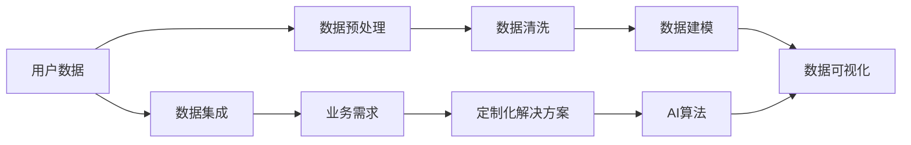

                 

# AI如何帮助电商企业进行用户数据可视化

> 关键词：用户数据可视化, 电商企业, AI技术, 数据驱动决策, 数据可视化工具

## 1. 背景介绍

在当今数字化时代，电商企业需要依靠大量的用户数据来进行精准营销、库存管理、客户服务、定价策略等关键决策。然而，数据量的爆炸式增长和结构复杂性带来了数据管理的巨大挑战，也导致企业在分析数据、理解用户行为、预测市场趋势等方面存在显著的瓶颈。用户数据可视化（User Data Visualization, UDV）成为了电商企业优化决策流程、提高运营效率的重要手段。本文将深入探讨AI如何帮助电商企业实现高效的用户数据可视化，为企业的智能化转型提供有力支持。

### 1.1 问题由来
随着互联网和移动互联网的普及，电商企业收集到的用户数据类型和数量日益丰富，包括但不限于用户行为数据、交易数据、评价反馈、社交媒体互动等。这些数据不仅体量庞大，而且维度繁多，单一的统计分析和数据报表已无法满足业务需求。电商企业需要一种高效的方式，将海量数据转化为直观、有价值的可视化信息，以便于快速分析、决策和行动。

### 1.2 问题核心关键点
为了有效地解决上述问题，电商企业需要：
- 开发灵活、高效的数据可视化工具和平台，支持数据的实时获取、处理和展示。
- 利用AI算法，从用户数据中挖掘有价值的知识，并能够基于这些知识进行动态调整和优化。
- 确保数据可视化过程能够结合电商业务的实际需求，提供定制化的解决方案。
- 构建易于理解和使用的可视化界面，提升企业内部和客户之间的数据沟通效率。

## 2. 核心概念与联系

### 2.1 核心概念概述

要深入理解AI如何帮助电商企业进行用户数据可视化，首先需要了解以下几个关键概念：

- **用户数据可视化**：指的是将复杂的用户数据转换成易于理解的图表、图形、仪表盘等形式，帮助用户快速识别数据中的趋势、模式和异常，从而做出基于数据的决策。
- **电商企业**：以电子商务为核心的企业，包括但不限于在线零售商、电商平台、市场运营商等。
- **AI技术**：包括机器学习、深度学习、自然语言处理、计算机视觉等，用于自动处理和分析大规模数据。
- **数据驱动决策**：基于数据分析和建模结果，而非直觉和经验，做出决策的过程。
- **数据可视化工具**：如Tableau、Power BI、D3.js等，用于创建和展示可视化报表。

这些概念之间的关系可以通过以下Mermaid流程图来展示：



这个流程图展示了一个电商企业在进行用户数据可视化的过程中，各个环节和概念之间的联系：

1. 用户数据通过数据集成技术，从不同的数据源汇聚到中央数据仓库。
2. 数据预处理和清洗，消除数据噪声和异常，保证数据质量。
3. 数据建模，利用AI算法从数据中提取有价值的信息和模式。
4. 数据可视化，将分析结果转化为图表、仪表盘等形式，便于业务理解和使用。
5. 业务需求驱动定制化解决方案的生成。
6. 通过AI算法优化可视化展示效果，提升决策效率和准确性。

### 2.2 核心概念原理和架构的 Mermaid 流程图


这个图展示了从原始数据到用户数据可视化的整体架构：

1. 数据源（A）：包括各类在线和离线数据源，如电商平台、社交媒体、客户反馈等。
2. 数据仓库（B）：用于存储和集中管理所有来源的数据。
3. 数据预处理模块（C）：清洗数据，移除无关字段和错误记录。
4. 数据清洗模块（D）：进一步处理数据，如去重、填补缺失值等。
5. 数据建模模块（E）：利用AI算法对数据进行建模和分析。
6. 可视化工具（F）：支持创建各种类型的可视化报表，如热力图、饼图、折线图等。
7. 用户数据可视化平台（G）：集成了可视化工具，提供直观的用户界面，支持数据探索和分析。
8. 定制化解决方案（H）：根据业务需求定制的可视化解决方案，涵盖报表设计、数据更新等。
9. AI算法（I）：包括机器学习、深度学习等算法，用于数据分析和知识提取。

## 3. 核心算法原理 & 具体操作步骤

### 3.1 算法原理概述

AI在用户数据可视化中的核心作用是通过机器学习和深度学习算法，从用户数据中自动提取有价值的模式和知识。这些算法能够识别数据中的趋势、关联和异常，从而帮助企业做出基于数据的决策。常见的算法包括：

- **回归分析**：预测连续型变量的值，如销售额预测。
- **分类算法**：预测离散型变量的值，如客户购买倾向分类。
- **聚类算法**：将数据分为不同组别，如用户分组。
- **关联规则学习**：发现不同变量之间的关联关系，如商品组合推荐。
- **深度学习**：处理复杂结构数据，如图像和文本，用于情感分析、推荐系统等。

这些算法通过自动化的数据处理和分析，提供了高质量的、可解释的用户数据可视化支持。

### 3.2 算法步骤详解

基于AI的用户数据可视化主要分为以下几个步骤：

**Step 1: 数据集成与预处理**
- 收集来自不同来源的数据，进行数据清洗和标准化。
- 处理缺失值、异常值，并统一数据格式。

**Step 2: 数据建模**
- 应用机器学习算法，对数据进行建模，提取关键特征和模式。
- 利用深度学习算法，处理文本、图像等非结构化数据。

**Step 3: 数据可视化**
- 使用可视化工具，将模型分析结果转换为图表、仪表盘等形式。
- 结合业务需求，设计直观、易用的可视化界面。

**Step 4: 定制化解决方案**
- 根据电商企业的需求，设计定制化的数据可视化方案。
- 集成用户反馈，不断优化可视化效果。

**Step 5: 动态更新与优化**
- 定期更新数据源，保证可视化数据的实时性。
- 利用AI算法，持续优化数据模型和可视化展示。

### 3.3 算法优缺点

基于AI的用户数据可视化具有以下优点：

- **高效性**：自动化数据处理和分析，减少了人工操作的工作量，提升了效率。
- **准确性**：AI算法能够识别数据中的复杂模式，提供高质量的决策支持。
- **可扩展性**：支持大规模数据集的处理，能够随着数据量的增加而扩展。
- **灵活性**：可以根据电商业务的具体需求，定制不同的可视化解决方案。

同时，也存在一些缺点：

- **数据隐私**：大规模数据处理可能导致数据泄露风险，需要严格的数据安全措施。
- **算法复杂性**：AI算法需要较高的计算资源和技术门槛，需要专业人才维护。
- **解释性**：部分AI算法具有“黑箱”特性，难以解释决策过程。

### 3.4 算法应用领域

基于AI的用户数据可视化在多个领域得到了广泛应用，如：

- **电商销售分析**：通过可视化展示销售额、客户购买行为、商品销量等关键指标，帮助企业优化库存管理和价格策略。
- **客户行为分析**：分析用户的浏览、购买、评价等行为，了解客户偏好和需求，提高客户满意度。
- **市场趋势预测**：利用时间序列分析、回归分析等算法，预测市场趋势和需求变化，辅助企业制定营销策略。
- **运营效率监控**：通过可视化仪表盘，实时监控运营指标，如订单处理时间、物流效率等，优化流程。
- **个性化推荐系统**：利用关联规则学习和协同过滤等算法，生成个性化商品推荐，提升用户体验。

## 4. 数学模型和公式 & 详细讲解 & 举例说明

### 4.1 数学模型构建

用户数据可视化过程中，常用的数学模型和公式包括：

- **回归分析模型**：
$$
y = \beta_0 + \beta_1x_1 + \beta_2x_2 + \cdots + \beta_nx_n + \epsilon
$$
其中，$y$ 为预测变量，$x_i$ 为自变量，$\beta_i$ 为回归系数，$\epsilon$ 为误差项。

- **分类算法模型**：
$$
P(y=1|x) = \sigma(\beta_0 + \beta_1x_1 + \beta_2x_2 + \cdots + \beta_nx_n)
$$
其中，$P(y=1|x)$ 为预测值为1的概率，$\sigma$ 为逻辑函数，$x_i$ 为自变量。

- **聚类算法模型**：
$$
k-means\quad clustering: \quad Z_k = \sum_{i=1}^{N}\min_{\mu_k \in C_k} \| x_i - \mu_k \|
$$
其中，$Z_k$ 为聚类中心，$N$ 为样本数，$C_k$ 为聚类中心集合。

### 4.2 公式推导过程

以回归分析模型为例，推导其最小二乘估计公式：

给定训练集 $\{(x_i, y_i)\}_{i=1}^n$，求解回归系数 $\beta$，使得预测值 $\hat{y}$ 与真实值 $y$ 的误差最小：
$$
\min_{\beta} \sum_{i=1}^{n}(y_i - \hat{y}_i)^2
$$
其中，$\hat{y}_i = \beta_0 + \beta_1x_{i1} + \beta_2x_{i2} + \cdots + \beta_nx_{in}$。

求解该最小二乘问题，得到回归系数 $\beta$ 的最小二乘估计：
$$
\beta = (X^TX)^{-1}X^Ty
$$
其中，$X = [x_1, x_2, \cdots, x_n]^T$，$y = [y_1, y_2, \cdots, y_n]^T$。

### 4.3 案例分析与讲解

以电商销售预测为例，利用回归分析模型进行数据可视化：

假设某电商平台有历史销售数据，包含时间 $t$、销售量 $y$ 和促销活动 $x_1$、季节因素 $x_2$、节假日 $x_3$ 等特征。

1. **数据预处理**：
   - 收集时间、销售量、促销活动、季节和节假日数据。
   - 清洗数据，去除异常值，统一时间格式。

2. **模型训练**：
   - 构建回归模型，将销售量作为因变量，促销活动、季节和节假日作为自变量。
   - 使用梯度下降算法求解最小二乘估计，得到回归系数 $\beta$。

3. **数据可视化**：
   - 将回归系数 $\beta$ 可视化，展示每个自变量的重要性。
   - 使用散点图、折线图等展示预测值与真实值的拟合效果。

4. **定制化解决方案**：
   - 根据电商企业的需求，设计个性化报表，展示关键指标和趋势。
   - 定期更新模型，结合最新数据进行预测，并可视化展示。

## 5. 项目实践：代码实例和详细解释说明

### 5.1 开发环境搭建

在进行用户数据可视化项目实践前，需要准备好开发环境。以下是使用Python进行Pandas、Matplotlib、Seaborn等工具包的环境配置流程：

1. 安装Anaconda：从官网下载并安装Anaconda，用于创建独立的Python环境。

2. 创建并激活虚拟环境：
```bash
conda create -n user_data_visualization python=3.8 
conda activate user_data_visualization
```

3. 安装相关工具包：
```bash
pip install pandas matplotlib seaborn scikit-learn plotly
```

4. 安装可视化工具：
```bash
pip install matplotlib seaborn plotly
```

完成上述步骤后，即可在`user_data_visualization`环境中开始可视化项目实践。

### 5.2 源代码详细实现

下面我们以电商销售预测为例，给出使用Python进行回归分析模型可视化的代码实现。

首先，定义数据集和特征：

```python
import pandas as pd

# 读取销售数据
sales_data = pd.read_csv('sales_data.csv')

# 添加时间特征
sales_data['time'] = pd.to_datetime(sales_data['time'], format='%Y-%m-%d')

# 添加季节和节假日特征
sales_data['season'] = sales_data['time'].dt.month // 3
sales_data['holiday'] = sales_data['time'].dt.dayofweek < 5
```

然后，构建回归模型并进行训练：

```python
from sklearn.linear_model import LinearRegression
from sklearn.model_selection import train_test_split
import matplotlib.pyplot as plt

# 分割数据集
X = sales_data[['x1', 'x2', 'x3']]
y = sales_data['sales']
X_train, X_test, y_train, y_test = train_test_split(X, y, test_size=0.2, random_state=42)

# 训练回归模型
model = LinearRegression()
model.fit(X_train, y_train)

# 预测并可视化结果
y_pred = model.predict(X_test)
plt.scatter(y_test, y_pred, color='blue', label='Prediction')
plt.scatter(y_test, y_test, color='red', label='Actual')
plt.xlabel('Actual Sales')
plt.ylabel('Predicted Sales')
plt.legend()
plt.show()
```

最后，进行数据可视化和定制化报表设计：

```python
import seaborn as sns

# 可视化回归系数
coef = pd.DataFrame(model.coef_, X.columns, columns=['Coefficient'])
sns.barplot(x=coef.index, y=coef.values, palette='Greens')
plt.xlabel('Features')
plt.ylabel('Coefficient')
plt.title('Coefficient Importance')
plt.show()

# 生成定制化报表
reports = pd.DataFrame(sales_data[['time', 'sales', 'x1', 'x2', 'x3']], columns=['Date', 'Sales', 'Promotion', 'Season', 'Holiday'])
reports.set_index('Date', inplace=True)
reports.plot(kind='scatter', x='Promotion', y='Sales')
plt.xlabel('Promotion')
plt.ylabel('Sales')
plt.title('Sales vs Promotion')
plt.show()
```

### 5.3 代码解读与分析

让我们再详细解读一下关键代码的实现细节：

**数据预处理**：
- `pd.read_csv`：读取CSV文件数据。
- `pd.to_datetime`：将时间字符串转换为Python datetime对象。
- `df['column_name']`：对DataFrame进行列操作。

**模型训练**：
- `train_test_split`：将数据集分割为训练集和测试集。
- `LinearRegression`：构建线性回归模型。
- `model.fit`：训练模型。

**数据可视化**：
- `matplotlib`：绘制散点图，展示预测值与真实值的拟合效果。
- `seaborn`：绘制条形图，展示回归系数的绝对值大小。
- `DataFrame.plot`：绘制散点图，展示促销活动与销售额之间的关系。

**定制化报表**：
- `pd.DataFrame`：创建DataFrame数据结构。
- `DataFrame.set_index`：设置时间列作为索引。
- `DataFrame.plot`：绘制散点图，展示促销活动与销售额之间的关系。

通过上述代码，可以看出Python在用户数据可视化项目中的应用广泛性和高效性。开发者可以灵活地运用多种库和函数，快速构建复杂的可视化方案。

### 5.4 运行结果展示

运行上述代码，将得到以下结果：

- 散点图展示了模型预测值与真实值的关系，展示了预测模型的拟合效果。
- 条形图展示了回归系数的绝对值大小，直观展示了各个特征的重要性。
- 散点图展示了促销活动与销售额之间的关系，帮助电商企业理解不同促销活动对销售额的影响。

这些可视化结果为电商企业提供了直观的数据洞察，有助于做出基于数据的决策。

## 6. 实际应用场景

### 6.1 智能推荐系统

用户数据可视化在智能推荐系统中得到了广泛应用。智能推荐系统通过分析用户的行为数据，如浏览历史、购买记录、评价反馈等，构建用户画像，从而实现个性化推荐。

**具体应用**：
- **用户画像构建**：通过可视化工具展示用户的基本信息、行为模式、兴趣偏好等。
- **推荐算法优化**：利用用户数据可视化结果，优化推荐算法，提高推荐的准确性和个性化水平。
- **效果评估**：通过可视化仪表盘，实时监控推荐效果，分析用户反馈，不断优化推荐策略。

### 6.2 客户细分与个性化服务

电商企业可以通过用户数据可视化，实现客户细分和个性化服务。通过分析用户行为数据，电商企业可以将客户分为不同的群体，针对不同群体提供定制化的服务。

**具体应用**：
- **客户细分**：利用聚类算法，将用户分为不同的群体，如高价值用户、潜在流失用户等。
- **个性化服务**：通过可视化展示客户分群结果，设计针对不同群体的个性化营销策略和优惠活动。
- **效果评估**：定期更新客户细分结果，根据客户行为数据，评估个性化服务的实施效果。

### 6.3 库存管理与优化

用户数据可视化在库存管理与优化中也有重要作用。通过分析销售数据和库存数据，电商企业可以优化库存水平，减少缺货和积压现象。

**具体应用**：
- **库存量预测**：利用时间序列分析和回归分析模型，预测未来的库存需求，避免缺货或积压。
- **库存分布优化**：通过可视化展示库存量、销售量等关键指标，优化库存的分布和调拨策略。
- **库存预警**：设置库存预警阈值，实时监控库存水平，及时调整采购和销售策略。

## 7. 工具和资源推荐

### 7.1 学习资源推荐

为了帮助开发者系统掌握用户数据可视化的理论基础和实践技巧，这里推荐一些优质的学习资源：

1. **《Python数据科学手册》**：一本涵盖Python在数据科学领域应用的经典书籍，介绍了Pandas、NumPy、Matplotlib等工具库。
2. **《数据可视化实战》**：介绍如何使用Matplotlib、Seaborn、Plotly等工具进行数据可视化。
3. **Kaggle竞赛**：参与Kaggle数据科学竞赛，通过实战提升数据可视化的技能。
4. **Coursera课程**：包括数据科学、数据可视化等课程，由世界知名大学和公司提供。
5. **DataCamp**：提供互动式学习平台，涵盖数据科学、数据可视化等课程。

通过对这些资源的学习实践，相信你一定能够快速掌握用户数据可视化的精髓，并用于解决实际的业务问题。

### 7.2 开发工具推荐

高效的开发离不开优秀的工具支持。以下是几款用于用户数据可视化开发的常用工具：

1. **Jupyter Notebook**：免费的开源笔记本环境，支持Python、R等语言，方便数据可视化和代码编写。
2. **Tableau**：一款流行的商业BI工具，支持各种数据源和可视化形式，适合复杂报表的生成。
3. **Power BI**：微软推出的商业BI工具，集成DAX、Power Query等功能，支持企业级数据可视化。
4. **Plotly**：一个交互式可视化库，支持多种图表类型，适合动态交互式展示。
5. **Bokeh**：一个交互式可视化库，支持Web应用，适合数据探索和实时展示。

合理利用这些工具，可以显著提升用户数据可视化项目的开发效率，加快创新迭代的步伐。

### 7.3 相关论文推荐

用户数据可视化技术的发展源于学界的持续研究。以下是几篇奠基性的相关论文，推荐阅读：

1. **《Visualization as a field of study and research》**：探讨数据可视化的研究框架和理论基础。
2. **《The design of visual representations for statistical data: Four basic steps to better presentation》**：介绍数据可视化设计的四个基本步骤。
3. **《Interaction in the design of statistical visualization》**：研究交互式数据可视化的设计原则和实现方法。
4. **《A systematic literature review on interactive visualization techniques》**：综述交互式可视化技术的研究进展。
5. **《Beyond charts and graphs: Interactive visualization techniques for big data》**：探讨交互式可视化技术在大数据中的应用。

这些论文代表了大数据可视化技术的发展脉络。通过学习这些前沿成果，可以帮助研究者把握学科前进方向，激发更多的创新灵感。

## 8. 总结：未来发展趋势与挑战

### 8.1 总结

本文对基于AI的用户数据可视化方法进行了全面系统的介绍。首先阐述了电商企业对用户数据可视化的需求和挑战，明确了AI在这一过程中扮演的重要角色。其次，从原理到实践，详细讲解了用户数据可视化的数学模型和关键步骤，给出了完整的代码实例。同时，本文还广泛探讨了AI在多个电商业务场景中的应用，展示了AI技术为用户数据可视化带来的巨大变革。此外，本文精选了用户数据可视化的各类学习资源，力求为读者提供全方位的技术指引。

通过本文的系统梳理，可以看到，基于AI的用户数据可视化在电商企业中的应用前景广阔，能够显著提升企业的决策效率和运营效果。未来，伴随AI技术的不断进步，用户数据可视化必将在电商智能化转型中发挥更大的作用，助力企业在激烈的市场竞争中占据先机。

### 8.2 未来发展趋势

展望未来，用户数据可视化技术将呈现以下几个发展趋势：

1. **自动化与智能化**：更多的自动化和智能化技术将引入到数据可视化的各个环节，如数据清洗、模型训练、结果展示等，大幅提高数据处理和分析的效率。
2. **交互性与实时性**：交互式可视化工具将更加灵活，支持实时数据更新和动态展示，帮助企业快速响应市场变化。
3. **可扩展性与定制化**：可视化工具将支持大规模数据的处理和分析，并提供更丰富的定制化功能，满足不同业务的需求。
4. **数据安全与隐私保护**：数据可视化技术将更加注重数据安全与隐私保护，确保企业数据不被滥用或泄露。
5. **多模态数据融合**：除了传统的数据类型，更多的多模态数据（如图像、视频、文本）将融入到用户数据可视化中，提升分析的全面性和深度。

以上趋势凸显了用户数据可视化技术的广阔前景。这些方向的探索发展，必将进一步提升电商企业的数据处理能力，为企业的智能化转型提供更强大的技术支撑。

### 8.3 面临的挑战

尽管用户数据可视化技术已经取得了显著进展，但在实际应用中，仍面临诸多挑战：

1. **数据质量和完整性**：电商企业收集的数据往往存在缺失和噪声，需要强大的数据清洗和预处理能力。
2. **模型复杂性**：AI算法模型的复杂性和高门槛，需要专业人才进行维护和管理。
3. **可视化界面设计**：复杂的数据和模型结果，需要通过直观的可视化界面进行展示，设计上的挑战仍然存在。
4. **跨部门协作**：数据可视化项目通常涉及多个部门和团队，跨部门协作的难度较大。
5. **数据安全与隐私**：大规模数据的可视化处理，可能带来数据泄露和隐私保护问题。

解决这些挑战，需要企业在技术、管理和运营等多个层面进行全面优化。只有综合考虑这些因素，才能确保用户数据可视化技术的成功落地和持续发展。

### 8.4 研究展望

未来，用户数据可视化技术需要在以下几个方面进行深入研究：

1. **自动化数据处理**：开发更加高效的数据清洗和预处理算法，减少人工干预，提高自动化水平。
2. **智能推荐算法**：研究基于用户行为数据的智能推荐算法，提升推荐的个性化和精准度。
3. **多模态数据融合**：探索如何将不同模态的数据进行有效融合，提升分析的深度和广度。
4. **可视化界面设计**：研究更加直观、易用的可视化界面设计方法，提升数据可视化的用户体验。
5. **跨部门协作机制**：建立有效的跨部门协作机制，确保数据可视化的顺利实施和效果评估。

这些研究方向的探索，必将引领用户数据可视化技术的进一步发展，为电商企业带来更大的价值。总之，用户数据可视化技术将在大数据、人工智能等技术支撑下，不断突破自身的技术瓶颈，为电商企业的智能化转型提供更加有力支持。

## 9. 附录：常见问题与解答

**Q1: 电商企业如何选择合适的数据可视化工具？**

A: 电商企业在选择数据可视化工具时，应考虑以下几个因素：
1. **功能与界面设计**：工具是否支持所需的数据可视化类型，界面设计是否直观易用。
2. **数据来源支持**：工具是否支持多数据源接入，是否易于数据导入导出。
3. **交互性与实时性**：工具是否支持交互式展示，是否支持实时数据更新。
4. **扩展性与定制化**：工具是否支持自定义报表和图表，是否易于扩展和定制。
5. **技术支持与社区活跃度**：工具的技术支持和社区活跃度是否良好，是否有足够的资源和帮助。

常见的数据可视化工具包括Tableau、Power BI、Matplotlib、Seaborn等，企业应根据自身需求和业务场景进行选择。

**Q2: 电商企业在进行用户数据可视化时，如何保证数据隐私与安全？**

A: 电商企业在数据可视化过程中，需注意以下几个方面来保护数据隐私与安全：
1. **数据匿名化**：对敏感数据进行匿名化处理，避免直接展示个人隐私信息。
2. **访问控制**：设置严格的访问权限，确保只有授权人员可以访问和操作数据。
3. **加密传输**：使用加密技术保护数据在传输过程中的安全。
4. **安全审计**：定期进行安全审计，确保数据处理过程符合安全标准。
5. **法律法规遵守**：严格遵守相关法律法规，如GDPR、CCPA等，确保数据处理合法合规。

通过这些措施，电商企业可以有效保护用户数据隐私与安全，确保数据可视化项目的顺利进行。

**Q3: 用户数据可视化技术在电商企业中面临的最大挑战是什么？**

A: 用户数据可视化技术在电商企业中面临的最大挑战主要包括以下几点：
1. **数据质量与完整性**：电商企业数据来源多样，数据质量和完整性难以保证，需要强大的数据清洗和预处理能力。
2. **技术门槛**：AI算法模型的复杂性，需要专业人才进行模型训练和维护，对企业技术团队提出了较高要求。
3. **跨部门协作**：数据可视化项目通常涉及多个部门和团队，跨部门协作的难度较大，需要建立有效的沟通机制。
4. **可视化界面设计**：复杂的数据和模型结果，需要通过直观的可视化界面进行展示，界面设计上的挑战仍然存在。
5. **数据安全与隐私**：大规模数据的可视化处理，可能带来数据泄露和隐私保护问题，需要严格的数据安全措施。

解决这些挑战，需要企业在技术、管理和运营等多个层面进行全面优化，确保用户数据可视化技术的成功落地和持续发展。

**Q4: 电商企业如何利用用户数据可视化技术进行市场趋势预测？**

A: 电商企业可以利用用户数据可视化技术进行市场趋势预测，具体步骤如下：
1. **数据收集**：收集历史销售数据、用户行为数据、市场数据等，进行数据清洗和预处理。
2. **模型训练**：利用回归分析、时间序列分析等算法，构建市场趋势预测模型。
3. **可视化展示**：将模型预测结果可视化，展示市场趋势的变化和预测结果。
4. **决策支持**：根据可视化结果，分析市场趋势，优化库存管理、营销策略等，指导企业决策。

通过这些步骤，电商企业能够利用用户数据可视化技术进行市场趋势预测，及时调整运营策略，提高竞争力。

**Q5: 电商企业如何进行用户分群和个性化服务？**

A: 电商企业进行用户分群和个性化服务，需进行以下步骤：
1. **数据收集**：收集用户的行为数据、购买数据、评价数据等。
2. **特征提取**：从数据中提取用户的关键特征，如购买频次、购买金额、浏览时间等。
3. **聚类算法应用**：利用聚类算法（如K-means、层次聚类等）对用户进行分群，形成不同的用户群体。
4. **个性化服务设计**：根据不同群体的特征，设计个性化的服务和营销策略，如优惠券、推荐商品等。
5. **效果评估**：定期评估个性化服务的实施效果，不断优化个性化策略。

通过这些步骤，电商企业能够利用用户数据可视化技术进行用户分群和个性化服务，提升用户体验和忠诚度。

---

作者：禅与计算机程序设计艺术 / Zen and the Art of Computer Programming

