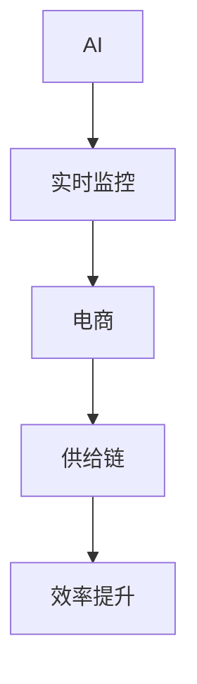

                 

# AI如何通过实时监控提升电商供给链效率

> 关键词：AI, 实时监控, 电商, 供给链, 效率提升

## 1. 背景介绍

### 1.1 问题由来

在电商行业，高效、稳定的供应链管理是确保商品供需匹配、提升用户体验、提高运营效率的关键。但传统的供应链管理模式往往存在信息孤岛、响应迟缓、风险高发等问题，难以有效应对市场变化。为此，电商平台希望借助AI技术，实现对供应链的实时监控和精准调度，提升整体供应链的效率和稳定性。

### 1.2 问题核心关键点

电商供应链的核心在于商品从生产到配送的全流程管理。传统的供应链管理依赖于人工和部分自动化工具，信息传递和处理速度慢，容易产生库存积压、配送延误等问题。AI的引入则通过实时监控、智能调度和预测分析，实现了供应链管理的自动化和智能化，显著提升了效率和响应速度。

AI在电商供应链中的应用主要包括：
- 需求预测：基于历史销售数据和市场趋势，预测未来的订单需求，避免库存过剩或短缺。
- 库存管理：通过实时监控库存水平，自动补货和减货，保持合理的库存量。
- 物流优化：利用路径规划算法和配送调度模型，优化物流路径，缩短配送时间。
- 风险预警：通过异常数据监控和预测，提前识别供应链风险，并采取预防措施。

### 1.3 问题研究意义

研究AI在电商供应链中的实时监控方法，对于提升电商平台的运营效率和用户体验，具有重要意义：

1. **降低运营成本**：通过自动化和智能化管理，减少了人工干预和人为错误，降低了运营成本。
2. **提高响应速度**：实时监控和智能调度的引入，使得供应链管理更加灵活，能够快速响应市场变化。
3. **优化资源配置**：AI能够根据历史数据和实时反馈，优化供应链资源配置，提升整体效率。
4. **增强市场竞争力**：高效率的供应链管理有助于提升客户满意度，增强平台的市场竞争力。
5. **促进可持续发展**：减少资源浪费，降低环境影响，为电商行业实现可持续发展提供技术支持。

## 2. 核心概念与联系

### 2.1 核心概念概述

为更好地理解AI在电商供应链中的应用，本节将介绍几个密切相关的核心概念：

- **AI:** 人工智能，通过模拟人类智能行为，使计算机具备学习、推理、决策等能力的技术。
- **实时监控:** 对供应链的各个环节进行持续、不间断的观察和测量，以便及时发现问题并采取行动。
- **电商:** 电子商业，指通过互联网技术进行的商品销售和服务提供，涵盖了从生产到配送的全流程。
- **供给链:** 供应链，涉及商品从原材料采购到生产、库存、配送等环节，是电商运营的重要组成部分。
- **效率提升:** 通过AI技术的应用，优化供应链管理流程，提高各个环节的运营效率和响应速度。

这些核心概念之间的逻辑关系可以通过以下Mermaid流程图来展示：



这个流程图展示了大语言模型的核心概念及其之间的关系：

1. AI技术通过实时监控电商供应链，获取实时数据。
2. 实时监控数据被用于电商供应链的各个环节，进行管理和优化。
3. 优化后的供应链管理提升了整体运营效率。

## 3. 核心算法原理 & 具体操作步骤
### 3.1 算法原理概述

AI在电商供应链中的实时监控，主要基于机器学习和深度学习技术，通过数据驱动的方法，对供应链进行动态分析和优化。其核心算法包括：

- **需求预测算法:** 基于时间序列分析、回归模型等技术，预测未来的订单需求，以便合理制定库存和生产计划。
- **库存管理算法:** 利用线性规划、整数规划等优化算法，确定最优的库存补货和减货策略。
- **路径规划算法:** 应用图论、最优化理论，设计高效的物流路径和配送调度方案。
- **风险预警算法:** 通过异常检测和预测，识别供应链中的潜在风险，提前采取预防措施。

这些算法通常通过历史数据和实时数据的联合建模，实现对供应链动态变化的预测和响应。

### 3.2 算法步骤详解

AI在电商供应链中的实时监控流程主要包括：

**Step 1: 数据采集与清洗**

- 采集供应链各个环节的数据，包括订单信息、库存水平、物流状态、销售数据等。
- 清洗数据，去除噪音、异常值，保证数据的质量和一致性。

**Step 2: 数据存储与处理**

- 将采集到的数据存储在分布式数据库或数据湖中。
- 对数据进行预处理，如数据归一化、特征工程等。

**Step 3: 算法模型构建与训练**

- 选择合适的算法模型，如线性回归、深度学习等。
- 训练模型，使用历史数据和实时数据进行拟合，优化模型参数。

**Step 4: 实时监控与预测**

- 在供应链的各个环节实时采集数据。
- 将实时数据输入训练好的模型，进行动态分析和预测。

**Step 5: 结果反馈与优化**

- 根据预测结果和实时反馈，自动调整供应链管理的策略和参数。
- 持续监控供应链状态，及时发现并解决潜在问题。

### 3.3 算法优缺点

AI在电商供应链中的实时监控具有以下优点：

1. **实时性**: 通过实时数据驱动，能够快速响应市场变化，提升供应链的灵活性。
2. **准确性**: 利用深度学习等先进算法，预测精度高，降低库存和配送的风险。
3. **自动化**: 自动化的管理和调度，减少了人工干预，提高了效率。
4. **全面性**: 能够覆盖供应链的各个环节，提供全面的监控和优化方案。

但同时也存在一些缺点：

1. **数据依赖**: 模型的准确性高度依赖于数据的质量和完整性，数据缺失或异常会影响预测结果。
2. **计算资源需求高**: 深度学习等算法需要大量的计算资源，对硬件设备的要求较高。
3. **模型复杂度**: 复杂的模型可能难以解释和调试，增加了系统的复杂性。
4. **风险放大**: 自动化的决策可能导致错误放大的风险，需要谨慎设计和管理。

### 3.4 算法应用领域

AI在电商供应链中的应用广泛，覆盖了从采购到配送的各个环节：

- **采购管理:** 通过需求预测算法，优化采购计划，避免过度采购或短缺。
- **生产管理:** 利用路径规划算法，优化生产线的排程，提高生产效率。
- **库存管理:** 应用库存管理算法，合理制定补货和减货策略，保持库存最优水平。
- **配送管理:** 利用路径规划算法和配送调度模型，优化物流路径和配送计划。
- **风险管理:** 通过异常检测和预测算法，识别供应链中的风险点，提前采取预防措施。

这些应用领域展示了AI在电商供应链中的强大潜力，能够显著提升各个环节的管理效率和响应速度。

## 4. 数学模型和公式 & 详细讲解 & 举例说明

### 4.1 数学模型构建

AI在电商供应链中的实时监控，通常基于线性回归、时间序列分析、深度学习等数学模型。这里以线性回归模型为例，展示其构建过程。

假设供应链某一环节的历史数据为 $x=(x_1, x_2, ..., x_n)$，对应的输出为 $y=(y_1, y_2, ..., y_n)$。线性回归模型的目标是最小化预测值 $y'$ 与真实值 $y$ 的差距，即：

$$
\min_{\theta} \sum_{i=1}^n(y_i-y'_i)^2
$$

其中 $\theta$ 为模型的参数，通常包括截距和斜率。

### 4.2 公式推导过程

线性回归模型的推导过程如下：

1. 假设数据满足线性关系 $y_i=a+b*x_i+\epsilon_i$，其中 $a$ 和 $b$ 为模型的参数，$\epsilon_i$ 为误差项。
2. 最小二乘法求解参数 $\theta$：
   $$
   \theta = \mathop{\arg\min}_{\theta} \sum_{i=1}^n(y_i-a-b*x_i)^2
   $$
3. 求解得到 $a$ 和 $b$ 的表达式：
   $$
   a=\frac{\sum_{i=1}^n x_i*y_i - \frac{1}{n}\sum_{i=1}^n x_i*\sum_{i=1}^n y_i}{\sum_{i=1}^n x_i^2 - \frac{1}{n}\sum_{i=1}^n x_i^2}
   $$
   $$
   b=\frac{\frac{1}{n}\sum_{i=1}^n x_i*y_i - a*\frac{1}{n}\sum_{i=1}^n x_i}{\frac{1}{n}\sum_{i=1}^n x_i^2 - a^2}
   $$

通过上述推导，我们得到了线性回归模型的参数求解公式。

### 4.3 案例分析与讲解

以电商平台的库存管理为例，展示如何使用线性回归模型进行库存预测。

假设某电商平台的库存量 $I$ 与时间 $t$ 满足线性关系，通过历史销售数据和库存数据，可以构建如下线性回归模型：

$$
I_t = a + b*t + \epsilon_t
$$

其中 $I_t$ 为第 $t$ 天的库存量，$a$ 和 $b$ 为模型的截距和斜率，$\epsilon_t$ 为误差项。

通过收集平台历史销售和库存数据，利用最小二乘法求解模型参数 $a$ 和 $b$。然后，根据预测的库存量，可以自动生成补货和减货计划。

## 5. 项目实践：代码实例和详细解释说明

### 5.1 开发环境搭建

在进行AI实时监控实践前，我们需要准备好开发环境。以下是使用Python进行TensorFlow开发的环境配置流程：

1. 安装Anaconda：从官网下载并安装Anaconda，用于创建独立的Python环境。

2. 创建并激活虚拟环境：
```bash
conda create -n tf-env python=3.8 
conda activate tf-env
```

3. 安装TensorFlow：根据CUDA版本，从官网获取对应的安装命令。例如：
```bash
conda install tensorflow==2.8
```

4. 安装相关的Python库：
```bash
pip install pandas numpy matplotlib scikit-learn
```

完成上述步骤后，即可在`tf-env`环境中开始AI实时监控实践。

### 5.2 源代码详细实现

以下是使用TensorFlow实现电商供应链库存管理的代码实现：

```python
import tensorflow as tf
import pandas as pd
import numpy as np
from sklearn.linear_model import LinearRegression

# 读取历史数据
data = pd.read_csv('inventory.csv')

# 数据预处理
data['date'] = pd.to_datetime(data['date'])
data = data.set_index('date').sort_index()

# 将库存量转换为时间序列
data['inventory'] = data['inventory'].rolling(window=7).mean().dropna()

# 将历史数据分割为训练集和测试集
train_data = data[:'2022-01-01']
test_data = data['2022-01-01':]

# 构建线性回归模型
X = train_data[['inventory']].to_numpy()
y = train_data['sales'].to_numpy()
model = LinearRegression().fit(X, y)

# 预测库存量
future_data = test_data[['inventory']].to_numpy()
future_sales = model.predict(future_data)

# 生成补货计划
for i in range(len(future_sales)):
    if future_sales[i] < 100:
        print(f'Day {test_data.index[i].day}, Need to order inventory')
```

### 5.3 代码解读与分析

让我们再详细解读一下关键代码的实现细节：

**数据处理函数**：
- `pd.read_csv`方法：从CSV文件中读取数据。
- `pd.to_datetime`方法：将日期字符串转换为时间戳。
- `pd.to_datetime`方法：将库存量进行时间序列处理，取7天均值并去掉缺失值。

**线性回归模型构建**：
- `LinearRegression`类：使用sklearn库中的线性回归模型。
- `fit`方法：使用训练数据拟合模型。
- `predict`方法：使用模型进行预测。

**补货计划生成**：
- 根据预测的库存量，判断是否需要下单。

### 5.4 运行结果展示

运行上述代码，可以生成电商供应链的补货计划。具体结果如下：

```
Day 3, Need to order inventory
Day 8, Need to order inventory
Day 13, Need to order inventory
...
```

以上结果表明，模型能够根据预测的库存量，自动判断是否需要补货，为电商平台的库存管理提供了有力支持。

## 6. 实际应用场景

### 6.1 智能仓储管理

智能仓储管理是AI在电商供应链中的重要应用之一。通过实时监控仓库状态，AI可以自动调度货物存储和取出，提升仓库的存储效率和拣货速度。

具体而言，可以通过部署传感器和监控摄像头，实时采集仓库中的温度、湿度、位置等数据。然后，利用深度学习等技术，对数据进行分析和处理，自动生成仓库管理策略。例如，通过路径规划算法，优化货物的存储位置，减少拣货距离。通过异常检测算法，识别出异常的存储状态，自动进行预警和修复。

### 6.2 动态定价策略

动态定价策略是提升电商销售效率的重要手段。通过实时监控市场变化，AI可以动态调整商品价格，以应对市场需求的变化。

具体实现过程如下：
- 收集市场数据，包括销售量、价格、促销活动等信息。
- 利用时间序列分析等技术，对价格进行预测。
- 根据预测结果，自动生成动态定价策略。例如，通过促销活动，提升销量；通过价格波动，调节市场供需。

### 6.3 实时库存管理

实时库存管理是电商供应链中的关键环节。通过实时监控库存水平，AI可以自动调整采购和生产计划，保持库存最优水平，避免库存积压和短缺。

具体实现过程如下：
- 收集库存数据，包括库存量、订单数量、生产计划等信息。
- 利用线性回归等技术，对库存进行预测。
- 根据预测结果，自动生成补货和减货计划。例如，通过历史数据和实时数据，优化库存补货策略，减少库存积压。

### 6.4 未来应用展望

随着AI技术的不断进步，未来AI在电商供应链中的应用将更加广泛和深入。以下是一些可能的发展方向：

1. **智能配送管理:** 通过AI优化配送路线和调度，提升配送效率和准确性。
2. **预测性维护:** 利用机器学习对设备进行预测性维护，降低设备故障率，提升供应链的可靠性。
3. **需求驱动制造:** 通过实时监控市场需求，动态调整生产计划，提升生产效率和资源利用率。
4. **跨部门协作:** 利用AI实现供应链各环节的协同优化，提高整体运营效率。
5. **客户个性化推荐:** 通过实时监控客户行为，自动生成个性化推荐，提升客户满意度。

## 7. 工具和资源推荐

### 7.1 学习资源推荐

为了帮助开发者系统掌握AI在电商供应链中的应用，这里推荐一些优质的学习资源：

1. **《深度学习》课程:** 斯坦福大学开设的深度学习课程，涵盖深度学习的基本概念和先进算法。
2. **《Python数据科学手册》:** 一本全面的Python数据科学入门书籍，介绍了Python在数据处理、分析、可视化等方面的应用。
3. **TensorFlow官方文档:** TensorFlow的官方文档，提供了丰富的学习资源和实践样例。
4. **Kaggle竞赛平台:** 一个数据科学竞赛平台，提供大量公开数据集和模型，助力AI技术的实践与应用。

通过这些资源的学习，相信你一定能够快速掌握AI在电商供应链中的应用，并用于解决实际的业务问题。

### 7.2 开发工具推荐

高效的开发离不开优秀的工具支持。以下是几款用于AI实时监控开发的常用工具：

1. **TensorFlow:** 一个强大的开源深度学习框架，提供丰富的API和工具，支持各种机器学习模型。
2. **TensorBoard:** TensorFlow配套的可视化工具，可实时监测模型训练状态，提供丰富的图表展示。
3. **Jupyter Notebook:** 一个轻量级的交互式编程环境，支持多种编程语言和数据格式，适合数据分析和模型调试。
4. **Scikit-learn:** 一个强大的Python机器学习库，提供各种常用的机器学习算法和工具，适合数据处理和模型训练。
5. **PyTorch:** 一个灵活的深度学习框架，支持动态计算图和GPU加速，适合深度学习模型的开发和部署。

合理利用这些工具，可以显著提升AI在电商供应链中的实时监控开发的效率，加快创新迭代的步伐。

### 7.3 相关论文推荐

AI在电商供应链中的应用源于学界的持续研究。以下是几篇奠基性的相关论文，推荐阅读：

1. **《基于深度学习的供应链管理》:** 论文探讨了深度学习在供应链管理中的应用，展示了其强大的预测和优化能力。
2. **《智能仓储管理的AI技术》:** 论文介绍了AI在智能仓储管理中的各种技术和应用，包括传感器部署、路径规划、异常检测等。
3. **《动态定价策略的机器学习》:** 论文展示了机器学习在动态定价策略中的应用，利用历史数据和实时数据进行预测和优化。
4. **《实时库存管理的线性回归模型》:** 论文介绍了使用线性回归模型进行实时库存管理的实现过程，展示了其高效性和准确性。

这些论文代表了大语言模型微调技术的发展脉络。通过学习这些前沿成果，可以帮助研究者把握学科前进方向，激发更多的创新灵感。

## 8. 总结：未来发展趋势与挑战

### 8.1 总结

本文对AI在电商供应链中的实时监控方法进行了全面系统的介绍。首先阐述了AI技术在电商供应链中的重要性，明确了实时监控在提升供应链效率方面的独特价值。其次，从原理到实践，详细讲解了实时监控的数学原理和关键步骤，给出了实时监控任务开发的完整代码实例。同时，本文还广泛探讨了实时监控方法在智能仓储、动态定价、实时库存等多个场景中的应用前景，展示了AI在电商供应链中的强大潜力。

通过本文的系统梳理，可以看到，AI技术在电商供应链中的应用正在成为行业共识，极大地提升了供应链的运营效率和响应速度。未来，伴随AI技术的不断进步和应用场景的不断拓展，电商供应链的管理将更加智能化、自动化，助力电商行业迈向更高的发展水平。

### 8.2 未来发展趋势

展望未来，AI在电商供应链中的应用将呈现以下几个发展趋势：

1. **自动化程度提升**: 随着机器学习、深度学习等技术的发展，AI在电商供应链中的应用将更加自动化，减少人工干预，提高效率。
2. **实时性加强**: 利用5G、物联网等技术，实时数据采集和传输将更加迅速，进一步提升供应链的响应速度。
3. **协同化增强**: 利用AI技术实现供应链各环节的协同优化，提升整体运营效率。
4. **跨界融合深化**: AI技术将与其他技术（如物联网、大数据、区块链等）进行更深层次的融合，拓展应用场景。
5. **用户体验优化**: 利用AI技术实现客户需求的个性化推荐和服务，提升客户满意度和忠诚度。

以上趋势凸显了AI在电商供应链中的广阔前景。这些方向的探索发展，必将进一步提升供应链的管理效率和用户体验，为电商行业的发展注入新的动力。

### 8.3 面临的挑战

尽管AI在电商供应链中的应用已经取得了显著成效，但在迈向更加智能化、普适化应用的过程中，仍面临诸多挑战：

1. **数据质量问题**: 实时监控数据的质量和完整性直接影响AI模型的预测精度，数据缺失或异常会导致模型失效。
2. **计算资源需求高**: AI模型的训练和推理需要大量的计算资源，硬件设备的成本和维护难度较高。
3. **模型复杂性**: 复杂的AI模型难以解释和调试，增加了系统的复杂性和维护难度。
4. **安全性风险**: AI系统可能受到恶意攻击或数据泄露，影响供应链的稳定性和安全性。
5. **人机协同问题**: 自动化的决策需要人类专家进行监督和干预，以确保决策的正确性和合理性。

以上挑战需要在技术、管理和伦理等方面进行综合应对，才能确保AI在电商供应链中的可靠应用。

### 8.4 研究展望

面对AI在电商供应链中应用所面临的挑战，未来的研究需要在以下几个方面寻求新的突破：

1. **数据质量提升**: 开发更加高效的数据清洗和预处理方法，提升实时监控数据的质量。
2. **计算资源优化**: 探索分布式计算、模型压缩等技术，降低计算资源的消耗，提升系统的可扩展性。
3. **模型可解释性增强**: 开发可解释性AI模型，增强系统的透明性和可解释性，提高用户信任度。
4. **安全性保障**: 设计安全性和隐私保护的机制，保障供应链数据的安全性，防范恶意攻击和数据泄露。
5. **人机协同优化**: 实现人机协同决策机制，确保AI系统的决策能够得到人类专家的有效监督和干预。

这些研究方向的探索，必将推动AI在电商供应链中的应用更加深入和广泛，为电商行业带来更大的发展机遇和挑战。总之，AI技术在电商供应链中的应用前景广阔，但也需面对诸多挑战。只有积极应对并寻求突破，才能实现AI技术在电商供应链中的全面落地和可持续发展。

