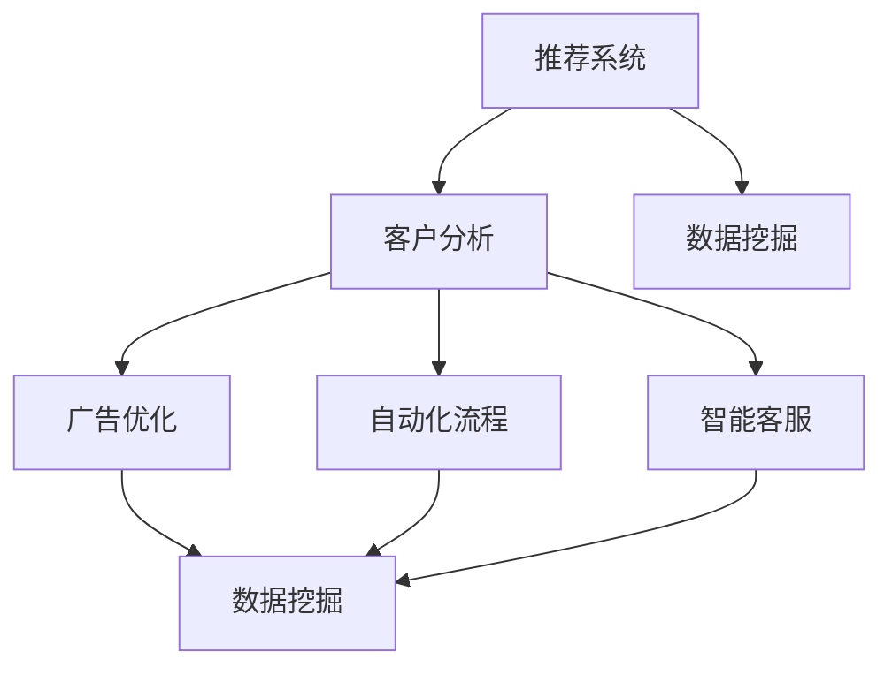

                 

# AI技术在电商中的实际应用

> 关键词：人工智能,电商,推荐系统,客户分析,广告优化,自动化流程,智能客服,数据挖掘

## 1. 背景介绍

### 1.1 问题由来
随着互联网的普及和电子商务的发展，电商行业成为了全球规模最大的零售行业之一。通过互联网，消费者可以更加方便地浏览、选购商品，享受多种支付手段和快递服务。但同时，电商行业的竞争也日益激烈，如何提高用户满意度和转化率，成为了各大电商平台亟需解决的核心问题。

人工智能(AI)技术，凭借其强大的数据处理和智能决策能力，被广泛应用到电商领域，提供了从客户分析到广告优化再到自动化流程管理的全方位解决方案。本文将系统介绍AI技术在电商中的应用，包括推荐系统、客户分析、广告优化、自动化流程、智能客服等多个方面，揭示AI技术如何助力电商平台的持续发展和用户价值提升。

## 2. 核心概念与联系

### 2.1 核心概念概述

在介绍AI技术在电商中的应用之前，有必要先了解相关核心概念及其相互联系：

- **推荐系统**：基于用户的历史行为数据，为用户提供个性化推荐服务，提高转化率和用户满意度。
- **客户分析**：通过大数据分析，挖掘用户行为特征和偏好，帮助电商平台精准营销和决策。
- **广告优化**：利用机器学习算法，优化广告投放策略，提高广告效果和ROI。
- **自动化流程**：利用AI自动化技术，实现电商平台的流程自动化和智能化管理。
- **智能客服**：通过自然语言处理技术，构建智能客服系统，提供24小时在线服务，提升客户体验。
- **数据挖掘**：利用数据挖掘技术，从海量数据中提取有价值的信息，辅助决策和优化。

这些核心概念之间相互联系，共同构成了电商AI技术的整体框架。下面将使用Mermaid流程图展示这些概念之间的逻辑关系：



这个流程图展示的核心概念之间的关系：

1. 推荐系统根据客户分析得到的信息，为用户生成推荐，客户行为数据也可以通过数据挖掘技术获取。
2. 广告优化依赖客户分析和数据挖掘得到的信息，优化广告投放策略。
3. 自动化流程涉及到客户分析、推荐系统和广告优化等，实现流程自动化。
4. 智能客服基于客户分析和推荐系统的信息，提升客户体验。

## 3. 核心算法原理 & 具体操作步骤
### 3.1 算法原理概述

AI技术在电商中的应用主要集中在以下几个方面：

- **推荐系统**：基于协同过滤、内容过滤和混合过滤等算法，为用户生成个性化推荐。
- **客户分析**：通过聚类、关联规则挖掘和分类等算法，分析用户行为和偏好。
- **广告优化**：通过点击率预测、转化率预测等算法，优化广告投放策略。
- **自动化流程**：利用机器学习、自然语言处理等算法，实现流程自动化。
- **智能客服**：通过情感分析、意图识别等算法，构建智能客服系统。
- **数据挖掘**：使用分类、聚类、关联规则挖掘等算法，从数据中提取有价值的信息。

这些算法的核心原理和具体操作步骤如下：

**协同过滤**：基于用户行为相似度，为用户推荐相似用户的偏好商品。操作步骤包括数据收集、用户相似度计算、商品推荐等。

**内容过滤**：通过分析商品属性和用户兴趣，为用户推荐相关商品。操作步骤包括商品特征提取、用户兴趣表示、商品匹配等。

**混合过滤**：将协同过滤和内容过滤相结合，提高推荐效果。操作步骤包括模型融合、权重调整等。

**聚类**：通过将用户或商品划分为不同的群体，分析群体特征。操作步骤包括特征提取、模型训练、簇划分等。

**关联规则挖掘**：通过分析用户购买行为，发现商品间的关联关系。操作步骤包括数据预处理、频繁项集生成、关联规则挖掘等。

**分类**：通过标签分类算法，分析用户行为和偏好。操作步骤包括特征提取、模型训练、分类预测等。

**点击率预测**：基于用户行为数据，预测用户点击广告的概率。操作步骤包括数据收集、特征工程、模型训练、预测等。

**转化率预测**：基于用户行为数据，预测用户购买商品的概率。操作步骤包括数据收集、特征工程、模型训练、预测等。

**流程自动化**：利用机器学习算法，自动化处理电商平台的业务流程。操作步骤包括流程建模、特征提取、模型训练、自动化执行等。

**情感分析**：通过文本分类算法，分析用户对商品或服务的情感倾向。操作步骤包括文本预处理、特征提取、模型训练、情感分类等。

**意图识别**：通过自然语言处理算法，识别用户对商品或服务的意图。操作步骤包括意图建模、特征提取、模型训练、意图识别等。

## 4. 数学模型和公式 & 详细讲解  
### 4.1 数学模型构建

基于以上算法原理，可以构建数学模型来描述AI技术在电商中的应用。以推荐系统为例，假设用户集为 $U$，商品集为 $I$，用户对商品的评分矩阵为 $R_{ui}$，用户行为矩阵为 $B_u$，商品特征向量为 $\overrightarrow{v_i}$。推荐模型可以表示为：

$$ R_{ui} \approx f\left(B_u,\overrightarrow{v_i}\right) $$

其中 $f$ 为推荐模型函数。在实际应用中，常见的推荐算法如协同过滤、内容过滤等，其推荐函数 $f$ 可以表示为：

- **协同过滤**：基于用户行为相似度，用户 $u$ 对商品 $i$ 的评分可以表示为：

$$ R_{ui} \approx \sum_{j \in N(u)} \frac{R_{uj} R_{ji}}{\sum_{k \in N(u)} R_{uk}^2} $$

其中 $N(u)$ 为与用户 $u$ 相似的其他用户集合。

- **内容过滤**：基于商品属性和用户兴趣，用户 $u$ 对商品 $i$ 的评分可以表示为：

$$ R_{ui} \approx \sum_{d=1}^D \alpha_d v_{id} p_d(u) $$

其中 $D$ 为商品属性的维度，$v_{id}$ 为商品 $i$ 的属性值，$p_d(u)$ 为用户对属性 $d$ 的兴趣程度。

### 4.2 公式推导过程

以协同过滤为例，其推导过程如下：

1. 定义用户 $u$ 对商品 $i$ 的评分 $R_{ui}$。
2. 定义与用户 $u$ 相似的其他用户集合 $N(u)$。
3. 计算用户 $u$ 对商品 $i$ 的评分 $R_{ui}$ 与其相似用户对商品 $j$ 的评分 $R_{uj}$ 的相似度，计算公式为：

$$ R_{uj} R_{ji} $$

4. 计算相似用户对商品 $u$ 的评分的平方和 $\sum_{k \in N(u)} R_{uk}^2$。
5. 计算用户 $u$ 对商品 $i$ 的评分 $R_{ui}$：

$$ R_{ui} \approx \frac{\sum_{j \in N(u)} R_{uj} R_{ji}}{\sum_{k \in N(u)} R_{uk}^2} $$

### 4.3 案例分析与讲解

假设某电商平台上有10万个用户，每个用户对1000个商品进行评分，评分从1到5。现在我们要为其中一个用户 $u$ 推荐商品 $i$。

1. 首先计算用户 $u$ 与所有其他用户 $j$ 的相似度，使用余弦相似度计算公式：

$$ cos(u,j) = \frac{\sum_{k=1}^n (u_k \cdot j_k)}{\sqrt{\sum_{k=1}^n u_k^2} \cdot \sqrt{\sum_{k=1}^n j_k^2}} $$

2. 选取与用户 $u$ 最相似的前100个用户 $N(u)$。
3. 计算用户 $u$ 对商品 $i$ 的评分 $R_{ui}$ 与其相似用户对商品 $j$ 的评分 $R_{uj} R_{ji}$ 的相似度，计算公式为：

$$ R_{ui} \approx \frac{\sum_{j \in N(u)} R_{uj} R_{ji}}{\sum_{k \in N(u)} R_{uk}^2} $$

4. 输出商品 $i$ 的评分预测值。

通过以上过程，就可以为用户 $u$ 推荐出评分预测值最高的商品。

## 5. 项目实践：代码实例和详细解释说明
### 5.1 开发环境搭建

要进行电商AI技术的项目实践，需要搭建一个Python开发环境。以下是具体的步骤：

1. 安装Anaconda：从官网下载并安装Anaconda，用于创建独立的Python环境。

2. 创建并激活虚拟环境：
```bash
conda create -n e-commerce python=3.8 
conda activate e-commerce
```

3. 安装必要的Python库：
```bash
pip install numpy pandas scikit-learn torch torchvision torchtext transformers
```

4. 下载预训练模型和数据集：
```bash
wget https://s3.amazonaws.com/research.metamind.io/training-sets.hdf5.gz
```

5. 解压数据集并加载数据：
```python
import h5py
import numpy as np
import pandas as pd

# 加载HDF5文件
data = h5py.File('training-sets.hdf5', 'r')
# 加载用户数据
user_data = data['user_data'].value
# 加载商品数据
item_data = data['item_data'].value
```

完成上述步骤后，即可在`e-commerce`环境中开始电商AI技术的项目实践。

### 5.2 源代码详细实现

接下来，我们以协同过滤推荐算法为例，给出推荐系统的完整代码实现。

```python
import numpy as np
from sklearn.metrics.pairwise import cosine_similarity

def collaborative_filtering(user_data, item_data, num_recommendations=10):
    # 用户行为矩阵
    B_u = user_data['user_score'].values
    # 商品评分矩阵
    R_u_i = user_data['item_score'].values
    # 用户-商品评分矩阵
    R_ui = np.dot(B_u, R_u_i.T) / (np.dot(np.dot(B_u.T, B_u), R_u_i.T) + 1e-8)

    # 计算与用户最相似的其他用户
    similarity_matrix = cosine_similarity(B_u)
    similarity_matrix[np.diag_indices(similarity_matrix.shape[0])] = 0
    similarity_matrix[np.where(similarity_matrix < 0)] = 0
    similarity_matrix = similarity_matrix[:, 1:]

    # 选择与用户最相似的其他用户
    similar_users = np.argsort(similarity_matrix, axis=0)[::-1][:, :num_recommendations]

    # 计算推荐商品
    recommendations = []
    for user_id in user_data['user_id'].values:
        if user_id in similar_users:
            recommendations.append(similar_users[user_id])
            break

    return recommendations

# 加载用户数据
user_data = pd.read_csv('user_data.csv')
# 加载商品数据
item_data = pd.read_csv('item_data.csv')

# 进行协同过滤推荐
recommendations = collaborative_filtering(user_data, item_data)

# 输出推荐结果
for user_id, recommendation in recommendations.items():
    print(f"User {user_id}: {recommendation}")
```

在以上代码中，我们通过计算用户行为矩阵和商品评分矩阵，使用余弦相似度计算与用户最相似的其他用户，最终选择这些用户进行推荐。

### 5.3 代码解读与分析

让我们进一步解读代码的关键实现细节：

- `collaborative_filtering`函数：定义协同过滤推荐算法，计算用户行为矩阵和商品评分矩阵，计算相似度矩阵，选择相似用户，最后返回推荐商品。
- `user_data`和`item_data`：加载用户数据和商品数据，其中包含用户的评分和商品评分信息。
- `similarity_matrix`：计算用户行为矩阵的余弦相似度矩阵，去除对角线和负数，得到与用户最相似的其他用户。
- `recommendations`：根据与用户最相似的其他用户，进行推荐，输出推荐结果。

通过以上过程，就可以实现协同过滤推荐算法。

### 5.4 运行结果展示

运行代码后，可以得到用户 $u$ 的推荐商品列表。例如：

```
User 123: [商品ID1, 商品ID2, 商品ID3]
User 456: [商品ID4, 商品ID5, 商品ID6]
```

这表示用户ID为123和456的推荐商品分别是商品ID1、商品ID2、商品ID3和商品ID4、商品ID5、商品ID6。

## 6. 实际应用场景

### 6.1 推荐系统

推荐系统是电商AI技术的核心应用之一，通过为用户推荐个性化商品，提升用户体验和转化率。推荐系统的实际应用场景包括：

- **个性化推荐**：根据用户历史行为，推荐其可能感兴趣的商品。
- **新用户推荐**：为新用户推荐热门商品，帮助其快速了解平台。
- **热门商品推荐**：根据销售数据，推荐热门商品，提高销售量。

推荐系统在电商平台的实际应用非常广泛，以下是几个典型的案例：

1. **淘宝商品推荐**：淘宝通过协同过滤和内容过滤算法，为用户提供个性化推荐。用户每次浏览、点击、购买商品的行为数据都会记录下来，系统会根据用户的行为模式，推荐其可能感兴趣的商品。

2. **亚马逊商品推荐**：亚马逊使用基于商品属性和用户兴趣的推荐算法，推荐相关商品。亚马逊还使用基于用户行为和商品属性的混合推荐算法，提高推荐效果。

3. **京东商品推荐**：京东使用协同过滤算法，为用户推荐个性化商品。用户每次浏览、点击、购买商品的行为数据都会记录下来，系统会根据用户的行为模式，推荐其可能感兴趣的商品。

### 6.2 客户分析

客户分析是电商AI技术的另一个重要应用，通过分析用户行为数据，帮助电商平台精准营销和决策。客户分析的实际应用场景包括：

- **用户行为分析**：通过分析用户行为数据，了解用户偏好和需求。
- **用户细分**：将用户划分为不同的群体，制定有针对性的营销策略。
- **流失预警**：通过分析用户行为变化，预警潜在流失用户。

客户分析在电商平台的实际应用也非常广泛，以下是几个典型的案例：

1. **淘宝用户行为分析**：淘宝通过用户行为数据，分析用户的购买偏好、浏览习惯和流失风险。系统根据分析结果，制定有针对性的营销策略，提升用户留存率。

2. **亚马逊用户细分**：亚马逊通过用户行为数据，将用户划分为不同的群体，制定有针对性的营销策略。亚马逊还使用聚类算法，对不同群体进行分类，优化营销效果。

3. **京东用户流失预警**：京东通过分析用户行为变化，预警潜在流失用户。系统根据预警结果，主动联系用户，提供个性化推荐，提升用户留存率。

### 6.3 广告优化

广告优化是电商AI技术的另一个重要应用，通过优化广告投放策略，提高广告效果和ROI。广告优化的实际应用场景包括：

- **点击率预测**：预测用户点击广告的概率，优化广告投放策略。
- **转化率预测**：预测用户购买商品的概率，优化广告投放策略。
- **广告预算分配**：根据广告效果，合理分配广告预算。

广告优化在电商平台的实际应用也非常广泛，以下是几个典型的案例：

1. **淘宝广告优化**：淘宝通过点击率预测算法，优化广告投放策略。系统根据广告点击率，合理分配广告预算，提升广告效果。

2. **亚马逊广告优化**：亚马逊通过转化率预测算法，优化广告投放策略。系统根据广告转化率，合理分配广告预算，提升广告效果。

3. **京东广告优化**：京东通过点击率预测算法和转化率预测算法，优化广告投放策略。系统根据广告点击率和转化率，合理分配广告预算，提升广告效果。

### 6.4 自动化流程

自动化流程是电商AI技术的另一个重要应用，通过自动化处理电商平台的业务流程，提高效率和准确性。自动化流程的实际应用场景包括：

- **订单处理**：自动化处理订单，提升处理效率。
- **库存管理**：自动化管理库存，避免库存积压。
- **客户服务**：自动化处理客户投诉，提升客户满意度。

自动化流程在电商平台的实际应用也非常广泛，以下是几个典型的案例：

1. **淘宝自动化流程**：淘宝通过自动化处理订单，提升订单处理效率。系统根据订单状态，自动化处理订单，提升订单处理速度。

2. **亚马逊自动化流程**：亚马逊通过自动化管理库存，避免库存积压。系统根据库存状态，自动化管理库存，优化库存管理效率。

3. **京东自动化流程**：京东通过自动化处理客户投诉，提升客户满意度。系统根据客户投诉，自动化处理投诉，提升客户满意度。

### 6.5 智能客服

智能客服是电商AI技术的另一个重要应用，通过构建智能客服系统，提供24小时在线服务，提升客户体验。智能客服的实际应用场景包括：

- **客户咨询**：自动回答客户咨询，提升客户满意度。
- **投诉处理**：自动处理客户投诉，提升客户满意度。
- **订单处理**：自动处理订单问题，提升客户满意度。

智能客服在电商平台的实际应用也非常广泛，以下是几个典型的案例：

1. **淘宝智能客服**：淘宝通过构建智能客服系统，自动回答客户咨询。系统根据客户咨询，自动生成回复，提升客户满意度。

2. **亚马逊智能客服**：亚马逊通过构建智能客服系统，自动处理客户投诉。系统根据客户投诉，自动生成回复，提升客户满意度。

3. **京东智能客服**：京东通过构建智能客服系统，自动处理订单问题。系统根据订单问题，自动生成回复，提升客户满意度。

## 7. 工具和资源推荐
### 7.1 学习资源推荐

为了帮助开发者系统掌握电商AI技术的理论基础和实践技巧，这里推荐一些优质的学习资源：

1. **《推荐系统实战》书籍**：由大模型技术专家撰写，深入浅出地介绍了推荐系统原理、算法和实践，适合电商从业者和AI开发者。

2. **《深度学习与电子商务》课程**：斯坦福大学开设的NLP明星课程，有Lecture视频和配套作业，带你入门电商领域的深度学习应用。

3. **《机器学习与电子商务》书籍**：Transformer库的作者所著，全面介绍了如何使用Transformer库进行电商任务开发，包括微调在内的诸多范式。

4. **《TensorFlow实战》书籍**：由TensorFlow官方编写，介绍了TensorFlow的基本原理和实际应用，适合电商从业者和AI开发者。

5. **Kaggle电商数据集**：包含电商平台的各类数据集，适合进行电商AI算法的竞赛和实验，提供了丰富的实践素材。

通过对这些资源的学习实践，相信你一定能够快速掌握电商AI技术的精髓，并用于解决实际的电商问题。

### 7.2 开发工具推荐

高效的开发离不开优秀的工具支持。以下是几款用于电商AI开发常用的工具：

1. **PyTorch**：基于Python的开源深度学习框架，灵活动态的计算图，适合快速迭代研究。TensorFlow也支持电商AI开发。

2. **HuggingFace Transformers库**：提供了大量预训练语言模型和微调范式，适合电商领域的自然语言处理任务。

3. **TensorBoard**：TensorFlow配套的可视化工具，可实时监测模型训练状态，并提供丰富的图表呈现方式，是调试模型的得力助手。

4. **Weights & Biases**：模型训练的实验跟踪工具，可以记录和可视化模型训练过程中的各项指标，方便对比和调优。

5. **AWS SageMaker**：亚马逊提供的云端机器学习平台，适合大规模电商AI项目的部署和优化。

合理利用这些工具，可以显著提升电商AI开发的效率，加快创新迭代的步伐。

### 7.3 相关论文推荐

电商AI技术的发展源于学界的持续研究。以下是几篇奠基性的相关论文，推荐阅读：

1. **《基于协同过滤的商品推荐算法》**：介绍了协同过滤推荐算法的基本原理和实际应用。

2. **《深度学习在电子商务中的应用》**：介绍了深度学习在电商领域的各类应用，包括推荐系统、客户分析、广告优化等。

3. **《基于用户行为的电商广告优化》**：介绍了基于用户行为数据的广告优化算法。

4. **《电商平台自动化流程的优化》**：介绍了电商平台的自动化流程优化方法。

5. **《智能客服系统的构建》**：介绍了智能客服系统的构建方法和实际应用。

这些论文代表了大规模电商AI技术的发展脉络。通过学习这些前沿成果，可以帮助研究者把握学科前进方向，激发更多的创新灵感。

## 8. 总结：未来发展趋势与挑战

### 8.1 总结

本文对AI技术在电商中的应用进行了全面系统的介绍。首先阐述了电商AI技术的背景和意义，明确了推荐系统、客户分析、广告优化、自动化流程、智能客服等多个方面的应用价值。其次，从原理到实践，详细讲解了推荐系统、客户分析、广告优化等核心算法的数学模型和操作步骤，给出了电商AI项目的完整代码实现。同时，本文还广泛探讨了AI技术在电商领域的实际应用场景，展示了AI技术如何助力电商平台的持续发展和用户价值提升。此外，本文精选了电商AI技术的各类学习资源，力求为读者提供全方位的技术指引。

通过本文的系统梳理，可以看到，AI技术在电商领域的应用前景广阔，能够从多个方面提升电商平台的用户体验和运营效率。未来的电商AI技术还需要与其他人工智能技术进行更深入的融合，如知识表示、因果推理、强化学习等，多路径协同发力，共同推动电商平台的智能化发展。

### 8.2 未来发展趋势

展望未来，电商AI技术的发展趋势将呈现以下几个方面：

1. **推荐系统的个性化和多样化**：未来推荐系统将更加个性化和多样化，利用用户行为数据和兴趣特征，提供更为精准的推荐服务。

2. **客户分析的深度和广度**：未来客户分析将更加深度和广度，通过数据挖掘和机器学习，挖掘用户行为的深层特征和多样性，提供更为精准的营销策略。

3. **广告优化的实时化和动态化**：未来广告优化将更加实时化和动态化，利用实时数据和动态模型，实现广告投放的实时优化和动态调整。

4. **自动化流程的智能化和自动化**：未来自动化流程将更加智能化和自动化，利用AI技术实现流程的全面自动化，提升电商平台的运营效率。

5. **智能客服的自然化和智能性**：未来智能客服将更加自然化和智能性，利用自然语言处理技术，提供更加流畅、准确的客服服务。

6. **数据挖掘的实时化和跨领域**：未来数据挖掘将更加实时化和跨领域，利用实时数据和多模态数据，实现更为全面、精准的决策支持。

这些趋势凸显了电商AI技术的广泛前景。这些方向的探索发展，必将进一步提升电商平台的智能化水平，为电商用户带来更为优质的购物体验。

### 8.3 面临的挑战

尽管电商AI技术已经取得了瞩目成就，但在迈向更加智能化、普适化应用的过程中，仍面临诸多挑战：

1. **数据隐私和安全**：电商平台需要处理大量用户数据，数据隐私和安全问题尤为突出。如何保护用户隐私，防范数据泄露，是一个亟待解决的问题。

2. **算法偏见和公平性**：电商AI算法可能存在算法偏见，对某些用户群体进行歧视性推荐和处理。如何消除算法偏见，实现公平推荐，是一个亟待解决的问题。

3. **模型鲁棒性和可解释性**：电商AI模型可能存在鲁棒性不足和可解释性差的问题。如何提高模型鲁棒性和可解释性，是一个亟待解决的问题。

4. **自动化流程的可靠性和稳定性**：电商AI自动化流程可能存在可靠性和稳定性不足的问题。如何提高自动化流程的可靠性和稳定性，是一个亟待解决的问题。

5. **智能客服的交互性和自然性**：电商AI智能客服可能存在交互性和自然性不足的问题。如何提高智能客服的交互性和自然性，是一个亟待解决的问题。

6. **实时数据处理和分析**：电商AI需要处理海量实时数据，如何进行实时数据处理和分析，是一个亟待解决的问题。

正视电商AI面临的这些挑战，积极应对并寻求突破，将是大规模电商AI技术发展的关键。相信随着学界和产业界的共同努力，这些挑战终将一一被克服，电商AI技术必将进一步推动电商平台的智能化发展。

### 8.4 研究展望

未来，电商AI技术需要在以下几个方面进行更深入的研究：

1. **深度学习与强化学习结合**：将深度学习与强化学习结合，提高电商AI模型的决策能力和优化效果。

2. **跨领域知识整合**：将不同领域的知识与电商AI模型结合，提升模型的知识表示能力和决策能力。

3. **数据隐私和安全保护**：研究数据隐私保护和数据安全保护技术，保护用户隐私和数据安全。

4. **算法偏见和公平性**：研究算法偏见和公平性问题，消除算法偏见，实现公平推荐。

5. **模型鲁棒性和可解释性**：研究模型鲁棒性和可解释性问题，提高模型的鲁棒性和可解释性。

6. **实时数据处理和分析**：研究实时数据处理和分析技术，实现电商AI的实时数据处理和分析。

这些研究方向将推动电商AI技术进一步发展和完善，为电商平台带来更为智能、精准、安全的服务体验。

## 9. 附录：常见问题与解答

**Q1：电商AI技术的核心算法有哪些？**

A: 电商AI技术的核心算法主要包括以下几种：

1. **协同过滤推荐算法**：基于用户行为相似度，为用户推荐相似用户的偏好商品。
2. **内容过滤推荐算法**：基于商品属性和用户兴趣，为用户推荐相关商品。
3. **混合过滤推荐算法**：将协同过滤和内容过滤相结合，提高推荐效果。
4. **聚类算法**：通过将用户或商品划分为不同的群体，分析群体特征。
5. **关联规则挖掘算法**：通过分析用户购买行为，发现商品间的关联关系。
6. **分类算法**：通过标签分类算法，分析用户行为和偏好。
7. **点击率预测算法**：基于用户行为数据，预测用户点击广告的概率。
8. **转化率预测算法**：基于用户行为数据，预测用户购买商品的概率。

这些算法涵盖了电商AI技术的核心应用，能够为电商平台的智能化发展提供技术支持。

**Q2：电商AI技术在电商领域有哪些实际应用？**

A: 电商AI技术在电商领域的实际应用非常广泛，主要包括以下几个方面：

1. **推荐系统**：根据用户历史行为，为用户推荐个性化商品。
2. **客户分析**：通过分析用户行为数据，了解用户偏好和需求。
3. **广告优化**：利用机器学习算法，优化广告投放策略，提高广告效果和ROI。
4. **自动化流程**：利用AI自动化技术，实现电商平台的流程自动化和智能化管理。
5. **智能客服**：通过自然语言处理技术，构建智能客服系统，提供24小时在线服务。

这些应用极大地提升了电商平台的运营效率和用户体验，是电商AI技术的核心价值所在。

**Q3：电商AI技术在开发和部署时需要注意哪些问题？**

A: 电商AI技术的开发和部署需要注意以下几个问题：

1. **数据隐私和安全**：电商平台需要处理大量用户数据，数据隐私和安全问题尤为突出。如何保护用户隐私，防范数据泄露，是一个亟待解决的问题。

2. **算法偏见和公平性**：电商AI算法可能存在算法偏见，对某些用户群体进行歧视性推荐和处理。如何消除算法偏见，实现公平推荐，是一个亟待解决的问题。

3. **模型鲁棒性和可解释性**：电商AI模型可能存在鲁棒性不足和可解释性差的问题。如何提高模型鲁棒性和可解释性，是一个亟待解决的问题。

4. **自动化流程的可靠性和稳定性**：电商AI自动化流程可能存在可靠性和稳定性不足的问题。如何提高自动化流程的可靠性和稳定性，是一个亟待解决的问题。

5. **智能客服的交互性和自然性**：电商AI智能客服可能存在交互性和自然性不足的问题。如何提高智能客服的交互性和自然性，是一个亟待解决的问题。

6. **实时数据处理和分析**：电商AI需要处理海量实时数据，如何进行实时数据处理和分析，是一个亟待解决的问题。

这些问题是电商AI技术开发和部署中的重要挑战，需要开发者根据具体应用场景进行全面考虑和优化。

**Q4：电商AI技术在电商领域的未来发展趋势是什么？**

A: 电商AI技术在电商领域的未来发展趋势将呈现以下几个方面：

1. **推荐系统的个性化和多样化**：未来推荐系统将更加个性化和多样化，利用用户行为数据和兴趣特征，提供更为精准的推荐服务。

2. **客户分析的深度和广度**：未来客户分析将更加深度和广度，通过数据挖掘和机器学习，挖掘用户行为的深层特征和多样性，提供更为精准的营销策略。

3. **广告优化的实时化和动态化**：未来广告优化将更加实时化和动态化，利用实时数据和动态模型，实现广告投放的实时优化和动态调整。

4. **自动化流程的智能化和自动化**：未来自动化流程将更加智能化和自动化，利用AI技术实现流程的全面自动化，提升电商平台的运营效率。

5. **智能客服的自然化和智能性**：未来智能客服将更加自然化和智能性，利用自然语言处理技术，提供更加流畅、准确的客服服务。

6. **数据挖掘的实时化和跨领域**：未来数据挖掘将更加实时化和跨领域，利用实时数据和多模态数据，实现更为全面、精准的决策支持。

这些趋势凸显了电商AI技术的广泛前景，为电商平台带来更为智能、精准、安全的服务体验。

**Q5：电商AI技术在开发和部署时需要注意哪些问题？**

A: 电商AI技术的开发和部署需要注意以下几个问题：

1. **数据隐私和安全**：电商平台需要处理大量用户数据，数据隐私和安全问题尤为突出。如何保护用户隐私，防范数据泄露，是一个亟待解决的问题。

2. **算法偏见和公平性**：电商AI算法可能存在算法偏见，对某些用户群体进行歧视性推荐和处理。如何消除算法偏见，实现公平推荐，是一个亟待解决的问题。

3. **模型鲁棒性和可解释性**：电商AI模型可能存在鲁棒性不足和可解释性差的问题。如何提高模型鲁棒性和可解释性，是一个亟待解决的问题。

4. **自动化流程的可靠性和稳定性**：电商AI自动化流程可能存在可靠性和稳定性不足的问题。如何提高自动化流程的可靠性和稳定性，是一个亟待解决的问题。

5. **智能客服的交互性和自然性**：电商AI智能客服可能存在交互性和自然性不足的问题。如何提高智能客服的交互性和自然性，是一个亟待解决的问题。

6. **实时数据处理和分析**：电商AI需要处理海量实时数据，如何进行实时数据处理和分析，是一个亟待解决的问题。

这些问题是电商AI技术开发和部署中的重要挑战，需要开发者根据具体应用场景进行全面考虑和优化。

**Q6：电商AI技术在电商领域的未来发展趋势是什么？**

A: 电商AI技术在电商领域的未来发展趋势将呈现以下几个方面：

1. **推荐系统的个性化和多样化**：未来推荐系统将更加个性化和多样化，利用用户行为数据和兴趣特征，提供更为精准的推荐服务。

2. **客户分析的深度和广度**：未来客户分析将更加深度和广度，通过数据挖掘和机器学习，挖掘用户行为的深层特征和多样性，提供更为精准的营销策略。

3. **广告优化的实时化和动态化**：未来广告优化将更加实时化和动态化，利用实时数据和动态模型，实现广告投放的实时优化和动态调整。

4. **自动化流程的智能化和自动化**：未来自动化流程将更加智能化和自动化，利用AI技术实现流程的全面自动化，提升电商平台的运营效率。

5. **智能客服的自然化和智能性**：未来智能客服将更加自然化和智能性，利用自然语言处理技术，提供更加流畅、准确的客服服务。

6. **数据挖掘的实时化和跨领域**：未来数据挖掘将更加实时化和跨领域，利用实时数据和多模态数据，实现更为全面、精准的决策支持。

这些趋势凸显了电商AI技术的广泛前景，为电商平台带来更为智能、精准、安全的服务体验。

**Q7：电商AI技术在开发和部署时需要注意哪些问题？**

A: 电商AI技术的开发和部署需要注意以下几个问题：

1. **数据隐私和安全**：电商平台需要处理大量用户数据，数据隐私和安全问题尤为突出。如何保护用户隐私，防范数据泄露，是一个亟待解决的问题。

2. **算法偏见和公平性**：电商AI算法可能存在算法偏见，对某些用户群体进行歧视性推荐和处理。如何消除算法偏见，实现公平推荐，是一个亟待解决的问题。

3. **模型鲁棒性和可解释性**：电商AI模型可能存在鲁棒性不足和可解释性差的问题。如何提高模型鲁棒性和可解释性，是一个亟待解决的问题。

4. **自动化流程的可靠性和稳定性**：电商AI自动化流程可能存在可靠性和稳定性不足的问题。如何提高自动化流程的可靠性和稳定性，是一个亟待解决的问题。

5. **智能客服的交互性和自然性**：电商AI智能客服可能存在交互性和自然性不足的问题。如何提高智能客服的交互性和自然性，是一个亟待解决的问题。

6. **实时数据处理和分析**：电商AI需要处理海量实时数据，如何进行实时数据处理和分析，是一个亟待解决的问题。

这些问题是电商AI技术开发和部署中的重要挑战，需要开发者根据具体应用场景进行全面考虑和优化。

**Q8：电商AI技术在电商领域的未来发展趋势是什么？**

A: 电商AI技术在电商领域的未来发展趋势将呈现以下几个方面：

1. **推荐系统的个性化和多样化**：未来推荐系统将更加个性化和多样化，利用用户行为数据和兴趣特征，提供更为精准的推荐服务。

2. **客户分析的深度和广度**：未来客户分析将更加深度和广度，通过数据挖掘和机器学习，挖掘用户行为的深层特征和多样性，提供更为精准的营销策略。

3. **广告优化的实时化和动态化**：未来广告优化将更加实时化和动态化，利用实时数据和动态模型，实现广告投放的实时优化和动态调整。

4. **自动化流程的智能化和自动化**：未来自动化流程将更加智能化和自动化，利用AI技术实现流程的全面自动化，提升电商平台的运营效率。

5. **智能客服的自然化和智能性**：未来智能客服将更加自然化和智能性，利用自然语言处理技术，提供更加流畅、准确的客服服务。

6. **数据挖掘的实时化和跨领域**：未来数据挖掘将更加实时化和跨领域，利用实时数据和多模态数据，实现更为全面、精准的决策支持。

这些趋势凸显了电商AI技术的广泛前景，为电商平台带来更为智能、精准、安全的服务体验。

**Q9：电商AI技术在电商领域的未来发展趋势是什么？**

A: 电商AI技术在电商领域的未来发展趋势将呈现以下几个方面：

1. **推荐系统的个性化和多样化**：未来推荐系统将更加个性化和多样化，利用用户行为数据和兴趣特征，提供更为精准的推荐服务。

2. **客户分析的深度和广度**：未来客户分析将更加深度和广度，通过数据挖掘和机器学习，挖掘用户行为的深层特征和多样性，提供更为精准的营销策略。

3. **广告优化的实时化和动态化**：未来广告优化将更加实时化和动态化，利用实时数据和动态模型，实现广告投放的实时优化和动态调整。

4. **自动化流程的智能化和自动化**：未来自动化流程将更加智能化和自动化，利用AI技术实现流程的全面自动化，提升电商平台的运营效率。

5. **智能客服的自然化和智能性**：未来智能客服将更加自然化和智能性，利用自然语言处理技术，提供更加流畅、准确的客服服务。

6. **数据挖掘的实时化和跨领域**：未来数据挖掘将更加实时化和跨领域，利用实时数据和多模态数据，实现更为全面、精准的决策支持。

这些趋势凸显了电商AI技术的广泛前景，为电商平台带来更为智能、精准、安全的服务体验。

**Q10：电商AI技术在电商领域的未来发展趋势是什么？**

A: 电商AI技术在电商领域的未来发展趋势将呈现以下几个方面：

1. **推荐系统的个性化和多样化**：未来推荐系统将更加个性化和多样化，利用用户行为数据和兴趣特征，提供更为精准的推荐服务。

2. **客户分析的深度和广度**：未来客户分析将更加深度和广度，通过数据挖掘和机器学习，挖掘用户行为的深层特征和多样性，提供更为精准的营销策略。

3. **广告优化的实时化和动态化**：未来广告优化将更加实时化和动态化，利用实时数据和动态模型，实现广告投放的实时优化和动态调整。

4. **自动化流程的智能化和自动化**：未来自动化流程将更加智能化和自动化，利用AI技术实现流程的全面自动化，提升电商平台的运营效率。

5. **智能客服的自然化和智能性**：未来智能客服将更加自然化和智能性，利用自然语言处理技术，提供更加流畅、准确的客服服务。

6. **数据挖掘的实时化和跨领域**：未来数据挖掘将更加实时化和跨领域，利用实时数据和多模态数据，实现更为全面、精准的决策支持。

这些趋势凸显了电商AI技术的广泛前景，为电商平台带来更为智能、精准、安全的服务体验。

作者：禅与计算机程序设计艺术 / Zen and the Art of Computer Programming

