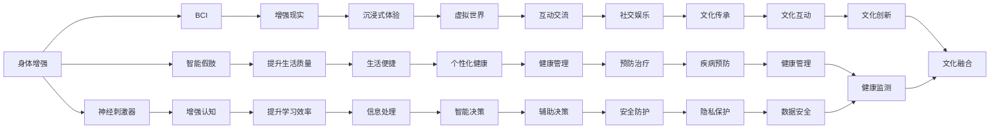

                 

## 1. 背景介绍

在AI时代，人类增强技术正在以前所未有的速度发展和应用。从早期的机械辅助，到如今的生物智能增强，我们正在走向一个全新的身体和脑力的新纪元。然而，随着这些技术的不断进步，我们也必须面对前所未有的道德和伦理挑战。本文将探讨身体增强技术的现状、未来发展方向，并讨论其对社会、道德和伦理的影响。

## 2. 核心概念与联系

### 2.1 核心概念概述

为更好地理解AI时代的人类增强技术，我们首先需要明确一些核心概念：

- **身体增强（Body Enhancement）**：指通过科技手段提升人体的生理和认知能力。包括但不限于假肢、生物芯片、脑机接口、神经刺激器等。

- **脑机接口（Brain-Computer Interface, BCI）**：实现脑信号与计算机系统的直接通信。通过脑电图（EEG）、磁共振成像（MRI）等技术，捕捉神经信号，进而控制外部设备或执行计算任务。

- **神经刺激器（Neural Stimulator）**：通过电信号刺激神经系统，用于治疗癫痫、抑郁症、帕金森氏症等神经性疾病，或用于增强学习、记忆、认知等能力。

- **智能假肢（Smart Prosthesis）**：结合了AI技术的高性能假肢，可以实现自适应运动控制、实时反馈、环境感知等功能，提升截肢者的生活质量。

- **增强现实（Augmented Reality, AR）**：通过计算机技术，将虚拟信息叠加到现实世界中，增强人类视觉和感官体验。

- **虚拟现实（Virtual Reality, VR）**：创造一个完全沉浸式的虚拟世界，让用户在其中进行互动和探索。

这些概念之间的联系在于，它们都是利用AI技术来提升人类能力和生活质量的手段。从最基本的生理辅助功能到高级的认知增强，这些技术正在不断地融合和进化，推动着人类进入一个更加智能化和高效化的时代。

### 2.2 核心概念原理和架构的 Mermaid 流程图



### 2.3 核心概念之间的关系

这些核心概念通过以下关系相互连接：

1. **功能扩展**：身体增强技术通过直接或间接的方式（如BCI、神经刺激器、智能假肢）扩展人类的生理和认知功能。
2. **体验提升**：增强现实和虚拟现实技术通过视觉和感官的增强，提升人类对世界的感知和互动体验。
3. **健康管理**：神经刺激器、智能假肢和增强现实技术在医疗健康领域有重要应用，提升疾病治疗和预防效果。
4. **文化互动**：虚拟现实和增强现实技术为文化交流和创新提供了新的平台。
5. **隐私保护**：所有增强技术都需要考虑用户隐私和数据安全问题，避免数据泄露和滥用。
6. **伦理考量**：所有增强技术的应用都需要面对伦理和道德挑战，确保技术的正向应用。

## 3. 核心算法原理 & 具体操作步骤

### 3.1 算法原理概述

身体增强技术的核心算法原理主要包括信号采集、信号处理、反馈控制和模型训练等。以BCI技术为例，其基本流程包括：

1. **信号采集**：通过EEG、MRI等技术采集脑电信号或神经信号。
2. **信号处理**：使用信号处理算法（如滤波、降噪、特征提取等）预处理采集到的信号。
3. **模式识别**：使用机器学习算法（如SVM、神经网络等）识别不同的脑电信号模式，对应不同的命令或意图。
4. **反馈控制**：根据识别结果，通过BCI系统控制外部设备（如机械手、轮椅等）执行相应动作。
5. **模型训练**：使用标注数据集（如EEG信号和相应控制命令）训练机器学习模型，提升识别准确率和响应速度。

### 3.2 算法步骤详解

以BCI技术为例，具体的算法步骤如下：

**Step 1: 信号采集**
- 使用EEG设备采集大脑活动信号。

**Step 2: 信号预处理**
- 使用小波变换、带通滤波等技术对原始信号进行降噪和频谱分析。
- 通过时间序列分析提取信号的特征向量。

**Step 3: 特征选择**
- 使用PCA、ICA等降维技术筛选出对分类有贡献的特征。

**Step 4: 模式识别**
- 使用SVM、神经网络等机器学习算法训练分类模型，识别不同脑电信号对应的控制命令。

**Step 5: 反馈控制**
- 根据模型识别结果，通过BCI系统控制外部设备执行相应动作。

**Step 6: 模型优化**
- 使用标注数据集对模型进行反复训练和调优，提升识别准确率和响应速度。

### 3.3 算法优缺点

**优点：**

1. **功能强大**：BCI技术能够实现对大脑活动的精准控制，使得截肢者可以重新使用机械手、残疾人可以操控轮椅等。
2. **响应迅速**：通过机器学习算法，BCI系统可以实现实时识别和控制。
3. **精确度高**：先进的算法和高性能设备能够显著提升信号识别的精确度。

**缺点：**

1. **设备依赖**：BCI技术需要高性能的EEG设备，设备成本较高。
2. **数据需求**：训练和优化模型需要大量标注数据，数据采集和标注工作繁琐。
3. **干扰因素多**：大脑活动受到情绪、疲劳等多种因素的影响，信号噪声较大。

### 3.4 算法应用领域

身体增强技术在医疗、康复、教育、娱乐等多个领域都有广泛的应用：

- **医疗**：用于治疗癫痫、抑郁症、帕金森氏症等神经性疾病，通过神经刺激器进行精准治疗。
- **康复**：通过智能假肢帮助截肢者重新拥有手脚功能，提升生活质量。
- **教育**：通过增强现实和虚拟现实技术，为学生提供沉浸式学习体验，提升学习效果。
- **娱乐**：通过AR和VR技术，创造沉浸式的游戏和体验，满足娱乐需求。

## 4. 数学模型和公式 & 详细讲解 & 举例说明

### 4.1 数学模型构建

假设有一个简单的分类问题，需要将大脑信号分为两类：控制命令A和控制命令B。模型的输入为特征向量 $x$，输出为类别 $y$。设 $y=1$ 表示控制命令A，$y=0$ 表示控制命令B。

分类模型 $f(x;\theta)$ 的参数为 $\theta$，采用逻辑回归模型，则有：

$$
f(x;\theta) = \frac{1}{1+e^{-\theta^T x}}
$$

其中，$\theta$ 是模型参数，$x$ 是输入特征向量，$f(x;\theta)$ 是模型输出概率。

### 4.2 公式推导过程

- **损失函数**：常用的损失函数为交叉熵损失，其定义如下：

$$
\mathcal{L}(\theta) = -\frac{1}{N} \sum_{i=1}^N [y_i \log f(x_i;\theta) + (1-y_i) \log (1-f(x_i;\theta))]
$$

其中，$N$ 是样本数，$y_i$ 是真实标签，$f(x_i;\theta)$ 是模型预测概率。

- **梯度下降**：通过反向传播算法计算损失函数对模型参数 $\theta$ 的梯度，使用梯度下降法更新参数：

$$
\theta \leftarrow \theta - \eta \nabla_{\theta} \mathcal{L}(\theta)
$$

其中，$\eta$ 是学习率，$\nabla_{\theta} \mathcal{L}(\theta)$ 是损失函数对参数 $\theta$ 的梯度。

### 4.3 案例分析与讲解

假设有一个EEG信号数据集，包含500个样本，每个样本有10个特征。使用上述逻辑回归模型进行训练和测试。

**Step 1: 数据预处理**
- 将EEG信号标准化，去除异常点。
- 使用PCA进行特征降维，选取前5个主成分。

**Step 2: 模型训练**
- 划分数据集为训练集和测试集，训练集400个样本，测试集100个样本。
- 使用随机梯度下降法，设置学习率为0.01，迭代1000次。

**Step 3: 模型评估**
- 在测试集上计算模型准确率、召回率和F1分数。

通过上述步骤，可以得到训练后的逻辑回归模型，并进行性能评估。

## 5. 项目实践：代码实例和详细解释说明

### 5.1 开发环境搭建

使用Python和TensorFlow进行项目开发，步骤如下：

1. 安装Anaconda：
```
conda install anaconda
```

2. 创建虚拟环境：
```
conda create -n bci-environment python=3.8
conda activate bci-environment
```

3. 安装TensorFlow和其他依赖：
```
pip install tensorflow scikit-learn numpy matplotlib
```

### 5.2 源代码详细实现

以下是一个简单的Python脚本，实现逻辑回归模型对EEG信号的分类：

```python
import tensorflow as tf
from sklearn.decomposition import PCA
from sklearn.preprocessing import StandardScaler

# 加载EEG数据
data = load_eeg_data()

# 数据预处理
scaler = StandardScaler()
X = scaler.fit_transform(data[['feature1', 'feature2', 'feature3', 'feature4', 'feature5', 'feature6', 'feature7', 'feature8', 'feature9', 'feature10']])
y = data['label']

# 数据降维
pca = PCA(n_components=5)
X_pca = pca.fit_transform(X)

# 逻辑回归模型
model = tf.keras.models.Sequential([
    tf.keras.layers.Dense(1, activation='sigmoid', input_shape=(5,))
])

# 编译模型
model.compile(optimizer=tf.keras.optimizers.Adam(learning_rate=0.01),
              loss='binary_crossentropy',
              metrics=['accuracy'])

# 模型训练
model.fit(X_pca, y, epochs=1000, batch_size=32, validation_split=0.2)

# 模型评估
loss, accuracy = model.evaluate(X_pca, y, verbose=0)
print('Test accuracy:', accuracy)
```

### 5.3 代码解读与分析

**Step 1: 数据加载**
- 使用`load_eeg_data()`函数加载EEG数据，包括特征和标签。

**Step 2: 数据预处理**
- 使用`StandardScaler()`对特征数据进行标准化处理。
- 使用`PCA()`进行特征降维，选取前5个主成分。

**Step 3: 模型定义**
- 定义一个简单的逻辑回归模型，输入特征为5维向量，输出为二分类概率。

**Step 4: 模型编译**
- 使用`Adam`优化器和二分类交叉熵损失函数编译模型。

**Step 5: 模型训练**
- 在训练集上进行1000轮迭代训练，使用32个样本的小批量训练。

**Step 6: 模型评估**
- 在测试集上计算模型损失和准确率。

## 6. 实际应用场景

### 6.1 医疗康复

BCI技术在医疗康复领域有广泛应用，如治疗癫痫、抑郁症等神经性疾病。通过神经刺激器，可以精准控制大脑活动，缓解或治愈疾病。

**案例分析**：
- 某患者被诊断为抑郁症，采用BCI技术进行治疗。通过EEG设备采集脑电信号，使用逻辑回归模型识别不同情绪信号，并控制神经刺激器释放特定电脉冲，有效缓解了患者情绪症状。

### 6.2 教育培训

增强现实和虚拟现实技术可以用于提升学生的学习效果。通过AR和VR设备，为学生提供沉浸式学习体验，提升学习兴趣和理解力。

**案例分析**：
- 某学校采用AR技术，为学生提供虚拟化学实验室，学生在虚拟环境中进行化学实验操作，直观地理解化学反应过程，提升学习效果。

### 6.3 娱乐体验

AR和VR技术在游戏和娱乐领域有重要应用，创造沉浸式体验，满足娱乐需求。

**案例分析**：
- 某游戏公司采用VR技术，开发了一款虚拟现实游戏，玩家可以在虚拟世界中自由探索，获得身临其境的游戏体验。

### 6.4 未来应用展望

未来，身体增强技术将继续发展，推动人类进入更加智能化和高效化的时代。以下是一些未来应用方向：

- **智能假肢**：结合AI技术，智能假肢将具备自我学习和适应能力，提高截肢者的生活质量。
- **脑机接口**：通过BCI技术，实现脑信号和计算机系统的直接通信，提升人类认知能力。
- **增强现实和虚拟现实**：结合5G、AI等技术，提升AR和VR设备的性能和体验，创造更加沉浸式和智能化的应用场景。

## 7. 工具和资源推荐

### 7.1 学习资源推荐

1. **《脑机接口技术与应用》**：详细介绍了BCI技术的基本原理和应用案例，适合初学者入门。
2. **Coursera《深度学习》课程**：斯坦福大学开设的深度学习课程，涵盖了机器学习、神经网络等内容，适合进阶学习。
3. **arXiv.org**：最新AI研究成果的发布平台，及时了解前沿动态和技术进展。
4. **GitHub**：开源代码库，查找和分享各种身体增强技术相关的项目和代码。
5. **IEEE Xplore**：收录了大量学术和工程文献，适合查找最新研究成果。

### 7.2 开发工具推荐

1. **Python**：简洁易用的编程语言，适用于开发AI项目，支持TensorFlow等深度学习框架。
2. **TensorFlow**：高性能深度学习框架，支持分布式计算和GPU加速，适合大规模项目开发。
3. **MATLAB**：强大的科学计算和数据处理工具，适合进行信号处理和机器学习算法开发。
4. **Jupyter Notebook**：交互式编程环境，支持Python和其他科学计算工具，适合快速迭代开发。
5. **Visual Studio Code**：轻量级代码编辑器，支持多种语言和插件，适合开发AI项目。

### 7.3 相关论文推荐

1. **《Brain-Computer Interface: Methods and Applications》**：系统介绍了BCI技术的原理、应用和挑战，适合深度学习入门。
2. **《AI Enhancing Human Capabilities: Opportunities and Challenges》**：探讨AI技术增强人类能力的机会和挑战，适合全面了解技术应用和伦理问题。
3. **《Cognitive Enhancement with Neural Stimulators》**：详细介绍了神经刺激器在认知增强中的应用，适合深入研究。
4. **《Virtual and Augmented Reality: Review and Future Directions》**：系统总结了AR和VR技术的发展现状和未来方向，适合了解前沿动态。

## 8. 总结：未来发展趋势与挑战

### 8.1 研究成果总结

本文从背景介绍、核心概念、算法原理、项目实践、应用场景等多个方面，详细探讨了AI时代身体增强技术的现状、应用和未来方向。

### 8.2 未来发展趋势

未来，身体增强技术将继续发展，推动人类进入更加智能化和高效化的时代。以下是一些未来发展趋势：

1. **智能假肢**：结合AI技术，智能假肢将具备自我学习和适应能力，提高截肢者的生活质量。
2. **脑机接口**：通过BCI技术，实现脑信号和计算机系统的直接通信，提升人类认知能力。
3. **增强现实和虚拟现实**：结合5G、AI等技术，提升AR和VR设备的性能和体验，创造更加沉浸式和智能化的应用场景。

### 8.3 面临的挑战

尽管身体增强技术发展迅速，但也面临诸多挑战：

1. **伦理和道德问题**：身体增强技术的应用需要考虑伦理和道德问题，避免技术滥用和隐私泄露。
2. **技术和设备成本**：高性能的身体增强设备和算法需要高昂的研发和部署成本，难以普及。
3. **数据隐私和安全**：身体增强技术需要大量的数据进行训练和优化，如何保护用户隐私和数据安全是一个重要问题。
4. **算法鲁棒性和可靠性**：身体增强技术的算法需要具备鲁棒性和可靠性，避免在复杂环境中出现故障。

### 8.4 研究展望

未来，身体增强技术需要不断探索新的突破点，解决当前面临的挑战：

1. **伦理和道德研究**：开展伦理和道德研究，制定技术应用的规范和标准，确保技术正向应用。
2. **低成本技术推广**：研发低成本高性能的身体增强设备和算法，推动技术的普及应用。
3. **数据隐私保护**：加强数据隐私保护技术的研究，确保用户数据的安全性和隐私性。
4. **算法鲁棒性提升**：通过算法改进和硬件优化，提升身体增强技术的鲁棒性和可靠性。

总之，身体增强技术的发展前景广阔，但也面临着诸多挑战。只有不断创新和突破，才能实现技术的可持续发展，造福全人类。

## 9. 附录：常见问题与解答

**Q1：身体增强技术有哪些潜在风险和危害？**

A: 身体增强技术可能带来以下潜在风险和危害：

1. **技术滥用**：身体增强技术容易被滥用于不正当用途，如非法攻击、暴力行为等。
2. **伦理问题**：技术的使用需要考虑伦理问题，避免造成不公平、歧视等现象。
3. **隐私泄露**：身体增强技术需要大量的数据进行训练和优化，如何保护用户隐私是一个重要问题。
4. **依赖性强**：身体增强技术依赖高性能设备和算法，一旦设备或算法出现问题，可能影响用户的正常生活。

**Q2：如何确保身体增强技术的公平性和安全性？**

A: 确保身体增强技术的公平性和安全性，需要从以下几个方面入手：

1. **技术标准**：制定严格的技术标准和规范，确保技术的可靠性和鲁棒性。
2. **伦理审查**：进行伦理审查，评估技术应用对社会的影响，确保技术的正向应用。
3. **隐私保护**：加强数据隐私保护技术的研究，确保用户数据的安全性和隐私性。
4. **法律监管**：建立法律框架，规范身体增强技术的应用和管理。

**Q3：身体增强技术在未来将如何影响社会？**

A: 身体增强技术在未来将对社会产生深远影响：

1. **提升生活质量**：通过智能假肢和神经刺激器，提升残疾人和老年人的生活质量。
2. **推动科技发展**：身体增强技术将推动AI、神经科学等领域的进步，促进科技创新。
3. **改变教育模式**：通过AR和VR技术，提升教育效果，推动教育模式的创新。
4. **引发伦理争议**：身体增强技术的应用将引发伦理争议，需要社会各界的共同讨论和规范。

总之，身体增强技术的发展前景广阔，但需要克服诸多挑战，才能实现技术的可持续发展，造福全人类。

---

作者：禅与计算机程序设计艺术 / Zen and the Art of Computer Programming

