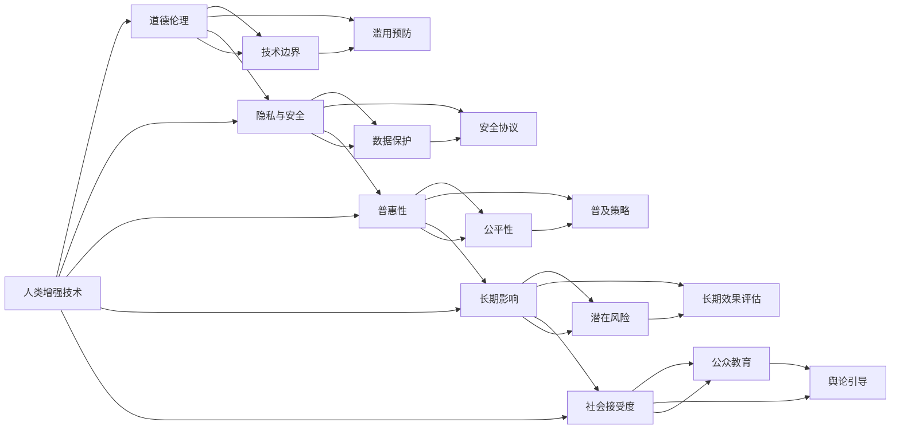

                 

# AI时代的人类增强：道德考虑与身体增强技术的融合发展

## 1. 背景介绍

在人工智能(AI)迅速发展的今天，人类正迎来一个前所未有的技术革新时代。AI不仅在众多领域实现了自动化的突破，还在不断探索新的可能性，如人类增强技术。这些技术包括身体增强、认知增强、情感增强等，旨在通过技术手段提升人类能力、改善生活质量。然而，随着技术的发展，如何平衡技术进步与道德伦理，成为亟待解决的问题。

### 1.1 问题由来

随着科技的迅猛发展，人类增强技术在医疗、教育、娱乐等多个领域取得了显著进展。如在医疗领域，AI辅助手术、智能康复等技术已经广泛应用于临床实践，显著提升了治疗效果。在教育领域，AI智能辅导、个性化学习等技术也正在改变传统的教学模式。这些技术的广泛应用，大大提升了人类的生产力和生活质量。

然而，人类增强技术在带来诸多便利的同时，也引发了一系列伦理问题。如如何界定技术的界限，防止滥用技术导致的不良后果；如何保护用户的隐私和数据安全，避免数据泄露带来的风险；如何在提升性能的同时，确保技术的普惠性，让更多人群受益等。这些问题需要全社会共同探讨，寻找合理的解决方案。

### 1.2 问题核心关键点

1. **技术边界与道德伦理**：人类增强技术在提升人类能力的同时，如何确保技术应用的道德边界，避免滥用？
2. **隐私与安全**：如何在提升用户体验的同时，保护用户的隐私和数据安全，避免数据泄露和滥用？
3. **普惠性**：如何确保技术的普及和公平性，让更多人群受益，而不是仅限于少数精英群体？
4. **长期影响**：人类增强技术的长期影响如何？是否会导致人类依赖过度，甚至失去自主能力？
5. **社会接受度**：社会如何接受和认可这些新技术？公众对人类增强技术的认知和接受程度如何？

这些问题不仅涉及技术实现和应用，更触及到伦理、法律、社会价值观等多个层面，需要多方协作、共同探讨。

## 2. 核心概念与联系

### 2.1 核心概念概述

要深入理解人类增强技术的道德考虑，首先需要明确几个核心概念：

- **人类增强技术(Human Enhancement Technology)**：通过技术手段提升人类能力，包括身体增强、认知增强、情感增强等。常见技术如基因编辑、脑机接口(Brain-Computer Interface, BCI)、虚拟现实(Virtual Reality, VR)等。
- **道德伦理(Morality and Ethics)**：关于人类行为的规范和价值观，指导人类如何正确使用技术，确保技术应用的道德边界。
- **隐私与安全(Privacy and Security)**：保护用户个人信息和数据安全，防止隐私泄露和数据滥用。
- **普惠性(Inclusivity)**：确保技术普及和公平性，让更多人受益。
- **长期影响(Long-term Impact)**：评估人类增强技术的长期效果，避免潜在的负面影响。
- **社会接受度(Societal Acceptance)**：社会对新技术的接受程度，公众认知和心理接受度。

这些概念相互交织，共同构成了人类增强技术应用的基础。

### 2.2 核心概念原理和架构的 Mermaid 流程图



该流程图展示了核心概念之间的联系，通过技术边界、隐私与安全、普惠性、长期影响和社会接受度五个维度，共同指导人类增强技术的应用和发展。

## 3. 核心算法原理 & 具体操作步骤

### 3.1 算法原理概述

人类增强技术的应用通常涉及复杂的算法模型和数据处理流程。其核心算法原理主要包括以下几个方面：

- **数据预处理**：清洗、标准化、归一化等，保证数据质量，提升模型性能。
- **特征提取**：通过算法提取数据中的关键特征，供模型学习。
- **模型训练**：使用机器学习、深度学习等算法，训练模型。
- **结果解释**：通过算法解释模型输出，提升模型透明性和可信度。

这些算法原理，通过与道德伦理、隐私安全、普惠性、长期影响和社会接受度等多个维度的综合考量，实现对人类增强技术的科学应用。

### 3.2 算法步骤详解

以下是人类增强技术开发的一般步骤：

**Step 1: 数据收集与预处理**
- 收集相关领域的数据，清洗、标准化处理。
- 确定数据的关键特征，选择合适的特征提取方法。

**Step 2: 模型选择与训练**
- 选择合适的算法模型，如机器学习、深度学习等。
- 使用数据训练模型，优化模型参数，确保模型泛化能力。

**Step 3: 结果解释与评估**
- 使用算法对模型结果进行解释，提升模型透明性和可信度。
- 使用评估指标评估模型效果，确保模型性能满足需求。

**Step 4: 道德伦理、隐私安全、普惠性、长期影响、社会接受度综合考量**
- 进行伦理审查，确保技术应用的道德边界。
- 采取隐私保护措施，确保数据安全。
- 设计普及策略，确保技术普惠性。
- 评估技术长期影响，规避潜在风险。
- 开展公众教育，提升社会接受度。

### 3.3 算法优缺点

人类增强技术的算法具有以下优点：
- **高精度**：通过机器学习、深度学习等算法，可以提升模型精度，实现精准的预测和优化。
- **高效性**：算法可以快速处理大量数据，提升工作效率。
- **可解释性**：现代算法具备良好的解释能力，可以提升模型的透明性和可信度。

然而，这些算法也存在一些缺点：
- **依赖数据**：算法性能依赖于数据质量，数据不足或偏差可能导致模型性能下降。
- **复杂性**：算法实现复杂，对开发者技术要求较高。
- **潜在风险**：算法的复杂性和不透明性可能导致模型的滥用和误用。

### 3.4 算法应用领域

人类增强技术的算法广泛应用于医疗、教育、娱乐等多个领域：

- **医疗领域**：AI辅助手术、智能康复、个性化医疗等。
- **教育领域**：AI智能辅导、个性化学习、在线教育等。
- **娱乐领域**：虚拟现实、增强现实、互动游戏等。

## 4. 数学模型和公式 & 详细讲解 & 举例说明

### 4.1 数学模型构建

人类增强技术的数学模型通常包括以下几个部分：

- **输入数据模型**：定义输入数据的特征表示，如基因型、生理数据、心理数据等。
- **输出模型**：定义输出结果的形式，如疾病诊断、治疗方案、能力提升等。
- **特征提取模型**：定义特征提取方法，如PCA、LDA、深度学习等。
- **训练模型**：定义训练过程，如梯度下降、反向传播等。

### 4.2 公式推导过程

以AI辅助手术为例，其数学模型推导过程如下：

- **输入数据模型**：
  $$
  \mathcal{X} = \{x_i\}_{i=1}^N, x_i \in \mathbb{R}^d
  $$
- **输出模型**：
  $$
  \mathcal{Y} = \{y_i\}_{i=1}^N, y_i \in \{0,1\}, y_i=1 \text{ if } \text{case is positive}, y_i=0 \text{ if case is negative}
  $$
- **特征提取模型**：
  $$
  \mathcal{Z} = \{z_i\}_{i=1}^N, z_i = f(x_i)
  $$
- **训练模型**：
  $$
  \hat{\theta} = \mathop{\arg\min}_{\theta} \frac{1}{N}\sum_{i=1}^N \ell(y_i, \hat{y_i})
  $$

其中，$\ell$为损失函数，通常为交叉熵损失：
$$
\ell(y_i, \hat{y_i}) = -y_i \log \hat{y_i} - (1-y_i) \log (1-\hat{y_i})
$$

### 4.3 案例分析与讲解

以基因编辑技术为例，其数学模型和算法推导如下：

- **输入数据模型**：
  $$
  \mathcal{X} = \{x_i\}_{i=1}^N, x_i = \{g_i\}_{i=1}^N, g_i \in \{G1, G2, ..., GN\}
  $$
- **输出模型**：
  $$
  \mathcal{Y} = \{y_i\}_{i=1}^N, y_i = 1 \text{ if the mutation is beneficial}, y_i = 0 \text{ if the mutation is harmful}
  $$
- **特征提取模型**：
  $$
  \mathcal{Z} = \{z_i\}_{i=1}^N, z_i = f(g_i)
  $$
- **训练模型**：
  $$
  \hat{\theta} = \mathop{\arg\min}_{\theta} \frac{1}{N}\sum_{i=1}^N \ell(y_i, \hat{y_i})
  $$

其中，$\ell$为损失函数，通常为交叉熵损失：
$$
\ell(y_i, \hat{y_i}) = -y_i \log \hat{y_i} - (1-y_i) \log (1-\hat{y_i})
$$

通过以上数学模型和算法推导，可以设计出基因编辑技术的预测模型，实现精准的基因编辑效果。

## 5. 项目实践：代码实例和详细解释说明

### 5.1 开发环境搭建

在进行人类增强技术开发前，我们需要准备好开发环境。以下是使用Python进行TensorFlow开发的环境配置流程：

1. 安装Anaconda：从官网下载并安装Anaconda，用于创建独立的Python环境。

2. 创建并激活虚拟环境：
```bash
conda create -n tf-env python=3.8 
conda activate tf-env
```

3. 安装TensorFlow：根据CUDA版本，从官网获取对应的安装命令。例如：
```bash
conda install tensorflow -c conda-forge
```

4. 安装各类工具包：
```bash
pip install numpy pandas scikit-learn matplotlib tqdm jupyter notebook ipython
```

完成上述步骤后，即可在`tf-env`环境中开始人类增强技术的开发实践。

### 5.2 源代码详细实现

这里我们以AI辅助手术为例，给出使用TensorFlow进行基因编辑技术预测的代码实现。

首先，定义输入数据和输出标签：

```python
import tensorflow as tf

# 输入数据
x = tf.keras.layers.Input(shape=(d,), dtype=tf.float32)

# 输出标签
y = tf.keras.layers.Dense(units=1, activation='sigmoid')(x)
```

然后，定义模型结构并进行训练：

```python
model = tf.keras.Sequential([
    tf.keras.layers.Dense(units=64, activation='relu', input_shape=(d,)),
    tf.keras.layers.Dense(units=32, activation='relu'),
    tf.keras.layers.Dense(units=1, activation='sigmoid')
])

model.compile(optimizer=tf.keras.optimizers.Adam(learning_rate=0.001),
              loss='binary_crossentropy',
              metrics=['accuracy'])

# 训练模型
model.fit(x_train, y_train, epochs=50, batch_size=32, validation_data=(x_val, y_val))
```

最后，对模型进行评估和测试：

```python
# 评估模型
test_loss, test_acc = model.evaluate(x_test, y_test, verbose=2)

# 预测结果
y_pred = model.predict(x_test)
```

以上就是使用TensorFlow进行基因编辑技术预测的完整代码实现。可以看到，TensorFlow提供了强大的API支持，使得模型构建和训练变得简洁高效。

### 5.3 代码解读与分析

让我们再详细解读一下关键代码的实现细节：

**定义输入和输出**：
- 使用`tf.keras.layers.Input`定义输入数据和输出标签，输入数据为`x`，输出标签为`y`，采用二分类方式。

**模型结构设计**：
- 使用`tf.keras.Sequential`定义多层神经网络，包括三个全连接层，最后一层输出结果。
- 每个层使用ReLU激活函数，激活函数的选择可以根据实际问题进行优化。

**模型编译与训练**：
- 使用`model.compile`定义优化器、损失函数和评估指标。
- 使用`model.fit`对模型进行训练，设置训练轮数和批次大小。

**模型评估与测试**：
- 使用`model.evaluate`对模型进行评估，输出损失和准确率。
- 使用`model.predict`对测试数据进行预测。

通过以上代码实现，可以构建并训练基因编辑技术预测模型，实现精准的基因编辑效果。

## 6. 实际应用场景

### 6.1 智能医疗

人类增强技术在智能医疗领域具有广阔的应用前景。AI辅助手术、智能康复、个性化医疗等技术，已经广泛应用于临床实践，显著提升了医疗服务的效率和质量。

在AI辅助手术中，通过分析手术视频和数据，AI系统可以实时提供手术指导，优化手术方案。通过深度学习算法，AI可以预测手术风险，提供个性化治疗方案，显著提升手术成功率和患者康复速度。

### 6.2 智能教育

在智能教育领域，AI智能辅导、个性化学习、在线教育等技术正在改变传统的教学模式。通过分析学生的学习行为和成绩，AI系统可以提供个性化的学习建议和资源，提升学习效果。

AI智能辅导系统可以通过自然语言处理技术，理解学生的学习需求，提供针对性的指导和解答。通过机器学习算法，系统可以不断优化教学策略，提升教学质量。

### 6.3 娱乐与游戏

在娱乐与游戏领域，虚拟现实、增强现实、互动游戏等技术正在引领新一轮的娱乐革命。通过AR/VR技术，用户可以沉浸式体验虚拟世界，提升游戏体验和娱乐效果。

AI算法可以在游戏中提供实时智能对手，提升游戏趣味性和挑战性。通过自然语言处理技术，AI可以理解用户的指令和行为，提供个性化的游戏体验。

### 6.4 未来应用展望

随着技术的不断进步，人类增强技术将进一步拓展应用范围，带来更多的创新和突破：

1. **智能化系统**：通过AI技术和人类增强技术，构建更加智能化、自动化的系统，提升生产力和生活质量。
2. **医疗健康**：AI辅助手术、智能康复、个性化医疗等技术将进一步普及，显著提升医疗服务的质量和效率。
3. **教育普及**：AI智能辅导、个性化学习等技术将进一步优化教学资源配置，实现教育公平。
4. **娱乐创新**：AR/VR、AI游戏等技术将引领娱乐产业的变革，带来更多的创新体验。
5. **社会治理**：AI技术在公共安全、应急管理、环境保护等领域的应用，将提升社会治理能力。

## 7. 工具和资源推荐

### 7.1 学习资源推荐

为了帮助开发者系统掌握人类增强技术的理论基础和实践技巧，这里推荐一些优质的学习资源：

1. **《深度学习》系列书籍**：斯坦福大学教授Ian Goodfellow的经典之作，系统介绍了深度学习的原理和应用。
2. **Coursera《深度学习专项课程》**：由Andrew Ng教授主讲，涵盖深度学习的各个方面，包括理论基础、算法实现和应用实践。
3. **Kaggle数据竞赛平台**：提供丰富的数据集和算法竞赛，帮助开发者提升算法技能和实践经验。
4. **GitHub开源项目**：包含大量优秀的开源项目，如TensorFlow、PyTorch等，提供了丰富的学习资源和代码示例。

通过对这些资源的学习实践，相信你一定能够快速掌握人类增强技术的精髓，并用于解决实际的AI应用问题。

### 7.2 开发工具推荐

高效的开发离不开优秀的工具支持。以下是几款用于人类增强技术开发常用的工具：

1. **TensorFlow**：由Google主导开发的开源深度学习框架，支持分布式计算和GPU加速，适合大规模工程应用。
2. **PyTorch**：由Facebook开发的深度学习框架，灵活的动态图设计，适合快速迭代研究。
3. **Keras**：高层深度学习API，简单易用，适合初学者和快速原型开发。
4. **Jupyter Notebook**：交互式开发环境，支持Python、R等语言，便于代码编写和调试。
5. **Git**：版本控制系统，支持分布式协作，便于团队开发和代码管理。

合理利用这些工具，可以显著提升人类增强技术开发的效率，加快创新迭代的步伐。

### 7.3 相关论文推荐

人类增强技术的研究源于学界的持续探索。以下是几篇奠基性的相关论文，推荐阅读：

1. **《深度学习》书籍**：Ian Goodfellow、Yoshua Bengio、Aaron Courville合著的经典之作，全面介绍了深度学习的原理和应用。
2. **《自然语言处理综述》论文**：由Yann LeCun、Yoshua Bengio、Geoffrey Hinton合著的综述文章，总结了NLP领域的研究进展和应用方向。
3. **《基因编辑技术》综述论文**：由Feng Zhang等人合著的综述文章，总结了基因编辑技术的原理、应用和未来趋势。

这些论文代表了大语言模型微调技术的发展脉络。通过学习这些前沿成果，可以帮助研究者把握学科前进方向，激发更多的创新灵感。

## 8. 总结：未来发展趋势与挑战

### 8.1 总结

本文对人类增强技术的开发与应用进行了全面系统的介绍。首先阐述了人类增强技术的背景和意义，明确了技术应用的道德边界、隐私安全、普惠性、长期影响和社会接受度等多个核心概念。其次，从原理到实践，详细讲解了人类增强技术的算法模型和开发步骤，给出了完整的代码实例。同时，本文还探讨了人类增强技术在智能医疗、智能教育、娱乐与游戏等多个领域的应用前景，展示了技术的巨大潜力。此外，本文精选了相关学习资源、开发工具和论文推荐，力求为开发者提供全方位的技术指引。

通过本文的系统梳理，可以看到，人类增强技术正在引领AI应用的新趋势，为人类生产力和生活质量的提升带来了新的突破。未来，伴随技术不断演进和完善，人类增强技术必将在更多领域实现落地应用，带来更多的创新和变革。

### 8.2 未来发展趋势

展望未来，人类增强技术的发展趋势如下：

1. **智能化系统**：通过AI技术和人类增强技术，构建更加智能化、自动化的系统，提升生产力和生活质量。
2. **医疗健康**：AI辅助手术、智能康复、个性化医疗等技术将进一步普及，显著提升医疗服务的质量和效率。
3. **教育普及**：AI智能辅导、个性化学习等技术将进一步优化教学资源配置，实现教育公平。
4. **娱乐创新**：AR/VR、AI游戏等技术将引领娱乐产业的变革，带来更多的创新体验。
5. **社会治理**：AI技术在公共安全、应急管理、环境保护等领域的应用，将提升社会治理能力。

### 8.3 面临的挑战

尽管人类增强技术在多个领域已经取得了显著进展，但仍面临诸多挑战：

1. **伦理问题**：如何在提升性能的同时，确保技术的道德边界，避免滥用和误用？
2. **隐私安全**：如何保护用户的隐私和数据安全，防止数据泄露和滥用？
3. **普惠性**：如何确保技术的普及和公平性，让更多人受益？
4. **长期影响**：人类增强技术的长期效果如何？是否会导致人类依赖过度，甚至失去自主能力？
5. **社会接受度**：社会如何接受和认可这些新技术？公众认知和心理接受度如何？

这些问题需要全社会共同探讨，寻找合理的解决方案。只有在技术发展的同时，兼顾伦理、法律、社会价值观等多个层面，才能真正实现人类增强技术的科学应用。

### 8.4 研究展望

面对人类增强技术面临的诸多挑战，未来的研究需要在以下几个方面寻求新的突破：

1. **伦理规范**：建立健全的伦理规范和监管机制，确保技术应用的道德边界。
2. **隐私保护**：开发更加先进的隐私保护技术，保障数据安全和用户隐私。
3. **公平性**：设计更加公平的算法模型和普及策略，确保技术的普惠性。
4. **长期影响**：评估技术的长期效果，规避潜在风险，确保技术的可持续性。
5. **社会接受度**：加强公众教育，提升社会对新技术的认知和接受度。

这些研究方向的探索，必将引领人类增强技术的健康发展，为构建人机协同的智能社会铺平道路。只有勇于创新、敢于突破，才能真正实现人类增强技术的广泛应用，让技术更好地造福人类社会。

## 9. 附录：常见问题与解答

**Q1：人类增强技术的道德边界是什么？**

A: 人类增强技术的道德边界是一个复杂的问题，需要综合考虑多个方面。主要包括以下几个方面：
1. **技术滥用**：避免技术滥用和误用，防止技术被用于不道德的用途。
2. **隐私保护**：确保数据的隐私和安全，防止数据滥用和泄露。
3. **普惠性**：确保技术的普及和公平性，让更多人受益，避免技术仅限于少数精英群体。
4. **伦理规范**：建立健全的伦理规范和监管机制，确保技术应用的道德边界。

只有兼顾这些方面，才能确保人类增强技术应用的道德边界。

**Q2：如何保护用户的隐私和数据安全？**

A: 保护用户隐私和数据安全是技术应用的重要环节，主要包括以下几个方面：
1. **数据匿名化**：对数据进行匿名化处理，确保数据无法被追踪到个人。
2. **加密技术**：使用加密技术保护数据传输和存储安全，防止数据泄露。
3. **隐私协议**：制定隐私协议，明确数据使用和保护责任。
4. **隐私监控**：建立隐私监控机制，实时监测数据使用情况，防止滥用。
5. **用户同意**：在数据使用前，明确告知用户数据用途，并获取用户同意。

通过这些措施，可以显著提升用户隐私和数据安全。

**Q3：如何确保技术的普及和公平性？**

A: 确保技术的普及和公平性，需要采取以下措施：
1. **普及策略**：设计合理的普及策略，确保技术覆盖面广，易于推广。
2. **资源分配**：优化资源配置，确保技术应用不占用过多公共资源。
3. **公平算法**：设计公平的算法模型，确保技术对不同人群的影响公平。
4. **普惠性**：提供普惠性服务，确保技术对不同人群的可及性。

通过这些措施，可以确保技术的普及和公平性。

**Q4：人类增强技术的长期影响如何？**

A: 人类增强技术的长期影响是一个复杂的问题，需要综合考虑多个方面。主要包括以下几个方面：
1. **依赖性**：避免技术依赖过度，确保人类自主能力的保留。
2. **伦理道德**：评估技术的伦理道德，确保技术应用的合理性和安全性。
3. **社会影响**：评估技术的社会影响，确保技术应用的公平性和普惠性。
4. **可持续发展**：确保技术的可持续发展，避免资源的过度消耗和环境影响。

通过这些措施，可以评估和规避人类增强技术的长期影响，确保技术应用的可持续性。

**Q5：社会如何接受和认可这些新技术？**

A: 社会对新技术的接受和认可，需要综合考虑多个方面。主要包括以下几个方面：
1. **公众教育**：加强公众教育，提升对新技术的认知和理解。
2. **宣传引导**：加强宣传和引导，消除公众对新技术的误解和恐惧。
3. **社会互动**：鼓励社会互动，了解公众对新技术的意见和反馈。
4. **政策支持**：制定合理的政策，支持新技术的应用和发展。

通过这些措施，可以提升社会对新技术的接受度和认可度。

---

作者：禅与计算机程序设计艺术 / Zen and the Art of Computer Programming

