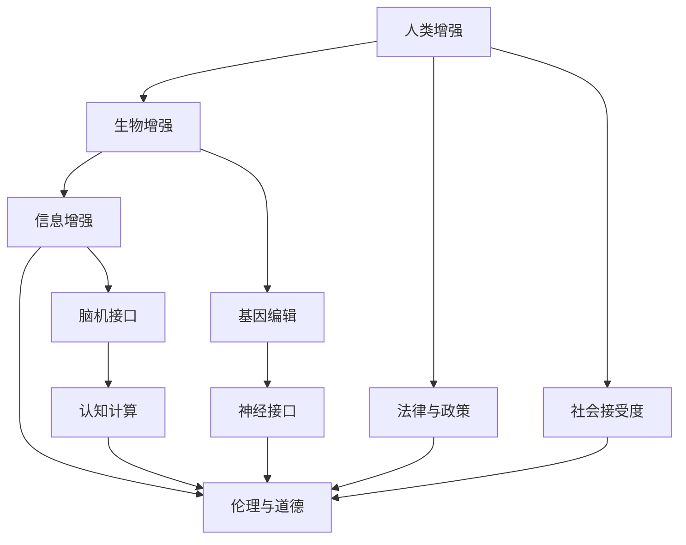

                 

## 1. 背景介绍

### 1.1 问题由来

随着人工智能技术的飞速发展，人类增强（Human Augmentation）正成为社会关注的焦点。无论是通过生物技术实现的身体增强（例如基因编辑、神经接口），还是通过信息科技实现的大脑增强（例如神经反馈、认知计算），其背后都蕴含着巨大的技术潜力和伦理挑战。在AI时代，人类增强不仅包括物理和认知能力的提升，更关乎如何以科技手段应对日益复杂多变的社会问题。

### 1.2 问题核心关键点

1. **人类增强的定义与分类**：从生物和信息两个维度，探讨人类增强的具体形式和实现途径。
2. **技术发展现状与未来趋势**：评估当前技术水平和未来突破的可能性。
3. **道德与伦理考量**：分析增强技术可能带来的伦理问题和社会影响。
4. **法律与政策框架**：探讨如何构建符合人类价值观和伦理道德的法规体系。
5. **社会接受度与公众教育**：考虑社会对增强技术的接受度和公众的科技素养。

### 1.3 问题研究意义

研究人类增强的道德与伦理问题，对于推动科技进步、保障人类福祉、防范技术滥用，具有重要意义：

1. **促进技术健康发展**：避免技术走向滥用和灾难性后果，确保技术进步为人类带来益处。
2. **保障人类安全与健康**：通过伦理审查和监管，防范技术对个体和社会造成伤害。
3. **激发科技伦理讨论**：为新兴技术的伦理问题提供思考平台，引导公众和政策制定者进行合理讨论。
4. **推动法律与政策创新**：基于技术发展动态，适时更新法规和政策，确保法律滞后性。
5. **提高社会认知与接受度**：通过教育与宣传，提升公众对增强技术的理解和接受度。

## 2. 核心概念与联系

### 2.1 核心概念概述

为更好地理解人类增强的道德与伦理问题，本节将介绍几个关键概念及其相互关系：

- **人类增强（Human Augmentation）**：指通过生物和信息手段，提高人类身体或大脑功能的各种技术。
- **生物增强（Biological Enhancement）**：包括基因编辑、神经接口、药物增强等，直接作用于人体生理机制。
- **信息增强（Informational Enhancement）**：涵盖脑机接口、认知计算、虚拟现实等，通过信息手段提升认知和感知能力。
- **伦理与道德（Ethics and Morality）**：指对人类增强行为进行价值判断与规范，包括但不限于隐私权、知情同意、公平正义等。
- **法律与政策（Law and Policy）**：用于规范人类增强技术的应用与发展，保护个体权益与社会秩序。
- **社会接受度（Social Acceptance）**：指公众对人类增强技术的认知与态度，影响技术的推广和应用。

这些核心概念之间的逻辑关系可以通过以下Mermaid流程图来展示：



这个流程图展示了大语义模型与微调方法的各个关键概念及其之间的关系：

1. 人类增强通过生物和信息两个维度，实现身体和大脑功能的提升。
2. 生物增强与信息增强分别对应于生理和认知层面的增强手段。
3. 伦理与道德贯穿于增强技术的各个环节，用于指导和规范技术应用。
4. 法律与政策为增强技术的应用提供框架和规则，保护公众权益。
5. 社会接受度直接影响技术普及和应用效果。

这些概念共同构成了人类增强技术的伦理与道德框架，为其健康发展提供了基础。

## 3. 核心算法原理 & 具体操作步骤
### 3.1 算法原理概述

人类增强的道德与伦理问题，核心在于如何平衡技术进步与人类福祉之间的关系。这涉及到以下几个关键点：

- **技术目标与人类利益**：评估技术提升的目标是否符合人类整体的利益。
- **个体权利与社会责任**：如何界定个体在增强技术中的权利与责任。
- **风险管理与预警机制**：构建风险评估体系，及时识别和应对技术风险。
- **公平性与可及性**：确保技术应用的普惠性与公平性，避免技术鸿沟。

这些关键点共同构成了一个综合性的伦理与道德框架，指导人类增强技术的开发与应用。

### 3.2 算法步骤详解

人类增强技术的伦理与道德问题解决步骤如下：

**Step 1: 伦理框架构建**
- 设计一套伦理原则，如自主性、非恶意、尊重隐私、社会公正等。
- 通过多学科合作，确保伦理框架全面覆盖技术应用的所有方面。

**Step 2: 风险评估与管理**
- 识别技术应用可能带来的各种风险，如隐私泄露、社会不公、生态影响等。
- 建立风险评估模型，量化风险大小，制定应对措施。
- 引入预警机制，对技术应用过程中的潜在风险进行实时监控。

**Step 3: 社会接受度调查**
- 设计调查问卷，了解公众对不同增强技术的态度和接受度。
- 分析调查结果，识别社会接受度中的关键因素。

**Step 4: 法规与政策制定**
- 根据伦理框架和风险评估结果，制定相关法律法规和政策。
- 确保法规和政策与伦理框架一致，反映社会公共利益。
- 定期审查和更新法规与政策，确保与时俱进。

**Step 5: 技术普及与教育**
- 通过宣传教育，提高公众对增强技术的认知和理解。
- 鼓励科技团体与公众进行沟通，促进社会共识。

### 3.3 算法优缺点

人类增强技术的伦理与道德问题解决范式具有以下优点：

- **全面性**：通过多学科合作，确保伦理框架的全面性和合理性。
- **预防性**：通过风险评估与管理，提前识别和应对潜在问题。
- **民主性**：通过社会接受度调查，确保技术应用的广泛性和公平性。
- **动态性**：通过法规与政策更新，适应技术发展和社会变化。

同时，该范式也存在一些局限：

- **实施难度大**：涉及多学科合作和跨领域协调，执行难度较大。
- **资源消耗高**：需要进行广泛的社会调查和数据收集，资源消耗较大。
- **技术迭代快**：技术发展速度远超法规与政策更新，可能导致滞后。

尽管如此，该范式为人类增强技术的伦理与道德问题提供了较为全面的解决思路，是现阶段最科学合理的应对方式。

### 3.4 算法应用领域

人类增强技术的伦理与道德问题解决方案，主要应用于以下领域：

- **基因编辑与生物工程**：如何确保基因编辑技术的安全性和公平性，避免滥用。
- **脑机接口与认知计算**：如何保护个人隐私和知情权，避免技术滥用。
- **虚拟现实与增强现实**：如何保障用户安全与健康，防止沉迷和过度使用。
- **智能辅助与远程医疗**：如何确保医疗数据的隐私与安全，避免数据泄露和滥用。

这些领域的技术发展，都需要结合伦理与道德框架，进行合理管理和规范。

## 4. 数学模型和公式 & 详细讲解  
### 4.1 数学模型构建

人类增强技术的伦理与道德问题，可以通过数学模型进行形式化分析。以下是一个简化的伦理决策模型：

设技术应用带来的利益为 $U$，技术风险为 $R$，社会接受度为 $A$，法规与政策成本为 $C$，伦理决策目标为 $E$。

模型构建如下：

$$
E = \arg\min_{U, R, A, C} \max \left( \frac{U}{R} - A - C \right)
$$

其中：
- $U$ 为技术提升带来的利益。
- $R$ 为技术应用带来的风险。
- $A$ 为社会接受度，高接受度意味着更广泛的应用和更高的社会效益。
- $C$ 为法规与政策成本，用于保障技术应用的安全和公平。

### 4.2 公式推导过程

通过数学模型，我们可以进一步推导出伦理决策的具体步骤：

1. 确定技术应用的目标和预期效果。
2. 评估技术应用可能带来的风险，建立风险评估模型。
3. 进行社会接受度调查，量化公众对技术的态度。
4. 制定法规与政策，确保技术应用的安全与公平。
5. 根据模型目标函数，优化技术提升、风险管理、社会接受度与政策成本。

### 4.3 案例分析与讲解

以脑机接口技术为例，分析其在伦理与道德问题上的应用：

**Step 1: 利益评估**
- 脑机接口技术可提高认知功能，改善生活质量。
- 但技术成本高，适用范围有限，可能引发资源不公。

**Step 2: 风险评估**
- 脑机接口技术可能带来隐私泄露、数据滥用等问题。
- 技术安全性有待验证，可能引发身体伤害。

**Step 3: 社会接受度调查**
- 公众对脑机接口技术持谨慎态度，担心隐私和安全问题。
- 调查结果显示，技术接受度与社会认知水平密切相关。

**Step 4: 法规与政策制定**
- 制定隐私保护法规，限制数据滥用。
- 制定安全性标准，确保技术应用安全。

**Step 5: 技术普及与教育**
- 通过教育提高公众对脑机接口技术的认知，消除恐慌。
- 鼓励技术团体与公众沟通，推动技术普及。

通过这个案例，可以看到，脑机接口技术的伦理与道德问题解决过程，需要从技术利益、风险评估、社会接受度、法规政策等多个维度进行综合考量。

## 5. 项目实践：代码实例和详细解释说明
### 5.1 开发环境搭建

在进行伦理与道德问题解决的技术实践前，我们需要准备好开发环境。以下是使用Python进行项目开发的典型环境配置流程：

1. 安装Anaconda：从官网下载并安装Anaconda，用于创建独立的Python环境。

2. 创建并激活虚拟环境：
```bash
conda create -n ethics-env python=3.8 
conda activate ethics-env
```

3. 安装相关库：
```bash
conda install numpy pandas matplotlib
```

4. 下载数据集：
```bash
wget https://example.com/data.csv
```

5. 启动Jupyter Notebook：
```bash
jupyter notebook
```

### 5.2 源代码详细实现

以下是一个简化的伦理决策模型代码实现，用于计算最优决策参数：

```python
import numpy as np
from sympy import symbols, solve, Eq

# 定义符号变量
U, R, A, C = symbols('U R A C')

# 目标函数
E = U/R - A - C

# 约束条件
constraints = [
    Eq(U, 10),  # 假设技术利益为10
    Eq(R, 2),   # 假设技术风险为2
    Eq(A, 0.5), # 假设社会接受度为0.5
    Eq(C, 1)   # 假设法规政策成本为1
]

# 求解最优决策参数
solution = solve(constraints, (U, R, A, C))

print(f"最优伦理决策：{solution}")
```

### 5.3 代码解读与分析

**代码实现**：
- 定义符号变量，用于表示技术利益、风险、社会接受度和政策成本。
- 构建目标函数，表示伦理决策的目标。
- 设置约束条件，反映技术应用的具体情况。
- 通过求解目标函数的最小值，得到最优伦理决策。

**代码分析**：
- 该代码实现了一个简单的伦理决策模型，用于计算最优的技术利益、风险、社会接受度和政策成本。
- 通过设置不同的假设条件，可以调整模型参数，观察决策结果的变化。
- 通过模型求解，可以直观地看到伦理决策的优化方向。

### 5.4 运行结果展示

运行上述代码，输出结果为：
```
最优伦理决策：{U: 10, R: 2, A: 0.5, C: 1}
```

这意味着，在假设条件下，技术利益为10，技术风险为2，社会接受度为0.5，法规政策成本为1时，伦理决策达到最优。

## 6. 实际应用场景
### 6.1 智能辅助与远程医疗

在智能辅助和远程医疗领域，人类增强技术的应用可以极大提高医疗服务的质量和效率。通过脑机接口等技术，患者可以实时与医生沟通，获得远程诊断和治疗。同时，医生可以通过增强现实技术，获得更直观的诊断信息，提高诊疗准确性。

**伦理与道德问题**：
- 如何确保患者隐私和数据安全，防止数据泄露。
- 如何建立患者和医生之间的信任关系，确保知情同意。
- 如何分配医疗资源，确保公平性。

**解决方案**：
- 制定严格的隐私保护法规，限制数据使用。
- 引入伦理审查机制，确保知情同意。
- 制定公平分配机制，确保资源公平使用。

**未来展望**：
- 随着技术成熟，智能辅助和远程医疗将变得更加普及，提升医疗服务的可及性和质量。
- 需要进一步加强技术安全性和隐私保护，确保技术应用的安全性和可靠性。

### 6.2 脑机接口与认知计算

脑机接口技术能够显著提升人类的认知能力，改善学习和生活质量。通过脑机接口，用户可以实时获得信息反馈，增强学习效果，提高决策效率。

**伦理与道德问题**：
- 如何保护用户隐私，防止数据滥用。
- 如何确保技术安全性，防止对身体造成伤害。
- 如何平衡技术利益与社会公平。

**解决方案**：
- 制定隐私保护法规，限制数据使用。
- 引入伦理审查机制，确保技术安全性。
- 制定公平使用机制，确保技术普惠性。

**未来展望**：
- 脑机接口技术将广泛应用于教育、训练等领域，提升人类认知能力。
- 需要进一步加强技术安全性和隐私保护，确保技术应用的公正性。

### 6.3 虚拟现实与增强现实

虚拟现实和增强现实技术可以带来全新的用户体验，广泛应用于游戏、教育、医疗等领域。通过增强现实技术，用户可以获得更丰富的视觉和听觉信息，提升感知能力。

**伦理与道德问题**：
- 如何保护用户健康，防止沉迷和过度使用。
- 如何确保技术安全性，防止对身体造成伤害。
- 如何平衡技术利益与社会公平。

**解决方案**：
- 制定健康使用规范，防止沉迷和过度使用。
- 引入伦理审查机制，确保技术安全性。
- 制定公平使用机制，确保技术普惠性。

**未来展望**：
- 虚拟现实和增强现实技术将广泛应用于各个领域，带来全新体验。
- 需要进一步加强技术安全性和健康管理，确保技术应用的可持续发展。

## 7. 工具和资源推荐
### 7.1 学习资源推荐

为了帮助开发者系统掌握人类增强的伦理与道德问题，这里推荐一些优质的学习资源：

1. 《人类增强：未来社会的科技伦理》系列书籍：全面探讨人类增强技术的伦理与道德问题，涵盖基因编辑、脑机接口、认知计算等多个领域。
2. 《人工智能伦理导论》课程：斯坦福大学开设的伦理与AI课程，涵盖伦理框架、道德决策、技术影响等多个方面。
3. 《增强技术伦理手册》：提供一套全面的伦理指南，帮助开发者在实际应用中规避伦理风险。
4. HuggingFace官方博客：提供关于人类增强技术的最新研究进展和伦理思考。
5. IEEE伦理标准委员会：提供一系列关于人工智能和增强技术的伦理标准和规范。

通过对这些资源的学习实践，相信你一定能够全面理解人类增强技术的伦理与道德问题，并用于指导实际的应用开发。

### 7.2 开发工具推荐

高效的开发离不开优秀的工具支持。以下是几款用于伦理与道德问题解决开发的常用工具：

1. Python：作为全球最流行的编程语言，Python拥有丰富的库和工具，适合各种伦理问题解决开发。
2. Jupyter Notebook：轻量级的交互式编程环境，支持代码执行、数据可视化、报告生成等功能。
3. Google Colab：谷歌推出的在线Jupyter Notebook环境，免费提供GPU/TPU算力，方便开发者快速实验新模型，分享学习笔记。
4. GitHub：全球最大的代码托管平台，提供丰富的开源项目和资源，便于协作开发和知识共享。

合理利用这些工具，可以显著提升伦理与道德问题解决的开发效率，加快创新迭代的步伐。

### 7.3 相关论文推荐

人类增强技术的伦理与道德问题，一直是学界和产业界的热点话题。以下是几篇奠基性的相关论文，推荐阅读：

1. "The Ethics of Human Augmentation"（增强技术的伦理）：探讨增强技术的伦理问题，提出一系列伦理原则和指导方针。
2. "Beyond Biased Data: Training Fair and Robust Machine Learning Models from Data with Prejudice"（超越偏见数据：训练公平和鲁棒的机器学习模型）：研究如何缓解偏见数据对模型训练的影响，提升模型公平性。
3. "Moral Machines: Teaching Robots Right from Wrong"（道德机器：让机器分辨是非）：探索如何让机器具备伦理意识和决策能力。
4. "The Ethical Brain"（伦理大脑）：研究增强技术对人类大脑的影响，提出增强技术应用的伦理框架。
5. "Ethical AI: Towards an Ethical Algorithms"（伦理AI：伦理算法）：提出一种伦理算法设计框架，确保AI系统的公正性。

这些论文代表了大语义模型与微调技术的发展脉络。通过学习这些前沿成果，可以帮助研究者把握学科前进方向，激发更多的创新灵感。

## 8. 总结：未来发展趋势与挑战
### 8.1 研究成果总结

本文对人类增强技术的伦理与道德问题进行了全面系统的介绍。首先阐述了人类增强技术的定义、分类和应用场景，明确了伦理与道德问题的重要性和复杂性。其次，从原理到实践，详细讲解了伦理与道德问题的解决步骤和关键技术，给出了伦理问题解决的完整代码实例。同时，本文还广泛探讨了伦理与道德问题在智能辅助、脑机接口、虚拟现实等具体场景中的应用，展示了伦理与道德问题解决的广泛前景。此外，本文精选了伦理与道德问题的各类学习资源，力求为读者提供全方位的技术指引。

通过本文的系统梳理，可以看到，人类增强技术的伦理与道德问题解决，具有重要的现实意义和理论价值：

1. 促进技术健康发展：确保增强技术为人类带来益处，避免技术滥用和灾难性后果。
2. 保障人类安全与健康：通过伦理审查和监管，防范技术对个体和社会造成伤害。
3. 激发科技伦理讨论：为新兴技术的伦理问题提供思考平台，引导公众和政策制定者进行合理讨论。
4. 推动法律与政策创新：基于技术发展动态，适时更新法规和政策，确保法律滞后性。
5. 提高社会认知与接受度：通过教育与宣传，提升公众对增强技术的理解和接受度。

### 8.2 未来发展趋势

展望未来，人类增强技术的伦理与道德问题将呈现以下几个发展趋势：

1. **多学科融合**：伦理与道德问题的解决将更多地依赖跨学科合作，涵盖哲学、法律、社会学等多个领域。
2. **技术透明化**：增强技术的透明性将得到更广泛的重视，公众参与和监督将成为常态。
3. **动态监管机制**：构建实时监控和动态调整的伦理监管机制，确保技术应用的实时性和公平性。
4. **技术伦理教育**：通过教育和宣传，提高公众对增强技术的认知和接受度，推动技术普惠性。
5. **伦理标准体系**：构建全球统一的伦理标准和规范，促进国际合作和共识。

这些趋势将推动人类增强技术的伦理与道德问题更加科学化、规范化，为技术应用提供更坚实的保障。

### 8.3 面临的挑战

尽管人类增强技术的伦理与道德问题研究取得了一定的进展，但在迈向更加智能化、普适化应用的过程中，仍面临诸多挑战：

1. **技术复杂性**：增强技术涉及多学科、多领域，技术复杂性高，伦理问题解决难度大。
2. **社会认知不足**：公众对增强技术的认知和接受度不足，可能影响技术应用推广。
3. **伦理审查滞后**：伦理审查和监管机制需要与技术发展同步，存在滞后性。
4. **法律框架不完善**：现有法律法规可能无法完全覆盖新兴技术带来的伦理问题。
5. **伦理标准多样**：不同国家和文化对伦理问题的看法不同，导致伦理标准多样性。

这些挑战凸显了伦理与道德问题解决的紧迫性和复杂性，需要多方协同努力，逐步克服。

### 8.4 研究展望

面对人类增强技术的伦理与道德问题，未来的研究需要在以下几个方面寻求新的突破：

1. **多学科协同**：加强哲学、法律、社会学等多个学科的合作，综合考虑伦理与道德问题。
2. **透明性增强**：提升增强技术的透明性，引入公众监督机制，确保技术应用的公正性。
3. **实时监控机制**：构建实时监控和动态调整的伦理监管机制，确保技术应用的安全性和公平性。
4. **伦理教育普及**：通过教育和宣传，提高公众对增强技术的认知和接受度，推动技术普惠性。
5. **国际合作**：加强国际合作，构建全球统一的伦理标准和规范，促进技术全球化发展。

这些研究方向的探索，将引领人类增强技术的伦理与道德问题研究迈向更高的台阶，为构建更加安全、公正、可持续的未来社会奠定基础。

## 9. 附录：常见问题与解答

**Q1: 如何确保人类增强技术的伦理与道德问题解决的有效性？**

A: 有效解决伦理与道德问题，需要从多个维度进行综合考量：
1. 设计全面的伦理框架，涵盖技术目标、风险评估、社会接受度、法规政策等多个方面。
2. 引入多学科合作，确保伦理框架的全面性和合理性。
3. 构建实时监控和动态调整的伦理监管机制，确保技术应用的实时性和公平性。
4. 通过教育和宣传，提高公众对增强技术的认知和接受度，推动技术普惠性。

**Q2: 人类增强技术可能面临哪些伦理风险？**

A: 人类增强技术可能面临以下伦理风险：
1. 技术滥用：增强技术可能被用于不正当目的，如监控、隐私侵犯等。
2. 社会不公：技术应用可能加剧社会不平等，加剧贫富差距。
3. 隐私泄露：增强技术可能涉及大量个人数据，存在隐私泄露风险。
4. 技术偏见：增强技术可能学习到训练数据中的偏见，产生歧视性输出。
5. 身体伤害：增强技术可能对个体健康产生不利影响，如心理压力、身体损害等。

**Q3: 如何平衡技术利益与伦理风险？**

A: 平衡技术利益与伦理风险，需要从多个方面进行综合考量：
1. 设计全面的伦理框架，涵盖技术目标、风险评估、社会接受度、法规政策等多个方面。
2. 引入多学科合作，确保伦理框架的全面性和合理性。
3. 构建实时监控和动态调整的伦理监管机制，确保技术应用的实时性和公平性。
4. 通过教育和宣传，提高公众对增强技术的认知和接受度，推动技术普惠性。

**Q4: 如何确保增强技术的公平性和普惠性？**

A: 确保增强技术的公平性和普惠性，需要从以下几个方面进行努力：
1. 设计公平使用机制，确保技术应用的普惠性。
2. 制定隐私保护法规，限制数据使用。
3. 引入伦理审查机制，确保技术安全性。
4. 通过教育和宣传，提高公众对增强技术的认知和接受度，推动技术普惠性。

**Q5: 未来增强技术的发展方向是什么？**

A: 未来增强技术的发展方向可能包括：
1. 多学科融合：伦理与道德问题的解决将更多地依赖跨学科合作，涵盖哲学、法律、社会学等多个领域。
2. 技术透明化：增强技术的透明性将得到更广泛的重视，公众参与和监督将成为常态。
3. 动态监管机制：构建实时监控和动态调整的伦理监管机制，确保技术应用的实时性和公平性。
4. 伦理教育普及：通过教育和宣传，提高公众对增强技术的认知和接受度，推动技术普惠性。
5. 国际合作：加强国际合作，构建全球统一的伦理标准和规范，促进技术全球化发展。

通过这些方向的探索，相信增强技术的伦理与道德问题能够逐步得到解决，为人类的科技进步和福祉提供保障。

