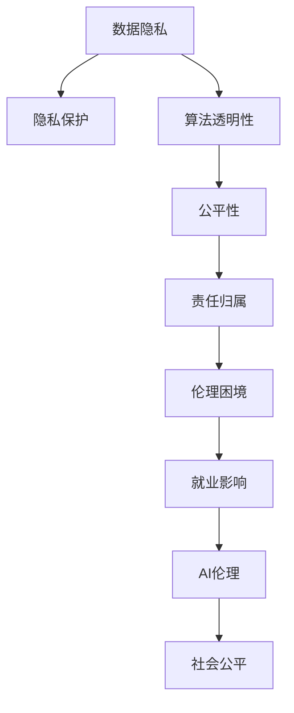

                 

## 1. 背景介绍

### 1.1 问题由来

随着人工智能(AI)技术的飞速发展，尤其是深度学习和自然语言处理(NLP)领域的突破性进展，人类计算的模式正在发生根本性的变革。AI系统在处理数据、分析信息、辅助决策等方面展现了前所未有的强大能力，为各行各业带来了巨大的效率提升和价值创新。然而，这种变革并非没有代价。伴随着技术进步，AI时代的人类计算也带来了一系列道德和伦理问题，这些问题亟需得到广泛关注和深入探讨。

### 1.2 问题核心关键点

AI时代的人类计算面临的道德和伦理问题主要集中在以下几个方面：

- **数据隐私**：AI系统在处理个人数据时，如何保护用户隐私，防止数据滥用和泄露。
- **算法透明性**：AI模型通常被视为“黑箱”，其决策过程难以解释，导致缺乏透明度和可解释性。
- **公平性**：AI模型可能因为数据偏差而存在歧视性，如何保证算法的公平性和公正性。
- **责任归属**：当AI系统出现错误决策时，如何界定责任，涉及算法开发者、使用者和受害者。
- **伦理困境**：在一些复杂场景中，AI决策可能引发伦理困境，如自动驾驶中的生命抉择。
- **就业影响**：AI技术的广泛应用可能改变劳动市场的结构，引发就业问题和社会不平等。

这些问题触及了人类社会生活的方方面面，需要科技界、法律界、伦理界等多方的共同努力才能得到妥善解决。

### 1.3 问题研究意义

研究AI时代的人类计算道德和伦理问题，对于构建健康、可持续发展的AI生态系统具有重要意义：

- 保障数据安全：通过明确数据使用规范和隐私保护措施，确保用户数据的安全和隐私。
- 增强算法透明性：提升AI决策的可解释性，增加用户和社会的信任感。
- 促进算法公平性：减少算法偏见，确保AI系统对所有用户公平对待。
- 明确责任归属：建立清晰的责任界定机制，确保AI系统决策的可追溯性和可问责性。
- 解决伦理困境：通过多学科合作，探讨AI伦理边界，推动AI技术的健康发展。
- 应对就业挑战：引导AI技术发展方向，平衡经济效益和社会公平。

只有深入理解和解决这些道德和伦理问题，AI技术才能真正服务于人类，推动社会的全面进步。

## 2. 核心概念与联系

### 2.1 核心概念概述

为更好地理解AI时代的人类计算道德和伦理问题，本节将介绍几个关键概念：

- **AI伦理**：探讨AI技术的开发和应用中应遵循的道德原则和规范，包括公平、隐私、透明度等方面。
- **隐私保护**：防止个人数据被未经授权的获取和滥用，确保数据处理的合法性和合规性。
- **算法透明性**：指AI模型的决策过程应透明公开，用户和监管机构应能够理解和验证模型的行为。
- **公平性**：确保AI模型在处理不同群体数据时不存在系统性偏差，提供平等的服务。
- **责任归属**：明确AI系统决策的责任主体，建立公平合理的责任分配机制。
- **伦理困境**：在复杂情境中，AI系统面临的道德和伦理选择问题，如自动驾驶中的决策选择。
- **就业影响**：AI技术对劳动市场和就业结构的影响，需要平衡经济增长与社会公平。

这些概念之间相互关联，共同构成了AI时代人类计算道德和伦理问题研究的框架。

### 2.2 核心概念原理和架构的 Mermaid 流程图(Mermaid 流程节点中不要有括号、逗号等特殊字符)



该流程图展示了AI时代人类计算道德和伦理问题研究的核心概念及其相互关系：

1. 数据隐私是保护用户权益的基础，是实现其他伦理原则的前提。
2. 算法透明性确保用户和监管机构对AI决策的监督和理解。
3. 公平性涉及算法偏见和歧视问题，确保不同群体受到平等对待。
4. 责任归属明确了AI系统决策的责任主体，有利于建立问责机制。
5. 伦理困境探讨AI决策中的道德选择，需要综合多方利益。
6. 就业影响评估AI技术对劳动市场的长期影响，需平衡经济效益和社会公平。
7. AI伦理是统领上述概念，指导AI技术健康发展的总体原则。

## 3. 核心算法原理 & 具体操作步骤

### 3.1 算法原理概述

AI时代的人类计算道德和伦理问题并非通过算法求解，而更多涉及社会伦理、法律制度等方面的研究。因此，下文将重点介绍相关概念的理论基础和核心操作步骤。

### 3.2 算法步骤详解

#### 3.2.1 数据隐私保护

数据隐私保护是AI伦理的基础。具体步骤包括：

1. **数据匿名化**：对用户数据进行去标识化处理，防止数据泄露。
2. **访问控制**：对数据访问进行严格的权限控制，确保只有授权人员可以访问敏感数据。
3. **数据最小化**：仅收集和处理必要的数据，减少数据泄露风险。
4. **加密存储**：对存储的数据进行加密，防止数据被未经授权的访问和窃取。
5. **隐私政策制定**：制定清晰透明的隐私政策，告知用户数据使用方式和保护措施。

#### 3.2.2 算法透明性提升

提升AI算法透明性是保障用户信任的关键步骤。具体步骤包括：

1. **可解释性模型**：使用可解释性较强的模型，如决策树、线性回归等，增加决策过程的透明度。
2. **特征重要性分析**：分析模型中各个特征对预测结果的影响，揭示模型决策依据。
3. **模型可视化**：通过可视化工具展示模型决策路径和关键特征，帮助用户理解模型行为。
4. **公开透明报告**：发布模型训练和测试报告，提供模型性能和决策依据的详细说明。

#### 3.2.3 公平性保障

确保AI算法公平性是避免歧视和偏见的关键。具体步骤包括：

1. **数据清洗**：识别和修正数据中的偏见和噪声，减少数据偏差对模型训练的影响。
2. **公平性评估**：使用公平性评估指标（如准确率差异、混淆矩阵等）评估模型在不同群体上的表现。
3. **公平性优化**：通过调整模型参数或引入公平性约束，优化模型在不同群体上的公平性。
4. **多样化数据集**：确保训练数据集的多样性，防止模型在特定群体上的过拟合。

#### 3.2.4 责任归属界定

明确AI系统决策的责任归属是保障系统可问责性的关键。具体步骤包括：

1. **责任主体确定**：明确AI系统的设计者、开发者、使用者和管理者，确立各自的责任范围。
2. **责任规则制定**：制定清晰的责任分配规则，如故障责任、误判责任等。
3. **责任保险**：引入责任保险机制，为AI系统可能造成的损害提供经济保障。
4. **责任追究机制**：建立责任追究机制，确保在发生问题时能够及时追责和赔偿。

#### 3.2.5 伦理困境解决

解决AI决策中的伦理困境需要多方合作和深入探讨。具体步骤包括：

1. **伦理框架构建**：制定伦理框架，指导AI系统的开发和应用。
2. **伦理委员会设立**：设立伦理委员会，监督AI系统的开发和应用过程。
3. **伦理审查**：对AI系统进行伦理审查，确保其符合社会伦理规范。
4. **公众参与**：引入公众参与机制，收集社会各界的意见和建议。

#### 3.2.6 就业影响评估

评估AI技术对就业影响是促进社会公平的重要环节。具体步骤包括：

1. **就业影响评估**：评估AI技术对不同行业、不同岗位的影响，识别潜在的就业风险。
2. **再培训计划**：制定再培训计划，帮助受影响的员工提升技能，适应新的工作环境。
3. **政策支持**：制定相关政策，如失业救济、职业转换支持等，保障社会稳定。
4. **企业责任**：引导企业承担社会责任，提供就业保障和职业发展机会。

### 3.3 算法优缺点

AI时代的人类计算道德和伦理问题研究具有以下优点：

- **综合性强**：综合考虑数据隐私、算法透明性、公平性、责任归属、伦理困境和就业影响，提供全面的解决方案。
- **应用广泛**：适用于AI技术在医疗、金融、交通、教育等各个领域的道德和伦理问题。
- **社会效益**：通过提升AI系统的道德和伦理水平，推动社会公平和可持续发展。

同时，该研究也存在以下缺点：

- **复杂度高**：涉及多学科知识，跨领域合作难度大。
- **数据获取难**：需要大量高质量的数据集，数据获取和处理复杂。
- **模型透明性有限**：一些复杂模型难以解释，增加研究难度。
- **公平性难以量化**：公平性问题复杂，难以用简单的量化指标全面评估。
- **责任界定困难**：AI系统决策复杂，责任归属界定难度大。

尽管存在这些局限性，但研究AI时代的人类计算道德和伦理问题对于保障AI技术的健康发展，构建和谐社会具有重要意义。

### 3.4 算法应用领域

AI时代的人类计算道德和伦理问题研究在多个领域得到了广泛应用，例如：

- **医疗**：在医疗数据使用、AI辅助诊断、治疗方案推荐等方面，保障患者隐私和医疗公平。
- **金融**：在信用评分、风险评估、金融欺诈检测等方面，确保金融公平性和数据安全。
- **交通**：在自动驾驶、交通流量优化等方面，考虑伦理困境和公众安全。
- **教育**：在个性化推荐、智能辅导等方面，确保教育公平和学生隐私。
- **公共安全**：在视频监控、犯罪预测等方面，平衡数据利用和隐私保护。
- **就业市场**：在就业评估、再培训计划等方面，促进社会公平和经济发展。

这些领域的应用展示了AI伦理研究的广泛影响和实际价值，也为其他领域的伦理研究提供了宝贵的经验和启示。

## 4. 数学模型和公式 & 详细讲解 & 举例说明

### 4.1 数学模型构建

由于AI时代的人类计算道德和伦理问题研究主要涉及社会伦理、法律制度等方面，数学模型和公式的作用相对有限。但仍有一些基础模型和理论可用于参考：

1. **隐私保护模型**：
   - 差分隐私（Differential Privacy）：一种隐私保护技术，通过添加噪声保证个体隐私不被泄露。
   - 数据扰动（Data Perturbation）：对原始数据进行随机扰动，防止数据泄露。

2. **算法透明性模型**：
   - 可解释性（Explainability）：衡量AI模型可解释性的指标，如LIME、SHAP等。
   - 特征重要性分析（Feature Importance Analysis）：评估特征对模型预测结果的影响。

3. **公平性模型**：
   - 准确率差异（Accuracy Disparity）：衡量模型在不同群体上的预测准确率差异。
   - 混淆矩阵（Confusion Matrix）：评估模型在不同群体上的分类性能。

4. **责任归属模型**：
   - 责任矩阵（Liability Matrix）：用于描述不同责任主体间的责任分配关系。
   - 故障树（Fault Tree）：用于分析和预防系统故障的模型。

5. **伦理困境模型**：
   - 伦理案例分析（Ethical Case Analysis）：通过具体案例探讨伦理困境的解决方案。
   - 伦理框架（Ethical Framework）：指导AI系统开发和应用的伦理框架。

### 4.2 公式推导过程

由于这些模型和公式涉及多个领域，公式推导过程相对复杂。以下仅以差分隐私为例，简单介绍其基本原理。

差分隐私的基本思想是通过在查询结果中添加噪声，使得单个样本的泄露无法被明显察觉。具体公式如下：

$$
\mathcal{L}(f(x), D) = \mathcal{L}(f(x), D) + \mathcal{N}(\epsilon)
$$

其中，$f(x)$ 表示对数据 $D$ 进行查询的函数，$\mathcal{N}(\epsilon)$ 表示均值为0、标准差为 $\epsilon$ 的正态分布噪声，$\epsilon$ 表示隐私预算。

在实际应用中，通常使用Laplace机制来实现差分隐私，其具体公式如下：

$$
p(y|x) = \frac{1}{Z} e^{-|y-f(x)|/\epsilon}
$$

其中，$Z$ 为归一化常数，$f(x)$ 为查询结果，$y$ 为加入噪声后的结果。

### 4.3 案例分析与讲解

**案例1：医疗数据隐私保护**

在医疗领域，AI系统常常需要处理大量的患者数据。为保护患者隐私，可以使用差分隐私技术：

1. **数据匿名化**：对患者姓名、地址等敏感信息进行去标识化处理，仅保留必要的医疗信息。
2. **隐私预算分配**：根据数据敏感程度，分配不同隐私预算，确保敏感信息不被泄露。
3. **隐私预算评估**：定期评估隐私预算的使用情况，确保隐私保护措施的有效性。

**案例2：算法透明性提升**

在金融领域，AI系统用于信用评分和风险评估。为提升算法透明性，可以使用可解释性模型：

1. **决策树模型**：使用决策树模型进行信用评分，生成可解释的决策路径。
2. **特征重要性分析**：通过LIME或SHAP等方法，分析各个特征对评分结果的影响。
3. **模型可视化**：使用t-SNE或LIME等工具，生成模型特征空间的可视化图。

## 5. 项目实践：代码实例和详细解释说明

### 5.1 开发环境搭建

在进行AI伦理问题研究时，需要搭建一个支持Python和R语言的开发环境，以下是具体步骤：

1. **安装Anaconda**：从官网下载并安装Anaconda，用于创建独立的Python环境。
```bash
conda create -n pythonsrc python=3.8 
conda activate pythonsrc
```

2. **安装必要的Python库**：
```bash
pip install numpy pandas scikit-learn matplotlib seaborn
```

3. **安装必要的R语言环境**：
```bash
conda install r-essentials
```

4. **安装必要的R语言库**：
```bash
install.packages("caret")
install.packages("tidyverse")
install.packages("ggplot2")
```

完成上述步骤后，即可在`pythonsrc`和`R`环境中进行AI伦理问题的研究和实现。

### 5.2 源代码详细实现

以差分隐私为例，以下是Python和R语言中实现差分隐私的代码示例：

**Python实现：**

```python
import numpy as np
from scipy.stats import laplace

def laplace_noise(mean, std, epsilon):
    return np.random.laplace(mean, std, size=len(mean))

def differential_privacy(f, D, epsilon):
    return [f(d) + laplace_noise(f(d), std=1/epsilon, epsilon=epsilon) for d in D]
```

**R语言实现：**

```R
library(ggplot2)
library(tidyverse)

# 生成差分隐私数据
set.seed(123)
data <- data.frame(x = rnorm(100))
f <- function(x) {
  return(sum(x))
}

# 计算差分隐私预算
epsilon <- 1
隐私预算 <- 1/epsilon

# 计算差分隐私数据
差分隐私数据 <- data.frame(
  x = c(f(data$x) + laplace_noise(f(data$x), std=1/epsilon, epsilon=隐私预算),
       f(data$x) + laplace_noise(f(data$x), std=1/epsilon, epsilon=隐私预算),
       f(data$x) + laplace噪声(f(data$x), std=1/epsilon, epsilon=隐私预算),
       f(data$x) + laplace噪声(f(data$x), std=1/epsilon, epsilon=隐私预算)
)

# 绘制差分隐私数据的分布图
ggplot(差分隐私数据, aes(x)) + geom_density(alpha=0.2) + labs(title="差分隐私数据分布")
```

### 5.3 代码解读与分析

**Python实现：**

1. **差分隐私函数**：使用laplace噪声生成差分隐私数据，返回处理后的数据。
2. **主函数**：将原始数据传入差分隐私函数，返回差分隐私数据。

**R语言实现：**

1. **差分隐私预算计算**：计算隐私预算，确保隐私保护。
2. **差分隐私数据生成**：使用差分隐私预算和原始数据，生成差分隐私数据。
3. **数据可视化**：绘制差分隐私数据的分布图，展示隐私保护效果。

## 6. 实际应用场景

### 6.1 医疗领域

在医疗领域，AI系统用于辅助诊断和治疗方案推荐。为保障患者隐私和医疗公平，可以采用以下方法：

1. **数据匿名化**：对患者姓名、地址等敏感信息进行去标识化处理，确保数据安全。
2. **隐私保护算法**：使用差分隐私技术，保护患者隐私。
3. **公平性评估**：评估AI系统在各种疾病、年龄、性别等群体上的表现，确保公平性。

### 6.2 金融领域

在金融领域，AI系统用于信用评分和风险评估。为确保金融公平性和数据安全，可以采用以下方法：

1. **透明性提升**：使用可解释性模型，增加决策过程的透明度。
2. **公平性优化**：使用公平性评估指标，优化模型在不同群体上的表现。
3. **责任归属界定**：明确各方的责任范围，建立责任追究机制。

### 6.3 交通领域

在交通领域，AI系统用于自动驾驶和交通流量优化。为考虑伦理困境和公众安全，可以采用以下方法：

1. **伦理框架制定**：制定自动驾驶伦理框架，指导系统开发和应用。
2. **伦理审查机制**：设立伦理审查委员会，监督系统开发过程。
3. **公众参与**：引入公众参与机制，收集社会各界的意见和建议。

### 6.4 未来应用展望

随着AI技术的进一步发展，AI时代的人类计算道德和伦理问题将得到更加广泛的应用。未来，该领域的发展趋势如下：

1. **多学科融合**：AI伦理问题研究将与法律、哲学、社会学等学科深度融合，形成综合性的解决方案。
2. **技术普及**：AI伦理工具和算法将更加普及，帮助企业和组织更好地应对伦理挑战。
3. **伦理教育**：在教育体系中引入AI伦理课程，培养具备伦理意识的AI从业者。
4. **伦理治理**：政府和企业将加强伦理治理，制定更完善的AI伦理规范和标准。
5. **国际合作**：全球范围内加强AI伦理合作，形成统一的伦理标准和规范。

## 7. 工具和资源推荐

### 7.1 学习资源推荐

为了帮助开发者系统掌握AI时代人类计算道德和伦理问题，以下是一些优质的学习资源：

1. **AI伦理课程**：多所知名大学和在线教育平台提供的AI伦理课程，如斯坦福大学的《AI伦理与法律》。
2. **AI伦理书籍**：《AI伦理》（陈继清等著）、《人工智能：未来之路》（吴军著）等。
3. **AI伦理社区**：参加AI伦理相关的论坛和社区，如AI Ethics Lab、AI governance等。
4. **AI伦理研究论文**：查阅相关领域的最新研究成果，了解前沿进展。
5. **AI伦理指南**：《人工智能伦理指南》（张华等编）、《AI伦理手册》等。

通过这些资源的学习实践，相信你一定能够深入理解AI时代人类计算的道德和伦理问题，为构建健康、可持续发展的AI生态系统贡献力量。

### 7.2 开发工具推荐

在AI伦理问题的研究和实现中，以下工具可以提高开发效率：

1. **Python编程语言**：Python具有丰富的第三方库和框架，如NumPy、Pandas、Scikit-learn等，支持数据处理和算法实现。
2. **R编程语言**：R语言在统计分析和数据可视化方面具有强大优势，适用于AI伦理问题的研究和验证。
3. **Jupyter Notebook**：支持Python和R语言，支持代码单元格和可视化，适合研究数据和算法。
4. **Git和GitHub**：版本控制和代码托管平台，方便团队协作和代码共享。
5. **Google Colab**：谷歌提供的在线Jupyter Notebook环境，支持GPU计算，适合大规模数据处理和模型训练。

合理利用这些工具，可以显著提升AI伦理问题的研究和实现效率，加快创新迭代的步伐。

### 7.3 相关论文推荐

AI时代人类计算的道德和伦理问题研究涉及多个学科领域，以下是几篇奠基性的相关论文，推荐阅读：

1. **《AI伦理：前沿与挑战》（陈继清等著）**：系统阐述了AI伦理的各个方面，包括隐私保护、公平性、责任归属等。
2. **《AI伦理困境：案例与解决方案》**：通过具体案例探讨AI伦理困境的解决方案。
3. **《AI伦理框架与实践》**：提出了一套AI伦理框架，指导AI系统的开发和应用。
4. **《数据隐私保护：技术、挑战与未来》**：探讨了数据隐私保护的技术手段和面临的挑战。
5. **《公平性评估与优化》**：研究了AI系统在公平性方面的评估指标和方法。
6. **《责任归属界定与机制》**：探讨了AI系统决策的责任归属和责任追究机制。

这些论文代表了大AI伦理问题的研究进展，可以帮助研究者把握学科前进方向，激发更多的创新灵感。

## 8. 总结：未来发展趋势与挑战

### 8.1 研究成果总结

本文对AI时代的人类计算道德和伦理问题进行了全面系统的介绍。首先阐述了AI伦理问题研究的背景和意义，明确了数据隐私、算法透明性、公平性、责任归属、伦理困境和就业影响等关键概念。其次，通过具体案例和代码实例，展示了数据隐私保护、算法透明性提升、公平性保障、责任归属界定、伦理困境解决和就业影响评估等关键操作步骤。最后，总结了AI伦理问题研究的应用场景和未来发展趋势，提出了多学科融合、技术普及、伦理教育、伦理治理和国际合作等发展方向。

通过本文的系统梳理，可以看到，AI时代的人类计算道德和伦理问题研究具有广泛的应用前景和实际价值，为构建健康、可持续发展的AI生态系统提供了重要指导。

### 8.2 未来发展趋势

展望未来，AI时代的人类计算道德和伦理问题研究将呈现以下几个发展趋势：

1. **多学科融合**：AI伦理问题研究将与法律、哲学、社会学等学科深度融合，形成综合性的解决方案。
2. **技术普及**：AI伦理工具和算法将更加普及，帮助企业和组织更好地应对伦理挑战。
3. **伦理教育**：在教育体系中引入AI伦理课程，培养具备伦理意识的AI从业者。
4. **伦理治理**：政府和企业将加强伦理治理，制定更完善的AI伦理规范和标准。
5. **国际合作**：全球范围内加强AI伦理合作，形成统一的伦理标准和规范。

### 8.3 面临的挑战

尽管AI时代的人类计算道德和伦理问题研究取得了重要进展，但在迈向更加智能化、普适化应用的过程中，仍面临诸多挑战：

1. **数据获取困难**：高质量的数据集获取和处理复杂，涉及隐私保护和数据共享的矛盾。
2. **算法透明性不足**：复杂模型难以解释，增加研究难度。
3. **公平性难以量化**：公平性问题复杂，难以用简单的量化指标全面评估。
4. **责任归属困难**：AI系统决策复杂，责任归属界定难度大。
5. **伦理困境复杂**：伦理困境场景复杂，需要多方合作和深入探讨。
6. **就业影响不确定**：AI技术对就业影响不确定，需要平衡经济效益和社会公平。

### 8.4 研究展望

面对AI伦理问题研究面临的挑战，未来的研究需要在以下几个方面寻求新的突破：

1. **多学科合作**：加强与法律、哲学、社会学等学科的合作，综合解决伦理问题。
2. **透明性提升**：开发更加透明、可解释的AI模型，增强用户和社会的信任感。
3. **公平性优化**：引入公平性约束，优化模型在不同群体上的公平性。
4. **责任归属明确**：建立清晰的责任界定机制，确保AI系统决策的可追溯性和可问责性。
5. **伦理困境解决**：引入伦理框架和机制，确保AI决策符合社会伦理规范。
6. **就业影响评估**：制定就业保护政策，平衡经济效益和社会公平。

这些研究方向将推动AI伦理问题研究迈向更高的台阶，为构建安全、可靠、可解释、可控的智能系统铺平道路。

## 9. 附录：常见问题与解答

**Q1：AI伦理问题研究是否适用于所有AI应用场景？**

A: AI伦理问题研究适用于AI技术在医疗、金融、交通、教育等各个领域的道德和伦理问题。虽然有些领域可能存在特定的问题和挑战，但整体框架和方法仍具普适性。

**Q2：如何在AI开发过程中确保算法透明性？**

A: 在AI开发过程中，可以采取以下措施确保算法透明性：

1. **选择透明算法**：优先选择可解释性较强的算法，如决策树、线性回归等。
2. **特征重要性分析**：使用LIME或SHAP等方法，分析各个特征对模型预测结果的影响。
3. **模型可视化**：使用t-SNE或LIME等工具，生成模型特征空间的可视化图。
4. **公开透明报告**：发布模型训练和测试报告，提供模型性能和决策依据的详细说明。

**Q3：如何评估AI算法的公平性？**

A: 评估AI算法的公平性，可以采取以下措施：

1. **数据清洗**：识别和修正数据中的偏见和噪声，减少数据偏差对模型训练的影响。
2. **公平性评估指标**：使用准确率差异、混淆矩阵等指标评估模型在不同群体上的表现。
3. **公平性优化**：通过调整模型参数或引入公平性约束，优化模型在不同群体上的公平性。
4. **多样化数据集**：确保训练数据集的多样性，防止模型在特定群体上的过拟合。

**Q4：在AI系统开发过程中，如何界定责任归属？**

A: 在AI系统开发过程中，可以采取以下措施界定责任归属：

1. **责任主体确定**：明确AI系统的设计者、开发者、使用者和管理者，确立各自的责任范围。
2. **责任规则制定**：制定清晰的责任分配规则，如故障责任、误判责任等。
3. **责任保险**：引入责任保险机制，为AI系统可能造成的损害提供经济保障。
4. **责任追究机制**：建立责任追究机制，确保在发生问题时能够及时追责和赔偿。

**Q5：如何平衡AI技术对就业的影响？**

A: 平衡AI技术对就业的影响，可以采取以下措施：

1. **就业影响评估**：评估AI技术对不同行业、不同岗位的影响，识别潜在的就业风险。
2. **再培训计划**：制定再培训计划，帮助受影响的员工提升技能，适应新的工作环境。
3. **政策支持**：制定相关政策，如失业救济、职业转换支持等，保障社会稳定。
4. **企业责任**：引导企业承担社会责任，提供就业保障和职业发展机会。

这些措施可以帮助社会更好地应对AI技术带来的就业挑战，实现公平和可持续的发展。

---

作者：禅与计算机程序设计艺术 / Zen and the Art of Computer Programming

