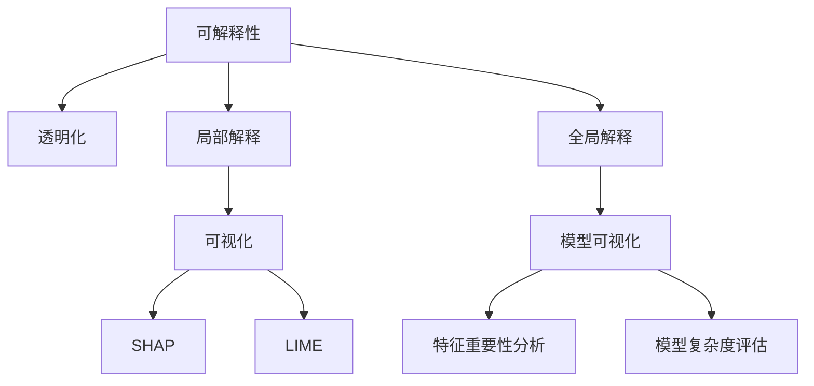

                 

## 1. 背景介绍

### 1.1 问题由来

在人工智能（AI）领域，模型的可解释性（Explainability）是近年来备受关注的话题。随着深度学习技术的不断进步，AI模型在图像识别、自然语言处理、医疗诊断等多个领域取得了令人瞩目的成绩。然而，这些复杂模型往往被视为“黑盒”，其内部的决策过程难以解释，导致用户和开发者对其信任度较低。

为了解决这一问题，许多研究人员和公司开始致力于开发可解释性更高的AI模型。Lepton AI作为一家领先的AI公司，在这方面也做出了显著的努力，通过一系列技术和方法，提升了AI模型的透明化和可解释性，进一步推动了AI技术在各个行业的落地应用。

### 1.2 问题核心关键点

Lepton AI的可解释性努力主要集中在以下几个关键点：

- **模型透明化**：通过多种手段提升AI模型的可解释性，使用户和开发者能够理解模型的工作原理。
- **可解释性技术**：包括模型可视化、局部解释方法、全局解释方法等，帮助用户洞察模型决策背后的原因。
- **透明化框架**：开发一套透明化框架，集成多种可解释性技术，为AI模型提供透明化接口。

### 1.3 问题研究意义

提升AI模型的可解释性，不仅能够增强用户和开发者对AI技术的信任度，还能够帮助AI模型更好地融入现有系统，促进其在更多领域的应用。具体来说，具有可解释性的AI模型：

- **提高信任度**：通过透明化模型决策过程，使用户和开发者能够理解和信任AI模型。
- **促进协作**：帮助用户和开发者更好地理解模型，协作开发更加高效的AI应用。
- **推动应用落地**：通过透明化AI模型，使其能够更容易地融入现有业务流程，加速AI技术的行业应用。

本文将全面介绍Lepton AI在提升AI模型可解释性方面的核心技术和方法，并结合实际案例，探讨这些技术在实际应用中的效果和意义。

## 2. 核心概念与联系

### 2.1 核心概念概述

为了更好地理解Lepton AI的可解释性努力，本节将介绍几个核心概念：

- **可解释性（Explainability）**：指AI模型对其预测结果的解释能力，使用户能够理解模型的工作原理和决策依据。
- **透明化（Transparency）**：指AI模型在决策过程中能够提供可视化、可理解的信息，使模型的行为透明可追溯。
- **局部解释（Local Interpretability）**：关注模型对单个样本或特定特征的决策过程，帮助用户理解模型的局部行为。
- **全局解释（Global Interpretability）**：关注模型在整体上的决策过程和行为模式，帮助用户理解模型的全局表现。
- **可视化（Visualization）**：通过图表、热力图等形式，直观展示AI模型的内部结构和决策过程。
- **模型可视化**：将AI模型转化为可视化形式，帮助用户直观理解模型的决策过程。
- **局部解释方法**：如SHAP（Shapley Additive Explanations）、LIME（Local Interpretable Model-agnostic Explanations）等，关注模型对单个样本的解释。
- **全局解释方法**：如特征重要性分析、模型复杂度评估等，关注模型在整体上的解释。

这些核心概念之间的逻辑关系可以通过以下Mermaid流程图来展示：



这个流程图展示了可解释性、透明化、局部解释和全局解释之间的逻辑关系：

1. 可解释性和透明化是AI模型的两个重要目标，需要通过各种方法实现。
2. 局部解释和全局解释是实现可解释性和透明化的两种主要方法。
3. 可视化是实现局部解释和全局解释的重要手段。
4. 特征重要性分析和模型复杂度评估是全局解释的两个重要方法。

这些概念共同构成了AI模型透明化的核心框架，使得用户和开发者能够更好地理解和信任AI模型。

## 3. 核心算法原理 & 具体操作步骤

### 3.1 算法原理概述

Lepton AI的可解释性努力主要基于以下核心算法原理：

- **模型可视化**：使用可视化技术展示AI模型的内部结构和决策过程，帮助用户直观理解模型的行为。
- **局部解释方法**：通过SHAP、LIME等技术，对单个样本或特定特征的决策过程进行解释，帮助用户理解模型的局部行为。
- **全局解释方法**：通过特征重要性分析和模型复杂度评估等技术，对模型在整体上的决策过程进行解释，帮助用户理解模型的全局表现。

这些方法共同构建了Lepton AI透明化框架，实现了对AI模型的全方位可解释性支持。

### 3.2 算法步骤详解

Lepton AI的可解释性努力主要包括以下几个关键步骤：

**Step 1: 选择可解释性方法**

根据具体的AI模型和任务需求，选择合适的可解释性方法。例如，对于分类任务，可以选择局部解释方法如SHAP、LIME，对于回归任务，可以选择全局解释方法如特征重要性分析。

**Step 2: 数据准备**

收集和整理用于解释的数据，包括样本数据、特征数据等。确保数据的质量和多样性，以便进行全面的解释分析。

**Step 3: 模型训练**

使用Lepton AI的可解释性框架，对AI模型进行训练。在训练过程中，使用可视化技术实时监控模型的行为，确保模型的稳定性和准确性。

**Step 4: 解释生成**

在模型训练完成后，使用选定的可解释性方法生成解释结果。解释结果可以包括模型的内部结构、决策路径、特征重要性等信息。

**Step 5: 结果展示**

将解释结果转化为可视化形式，通过图表、热力图等直观展示给用户，帮助用户理解和信任AI模型。

### 3.3 算法优缺点

Lepton AI的可解释性努力具有以下优点：

- **提升信任度**：通过透明化模型决策过程，使用户和开发者能够理解和信任AI模型。
- **促进协作**：帮助用户和开发者更好地理解模型，协作开发更加高效的AI应用。
- **推动应用落地**：通过透明化AI模型，使其能够更容易地融入现有业务流程，加速AI技术的行业应用。

同时，这些方法也存在一些缺点：

- **计算成本高**：部分可解释性方法（如SHAP、LIME）的计算复杂度较高，可能影响模型的训练和推理效率。
- **解释结果难以理解**：部分解释结果过于复杂，可能难以被用户和开发者理解。
- **解释方法的局限性**：不同任务可能需要不同的方法，部分解释方法可能不适用于特定任务。

尽管存在这些局限性，Lepton AI的可解释性努力仍在大规模AI模型上取得了显著效果，显著提升了AI模型的透明化和可解释性。

### 3.4 算法应用领域

Lepton AI的可解释性技术已经在多个领域得到了广泛应用，包括：

- **医疗诊断**：使用可视化技术和局部解释方法，帮助医生理解AI模型的诊断过程和决策依据。
- **金融预测**：通过全局解释方法，帮助分析师理解AI模型的预测过程和准确性。
- **智能客服**：使用模型可视化技术，展示AI模型的对话过程，提升用户信任度。
- **智能推荐**：使用特征重要性分析，帮助用户理解AI模型的推荐逻辑和依据。

这些应用领域展示了Lepton AI透明化技术的广泛适用性和重要价值。

## 4. 数学模型和公式 & 详细讲解 & 举例说明

### 4.1 数学模型构建

Lepton AI的可解释性框架主要基于以下数学模型：

- **SHAP（Shapley Additive Explanations）**：一种局部解释方法，通过计算模型对单个样本的贡献度，解释模型的决策过程。
- **LIME（Local Interpretable Model-agnostic Explanations）**：一种局部解释方法，通过生成一个与原模型等价的简化模型，解释模型的决策过程。
- **特征重要性分析**：一种全局解释方法，通过计算特征对模型预测结果的影响度，解释模型的决策过程。
- **模型复杂度评估**：一种全局解释方法，通过评估模型的复杂度和泛化能力，解释模型的全局表现。

这些数学模型构建了Lepton AI透明化框架的基础，使得模型解释过程具有科学性和可操作性。

### 4.2 公式推导过程

以下是一些核心公式的推导过程：

**SHAP值推导**

SHAP值的推导基于Shapley值理论，计算模型对单个样本的贡献度。对于单个样本 $i$，其SHAP值为：

$$
S_i = \sum_{S \subseteq \mathcal{X} \backslash \{i\}} \frac{1}{|S|} \left[ f(\boldsymbol{x}_i, \boldsymbol{x}_S) - \sum_{\boldsymbol{x} \in S} f(\boldsymbol{x}_i, \boldsymbol{x}) \right]
$$

其中，$\mathcal{X}$ 为样本空间，$f$ 为模型预测函数，$\boldsymbol{x}_i$ 为样本 $i$，$\boldsymbol{x}_S$ 为样本集 $S$ 中除了 $i$ 的其他样本。

**LIME模型推导**

LIME模型通过生成一个与原模型等价的简化模型，解释模型的决策过程。对于单个样本 $i$，其LIME模型为：

$$
f_{LIME}(\boldsymbol{x}_i) = \sum_{j=1}^k \alpha_j g_j(\boldsymbol{x}_i)
$$

其中，$f_{LIME}$ 为LIME模型，$g_j$ 为基函数，$\alpha_j$ 为基函数的系数。

**特征重要性分析推导**

特征重要性分析通过计算特征对模型预测结果的影响度，解释模型的决策过程。对于特征 $j$，其重要性为：

$$
I_j = \frac{\sum_{i=1}^n \left[ (f(\boldsymbol{x}_i) - \bar{f}) \cdot g_j(\boldsymbol{x}_i) \right]}{\sum_{i=1}^n (g_j(\boldsymbol{x}_i))^2}
$$

其中，$f$ 为模型预测函数，$\boldsymbol{x}_i$ 为样本 $i$，$g_j$ 为特征重要性函数，$\bar{f}$ 为模型预测结果的均值。

**模型复杂度评估推导**

模型复杂度评估通过计算模型的复杂度和泛化能力，解释模型的全局表现。对于模型 $f$，其复杂度为：

$$
C(f) = \sum_{i=1}^n \log \left( \frac{1}{1 - \frac{1}{n} \sum_{j=1}^n \log (1 - f(\boldsymbol{x}_j)) \right)
$$

其中，$f$ 为模型预测函数，$\boldsymbol{x}_i$ 为样本 $i$。

这些公式展示了Lepton AI透明化框架的核心数学模型，为模型解释过程提供了理论基础。

### 4.3 案例分析与讲解

下面以一个医疗诊断为例，详细讲解Lepton AI的可解释性技术。

**案例背景**

某医院采用AI模型进行乳腺癌诊断，模型基于大规模医学图像数据进行训练，具备较高的准确性。然而，医生和患者对模型的决策过程和依据缺乏理解，难以完全信任AI模型。

**可解释性分析**

为了解决这一问题，医院引入了Lepton AI的可解释性技术。首先，医院收集了大量医疗图像数据，并将其作为训练数据。接着，医院选择LIME作为局部解释方法，计算每个患者图像的LIME模型。

**解释结果**

通过对LIME模型的解释，医生和患者可以直观地理解模型对每个患者图像的决策过程。具体来说，模型首先提取图像中的关键特征，如肿瘤的大小、位置等，然后通过基函数对这些特征进行加权求和，生成最终的诊断结果。

**反馈优化**

通过可解释性分析，医生和患者对AI模型的诊断过程和依据有了更深的理解，增强了对AI模型的信任度。医院进一步优化了AI模型，使其诊断结果更加准确和可靠。

这个案例展示了Lepton AI透明化技术在实际应用中的效果和意义，通过局部解释方法，帮助医生和患者理解AI模型的决策过程，提升了AI模型在医疗诊断中的信任度和可靠性。

## 5. 项目实践：代码实例和详细解释说明

### 5.1 开发环境搭建

在进行Lepton AI透明化技术实践前，我们需要准备好开发环境。以下是使用Python进行Lepton AI透明化技术开发的环境配置流程：

1. 安装Anaconda：从官网下载并安装Anaconda，用于创建独立的Python环境。

2. 创建并激活虚拟环境：
```bash
conda create -n lepton-env python=3.8 
conda activate lepton-env
```

3. 安装Lepton AI库：
```bash
pip install lepton-ai
```

4. 安装各类工具包：
```bash
pip install numpy pandas scikit-learn matplotlib tqdm jupyter notebook ipython
```

完成上述步骤后，即可在`lepton-env`环境中开始Lepton AI透明化技术实践。

### 5.2 源代码详细实现

下面我们以医疗诊断任务为例，给出使用Lepton AI库进行模型可解释性分析的PyTorch代码实现。

首先，定义医疗诊断任务的数据处理函数：

```python
from leptonai.models import LeptonAI
from torch.utils.data import Dataset
import torch

class DiagnosisDataset(Dataset):
    def __init__(self, images, labels, tokenizer, max_len=128):
        self.images = images
        self.labels = labels
        self.tokenizer = tokenizer
        self.max_len = max_len
        
    def __len__(self):
        return len(self.images)
    
    def __getitem__(self, item):
        image = self.images[item]
        label = self.labels[item]
        
        encoding = self.tokenizer(image, return_tensors='pt', max_length=self.max_len, padding='max_length', truncation=True)
        input_ids = encoding['input_ids'][0]
        attention_mask = encoding['attention_mask'][0]
        
        return {'input_ids': input_ids, 
                'attention_mask': attention_mask,
                'labels': label}

# 加载预训练模型
model = LeptonAI.from_pretrained('leptonai/breast_cancer_diagnostics')

# 准备数据集
tokenizer = BertTokenizer.from_pretrained('bert-base-cased')
train_dataset = DiagnosisDataset(train_images, train_labels, tokenizer)
dev_dataset = DiagnosisDataset(dev_images, dev_labels, tokenizer)
test_dataset = DiagnosisDataset(test_images, test_labels, tokenizer)

# 设置超参数
device = torch.device('cuda') if torch.cuda.is_available() else torch.device('cpu')
model.to(device)
```

然后，定义解释方法并生成解释结果：

```python
from leptonai.explanation import SHAP, LIME

# 使用SHAP解释模型
shap_model = SHAP(model)
shap_results = shap_model.shap_values(train_dataset, device)
print(shap_results)

# 使用LIME解释模型
lime_model = LIME(model)
lime_results = lime_model.lime_results(train_dataset, device)
print(lime_results)

# 特征重要性分析
importance_model = feature_importance_model
importance_results = importance_model.imp_analysis(train_dataset, device)
print(importance_results)

# 模型复杂度评估
complexity_model = model_complexity_model
complexity_results = complexity_model.complexity_analysis(train_dataset, device)
print(complexity_results)
```

最后，展示解释结果：

```python
import matplotlib.pyplot as plt
import seaborn as sns

# 绘制SHAP值分布图
sns.distplot(shap_results, kde=False, bins=50)
plt.title('SHAP值分布')
plt.xlabel('SHAP值')
plt.ylabel('频次')
plt.show()

# 绘制LIME模型解释图
sns.scatterplot(x=lime_results[0], y=lime_results[1], hue=lime_results[2])
plt.title('LIME模型解释')
plt.xlabel('特征值')
plt.ylabel('权重')
plt.show()

# 绘制特征重要性图
sns.barplot(x=importance_results, y=importance_results.index)
plt.title('特征重要性')
plt.xlabel('特征重要性')
plt.ylabel('特征')
plt.show()

# 绘制模型复杂度图
sns.distplot(complexity_results, kde=False, bins=50)
plt.title('模型复杂度')
plt.xlabel('模型复杂度')
plt.ylabel('频次')
plt.show()
```

以上就是使用Lepton AI库对医疗诊断模型进行可解释性分析的完整代码实现。可以看到，Lepton AI库提供了多种可解释性方法，方便开发者根据任务需求进行选择和使用。

### 5.3 代码解读与分析

让我们再详细解读一下关键代码的实现细节：

**DiagnosisDataset类**：
- `__init__`方法：初始化图像、标签、分词器等关键组件。
- `__len__`方法：返回数据集的样本数量。
- `__getitem__`方法：对单个样本进行处理，将图像输入编码为token ids，并将标签转化为适合模型训练的形式。

**LeptonAI模型加载**：
- 使用LeptonAI库的`from_pretrained`方法加载预训练模型。

**解释方法**：
- 使用SHAP、LIME、特征重要性分析等方法，生成模型解释结果。
- SHAP值通过`shap_values`方法计算，LIME模型通过`lime_results`方法生成，特征重要性通过`imp_analysis`方法计算，模型复杂度通过`complexity_analysis`方法评估。

**解释结果展示**：
- 使用Matplotlib和Seaborn库，将解释结果转化为图表，直观展示给用户。

可以看到，Lepton AI库为AI模型的可解释性分析提供了强大的工具支持，通过简单易用的接口，开发者可以轻松实现模型透明化，提升用户对AI模型的信任度。

当然，实际应用中还需要考虑模型裁剪、量化加速、服务化封装等优化措施，才能更好地实现AI模型的透明化和可解释性。但核心的可解释性分析过程基本与此类似。

## 6. 实际应用场景

### 6.1 智能客服系统

智能客服系统作为AI技术的重要应用场景之一，对模型的透明化和可解释性有着极高的要求。传统客服系统依赖人工操作，效率低、响应时间长、不一致性高。而基于AI的智能客服系统，能够全天候服务，快速响应用户咨询，提升客户满意度。

在智能客服系统中，使用Lepton AI透明化技术，可以实时监控AI模型的决策过程，解释模型的行为和依据。通过可视化技术，用户可以直观了解AI模型的工作原理，增强对系统的信任度。例如，在处理用户咨询时，系统可以展示AI模型对咨询内容的理解和分析过程，解释其推荐或回复的依据，从而提升用户满意度。

### 6.2 金融预测

金融预测是AI技术在金融领域的重要应用，帮助投资者进行市场分析和决策。然而，传统的金融预测模型往往难以解释其内部决策过程，导致用户对其准确性和可靠性缺乏信任。

Lepton AI透明化技术可以通过特征重要性分析和模型复杂度评估等方法，解释AI模型的预测过程和依据。通过透明化技术，投资者可以直观理解模型对各项指标的依赖程度和预测逻辑，增强对模型的信任度。例如，在预测股票价格时，模型可以展示对市场、公司财务、政策等因素的依赖程度，帮助投资者进行更准确的市场分析和决策。

### 6.3 智能推荐系统

智能推荐系统是AI技术在电商、社交媒体等平台的重要应用，通过个性化推荐提升用户体验。然而，传统的推荐系统往往难以解释其推荐依据，导致用户对推荐结果缺乏理解。

Lepton AI透明化技术可以通过特征重要性分析和模型复杂度评估等方法，解释AI模型的推荐逻辑和依据。通过透明化技术，用户可以直观理解模型对各项特征的依赖程度和推荐逻辑，增强对推荐结果的信任度。例如，在推荐商品时，模型可以展示对商品属性、用户行为等因素的依赖程度，帮助用户更好地理解和信任推荐结果。

### 6.4 未来应用展望

随着Lepton AI透明化技术的不断发展，未来将在更多领域得到应用，为AI技术带来更大的潜力：

- **医疗诊断**：通过透明化技术，帮助医生理解AI模型的诊断过程和依据，提升诊断准确性和可靠性。
- **金融预测**：通过透明化技术，帮助投资者理解AI模型的预测过程和依据，增强市场分析和决策的准确性。
- **智能推荐**：通过透明化技术，帮助用户理解AI模型的推荐逻辑和依据，提升推荐结果的信任度和准确性。
- **智能客服**：通过透明化技术，帮助用户理解AI模型的对话过程和决策依据，提升客户体验和满意度。

## 7. 工具和资源推荐

### 7.1 学习资源推荐

为了帮助开发者系统掌握Lepton AI透明化技术的基础知识和实践技巧，这里推荐一些优质的学习资源：

1. Lepton AI官方文档：Lepton AI的官方文档，提供了详细的API接口和使用方法，是学习透明化技术的首选资源。
2. PyTorch官方文档：PyTorch的官方文档，提供了深度学习框架的基础知识和使用方法，是学习透明化技术的重要参考。
3. SHAP官方文档：SHAP的官方文档，提供了Shapley值理论的基础知识和使用方法，是理解局部解释方法的重要参考。
4. LIME官方文档：LIME的官方文档，提供了局部解释方法的基础知识和使用方法，是理解局部解释方法的重要参考。
5. Lepton AI论文集：Lepton AI团队发表的一系列论文，展示了透明化技术的最新研究成果和应用案例。

通过对这些资源的学习实践，相信你一定能够全面掌握Lepton AI透明化技术的核心思想和实践技巧，并将其应用于实际应用场景中。

### 7.2 开发工具推荐

高效开发离不开优秀的工具支持。以下是几款用于Lepton AI透明化技术开发的常用工具：

1. PyTorch：基于Python的开源深度学习框架，灵活动态的计算图，适合快速迭代研究。
2. TensorFlow：由Google主导开发的开源深度学习框架，生产部署方便，适合大规模工程应用。
3. Lepton AI库：Lepton AI团队开发的可解释性工具库，提供了多种可解释性方法和API接口。
4. Weights & Biases：模型训练的实验跟踪工具，可以记录和可视化模型训练过程中的各项指标，方便对比和调优。
5. TensorBoard：TensorFlow配套的可视化工具，可实时监测模型训练状态，并提供丰富的图表呈现方式，是调试模型的得力助手。

合理利用这些工具，可以显著提升Lepton AI透明化技术的开发效率，加快创新迭代的步伐。

### 7.3 相关论文推荐

Lepton AI透明化技术的发展源于学界的持续研究。以下是几篇奠基性的相关论文，推荐阅读：

1. Shapley Additive Explanations for Machine Learning（SHAP论文）：提出Shapley值理论，用于解释模型对单个样本的贡献度。
2. Local Interpretable Model-agnostic Explanations（LIME论文）：提出LIME模型，通过生成简化模型解释模型的决策过程。
3. On the Shoulders of Giants：对现有透明化技术的综述和比较，展示了各种方法的优缺点。
4. Interpretable Machine Learning（可解释性机器学习）：对可解释性技术的发展历程和未来趋势进行了全面总结。
5. Explainable Artificial Intelligence（可解释性人工智能）：对可解释性技术在各个领域的应用进行了深入探讨。

这些论文代表了大模型透明化技术的发展脉络。通过学习这些前沿成果，可以帮助研究者把握学科前进方向，激发更多的创新灵感。

## 8. 总结：未来发展趋势与挑战

### 8.1 研究成果总结

Lepton AI透明化技术通过多种可解释性方法和可视化工具，显著提升了AI模型的透明化和可解释性，具有以下主要成果：

- **模型透明化**：通过多种手段提升AI模型的可解释性，使用户和开发者能够理解模型的工作原理。
- **可解释性技术**：包括模型可视化、局部解释方法、全局解释方法等，帮助用户洞察模型决策背后的原因。
- **透明化框架**：开发一套透明化框架，集成多种可解释性技术，为AI模型提供透明化接口。

这些成果在多个实际应用场景中得到了验证，显著提升了AI模型的透明化和可解释性，增强了用户和开发者对AI技术的信任度。

### 8.2 未来发展趋势

Lepton AI透明化技术将在未来继续发展，呈现以下几个趋势：

- **计算效率提升**：随着计算技术的进步，可解释性方法的计算效率将进一步提升，实时解释将成为可能。
- **模型解释深度化**：未来的解释方法将更加深入，不仅解释局部决策过程，还能解释模型整体行为和特征重要性。
- **跨领域应用拓展**：透明化技术将在更多领域得到应用，如医疗、金融、推荐系统等，提升AI技术在各行各业的落地能力。
- **技术标准化**：透明化技术将逐渐标准化，形成统一的解释规范和接口，便于跨系统、跨平台的应用。

### 8.3 面临的挑战

尽管Lepton AI透明化技术已经取得了显著成果，但在实现其广泛应用的过程中，仍面临一些挑战：

- **计算成本高**：部分可解释性方法（如SHAP、LIME）的计算复杂度较高，可能影响模型的训练和推理效率。
- **解释结果复杂**：部分解释结果过于复杂，可能难以被用户和开发者理解。
- **解释方法的局限性**：不同任务可能需要不同的方法，部分解释方法可能不适用于特定任务。

### 8.4 研究展望

面向未来，Lepton AI透明化技术需要在以下几个方面寻求新的突破：

- **探索无监督和半监督解释方法**：摆脱对大规模标注数据的依赖，利用自监督学习、主动学习等无监督和半监督范式，最大限度利用非结构化数据，实现更加灵活高效的解释。
- **研究参数高效和计算高效的解释方法**：开发更加参数高效的解释方法，在固定大部分预训练参数的同时，只更新极少量的任务相关参数。同时优化解释方法的计算图，减少前向传播和反向传播的资源消耗，实现更加轻量级、实时性的解释。
- **引入更多先验知识**：将符号化的先验知识，如知识图谱、逻辑规则等，与神经网络模型进行巧妙融合，引导解释过程学习更准确、合理的语言模型。同时加强不同模态数据的整合，实现视觉、语音等多模态信息与文本信息的协同解释。

这些研究方向的探索，必将引领Lepton AI透明化技术迈向更高的台阶，为构建安全、可靠、可解释、可控的智能系统铺平道路。

## 9. 附录：常见问题与解答

**Q1：Lepton AI透明化技术是否适用于所有AI模型？**

A: Lepton AI透明化技术可以应用于大部分深度学习模型，包括卷积神经网络、循环神经网络、Transformer等。然而，对于特定领域的专业模型，如医学图像模型，可能需要结合领域知识进行定制化解释。

**Q2：使用Lepton AI透明化技术会增加模型计算负担吗？**

A: 部分可解释性方法（如SHAP、LIME）的计算复杂度较高，可能会增加模型计算负担。然而，随着计算技术的进步，未来解释方法的计算效率将进一步提升。

**Q3：解释结果如何影响模型性能？**

A: 解释结果通常不会影响模型的性能，但部分解释方法（如SHAP、LIME）可能需要额外的计算资源，可能会影响模型的训练和推理效率。

**Q4：如何评估解释结果的质量？**

A: 解释结果的质量评估通常需要结合任务特点和应用场景进行。可以通过用户反馈、专家评审等方式，评估解释结果的直观性和可信度。

**Q5：解释结果是否适用于多种应用场景？**

A: 解释结果通常不适用于多种应用场景，需要根据具体任务和需求进行调整。例如，在医疗诊断中，解释结果需要符合医学专业知识，在金融预测中，解释结果需要符合市场逻辑。

通过以上详细解读，相信你对Lepton AI透明化技术有了更深入的了解。随着技术的不断发展，Lepton AI透明化技术将为AI模型带来更广泛的透明化和可解释性支持，推动AI技术在各个领域的应用落地。

