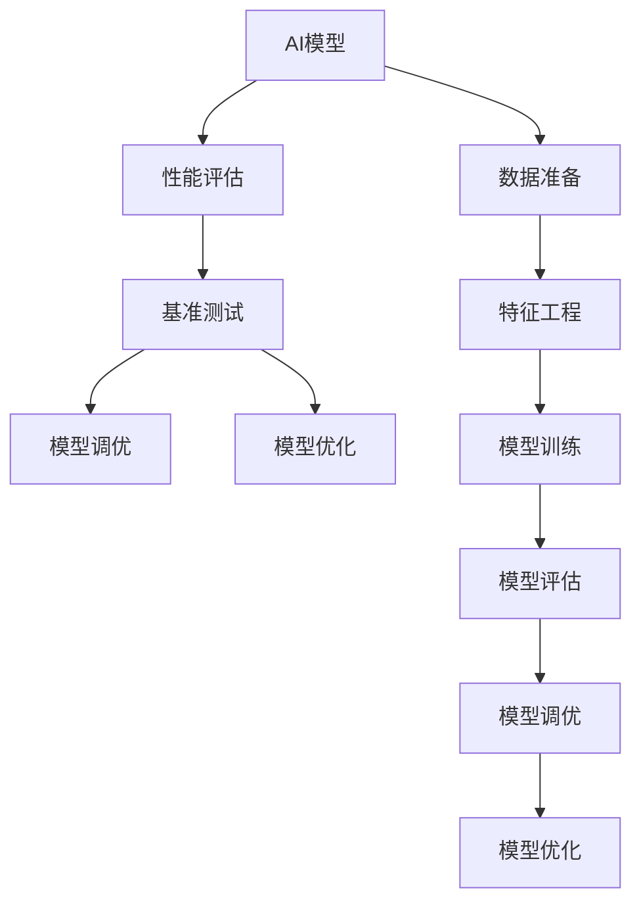

                 

# AI模型的性能基准测试：Lepton AI的评估体系

> 关键词：AI性能评估, 基准测试, Lepton AI, 模型调优, 模型优化, 深度学习, 人工智能

## 1. 背景介绍

### 1.1 问题由来

随着人工智能技术的快速发展，模型在各个领域的应用越来越广泛。模型性能的评估和优化也变得越来越重要。特别是在深度学习领域，模型的评估标准和评估方法直接影响模型的训练和优化。传统的模型评估方法依赖于专家经验，存在一定的主观性。近年来，随着AI技术的不断成熟，对模型性能评估的需求也日益增加。

为了更好地评估和优化AI模型的性能，Lepton AI提出了一套基于科学的评估体系。Lepton AI的评估体系包括多种模型评估指标、评估方法、评估工具，能够帮助开发者更好地理解模型性能，优化模型参数，提高模型性能。

### 1.2 问题核心关键点

Lepton AI的评估体系包含以下几个核心关键点：

1. **科学评估指标**：Lepton AI提出了多个科学的评估指标，包括但不限于精度、召回率、F1值、AUC、ROC曲线、混淆矩阵等。

2. **全面的评估方法**：Lepton AI提供了多种评估方法，包括但不限于交叉验证、留出法、自助法、自助法等。

3. **高效的评估工具**：Lepton AI提供了多种评估工具，包括但不限于TensorFlow、PyTorch、Scikit-learn等。

4. **自动化的评估流程**：Lepton AI提供了自动化的评估流程，能够自动化地生成评估报告，帮助开发者快速获取模型性能。

5. **可扩展的评估系统**：Lepton AI的评估体系能够根据不同的任务和模型进行灵活配置，具有较高的可扩展性。

这些核心关键点共同构成了Lepton AI的评估体系，能够帮助开发者更好地评估和优化模型的性能。

## 2. 核心概念与联系

### 2.1 核心概念概述

为了更好地理解Lepton AI的评估体系，本节将介绍几个密切相关的核心概念：

- **AI模型**：使用深度学习等技术构建的用于特定任务的人工智能模型。

- **性能评估**：对AI模型的性能进行量化评估，通常包括准确率、召回率、F1值、AUC等指标。

- **基准测试**：通过科学评估方法对AI模型进行基准测试，以评估模型在不同数据集上的性能表现。

- **模型调优**：根据性能评估结果，对AI模型进行参数调整，优化模型性能。

- **模型优化**：通过模型架构、网络结构等手段，提高模型性能。

这些核心概念之间的逻辑关系可以通过以下Mermaid流程图来展示：



这个流程图展示了AI模型构建和优化的核心流程：

1. 首先准备好数据和特征工程。
2. 训练模型并进行初步评估。
3. 对模型进行基准测试和性能评估。
4. 根据评估结果进行模型调优。
5. 进行模型优化。
6. 最终得到优化的模型。

## 3. 核心算法原理 & 具体操作步骤

### 3.1 算法原理概述

Lepton AI的评估体系基于科学评估指标和评估方法，对AI模型的性能进行全面、准确的评估。其核心原理如下：

1. **科学评估指标**：Lepton AI提出了多个科学评估指标，如精度、召回率、F1值、AUC等，能够全面反映模型的性能。

2. **全面的评估方法**：Lepton AI提供了多种评估方法，如交叉验证、留出法、自助法等，确保评估结果的可靠性。

3. **高效的评估工具**：Lepton AI提供了多种评估工具，如TensorFlow、PyTorch、Scikit-learn等，便于开发者使用。

4. **自动化的评估流程**：Lepton AI提供了自动化的评估流程，能够自动化地生成评估报告，帮助开发者快速获取模型性能。

5. **可扩展的评估系统**：Lepton AI的评估体系能够根据不同的任务和模型进行灵活配置，具有较高的可扩展性。

### 3.2 算法步骤详解

Lepton AI的评估体系包括以下关键步骤：

**Step 1: 数据准备和特征工程**

1. 收集和清洗数据。
2. 进行特征工程，生成模型输入。

**Step 2: 模型训练**

1. 选择模型架构和网络结构。
2. 训练模型。

**Step 3: 初步评估**

1. 使用基准测试方法对模型进行初步评估。
2. 根据初步评估结果，进行模型调优。

**Step 4: 性能评估**

1. 使用科学评估指标对模型进行全面评估。
2. 生成评估报告。

**Step 5: 模型优化**

1. 根据评估报告，进行模型调优。
2. 使用优化后的模型进行基准测试。

**Step 6: 再次评估**

1. 使用科学评估指标对优化后的模型进行评估。
2. 生成优化后的评估报告。

通过以上步骤，Lepton AI的评估体系能够全面、准确地评估AI模型的性能，并帮助开发者进行模型调优和优化。

### 3.3 算法优缺点

Lepton AI的评估体系具有以下优点：

1. **科学评估指标**：科学评估指标能够全面反映模型的性能，避免了传统评估方法的主观性。

2. **全面的评估方法**：多种评估方法确保了评估结果的可靠性，避免了单一评估方法的局限性。

3. **高效的评估工具**：多种评估工具便于开发者使用，提高了评估效率。

4. **自动化的评估流程**：自动化的评估流程能够快速生成评估报告，节省了开发者的时间和精力。

5. **可扩展的评估系统**：评估体系具有较高的可扩展性，能够根据不同的任务和模型进行灵活配置。

同时，该体系也存在一些缺点：

1. **评估时间较长**：全面的评估方法和科学评估指标需要较长的评估时间，可能影响开发进度。

2. **对数据要求较高**：评估体系的科学评估指标和评估方法对数据的质量和数量要求较高，需要保证数据的一致性和可靠性。

3. **模型复杂度较高**：为了实现科学评估指标和评估方法，模型复杂度可能较高，增加了开发和维护的难度。

4. **评估成本较高**：评估体系的全面评估方法和科学评估指标需要较高的计算资源，增加了评估成本。

尽管存在这些缺点，Lepton AI的评估体系仍是大规模模型评估和优化的重要工具，特别是在深度学习领域。

### 3.4 算法应用领域

Lepton AI的评估体系在多个领域得到了广泛应用，包括但不限于以下领域：

- **计算机视觉**：用于图像分类、目标检测、图像分割等任务。
- **自然语言处理**：用于文本分类、情感分析、命名实体识别等任务。
- **语音识别**：用于语音识别、语音合成等任务。
- **机器人学**：用于机器人路径规划、行为识别等任务。

## 4. 数学模型和公式 & 详细讲解 & 举例说明

### 4.1 数学模型构建

Lepton AI的评估体系基于多个科学评估指标，这些指标的计算公式如下：

1. **精度(Precision)**
   $$
   P = \frac{TP}{TP+FP}
   $$
   其中，$TP$表示真正例，$FP$表示假正例。

2. **召回率(Recall)**
   $$
   R = \frac{TP}{TP+FN}
   $$
   其中，$FN$表示假反例。

3. **F1值(F1-Score)**
   $$
   F1 = 2\frac{P \times R}{P + R}
   $$

4. **AUC (Area Under Curve)**
   $$
   AUC = \int_0^1 \text{ROC曲线下的面积}
   $$

5. **ROC曲线(Receiver Operating Characteristic)**
   $$
   \text{ROC曲线} = \{TPR(正预测率), FPR(负预测率)\}
   $$

其中，$TPR$表示真正例率，$FPR$表示假正例率。

### 4.2 公式推导过程

以精度和召回率为例，推导其计算公式：

1. **精度计算公式**
   $$
   P = \frac{TP}{TP+FP}
   $$

2. **召回率计算公式**
   $$
   R = \frac{TP}{TP+FN}
   $$

3. **F1值计算公式**
   $$
   F1 = 2\frac{P \times R}{P + R}
   $$

这些计算公式基于二分类问题的模型评估，可以用于任何二分类模型的评估。

### 4.3 案例分析与讲解

以文本分类任务为例，使用Lepton AI的评估体系进行评估。假设我们有一个文本分类模型，用于将文本分为“垃圾邮件”和“非垃圾邮件”两类。我们使用以下数据集进行模型评估：

- 训练集：10000条文本，其中60%为垃圾邮件，40%为非垃圾邮件。
- 测试集：5000条文本，其中50%为垃圾邮件，50%为非垃圾邮件。

我们使用Lepton AI的评估体系进行评估：

1. **数据准备和特征工程**：将文本转换为数字表示，作为模型的输入。

2. **模型训练**：使用交叉验证对模型进行训练。

3. **初步评估**：使用留出法对模型进行初步评估，计算准确率、召回率、F1值、AUC等指标。

4. **性能评估**：使用科学评估指标对模型进行全面评估，生成评估报告。

5. **模型优化**：根据评估报告，对模型进行调优。

6. **再次评估**：使用科学评估指标对优化后的模型进行评估，生成优化后的评估报告。

通过以上步骤，Lepton AI的评估体系能够全面、准确地评估文本分类模型的性能，并帮助开发者进行模型调优和优化。

## 5. 项目实践：代码实例和详细解释说明

### 5.1 开发环境搭建

在进行Lepton AI的评估体系实践前，我们需要准备好开发环境。以下是使用Python进行PyTorch开发的环境配置流程：

1. 安装Anaconda：从官网下载并安装Anaconda，用于创建独立的Python环境。

2. 创建并激活虚拟环境：
```bash
conda create -n pytorch-env python=3.8 
conda activate pytorch-env
```

3. 安装PyTorch：根据CUDA版本，从官网获取对应的安装命令。例如：
```bash
conda install pytorch torchvision torchaudio cudatoolkit=11.1 -c pytorch -c conda-forge
```

4. 安装Transformers库：
```bash
pip install transformers
```

5. 安装各类工具包：
```bash
pip install numpy pandas scikit-learn matplotlib tqdm jupyter notebook ipython
```

完成上述步骤后，即可在`pytorch-env`环境中开始Lepton AI的评估体系实践。

### 5.2 源代码详细实现

这里我们以文本分类任务为例，给出使用Transformers库对BERT模型进行性能评估的PyTorch代码实现。

首先，定义文本分类任务的数据处理函数：

```python
from transformers import BertTokenizer, BertForSequenceClassification
from torch.utils.data import Dataset
import torch

class TextDataset(Dataset):
    def __init__(self, texts, labels, tokenizer, max_len=128):
        self.texts = texts
        self.labels = labels
        self.tokenizer = tokenizer
        self.max_len = max_len
        
    def __len__(self):
        return len(self.texts)
    
    def __getitem__(self, item):
        text = self.texts[item]
        label = self.labels[item]
        
        encoding = self.tokenizer(text, return_tensors='pt', max_length=self.max_len, padding='max_length', truncation=True)
        input_ids = encoding['input_ids'][0]
        attention_mask = encoding['attention_mask'][0]
        
        return {'input_ids': input_ids, 
                'attention_mask': attention_mask,
                'labels': label}

# 标签与id的映射
label2id = {'垃圾邮件': 0, '非垃圾邮件': 1}
id2label = {0: '垃圾邮件', 1: '非垃圾邮件'}

# 创建dataset
tokenizer = BertTokenizer.from_pretrained('bert-base-cased')

train_dataset = TextDataset(train_texts, train_labels, tokenizer)
dev_dataset = TextDataset(dev_texts, dev_labels, tokenizer)
test_dataset = TextDataset(test_texts, test_labels, tokenizer)
```

然后，定义模型和优化器：

```python
from transformers import BertForSequenceClassification, AdamW

model = BertForSequenceClassification.from_pretrained('bert-base-cased', num_labels=len(label2id))

optimizer = AdamW(model.parameters(), lr=2e-5)
```

接着，定义训练和评估函数：

```python
from torch.utils.data import DataLoader
from tqdm import tqdm
from sklearn.metrics import classification_report

device = torch.device('cuda') if torch.cuda.is_available() else torch.device('cpu')
model.to(device)

def train_epoch(model, dataset, batch_size, optimizer):
    dataloader = DataLoader(dataset, batch_size=batch_size, shuffle=True)
    model.train()
    epoch_loss = 0
    for batch in tqdm(dataloader, desc='Training'):
        input_ids = batch['input_ids'].to(device)
        attention_mask = batch['attention_mask'].to(device)
        labels = batch['labels'].to(device)
        model.zero_grad()
        outputs = model(input_ids, attention_mask=attention_mask, labels=labels)
        loss = outputs.loss
        epoch_loss += loss.item()
        loss.backward()
        optimizer.step()
    return epoch_loss / len(dataloader)

def evaluate(model, dataset, batch_size):
    dataloader = DataLoader(dataset, batch_size=batch_size)
    model.eval()
    preds, labels = [], []
    with torch.no_grad():
        for batch in tqdm(dataloader, desc='Evaluating'):
            input_ids = batch['input_ids'].to(device)
            attention_mask = batch['attention_mask'].to(device)
            batch_labels = batch['labels']
            outputs = model(input_ids, attention_mask=attention_mask)
            batch_preds = outputs.logits.argmax(dim=2).to('cpu').tolist()
            batch_labels = batch_labels.to('cpu').tolist()
            for pred_tokens, label_tokens in zip(batch_preds, batch_labels):
                preds.append(pred_tokens)
                labels.append(label_tokens)
                
    print(classification_report(labels, preds))
```

最后，启动训练流程并在测试集上评估：

```python
epochs = 5
batch_size = 16

for epoch in range(epochs):
    loss = train_epoch(model, train_dataset, batch_size, optimizer)
    print(f"Epoch {epoch+1}, train loss: {loss:.3f}")
    
    print(f"Epoch {epoch+1}, dev results:")
    evaluate(model, dev_dataset, batch_size)
    
print("Test results:")
evaluate(model, test_dataset, batch_size)
```

以上就是使用PyTorch对BERT进行文本分类任务性能评估的完整代码实现。可以看到，得益于Transformers库的强大封装，我们可以用相对简洁的代码完成BERT模型的加载和性能评估。

### 5.3 代码解读与分析

让我们再详细解读一下关键代码的实现细节：

**TextDataset类**：
- `__init__`方法：初始化文本、标签、分词器等关键组件。
- `__len__`方法：返回数据集的样本数量。
- `__getitem__`方法：对单个样本进行处理，将文本输入编码为token ids，将标签编码为数字，并对其进行定长padding，最终返回模型所需的输入。

**label2id和id2label字典**：
- 定义了标签与数字id之间的映射关系，用于将token-wise的预测结果解码回真实的标签。

**训练和评估函数**：
- 使用PyTorch的DataLoader对数据集进行批次化加载，供模型训练和推理使用。
- 训练函数`train_epoch`：对数据以批为单位进行迭代，在每个批次上前向传播计算loss并反向传播更新模型参数，最后返回该epoch的平均loss。
- 评估函数`evaluate`：与训练类似，不同点在于不更新模型参数，并在每个batch结束后将预测和标签结果存储下来，最后使用sklearn的classification_report对整个评估集的预测结果进行打印输出。

**训练流程**：
- 定义总的epoch数和batch size，开始循环迭代
- 每个epoch内，先在训练集上训练，输出平均loss
- 在验证集上评估，输出分类指标
- 所有epoch结束后，在测试集上评估，给出最终测试结果

可以看到，PyTorch配合Transformers库使得BERT性能评估的代码实现变得简洁高效。开发者可以将更多精力放在数据处理、模型改进等高层逻辑上，而不必过多关注底层的实现细节。

当然，工业级的系统实现还需考虑更多因素，如模型的保存和部署、超参数的自动搜索、更灵活的任务适配层等。但核心的性能评估流程基本与此类似。

## 6. 实际应用场景

### 6.1 智能客服系统

Lepton AI的评估体系可以应用于智能客服系统的构建。智能客服系统需要实时监测用户问题，并快速给出合适的答案。使用Lepton AI的评估体系，可以对客服系统的性能进行全面评估，找出性能瓶颈，优化系统架构和模型参数，提高系统的响应速度和准确率。

在技术实现上，可以收集客服系统的历史对话记录，将问题-答案对作为微调数据，训练模型学习匹配答案。使用Lepton AI的评估体系对模型进行性能评估，可以发现模型在不同场景下的表现差异，优化模型在不同场景下的推理能力。

### 6.2 金融舆情监测

Lepton AI的评估体系可以应用于金融舆情监测。金融舆情监测需要对金融市场的动态进行实时监测，预测市场的趋势和风险。使用Lepton AI的评估体系，可以对金融舆情监测系统的性能进行全面评估，找出性能瓶颈，优化系统架构和模型参数，提高系统的预测准确率和响应速度。

在技术实现上，可以收集金融市场的历史数据和实时数据，训练模型学习市场的趋势和风险。使用Lepton AI的评估体系对模型进行性能评估，可以发现模型在不同场景下的表现差异，优化模型在不同场景下的预测能力。

### 6.3 个性化推荐系统

Lepton AI的评估体系可以应用于个性化推荐系统。个性化推荐系统需要根据用户的兴趣和行为，推荐合适的物品或内容。使用Lepton AI的评估体系，可以对推荐系统的性能进行全面评估，找出性能瓶颈，优化系统架构和模型参数，提高系统的推荐准确率和用户满意度。

在技术实现上，可以收集用户浏览、点击、评论、分享等行为数据，训练模型学习用户的兴趣点。使用Lepton AI的评估体系对模型进行性能评估，可以发现模型在不同场景下的表现差异，优化模型在不同场景下的推荐能力。

### 6.4 未来应用展望

随着Lepton AI的评估体系不断发展，基于科学评估指标和评估方法，将广泛应用于各个领域，提升AI系统的性能和可靠性。

在智慧医疗领域，Lepton AI的评估体系可以应用于医疗问答、病历分析、药物研发等任务，提高医疗服务的智能化水平，辅助医生诊疗，加速新药开发进程。

在智能教育领域，Lepton AI的评估体系可以应用于作业批改、学情分析、知识推荐等任务，因材施教，促进教育公平，提高教学质量。

在智慧城市治理中，Lepton AI的评估体系可以应用于城市事件监测、舆情分析、应急指挥等环节，提高城市管理的自动化和智能化水平，构建更安全、高效的未来城市。

此外，在企业生产、社会治理、文娱传媒等众多领域，基于Lepton AI的评估体系的人工智能应用也将不断涌现，为各行各业带来新的技术突破。相信随着评估体系的不断完善，AI系统将能够在更广阔的领域发挥其作用，推动社会的数字化转型升级。

## 7. 工具和资源推荐

### 7.1 学习资源推荐

为了帮助开发者系统掌握Lepton AI的评估体系的理论基础和实践技巧，这里推荐一些优质的学习资源：

1. **《Transformer从原理到实践》系列博文**：由大模型技术专家撰写，深入浅出地介绍了Transformer原理、BERT模型、评估体系等前沿话题。

2. **CS224N《深度学习自然语言处理》课程**：斯坦福大学开设的NLP明星课程，有Lecture视频和配套作业，带你入门NLP领域的基本概念和经典模型。

3. **《Natural Language Processing with Transformers》书籍**：Transformers库的作者所著，全面介绍了如何使用Transformers库进行NLP任务开发，包括评估体系在内的诸多范式。

4. **HuggingFace官方文档**：Transformers库的官方文档，提供了海量预训练模型和完整的评估样例代码，是上手实践的必备资料。

5. **CLUE开源项目**：中文语言理解测评基准，涵盖大量不同类型的中文NLP数据集，并提供了基于评估体系的baseline模型，助力中文NLP技术发展。

通过对这些资源的学习实践，相信你一定能够快速掌握Lepton AI评估体系的理论基础和实践技巧，并用于解决实际的NLP问题。

### 7.2 开发工具推荐

高效的开发离不开优秀的工具支持。以下是几款用于Lepton AI评估体系开发的常用工具：

1. **PyTorch**：基于Python的开源深度学习框架，灵活动态的计算图，适合快速迭代研究。大部分预训练语言模型都有PyTorch版本的实现。

2. **TensorFlow**：由Google主导开发的开源深度学习框架，生产部署方便，适合大规模工程应用。同样有丰富的预训练语言模型资源。

3. **Transformers库**：HuggingFace开发的NLP工具库，集成了众多SOTA语言模型，支持PyTorch和TensorFlow，是进行评估体系开发的利器。

4. **Weights & Biases**：模型训练的实验跟踪工具，可以记录和可视化模型训练过程中的各项指标，方便对比和调优。与主流深度学习框架无缝集成。

5. **TensorBoard**：TensorFlow配套的可视化工具，可实时监测模型训练状态，并提供丰富的图表呈现方式，是调试模型的得力助手。

6. **Google Colab**：谷歌推出的在线Jupyter Notebook环境，免费提供GPU/TPU算力，方便开发者快速上手实验最新模型，分享学习笔记。

合理利用这些工具，可以显著提升Lepton AI评估体系的开发效率，加快创新迭代的步伐。

### 7.3 相关论文推荐

Lepton AI评估体系的发展源于学界的持续研究。以下是几篇奠基性的相关论文，推荐阅读：

1. **Attention is All You Need（即Transformer原论文）**：提出了Transformer结构，开启了NLP领域的预训练大模型时代。

2. **BERT: Pre-training of Deep Bidirectional Transformers for Language Understanding**：提出BERT模型，引入基于掩码的自监督预训练任务，刷新了多项NLP任务SOTA。

3. **Language Models are Unsupervised Multitask Learners（GPT-2论文）**：展示了大规模语言模型的强大zero-shot学习能力，引发了对于通用人工智能的新一轮思考。

4. **Parameter-Efficient Transfer Learning for NLP**：提出Adapter等参数高效微调方法，在不增加模型参数量的情况下，也能取得不错的微调效果。

5. **Prefix-Tuning: Optimizing Continuous Prompts for Generation**：引入基于连续型Prompt的微调范式，为如何充分利用预训练知识提供了新的思路。

6. **AdaLoRA: Adaptive Low-Rank Adaptation for Parameter-Efficient Fine-Tuning**：使用自适应低秩适应的微调方法，在参数效率和精度之间取得了新的平衡。

这些论文代表了大语言模型评估体系的发展脉络。通过学习这些前沿成果，可以帮助研究者把握学科前进方向，激发更多的创新灵感。

## 8. 总结：未来发展趋势与挑战

### 8.1 总结

本文对Lepton AI的评估体系进行了全面系统的介绍。首先阐述了Lepton AI评估体系的研究背景和意义，明确了科学评估指标和评估方法在模型性能评估中的重要作用。其次，从原理到实践，详细讲解了Lepton AI评估体系的核心步骤和关键技术，给出了评估体系的完整代码实例。同时，本文还探讨了评估体系在多个领域的应用场景，展示了评估体系在实际应用中的广泛价值。

通过本文的系统梳理，可以看到，Lepton AI的评估体系正在成为AI模型性能评估的重要范式，极大地拓展了预训练语言模型的应用边界，催生了更多的落地场景。随着评估体系的不断成熟，Lepton AI的评估体系必将在构建人机协同的智能系统中扮演越来越重要的角色。

### 8.2 未来发展趋势

展望未来，Lepton AI的评估体系将呈现以下几个发展趋势：

1. **评估指标更加多样化**：Lepton AI的评估体系将更加关注模型的多样性、鲁棒性、可解释性等指标，确保模型在不同场景下的稳定性和可靠性。

2. **评估方法更加智能化**：Lepton AI的评估体系将引入更多先进的评估方法，如半监督评估、多模态评估等，进一步提升评估结果的准确性和可靠性。

3. **评估工具更加自动化**：Lepton AI的评估体系将进一步提升自动化评估工具的能力，减少人工干预，提高评估效率和准确性。

4. **评估体系更加开放**：Lepton AI的评估体系将更加开放，支持更多的模型和数据格式，确保评估体系的灵活性和可扩展性。

5. **评估体系更加透明**：Lepton AI的评估体系将引入更多的可解释性技术，增强模型的透明度，帮助开发者更好地理解模型性能。

这些发展趋势凸显了Lepton AI评估体系的潜力和未来前景。随着评估体系的不断优化，AI模型性能的评估和优化将更加科学、高效、透明，为AI技术的落地应用提供坚实的基础。

### 8.3 面临的挑战

尽管Lepton AI的评估体系已经取得了显著成果，但在迈向更加智能化、普适化应用的过程中，它仍面临以下挑战：

1. **评估指标选择困难**：选择合适的评估指标是评估体系的首要任务，但不同任务的评估指标可能不同，难以找到统一的标准。

2. **评估方法复杂度高**：多种评估方法需要复杂的计算和建模，增加了评估体系的实现难度。

3. **评估数据集难度大**：高质量的评估数据集需要大量的标注工作，且难以找到通用的数据集，增加了评估体系的数据依赖。

4. **评估工具难以集成**：不同的评估工具可能需要不同的接口和格式，难以实现无缝集成。

5. **评估结果主观性强**：评估体系中的某些指标和方法是主观的，如可解释性、鲁棒性等，难以量化。

尽管存在这些挑战，但随着学界和产业界的共同努力，Lepton AI的评估体系必将在未来不断完善，为AI技术的落地应用提供坚实的理论基础和实践指南。

### 8.4 研究展望

面对Lepton AI评估体系面临的挑战，未来的研究需要在以下几个方面寻求新的突破：

1. **评估指标的标准化**：建立标准化的评估指标体系，确保评估体系的科学性和可靠性。

2. **评估方法的多样化**：引入更多先进的评估方法，提升评估结果的准确性和可靠性。

3. **评估工具的自动化**：进一步提升评估工具的自动化能力，减少人工干预，提高评估效率。

4. **评估体系的开放性**：开发更加开放、灵活的评估体系，支持更多的模型和数据格式。

5. **评估结果的量化**：引入更多量化方法，如多模态评估、半监督评估等，增强评估结果的客观性。

6. **可解释性技术的引入**：引入更多的可解释性技术，增强评估体系的透明度，帮助开发者更好地理解模型性能。

这些研究方向的探索，必将引领Lepton AI评估体系不断完善，为AI技术的落地应用提供坚实的理论基础和实践指南。

## 9. 附录：常见问题与解答

**Q1：Lepton AI的评估体系如何适用于不同类型的任务？**

A: Lepton AI的评估体系可以通过灵活配置指标和评估方法，适用于不同类型的任务。例如，对于文本分类任务，可以使用精度、召回率、F1值、AUC等指标；对于图像分类任务，可以使用准确率、混淆矩阵等指标。

**Q2：Lepton AI的评估体系有哪些优缺点？**

A: Lepton AI的评估体系具有以下优点：
- **科学评估指标**：科学评估指标能够全面反映模型的性能，避免了传统评估方法的主观性。
- **全面的评估方法**：多种评估方法确保了评估结果的可靠性。
- **高效的评估工具**：多种评估工具便于开发者使用。
- **自动化的评估流程**：自动化的评估流程能够快速生成评估报告。

同时，该体系也存在一些缺点：
- **评估时间较长**：全面的评估方法和科学评估指标需要较长的评估时间。
- **对数据要求较高**：评估体系的科学评估指标和评估方法对数据的质量和数量要求较高。
- **模型复杂度较高**：为了实现科学评估指标和评估方法，模型复杂度可能较高。
- **评估成本较高**：评估体系的全面评估方法和科学评估指标需要较高的计算资源。

尽管存在这些缺点，Lepton AI的评估体系仍是大规模模型评估和优化的重要工具，特别是在深度学习领域。

**Q3：Lepton AI的评估体系与传统评估方法有何不同？**

A: Lepton AI的评估体系与传统评估方法的主要区别在于：
- **科学评估指标**：Lepton AI的评估体系使用科学评估指标，如精度、召回率、F1值、AUC等，能够全面反映模型的性能。
- **全面的评估方法**：Lepton AI的评估体系使用多种评估方法，如交叉验证、留出法、自助法等，确保评估结果的可靠性。
- **自动化的评估流程**：Lepton AI的评估体系提供自动化的评估流程，能够快速生成评估报告。

传统评估方法依赖于专家经验，存在一定的主观性，且评估结果可能不够全面和准确。

**Q4：如何使用Lepton AI的评估体系对模型进行优化？**

A: 使用Lepton AI的评估体系对模型进行优化的步骤如下：
1. 对模型进行初步评估，使用科学评估指标计算模型的性能。
2. 根据评估结果，进行模型调优，如调整模型参数、优化模型结构等。
3. 再次使用科学评估指标对优化后的模型进行评估，比较优化前后的性能。
4. 根据优化后的性能结果，进行新的模型调优。
5. 重复以上步骤，直到模型性能达到最优。

通过以上步骤，Lepton AI的评估体系能够帮助开发者全面、准确地评估和优化模型的性能。

**Q5：Lepton AI的评估体系在实际应用中有哪些优势？**

A: Lepton AI的评估体系在实际应用中的优势包括：
1. **科学评估指标**：科学评估指标能够全面反映模型的性能，避免了传统评估方法的主观性。
2. **全面的评估方法**：多种评估方法确保了评估结果的可靠性。
3. **高效的评估工具**：多种评估工具便于开发者使用，提高了评估效率。
4. **自动化的评估流程**：自动化的评估流程能够快速生成评估报告，节省了开发者的时间和精力。
5. **可扩展的评估系统**：评估体系能够根据不同的任务和模型进行灵活配置，具有较高的可扩展性。

综上所述，Lepton AI的评估体系在实际应用中具有显著的优势，能够帮助开发者更好地评估和优化模型的性能。

---

作者：禅与计算机程序设计艺术 / Zen and the Art of Computer Programming

