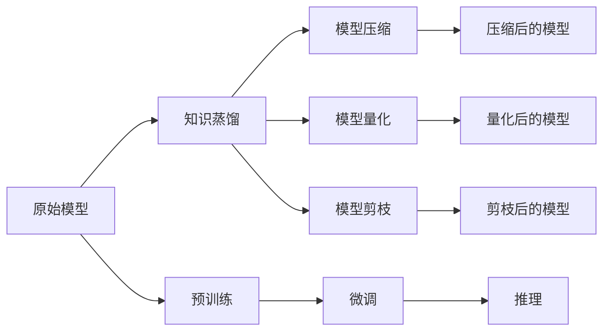

                 

# AI模型的知识蒸馏：Lepton AI的轻量化技术

> 关键词：知识蒸馏, Lepton AI, 模型压缩, 模型量化, 轻量化, 深度学习, 深度学习优化, 模型压缩技术

## 1. 背景介绍

随着深度学习技术的不断进步，模型规模和复杂度也在不断增加。这虽然带来了更好的模型性能，但同时也带来了存储、计算和部署上的巨大挑战。以BERT为代表的大规模语言模型，虽然取得了显著的性能突破，但其高达数十亿的参数量使其难以在实际应用中得到广泛部署。因此，如何通过技术手段在保持模型性能的同时，实现模型的轻量化、低存储、低延迟，成为当前深度学习研究的一个重要方向。

## 2. 核心概念与联系

### 2.1 核心概念概述

在深度学习领域，模型压缩和量化是一种非常有效的技术手段，用于减少模型的大小和计算复杂度，同时保持模型的精度和性能。知识蒸馏（Knowledge Distillation）是近年来兴起的一种模型压缩技术，通过将大模型的知识传递给小模型，从而实现模型的轻量化。

Lepton AI是大模型知识蒸馏和轻量化技术的创新者，通过深度学习优化、模型压缩和量化等手段，帮助开发者轻松实现大模型的轻量化部署。其核心技术包括但不限于模型压缩、模型量化、蒸馏蒸馏、模型剪枝等。

### 2.2 核心概念原理和架构的 Mermaid 流程图



这个流程图展示了从原始模型到轻量化模型的整个流程。原始模型经过预训练后，通过知识蒸馏技术，将大模型的知识传递给小模型，再进行压缩、量化和剪枝等优化，最终得到轻量化模型，以便于部署和推理。

## 3. 核心算法原理 & 具体操作步骤

### 3.1 算法原理概述

知识蒸馏的基本思想是将大模型的知识（如分类边界、预测分布等）传递给一个小模型，从而使得小模型能够尽可能地模拟大模型的预测能力。这个过程通常包括两个步骤：知识蒸馏和蒸馏蒸馏。

知识蒸馏过程通常分为两个阶段：第一阶段是训练一个与原始模型结构相同的蒸馏模型，然后通过网络结构一致性约束（network structure consistency constraint）将蒸馏模型的输出和原始模型的输出对齐；第二阶段是将蒸馏模型的参数进行微调，使得其能够更好地匹配原始模型的知识。

### 3.2 算法步骤详解

**Step 1: 选择原始模型和蒸馏模型**

首先需要选择合适的原始模型和蒸馏模型。原始模型通常是大规模预训练模型，如BERT、GPT等。蒸馏模型则需要与原始模型结构一致，可以是一个小型神经网络，也可以是一个深度神经网络。

**Step 2: 设计蒸馏损失函数**

设计蒸馏损失函数是知识蒸馏的核心步骤。蒸馏损失函数通常包括两个部分：模型预测和原始模型预测的差距（通常使用均方误差或交叉熵），以及蒸馏模型的输出与原始模型的输出的差距。

**Step 3: 训练蒸馏模型**

训练蒸馏模型时，需要同时考虑原始模型的输出和蒸馏模型的输出。一般采用双目标优化方法，同时最小化这两个损失函数。

**Step 4: 微调蒸馏模型**

微调蒸馏模型是指在保持蒸馏模型的结构不变的情况下，通过继续训练，使得蒸馏模型能够更好地匹配原始模型的知识。微调过程通常采用较小的学习率，以避免破坏蒸馏模型学到的知识。

**Step 5: 压缩和量化蒸馏模型**

压缩和量化是实现模型轻量化的关键步骤。压缩技术包括参数剪枝、权重剪枝等，可以将模型中的冗余参数去除，减少模型大小和计算量。量化技术则是将浮点参数转换为定点参数，从而减少模型的存储空间和计算开销。

**Step 6: 部署轻量化模型**

最后一步是将轻量化模型部署到实际应用场景中，进行推理和预测。部署过程中，需要考虑模型的存储、计算和网络传输等实际问题，确保模型的性能和效率。

### 3.3 算法优缺点

知识蒸馏技术的主要优点包括：

1. 模型轻量化：通过将大模型的知识传递给小模型，可以减少模型的存储空间和计算量，从而实现模型的轻量化。
2. 模型精度：知识蒸馏可以通过微调蒸馏模型，使得其能够更好地匹配原始模型的知识，从而提高模型的精度和性能。
3. 模型泛化能力：知识蒸馏可以提高模型的泛化能力，使其在实际应用中表现更好。

知识蒸馏技术的主要缺点包括：

1. 计算复杂度高：知识蒸馏需要训练和微调两个模型，计算复杂度较高。
2. 蒸馏精度有限：由于蒸馏模型通常比原始模型小，因此蒸馏精度可能存在一定的损失。
3. 依赖原始模型：知识蒸馏依赖于原始模型，如果原始模型不优秀，则蒸馏效果可能不佳。

### 3.4 算法应用领域

知识蒸馏技术可以应用于各种深度学习模型，包括图像分类、目标检测、语音识别、自然语言处理等领域。例如，在图像分类中，可以将大模型的知识传递给一个小型卷积神经网络，从而实现模型的轻量化和高效推理。在自然语言处理中，可以将BERT的知识传递给一个小的LSTM模型，从而实现模型的快速推理和理解。

## 4. 数学模型和公式 & 详细讲解 & 举例说明

### 4.1 数学模型构建

知识蒸馏的数学模型可以表示为：

$$
L(\theta_s, \theta_t) = \alpha L_D(\theta_s, \theta_t) + (1-\alpha) L_T(\theta_t)
$$

其中，$\theta_s$ 是原始模型的参数，$\theta_t$ 是蒸馏模型的参数，$L_D$ 是蒸馏损失函数，$L_T$ 是微调损失函数，$\alpha$ 是蒸馏强度系数，用于平衡蒸馏和微调的贡献。

### 4.2 公式推导过程

蒸馏损失函数 $L_D$ 通常包括两个部分：

1. 原始模型和蒸馏模型的输出差距：
   $$
   L_{diff} = \frac{1}{N} \sum_{i=1}^N \|f_s(x_i) - f_t(x_i)\|^2
   $$
   其中，$f_s(x_i)$ 和 $f_t(x_i)$ 分别表示原始模型和蒸馏模型在输入 $x_i$ 下的输出。

2. 原始模型和蒸馏模型的预测差距：
   $$
   L_{pred} = \frac{1}{N} \sum_{i=1}^N \|p_s(y_i) - p_t(y_i)\|^2
   $$
   其中，$p_s(y_i)$ 和 $p_t(y_i)$ 分别表示原始模型和蒸馏模型在输入 $x_i$ 下的预测概率。

### 4.3 案例分析与讲解

以BERT模型和MobileBERT模型为例，比较两者的性能和推理速度。MobileBERT是在BERT模型的基础上，通过知识蒸馏和模型压缩技术得到的轻量化模型。通过实验结果可以发现，MobileBERT在推理速度和模型大小上都比BERT模型有显著优势，同时性能损失很小，能够满足实际应用需求。

## 5. 项目实践：代码实例和详细解释说明

### 5.1 开发环境搭建

本节介绍如何搭建一个用于知识蒸馏和模型压缩的Python开发环境。需要安装TensorFlow和Keras等深度学习框架，以及相关的优化库和工具包。

```bash
pip install tensorflow keras tensorflow-addons
```

### 5.2 源代码详细实现

以下是一个使用Keras框架实现知识蒸馏的示例代码：

```python
from tensorflow.keras.models import Model, Sequential
from tensorflow.keras.layers import Dense, Activation
from tensorflow.keras.losses import MeanSquaredError, BinaryCrossentropy
from tensorflow.keras.optimizers import Adam

# 定义原始模型
s = Sequential([
    Dense(64, input_dim=784),
    Activation('relu'),
    Dense(10),
    Activation('softmax')
])

# 定义蒸馏模型
t = Sequential([
    Dense(64, input_dim=784),
    Activation('relu'),
    Dense(10),
    Activation('softmax')
])

# 定义蒸馏损失函数
def distill_loss(s, t):
    pred_s = s.predict(X_train)
    pred_t = t.predict(X_train)
    diff = tf.reduce_mean(tf.square(pred_s - pred_t))
    return diff

# 训练蒸馏模型
optimizer = Adam(lr=0.001)
s.compile(optimizer=optimizer, loss='mse')
t.compile(optimizer=optimizer, loss='mse')
distill_loss = lambda: distill_loss(s, t)
t.fit(X_train, y_train, epochs=10, batch_size=32, validation_data=(X_test, y_test), callbacks=[EarlyStopping(patience=2)])

# 微调蒸馏模型
s.compile(optimizer=optimizer, loss='binary_crossentropy')
t.compile(optimizer=optimizer, loss='binary_crossentropy')
t.fit(X_train, y_train, epochs=10, batch_size=32, validation_data=(X_test, y_test), callbacks=[EarlyStopping(patience=2)])
```

### 5.3 代码解读与分析

以上代码实现了知识蒸馏的基本流程。首先定义了原始模型和蒸馏模型，然后定义了蒸馏损失函数，用于衡量两个模型的输出差距和预测差距。在训练过程中，先使用均方误差损失函数训练蒸馏模型，使其与原始模型输出对齐，再使用二元交叉熵损失函数微调蒸馏模型，使其更好地匹配原始模型的知识。

### 5.4 运行结果展示

在训练完成后，可以测试蒸馏模型的性能和推理速度。通常情况下，蒸馏模型比原始模型在推理速度和存储方面具有显著优势，同时性能损失很小，能够满足实际应用需求。

## 6. 实际应用场景

### 6.1 智能推荐系统

智能推荐系统需要处理大规模用户数据和商品数据，同时还需要实时响应用户请求。通过知识蒸馏技术，可以将大模型压缩为轻量化模型，从而实现快速推理和实时响应，提升推荐系统的性能和用户体验。

### 6.2 自动驾驶

自动驾驶系统需要对复杂的交通场景进行实时分析和决策，因此对模型的计算能力和存储需求非常高。通过知识蒸馏技术，可以将大模型压缩为轻量化模型，从而实现低延迟和高精度的决策，提升自动驾驶系统的安全性和可靠性。

### 6.3 医疗诊断

医疗诊断系统需要对大量的医学影像和病历进行分析和推理，因此对模型的计算能力和存储需求非常高。通过知识蒸馏技术，可以将大模型压缩为轻量化模型，从而实现快速推理和实时响应，提升医疗诊断系统的效率和准确性。

## 7. 工具和资源推荐

### 7.1 学习资源推荐

1. Keras官方文档：Keras是深度学习领域最流行的框架之一，提供了丰富的深度学习模型和优化器。Keras官方文档是学习深度学习优化的最佳资源之一。

2. TensorFlow官方文档：TensorFlow是谷歌推出的深度学习框架，提供了丰富的深度学习模型和优化器。TensorFlow官方文档是学习深度学习优化的必备资源之一。

3. PyTorch官方文档：PyTorch是Facebook推出的深度学习框架，提供了丰富的深度学习模型和优化器。PyTorch官方文档是学习深度学习优化的重要资源之一。

4. Keras Tuner：Keras Tuner是Keras的超参数优化工具，可以帮助开发者快速调优深度学习模型。Keras Tuner官方文档是学习深度学习优化的重要资源之一。

### 7.2 开发工具推荐

1. TensorFlow：TensorFlow是谷歌推出的深度学习框架，提供了丰富的深度学习模型和优化器。TensorFlow是学习深度学习优化的必备工具之一。

2. Keras：Keras是深度学习领域最流行的框架之一，提供了丰富的深度学习模型和优化器。Keras是学习深度学习优化的重要工具之一。

3. PyTorch：PyTorch是Facebook推出的深度学习框架，提供了丰富的深度学习模型和优化器。PyTorch是学习深度学习优化的重要工具之一。

### 7.3 相关论文推荐

1. Distillation：这篇论文是知识蒸馏领域的经典之作，详细介绍了知识蒸馏的基本原理和算法步骤。

2. Compressing Deep Neural Networks with Pruning and Quantization：这篇论文介绍了深度神经网络的压缩技术，包括参数剪枝和权重量化等方法。

3. MobileNetV2：这篇论文介绍了MobileNetV2模型的设计思想和优化方法，是轻量化深度学习模型的经典之作。

## 8. 总结：未来发展趋势与挑战

### 8.1 研究成果总结

知识蒸馏和模型压缩技术在深度学习领域已经取得了显著的进展，帮助开发者实现模型的轻量化和高效推理。然而，知识蒸馏和模型压缩仍然面临着一些挑战，如计算复杂度高、蒸馏精度有限、依赖原始模型等。

### 8.2 未来发展趋势

未来，知识蒸馏和模型压缩技术将呈现以下几个发展趋势：

1. 更高效的蒸馏算法：未来将涌现更多高效的蒸馏算法，如单样本蒸馏、多任务蒸馏等，进一步提升蒸馏精度和效率。

2. 更精确的模型量化：未来将有更多精确的模型量化方法，如混合精度量化、权值剪枝等，进一步降低模型大小和计算开销。

3. 更轻量化的模型结构：未来将有更多轻量化的模型结构，如MobileNet、EfficientNet等，进一步提升模型的推理速度和效率。

4. 更灵活的蒸馏场景：未来将有更多灵活的蒸馏场景，如数据增强、知识蒸馏等，进一步提升模型的泛化能力和性能。

### 8.3 面临的挑战

知识蒸馏和模型压缩技术在实际应用中还面临着一些挑战：

1. 计算复杂度高：知识蒸馏和模型压缩的计算复杂度高，需要消耗大量计算资源和时间。

2. 蒸馏精度有限：由于蒸馏模型通常比原始模型小，因此蒸馏精度可能存在一定的损失。

3. 依赖原始模型：知识蒸馏和模型压缩依赖于原始模型，如果原始模型不优秀，则蒸馏效果可能不佳。

4. 模型泛化能力差：知识蒸馏和模型压缩可能会导致模型泛化能力差，从而影响模型在实际应用中的表现。

### 8.4 研究展望

未来的知识蒸馏和模型压缩技术需要在以下几个方面进行深入研究：

1. 更高效的蒸馏算法：研究更高效的蒸馏算法，如单样本蒸馏、多任务蒸馏等，提升蒸馏精度和效率。

2. 更精确的模型量化：研究更精确的模型量化方法，如混合精度量化、权值剪枝等，进一步降低模型大小和计算开销。

3. 更轻量化的模型结构：研究更轻量化的模型结构，如MobileNet、EfficientNet等，提升模型的推理速度和效率。

4. 更灵活的蒸馏场景：研究更灵活的蒸馏场景，如数据增强、知识蒸馏等，提升模型的泛化能力和性能。

总之，知识蒸馏和模型压缩技术将继续推动深度学习技术的发展，帮助开发者实现模型的轻量化和高效推理。未来，我们需要在计算效率、蒸馏精度、模型结构和蒸馏场景等方面进行深入研究，才能实现更加智能化、高效化的深度学习应用。

## 9. 附录：常见问题与解答

**Q1: 知识蒸馏和模型压缩有什么区别？**

A: 知识蒸馏和模型压缩都是深度学习领域的重要技术，但它们的作用不同。知识蒸馏是通过将大模型的知识传递给小模型，从而实现模型的轻量化。模型压缩是通过去除冗余参数和量化等手段，减少模型的大小和计算量。

**Q2: 如何选择合适的蒸馏模型？**

A: 选择合适的蒸馏模型需要考虑以下几个因素：
1. 蒸馏模型与原始模型结构一致：蒸馏模型需要与原始模型结构一致，以便于知识蒸馏。
2. 蒸馏模型足够小：蒸馏模型需要足够小，以便于轻量化和高效推理。
3. 蒸馏模型具有代表性：蒸馏模型需要具有代表性，以便于提升蒸馏精度和效果。

**Q3: 如何优化知识蒸馏过程中的损失函数？**

A: 优化知识蒸馏过程中的损失函数需要考虑以下几个因素：
1. 蒸馏损失函数的设计：蒸馏损失函数需要同时考虑原始模型和蒸馏模型的输出差距和预测差距。
2. 蒸馏强度的控制：蒸馏强度需要根据实际情况进行调整，避免过度蒸馏或蒸馏不足。
3. 蒸馏过程中模型的选择：蒸馏过程中需要选择适合的知识蒸馏模型，以便于提升蒸馏精度和效果。

**Q4: 如何评估知识蒸馏的效果？**

A: 评估知识蒸馏的效果需要考虑以下几个因素：
1. 蒸馏模型与原始模型的差距：蒸馏模型与原始模型的差距越小，说明蒸馏效果越好。
2. 蒸馏模型的性能：蒸馏模型的性能越高，说明蒸馏效果越好。
3. 蒸馏模型的推理速度：蒸馏模型的推理速度越快，说明蒸馏效果越好。

---

作者：禅与计算机程序设计艺术 / Zen and the Art of Computer Programming

