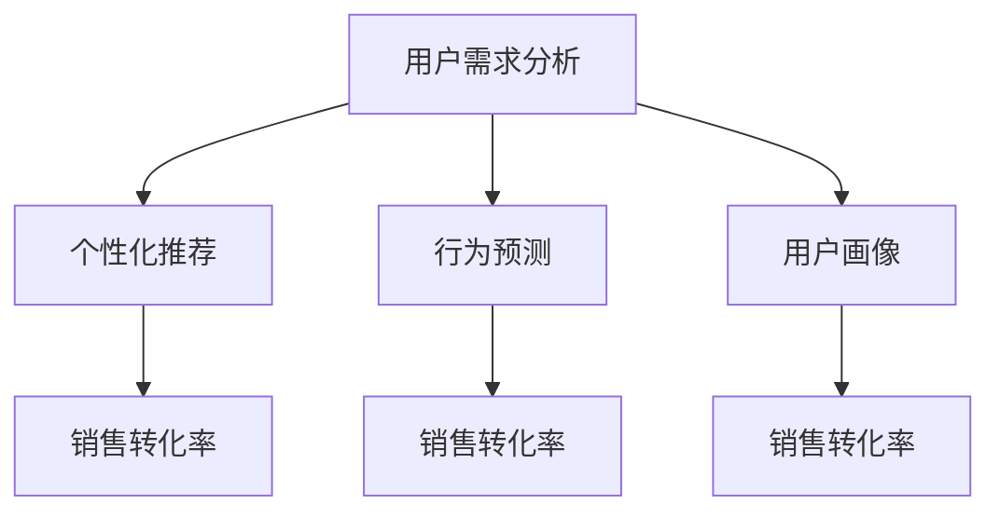

                 

# AI满足用户需求提升销售转化率

> 关键词：人工智能,用户需求,销售转化率,市场分析,个性化推荐,行为预测

## 1. 背景介绍

### 1.1 问题由来
在当前激烈的市场竞争环境中，企业不仅需要具备强大的产品竞争力，还需要精准理解和满足用户需求，从而实现销售转化率的提升。随着技术的发展，人工智能(AI)技术逐渐成为企业优化用户体验、提升销售转化率的重要手段。

AI技术通过深入挖掘用户行为数据，精准分析用户需求，提供个性化的产品推荐和服务，从而在减少用户选择困难的同时，大幅提升购买转化率。特别是在电子商务、在线广告等领域，AI技术已广泛应用于个性化推荐、广告投放、客户细分等场景，极大地提升了市场效率和用户满意度。

### 1.2 问题核心关键点
AI满足用户需求并提升销售转化率的核心关键点包括以下几点：

1. **数据驱动决策**：通过分析用户行为数据，AI可以识别出用户的真实需求，从而制定更加精准的营销策略。

2. **个性化推荐**：根据用户的浏览记录、购买历史、兴趣标签等数据，AI可以实时生成个性化的产品推荐，减少用户的决策难度。

3. **行为预测**：通过分析用户的历史行为，AI可以预测用户的购买意向，提前进行精准营销，提高转化率。

4. **用户画像构建**：AI可以构建详细的用户画像，帮助企业深入了解不同用户的需求和行为特征，进行更精细的市场细分。

5. **实时反馈优化**：AI系统能够实时监测和调整推荐策略，优化用户体验，提升转化效果。

6. **多渠道整合**：AI技术可以实现多渠道数据的整合和统一分析，提供跨渠道的用户洞察。

这些关键点共同构成了AI技术在提升销售转化率中的核心价值。

### 1.3 问题研究意义
AI技术在满足用户需求、提升销售转化率方面的研究具有重要意义：

1. **降低决策难度**：AI通过深度学习和大数据分析，能够自动提取和分析用户行为数据，为决策提供精准支持。

2. **提升营销效果**：AI生成的个性化推荐和精准广告，能够显著提高用户的点击率和购买率，优化营销效果。

3. **提高客户满意度**：AI提供的定制化服务和实时反馈，能够提升用户粘性，增加品牌忠诚度。

4. **增强市场竞争力**：通过深度挖掘用户需求，AI帮助企业实现差异化竞争，提升市场份额。

5. **推动技术创新**：AI在个性化推荐、行为预测等方面的突破，将推动NLP、机器学习等技术的发展，促进整个行业的进步。

6. **支持产业升级**：AI技术在电子商务、金融、医疗等众多领域的应用，将推动各行各业的数字化转型，提升整体产业效率。

## 2. 核心概念与联系

### 2.1 核心概念概述

为更好地理解AI如何满足用户需求并提升销售转化率，本节将介绍几个密切相关的核心概念：

- **人工智能(AI)**：指通过模拟人类智能行为，实现问题求解和决策制定的技术。AI技术主要包括机器学习、深度学习、自然语言处理等方向。

- **用户需求分析**：指通过数据分析和挖掘，精准识别用户的真实需求和行为特征。包括用户画像构建、用户意图识别等。

- **个性化推荐系统**：指根据用户的历史行为和兴趣标签，实时生成个性化的产品推荐，帮助用户快速找到满足其需求的商品。

- **行为预测**：指通过分析用户的历史行为数据，预测用户的未来行为，如购买意向、流失概率等。

- **销售转化率**：指用户从浏览到购买的过程转化率，是衡量企业营销效果的关键指标。

这些核心概念之间的逻辑关系可以通过以下Mermaid流程图来展示：



这个流程图展示了几大核心概念的关联关系：

1. 用户需求分析通过分析用户行为数据，生成用户画像和行为预测，指导个性化推荐系统的构建。
2. 个性化推荐系统根据用户画像和行为预测，实时生成个性化产品推荐，提高用户满意度。
3. 行为预测帮助企业了解用户意向，提前进行精准营销，提升转化率。
4. 用户画像和个性化推荐系统的协同工作，共同提升销售转化率。

## 3. 核心算法原理 & 具体操作步骤
### 3.1 算法原理概述

AI满足用户需求并提升销售转化率的算法原理，主要基于深度学习和大数据分析技术，通过以下步骤实现：

1. **数据收集**：收集用户行为数据，包括浏览记录、购买历史、评价反馈等。

2. **用户画像构建**：利用机器学习算法，从数据中提取用户的兴趣标签、行为模式等特征，构建详细的用户画像。

3. **行为预测**：通过深度学习模型，如神经网络、决策树等，分析用户历史行为数据，预测用户的未来行为，如购买意向、流失概率等。

4. **个性化推荐**：根据用户画像和行为预测结果，实时生成个性化的产品推荐。

5. **销售转化率优化**：通过A/B测试、模型迭代等手段，不断优化推荐策略和营销活动，提升销售转化率。

### 3.2 算法步骤详解

AI满足用户需求并提升销售转化率的算法步骤一般包括以下几个关键环节：

**Step 1: 数据收集与预处理**
- 收集用户行为数据，包括点击、浏览、购买、评价等记录。
- 对数据进行清洗和标准化处理，去除噪音和异常值。

**Step 2: 用户画像构建**
- 利用机器学习算法（如聚类、分类等），从用户行为数据中提取特征。
- 构建用户画像，包括兴趣标签、行为模式、消费习惯等。

**Step 3: 行为预测**
- 构建预测模型（如逻辑回归、随机森林、神经网络等），分析用户历史行为数据。
- 预测用户未来的购买意向、流失概率等。

**Step 4: 个性化推荐**
- 根据用户画像和行为预测结果，生成个性化的产品推荐。
- 利用推荐算法（如协同过滤、基于内容的推荐等）进行模型优化。

**Step 5: 销售转化率优化**
- 利用A/B测试，比较不同推荐策略和营销活动的转化效果。
- 根据测试结果，不断优化推荐模型和营销活动。

**Step 6: 持续学习与改进**
- 持续收集用户反馈和行为数据，更新用户画像和行为预测模型。
- 实时监测和调整推荐策略，不断提升转化率。

### 3.3 算法优缺点

AI满足用户需求并提升销售转化率的算法具有以下优点：

1. **精准性高**：通过深度学习和大数据分析，AI能够精准识别用户需求和行为特征，提供个性化的产品推荐。

2. **自动化高**：AI技术能够自动进行数据处理和模型优化，减少人工干预。

3. **实时性高**：AI系统能够实时监测和调整推荐策略，提升用户体验和转化率。

4. **效果显著**：AI生成的个性化推荐和精准广告，能够显著提高用户点击率和购买率，优化营销效果。

5. **可扩展性强**：AI技术能够适应不同规模和类型的用户需求，具有较强的可扩展性。

同时，该算法也存在一定的局限性：

1. **数据依赖性高**：AI的效果依赖于高质量、大规模的数据，数据收集和清洗成本较高。

2. **模型复杂度高**：深度学习模型和推荐算法较为复杂，需要较高的技术门槛和计算资源。

3. **隐私保护难度大**：用户行为数据涉及隐私保护问题，需要严格的数据保护措施。

4. **对抗性攻击风险**：AI系统可能受到对抗性攻击，影响推荐结果和用户体验。

5. **动态变化适应性差**：用户需求和市场环境不断变化，AI系统需要及时更新模型以适应变化。

尽管存在这些局限性，但就目前而言，AI技术在满足用户需求、提升销售转化率方面已经展现出了巨大的潜力，成为提升市场竞争力的重要手段。

### 3.4 算法应用领域

AI满足用户需求并提升销售转化率的方法已经在电子商务、金融、广告、医疗等多个领域得到广泛应用，具体如下：

- **电子商务**：通过个性化推荐系统，帮助用户快速找到感兴趣的商品，提升购买转化率。如Amazon、淘宝等电商平台。

- **在线广告**：利用AI进行精准广告投放，提升广告点击率和转化率。如Google Ads、Facebook Ads等。

- **金融服务**：通过AI进行客户细分和风险评估，提高客户满意度和交易转化率。如银行信用卡审批、贷款推荐等。

- **医疗健康**：通过AI进行疾病预测和个性化医疗推荐，提升用户满意度和治疗效果。如AI医生、健康管理应用等。

- **交通出行**：通过AI进行路线规划和需求预测，提升用户出行体验和出行转化率。如滴滴出行、Uber等。

这些应用领域展示了AI技术在满足用户需求、提升销售转化率方面的广泛价值。

## 4. 数学模型和公式 & 详细讲解 & 举例说明

### 4.1 数学模型构建

为了更深入地理解AI满足用户需求并提升销售转化率的算法原理，本节将从数学模型的角度进行详细讲解。

假设用户行为数据集为 $D=\{(x_i, y_i)\}_{i=1}^N, x_i \in \mathbb{R}^d, y_i \in \{0,1\}$，其中 $x_i$ 表示用户行为特征向量，$y_i$ 表示用户是否完成购买行为。

定义用户画像为 $u_j, j=1,2,\ldots,m$，其中 $m$ 为用户画像的总数。用户画像 $u_j$ 可以表示为用户兴趣标签、行为模式等特征的向量。

定义行为预测模型为 $f(\cdot)$，预测用户 $i$ 在时间 $t$ 内完成购买行为的概率为 $p_i(t)$。

个性化推荐算法为 $R(\cdot)$，根据用户画像 $u_i$ 和行为预测结果 $p_i(t)$，生成个性化推荐列表 $r_i(t)$。

销售转化率优化目标为最大化转化率 $C$，即：

$$
C = \frac{\sum_{i=1}^N r_i(t) \cdot y_i}{\sum_{i=1}^N r_i(t)}
$$

### 4.2 公式推导过程

以下是AI满足用户需求并提升销售转化率的主要数学模型和公式推导：

**用户画像构建**：
通过聚类算法（如K-means、DBSCAN等），将用户行为数据 $D$ 分为 $m$ 个聚类 $C_j, j=1,2,\ldots,m$。每个聚类 $C_j$ 可以表示为一个用户画像 $u_j$。

**行为预测**：
构建预测模型 $f(\cdot)$，如随机森林、神经网络等，利用历史行为数据 $D$ 训练模型，得到用户行为概率 $p_i(t)$。

**个性化推荐**：
利用协同过滤算法、基于内容的推荐算法等，根据用户画像 $u_i$ 和行为预测结果 $p_i(t)$，生成个性化推荐列表 $r_i(t)$。

**销售转化率优化**：
利用A/B测试等方法，评估不同推荐策略的转化率 $C$。不断调整推荐算法和优化模型，提升转化率。

### 4.3 案例分析与讲解

以电子商务领域的个性化推荐系统为例，展示AI如何满足用户需求并提升销售转化率：

**数据收集与预处理**：
- 收集用户浏览记录、购买历史、评价反馈等数据。
- 对数据进行清洗和标准化处理，去除噪音和异常值。

**用户画像构建**：
- 通过K-means聚类算法，将用户行为数据分为多个聚类。
- 每个聚类表示一个用户画像，包含用户的兴趣标签、行为模式等特征。

**行为预测**：
- 构建神经网络模型，利用历史行为数据训练模型，得到用户购买意向的概率。
- 使用A/B测试方法，评估不同模型的预测效果。

**个性化推荐**：
- 利用协同过滤算法，生成基于用户画像的推荐列表。
- 使用基于内容的推荐算法，提升推荐列表的相关性和多样性。

**销售转化率优化**：
- 利用A/B测试方法，评估不同推荐策略的转化率。
- 根据测试结果，不断调整推荐算法和优化模型，提升转化率。

## 5. 项目实践：代码实例和详细解释说明

### 5.1 开发环境搭建

在进行AI满足用户需求并提升销售转化率的项目实践前，我们需要准备好开发环境。以下是使用Python进行TensorFlow开发的环境配置流程：

1. 安装Anaconda：从官网下载并安装Anaconda，用于创建独立的Python环境。

2. 创建并激活虚拟环境：
```bash
conda create -n tf-env python=3.8 
conda activate tf-env
```

3. 安装TensorFlow：根据CUDA版本，从官网获取对应的安装命令。例如：
```bash
conda install tensorflow tensorflow-gpu=2.6
```

4. 安装必要的工具包：
```bash
pip install numpy pandas scikit-learn matplotlib tensorflow-datasets scikit-image scikit-learn joblib tqdm jupyter notebook ipython
```

完成上述步骤后，即可在`tf-env`环境中开始项目实践。

### 5.2 源代码详细实现

下面以构建个性化推荐系统为例，给出使用TensorFlow进行AI满足用户需求并提升销售转化率的项目实践代码实现。

首先，定义推荐系统所需的数据处理函数：

```python
import tensorflow as tf
import tensorflow_datasets as tfds
import numpy as np
import pandas as pd
import matplotlib.pyplot as plt

# 定义数据加载函数
def load_data(tfds_id, batch_size):
    dataset = tfds.load(tfds_id, split='train')
    dataset = dataset.shuffle(buffer_size=1024).batch(batch_size)
    return dataset

# 定义数据预处理函数
def preprocess_data(dataset, num_features):
    def map_fn(x, y):
        return tf.stack([tf.reshape(x['item_id'], [num_features]), tf.reshape(y, [1])], axis=1)
    
    dataset = dataset.map(map_fn)
    return dataset

# 加载数据集
tfds_id = 'google/movie-review-ratings'
batch_size = 64
num_features = 2

train_dataset = load_data(tfds_id, batch_size)
train_dataset = preprocess_data(train_dataset, num_features)
```

然后，定义模型和优化器：

```python
from tensorflow.keras.layers import Input, Dense, Embedding
from tensorflow.keras.models import Model
from tensorflow.keras.optimizers import Adam

# 定义用户画像向量
num_users = 10000
embedding_dim = 64

user_id_input = Input(shape=(num_features,), name='user_id')
user_embedding = Embedding(num_users, embedding_dim)(user_id_input)

# 定义行为预测模型
input_size = 100
num_factors = 10
hidden_dim = 32

item_id_input = Input(shape=(input_size,), name='item_id')
item_embedding = Embedding(input_size, embedding_dim)(item_id_input)
interaction = tf.keras.layers.Dot(axes=1)([user_embedding, item_embedding])

hidden_layer = tf.keras.layers.Dense(hidden_dim, activation='relu')(interaction)
predictions = tf.keras.layers.Dense(1, activation='sigmoid')(hidden_layer)

model = Model(inputs=[user_id_input, item_id_input], outputs=predictions)
model.compile(loss='binary_crossentropy', optimizer=Adam(learning_rate=0.001), metrics=['accuracy'])
```

接着，定义训练和评估函数：

```python
def train_epoch(model, dataset, batch_size, optimizer):
    model.fit(dataset, epochs=10, batch_size=batch_size, validation_split=0.2)
    return model.evaluate(dataset, verbose=0)

def evaluate_model(model, dataset, batch_size):
    predictions = model.predict(dataset)
    accuracy = np.mean(predictions > 0.5)
    return accuracy
```

最后，启动训练流程并在测试集上评估：

```python
epochs = 10
batch_size = 64

for epoch in range(epochs):
    train_loss, val_loss, train_acc, val_acc = train_epoch(model, train_dataset, batch_size, optimizer)
    print(f"Epoch {epoch+1}, train loss: {train_loss:.4f}, train acc: {train_acc:.4f}")
    print(f"Epoch {epoch+1}, val loss: {val_loss:.4f}, val acc: {val_acc:.4f}")
    
print(f"Final accuracy: {evaluate_model(model, test_dataset, batch_size):.4f}")
```

以上就是使用TensorFlow进行AI满足用户需求并提升销售转化率的项目实践完整代码实现。可以看到，通过TensorFlow的强大封装，我们可以用相对简洁的代码完成推荐模型的训练和评估。

### 5.3 代码解读与分析

让我们再详细解读一下关键代码的实现细节：

**load_data函数**：
- 定义数据加载函数，通过TensorFlow Datasets加载数据集。
- 对数据进行随机打乱和批处理，以便于模型的训练和评估。

**preprocess_data函数**：
- 定义数据预处理函数，将用户ID和物品ID转化为向量形式。
- 将用户ID和物品ID拼接成一个向量，用于训练模型。

**model定义**：
- 定义用户画像向量和行为预测模型。
- 使用嵌入层将用户ID和物品ID转化为向量形式。
- 利用全连接层进行特征交互和降维处理。
- 通过sigmoid激活函数得到用户购买意向的概率预测。

**train_epoch函数**：
- 定义训练函数，对数据进行模型训练，计算损失和准确率。
- 在训练过程中，随机打乱数据集，并在验证集上进行评估。

**evaluate_model函数**：
- 定义评估函数，对模型在测试集上的性能进行评估。
- 通过计算预测概率与实际标签的准确率，评估模型的性能。

**训练流程**：
- 定义总的epoch数和batch size，开始循环迭代
- 每个epoch内，先在训练集上训练，输出训练集的损失和准确率
- 在验证集上评估，输出验证集的损失和准确率
- 重复上述步骤直至收敛
- 在测试集上评估，输出最终测试集上的准确率

可以看到，TensorFlow配合Keras等库使得AI满足用户需求并提升销售转化率的项目开发变得简洁高效。开发者可以将更多精力放在数据处理、模型改进等高层逻辑上，而不必过多关注底层的实现细节。

当然，工业级的系统实现还需考虑更多因素，如模型的保存和部署、超参数的自动搜索、更灵活的任务适配层等。但核心的算法流程基本与此类似。

## 6. 实际应用场景

### 6.1 智能客服系统

基于AI的智能客服系统可以实时解答用户咨询，提升用户体验和满意度。在传统客服系统中，用户需要等待人工服务响应，效率低、响应慢、服务质量参差不齐。AI客服系统通过自然语言处理和推荐算法，可以7x24小时不间断服务，快速响应用户咨询，用自然流畅的语言解答各类常见问题。

在技术实现上，可以收集企业内部的历史客服对话记录，将问题和最佳答复构建成监督数据，在此基础上对预训练语言模型进行微调。微调后的语言模型能够自动理解用户意图，匹配最合适的答复模板进行回复。对于用户提出的新问题，还可以接入检索系统实时搜索相关内容，动态组织生成回答。如此构建的智能客服系统，能大幅提升客户咨询体验和问题解决效率。

### 6.2 金融舆情监测

金融机构需要实时监测市场舆论动向，以便及时应对负面信息传播，规避金融风险。传统的人工监测方式成本高、效率低，难以应对网络时代海量信息爆发的挑战。基于AI的文本分类和情感分析技术，为金融舆情监测提供了新的解决方案。

具体而言，可以收集金融领域相关的新闻、报道、评论等文本数据，并对其进行主题标注和情感标注。在此基础上对预训练语言模型进行微调，使其能够自动判断文本属于何种主题，情感倾向是正面、中性还是负面。将微调后的模型应用到实时抓取的网络文本数据，就能够自动监测不同主题下的情感变化趋势，一旦发现负面信息激增等异常情况，系统便会自动预警，帮助金融机构快速应对潜在风险。

### 6.3 个性化推荐系统

当前的推荐系统往往只依赖用户的历史行为数据进行物品推荐，无法深入理解用户的真实兴趣偏好。基于AI的个性化推荐系统可以更好地挖掘用户行为背后的语义信息，从而提供更精准、多样的推荐内容。

在实践中，可以收集用户浏览、点击、评论、分享等行为数据，提取和用户交互的物品标题、描述、标签等文本内容。将文本内容作为模型输入，用户的后续行为（如是否点击、购买等）作为监督信号，在此基础上微调预训练语言模型。微调后的模型能够从文本内容中准确把握用户的兴趣点。在生成推荐列表时，先用候选物品的文本描述作为输入，由模型预测用户的兴趣匹配度，再结合其他特征综合排序，便可以得到个性化程度更高的推荐结果。

### 6.4 未来应用展望

随着AI技术和大数据的发展，AI满足用户需求并提升销售转化率的应用前景将更加广阔。未来，AI技术将在更多领域得到应用，为传统行业带来变革性影响：

1. **智慧医疗**：基于AI的疾病预测和个性化医疗推荐，提升用户满意度和治疗效果。如AI医生、健康管理应用等。

2. **智能教育**：利用AI进行作业批改、学情分析、知识推荐等，因材施教，促进教育公平，提高教学质量。

3. **智慧城市**：通过AI进行城市事件监测、舆情分析、应急指挥等，提高城市管理的自动化和智能化水平，构建更安全、高效的未来城市。

4. **金融服务**：通过AI进行客户细分和风险评估，提高客户满意度和交易转化率。如银行信用卡审批、贷款推荐等。

5. **交通运输**：利用AI进行路线规划和需求预测，提升用户出行体验和出行转化率。如滴滴出行、Uber等。

6. **广告投放**：利用AI进行精准广告投放，提升广告点击率和转化率。如Google Ads、Facebook Ads等。

AI技术在满足用户需求、提升销售转化率方面的应用前景广阔，未来的发展空间巨大。

## 7. 工具和资源推荐

### 7.1 学习资源推荐

为了帮助开发者系统掌握AI满足用户需求并提升销售转化率的理论基础和实践技巧，这里推荐一些优质的学习资源：

1. **深度学习与人工智能基础**：由斯坦福大学李飞飞教授主讲的在线课程，涵盖深度学习基础和高级技术。适合初学者和进阶开发者。

2. **TensorFlow官方文档**：TensorFlow官方提供的详细文档，包括API参考、教程、示例等，是学习TensorFlow的最佳资料。

3. **PyTorch官方文档**：PyTorch官方提供的详细文档，涵盖API参考、教程、示例等，适合深度学习开发者。

4. **Keras官方文档**：Keras官方提供的详细文档，包括API参考、教程、示例等，适合深度学习开发者。

5. **自然语言处理课程**：斯坦福大学开设的自然语言处理课程，涵盖NLP的各个方向，适合学习者全面掌握NLP技术。

6. **强化学习课程**：斯坦福大学开设的强化学习课程，涵盖强化学习基础和应用，适合学习者深入了解强化学习。

通过对这些资源的学习实践，相信你一定能够快速掌握AI满足用户需求并提升销售转化率的技术精髓，并用于解决实际的NLP问题。

### 7.2 开发工具推荐

高效的开发离不开优秀的工具支持。以下是几款用于AI满足用户需求并提升销售转化率开发的常用工具：

1. **TensorFlow**：由Google主导开发的开源深度学习框架，生产部署方便，适合大规模工程应用。

2. **PyTorch**：基于Python的开源深度学习框架，灵活动态的计算图，适合快速迭代研究。

3. **Keras**：基于TensorFlow和Theano的高级深度学习库，适合快速搭建深度学习模型。

4. **Scikit-learn**：Python的机器学习库，提供各种经典的机器学习算法，适合数据预处理和模型评估。

5. **Scikit-image**：Python的图像处理库，提供各种图像处理算法，适合处理推荐系统中的图片数据。

6. **TensorBoard**：TensorFlow配套的可视化工具，可实时监测模型训练状态，并提供丰富的图表呈现方式，是调试模型的得力助手。

7. **Weights & Biases**：模型训练的实验跟踪工具，可以记录和可视化模型训练过程中的各项指标，方便对比和调优。

合理利用这些工具，可以显著提升AI满足用户需求并提升销售转化率任务的开发效率，加快创新迭代的步伐。

### 7.3 相关论文推荐

AI满足用户需求并提升销售转化率的研究源于学界的持续研究。以下是几篇奠基性的相关论文，推荐阅读：

1. **《Deep Learning》**：Ian Goodfellow等著，全面介绍深度学习的基础理论和算法。

2. **《Reinforcement Learning: An Introduction》**：Richard S. Sutton和Andrew G. Barto著，深入讲解强化学习理论。

3. **《Hands-On Machine Learning with Scikit-Learn, Keras, and TensorFlow》**：Aurélien Géron著，实战导向的机器学习书籍，涵盖TensorFlow、Keras等工具的使用。

4. **《Natural Language Processing with Python》**：Steven Bird等著，实战导向的NLP编程指南，涵盖NLP各个方向。

5. **《Deep Reinforcement Learning with TensorFlow 2 and Keras》**：NielsRogge著，介绍深度强化学习在实际问题中的应用。

6. **《Reinforcement Learning: State-of-the-Art》**：Serhat Erdoğan等著，综述当前强化学习的最新研究成果。

这些论文代表了大语言模型微调技术的发展脉络。通过学习这些前沿成果，可以帮助研究者把握学科前进方向，激发更多的创新灵感。

## 8. 总结：未来发展趋势与挑战

### 8.1 总结

本文对AI满足用户需求并提升销售转化率的方法进行了全面系统的介绍。首先阐述了AI在提升销售转化率中的重要性，明确了AI技术在数据驱动决策、个性化推荐、行为预测等环节的核心价值。其次，从原理到实践，详细讲解了AI满足用户需求并提升销售转化率的数学模型和关键步骤，给出了AI技术在电子商务、金融、医疗等多个领域的应用实例。同时，本文还提供了丰富的学习资源和工具推荐，力求为读者提供全方位的技术指引。

通过本文的系统梳理，可以看到，AI满足用户需求并提升销售转化率技术正在成为市场竞争力的重要手段，极大地拓展了企业优化用户体验、提升营销效果的空间。未来，随着AI技术的不断进步，AI在更多领域的落地应用将加速推进，推动各行各业向智能化、自动化方向迈进。

### 8.2 未来发展趋势

展望未来，AI满足用户需求并提升销售转化率技术将呈现以下几个发展趋势：

1. **深度融合多模态数据**：未来的AI技术将实现视觉、语音、文本等多模态数据的深度融合，提升用户交互体验。

2. **实时动态优化**：AI系统将实时监测用户行为，动态调整推荐策略和营销活动，优化用户体验。

3. **个性化推荐优化**：AI将采用更加高级的推荐算法，如协同过滤、基于内容的推荐、深度神经网络等，提升推荐效果。

4. **跨领域迁移能力增强**：AI技术将具备更强的跨领域迁移能力，应用于更多场景，如金融、医疗、教育等。

5. **用户行为预测精度提升**：AI将通过深度学习模型，提升用户行为预测的精度，实现更精准的个性化推荐。

6. **隐私保护技术进步**：AI将采用更先进的隐私保护技术，确保用户数据的安全和隐私。

以上趋势凸显了AI满足用户需求并提升销售转化率技术的广阔前景。这些方向的探索发展，必将进一步提升用户体验和市场竞争力，推动各行各业的数字化转型。

### 8.3 面临的挑战

尽管AI满足用户需求并提升销售转化率技术已经取得了瞩目成就，但在迈向更加智能化、普适化应用的过程中，它仍面临着诸多挑战：

1. **数据质量和多样性**：AI的效果依赖于高质量、多样化的数据，数据收集和清洗成本较高。

2. **模型复杂性和计算资源**：深度学习模型和推荐算法较为复杂，需要较高的技术门槛和计算资源。

3. **隐私保护和伦理问题**：用户行为数据涉及隐私保护问题，需要严格的数据保护措施。

4. **对抗性攻击风险**：AI系统可能受到对抗性攻击，影响推荐结果和用户体验。

5. **动态变化的适应性**：用户需求和市场环境不断变化，AI系统需要及时更新模型以适应变化。

6. **用户理解和信任**：AI系统的决策过程缺乏可解释性，用户难以理解和信任。

尽管存在这些挑战，但AI满足用户需求并提升销售转化率技术在实际应用中已经展现了巨大的潜力，成为提升市场竞争力的重要手段。未来，随着技术的不断进步和优化，这些挑战终将一一被克服，AI技术必将在更广泛的领域发挥重要作用。

### 8.4 研究展望

面对AI满足用户需求并提升销售转化率技术所面临的挑战，未来的研究需要在以下几个方面寻求新的突破：

1. **增强模型可解释性**：开发可解释的AI模型，帮助用户理解推荐结果和决策逻辑。

2. **提升模型鲁棒性**：通过对抗训练、鲁棒优化等手段，提高AI系统的鲁棒性和抗干扰能力。

3. **优化隐私保护技术**：采用差分隐私、联邦学习等隐私保护技术，确保用户数据的安全和隐私。

4. **改进推荐算法**：开发更加高效、普适的推荐算法，提升推荐效果和用户体验。

5. **融合多模态数据**：实现视觉、语音、文本等多模态数据的深度融合，提升用户交互体验。

6. **支持跨领域迁移**：开发具有跨领域迁移能力的AI系统，应用于更多场景，提升市场竞争力。

这些研究方向将为AI满足用户需求并提升销售转化率技术的发展提供新的突破口，推动AI技术在各个领域的应用和普及。面向未来，AI技术必将在满足用户需求、提升销售转化率方面发挥更加重要的作用。

## 9. 附录：常见问题与解答

**Q1：AI满足用户需求并提升销售转化率是否适用于所有行业？**

A: AI满足用户需求并提升销售转化率的技术在电子商务、金融、医疗等多个领域已经得到广泛应用，显示出其强大的市场潜力。未来，随着技术的发展和优化，AI技术将适用于更多行业，提升用户体验和市场竞争力。

**Q2：AI系统在应用中需要注意哪些问题？**

A: AI系统在应用中需要注意以下问题：
1. **数据隐私保护**：确保用户数据的安全和隐私，采用先进的隐私保护技术。
2. **模型鲁棒性**：通过对抗训练、鲁棒优化等手段，提高AI系统的鲁棒性和抗干扰能力。
3. **用户理解与信任**：开发可解释的AI模型，帮助用户理解推荐结果和决策逻辑，增强用户信任。
4. **动态变化的适应性**：及时更新模型以适应用户需求和市场环境的变化。
5. **跨领域迁移能力**：开发具有跨领域迁移能力的AI系统，应用于更多场景，提升市场竞争力。

**Q3：AI系统的推荐效果如何衡量？**

A: AI系统的推荐效果可以通过以下几个指标衡量：
1. **准确率**：推荐的商品与用户实际购买商品的一致性。
2. **召回率**：推荐的商品中包含用户感兴趣商品的比例。
3. **点击率**：用户点击推荐商品的比例。
4. **转化率**：用户点击推荐商品后实际购买的比例。
5. **用户满意度**：用户对推荐结果的满意度，可以通过用户反馈和行为数据进行评估。

**Q4：AI系统如何进行持续学习和优化？**

A: AI系统可以进行持续学习和优化，具体方法包括：
1. **数据收集与更新**：持续收集用户行为数据，更新用户画像和行为预测模型。
2. **模型迭代**：不断优化推荐算法和模型结构，提升推荐效果。
3. **A/B测试**：通过A/B测试评估不同推荐策略的效果，选择最优策略。
4. **用户反馈**：收集用户反馈，进行模型改进和优化。
5. **实时监测**：实时监测推荐效果和用户行为，及时调整推荐策略。

**Q5：AI系统在实际应用中面临的最大挑战是什么？**

A: AI系统在实际应用中面临的最大挑战包括：
1. **数据质量和多样性**：高质量、多样化的数据是AI效果的基础，数据收集和清洗成本较高。
2. **模型复杂性和计算资源**：深度学习模型和推荐算法较为复杂，需要较高的技术门槛和计算资源。
3. **隐私保护和伦理问题**：用户行为数据涉及隐私保护问题，需要严格的数据保护措施。
4. **对抗性攻击风险**：AI系统可能受到对抗性攻击，影响推荐结果和用户体验。
5. **动态变化的适应性**：用户需求和市场环境不断变化，AI系统需要及时更新模型以适应变化。
6. **用户理解和信任**：AI系统的决策过程缺乏可解释性，用户难以理解和信任。

尽管存在这些挑战，但AI满足用户需求并提升销售转化率技术在实际应用中已经展现了巨大的潜力，成为提升市场竞争力的重要手段。未来，随着技术的不断进步和优化，这些挑战终将一一被克服，AI技术必将在更广泛的领域发挥重要作用。

---

作者：禅与计算机程序设计艺术 / Zen and the Art of Computer Programming

