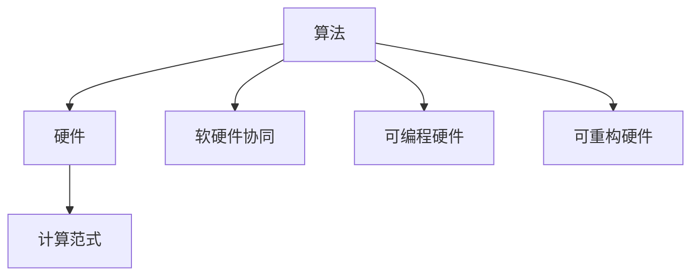

                 

# AI算法与硬件的共同演进

## 1. 背景介绍

### 1.1 问题由来
人工智能（AI）算法与硬件之间的关系一直是科技发展中的核心议题。随着深度学习、自然语言处理、计算机视觉等AI技术的飞速发展，算法的复杂度和计算需求也在不断提升。硬件作为AI算法的执行载体，必须与之协同进化，才能支持日益复杂的应用场景和任务。

近年来，由于摩尔定律的逐渐放缓和计算瓶颈的出现，硬件厂商和研究人员纷纷探索新的计算范式和硬件架构，以应对算法性能需求的提升。而AI算法也在不断演进，更高效的模型结构和算法机制不断涌现。本文旨在探讨AI算法与硬件之间的相互依赖和共同演进，强调两者在推动技术进步中的重要作用。

### 1.2 问题核心关键点
AI算法与硬件的共同演进主要体现在以下几个方面：

1. **算法的计算需求与硬件的计算能力匹配**：随着模型复杂度的提升，深度神经网络等AI算法对计算资源的需求急剧增加。硬件架构必须支持更高的并行度和计算精度，才能满足算法的计算需求。
2. **算法结构的优化与硬件结构的适配**：不断优化的AI算法结构和计算图，需要在硬件上实现高效映射，实现算法的极致性能。
3. **软硬件协同设计**：算法和硬件的设计需要紧密结合，通过协同优化，实现性能、功耗和成本的最优平衡。
4. **算法的多样性与硬件的异构化**：AI算法的多样性和异构性要求硬件具备灵活性和可扩展性，以支持不同的算法需求。
5. **算法的可训练性与硬件的可重构性**：动态可训练的算法和硬件，能够实现更灵活的计算资源分配和性能调优。

### 1.3 问题研究意义
AI算法与硬件的共同演进，对于推动AI技术的进步和应用落地具有重要意义：

1. **提升计算效率**：优化算法与硬件的匹配，可以显著提升计算效率，加速模型训练和推理。
2. **降低计算成本**：通过软硬件协同设计，可以在保持高性能的同时，降低计算成本。
3. **拓展应用范围**：算法的改进和硬件的创新，可以拓展AI技术的应用场景，推动其在更多领域的应用。
4. **促进技术创新**：算法与硬件的协同演化，可以催生新的计算范式和硬件架构，推动AI技术的持续创新。
5. **增强系统可靠性**：通过合理匹配算法与硬件，可以提升系统的稳定性和可靠性，保障AI系统的应用效果。

## 2. 核心概念与联系

### 2.1 核心概念概述

为更好地理解AI算法与硬件的共同演进，本节将介绍几个关键概念：

- **算法（Algorithm）**：AI算法是实现特定任务或功能的计算步骤，如神经网络、深度学习等。
- **硬件（Hardware）**：AI算法的执行环境，包括CPU、GPU、TPU等通用或专用硬件。
- **计算范式（Computational Paradigm）**：不同的计算范式，如并行计算、分布式计算、量子计算等，决定了硬件架构的设计。
- **软硬件协同（Software-Hardware Co-design）**：算法和硬件的设计需要紧密结合，实现高效、低成本的计算。
- **可编程硬件（Programmable Hardware）**：硬件具备可编程性，能够根据不同的算法需求进行动态配置。
- **可重构硬件（Reconfigurable Hardware）**：硬件可以在运行时进行重新配置，适应不同的算法需求。

这些核心概念之间的逻辑关系可以通过以下Mermaid流程图来展示：



这个流程图展示了几者之间的相互关系：

1. 算法需要硬件的计算支持。
2. 硬件架构受计算范式的指导。
3. 算法与硬件的设计需要协同优化。
4. 硬件具备可编程性和可重构性，以适应不同的算法需求。

这些概念共同构成了AI算法与硬件的共同演进的框架，帮助理解其复杂关系和协同优化过程。

## 3. 核心算法原理 & 具体操作步骤
### 3.1 算法原理概述

AI算法与硬件的共同演进，涉及算法的计算需求与硬件的计算能力匹配。以下是这一过程的核心原理：

- **计算需求**：深度神经网络等AI算法通常具有大量的权重参数和复杂的计算图，需要高效的并行计算和数据传输。
- **计算能力**：硬件必须支持高并行度、高吞吐量和高精度的计算，才能满足算法的计算需求。
- **匹配优化**：通过算法结构和硬件架构的优化，实现高效匹配，提升整体计算效率。

### 3.2 算法步骤详解

AI算法与硬件的共同演进，通常包括以下关键步骤：

**Step 1: 需求分析**
- 分析AI算法的计算需求，包括计算量、内存需求、数据传输速率等。
- 确定硬件的计算能力，包括并行度、计算精度、带宽等。

**Step 2: 架构设计**
- 根据计算需求和硬件能力，设计合适的硬件架构。例如，多核CPU、GPU阵列、TPU阵列等。
- 考虑算法的并行性和数据流特性，设计高效的计算图和调度策略。

**Step 3: 优化与适配**
- 对算法进行优化，减少计算量和内存占用。例如，剪枝、量化、稀疏化等。
- 对硬件进行适配，提升性能和能效比。例如，缓存优化、多核并行、异构融合等。

**Step 4: 实验验证**
- 在模拟环境和实际硬件上进行算法和硬件的实验验证，评估性能和功耗。
- 根据实验结果，进一步调整算法和硬件的设计。

**Step 5: 应用部署**
- 将优化后的算法和适配的硬件部署到实际应用中，进行性能评估和优化。

### 3.3 算法优缺点

AI算法与硬件的共同演进，具有以下优点：

1. **高效匹配**：通过合理的算法和硬件设计，可以实现高效的计算匹配，提升计算效率。
2. **灵活优化**：硬件的灵活性和可重构性，使得算法与硬件的优化更加灵活。
3. **成本控制**：软硬件协同设计，可以在保持高性能的同时，降低计算成本。
4. **应用拓展**：算法与硬件的协同优化，可以拓展AI技术的应用场景，推动技术进步。

同时，这一过程也存在以下缺点：

1. **设计与实现复杂**：算法与硬件的共同演进，需要跨学科知识，设计与实现过程较为复杂。
2. **资源需求高**：优化算法和适配硬件，需要大量的计算资源和工程投入。
3. **性能瓶颈**：在硬件性能提升有限的情况下，算法的优化可能难以进一步提升计算效率。
4. **兼容性问题**：不同的算法和硬件可能存在兼容性问题，需要额外的时间和精力进行适配。

### 3.4 算法应用领域

AI算法与硬件的共同演进，已经在多个领域得到了广泛应用，例如：

- **深度学习**：在深度神经网络等AI算法中，GPU和TPU等专用硬件已经成为了标准配置。通过适配硬件和优化算法，加速了模型训练和推理。
- **计算机视觉**：在图像识别、目标检测等视觉任务中，GPU和TPU等硬件加速了算法的计算。
- **自然语言处理**：在语言模型、文本分类等任务中，硬件加速了算法的计算和推理。
- **语音识别**：在语音识别等任务中，GPU和TPU等硬件加速了算法的计算。
- **自动驾驶**：在自动驾驶等任务中，硬件加速了算法的计算和推理，提升了系统的实时性和稳定性。

这些应用领域的成功实践，展示了AI算法与硬件共同演进的巨大潜力。

## 4. 数学模型和公式 & 详细讲解 & 举例说明
### 4.1 数学模型构建

本节将使用数学语言对AI算法与硬件的共同演进过程进行更加严格的刻画。

记AI算法为 $A$，硬件为 $H$，其计算能力为 $C$。假设 $A$ 和 $H$ 的匹配优化目标为最小化 $C-A$ 的差距，即：

$$
\min_{A,H} \lvert C-A \rvert
$$

其中，$C$ 为硬件计算能力，$A$ 为算法计算需求。通过优化算法 $A$ 和硬件 $H$，使得 $A$ 的计算需求尽可能接近 $H$ 的计算能力，实现高效匹配。

### 4.2 公式推导过程

以下我们以深度学习为例，推导算法与硬件共同演进的数学模型。

假设深度神经网络模型为 $A = f(\theta)$，其中 $\theta$ 为模型参数，$f$ 为网络计算函数。硬件的计算能力为 $C$，包括计算速度和并行度。通过优化算法 $A$ 和硬件 $H$，使得 $A$ 的计算需求尽可能接近 $H$ 的计算能力，即：

$$
\min_{A,H} \lvert C-A \rvert
$$

在实践中，我们通常使用基于梯度的优化算法（如SGD、Adam等）来近似求解上述最优化问题。设 $\eta$ 为学习率，则参数的更新公式为：

$$
A \leftarrow A - \eta \nabla_{A}\mathcal{L}(A,H)
$$

其中 $\nabla_{A}\mathcal{L}(A,H)$ 为损失函数对参数 $A$ 的梯度，可通过反向传播算法高效计算。

### 4.3 案例分析与讲解

以下以GPU与深度神经网络模型的匹配为例，进行具体分析：

- **案例背景**：深度神经网络模型在训练过程中，需要大量的计算资源。GPU作为高性能计算硬件，能够加速深度神经网络模型的训练。
- **问题描述**：如何通过算法优化和硬件适配，使得深度神经网络模型的计算需求与GPU的计算能力匹配，实现高效的计算匹配。
- **解决方法**：
  - **算法优化**：通过剪枝、量化、稀疏化等技术，减少深度神经网络模型的参数量和计算量，提升计算效率。
  - **硬件适配**：利用GPU的并行计算能力，设计高效的计算图和调度策略，优化数据传输和存储。
- **结果评估**：通过实验验证，优化后的深度神经网络模型在GPU上训练时间显著减少，计算效率提升。

## 5. 项目实践：代码实例和详细解释说明
### 5.1 开发环境搭建

在进行AI算法与硬件的共同演进实践前，我们需要准备好开发环境。以下是使用Python进行PyTorch开发的环境配置流程：

1. 安装Anaconda：从官网下载并安装Anaconda，用于创建独立的Python环境。

2. 创建并激活虚拟环境：
```bash
conda create -n pytorch-env python=3.8 
conda activate pytorch-env
```

3. 安装PyTorch：根据CUDA版本，从官网获取对应的安装命令。例如：
```bash
conda install pytorch torchvision torchaudio cudatoolkit=11.1 -c pytorch -c conda-forge
```

4. 安装TensorBoard：用于可视化算法与硬件的优化过程。

```bash
pip install tensorboard
```

完成上述步骤后，即可在`pytorch-env`环境中开始开发。

### 5.2 源代码详细实现

这里我们以深度神经网络模型在GPU上的优化为例，给出使用PyTorch的代码实现。

首先，定义深度神经网络模型的计算函数：

```python
import torch.nn as nn
import torch

class NeuralNet(nn.Module):
    def __init__(self, input_dim, hidden_dim, output_dim):
        super(NeuralNet, self).__init__()
        self.fc1 = nn.Linear(input_dim, hidden_dim)
        self.relu = nn.ReLU()
        self.fc2 = nn.Linear(hidden_dim, output_dim)
    
    def forward(self, x):
        out = self.fc1(x)
        out = self.relu(out)
        out = self.fc2(out)
        return out
```

然后，定义优化器和硬件参数：

```python
model = NeuralNet(input_dim=784, hidden_dim=500, output_dim=10)
optimizer = torch.optim.Adam(model.parameters(), lr=0.001)
```

接着，定义训练函数：

```python
from torch.utils.data import TensorDataset, DataLoader
from tqdm import tqdm

def train(model, train_loader, optimizer, device, num_epochs=10):
    model.train()
    for epoch in range(num_epochs):
        for batch_idx, (data, target) in enumerate(train_loader):
            data, target = data.to(device), target.to(device)
            optimizer.zero_grad()
            output = model(data)
            loss = nn.CrossEntropyLoss()(output, target)
            loss.backward()
            optimizer.step()
            if batch_idx % 100 == 0:
                print(f'Epoch {epoch+1}, batch_idx {batch_idx}, loss: {loss.item():.4f}')
```

最后，启动训练流程：

```python
train_loader = DataLoader(train_dataset, batch_size=32, shuffle=True)
device = torch.device('cuda:0' if torch.cuda.is_available() else 'cpu')
train(train_loader, optimizer, device)
```

这就是使用PyTorch对深度神经网络模型进行GPU优化训练的完整代码实现。可以看到，通过优化算法和硬件适配，可以在GPU上高效地训练深度神经网络模型。

### 5.3 代码解读与分析

让我们再详细解读一下关键代码的实现细节：

**NeuralNet类**：
- `__init__`方法：初始化模型结构，包括输入层、隐藏层和输出层。
- `forward`方法：定义模型前向传播计算函数。

**train函数**：
- 在训练过程中，对每个批次的数据进行前向传播计算，计算损失并反向传播更新模型参数。
- 使用Adam优化器更新模型参数。
- 周期性地输出当前批次和迭代的损失，以监控训练进度。

**训练流程**：
- 定义训练数据集，创建训练数据加载器。
- 选择训练设备，如GPU或CPU。
- 在GPU上启动训练过程，调用train函数进行训练。

可以看到，PyTorch提供了强大的工具和库，可以方便地进行算法与硬件的优化实践。

## 6. 实际应用场景
### 6.1 智能推荐系统

AI算法与硬件的共同演进，在智能推荐系统中得到了广泛应用。智能推荐系统通过算法与硬件的优化匹配，实现了高效的数据处理和模型训练，提升了推荐效果和用户体验。

在推荐系统开发中，算法与硬件的共同演进主要体现在以下几个方面：

- **数据处理**：通过硬件加速，对大规模用户行为数据进行实时处理和分析，生成高效的推荐特征。
- **模型训练**：通过GPU和TPU等硬件加速，对深度神经网络模型进行快速训练和优化，提升模型性能。
- **实时推荐**：通过硬件加速和算法优化，实现高效的推荐模型推理，提供快速响应。

### 6.2 自动驾驶

自动驾驶系统需要处理大量的传感器数据，并进行复杂的决策和推理。AI算法与硬件的共同演进，为自动驾驶系统的实时性和稳定性提供了重要保障。

在自动驾驶系统中，算法与硬件的共同演进主要体现在以下几个方面：

- **传感器数据处理**：通过硬件加速，对高分辨率传感器数据进行实时处理和分析，生成精确的感知信息。
- **决策推理**：通过GPU和TPU等硬件加速，对深度神经网络模型进行快速推理和决策，提升系统的响应速度和准确性。
- **安全控制**：通过硬件加速和算法优化，实现高效的安全控制策略，保障驾驶安全。

### 6.3 医疗影像分析

AI算法与硬件的共同演进，在医疗影像分析中得到了广泛应用。医疗影像分析通过算法与硬件的优化匹配，实现了高效的数据处理和模型训练，提升了影像诊断的准确性和效率。

在医疗影像分析中，算法与硬件的共同演进主要体现在以下几个方面：

- **影像数据处理**：通过硬件加速，对大规模医疗影像数据进行实时处理和分析，生成精确的影像特征。
- **模型训练**：通过GPU和TPU等硬件加速，对深度神经网络模型进行快速训练和优化，提升模型性能。
- **临床辅助**：通过硬件加速和算法优化，实现高效的影像分析模型推理，提供精准的诊断支持。

### 6.4 未来应用展望

随着AI算法与硬件的共同演进，未来将有更多领域受益于这一技术进步：

- **云计算**：在云平台上，通过优化算法与硬件，提升计算资源利用效率，降低计算成本。
- **边缘计算**：在边缘设备上，通过优化算法与硬件，实现高效的数据处理和实时推理。
- **物联网**：在物联网设备上，通过优化算法与硬件，实现高效的数据采集和处理，提升系统性能。
- **智慧城市**：在智慧城市建设中，通过优化算法与硬件，实现高效的城市管理和服务，提升城市运行效率。

## 7. 工具和资源推荐
### 7.1 学习资源推荐

为了帮助开发者系统掌握AI算法与硬件的共同演进，这里推荐一些优质的学习资源：

1. 《深度学习》系列课程：斯坦福大学、Coursera等平台提供深度学习课程，深入浅出地介绍了深度神经网络、计算机视觉等领域的核心概念和算法。
2. 《GPU高性能编程》课程：NVIDIA提供的GPU编程课程，介绍了GPU加速编程的原理和实践。
3. 《TensorFlow》官方文档：TensorFlow官方文档提供了丰富的API和教程，帮助开发者高效地进行AI算法的实现和优化。
4. 《TPU加速深度学习》书籍：Google提供的TPU加速深度学习书籍，介绍了TPU架构和深度神经网络优化策略。
5. 《AI算法与硬件》论文集：IEEE、ACM等期刊发表了大量关于AI算法与硬件协同优化的论文，帮助深入理解最新研究成果。

通过对这些资源的学习实践，相信你一定能够快速掌握AI算法与硬件的共同演进的精髓，并用于解决实际的AI问题。

### 7.2 开发工具推荐

高效的开发离不开优秀的工具支持。以下是几款用于AI算法与硬件优化的常用工具：

1. PyTorch：基于Python的开源深度学习框架，灵活动态的计算图，适合快速迭代研究。GPU加速支持良好。
2. TensorFlow：由Google主导开发的开源深度学习框架，生产部署方便，GPU加速效果显著。
3. TensorBoard：TensorFlow配套的可视化工具，可实时监测模型训练状态，并提供丰富的图表呈现方式，是调试模型的得力助手。
4. NVIDIA CUDA Toolkit：NVIDIA提供的GPU加速开发工具包，提供了丰富的GPU加速函数库和优化工具。
5. Google Cloud AI Platform：Google提供的云平台服务，支持GPU和TPU等硬件加速，适合大规模AI算法优化实践。

合理利用这些工具，可以显著提升AI算法与硬件优化的开发效率，加快创新迭代的步伐。

### 7.3 相关论文推荐

AI算法与硬件的共同演进源于学界的持续研究。以下是几篇奠基性的相关论文，推荐阅读：

1. "GPU vs CPU: What to Choose for Deep Learning?"：探讨了GPU和CPU在深度学习中的优劣，强调了硬件选择对算法性能的影响。
2. "Quantization and Training of Neural Networks for Efficient Integer-Arithmetic-Only Inference"：提出量化加速技术，通过整型运算优化深度神经网络模型，提升推理效率。
3. "Hardware-Accelerated Stochastic Computing for Deep Learning"：介绍了利用可重构硬件进行深度神经网络训练和推理的方法。
4. "Soft Hardwarization: Learning Adaptive Hardware for Deep Neural Network"：提出软硬件协同设计方法，通过学习算法动态配置硬件，提升计算效率。

这些论文代表了大规模深度学习系统优化与硬件协同设计的研究方向，具有重要的学术和工程参考价值。

## 8. 总结：未来发展趋势与挑战

### 8.1 总结

本文对AI算法与硬件的共同演进进行了全面系统的介绍。首先阐述了AI算法与硬件的相互依赖和协同演进的重要性，明确了优化算法与适配硬件的紧密关系。其次，从原理到实践，详细讲解了算法与硬件的协同优化过程，给出了具体的代码实现和案例分析。同时，本文还探讨了AI算法与硬件在多个领域的应用前景，展示了其巨大的潜力。此外，本文精选了算法与硬件优化的各类学习资源，力求为开发者提供全方位的技术指引。

通过本文的系统梳理，可以看到，AI算法与硬件的共同演进正在成为AI技术的核心范式，极大地推动了AI技术的进步和应用落地。未来，伴随算法与硬件的持续演进，相信AI技术将在更多领域大放异彩，深刻影响人类的生产生活方式。

### 8.2 未来发展趋势

展望未来，AI算法与硬件的共同演进将呈现以下几个发展趋势：

1. **硬件的多样化**：随着计算需求的提升，未来的硬件将更加多样化，涵盖CPU、GPU、TPU、FPGA等多种架构，满足不同算法的计算需求。
2. **算法的可解释性**：AI算法的可解释性将成为重要研究方向，通过引入符号化的先验知识，增强模型的解释性，提升系统的透明度和可靠性。
3. **软硬件的协同优化**：算法与硬件的协同优化将更加深入，通过软硬件协同设计，实现性能、功耗和成本的最优平衡。
4. **动态可配置硬件**：未来的硬件将具备动态可配置性，能够根据不同的算法需求进行动态调整，提升资源利用效率。
5. **异构融合计算**：通过异构融合计算，实现不同硬件架构的协同工作，提升计算效率和资源利用率。
6. **边缘计算与云计算的融合**：边缘计算与云计算的结合，将实现更高效的数据处理和模型推理，提升系统的实时性和可扩展性。

以上趋势凸显了AI算法与硬件协同演进的广阔前景。这些方向的探索发展，必将进一步推动AI技术的进步，提升其在实际应用中的表现。

### 8.3 面临的挑战

尽管AI算法与硬件的共同演进已经取得了显著成就，但在迈向更加智能化、普适化应用的过程中，仍然面临诸多挑战：

1. **资源瓶颈**：AI算法对计算资源的需求不断提升，硬件性能提升有限，如何有效利用现有资源，提升性能和效率，仍需深入研究。
2. **算法复杂性**：复杂算法的实现和优化，需要跨学科知识，设计复杂，实现难度大。
3. **硬件成本**：高性能硬件的成本较高，如何降低成本，提升资源利用率，仍是重要课题。
4. **兼容性问题**：不同的算法和硬件可能存在兼容性问题，需要额外的时间和精力进行适配。
5. **可解释性**：AI算法的可解释性不足，难以理解其内部工作机制和决策逻辑，影响系统的透明度和可靠性。
6. **安全与隐私**：AI算法的复杂性和动态性，可能带来安全与隐私问题，需要加强安全防护措施。

正视这些挑战，积极应对并寻求突破，将是大规模深度学习系统迈向成熟的必由之路。相信随着学界和产业界的共同努力，这些挑战终将一一被克服，AI算法与硬件的共同演进必将在构建人机协同的智能时代中扮演越来越重要的角色。

### 8.4 研究展望

面对AI算法与硬件的共同演进所面临的挑战，未来的研究需要在以下几个方面寻求新的突破：

1. **软硬件协同优化**：通过软硬件协同设计，提升系统的性能和效率，降低计算成本。
2. **算法与硬件的动态匹配**：通过动态配置算法和硬件，实现更灵活的计算资源分配和性能调优。
3. **异构融合计算**：通过异构融合计算，实现不同硬件架构的协同工作，提升计算效率和资源利用率。
4. **可解释性与透明性**：引入符号化的先验知识，增强算法的可解释性，提升系统的透明度和可靠性。
5. **安全性与隐私保护**：通过安全防护措施，保障系统的安全性和隐私性，避免安全与隐私问题。
6. **算法与硬件的动态自适应**：通过动态自适应算法和硬件，实现更灵活的计算资源分配和性能调优。

这些研究方向的探索，必将引领AI算法与硬件的共同演进技术迈向更高的台阶，为构建安全、可靠、可解释、可控的智能系统铺平道路。面向未来，AI算法与硬件的共同演进技术还需要与其他AI技术进行更深入的融合，如知识表示、因果推理、强化学习等，多路径协同发力，共同推动人工智能技术的持续创新。

## 9. 附录：常见问题与解答

**Q1：AI算法与硬件的共同演进是否适用于所有AI任务？**

A: AI算法与硬件的共同演进，在大多数AI任务上都能取得不错的效果，特别是对于数据量较大的任务。但对于一些特定领域的任务，如医学、法律等，仅仅依靠通用语料预训练的模型可能难以很好地适应。此时需要在特定领域语料上进一步预训练，再进行微调，才能获得理想效果。此外，对于一些需要时效性、个性化很强的任务，如对话、推荐等，算法与硬件的共同演进方法也需要针对性的改进优化。

**Q2：优化算法与适配硬件时需要考虑哪些因素？**

A: 优化算法与适配硬件时需要考虑以下因素：

1. **数据类型与规模**：不同类型和规模的数据，对硬件的需求不同，需要适配不同的硬件架构。
2. **计算量与并行度**：计算量和并行度是算法的核心性能指标，需要适配高效的硬件架构。
3. **内存与带宽**：内存和带宽是硬件的重要性能指标，需要根据算法的内存需求进行适配。
4. **能耗与温度**：硬件的能耗和温度是重要约束条件，需要在性能和能耗之间取得平衡。
5. **可扩展性与灵活性**：硬件的可扩展性和灵活性，决定了系统的可扩展性和灵活性。
6. **成本与部署**：硬件的成本和部署方式，是系统经济性和可操作性的重要考虑因素。

以上因素在优化算法与适配硬件时需要综合考虑，以达到最优的性能和成本平衡。

**Q3：如何评估优化后的AI算法与硬件性能？**

A: 评估优化后的AI算法与硬件性能，通常需要以下指标：

1. **计算效率**：优化后的算法与硬件的计算效率，通常通过吞吐量和计算时间来衡量。
2. **能效比**：优化后的算法与硬件的能效比，通常通过计算时间和能耗来衡量。
3. **准确性**：优化后的算法与硬件的准确性，通常通过模型性能指标（如精度、召回率、F1值等）来衡量。
4. **稳定性**：优化后的算法与硬件的稳定性，通常通过系统运行时间和故障率来衡量。
5. **可扩展性**：优化后的算法与硬件的可扩展性，通常通过系统的扩展能力和性能损失来衡量。

通过多维度指标评估，可以全面了解优化后的AI算法与硬件性能。

**Q4：AI算法与硬件的共同演进过程中有哪些典型案例？**

A: 以下是几个AI算法与硬件共同演进的典型案例：

1. **深度学习模型在GPU上的优化**：通过剪枝、量化、稀疏化等技术，优化深度神经网络模型，提升模型性能。使用GPU加速模型训练和推理，实现高效的计算匹配。
2. **计算机视觉模型在TPU上的优化**：通过模型压缩、量化等技术，优化计算机视觉模型，提升模型性能。使用TPU加速模型推理，实现高效的计算匹配。
3. **自然语言处理模型在CPU和GPU上的优化**：通过算法优化和硬件适配，提升自然语言处理模型的计算效率和性能。使用CPU和GPU进行分布式计算，实现高效的计算匹配。
4. **自动驾驶系统在边缘计算设备上的优化**：通过硬件加速和算法优化，提升自动驾驶系统的计算效率和实时性。使用边缘计算设备进行数据处理和推理，实现高效的计算匹配。

这些案例展示了AI算法与硬件共同演进在不同领域的应用和效果。

**Q5：AI算法与硬件的共同演进过程中需要注意哪些问题？**

A: AI算法与硬件的共同演进过程中需要注意以下问题：

1. **设计与实现复杂性**：算法与硬件的共同演进需要跨学科知识，设计和实现过程较为复杂。
2. **资源需求高**：优化算法和适配硬件，需要大量的计算资源和工程投入。
3. **性能瓶颈**：在硬件性能提升有限的情况下，算法的优化可能难以进一步提升计算效率。
4. **兼容性问题**：不同的算法和硬件可能存在兼容性问题，需要额外的时间和精力进行适配。
5. **安全与隐私**：AI算法的复杂性和动态性，可能带来安全与隐私问题，需要加强安全防护措施。
6. **系统可靠性**：优化算法与适配硬件需要确保系统的稳定性和可靠性，避免系统故障。

这些问题的解决需要综合考虑，通过不断迭代和优化，才能实现高效、可靠、安全的AI系统。

---

作者：禅与计算机程序设计艺术 / Zen and the Art of Computer Programming

