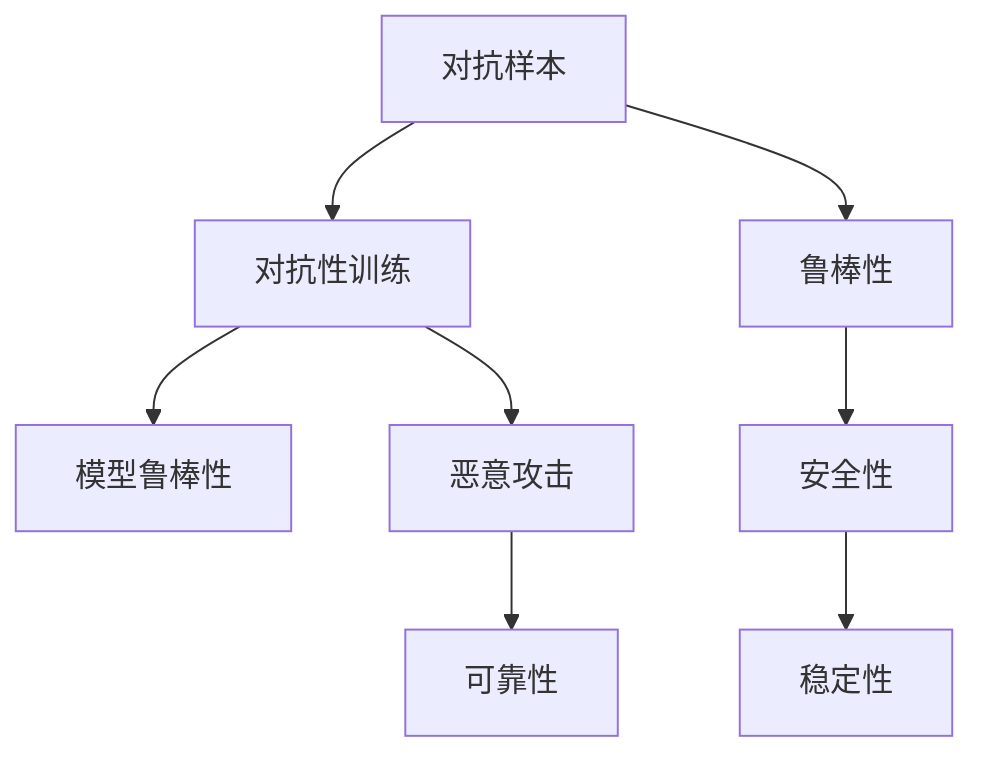

                 

# AI系统的鲁棒性与对抗性训练

> 关键词：AI系统, 鲁棒性, 对抗训练, 安全, 可靠性, 恶意攻击, 机器学习

## 1. 背景介绍

在人工智能(AI)快速发展的今天，AI系统被广泛应用于各个领域，包括医疗、金融、交通、制造业等。然而，这些系统在实际应用中面临着诸多的风险和挑战。近年来，对抗性攻击(Adversarial Attacks)已成为威胁AI系统安全的重要手段。对抗性攻击是一种通过微小扰动输入数据，使得AI模型产生错误输出的攻击方式，具有难以检测、隐匿性强的特点，给AI系统的可靠性和安全性带来了严峻考验。

对抗性训练(Adversarial Training)是一种旨在提升AI系统鲁棒性的有效方法，通过在模型训练过程中引入对抗样本，增强模型对抗对抗性攻击的能力，从而提高系统的安全性和可靠性。本文将详细探讨对抗性训练的核心原理、操作步骤、优缺点以及应用领域，并从数学模型、实践应用、未来展望等方面展开深入讨论，期望为读者提供全面的技术视角和实践指导。

## 2. 核心概念与联系

### 2.1 核心概念概述

为更好地理解对抗性训练，本节将介绍几个关键概念：

- **对抗样本(Adversarial Examples)**：指通过微小扰动，使得AI模型产生错误输出的样本。这些扰动通常很小，但对模型的输出产生显著影响。对抗样本的生成方式有PGD、FGSM、JSMA等。
- **对抗性训练(Adversarial Training)**：指在模型训练过程中，将对抗样本作为训练数据，使模型在训练过程中同时学习对抗性攻击和防御能力，从而提升模型的鲁棒性。
- **鲁棒性(Robustness)**：指模型面对对抗样本或噪声的鲁棒性。鲁棒性强的模型即使在面对对抗性攻击时，仍能保持较高的准确率和稳定性。
- **恶意攻击(Malicious Attacks)**：指利用对抗样本或特定攻击方式，破坏AI系统的正常工作，如篡改输入数据、诱导AI模型做出错误决策。
- **可靠性(Reliability)**：指AI系统在面对各类数据和攻击时的稳定性和准确性。可靠的系统能够保证输出结果的正确性，避免误导性、不可靠的决策。

这些概念之间的逻辑关系可以通过以下Mermaid流程图来展示：



这个流程图展示了对抗性训练的核心概念及其之间的关系：

1. 对抗样本通过对抗性训练提升模型鲁棒性。
2. 模型鲁棒性增强后，可以有效抵御恶意攻击。
3. 鲁棒性强的模型具有更高的可靠性，避免误导性输出。
4. 系统的安全性依赖于鲁棒性和可靠性，提升这两个属性可以增强整体的安全性。

## 3. 核心算法原理 & 具体操作步骤

### 3.1 算法原理概述

对抗性训练的核心思想是通过在模型训练过程中引入对抗样本，使模型学习到对抗样本和真实样本的共同特征，从而提升模型的鲁棒性。具体来说，对抗性训练分为两个步骤：

1. **生成对抗样本**：使用对抗性攻击方法生成对抗样本，如PGD、FGSM、JSMA等。
2. **训练模型**：将对抗样本和真实样本一起作为训练数据，使用优化算法训练模型，使其同时学习对抗性攻击和防御能力。

形式化地，设原始数据集为 $D=\{(x_i, y_i)\}_{i=1}^N$，其中 $x_i \in \mathcal{X}$ 为输入数据， $y_i \in \mathcal{Y}$ 为输出标签。对抗样本的生成方法为 $F(x, \epsilon)$，其中 $\epsilon$ 为扰动量。训练过程通过最小化损失函数 $\mathcal{L}$ 进行，损失函数定义为：

$$
\mathcal{L}(\theta) = \frac{1}{N}\sum_{i=1}^N [\mathcal{L}(f(x_i, \theta), y_i) + \alpha \mathcal{L}_{adv}(x_i, F(x_i, \epsilon), \theta)]
$$

其中 $f$ 为模型前向传播函数，$\mathcal{L}(f(x_i, \theta), y_i)$ 为模型在真实数据上的损失，$\mathcal{L}_{adv}(x_i, F(x_i, \epsilon), \theta)$ 为模型在对抗样本上的损失。$\alpha$ 为对抗样本的权重。

### 3.2 算法步骤详解

对抗性训练的具体操作步骤如下：

1. **数据准备**：准备原始数据集 $D$ 和对抗样本生成函数 $F$。
2. **对抗样本生成**：使用对抗性攻击方法生成对抗样本 $x_i^{adv} = F(x_i, \epsilon)$。
3. **模型训练**：将对抗样本和真实样本作为训练数据，使用优化算法训练模型 $f$。
4. **对抗性评估**：使用对抗样本对训练后的模型进行测试，评估模型的鲁棒性。

### 3.3 算法优缺点

对抗性训练方法具有以下优点：

- **提升鲁棒性**：对抗性训练能够增强模型对对抗样本的防御能力，提升系统的鲁棒性。
- **增强泛化能力**：对抗性训练能够使模型学习到对抗样本和真实样本的共同特征，提高模型的泛化能力。
- **降低对抗性攻击的风险**：通过训练防御对抗性攻击的能力，降低实际应用中遭受对抗性攻击的风险。

同时，对抗性训练也存在以下缺点：

- **计算成本高**：对抗样本的生成和训练过程中的对抗性攻击过程，需要消耗大量计算资源。
- **防御性能有限**：对抗性训练虽然能够增强对已知攻击的防御能力，但对新出现的攻击方式可能无法有效防御。
- **可解释性不足**：对抗性训练过程较为复杂，模型的决策过程难以解释，不便于调试和优化。

### 3.4 算法应用领域

对抗性训练在多个领域得到广泛应用，主要包括以下几个方向：

- **图像识别**：用于对抗性攻击的防御，如使用对抗样本训练CNN模型，提升模型的鲁棒性。
- **自然语言处理**：在文本分类、情感分析等任务中，通过对抗性训练提升模型的鲁棒性和泛化能力。
- **语音识别**：用于对抗性攻击的防御，如在语音识别模型中加入对抗性训练，提升模型的鲁棒性。
- **推荐系统**：用于对抗性攻击的防御，如在推荐系统中加入对抗性训练，提升推荐结果的鲁棒性和安全性。
- **无人驾驶**：用于对抗性攻击的防御，如在无人驾驶系统中加入对抗性训练，提升系统的安全性和可靠性。

## 4. 数学模型和公式 & 详细讲解 & 举例说明

### 4.1 数学模型构建

对抗性训练的数学模型构建包括两个部分：损失函数定义和对抗样本生成方法。

设模型 $f$ 在输入 $x$ 上的输出为 $y = f(x)$，对抗性样本为 $x^{adv}$，对抗样本生成方法为 $F$，则对抗性训练的损失函数定义为：

$$
\mathcal{L}(f) = \frac{1}{N}\sum_{i=1}^N [\mathcal{L}(f(x_i), y_i) + \alpha \mathcal{L}_{adv}(f(x_i^{adv}), y_i)]
$$

其中 $\mathcal{L}(f(x_i), y_i)$ 为模型在真实样本上的损失，$\alpha$ 为对抗样本的权重，$\mathcal{L}_{adv}(f(x_i^{adv}), y_i)$ 为模型在对抗样本上的损失。常见的对抗样本损失函数有最大熵损失、零样本交叉熵损失、对抗性交叉熵损失等。

对抗样本生成方法有多种，常见的方法有PGD(Projected Gradient Descent)、FGSM(Fast Gradient Sign Method)、JSMA(Jacobian-Based Saliency Map Attack)等。这里以PGD为例，展示其生成过程。

### 4.2 公式推导过程

对抗性训练的数学模型推导主要涉及对抗样本生成和损失函数定义两个部分。以PGD对抗样本生成为例，推导如下：

假设模型 $f$ 为深度神经网络，训练集为 $D=\{(x_i, y_i)\}_{i=1}^N$，对抗样本生成函数为：

$$
F(x_i, \epsilon) = x_i + \epsilon \delta f(x_i, y_i)
$$

其中 $\delta f(x_i, y_i)$ 为模型 $f$ 在 $x_i$ 上的梯度，$\epsilon$ 为扰动量。

将对抗样本代入模型 $f$，得到对抗样本的输出：

$$
f(x_i^{adv}) = f(x_i + \epsilon \delta f(x_i, y_i))
$$

对抗样本的损失函数为：

$$
\mathcal{L}_{adv}(f(x_i^{adv}), y_i) = \mathbb{E}_{\epsilon}[L(f(x_i + \epsilon \delta f(x_i, y_i), y_i)]
$$

其中 $L$ 为损失函数，$\mathbb{E}_{\epsilon}$ 表示对扰动量 $\epsilon$ 的期望。

结合真实样本和对抗样本的损失，对抗性训练的损失函数为：

$$
\mathcal{L}(f) = \frac{1}{N}\sum_{i=1}^N [\mathcal{L}(f(x_i), y_i) + \alpha \mathcal{L}_{adv}(f(x_i^{adv}), y_i)]
$$

其中 $\alpha$ 为对抗样本的权重。

### 4.3 案例分析与讲解

以图像分类任务为例，展示对抗性训练的过程。

假设使用ResNet模型进行图像分类，训练集为CIFAR-10数据集，对抗样本生成方法为PGD。

1. **数据准备**：准备CIFAR-10数据集，将其分为训练集、验证集和测试集。
2. **模型加载**：使用ResNet模型进行加载。
3. **对抗样本生成**：使用PGD生成对抗样本，将其添加到训练集中。
4. **模型训练**：将对抗样本和真实样本作为训练数据，使用SGD优化器训练模型。
5. **对抗性评估**：在测试集上使用对抗样本进行测试，评估模型的鲁棒性。

通过对抗性训练，模型在对抗样本上的准确率有所提升，降低了对抗性攻击的风险。

## 5. 项目实践：代码实例和详细解释说明

### 5.1 开发环境搭建

在进行对抗性训练实践前，我们需要准备好开发环境。以下是使用Python进行TensorFlow开发的环境配置流程：

1. 安装Anaconda：从官网下载并安装Anaconda，用于创建独立的Python环境。

2. 创建并激活虚拟环境：
```bash
conda create -n tf-env python=3.8 
conda activate tf-env
```

3. 安装TensorFlow：根据CUDA版本，从官网获取对应的安装命令。例如：
```bash
conda install tensorflow==2.5
```

4. 安装TensorFlow Addons：
```bash
conda install tensorflow-addons
```

5. 安装各类工具包：
```bash
pip install numpy pandas scikit-learn matplotlib tqdm jupyter notebook ipython
```

完成上述步骤后，即可在`tf-env`环境中开始对抗性训练实践。

### 5.2 源代码详细实现

下面以图像分类任务为例，给出使用TensorFlow进行对抗性训练的Python代码实现。

首先，定义对抗样本生成函数：

```python
import tensorflow as tf
import numpy as np

def generate_advanced_samples(x, y, model, epsilon, alpha):
    # 计算模型在x上的梯度
    grads = tf.gradients(model(tf.convert_to_tensor(x), y)[0], x)[0]
    
    # 计算扰动量
    disturb = epsilon * np.sign(grads)
    
    # 生成对抗样本
    adv_x = x + alpha * tf.clip_by_value(grads, -disturb, disturb)
    
    return adv_x
```

然后，定义对抗性训练函数：

```python
def adversarial_training(model, x_train, y_train, x_test, y_test, epsilon, alpha, num_steps):
    # 加载模型
    model.load_weights('model.h5')
    
    # 准备数据
    x_train_adv = generate_advanced_samples(x_train, y_train, model, epsilon, alpha)
    x_test_adv = generate_advanced_samples(x_test, y_test, model, epsilon, alpha)
    
    # 对抗性训练
    for step in range(num_steps):
        for i in range(len(x_train)):
            # 前向传播计算输出
            preds = model(tf.convert_to_tensor(x_train[i]), y_train[i])
            
            # 对抗样本前向传播计算输出
            preds_adv = model(tf.convert_to_tensor(x_train_adv[i]), y_train[i])
            
            # 计算损失
            loss = tf.keras.losses.categorical_crossentropy(y_train[i], preds_adv)
            
            # 反向传播更新模型参数
            grads = tf.gradients(loss, model.trainable_variables)
            optimizer.apply_gradients(zip(grads, model.trainable_variables))
    
    # 评估模型鲁棒性
    correct_preds = np.mean(np.argmax(model.predict(x_test), axis=1) == np.argmax(y_test, axis=1))
    correct_preds_adv = np.mean(np.argmax(model.predict(x_test_adv), axis=1) == np.argmax(y_test, axis=1))
    
    return correct_preds, correct_preds_adv
```

最后，启动对抗性训练流程并在测试集上评估：

```python
x_train = np.load('x_train.npy')
y_train = np.load('y_train.npy')
x_test = np.load('x_test.npy')
y_test = np.load('y_test.npy')

epsilon = 0.001
alpha = 0.001
num_steps = 100

correct_preds, correct_preds_adv = adversarial_training(model, x_train, y_train, x_test, y_test, epsilon, alpha, num_steps)

print('原始模型准确率：', correct_preds)
print('对抗样本模型准确率：', correct_preds_adv)
```

以上就是使用TensorFlow进行对抗性训练的完整代码实现。可以看到，对抗性训练过程主要分为数据准备、对抗样本生成和模型训练三个步骤，每个步骤都有详细的代码解释。

### 5.3 代码解读与分析

让我们再详细解读一下关键代码的实现细节：

**生成对抗样本函数**：
- 使用`tf.gradients`函数计算模型在输入样本上的梯度。
- 根据扰动量 $\epsilon$ 计算扰动量 $\delta f$。
- 生成对抗样本 $x^{adv} = x + \epsilon \delta f$。

**对抗性训练函数**：
- 加载预训练模型。
- 使用`generate_advanced_samples`函数生成对抗样本。
- 对抗性训练过程使用SGD优化器。
- 每个样本都进行前向传播和反向传播，更新模型参数。
- 在训练结束后，使用测试集评估模型在对抗样本上的准确率。

**启动对抗性训练流程**：
- 加载训练数据和测试数据。
- 设置扰动量 $\epsilon$、对抗样本权重 $\alpha$ 和训练轮数 $num_steps$。
- 调用`adversarial_training`函数进行对抗性训练。
- 输出模型在对抗样本上的准确率。

可以看到，TensorFlow提供了强大的工具库，使得对抗性训练的实现相对简单。开发者可以根据具体任务，进一步优化对抗样本生成和训练过程。

## 6. 实际应用场景

### 6.1 智能监控系统

智能监控系统常常面临对抗性攻击的威胁，例如通过微小扰动监控视频，使AI模型无法正确识别目标。对抗性训练可以有效提升监控系统的鲁棒性，使其在面对对抗性攻击时，仍能稳定运行，确保监控数据的准确性和安全性。

### 6.2 金融交易系统

金融交易系统在面对恶意攻击时，可能遭受巨大损失。对抗性训练可以提升系统的鲁棒性，防止攻击者通过微小扰动输入数据，诱使模型做出错误决策。通过对抗性训练，金融交易系统可以更加稳定和安全地运行，保障用户的交易安全。

### 6.3 自动驾驶系统

自动驾驶系统在面对对抗性攻击时，可能发生误判或失控。对抗性训练可以提升系统的鲁棒性，防止攻击者通过微小扰动输入数据，影响系统的决策过程。通过对抗性训练，自动驾驶系统可以更加稳定和安全地运行，确保驾驶安全。

### 6.4 未来应用展望

随着对抗性训练技术的发展，其在更多领域的应用将得到拓展。未来的趋势可能包括：

1. **多模态对抗性训练**：将对抗性训练拓展到多模态数据，如同时处理图像和音频数据的系统。
2. **联邦对抗性训练**：在分布式系统中进行对抗性训练，保护隐私和安全。
3. **动态对抗性训练**：在运行过程中动态更新对抗样本，保持系统的鲁棒性。
4. **自适应对抗性训练**：根据攻击类型和强度，自适应地调整训练策略。

对抗性训练技术的发展将为更多AI系统的安全性和可靠性提供保障，成为推动人工智能应用落地的重要力量。

## 7. 工具和资源推荐

### 7.1 学习资源推荐

为了帮助开发者系统掌握对抗性训练的理论基础和实践技巧，这里推荐一些优质的学习资源：

1. 《深度学习框架TensorFlow官方文档》：提供了完整的TensorFlow库的使用指南，包括对抗性训练的实现方法。
2. 《Adversarial Machine Learning》系列课程：由机器学习专家开设的课程，系统讲解对抗性攻击和防御的技术。
3. 《The Art of Adversarial Machine Learning》一书：详细介绍了对抗性攻击和防御的数学原理和实现方法。
4. arXiv论文库：收录了大量对抗性训练的最新研究成果，可以追踪学术前沿。

通过对这些资源的学习实践，相信你一定能够快速掌握对抗性训练的精髓，并用于解决实际的AI安全问题。

### 7.2 开发工具推荐

高效的开发离不开优秀的工具支持。以下是几款用于对抗性训练开发的常用工具：

1. TensorFlow：由Google主导开发的开源深度学习框架，生产部署方便，适合大规模工程应用。提供了丰富的预训练语言模型资源。
2. Keras：基于TensorFlow等框架的高级API，提供了简洁易用的模型构建方式。
3. PyTorch：基于Python的开源深度学习框架，灵活动态的计算图，适合快速迭代研究。
4. JAX：基于JVM的高性能深度学习框架，支持自动微分和分布式计算，适合复杂的模型训练。
5. TensorFlow Addons：增强TensorFlow功能的库，提供了更多的预训练模型和工具。

合理利用这些工具，可以显著提升对抗性训练任务的开发效率，加快创新迭代的步伐。

### 7.3 相关论文推荐

对抗性训练在安全领域得到广泛关注，以下几篇奠基性的相关论文，推荐阅读：

1. Goodfellow et al., “Explaining and Harnessing Adversarial Examples”：介绍了对抗性攻击的基本原理和防御方法。
2. Madry et al., “Towards Evaluating the Robustness of Neural Networks”：提出PGD对抗性攻击方法，被广泛采用。
3. Arjovsky et al., “Towards Robustness to Adversarial Examples via Input Diversification”：提出使用对抗样本训练提升模型鲁棒性的方法。
4. Hendrycks et al., “The Skinny on Adversarial Training”：系统总结了对抗性训练的效果和局限性。
5. Zhu et al., “Ensemble of Adversarial Training with Two-stage Feature Distillation for Robust Face Recognition”：提出使用对抗性训练和特征蒸馏方法提升模型鲁棒性。

这些论文代表了大语言模型微调技术的发展脉络。通过学习这些前沿成果，可以帮助研究者把握学科前进方向，激发更多的创新灵感。

## 8. 总结：未来发展趋势与挑战

### 8.1 总结

本文对对抗性训练的核心原理、操作步骤、优缺点以及应用领域进行了全面系统的介绍。首先阐述了对抗性训练的背景和意义，明确了对抗性训练在提升AI系统鲁棒性方面的独特价值。其次，从原理到实践，详细讲解了对抗性训练的数学原理和关键步骤，给出了对抗性训练任务开发的完整代码实例。同时，本文还广泛探讨了对抗性训练方法在多个领域的应用前景，展示了对抗性训练范式的巨大潜力。

通过本文的系统梳理，可以看到，对抗性训练方法已经在大规模AI系统中得到广泛应用，极大地提升了系统的鲁棒性和安全性。未来，伴随对抗性训练技术的持续演进，AI系统的稳定性和可靠性将得到更强的保障，为人工智能技术的发展注入新的动力。

### 8.2 未来发展趋势

展望未来，对抗性训练技术将呈现以下几个发展趋势：

1. **多模态对抗性训练**：将对抗性训练拓展到多模态数据，如同时处理图像和音频数据的系统。
2. **联邦对抗性训练**：在分布式系统中进行对抗性训练，保护隐私和安全。
3. **动态对抗性训练**：在运行过程中动态更新对抗样本，保持系统的鲁棒性。
4. **自适应对抗性训练**：根据攻击类型和强度，自适应地调整训练策略。

以上趋势凸显了对抗性训练技术的广阔前景。这些方向的探索发展，必将进一步提升AI系统的鲁棒性和安全性，为构建稳定、可靠的智能系统提供坚实的技术基础。

### 8.3 面临的挑战

尽管对抗性训练技术已经取得了显著成就，但在迈向更加智能化、普适化应用的过程中，仍面临诸多挑战：

1. **对抗样本生成难度高**：对抗样本生成过程复杂，容易产生过拟合现象，难以生成真正具有挑战性的对抗样本。
2. **防御性能有限**：对抗性训练虽然能够增强对已知攻击的防御能力，但对新出现的攻击方式可能无法有效防御。
3. **资源消耗大**：对抗性训练需要大量计算资源，模型的训练和推理过程较为耗时，难以在大规模系统中快速部署。
4. **可解释性不足**：对抗性训练过程较为复杂，模型的决策过程难以解释，不便于调试和优化。

正视对抗性训练面临的这些挑战，积极应对并寻求突破，将对抗性训练技术推向成熟，必将为AI系统的安全性和可靠性提供更强的保障。

### 8.4 研究展望

面对对抗性训练面临的这些挑战，未来的研究需要在以下几个方面寻求新的突破：

1. **对抗样本生成方法**：开发更加高效的对抗样本生成方法，降低生成难度，提升生成质量。
2. **防御性能提升**：研究新的防御方法，如使用自适应对抗性训练提升模型的鲁棒性。
3. **计算资源优化**：优化对抗性训练的计算图，降低资源消耗，提升训练和推理效率。
4. **模型解释性增强**：引入可解释性技术，增强对抗性训练模型的解释能力，便于调试和优化。

这些研究方向的探索，必将引领对抗性训练技术迈向更高的台阶，为构建稳定、可靠的智能系统提供坚实的技术基础。

## 9. 附录：常见问题与解答

**Q1：对抗性训练是否适用于所有AI系统？**

A: 对抗性训练主要适用于具有深度学习模型的AI系统，如神经网络、深度神经网络等。对于传统机器学习模型，可以通过对抗性样本进行测试，但无法通过训练提升鲁棒性。

**Q2：对抗性训练是否会导致模型性能下降？**

A: 对抗性训练的初衷是为了提升模型的鲁棒性，但过度的对抗性训练可能会导致模型性能下降。因此，需要控制好对抗样本的扰动量和生成策略，避免过拟合现象。

**Q3：对抗性训练能否防御所有类型的攻击？**

A: 对抗性训练主要防御已知攻击，但对于新出现的攻击方式，仍可能无法有效防御。因此，需要不断更新对抗样本生成方法和训练策略，以应对新的攻击威胁。

**Q4：对抗性训练是否会影响模型的泛化能力？**

A: 对抗性训练的目标是提升模型的鲁棒性，但过于强调鲁棒性可能会导致模型的泛化能力下降。因此，需要在鲁棒性和泛化能力之间找到平衡点，进行合理的调整和优化。

**Q5：对抗性训练能否应用于实时系统？**

A: 对抗性训练可以在实时系统中进行，但需要优化训练和推理过程，降低计算资源消耗，提升系统的实时响应能力。

综上所述，对抗性训练是提升AI系统鲁棒性和安全性的有效手段。未来，伴随技术的不断发展和完善，对抗性训练将为AI系统的安全性和可靠性提供更强的保障，成为推动人工智能技术落地的重要力量。

