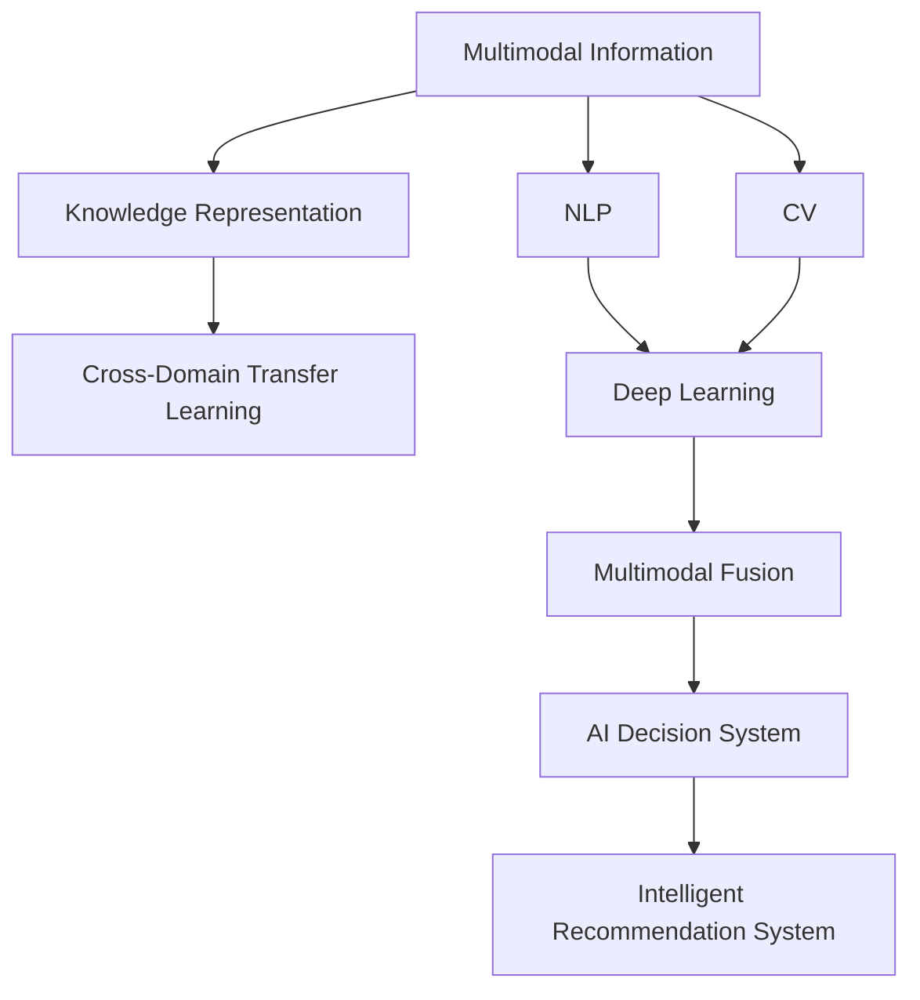

                 

# AI综合处理多维度信息的挑战

> 关键词：多维度信息处理,深度学习,知识表示,自然语言处理(NLP),计算机视觉(CV),决策系统,智能推荐系统

## 1. 背景介绍

随着人工智能技术的发展，AI系统需要处理的输入信息类型越来越多样化、复杂化。无论是自然语言处理(NLP)中的文本、语音，还是计算机视觉(CV)中的图像、视频，亦或是多传感器融合环境中的多种信号，AI系统需要综合处理多种类型的多维度信息，以实现更强大的推理、理解和生成能力。然而，现有的人工智能模型普遍存在跨模态信息融合能力不足、知识表示能力欠缺等挑战，限制了其在现实世界的广泛应用。

本文将探讨AI系统在处理多维度信息时所面临的诸多挑战，并从算法原理、具体步骤、应用领域等多个角度，深入剖析这些挑战的成因及其解决方法。通过系统介绍先进的AI模型和多维度信息处理方法，希望能为未来的研究者和开发者提供新的思路和方向。

## 2. 核心概念与联系

### 2.1 核心概念概述

为更好地理解AI综合处理多维度信息的挑战，本节将介绍几个核心概念，并阐明它们之间的联系。

- **多维度信息**：指由多种传感器、多种模态采集的丰富信息，如文本、语音、图像、视频等。这些信息相互关联、互补，共同构成对真实世界的全面感知。

- **知识表示**：指将知识以结构化的形式表示出来，便于计算机理解和推理。常见的知识表示方式包括逻辑规则、语义网络、知识图谱等。

- **自然语言处理(NLP)**：指使计算机能够理解和生成自然语言的技术，是AI处理文本信息的重要方向。

- **计算机视觉(CV)**：指使计算机能够理解和分析图像、视频等视觉信息的技术，是AI处理视觉信息的重要方向。

- **深度学习**：一种基于多层神经网络进行信息学习和推理的技术，是处理多维度信息的核心算法。

- **多模态融合**：指将不同模态的信息进行整合，形成统一的表示，便于系统理解和推理。

- **跨领域迁移学习**：指将一个领域学习到的知识迁移到另一个领域，提升新领域任务的性能。

这些核心概念共同构成AI系统处理多维度信息的完整框架，其间的联系可以通过以下Mermaid流程图展示：



这个流程图展示了大语言模型的工作流程，从多模态信息的采集开始，经过知识表示、不同模态的深度学习处理、跨领域的迁移学习、多模态信息的融合，最终形成AI系统用于决策和推荐的知识表示。

## 3. 核心算法原理 & 具体操作步骤
### 3.1 算法原理概述

AI综合处理多维度信息的挑战主要源于跨模态信息融合能力的欠缺，以及知识表示和跨领域迁移学习的局限。以下将从这三个方面详细介绍核心算法原理。

### 3.2 算法步骤详解

#### 3.2.1 跨模态信息融合

跨模态信息融合是AI系统处理多维度信息的核心步骤，其目的是将不同模态的信息进行整合，形成统一的表示。以下是跨模态信息融合的详细步骤：

1. **信息采集**：收集和预处理多模态数据，如文本、图像、视频等。
2. **特征提取**：利用深度学习模型对各模态数据进行特征提取，生成高维向量表示。
3. **融合策略**：选择融合策略，如拼接、加权求和、注意力机制等，将不同模态的特征进行合并。
4. **特征转换**：对融合后的特征进行转换，如降维、去噪等，便于后续处理。

#### 3.2.2 知识表示

知识表示是将知识以结构化的形式表示出来，便于计算机理解和推理。常见的知识表示方式包括逻辑规则、语义网络、知识图谱等。以下是知识表示的详细步骤：

1. **构建知识图谱**：使用RDF或OWL等语义模型构建知识图谱，描述实体、属性和关系。
2. **嵌入表示**：将知识图谱中的实体、属性、关系等进行嵌入表示，生成高维向量。
3. **推理机制**：选择推理机制，如逻辑推理、图神经网络等，对嵌入表示进行推理。

#### 3.2.3 跨领域迁移学习

跨领域迁移学习是将一个领域学习到的知识迁移到另一个领域，提升新领域任务的性能。以下是跨领域迁移学习的详细步骤：

1. **领域对齐**：通过特征映射、数据增强等方法，将源领域的特征与目标领域对齐。
2. **模型微调**：在目标领域上，利用迁移学习的方式微调预训练模型，提升其在新领域上的性能。
3. **融合知识**：将源领域和目标领域的知识进行融合，形成更加全面的知识表示。

### 3.3 算法优缺点

**跨模态信息融合的优点**：

- **提升准确性**：通过融合不同模态的信息，可以提升系统的准确性和鲁棒性。
- **增加信息量**：不同模态的信息可以相互补充，增加系统的信息量。
- **改善泛化能力**：跨模态信息融合有助于模型更好地适应新环境。

**跨模态信息融合的缺点**：

- **计算复杂度高**：不同模态的信息处理需要大量的计算资源。
- **数据获取难**：多模态数据往往难以获取，且质量难以保证。
- **模型复杂度高**：跨模态融合的模型通常较为复杂，训练难度较大。

**知识表示的优点**：

- **结构化表示**：知识表示能够将知识以结构化的形式存储，便于计算机理解和推理。
- **提升推理能力**：知识表示有助于提高AI系统的推理和解释能力。

**知识表示的缺点**：

- **复杂度高**：知识表示的构建和维护需要较高的复杂度。
- **难以更新**：知识表示一旦构建，较难更新和扩展。

**跨领域迁移学习的优点**：

- **降低成本**：通过迁移学习，可以避免从头训练模型，降低计算和标注成本。
- **提升泛化能力**：迁移学习有助于模型在不同领域上的泛化。

**跨领域迁移学习的缺点**：

- **领域差异大时效果不佳**：当源领域和目标领域差异较大时，迁移效果可能不佳。
- **知识表示不完善时效果有限**：如果知识表示不完善，迁移学习的效果也会受限。

### 3.4 算法应用领域

AI综合处理多维度信息的方法已在多个领域得到了广泛应用，例如：

- **智能推荐系统**：利用用户的多模态数据（如浏览记录、社交媒体、语音交互等），进行个性化推荐。
- **医疗诊断系统**：结合患者的多模态数据（如影像、基因、病历等），进行精准诊断。
- **智能安防系统**：融合视频、声音、传感器数据，进行实时监控和异常检测。
- **智能交通系统**：结合车辆、道路、环境数据，优化交通管理和调度。
- **工业检测系统**：结合图像、声音、温度等数据，进行设备故障预测和维护。

## 4. 数学模型和公式 & 详细讲解 & 举例说明
### 4.1 数学模型构建

为了系统地理解和表达多维度信息的处理，我们引入以下数学模型：

- **多模态信息融合模型**：

  $$
  H = f(x_t, x_v, x_a)
  $$

  其中 $x_t$ 为文本信息，$x_v$ 为视觉信息，$x_a$ 为音频信息。$f$ 为融合函数。

- **知识图谱表示模型**：

  $$
  h_e = e_0 + \sum_{r \in R} \alpha_r e_r
  $$

  其中 $e_0$ 为实体嵌入，$e_r$ 为关系嵌入，$R$ 为关系集合，$\alpha_r$ 为关系权重。

- **跨领域迁移学习模型**：

  $$
  \theta^* = \arg \min_{\theta} \frac{1}{N} \sum_{i=1}^N \ell(M_{\theta}(x_i),y_i) + \lambda \| \theta \|_2^2
  $$

  其中 $M_{\theta}$ 为预训练模型，$x_i$ 为样本，$y_i$ 为标签，$\ell$ 为损失函数，$\lambda$ 为正则化系数，$\| \theta \|_2$ 为模型参数的正则化项。

### 4.2 公式推导过程

#### 4.2.1 多模态信息融合

**融合函数**：常用的融合函数有拼接、加权求和、注意力机制等。以下是加权求和的详细推导：

$$
H = w_t x_t + w_v x_v + w_a x_a
$$

其中 $w_t, w_v, w_a$ 为权重，通常通过softmax函数获得：

$$
w_t = \frac{\exp \left( \frac{E_t(x_t)}{T} \right)}{\sum_{j \in M} \exp \left( \frac{E_j(x_j)}{T} \right)}, w_v = \frac{\exp \left( \frac{E_v(x_v)}{T} \right)}{\sum_{j \in M} \exp \left( \frac{E_j(x_j)}{T} \right)}, w_a = \frac{\exp \left( \frac{E_a(x_a)}{T} \right)}{\sum_{j \in M} \exp \left( \frac{E_j(x_j)}{T} \right)}
$$

其中 $E_t(x_t), E_v(x_v), E_a(x_a)$ 为各模态的能量函数，$M$ 为模态集合，$T$ 为温度参数，通常设置为1。

#### 4.2.2 知识图谱表示

**实体嵌入**：通过节点嵌入模型，将知识图谱中的实体嵌入到高维空间，如TransE等模型：

$$
e = V + U h + W r + B
$$

其中 $V, U, W, B$ 为模型参数，$h$ 为节点特征，$r$ 为关系特征。

**关系嵌入**：通过关系嵌入模型，将知识图谱中的关系嵌入到高维空间，如DistMult等模型：

$$
r = V + U h + W r + B
$$

#### 4.2.3 跨领域迁移学习

**模型微调**：在目标领域上，利用迁移学习的方式微调预训练模型，如AdaLoRA等方法：

$$
\theta^* = \arg \min_{\theta} \frac{1}{N} \sum_{i=1}^N \ell(M_{\theta}(x_i),y_i) + \lambda \| \theta \|_2^2
$$

其中 $\theta$ 为模型参数，$M_{\theta}$ 为预训练模型，$x_i$ 为样本，$y_i$ 为标签，$\ell$ 为损失函数，$\lambda$ 为正则化系数。

### 4.3 案例分析与讲解

**智能推荐系统**：

- **数据采集**：从用户行为数据、社交媒体、评论、评分等渠道获取多模态数据。
- **特征提取**：利用深度学习模型（如CNN、RNN等）对文本、图像、语音等进行特征提取，生成高维向量表示。
- **融合策略**：通过拼接、加权求和等方式将不同模态的特征进行合并。
- **模型微调**：在目标推荐任务上，利用迁移学习的方式微调预训练模型，提升推荐效果。

**医疗诊断系统**：

- **数据采集**：从影像、基因、病历等渠道获取多模态数据。
- **特征提取**：利用深度学习模型（如卷积神经网络、循环神经网络等）对影像、基因等进行特征提取，生成高维向量表示。
- **知识图谱构建**：构建疾病、症状、治疗等知识图谱，描述实体、属性和关系。
- **知识表示**：通过嵌入表示将知识图谱中的实体、属性、关系等进行嵌入表示，生成高维向量。
- **推理机制**：使用图神经网络等方法对嵌入表示进行推理，得到诊断结果。

## 5. 项目实践：代码实例和详细解释说明
### 5.1 开发环境搭建

在进行多维度信息处理的实践前，我们需要准备好开发环境。以下是使用Python进行TensorFlow开发的环境配置流程：

1. 安装Anaconda：从官网下载并安装Anaconda，用于创建独立的Python环境。

2. 创建并激活虚拟环境：
```bash
conda create -n tf-env python=3.8 
conda activate tf-env
```

3. 安装TensorFlow：根据CUDA版本，从官网获取对应的安装命令。例如：
```bash
conda install tensorflow tensorflow-gpu=cuda11.1 -c tf
```

4. 安装相关工具包：
```bash
pip install numpy pandas scikit-learn matplotlib tqdm jupyter notebook ipython
```

完成上述步骤后，即可在`tf-env`环境中开始项目实践。

### 5.2 源代码详细实现

下面我们以智能推荐系统为例，给出使用TensorFlow进行多维度信息处理的PyTorch代码实现。

首先，定义智能推荐系统的数据处理函数：

```python
import tensorflow as tf
from tensorflow.keras.layers import Dense, Input, Concatenate, Dropout
from tensorflow.keras.models import Model
from sklearn.metrics import roc_auc_score

def build_model(input_dim):
    input_layer = Input(shape=(input_dim,))
    x = Dropout(0.2)(input_layer)
    x = Dense(64, activation='relu')(x)
    x = Dropout(0.2)(x)
    x = Dense(32, activation='relu')(x)
    x = Dropout(0.2)(x)
    output_layer = Dense(1, activation='sigmoid')(x)
    model = Model(inputs=input_layer, outputs=output_layer)
    model.compile(optimizer='adam', loss='binary_crossentropy', metrics=[roc_auc_score])
    return model

def preprocess_data(data):
    X = []
    y = []
    for item in data:
        x = []
        for i in range(len(item[0])):
            x.append(item[0][i])
        X.append(x)
        y.append(item[1])
    X = tf.keras.preprocessing.sequence.pad_sequences(X, maxlen=100)
    y = tf.keras.utils.to_categorical(y)
    return X, y

def train_model(model, X_train, y_train, X_test, y_test):
    model.fit(X_train, y_train, batch_size=32, epochs=10, validation_data=(X_test, y_test))
    auc = roc_auc_score(y_test, model.predict(X_test))
    print("AUC Score:", auc)
```

然后，定义数据集并加载：

```python
# 数据集定义
train_data = [([1, 2, 3, 4, 5], 1), ([6, 7, 8, 9, 10], 0), ([11, 12, 13, 14, 15], 1)]
test_data = [([16, 17, 18, 19, 20], 0), ([21, 22, 23, 24, 25], 1)]

# 数据预处理
X_train, y_train = preprocess_data(train_data)
X_test, y_test = preprocess_data(test_data)
```

接着，定义模型并进行训练：

```python
# 模型定义
model = build_model(input_dim=5)

# 训练模型
train_model(model, X_train, y_train, X_test, y_test)
```

以上就是使用TensorFlow对智能推荐系统进行多维度信息处理的完整代码实现。可以看到，TensorFlow提供了强大的Keras API，使得模型的构建、训练、评估等步骤非常简洁高效。

### 5.3 代码解读与分析

让我们再详细解读一下关键代码的实现细节：

**build_model函数**：
- 定义输入层和若干个隐藏层，最终输出层使用sigmoid激活函数，输出0或1的二分类结果。
- 编译模型，使用adam优化器和二分类交叉熵损失函数，同时添加AUC作为评估指标。

**preprocess_data函数**：
- 将输入数据进行padding和归一化处理，确保所有样本具有相同的维度。
- 将标签转换为独热编码格式，便于模型的训练和评估。

**train_model函数**：
- 定义训练过程，包括数据加载、模型训练和评估。
- 使用roc_auc_score评估模型的AUC值，并输出到控制台。

**数据集定义**：
- 采用简单的二维列表结构，包含用户的多维度特征和相应的推荐标签。
- 调用preprocess_data函数进行数据预处理，将数据转换为模型可接受的格式。

可以看到，TensorFlow提供了强大的框架支持，使得多维度信息的处理变得相对简单。但更复杂的场景下，开发者仍需根据具体需求进行模型设计和调参优化。

## 6. 实际应用场景
### 6.1 智能推荐系统

智能推荐系统利用用户的多维度数据，进行个性化推荐，提升用户体验和满意度。具体应用场景包括：

- **电商推荐**：结合用户的浏览记录、评分、评价等，推荐用户可能感兴趣的商品。
- **内容推荐**：利用用户的阅读记录、点赞、分享等，推荐用户可能喜欢的文章、视频等。
- **视频推荐**：结合用户的观看历史、点赞、评论等，推荐用户可能感兴趣的视频内容。

### 6.2 医疗诊断系统

医疗诊断系统利用患者的多维度数据，进行精准诊断和治疗方案推荐。具体应用场景包括：

- **影像诊断**：结合患者的影像数据、基因数据、病历等，进行疾病诊断和分型。
- **基因诊断**：利用患者的基因数据，进行遗传病诊断和基因治疗方案推荐。
- **病历分析**：结合患者的病历数据，进行病情分析和治疗方案推荐。

### 6.3 智能安防系统

智能安防系统利用多种传感器数据，进行实时监控和异常检测。具体应用场景包括：

- **视频监控**：结合视频的图像、声音等多模态数据，进行异常行为检测和事件预警。
- **人脸识别**：结合视频中的人脸信息，进行身份验证和行为分析。
- **环境监测**：结合传感器数据，进行环境监控和预警。

### 6.4 智能交通系统

智能交通系统利用多种交通数据，进行交通管理和调度优化。具体应用场景包括：

- **交通监控**：结合车辆、道路、环境数据，进行实时交通监控和异常检测。
- **交通调度**：利用交通流量、路况等数据，进行交通流预测和调度优化。
- **智能导航**：结合GPS、地图等数据，进行智能路径规划和导航优化。

## 7. 工具和资源推荐
### 7.1 学习资源推荐

为了帮助开发者系统掌握多维度信息处理的技术基础和实践技巧，这里推荐一些优质的学习资源：

1. **深度学习专项课程**：Coursera和edX等在线学习平台提供的深度学习专项课程，深入讲解深度学习的基本原理和实践技巧。

2. **TensorFlow官方文档**：TensorFlow的官方文档，提供了丰富的API文档和实例代码，是快速上手TensorFlow的必备资料。

3. **PyTorch官方文档**：PyTorch的官方文档，提供了详细的API文档和实例代码，是快速上手PyTorch的必备资料。

4. **《深度学习入门》一书**：陈天桥和赵坚所著的深度学习入门书籍，适合初学者系统学习深度学习的理论和实践。

5. **《动手学深度学习》一书**：李沐等所著的深度学习实践书籍，适合进阶学习深度学习算法和实践技巧。

通过对这些资源的学习实践，相信你一定能够快速掌握多维度信息处理的技术基础和实践技巧，并用于解决实际的AI问题。

### 7.2 开发工具推荐

高效的开发离不开优秀的工具支持。以下是几款用于多维度信息处理开发的常用工具：

1. **TensorFlow**：谷歌开发的深度学习框架，支持多模态数据处理，适合大规模工程应用。

2. **PyTorch**：Facebook开发的深度学习框架，灵活性高，适合研究性开发和原型实现。

3. **Keras**：谷歌开发的高级神经网络API，适合快速构建深度学习模型。

4. **MXNet**：亚马逊开发的深度学习框架，支持多GPU训练，适合大规模分布式训练。

5. **PaddlePaddle**：百度开发的深度学习框架，支持多GPU训练和分布式训练，适合大规模工程应用。

6. **OpenCV**：开源计算机视觉库，支持图像、视频等多模态数据处理。

7. **NLTK**：自然语言处理库，支持文本数据的处理和分析。

8. **Gensim**：文本语义建模库，支持文本数据的词向量和主题建模。

合理利用这些工具，可以显著提升多维度信息处理的开发效率，加快创新迭代的步伐。

### 7.3 相关论文推荐

多维度信息处理的技术发展源于学界的持续研究。以下是几篇奠基性的相关论文，推荐阅读：

1. **ImageNet Classification with Deep Convolutional Neural Networks**：AlexNet论文，展示了深度学习在计算机视觉中的应用潜力。

2. **Learning in Graph Structures with Generative Adversarial Nets**：GraphGAN论文，提出了基于生成对抗网络的图表示学习算法。

3. **A Survey of Cross-Modal Learning for Multimodal Problems**：跨模态学习综述论文，总结了跨模态学习的主要方法和应用场景。

4. **Knowledge Graph Embeddings**：知识图谱表示学习综述论文，总结了知识图谱表示的主要方法和应用场景。

5. **Cross-Domain Transfer Learning**：跨领域迁移学习综述论文，总结了跨领域迁移学习的主要方法和应用场景。

这些论文代表了大语言模型微调技术的发展脉络。通过学习这些前沿成果，可以帮助研究者把握学科前进方向，激发更多的创新灵感。

## 8. 总结：未来发展趋势与挑战
### 8.1 总结

本文对AI系统在处理多维度信息时所面临的挑战进行了全面系统的介绍。首先阐述了多维度信息的处理在现实世界中的重要性和复杂性，明确了跨模态信息融合、知识表示和跨领域迁移学习的核心概念及其相互联系。其次，从算法原理、具体步骤、应用领域等多个角度，详细讲解了这些核心概念的实现方法和应用场景。

通过本文的系统梳理，可以看到，AI系统在处理多维度信息时，面临着诸多挑战，亟需改进和优化。未来的研究需要在算法、模型、工具等方面进行全面创新和优化，以实现更加高效、鲁棒和可解释的AI系统。

### 8.2 未来发展趋势

展望未来，AI综合处理多维度信息的趋势主要体现在以下几个方面：

1. **跨模态融合技术**：跨模态融合技术将继续发展，提升多维度信息的融合能力和信息量。未来有望引入更多先进的融合算法，如注意力机制、Transformer等，提升系统的准确性和鲁棒性。

2. **知识表示技术**：知识表示技术将更加普及，用于提升AI系统的推理能力和解释能力。未来有望引入更多先进的知识表示模型，如图神经网络、语义网络等，提升知识表示的全面性和准确性。

3. **跨领域迁移学习**：跨领域迁移学习将继续发展，提升AI系统的泛化能力和迁移能力。未来有望引入更多先进的迁移学习方法，如自监督学习、无监督学习等，提升迁移学习的效果。

4. **多模态决策系统**：多模态决策系统将逐步普及，提升AI系统的决策能力和用户体验。未来有望引入更多先进的决策算法，如强化学习、因果推断等，提升决策系统的智能水平。

5. **多模态智能推荐系统**：多模态智能推荐系统将继续发展，提升用户的个性化体验和满意度。未来有望引入更多先进的推荐算法，如协同过滤、矩阵分解等，提升推荐系统的精准度和多样性。

6. **多模态医疗诊断系统**：多模态医疗诊断系统将继续发展，提升医疗诊断的精准度和效率。未来有望引入更多先进的医疗算法，如深度学习、知识图谱等，提升医疗诊断的准确性和全面性。

以上趋势凸显了AI系统在处理多维度信息方面的广阔前景，这些方向的探索发展，必将进一步提升AI系统的性能和应用范围，为人类认知智能的进化带来深远影响。

### 8.3 面临的挑战

尽管AI综合处理多维度信息的技术不断进步，但在迈向更加智能化、普适化应用的过程中，仍然面临诸多挑战：

1. **数据获取难度高**：多维度信息往往难以获取，且质量难以保证。如何有效采集和预处理多维度数据，仍是一个重要问题。

2. **模型复杂度高**：多维度信息处理模型通常较为复杂，训练难度较大。如何降低模型复杂度，提高训练效率，仍是一个重要问题。

3. **计算资源需求大**：多维度信息处理需要大量的计算资源，包括高性能GPU、TPU等。如何优化计算资源利用率，降低计算成本，仍是一个重要问题。

4. **数据隐私保护**：多维度信息处理涉及大量个人隐私数据，如何保护数据隐私，避免数据泄露，仍是一个重要问题。

5. **知识表示不完善**：知识表示的构建和维护需要较高的复杂度，如何构建完善的知识图谱和知识表示，仍是一个重要问题。

6. **模型鲁棒性不足**：多维度信息处理模型往往对噪声和异常数据较为敏感，如何提升模型的鲁棒性，避免过拟合，仍是一个重要问题。

7. **跨领域迁移效果有限**：当源领域和目标领域差异较大时，迁移学习的效果可能不佳。如何提升跨领域迁移学习的效果，仍是一个重要问题。

8. **知识表示更新困难**：知识表示一旦构建，较难更新和扩展。如何动态更新知识图谱和知识表示，仍是一个重要问题。

这些挑战需要未来的研究者在算法、模型、数据、工具等多个方面进行全面创新和优化，才能实现更加高效、鲁棒、可解释的AI系统。

### 8.4 研究展望

面对AI综合处理多维度信息所面临的诸多挑战，未来的研究需要在以下几个方面寻求新的突破：

1. **引入更多先验知识**：将符号化的先验知识，如知识图谱、逻辑规则等，与神经网络模型进行巧妙融合，引导多维度信息处理的微调过程。

2. **结合因果分析和博弈论工具**：将因果分析方法引入多维度信息处理模型，识别出模型决策的关键特征，增强模型输出解释的因果性和逻辑性。

3. **融入多模态融合方法**：将多模态融合方法引入多维度信息处理模型，提升系统的准确性和鲁棒性。

4. **引入多模态决策机制**：将多模态决策机制引入多维度信息处理模型，提升系统的决策能力和用户体验。

5. **引入多模态智能推荐算法**：将多模态智能推荐算法引入多维度信息处理模型，提升用户的个性化体验和满意度。

6. **引入多模态医疗诊断算法**：将多模态医疗诊断算法引入多维度信息处理模型，提升医疗诊断的精准度和全面性。

这些研究方向将引领AI综合处理多维度信息技术迈向更高的台阶，为构建更加智能、高效、可靠的AI系统铺平道路。面向未来，AI综合处理多维度信息技术还需要与其他人工智能技术进行更深入的融合，如知识表示、因果推理、强化学习等，多路径协同发力，共同推动自然语言理解和智能交互系统的进步。只有勇于创新、敢于突破，才能不断拓展AI的边界，让智能技术更好地造福人类社会。

## 9. 附录：常见问题与解答

**Q1：多模态信息融合是否适用于所有NLP任务？**

A: 多模态信息融合在许多NLP任务中都有很好的应用前景，特别是对于数据量较小、信息单一的任务。但对于一些特定领域的任务，如医学、法律等，仅仅依靠通用语料预训练的模型可能难以很好地适应。此时需要在特定领域语料上进一步预训练，再进行融合，才能获得理想效果。此外，对于一些需要时效性、个性化很强的任务，如对话、推荐等，融合方法也需要针对性的改进优化。

**Q2：如何缓解多维度信息处理的过拟合问题？**

A: 多维度信息处理面临的过拟合问题可以通过以下方法缓解：

1. **数据增强**：通过回译、近义替换等方式扩充训练集。
2. **正则化**：使用L2正则、Dropout等方法避免过拟合。
3. **对抗训练**：引入对抗样本，提高模型鲁棒性。
4. **参数高效微调**：只调整少量参数，减小过拟合风险。

这些策略往往需要根据具体任务和数据特点进行灵活组合，只有在数据、模型、训练、推理等各环节进行全面优化，才能最大限度地发挥多维度信息处理的威力。

**Q3：多维度信息处理在落地部署时需要注意哪些问题？**

A: 将多维度信息处理模型转化为实际应用，还需要考虑以下因素：

1. **模型裁剪**：去除不必要的层和参数，减小模型尺寸，加快推理速度。
2. **量化加速**：将浮点模型转为定点模型，压缩存储空间，提高计算效率。
3. **服务化封装**：将模型封装为标准化服务接口，便于集成调用。
4. **弹性伸缩**：根据请求流量动态调整资源配置，平衡服务质量和成本。
5. **监控告警**：实时采集系统指标，设置异常告警阈值，确保服务稳定性。

多维度信息处理模型的部署需要考虑模型的性能、资源利用率和用户体验等多个因素，确保模型的稳定性和可靠性。

---

作者：禅与计算机程序设计艺术 / Zen and the Art of Computer Programming

