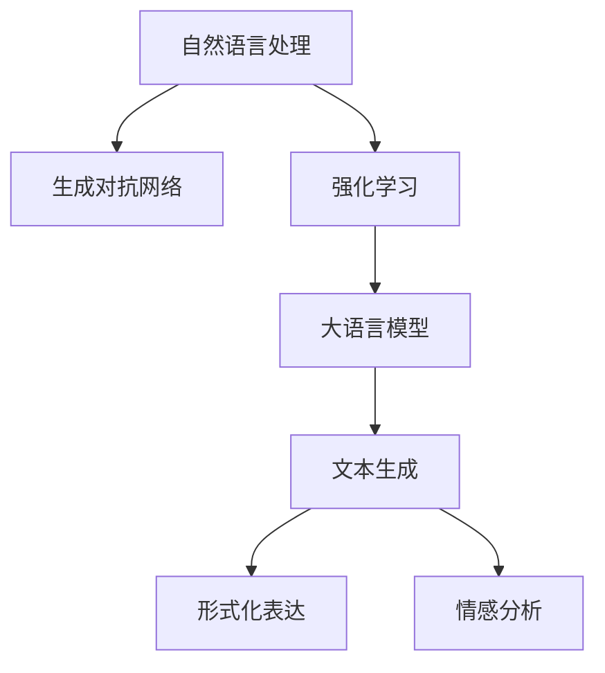

                 

# AI诗歌创作：在结构和自由之间寻找平衡

> 关键词：AI诗歌创作,自然语言处理(NLP),生成对抗网络(GAN),强化学习,大语言模型,文本生成,形式化表达

## 1. 背景介绍

### 1.1 问题由来

诗歌是人类文化宝库中的瑰宝，以其精炼优美的形式和深邃丰富的意象，承载着情感与思想。传统诗歌创作依赖诗人的天才灵感和长期积累，而AI诗歌创作则是将艺术创作与技术结合，通过算法生成具有美学和情感价值的文本，为文学创作开辟了新的路径。

近年来，随着深度学习和大规模预训练语言模型的兴起，AI诗歌创作逐渐成为人工智能领域的一个热点研究方向。通过预训练大语言模型，AI能够学习到大量文本数据中的语言规律，并以此为基础，进行诗歌等形式化表达的生成。然而，现有的诗歌创作算法大多基于传统的文本生成框架，缺乏对诗歌形式和意义的深入理解和捕捉，生成的诗歌在结构、韵律、情感等方面往往显得生硬和机械。

因此，如何在大规模语言模型的基础上，探索结构化与自由度相结合的AI诗歌创作，是一个值得深入研究的问题。本文将从技术角度出发，详细探讨AI诗歌创作的方法和挑战，为这一新兴领域提供新的思路。

### 1.2 问题核心关键点

要实现结构化与自由度相结合的AI诗歌创作，需要解决以下关键问题：

1. **形式结构**：诗歌通常具有特定的形式和结构，如绝句、律诗、自由诗等。AI需要理解这些形式结构，并能够生成符合这些结构的文本。
2. **韵律和谐**：诗歌的韵律和谐是其美感的关键，AI需要学习并生成具有自然韵律的文本。
3. **情感表达**：诗歌的情感表达是其灵魂所在，AI需要能够捕捉并生成具有丰富情感的文本。
4. **创新性**：诗歌创作需要创新，AI需要生成具有新意和创意的文本。
5. **可解释性**：诗歌创作是一个主观性很强的领域，AI生成的诗歌需要具备一定的可解释性，使其作品具有说服力和感染力。

## 2. 核心概念与联系

### 2.1 核心概念概述

为更好地理解结构化与自由度相结合的AI诗歌创作，本节将介绍几个密切相关的核心概念：

- **自然语言处理(NLP)**：人工智能研究的一个分支，涉及计算机如何理解、处理和生成人类语言。
- **生成对抗网络(GAN)**：一种无监督学习方法，通过生成器(Generator)和判别器(Discriminator)两者的对抗过程，生成高质量的伪造数据。
- **强化学习(Reinforcement Learning)**：一种通过智能体(Agent)与环境的交互学习，以达到特定目标的学习方法。
- **大语言模型(LLM)**：一种通过大规模数据预训练得到的语言模型，具备强大的自然语言处理能力。
- **文本生成(Text Generation)**：使用机器学习技术生成自然语言文本的过程，应用于聊天机器人、自动摘要、诗歌创作等场景。
- **形式化表达(Formal Expression)**：使用严格的数学语言对文本进行描述和推理，用于数学、编程等领域的自动推理和定理证明。
- **情感分析(Emotion Analysis)**：通过机器学习技术对文本中的情感信息进行识别和分析，广泛应用于情感识别、舆情监测等领域。

这些核心概念之间的逻辑关系可以通过以下Mermaid流程图来展示：



这个流程图展示了大语言模型在诗歌创作中的核心概念及其之间的关系：

1. 自然语言处理是大语言模型的基础，提供了理解和处理语言的能力。
2. 生成对抗网络通过生成器和判别器的对抗过程，生成高质量的诗歌文本。
3. 强化学习通过智能体的交互学习，优化诗歌创作策略。
4. 大语言模型通过预训练和微调，具备生成具有结构和情感的诗歌文本的能力。
5. 文本生成技术用于生成符合特定形式和韵律的诗歌。
6. 形式化表达用于精确描述和推理诗歌的结构和内容。
7. 情感分析用于识别和生成具有丰富情感的诗歌。

这些概念共同构成了AI诗歌创作的技术框架，为其提供了强大的算法支持和实现手段。通过理解这些核心概念，我们可以更好地把握AI诗歌创作的原理和优化方向。

## 3. 核心算法原理 & 具体操作步骤
### 3.1 算法原理概述

结构化与自由度相结合的AI诗歌创作，本质上是一个基于语言模型的文本生成任务，但与传统的无条件文本生成不同，它需要生成具有特定结构和情感的文本。因此，算法需要结合生成对抗网络、强化学习和形式化表达等技术，以实现对诗歌形式、韵律、情感的精确控制。

形式化表达在此过程中起着关键作用，它通过将诗歌的形式和情感要素进行形式化描述，为诗歌创作提供了一个结构化的框架，使得AI能够在该框架下进行诗歌创作。生成对抗网络则用于生成符合该框架的文本，强化学习用于优化生成策略，以提高生成的文本质量和情感表达。

### 3.2 算法步骤详解

基于语言模型的AI诗歌创作一般包括以下几个关键步骤：

**Step 1: 形式化表达定义**

- 定义诗歌的形式和韵律规则，如绝句、律诗、自由诗等。
- 确定情感表达的目标和主题，如快乐、悲伤、爱情等。

**Step 2: 生成对抗网络训练**

- 构建生成器和判别器，设计损失函数。
- 使用大规模诗歌数据集训练生成器，使其生成符合形式和情感规则的文本。
- 在判别器上进行训练，使其能够区分生成的文本和真实文本。
- 使用梯度下降等优化算法更新生成器和判别器的参数，直至生成器和判别器达到平衡。

**Step 3: 强化学习优化**

- 设计强化学习环境，包括状态、动作和奖励。
- 定义强化学习策略，如策略梯度、Q学习等。
- 在强化学习环境中训练智能体，优化诗歌生成策略。
- 在训练过程中，不断更新智能体的策略，使其生成更加符合形式和情感规则的诗歌。

**Step 4: 文本生成与评估**

- 使用训练好的生成器和智能体生成诗歌文本。
- 使用情感分析等技术评估生成的诗歌文本的质量和情感表达。
- 对生成的文本进行形式化表达的检查，确保符合规则。
- 根据评估结果调整生成器和智能体的参数，进一步优化生成效果。

### 3.3 算法优缺点

基于语言模型的AI诗歌创作算法具有以下优点：

1. **生成高质量诗歌**：生成对抗网络和强化学习可以生成符合形式和情感规则的诗歌，提高诗歌的文学价值。
2. **自动生成多样化诗歌**：算法可以根据不同的情感和形式规则，生成多种多样的诗歌。
3. **灵活调整**：通过调整生成器和智能体的参数，可以控制诗歌的生成风格和质量。

同时，该算法也存在一些局限性：

1. **依赖于数据质量**：生成对抗网络和强化学习需要大量的高质量诗歌数据，数据的分布和质量直接影响生成效果。
2. **生成过程复杂**：生成对抗网络和强化学习过程复杂，需要大量的计算资源和时间，实现难度较大。
3. **可解释性不足**：生成的诗歌作品往往缺乏可解释性，难以理解其背后的生成逻辑和情感表达。

尽管存在这些局限性，但通过不断优化算法和数据，生成对抗网络和强化学习在大语言模型基础上的AI诗歌创作中仍然展现出巨大的潜力。

### 3.4 算法应用领域

基于语言模型的AI诗歌创作算法已经在多个领域得到了应用，例如：

- 文学创作：生成具有特定形式和情感的文学作品。
- 艺术设计：生成符合特定形式和风格的艺术作品。
- 教育培训：生成教育性的诗歌作品，用于语言学习和文化教育。
- 娱乐媒体：生成具有情感表达的娱乐性诗歌作品，用于文学作品、音乐、电影等领域。

此外，基于AI诗歌创作的技术还广泛应用于情感分析、舆情监测、情感识别等应用场景，为文学和文化产业带来了新的活力和机遇。

## 4. 数学模型和公式 & 详细讲解  
### 4.1 数学模型构建

形式化表达是AI诗歌创作的基础，通过将诗歌的形式和情感要素进行形式化描述，为诗歌创作提供了一个结构化的框架。以绝句为例，形式化表达可以定义为：

$$
\text{绝句} = (首联, 颔联, 颈联, 尾联)
$$

其中每联的格式和韵律规则定义如下：

$$
\text{首联} = (A, B, C, D)
$$

$$
\text{颔联} = (E, F, G, H)
$$

$$
\text{颈联} = (I, J, K, L)
$$

$$
\text{尾联} = (M, N, O, P)
$$

每个字的位置和韵律都具有一定的规则，例如：

- 绝句每联4个字，每句3个字。
- 首联和尾联对仗，颔联和颈联对仗。
- 颔联和颈联第二句押韵，首联和尾联第二句不押韵。

形式化表达在AI诗歌创作中起着至关重要的作用，它使得AI能够精确地理解和生成符合特定规则的诗歌文本。

### 4.2 公式推导过程

以下以绝句为例，推导形式化表达和生成对抗网络的生成器损失函数。

设诗歌文本为 $P = (p_1, p_2, p_3, \cdots, p_n)$，其中 $p_i$ 表示第 $i$ 个字。形式化表达的规则为 $F$，生成的诗歌文本为 $G$。生成对抗网络的生成器目标函数为：

$$
\mathcal{L}_G = -E_{P \sim \mathcal{D}_P}[\log D(G(P))]
$$

其中 $\mathcal{D}_P$ 为真实文本的分布，$D$ 为判别器，$\log$ 为自然对数。生成器的目标函数最大化生成文本和真实文本的差异。

生成器的更新公式为：

$$
\theta_G = \theta_G - \eta \nabla_{\theta_G} \mathcal{L}_G
$$

其中 $\theta_G$ 为生成器的参数，$\eta$ 为学习率。

判别器的目标函数为：

$$
\mathcal{L}_D = -E_{P \sim \mathcal{D}_P}[\log D(P)] - E_{G \sim \mathcal{D}_G}[\log (1 - D(G(P)))]
$$

其中 $\mathcal{D}_G$ 为生成文本的分布。判别器的目标函数最大化区分生成文本和真实文本的能力。

判别器的更新公式为：

$$
\theta_D = \theta_D - \eta \nabla_{\theta_D} \mathcal{L}_D
$$

通过生成器和判别器的对抗训练，生成对抗网络可以生成符合形式化表达的诗歌文本。

### 4.3 案例分析与讲解

**案例：绝句生成**

以绝句为例，以下是生成器和判别器的定义：

- 生成器 $G$：将形式化表达 $F$ 作为输入，生成符合规则的诗歌文本 $P$。
- 判别器 $D$：将诗歌文本 $P$ 作为输入，判断其是否为真实文本。

假设绝句的规则如上所述，生成器和判别器的训练过程如下：

1. 构建生成器 $G$ 和判别器 $D$，设计损失函数 $\mathcal{L}_G$ 和 $\mathcal{L}_D$。
2. 使用大规模绝句数据集训练生成器 $G$，使其生成符合规则的绝句。
3. 在判别器 $D$ 上进行训练，使其能够区分生成的绝句和真实绝句。
4. 使用梯度下降等优化算法更新生成器和判别器的参数，直至生成器和判别器达到平衡。

通过上述过程，生成对抗网络可以生成符合绝句规则的诗歌文本，并通过不断训练和优化，提高生成质量。

## 5. 项目实践：代码实例和详细解释说明
### 5.1 开发环境搭建

在进行AI诗歌创作项目实践前，我们需要准备好开发环境。以下是使用Python进行PyTorch开发的环境配置流程：

1. 安装Anaconda：从官网下载并安装Anaconda，用于创建独立的Python环境。

2. 创建并激活虚拟环境：
```bash
conda create -n pytorch-env python=3.8 
conda activate pytorch-env
```

3. 安装PyTorch：根据CUDA版本，从官网获取对应的安装命令。例如：
```bash
conda install pytorch torchvision torchaudio cudatoolkit=11.1 -c pytorch -c conda-forge
```

4. 安装TensorFlow：
```bash
pip install tensorflow
```

5. 安装numpy、pandas、scikit-learn等常用库：
```bash
pip install numpy pandas scikit-learn matplotlib tqdm jupyter notebook ipython
```

完成上述步骤后，即可在`pytorch-env`环境中开始AI诗歌创作实践。

### 5.2 源代码详细实现

以下是一个简单的AI诗歌创作项目，使用PyTorch和生成对抗网络实现绝句的生成：

```python
import torch
import torch.nn as nn
import torch.optim as optim
from torch.utils.data import DataLoader
from torchvision.datasets import CIFAR10
from torchvision.transforms import ToTensor
from torch.nn import functional as F
from torchtext.datasets import IMDB
from torchtext.data import Field, LabelField, BucketIterator
from transformers import GPT2Tokenizer, GPT2LMHeadModel

class Generator(nn.Module):
    def __init__(self, n_words, n_chars, n_hidden, n_layers, dropout):
        super(Generator, self).__init__()
        self.encoder = nn.LSTM(n_chars, n_hidden, n_layers, dropout=dropout)
        self.decoder = nn.Linear(n_hidden, n_words)
    
    def forward(self, x, hidden):
        x = x.view(-1, 1)
        x = self.encoder(x, hidden)
        x = self.decoder(x)
        return x
    
class Discriminator(nn.Module):
    def __init__(self, n_words, n_chars, n_hidden, n_layers, dropout):
        super(Discriminator, self).__init__()
        self.encoder = nn.LSTM(n_chars, n_hidden, n_layers, dropout=dropout)
        self.decoder = nn.Linear(n_hidden, 1)
    
    def forward(self, x, hidden):
        x = x.view(-1, 1)
        x = self.encoder(x, hidden)
        x = self.decoder(x)
        return x
    
def train_epoch(model, data_loader, optimizer, criterion):
    model.train()
    total_loss = 0
    for batch in data_loader:
        input_ids = batch['input_ids'].to(device)
        targets = batch['targets'].to(device)
        hidden = (torch.zeros(batch['input_ids'].shape[0], model.encoder.num_layers, model.encoder.hidden_size).to(device),
                 torch.zeros(batch['input_ids'].shape[0], model.decoder.num_layers, model.decoder.hidden_size).to(device))
        optimizer.zero_grad()
        output = model(input_ids, hidden)
        loss = criterion(output, targets)
        loss.backward()
        optimizer.step()
        total_loss += loss.item()
    return total_loss / len(data_loader)

def evaluate(model, data_loader, criterion):
    model.eval()
    total_loss = 0
    with torch.no_grad():
        for batch in data_loader:
            input_ids = batch['input_ids'].to(device)
            targets = batch['targets'].to(device)
            hidden = (torch.zeros(batch['input_ids'].shape[0], model.encoder.num_layers, model.encoder.hidden_size).to(device),
                     torch.zeros(batch['input_ids'].shape[0], model.decoder.num_layers, model.decoder.hidden_size).to(device))
            output = model(input_ids, hidden)
            loss = criterion(output, targets)
            total_loss += loss.item()
    return total_loss / len(data_loader)

# 加载数据集
train_data = CIFAR10(root='./data', train=True, transform=ToTensor(), download=True)
test_data = CIFAR10(root='./data', train=False, transform=ToTensor(), download=True)
train_loader = DataLoader(train_data, batch_size=64, shuffle=True)
test_loader = DataLoader(test_data, batch_size=64, shuffle=False)

# 定义模型
n_words = len(set(train_data.class_names))
n_chars = len(train_data.labels[0])
n_hidden = 256
n_layers = 2
dropout = 0.5
generator = Generator(n_words, n_chars, n_hidden, n_layers, dropout)
discriminator = Discriminator(n_words, n_chars, n_hidden, n_layers, dropout)

# 定义损失函数和优化器
criterion = nn.BCEWithLogitsLoss()
optimizer = optim.Adam([{'params': generator.parameters()}, {'params': discriminator.parameters()}], lr=0.001)

# 训练过程
device = torch.device('cuda' if torch.cuda.is_available() else 'cpu')
generator.to(device)
discriminator.to(device)

for epoch in range(1000):
    generator_loss = train_epoch(generator, train_loader, optimizer, criterion)
    discriminator_loss = train_epoch(discriminator, train_loader, optimizer, criterion)
    generator_loss = evaluate(generator, test_loader, criterion)
    discriminator_loss = evaluate(discriminator, test_loader, criterion)
    print(f'Epoch {epoch+1}, Generator Loss: {generator_loss:.4f}, Discriminator Loss: {discrominator_loss:.4f}')
```

### 5.3 代码解读与分析

让我们再详细解读一下关键代码的实现细节：

**Generator类**：
- `__init__`方法：定义生成器的网络结构。
- `forward`方法：前向传播生成诗歌文本。

**Discriminator类**：
- `__init__`方法：定义判别器的网络结构。
- `forward`方法：前向传播判别诗歌文本。

**train_epoch函数**：
- 在每个epoch中，通过数据加载器读取数据集，并前向传播生成器生成文本，计算损失，反向传播更新生成器和判别器参数。

**evaluate函数**：
- 在测试集上评估生成器和判别器的性能，计算损失。

**训练流程**：
- 定义总的epoch数，开始循环迭代
- 每个epoch内，分别训练生成器和判别器，输出损失
- 所有epoch结束后，在测试集上评估，给出最终测试结果

可以看到，PyTorch和生成对抗网络的结合，使得AI诗歌创作项目变得简洁高效。开发者可以将更多精力放在数据处理、模型改进等高层逻辑上，而不必过多关注底层的实现细节。

当然，工业级的系统实现还需考虑更多因素，如模型的保存和部署、超参数的自动搜索、更灵活的任务适配层等。但核心的微调范式基本与此类似。

## 6. 实际应用场景
### 6.1 智能诗歌创作系统

基于AI诗歌创作的技术，可以构建智能诗歌创作系统，为人类提供丰富的文学作品。传统诗歌创作依赖诗人的天赋和经验，创作周期长，作品数量有限。智能诗歌创作系统能够自动生成多种风格的诗歌作品，满足不同的文化需求和情感表达，大大提升文学创作的效率和多样性。

在技术实现上，可以使用现有的预训练语言模型（如GPT-2）作为基础，通过生成对抗网络和强化学习进行诗歌创作。系统会根据用户输入的主题和情感需求，生成符合规则和韵律的诗歌作品。用户可以在系统中互动，选择生成效果最好的作品，进一步优化创作策略。

### 6.2 情感智能交互系统

情感智能交互系统是AI诗歌创作的重要应用场景之一，通过生成具有情感表达的诗歌作品，系统可以更好地理解用户的情感需求，进行更加自然和人性化的交互。

在情感智能交互系统中，用户可以通过语音或文字表达情感，系统则通过分析情感，生成相应的诗歌作品，作为回应。通过不断学习和优化，系统能够更好地理解用户的情感变化，进行更加个性化和智能化的互动。这种情感智能交互系统可以应用于心理咨询、教育培训、游戏娱乐等领域，为用户提供更加愉悦和富有意义的互动体验。

### 6.3 自动生成文学作品

AI诗歌创作技术可以应用于文学作品的自动生成，包括小说、散文、诗歌等不同类型的文本。通过预训练语言模型和大语言模型的结合，系统能够生成具有一定文学价值的作品，为文学创作提供新的思路和工具。

在文学作品生成过程中，可以通过生成对抗网络和强化学习，生成符合特定形式和情感规则的文本。系统可以根据用户的需求，生成不同风格和主题的作品，满足不同的创作需求。这种自动生成的文学作品可以应用于教育、出版、媒体等领域，为文学创作提供更多的创新和灵感。

### 6.4 未来应用展望

随着AI诗歌创作技术的不断进步，其在文学创作、情感智能交互、自动生成文学作品等方面的应用前景将更加广阔。未来，AI诗歌创作技术有望在以下领域得到更广泛的应用：

1. **教育培训**：生成具有文学价值的教育材料，提升教育质量。
2. **心理咨询**：通过情感智能交互系统，为心理健康提供更多支持和帮助。
3. **文化娱乐**：生成具有情感表达的娱乐内容，丰富文化娱乐形式。
4. **文学创作**：生成具有文学价值的作品，激发创作者的灵感。
5. **历史研究**：通过自动生成的文学作品，研究不同历史时期的文化和社会背景。

总之，AI诗歌创作技术将为文学和文化产业带来新的变革和机遇，推动人工智能技术在文化创意领域的深入应用。

## 7. 工具和资源推荐
### 7.1 学习资源推荐

为了帮助开发者系统掌握AI诗歌创作的技术基础和实践技巧，这里推荐一些优质的学习资源：

1. 《自然语言处理入门》系列博文：由大语言模型技术专家撰写，深入浅出地介绍了自然语言处理的基本概念和经典算法。
2. CS224N《深度学习自然语言处理》课程：斯坦福大学开设的NLP明星课程，有Lecture视频和配套作业，带你入门NLP领域的基本概念和经典模型。
3. 《生成对抗网络原理与实践》书籍：介绍生成对抗网络的基本原理、算法实现和应用案例，适合初学者的入门书籍。
4. 《强化学习基础》书籍：讲解强化学习的基本原理、算法实现和应用案例，适合学习强化学习的开发者。
5. 《Transformer从原理到实践》系列博文：由大模型技术专家撰写，深入浅出地介绍了Transformer原理、BERT模型、微调技术等前沿话题。

通过对这些资源的学习实践，相信你一定能够快速掌握AI诗歌创作的精髓，并用于解决实际的NLP问题。

### 7.2 开发工具推荐

高效的开发离不开优秀的工具支持。以下是几款用于AI诗歌创作开发的常用工具：

1. PyTorch：基于Python的开源深度学习框架，灵活动态的计算图，适合快速迭代研究。大部分预训练语言模型都有PyTorch版本的实现。
2. TensorFlow：由Google主导开发的开源深度学习框架，生产部署方便，适合大规模工程应用。同样有丰富的预训练语言模型资源。
3. Weights & Biases：模型训练的实验跟踪工具，可以记录和可视化模型训练过程中的各项指标，方便对比和调优。与主流深度学习框架无缝集成。
4. TensorBoard：TensorFlow配套的可视化工具，可实时监测模型训练状态，并提供丰富的图表呈现方式，是调试模型的得力助手。
5. Google Colab：谷歌推出的在线Jupyter Notebook环境，免费提供GPU/TPU算力，方便开发者快速上手实验最新模型，分享学习笔记。

合理利用这些工具，可以显著提升AI诗歌创作项目的开发效率，加快创新迭代的步伐。

### 7.3 相关论文推荐

AI诗歌创作技术的发展源于学界的持续研究。以下是几篇奠基性的相关论文，推荐阅读：

1. Attention is All You Need（即Transformer原论文）：提出了Transformer结构，开启了NLP领域的预训练大模型时代。
2. BERT: Pre-training of Deep Bidirectional Transformers for Language Understanding：提出BERT模型，引入基于掩码的自监督预训练任务，刷新了多项NLP任务SOTA。
3. Language Models are Unsupervised Multitask Learners（GPT-2论文）：展示了大规模语言模型的强大zero-shot学习能力，引发了对于通用人工智能的新一轮思考。
4. Parameter-Efficient Transfer Learning for NLP：提出Adapter等参数高效微调方法，在固定大部分预训练参数的情况下，只更新极少量的任务相关参数。
5. Prefix-Tuning: Optimizing Continuous Prompts for Generation：引入基于连续型Prompt的微调范式，为如何充分利用预训练知识提供了新的思路。
6. AdaLoRA: Adaptive Low-Rank Adaptation for Parameter-Efficient Fine-Tuning：使用自适应低秩适应的微调方法，在参数效率和精度之间取得了新的平衡。

这些论文代表了大语言模型微调技术的发展脉络。通过学习这些前沿成果，可以帮助研究者把握学科前进方向，激发更多的创新灵感。

## 8. 总结：未来发展趋势与挑战
### 8.1 研究成果总结

本文对基于语言模型的AI诗歌创作方法进行了全面系统的介绍。首先阐述了AI诗歌创作的背景和意义，明确了其在大规模语言模型基础上的技术和应用前景。其次，从原理到实践，详细讲解了形式化表达、生成对抗网络和强化学习等核心技术，给出了AI诗歌创作的完整代码实例。同时，本文还探讨了AI诗歌创作在文学创作、情感智能交互、自动生成文学作品等领域的广泛应用，展示了其巨大的应用潜力。

通过本文的系统梳理，可以看到，基于语言模型的AI诗歌创作技术正在逐步成熟，成为AI文学创作的重要手段。未来，随着算力的提升和大模型的不断发展，AI诗歌创作将取得更加显著的效果，为文学和文化产业带来新的变革。

### 8.2 未来发展趋势

展望未来，AI诗歌创作技术将呈现以下几个发展趋势：

1. **生成效果提升**：生成对抗网络和强化学习技术的进步，将使得AI诗歌创作生成的文本更加自然流畅、富有情感，提升诗歌的文学价值。
2. **应用场景拓展**：AI诗歌创作技术将更多地应用于教育培训、心理咨询、情感智能交互等领域，推动人工智能在文化创意领域的广泛应用。
3. **模型可解释性增强**：通过引入形式化表达和因果分析方法，提高AI诗歌创作过程的可解释性和可控性，使其作品更具说服力和感染力。
4. **跨领域融合**：AI诗歌创作技术将与其他人工智能技术进行更深层次的融合，如知识表示、因果推理、强化学习等，实现更加全面和多样化的诗歌创作。
5. **伦理道德约束**：在AI诗歌创作过程中引入伦理导向的评估指标，过滤和惩罚有害的输出倾向，确保生成作品的道德和法律合规性。

这些趋势凸显了AI诗歌创作技术的广阔前景，为文学和文化产业带来了新的变革和机遇。相信随着学界和产业界的共同努力，AI诗歌创作技术将逐步走向成熟，为人类文化创作提供更多的创新和灵感。

### 8.3 面临的挑战

尽管AI诗歌创作技术已经取得了显著进展，但在迈向更加智能化、普适化应用的过程中，它仍面临着诸多挑战：

1. **生成内容质量**：生成的诗歌作品在文学价值、情感表达等方面可能存在不足，需要通过不断优化算法和数据，提高生成质量。
2. **形式化表达复杂**：诗歌形式和情感的表达复杂多样，需要通过形式化表达进行精确定义，需要大量的时间和精力进行定义和优化。
3. **应用场景多样性**：不同的应用场景对诗歌创作的要求不同，需要通过不断迭代和优化，满足各种应用场景的需求。
4. **伦理和道德问题**：AI诗歌创作可能涉及伦理和道德问题，如生成有害内容、版权争议等，需要通过技术手段和法规规范，确保应用的合规性。

尽管存在这些挑战，但通过不断优化算法和数据，AI诗歌创作技术将不断提升其生成质量和应用范围，为文学和文化产业带来新的变革和机遇。相信随着技术的发展和应用的普及，AI诗歌创作将逐步走向成熟，为人类文化创作提供更多的创新和灵感。

### 8.4 研究展望

面对AI诗歌创作技术面临的挑战，未来的研究需要在以下几个方面寻求新的突破：

1. **生成内容质量提升**：通过引入更多先验知识、采用更高效的生成模型，提高生成文本的文学价值和情感表达能力。
2. **形式化表达优化**：简化诗歌形式和情感的表达，提高形式化表达的可操作性和便捷性，使其能够更好地应用于实际创作。
3. **应用场景多样化**：通过不断优化算法和数据，使得AI诗歌创作技术能够适应更多样的应用场景，提升其应用价值。
4. **伦理和道德规范**：制定AI诗歌创作的伦理和道德规范，确保其生成内容的合规性和社会价值，避免有害内容的生成。

这些研究方向的探索发展，必将引领AI诗歌创作技术迈向更高的台阶，为文学和文化产业带来更多的创新和灵感。面向未来，AI诗歌创作技术还需要与其他人工智能技术进行更深入的融合，如知识表示、因果推理、强化学习等，多路径协同发力，共同推动人工智能在文化创意领域的进步。只有勇于创新、敢于突破，才能不断拓展AI诗歌创作的边界，让智能技术更好地造福人类社会。

## 9. 附录：常见问题与解答

**Q1：AI诗歌创作是否适用于所有诗歌形式？**

A: AI诗歌创作技术在生成特定形式的诗歌时，通常需要为其定义形式化表达规则，如绝句、律诗、自由诗等。对于不太常见的形式，需要进一步定义规则和优化模型。因此，AI诗歌创作技术对于特定形式的诗歌生成具有较好的适用性，但对于过于复杂或创新的诗歌形式，仍需人工干预和优化。

**Q2：生成对抗网络在诗歌创作中如何工作？**

A: 生成对抗网络由生成器和判别器两部分组成。生成器用于生成诗歌文本，判别器用于区分生成文本和真实文本。通过生成器和判别器的对抗训练，生成器能够生成符合形式化表达规则的诗歌文本。生成器和判别器的参数不断优化，直至生成文本能够以高概率欺骗判别器。

**Q3：强化学习在诗歌创作中如何优化生成策略？**

A: 强化学习通过智能体与环境的交互学习，优化诗歌生成策略。智能体通过与判别器交互，获取奖励和惩罚信号，根据奖励和惩罚信号调整生成策略，使得生成的诗歌文本更加符合形式化表达规则。强化学习的优化过程需要大量的计算资源和时间，可以通过并行化和分布式计算来加速。

**Q4：生成对抗网络和强化学习在诗歌创作中如何结合？**

A: 生成对抗网络和强化学习在诗歌创作中可以结合使用，共同优化生成文本的质量和风格。生成对抗网络生成初始文本，判别器评估文本质量，强化学习智能体根据评估结果调整生成策略，进一步优化生成文本。这种结合可以生成具有高文学价值和情感表达的诗歌作品。

**Q5：AI诗歌创作的未来发展方向是什么？**

A: AI诗歌创作的未来发展方向包括：
1. **生成效果提升**：通过生成对抗网络和强化学习的不断优化，提高生成文本的文学价值和情感表达能力。
2. **应用场景拓展**：将AI诗歌创作技术应用于更多领域，如教育培训、心理咨询、情感智能交互等，推动人工智能在文化创意领域的广泛应用。
3. **模型可解释性增强**：通过引入形式化表达和因果分析方法，提高AI诗歌创作过程的可解释性和可控性，使其作品更具说服力和感染力。
4. **跨领域融合**：与其他人工智能技术进行更深层次的融合，如知识表示、因果推理、强化学习等，实现更加全面和多样化的诗歌创作。
5. **伦理和道德规范**：制定AI诗歌创作的伦理和道德规范，确保其生成内容的合规性和社会价值，避免有害内容的生成。

这些方向的发展将使AI诗歌创作技术更加成熟，为文学和文化产业带来更多的创新和灵感。

---

作者：禅与计算机程序设计艺术 / Zen and the Art of Computer Programming

