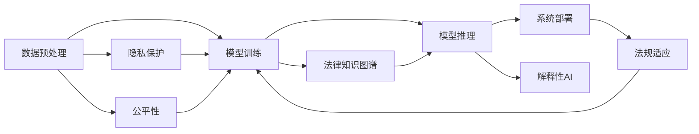

                 

## 1. 背景介绍

### 1.1 问题由来

随着人工智能(AI)技术的飞速发展，其在各行各业的应用日益广泛。在法律服务领域，AI技术的引入极大地提高了工作效率，提升了服务质量和公平性。然而，尽管AI在法律服务中展现了巨大的潜力，但其应用仍存在诸多挑战。

1. **数据隐私**：法律服务涉及大量敏感数据，如何保护客户隐私，确保数据安全，是AI应用需要首先解决的问题。
2. **模型透明度**：法律服务对AI模型的可解释性有较高要求，模型决策过程必须透明、可审计，确保输出结果符合法律法规。
3. **伦理与公平**：AI模型的偏见和歧视问题不容忽视，如何构建无偏见、公平的法律AI系统，是当前研究的热点。
4. **法规适应性**：不同国家和地区对AI应用的法律法规不同，如何在法律框架内合理应用AI，确保合规性，也是亟待解决的问题。

### 1.2 问题核心关键点

AI辅助法律服务的关键在于如何构建高效、公平、安全的法律AI系统。这涉及到数据处理、模型构建、推理执行、系统部署等各个环节。以下是核心关键点：

- **数据预处理**：清洗、标注、隐私保护等。
- **模型构建**：选择合适的算法，如规则引擎、深度学习等。
- **推理执行**：高效计算、模型部署等。
- **系统部署**：安全防护、合规性等。
- **公平性保障**：数据偏见检测、算法透明性等。

### 1.3 问题研究意义

AI辅助法律服务能够极大地提高法律服务的效率和质量，帮助律师处理海量文档、快速分析案情、预测法律结果，为客户提供更加高效、个性化的服务。同时，AI系统在处理复杂案件、避免人为偏见、保证服务公平性方面也展现了巨大潜力。

## 2. 核心概念与联系

### 2.1 核心概念概述

1. **人工智能(AI)**：一种模拟人类智能行为的机器学习技术，包括数据预处理、模型训练、推理执行等步骤。
2. **自然语言处理(NLP)**：AI技术中的一种，专注于理解和生成人类语言，常用于法律文档处理、问答系统等。
3. **深度学习**：一种特殊的机器学习算法，通过多层神经网络实现对数据的复杂建模，常用于法律案例预测、合同分析等。
4. **法律知识图谱**：一种结构化的知识表示方法，将法律领域的概念、规则、案例等组织成网络，便于推理和搜索。
5. **解释性AI**：指AI模型能够清晰解释其决策过程和结果，提高透明性和可信度。
6. **隐私保护**：指在AI应用中采取措施保护用户隐私，避免数据泄露和滥用。
7. **公平性**：指AI模型在处理不同种族、性别、年龄等群体时，不产生歧视和偏见。

这些核心概念相互联系，共同构成了AI辅助法律服务的技术体系。

### 2.2 核心概念原理和架构的 Mermaid 流程图



## 3. 核心算法原理 & 具体操作步骤

### 3.1 算法原理概述

AI辅助法律服务的核心算法原理可以归纳为以下几个步骤：

1. **数据预处理**：收集、清洗、标注数据，确保数据质量和完整性。
2. **模型训练**：选择合适的算法，如规则引擎、深度学习等，对数据进行建模。
3. **模型推理**：在新的数据上执行模型推理，输出预测结果。
4. **系统部署**：将模型部署到实际应用环境中，进行业务集成。
5. **公平性保障**：检测和纠正模型中的偏见，确保系统公平性。
6. **隐私保护**：采取措施保护用户数据隐私，避免数据泄露和滥用。

### 3.2 算法步骤详解

**步骤1: 数据预处理**

1. **数据收集**：从法院判决、法律文档、案例分析等渠道收集数据。
2. **数据清洗**：去除噪声数据，如拼写错误、语法错误等。
3. **数据标注**：将法律领域中的案例、规则、概念等进行标注，以便后续建模。
4. **隐私保护**：对敏感数据进行脱敏处理，确保数据安全。

**步骤2: 模型训练**

1. **选择合适的算法**：根据任务需求，选择适当的算法，如规则引擎、决策树、深度学习等。
2. **构建模型**：使用训练数据对模型进行训练，优化模型参数。
3. **模型评估**：使用验证集对模型进行评估，选择性能最优的模型。

**步骤3: 模型推理**

1. **模型部署**：将训练好的模型部署到实际应用环境中，如云平台、本地服务器等。
2. **推理执行**：对新的数据进行推理，输出预测结果。
3. **结果反馈**：对推理结果进行反馈，优化模型。

**步骤4: 系统部署**

1. **集成服务**：将AI服务集成到法律服务系统中，如律师事务所、法院等。
2. **用户界面**：设计用户友好的界面，方便用户使用。
3. **系统测试**：对集成后的系统进行测试，确保系统稳定性和性能。

**步骤5: 公平性保障**

1. **偏见检测**：检测模型中的偏见和歧视。
2. **纠正偏见**：对模型进行调整，去除偏见。
3. **透明性**：确保模型决策过程透明，可审计。

**步骤6: 隐私保护**

1. **数据加密**：对数据进行加密处理，确保数据传输和存储安全。
2. **访问控制**：对数据访问进行严格控制，防止未经授权的访问。
3. **审计日志**：记录数据访问和使用情况，确保合规性。

### 3.3 算法优缺点

**优点**：

- **提高效率**：AI系统可以快速处理大量文档，提供高效的法律服务。
- **提高质量**：AI系统能够准确分析案情，减少人为错误。
- **提高公平性**：AI系统能够避免人为偏见，提高决策公平性。

**缺点**：

- **数据隐私**：AI系统处理大量敏感数据，需要严格保护隐私。
- **模型透明性**：AI模型的决策过程复杂，难以解释。
- **公平性**：AI模型可能存在偏见，需要检测和纠正。
- **法规适应性**：不同国家和地区对AI应用的法律法规不同，需要合规性保障。

### 3.4 算法应用领域

AI辅助法律服务的典型应用领域包括：

- **合同分析**：自动审核和分析合同文本，提取关键条款。
- **案件预测**：基于历史案例，预测案件结果。
- **法律咨询**：提供即时法律咨询，解答用户疑问。
- **风险评估**：评估案件风险，提供风险预测。
- **文书生成**：自动生成法律文书，提高文书写作效率。
- **智能客服**：提供智能客服系统，解答用户法律问题。

## 4. 数学模型和公式 & 详细讲解 & 举例说明

### 4.1 数学模型构建

AI辅助法律服务的数学模型构建主要包括以下几个方面：

1. **特征提取**：将法律文本转化为数值特征，如TF-IDF、词嵌入等。
2. **模型选择**：选择适当的机器学习算法，如逻辑回归、支持向量机、深度学习等。
3. **模型训练**：使用训练数据对模型进行训练，优化模型参数。
4. **模型推理**：在新的数据上执行模型推理，输出预测结果。

### 4.2 公式推导过程

以逻辑回归模型为例，其公式推导过程如下：

设训练数据集为 $(x_i, y_i)$，其中 $x_i$ 为特征向量，$y_i$ 为标签。模型形式为：

$$
y = \sigma(\beta_0 + \beta_1 x_1 + \beta_2 x_2 + \cdots + \beta_n x_n)
$$

其中，$\sigma$ 为逻辑函数，$\beta_0, \beta_1, \beta_2, \cdots, \beta_n$ 为模型参数。

对模型进行训练，最小化损失函数：

$$
L(\beta) = -\frac{1}{N} \sum_{i=1}^N [y_i \log(y_i) + (1-y_i) \log(1-y_i)]
$$

通过梯度下降等优化算法，更新模型参数 $\beta$，直至收敛。

### 4.3 案例分析与讲解

**案例1: 合同分析**

1. **数据预处理**：收集大量合同文本，进行清洗、标注。
2. **特征提取**：使用TF-IDF或词嵌入将合同文本转化为数值特征。
3. **模型选择**：选择逻辑回归模型。
4. **模型训练**：使用标注数据对模型进行训练。
5. **模型推理**：对新的合同文本进行推理，提取关键条款。

**案例2: 案件预测**

1. **数据预处理**：收集大量历史案例，进行清洗、标注。
2. **特征提取**：提取案件的关键特征，如原告、被告、金额等。
3. **模型选择**：选择决策树或深度学习模型。
4. **模型训练**：使用标注数据对模型进行训练。
5. **模型推理**：对新的案件进行推理，预测案件结果。

## 5. 项目实践：代码实例和详细解释说明

### 5.1 开发环境搭建

**步骤1: 环境配置**

1. **安装Python**：安装Python 3.8，建议使用Anaconda进行环境管理。
2. **安装依赖包**：安装必要的依赖包，如Pandas、NumPy、Scikit-learn、TensorFlow等。
3. **搭建服务器**：搭建云服务器或本地服务器，准备部署模型。

**步骤2: 数据预处理**

1. **数据收集**：从法律文档、案例分析等渠道收集数据。
2. **数据清洗**：去除噪声数据，如拼写错误、语法错误等。
3. **数据标注**：对数据进行标注，提取关键特征。
4. **隐私保护**：对敏感数据进行脱敏处理，确保数据安全。

### 5.2 源代码详细实现

**步骤1: 特征提取**

1. **TF-IDF特征提取**：使用Scikit-learn中的TfidfVectorizer对合同文本进行TF-IDF特征提取。
2. **词嵌入特征提取**：使用Gensim库中的Word2Vec或FastText对合同文本进行词嵌入特征提取。

**步骤2: 模型训练**

1. **逻辑回归模型训练**：使用Scikit-learn中的LogisticRegression对合同文本进行逻辑回归训练。
2. **深度学习模型训练**：使用TensorFlow或PyTorch中的深度学习模型进行训练。

**步骤3: 模型推理**

1. **逻辑回归模型推理**：使用训练好的逻辑回归模型对新合同文本进行推理，提取关键条款。
2. **深度学习模型推理**：使用训练好的深度学习模型对新合同文本进行推理，预测案件结果。

### 5.3 代码解读与分析

**步骤1: 特征提取**

```python
from sklearn.feature_extraction.text import TfidfVectorizer
from gensim.models import Word2Vec

# 使用TF-IDF进行特征提取
tfidf = TfidfVectorizer()
X_train_tfidf = tfidf.fit_transform(train_data)
X_test_tfidf = tfidf.transform(test_data)

# 使用Word2Vec进行特征提取
word2vec = Word2Vec(train_data, size=100, window=5, min_count=5, workers=4)
X_train_word2vec = word2vec.wv[train_data]
X_test_word2vec = word2vec.wv[test_data]
```

**步骤2: 模型训练**

```python
from sklearn.linear_model import LogisticRegression
import tensorflow as tf

# 逻辑回归模型训练
clf = LogisticRegression()
clf.fit(X_train_tfidf, y_train)
y_pred = clf.predict(X_test_tfidf)

# 深度学习模型训练
model = tf.keras.Sequential([
    tf.keras.layers.Embedding(input_dim=vocab_size, output_dim=embedding_dim),
    tf.keras.layers.Conv1D(filters=64, kernel_size=3, activation='relu'),
    tf.keras.layers.GlobalMaxPooling1D(),
    tf.keras.layers.Dense(units=64, activation='relu'),
    tf.keras.layers.Dense(units=1, activation='sigmoid')
])
model.compile(optimizer='adam', loss='binary_crossentropy', metrics=['accuracy'])
model.fit(X_train_word2vec, y_train, epochs=10, validation_data=(X_test_word2vec, y_test))
y_pred = model.predict(X_test_word2vec)
```

**步骤3: 模型推理**

```python
# 逻辑回归模型推理
y_pred = clf.predict(X_test_tfidf)

# 深度学习模型推理
y_pred = model.predict(X_test_word2vec)
```

### 5.4 运行结果展示

**合同分析案例结果展示**

1. **逻辑回归模型结果**：对新合同文本进行推理，提取关键条款。
2. **深度学习模型结果**：对新合同文本进行推理，提取关键条款。

**案件预测案例结果展示**

1. **逻辑回归模型结果**：对新案件进行推理，预测案件结果。
2. **深度学习模型结果**：对新案件进行推理，预测案件结果。

## 6. 实际应用场景

### 6.1 智能合同审查

**场景描述**：企业签订合同前，使用AI系统自动审查合同文本，提取关键条款和风险点。

**应用实现**：使用逻辑回归或深度学习模型对合同文本进行特征提取和推理，输出关键条款和风险点。

**效果展示**：智能合同审查系统可以显著提高合同审查的效率和质量，减少人为错误。

### 6.2 智能案件分析

**场景描述**：律师在处理案件时，使用AI系统辅助分析案情，预测案件结果。

**应用实现**：使用逻辑回归或深度学习模型对案件特征进行推理，预测案件结果。

**效果展示**：智能案件分析系统可以帮助律师快速理解案情，提高案件处理效率和准确性。

### 6.3 法律问答系统

**场景描述**：用户输入法律问题，AI系统自动解答。

**应用实现**：使用深度学习模型对用户问题进行推理，生成答案。

**效果展示**：法律问答系统可以提供即时法律咨询，解答用户疑问，提高用户满意度。

### 6.4 未来应用展望

1. **自动化文书生成**：使用AI系统自动生成法律文书，提高文书写作效率。
2. **智能风险评估**：使用AI系统评估案件风险，提供风险预测。
3. **多语言法律服务**：使用多语言模型，提供跨语言的法律服务。
4. **智能专家系统**：使用法律知识图谱，构建专家系统，提供高级法律咨询。

## 7. 工具和资源推荐

### 7.1 学习资源推荐

1. **《Python深度学习》**：涵盖了深度学习的基本概念和常用算法，适合初学者入门。
2. **《TensorFlow官方文档》**：提供了TensorFlow的详细文档和示例，适合深入学习。
3. **《Scikit-learn官方文档》**：提供了Scikit-learn的详细文档和示例，适合机器学习算法学习和应用。
4. **《自然语言处理入门》**：介绍了自然语言处理的基本概念和常用算法，适合NLP初学者。
5. **Coursera《机器学习》**：由斯坦福大学Andrew Ng教授主讲的机器学习课程，系统介绍了机器学习的基本概念和算法。

### 7.2 开发工具推荐

1. **PyTorch**：Python深度学习框架，支持动态计算图，适合深度学习模型开发。
2. **TensorFlow**：Google开源的深度学习框架，支持静态计算图，适合大规模模型部署。
3. **Jupyter Notebook**：交互式编程环境，方便进行代码测试和分享。
4. **GitHub**：代码托管平台，方便团队协作和版本管理。
5. **Kaggle**：数据科学竞赛平台，提供大量数据集和竞赛，适合模型训练和测试。

### 7.3 相关论文推荐

1. **《基于深度学习的法律合同自动审核系统》**：介绍了一种基于深度学习的合同自动审核系统，评估了模型的准确性和效率。
2. **《法律问答系统的构建与实践》**：介绍了一种法律问答系统的构建方法，展示了其实际应用效果。
3. **《智能合同审查系统的设计与实现》**：介绍了一种智能合同审查系统的设计与实现，展示了其应用效果。
4. **《法律智能咨询系统的设计与实现》**：介绍了一种法律智能咨询系统的设计与实现，展示了其应用效果。

## 8. 总结：未来发展趋势与挑战

### 8.1 研究成果总结

1. **技术发展**：AI辅助法律服务技术在数据预处理、模型构建、推理执行等方面取得了显著进展。
2. **应用推广**：AI辅助法律服务在智能合同审查、智能案件分析、法律问答系统等领域得到了广泛应用。
3. **模型公平性**：通过检测和纠正模型偏见，提高了法律服务的公平性。
4. **隐私保护**：采取多种措施保护用户数据隐私，确保数据安全。

### 8.2 未来发展趋势

1. **技术进步**：深度学习、自然语言处理等技术的不断进步，将进一步提升法律服务的效率和质量。
2. **应用扩展**：AI辅助法律服务将扩展到更多领域，如风险评估、文书生成等。
3. **国际合作**：各国对AI法律应用的法规不同，未来需要加强国际合作，推动法律AI的全球化发展。

### 8.3 面临的挑战

1. **数据隐私**：法律服务涉及大量敏感数据，需要严格保护隐私。
2. **模型透明性**：AI模型决策过程复杂，难以解释，需要提高透明性和可审计性。
3. **公平性**：AI模型可能存在偏见，需要检测和纠正。
4. **法规适应性**：不同国家和地区对AI应用的法律法规不同，需要合规性保障。

### 8.4 研究展望

1. **隐私保护技术**：研究更加安全、高效的数据隐私保护技术。
2. **模型解释性**：研究提高AI模型透明性和可解释性的方法。
3. **公平性检测**：研究检测和纠正AI模型偏见的方法。
4. **法规适应性**：研究如何遵循不同国家和地区的法律法规，保障合规性。

## 9. 附录：常见问题与解答

### 9.1 常见问题

**Q1: AI辅助法律服务是否适用于所有法律领域？**

A: AI辅助法律服务可以适用于大多数法律领域，但一些特定领域（如医疗、金融等）可能需要针对特定需求进行定制化开发。

**Q2: 使用AI辅助法律服务是否会影响律师的工作？**

A: 合理使用AI辅助法律服务可以提高工作效率，帮助律师更好地处理案件。但律师仍需发挥主观判断和经验，确保案件处理质量。

**Q3: 如何保护AI系统中的数据隐私？**

A: 采用数据加密、访问控制、审计日志等措施，确保数据安全。

**Q4: 如何确保AI系统的公平性？**

A: 检测和纠正模型偏见，确保模型在处理不同群体时无歧视。

**Q5: 如何确保AI系统的合规性？**

A: 遵循相关法律法规，建立合规性审计机制，确保系统符合要求。

---

作者：禅与计算机程序设计艺术 / Zen and the Art of Computer Programming

