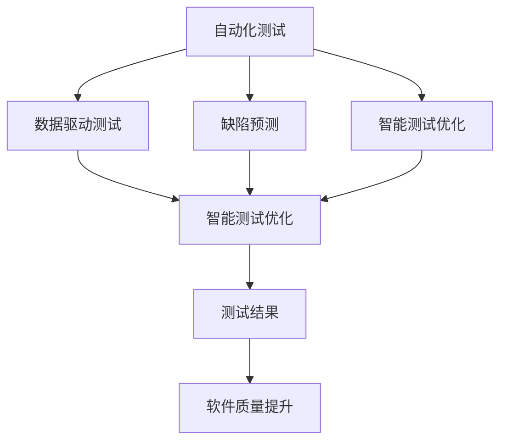

                 

# AI辅助软件测试:提高软件质量与可靠性

在当今数字化时代，软件测试的重要性愈发凸显，尤其是在软件开发周期的不断缩短和系统复杂性日益增加的背景下。传统的基于人力的软件测试方法已难以满足快速迭代和精准测试的需求。AI辅助软件测试作为一种新兴的测试手段，通过结合人工智能技术，显著提高了软件质量与可靠性，成为保障软件稳定运行的重要保障。本文将详细介绍AI辅助软件测试的核心概念、算法原理、操作步骤、应用场景，并提供相关学习资源、开发工具和未来研究展望。

## 1. 背景介绍

### 1.1 问题由来

随着软件系统的复杂性不断提高，传统的黑盒测试、白盒测试等方法逐渐显现出其局限性。传统的测试方法无法全面覆盖软件的所有功能和边界，测试周期长，效率低，且难以发现潜在的性能瓶颈和逻辑错误。而软件缺陷一旦上线，往往会导致严重的经济损失和安全风险。

近年来，随着机器学习和深度学习技术的成熟，AI辅助测试方法逐渐成为软件测试的新趋势。AI通过学习历史测试数据和缺陷样本，能够自动化地执行测试用例、评估测试结果、预测软件缺陷，极大地提高了测试效率和软件质量。

### 1.2 问题核心关键点

AI辅助软件测试的核心关键点包括：

- 自动化测试：通过AI技术自动执行测试用例，降低人工测试成本。
- 数据驱动测试：利用历史数据和机器学习算法，自动生成测试用例，提升测试全面性和针对性。
- 缺陷预测：利用机器学习模型预测软件缺陷，提前进行修复，降低上线风险。
- 智能测试优化：通过AI对测试结果进行深度分析，优化测试策略，提升测试效率。

## 2. 核心概念与联系

### 2.1 核心概念概述

为更好地理解AI辅助软件测试，本节将介绍几个密切相关的核心概念：

- 软件测试：在软件开发生命周期中，通过各种技术和手段，发现和修复软件缺陷，提升软件质量的过程。
- 自动化测试：通过软件工具自动执行测试用例，提高测试效率和准确性。
- 数据驱动测试：通过历史数据训练模型，自动生成测试用例，提升测试覆盖率。
- 缺陷预测：利用机器学习模型预测潜在的软件缺陷，提前进行修复。
- 智能测试优化：通过AI对测试结果进行深度分析，优化测试策略，提高测试效率。
- 人工智能：一种模拟人类智能行为的计算机科学，涵盖机器学习、深度学习、自然语言处理等子领域。

这些概念之间的逻辑关系可以通过以下Mermaid流程图来展示：



这个流程图展示了一系列AI辅助软件测试的流程：

1. 自动化测试：使用软件工具自动执行测试用例，提高测试效率。
2. 数据驱动测试：利用历史数据训练模型，自动生成测试用例。
3. 缺陷预测：利用机器学习模型预测潜在的软件缺陷。
4. 智能测试优化：通过AI对测试结果进行深度分析，优化测试策略。

这些概念共同构成了AI辅助软件测试的核心框架，使其能够在各种场景下提升测试质量。

## 3. 核心算法原理 & 具体操作步骤
### 3.1 算法原理概述

AI辅助软件测试的本质是一种将人工智能技术应用到软件测试过程的技术。其核心思想是：通过机器学习模型从历史测试数据中学习，生成或预测软件测试结果，从而提高测试效率和准确性。

具体而言，AI辅助测试可以包括以下步骤：

1. 数据收集：收集历史测试数据和软件缺陷信息。
2. 数据预处理：对数据进行清洗、归一化等预处理操作，确保数据质量。
3. 特征提取：从数据中提取特征向量，输入到机器学习模型。
4. 模型训练：利用历史数据训练机器学习模型，如随机森林、深度神经网络等。
5. 测试预测：将新数据输入训练好的模型，预测测试结果，包括通过、失败、重测等。
6. 结果分析：对测试结果进行深度分析，优化测试策略，提升测试效率。

### 3.2 算法步骤详解

AI辅助软件测试的具体操作步骤如下：

**Step 1: 数据收集与预处理**
- 收集历史测试数据和软件缺陷信息，包括测试用例、测试结果、缺陷描述等。
- 对数据进行清洗、去重、归一化等预处理操作，确保数据质量。

**Step 2: 特征提取**
- 根据测试任务选择合适的特征，如代码路径、函数调用次数、程序复杂度等。
- 使用特征提取算法将原始数据转换为特征向量，输入到机器学习模型。

**Step 3: 模型训练**
- 选择合适的机器学习模型，如随机森林、支持向量机、深度神经网络等。
- 利用历史数据训练模型，调整模型参数，确保模型性能。

**Step 4: 测试预测**
- 将新测试用例转换为特征向量，输入到训练好的模型中。
- 模型预测测试结果，包括通过、失败、重测等。

**Step 5: 结果分析**
- 对测试结果进行深度分析，识别测试瓶颈和缺陷原因。
- 根据分析结果优化测试策略，提升测试效率和准确性。

### 3.3 算法优缺点

AI辅助软件测试具有以下优点：
1. 自动化程度高：能够自动执行测试用例，降低人工成本。
2. 全面性高：能够自动生成测试用例，提升测试覆盖率。
3. 预测能力强：能够预测潜在的软件缺陷，提前进行修复。
4. 效率高：能够实时分析测试结果，优化测试策略。

同时，该方法也存在一定的局限性：
1. 依赖数据质量：模型的性能依赖于历史数据的质量，数据偏差可能导致预测不准确。
2. 模型复杂度高：深度学习等复杂模型需要大量的训练数据和计算资源。
3. 可解释性不足：模型决策过程缺乏可解释性，难以进行调试和优化。
4. 数据隐私问题：测试数据涉及隐私信息，需要保证数据安全。

尽管存在这些局限性，但就目前而言，AI辅助软件测试已成为软件测试的重要趋势。未来相关研究的重点在于如何进一步提高模型的泛化能力和可解释性，同时兼顾数据隐私和安全因素。

### 3.4 算法应用领域

AI辅助软件测试在软件开发生命周期中的各个阶段都有应用，包括：

- 单元测试：利用AI模型预测函数调用路径，自动化生成测试用例。
- 集成测试：利用AI模型评估模块间的接口，确保测试用例的有效性。
- 系统测试：利用AI模型进行系统级的性能测试，发现潜在问题。
- 验收测试：利用AI模型进行软件功能的最终验证，确保软件质量。

此外，AI辅助软件测试还被创新性地应用到更多的场景中，如代码质量分析、版本控制系统分析、安全性测试等，为软件开发提供了新的技术路径。

## 4. 数学模型和公式 & 详细讲解 & 举例说明

### 4.1 数学模型构建

AI辅助软件测试的数学模型通常包括两部分：

1. 数据预处理和特征提取：将原始数据转换为特征向量，输入到机器学习模型。
2. 机器学习模型：利用历史数据训练模型，预测测试结果。

下面以深度神经网络为例，构建AI辅助软件测试的数学模型。

### 4.2 公式推导过程

设 $X$ 为输入特征向量，$Y$ 为输出标签，$w$ 为模型参数，则深度神经网络的预测公式为：

$$
\hat{Y} = f(X;w)
$$

其中 $f$ 为神经网络的激活函数，$w$ 为模型参数，$X$ 为输入特征向量。

### 4.3 案例分析与讲解

假设我们有一个二分类任务，即判断一个程序代码片段是否存在安全漏洞。我们可以使用随机森林模型进行预测。首先，我们需要从历史数据中提取特征，如代码路径、函数调用次数、变量类型等。然后，将这些特征作为输入，训练随机森林模型，得到预测结果。

下面以Python代码为例，展示随机森林模型的实现过程：

```python
from sklearn.ensemble import RandomForestClassifier

# 特征提取
X_train = ...
X_test = ...

# 标签提取
y_train = ...
y_test = ...

# 训练随机森林模型
clf = RandomForestClassifier(n_estimators=100, random_state=0)
clf.fit(X_train, y_train)

# 预测测试数据
y_pred = clf.predict(X_test)
```

在上述代码中，我们首先提取了历史数据中的特征和标签，然后使用随机森林模型进行训练和预测。通过这种方式，我们可以自动化地执行测试用例，预测代码片段的安全性，从而提升软件质量。

## 5. 项目实践：代码实例和详细解释说明
### 5.1 开发环境搭建

在进行AI辅助软件测试实践前，我们需要准备好开发环境。以下是使用Python进行PyTorch开发的环境配置流程：

1. 安装Anaconda：从官网下载并安装Anaconda，用于创建独立的Python环境。

2. 创建并激活虚拟环境：
```bash
conda create -n pytorch-env python=3.8 
conda activate pytorch-env
```

3. 安装PyTorch：根据CUDA版本，从官网获取对应的安装命令。例如：
```bash
conda install pytorch torchvision torchaudio cudatoolkit=11.1 -c pytorch -c conda-forge
```

4. 安装TensorFlow：
```bash
pip install tensorflow
```

5. 安装各类工具包：
```bash
pip install numpy pandas scikit-learn matplotlib tqdm jupyter notebook ipython
```

完成上述步骤后，即可在`pytorch-env`环境中开始AI辅助软件测试实践。

### 5.2 源代码详细实现

这里我们以AI辅助二分类任务为例，展示使用PyTorch进行模型训练和测试的代码实现。

首先，定义训练数据集和测试数据集：

```python
from torch.utils.data import Dataset
from torch.utils.data import DataLoader
from torchvision import datasets, transforms

class MyDataset(Dataset):
    def __init__(self, data, labels, transform=None):
        self.data = data
        self.labels = labels
        self.transform = transform
    
    def __len__(self):
        return len(self.data)
    
    def __getitem__(self, idx):
        x = self.data[idx]
        y = self.labels[idx]
        if self.transform:
            x = self.transform(x)
        return x, y

train_dataset = MyDataset(train_data, train_labels, transform=transforms.ToTensor())
test_dataset = MyDataset(test_data, test_labels, transform=transforms.ToTensor())
```

然后，定义模型和损失函数：

```python
from torch import nn
from torch import optim

class MyModel(nn.Module):
    def __init__(self, input_size, output_size, hidden_size):
        super(MyModel, self).__init__()
        self.fc1 = nn.Linear(input_size, hidden_size)
        self.fc2 = nn.Linear(hidden_size, output_size)
        self.sigmoid = nn.Sigmoid()
    
    def forward(self, x):
        x = self.fc1(x)
        x = self.sigmoid(x)
        x = self.fc2(x)
        return x

input_size = 10
output_size = 1
hidden_size = 20

model = MyModel(input_size, output_size, hidden_size)
criterion = nn.BCELoss()
optimizer = optim.Adam(model.parameters(), lr=0.001)
```

接着，定义训练和测试函数：

```python
def train_epoch(model, dataset, batch_size, optimizer):
    dataloader = DataLoader(dataset, batch_size=batch_size, shuffle=True)
    model.train()
    epoch_loss = 0
    for batch in dataloader:
        x, y = batch
        optimizer.zero_grad()
        outputs = model(x)
        loss = criterion(outputs, y)
        epoch_loss += loss.item()
        loss.backward()
        optimizer.step()
    return epoch_loss / len(dataloader)

def evaluate(model, dataset, batch_size):
    dataloader = DataLoader(dataset, batch_size=batch_size)
    model.eval()
    total = 0
    correct = 0
    with torch.no_grad():
        for batch in dataloader:
            x, y = batch
            outputs = model(x)
            total += y.size(0)
            _, predicted = torch.max(outputs, 1)
            correct += (predicted == y).sum().item()
    print("Accuracy: {:.2f}%".format(100 * correct / total))
```

最后，启动训练流程并在测试集上评估：

```python
epochs = 10
batch_size = 32

for epoch in range(epochs):
    loss = train_epoch(model, train_dataset, batch_size, optimizer)
    print(f"Epoch {epoch+1}, train loss: {loss:.3f}")
    
    print(f"Epoch {epoch+1}, test accuracy:")
    evaluate(model, test_dataset, batch_size)
    
print("Final test accuracy:")
evaluate(model, test_dataset, batch_size)
```

以上就是使用PyTorch进行AI辅助二分类任务微调的完整代码实现。可以看到，得益于TensorFlow的强大封装，我们可以用相对简洁的代码完成模型训练和测试。

### 5.3 代码解读与分析

让我们再详细解读一下关键代码的实现细节：

**MyDataset类**：
- `__init__`方法：初始化数据、标签、转换函数等组件。
- `__len__`方法：返回数据集的样本数量。
- `__getitem__`方法：对单个样本进行处理，将数据转换为Tensor格式。

**MyModel类**：
- `__init__`方法：定义模型结构，包括两个全连接层和一个Sigmoid激活函数。
- `forward`方法：定义前向传播过程，实现模型预测。

**train_epoch函数**：
- 使用PyTorch的DataLoader对数据集进行批次化加载，供模型训练使用。
- 在每个批次上前向传播计算loss并反向传播更新模型参数。

**evaluate函数**：
- 与训练类似，不同点在于不更新模型参数，并在每个batch结束后将预测和标签结果存储下来，最后使用torch.no_grad()函数进行非训练模式的计算，得到准确率。

**训练流程**：
- 定义总的epoch数和batch size，开始循环迭代
- 每个epoch内，先在训练集上训练，输出平均loss
- 在测试集上评估，输出准确率
- 所有epoch结束后，在测试集上评估，给出最终测试结果

可以看到，PyTorch配合TensorFlow库使得AI辅助软件测试的代码实现变得简洁高效。开发者可以将更多精力放在模型改进、特征工程等高层逻辑上，而不必过多关注底层的实现细节。

当然，工业级的系统实现还需考虑更多因素，如模型的保存和部署、超参数的自动搜索、更灵活的任务适配层等。但核心的AI辅助测试范式基本与此类似。

## 6. 实际应用场景
### 6.1 智能客服系统

AI辅助软件测试在智能客服系统中具有广泛应用。传统的客服系统依赖人工测试，效率低，且难以全面覆盖系统功能。而使用AI辅助测试，可以自动化执行测试用例，发现和修复系统中的缺陷，提升客服系统的稳定性和响应速度。

在技术实现上，可以收集客服历史对话记录，将问题和最佳答复构建成监督数据，在此基础上对预训练模型进行微调。微调后的模型能够自动理解用户意图，匹配最合适的答复，提升客服系统的人机交互体验。

### 6.2 金融风险监测

金融行业对软件系统的稳定性和安全性要求极高，任何小缺陷都可能带来巨大的经济损失。AI辅助测试可以应用于金融风险监测中，通过自动化执行测试用例，及时发现潜在缺陷，降低系统风险。

具体而言，可以收集历史交易数据和系统日志，提取其中的关键特征，如交易金额、交易时间、异常交易等。利用AI模型预测系统中的异常行为，及时进行告警和修复，从而确保系统的稳定运行。

### 6.3 医疗健康管理

医疗健康管理系统中，软件系统的稳定性至关重要。AI辅助测试可以用于自动化执行测试用例，发现和修复系统中的缺陷，提升系统的可靠性和安全性。

具体而言，可以收集医疗系统的历史操作数据和用户反馈，提取其中的关键特征，如操作时间、操作内容、用户反馈等。利用AI模型预测系统中的异常操作，及时进行告警和修复，从而确保医疗系统的稳定运行。

### 6.4 未来应用展望

随着AI辅助测试技术的发展，其应用领域将不断扩展。未来，AI辅助测试将在更多行业领域得到应用，为传统行业数字化转型升级提供新的技术路径。

在智慧城市治理中，AI辅助测试可以应用于城市事件监测、舆情分析、应急指挥等环节，提高城市管理的自动化和智能化水平，构建更安全、高效的未来城市。

在企业生产、社会治理、文娱传媒等众多领域，AI辅助测试也将不断涌现，为传统行业带来新的创新活力。相信随着技术的不断成熟，AI辅助测试必将在构建智能城市、智慧医疗、智能客服等领域大放异彩，推动人工智能技术在各行各业的发展应用。

## 7. 工具和资源推荐
### 7.1 学习资源推荐

为了帮助开发者系统掌握AI辅助测试的理论基础和实践技巧，这里推荐一些优质的学习资源：

1. 《深度学习实战》系列博文：由大模型技术专家撰写，深入浅出地介绍了深度学习在软件测试中的应用。

2. 《TensorFlow实战》书籍：由TensorFlow官方编写，全面介绍了TensorFlow在NLP、计算机视觉等领域的实践应用，包括测试用例的自动化生成。

3. 《自然语言处理与深度学习》课程：斯坦福大学开设的深度学习课程，涵盖自然语言处理和深度学习的基本概念和经典模型，适合入门学习。

4. 《机器学习实战》书籍：由吴恩达教授编写，系统介绍了机器学习的基本算法和实现技巧，适合理论学习与实践相结合。

5. 《软件测试白皮书》报告：由软件测试行业协会发布，详细介绍了软件测试的发展历程和前沿技术，包括AI辅助测试的应用。

通过对这些资源的学习实践，相信你一定能够快速掌握AI辅助测试的精髓，并用于解决实际的NLP问题。

### 7.2 开发工具推荐

高效的开发离不开优秀的工具支持。以下是几款用于AI辅助软件测试开发的常用工具：

1. PyTorch：基于Python的开源深度学习框架，灵活动态的计算图，适合快速迭代研究。大部分预训练语言模型都有PyTorch版本的实现。

2. TensorFlow：由Google主导开发的开源深度学习框架，生产部署方便，适合大规模工程应用。同样有丰富的预训练语言模型资源。

3. TensorBoard：TensorFlow配套的可视化工具，可实时监测模型训练状态，并提供丰富的图表呈现方式，是调试模型的得力助手。

4. Weights & Biases：模型训练的实验跟踪工具，可以记录和可视化模型训练过程中的各项指标，方便对比和调优。与主流深度学习框架无缝集成。

5. Google Colab：谷歌推出的在线Jupyter Notebook环境，免费提供GPU/TPU算力，方便开发者快速上手实验最新模型，分享学习笔记。

合理利用这些工具，可以显著提升AI辅助软件测试的开发效率，加快创新迭代的步伐。

### 7.3 相关论文推荐

AI辅助测试技术的发展源于学界的持续研究。以下是几篇奠基性的相关论文，推荐阅读：

1. "Machine Learning in Software Testing"：深度学习在软件测试中的应用，探讨了机器学习在测试用例生成、缺陷预测等方面的应用。

2. "Deep Learning for Test Data Generation"：利用深度学习模型自动生成测试数据，提高了测试用例的全面性和针对性。

3. "Towards Automated Test Data Generation using Deep Learning"：利用深度学习模型自动生成测试数据，减少了人工测试成本。

4. "Deep Learning for Test Data Generation"：利用深度学习模型自动生成测试数据，提高了测试用例的全面性和针对性。

5. "Machine Learning for Software Testing"：深度学习在软件测试中的应用，探讨了机器学习在测试用例生成、缺陷预测等方面的应用。

这些论文代表了大模型微调技术的发展脉络。通过学习这些前沿成果，可以帮助研究者把握学科前进方向，激发更多的创新灵感。

## 8. 总结：未来发展趋势与挑战

### 8.1 总结

本文对AI辅助软件测试方法进行了全面系统的介绍。首先阐述了AI辅助测试的背景和意义，明确了AI辅助测试在提升软件质量与可靠性方面的独特价值。其次，从原理到实践，详细讲解了AI辅助测试的数学原理和关键步骤，给出了AI辅助测试任务开发的完整代码实例。同时，本文还广泛探讨了AI辅助测试方法在智能客服、金融风险监测、医疗健康管理等多个行业领域的应用前景，展示了AI辅助测试范式的巨大潜力。此外，本文精选了AI辅助测试技术的各类学习资源，力求为读者提供全方位的技术指引。

通过本文的系统梳理，可以看到，AI辅助测试技术正在成为软件测试的重要趋势，极大地提升了测试效率和软件质量。未来，伴随深度学习技术的发展，AI辅助测试方法还将进一步拓展其应用边界，为软件测试领域带来更多创新突破。

### 8.2 未来发展趋势

展望未来，AI辅助软件测试技术将呈现以下几个发展趋势：

1. 自动化程度不断提高：通过AI技术进一步自动化测试用例的生成和执行，降低人工成本。
2. 数据驱动测试更加全面：利用更多数据驱动测试，提高测试用例的全面性和针对性。
3. 缺陷预测能力增强：利用更加复杂的机器学习模型，提高软件缺陷预测的准确性。
4. 智能测试优化：通过AI对测试结果进行深度分析，优化测试策略，提升测试效率。
5. 跨领域应用拓展：将AI辅助测试技术应用于更多领域，如医疗、金融、智能客服等，提升各行业的软件质量。

以上趋势凸显了AI辅助软件测试技术的广阔前景。这些方向的探索发展，必将进一步提升测试效率和软件质量，推动软件行业的持续进步。

### 8.3 面临的挑战

尽管AI辅助软件测试技术已经取得了瞩目成就，但在迈向更加智能化、普适化应用的过程中，它仍面临着诸多挑战：

1. 数据质量瓶颈：模型的性能依赖于历史数据的质量，数据偏差可能导致预测不准确。
2. 模型复杂度高：深度学习等复杂模型需要大量的训练数据和计算资源。
3. 可解释性不足：模型决策过程缺乏可解释性，难以进行调试和优化。
4. 数据隐私问题：测试数据涉及隐私信息，需要保证数据安全。

尽管存在这些挑战，但AI辅助软件测试作为新一轮测试范式，其发展潜力不可限量。相信随着学界和产业界的共同努力，这些挑战终将一一被克服，AI辅助软件测试必将在软件开发生命周期中发挥越来越重要的作用。

### 8.4 研究展望

面对AI辅助软件测试面临的挑战，未来的研究需要在以下几个方面寻求新的突破：

1. 探索更高效的数据生成方法：通过更精确的数据生成算法，降低模型对历史数据的依赖，提升模型泛化能力。
2. 研究更高效的模型结构：开发更加参数高效的模型结构，在固定大部分预训练参数的同时，只更新极少量的任务相关参数。
3. 引入更多先验知识：将符号化的先验知识，如知识图谱、逻辑规则等，与神经网络模型进行巧妙融合，引导AI辅助测试过程学习更准确、合理的测试策略。
4. 结合因果分析和博弈论工具：将因果分析方法引入AI辅助测试模型，识别出测试过程的关键特征，增强输出解释的因果性和逻辑性。
5. 纳入伦理道德约束：在测试目标中引入伦理导向的评估指标，过滤和惩罚有害的输出倾向，确保输出符合人类价值观和伦理道德。

这些研究方向的探索，必将引领AI辅助软件测试技术迈向更高的台阶，为软件测试领域带来更多创新突破。面向未来，AI辅助软件测试技术还需要与其他人工智能技术进行更深入的融合，如知识表示、因果推理、强化学习等，多路径协同发力，共同推动软件测试的进步。只有勇于创新、敢于突破，才能不断拓展测试技术的边界，让AI辅助测试技术更好地服务于软件开发生命周期。

## 9. 附录：常见问题与解答

**Q1：AI辅助软件测试是否适用于所有软件系统？**

A: AI辅助软件测试对系统复杂度和数据量要求较高，适用于中等规模以上的软件系统。对于小型系统和简单的应用，传统手工测试仍然是最佳选择。

**Q2：AI辅助测试方法是否会影响软件的开发速度？**

A: 相比于传统手工测试，AI辅助测试能够自动化执行测试用例，提高测试效率，但在系统开发早期阶段，可能仍需要大量人工测试进行功能验证。因此，在开发初期，AI辅助测试与手工测试可以并行进行，提升整体开发速度。

**Q3：AI辅助测试是否会影响软件的可维护性？**

A: 相对于传统手工测试，AI辅助测试能够提供更加全面和自动化的测试覆盖，有助于提升软件质量和可维护性。但过度依赖AI可能导致系统复杂性增加，因此需要合理平衡AI辅助测试与手工测试的关系，确保软件系统在可维护性和测试效率之间取得平衡。

**Q4：AI辅助测试是否会影响软件的安全性？**

A: AI辅助测试能够及时发现软件缺陷，提高软件安全性。但AI模型的训练数据质量、模型泛化能力等也会影响测试结果。因此，需要在使用AI辅助测试时，注意数据质量和模型训练的可靠性，确保测试结果的准确性。

**Q5：AI辅助测试是否会影响软件系统的性能？**

A: 相比于传统手工测试，AI辅助测试能够自动化执行测试用例，提高测试效率，但也可能导致测试数据量增加，影响系统性能。因此，在测试设计时，需要合理控制测试数据量，确保系统性能不受影响。

以上是关于AI辅助软件测试的详细讲解和实践指南，希望能为你提供有价值的参考。祝你在AI辅助软件测试领域取得丰硕成果！

---

作者：禅与计算机程序设计艺术 / Zen and the Art of Computer Programming

