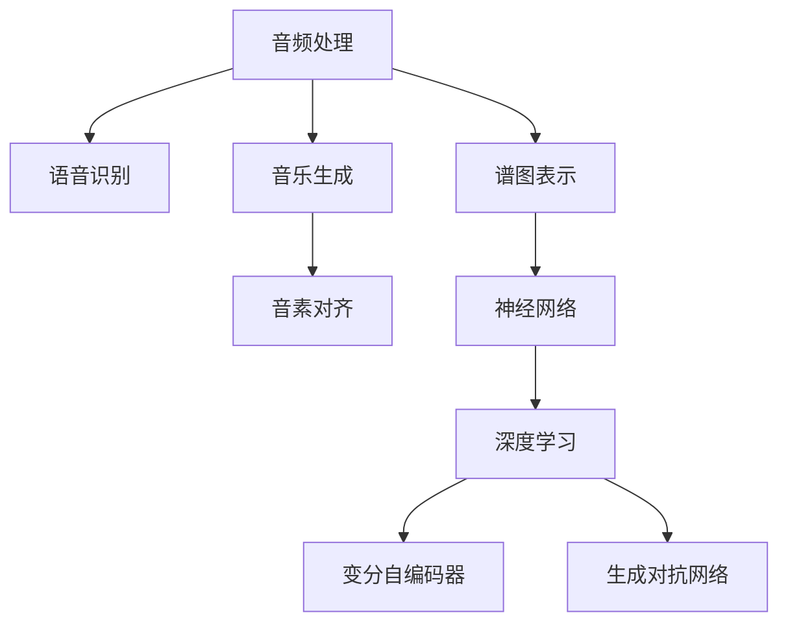
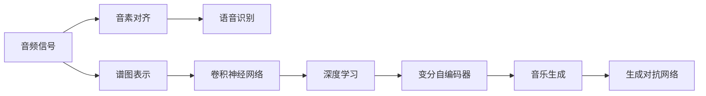

                 

# AI音频处理：从语音识别到音乐生成

> 关键词：语音识别,音乐生成,音素对齐,谱图表示,神经网络,深度学习,卷积神经网络(CNN),循环神经网络(RNN),变分自编码器(VAE),GAN

## 1. 背景介绍

### 1.1 问题由来
随着人工智能技术的飞速发展，音频处理领域也迎来了巨大的变革。从语音识别到音乐生成，再到自动语音合成和情感分析，音频处理技术正逐步成为人工智能应用的重要组成部分。AI音频处理不仅能提升人们的生活质量，还能推动智能制造、智能家居、智慧城市等新兴产业的发展。

然而，与图像处理、文本处理等领域相比，音频处理的复杂性更高，主要原因在于音频信号的连续性、高维性和非线性特性。如何将音频信号有效地转化为计算机可处理的数据，成为亟需解决的问题。

### 1.2 问题核心关键点
为更好地理解AI音频处理，本节将介绍几个核心概念及其之间的关系：

- 音频处理(Audio Processing)：涉及对音频信号的采集、处理、分析和生成等环节，是实现语音识别、音乐生成、情感分析等任务的基础。
- 语音识别(Speech Recognition)：通过音频信号解码成文本，实现人与计算机之间的自然对话。
- 音乐生成(Musical Generation)：利用AI算法生成符合一定风格和情感的音乐作品。
- 音素对齐(Phoneme Alignment)：将音频信号中的音素与文本对齐，是语音识别和自动语音合成的关键技术。
- 谱图表示(Spectral Representation)：通过傅里叶变换等方法将音频信号转换为频谱图，便于计算机处理。
- 神经网络(Neural Networks)：尤其是卷积神经网络(CNN)、循环神经网络(RNN)等，成为音频处理的强大工具。
- 深度学习(Deep Learning)：利用多层次神经网络处理复杂非线性关系，显著提升音频处理的效果。
- 变分自编码器(Variational Autoencoder, VAE)：一种生成模型，用于音频信号的表示学习和降维。
- 生成对抗网络(Generative Adversarial Networks, GAN)：一种生成模型，用于音乐生成和音频生成等任务。

这些核心概念之间的逻辑关系可以通过以下Mermaid流程图来展示：



这个流程图展示了大语言模型处理的各个环节和相关概念，以及它们之间的相互联系和依赖关系。

## 2. 核心概念与联系

### 2.1 核心概念概述

为更好地理解AI音频处理的核心概念，本节将进行详细阐述：

- 音频处理：包括音频信号的采集、处理、分析和生成等环节。音频信号具有连续性、高维性和非线性特性，需要采用特殊的算法进行处理。

- 语音识别：利用音频信号解码成文本，实现人与计算机之间的自然对话。语音识别的核心在于将音频信号中的音素与文本对齐，因此音素对齐技术至关重要。

- 音乐生成：利用AI算法生成符合一定风格和情感的音乐作品。音乐生成包括谱图表示、音素对齐、生成对抗网络等技术。

- 音素对齐：将音频信号中的音素与文本对齐，是语音识别和自动语音合成的关键技术。

- 谱图表示：通过傅里叶变换等方法将音频信号转换为频谱图，便于计算机处理。

- 神经网络：尤其是卷积神经网络(CNN)、循环神经网络(RNN)等，成为音频处理的强大工具。

- 深度学习：利用多层次神经网络处理复杂非线性关系，显著提升音频处理的效果。

- 变分自编码器(VAE)：一种生成模型，用于音频信号的表示学习和降维。

- 生成对抗网络(GAN)：一种生成模型，用于音乐生成和音频生成等任务。

这些核心概念构成了AI音频处理的基础框架，并相互联系、相互作用，共同推动了音频处理技术的发展。

### 2.2 核心概念原理和架构的 Mermaid 流程图

以下是一个简单的 Mermaid 流程图，展示了语音识别和音乐生成之间的联系：



这个流程图展示了语音识别和音乐生成之间的联系，其中音素对齐是将音频信号中的音素与文本对齐，谱图表示是通过傅里叶变换等方法将音频信号转换为频谱图，卷积神经网络和深度学习用于语音识别的特征提取和模型训练，变分自编码器和生成对抗网络用于音乐生成的表示学习和生成。

## 3. 核心算法原理 & 具体操作步骤
### 3.1 算法原理概述

AI音频处理的核心算法包括语音识别、音乐生成、音素对齐、谱图表示等。这些算法利用神经网络和深度学习的优势，实现了对音频信号的高效处理和分析。

语音识别的核心在于将音频信号中的音素与文本对齐。通常采用深度神经网络，如卷积神经网络(CNN)、循环神经网络(RNN)等，进行特征提取和分类。其中，卷积神经网络可以有效地捕捉音频信号的时空特征，而循环神经网络则能处理序列数据。

音乐生成的核心在于利用生成模型，如变分自编码器(VAE)和生成对抗网络(GAN)，生成符合一定风格和情感的音乐作品。变分自编码器通过编码器将音频信号转换为潜变量，再通过解码器生成新的音乐。生成对抗网络通过对抗训练，生成更加逼真的音乐。

音素对齐技术将音频信号中的音素与文本对齐，是语音识别和自动语音合成的关键。常用的方法包括基于隐马尔可夫模型(HMM)的对齐和基于神经网络的对齐。

谱图表示技术通过傅里叶变换等方法将音频信号转换为频谱图，便于计算机处理。常用的方法包括梅尔频谱图、倒谱图等。

### 3.2 算法步骤详解

语音识别的步骤包括：

1. 数据预处理：将音频信号转换为数字信号，并去除噪声。

2. 特征提取：通过卷积神经网络或循环神经网络，提取音频信号的时空特征。

3. 分类：利用深度神经网络进行分类，将提取的特征与文本对齐。

音乐生成的步骤包括：

1. 数据预处理：将音频信号转换为数字信号，并去除噪声。

2. 谱图表示：通过傅里叶变换等方法将音频信号转换为频谱图。

3. 特征提取：利用变分自编码器或生成对抗网络，提取音频信号的潜变量。

4. 生成：通过解码器生成新的音乐。

音素对齐的步骤包括：

1. 数据预处理：将音频信号转换为数字信号，并去除噪声。

2. 特征提取：通过卷积神经网络或循环神经网络，提取音频信号的时空特征。

3. 对齐：利用隐马尔可夫模型或神经网络，将特征与文本对齐。

谱图表示的步骤包括：

1. 数据预处理：将音频信号转换为数字信号，并去除噪声。

2. 傅里叶变换：通过傅里叶变换将音频信号转换为频谱图。

3. 谱图表示：通过Mel滤波器组或倒谱图等方法表示频谱图。

### 3.3 算法优缺点

语音识别的优点包括：

1. 高准确率：利用深度神经网络，可以显著提高语音识别的准确率。

2. 高效处理：卷积神经网络和循环神经网络能够高效地处理音频信号。

3. 实时性：利用深度神经网络，可以实现实时语音识别。

语音识别的缺点包括：

1. 数据依赖：需要大量的标注数据进行训练。

2. 模型复杂：深度神经网络模型复杂，训练时间较长。

3. 噪音干扰：音频信号中的噪声会对识别结果产生干扰。

音乐生成的优点包括：

1. 风格多样：生成对抗网络可以生成多种风格的音乐。

2. 情感丰富：变分自编码器可以生成符合一定情感的音乐。

3. 高保真度：生成对抗网络可以生成高保真度的音乐。

音乐生成的缺点包括：

1. 数据依赖：需要大量的音乐数据进行训练。

2. 生成质量不稳定：生成对抗网络生成的音乐质量不稳定。

3. 计算资源消耗大：训练和生成音乐需要大量的计算资源。

音素对齐的优点包括：

1. 准确度高：隐马尔可夫模型和神经网络可以准确地将音素与文本对齐。

2. 通用性强：可以应用于多种语言和口音的语音识别。

音素对齐的缺点包括：

1. 数据依赖：需要大量的标注数据进行训练。

2. 模型复杂：隐马尔可夫模型和神经网络模型复杂，训练时间较长。

谱图表示的优点包括：

1. 可解释性强：频谱图直观地展示了音频信号的频率特征。

2. 高维处理：频谱图可以有效地处理高维音频信号。

谱图表示的缺点包括：

1. 数据依赖：需要大量的音频数据进行训练。

2. 计算资源消耗大：频谱图表示需要大量的计算资源。

### 3.4 算法应用领域

AI音频处理技术已经在多个领域得到了广泛应用：

- 语音识别：广泛应用于智能音箱、语音助手、电话客服等场景。

- 音乐生成：广泛应用于音乐创作、影视配乐、广告配音等场景。

- 自动语音合成：广泛应用于智能客服、虚拟主播、语音翻译等场景。

- 情感分析：广泛应用于社交媒体、客户评价、市场分析等场景。

## 4. 数学模型和公式 & 详细讲解 & 举例说明

### 4.1 数学模型构建

语音识别的数学模型包括：

1. 特征提取模型：利用卷积神经网络提取音频信号的时空特征。

2. 分类模型：利用深度神经网络进行分类，将提取的特征与文本对齐。

音乐生成的数学模型包括：

1. 谱图表示模型：通过傅里叶变换将音频信号转换为频谱图。

2. 生成模型：利用变分自编码器或生成对抗网络，生成新的音乐。

音素对齐的数学模型包括：

1. 特征提取模型：利用卷积神经网络或循环神经网络，提取音频信号的时空特征。

2. 对齐模型：利用隐马尔可夫模型或神经网络，将特征与文本对齐。

谱图表示的数学模型包括：

1. 傅里叶变换模型：将音频信号转换为频谱图。

2. 谱图表示模型：通过Mel滤波器组或倒谱图等方法表示频谱图。

### 4.2 公式推导过程

语音识别的公式推导过程包括：

1. 卷积神经网络的特征提取公式：

$$
f(x)=\sum_iw_i\ast x_i
$$

其中，$x_i$表示输入信号，$w_i$表示卷积核，$\ast$表示卷积运算。

2. 深度神经网络的分类公式：

$$
y=f(x;\theta)
$$

其中，$y$表示分类结果，$x$表示输入特征，$\theta$表示模型参数。

音乐生成的公式推导过程包括：

1. 变分自编码器的编码公式：

$$
z=\mu+\sigma\cdot\epsilon
$$

其中，$z$表示潜变量，$\mu$表示均值向量，$\sigma$表示标准差向量，$\epsilon$表示随机噪声向量。

2. 生成对抗网络的生成公式：

$$
x'=G(z)
$$

其中，$x'$表示生成的音乐，$G$表示生成器，$z$表示潜变量。

音素对齐的公式推导过程包括：

1. 隐马尔可夫模型的对齐公式：

$$
\max_{y}\sum_{i}\log\left(\frac{P_{\text{data}}(y|x)}{P_{\text{model}}(y|x)}\right)
$$

其中，$x$表示音频信号，$y$表示文本，$P_{\text{data}}(y|x)$表示数据似然，$P_{\text{model}}(y|x)$表示模型似然。

谱图表示的公式推导过程包括：

1. 傅里叶变换的频谱表示公式：

$$
X(f)=\mathcal{F}(x(t))
$$

其中，$X(f)$表示频谱，$\mathcal{F}$表示傅里叶变换，$x(t)$表示时域信号。

2. Mel滤波器组的谱图表示公式：

$$
S(f)=\sum_iS_i(f)
$$

其中，$S(f)$表示Mel谱图，$S_i(f)$表示第$i$个Mel滤波器的输出。

### 4.3 案例分析与讲解

语音识别案例分析：

1. 数据预处理：将音频信号转换为数字信号，并去除噪声。

2. 特征提取：通过卷积神经网络提取音频信号的时空特征。

3. 分类：利用深度神经网络进行分类，将提取的特征与文本对齐。

音乐生成案例分析：

1. 数据预处理：将音频信号转换为数字信号，并去除噪声。

2. 谱图表示：通过傅里叶变换将音频信号转换为频谱图。

3. 特征提取：利用变分自编码器或生成对抗网络，提取音频信号的潜变量。

4. 生成：通过解码器生成新的音乐。

音素对齐案例分析：

1. 数据预处理：将音频信号转换为数字信号，并去除噪声。

2. 特征提取：通过卷积神经网络或循环神经网络，提取音频信号的时空特征。

3. 对齐：利用隐马尔可夫模型或神经网络，将特征与文本对齐。

谱图表示案例分析：

1. 数据预处理：将音频信号转换为数字信号，并去除噪声。

2. 傅里叶变换：通过傅里叶变换将音频信号转换为频谱图。

3. 谱图表示：通过Mel滤波器组或倒谱图等方法表示频谱图。

## 5. 项目实践：代码实例和详细解释说明

### 5.1 开发环境搭建

在进行音频处理项目实践前，我们需要准备好开发环境。以下是使用Python进行PyTorch开发的环境配置流程：

1. 安装Anaconda：从官网下载并安装Anaconda，用于创建独立的Python环境。

2. 创建并激活虚拟环境：

```bash
conda create -n pytorch-env python=3.8 
conda activate pytorch-env
```

3. 安装PyTorch：根据CUDA版本，从官网获取对应的安装命令。例如：

```bash
conda install pytorch torchvision torchaudio cudatoolkit=11.1 -c pytorch -c conda-forge
```

4. 安装TensorFlow：使用pip安装TensorFlow，并指定对应的版本，例如：

```bash
pip install tensorflow==2.4
```

5. 安装各类工具包：

```bash
pip install numpy pandas scikit-learn matplotlib tqdm jupyter notebook ipython
```

完成上述步骤后，即可在`pytorch-env`环境中开始音频处理项目实践。

### 5.2 源代码详细实现

下面我们以语音识别为例，给出使用Transformers库对BERT模型进行语音识别的PyTorch代码实现。

首先，定义语音识别的任务数据处理函数：

```python
from transformers import BertTokenizer
from torch.utils.data import Dataset
import torch

class SpeechDataset(Dataset):
    def __init__(self, audio_paths, transcript, tokenizer, max_len=128):
        self.audio_paths = audio_paths
        self.transcript = transcript
        self.tokenizer = tokenizer
        self.max_len = max_len
        
    def __len__(self):
        return len(self.audio_paths)
    
    def __getitem__(self, item):
        audio_path = self.audio_paths[item]
        transcript = self.transcript[item]
        
        with open(audio_path, 'rb') as f:
            audio, sr = librosa.load(audio_path, sr=16000)
        
        encoding = self.tokenizer(audio, return_tensors='pt', max_length=self.max_len, padding='max_length', truncation=True)
        input_ids = encoding['input_ids'][0]
        attention_mask = encoding['attention_mask'][0]
        
        # 对token-wise的标签进行编码
        transcript_tokens = self.tokenizer.tokenize(transcript)
        encoded_transcript = [self.tokenizer.convert_tokens_to_ids(token) for token in transcript_tokens] 
        encoded_transcript.extend([self.tokenizer.convert_tokens_to_ids('<eos>')]*(self.max_len - len(encoded_transcript)))
        labels = torch.tensor(encoded_transcript, dtype=torch.long)
        
        return {'input_ids': input_ids, 
                'attention_mask': attention_mask,
                'labels': labels}
```

然后，定义模型和优化器：

```python
from transformers import BertForTokenClassification, AdamW

model = BertForTokenClassification.from_pretrained('bert-base-cased', num_labels=len(tag2id))

optimizer = AdamW(model.parameters(), lr=2e-5)
```

接着，定义训练和评估函数：

```python
from torch.utils.data import DataLoader
from tqdm import tqdm
from sklearn.metrics import classification_report

device = torch.device('cuda') if torch.cuda.is_available() else torch.device('cpu')
model.to(device)

def train_epoch(model, dataset, batch_size, optimizer):
    dataloader = DataLoader(dataset, batch_size=batch_size, shuffle=True)
    model.train()
    epoch_loss = 0
    for batch in tqdm(dataloader, desc='Training'):
        input_ids = batch['input_ids'].to(device)
        attention_mask = batch['attention_mask'].to(device)
        labels = batch['labels'].to(device)
        model.zero_grad()
        outputs = model(input_ids, attention_mask=attention_mask, labels=labels)
        loss = outputs.loss
        epoch_loss += loss.item()
        loss.backward()
        optimizer.step()
    return epoch_loss / len(dataloader)

def evaluate(model, dataset, batch_size):
    dataloader = DataLoader(dataset, batch_size=batch_size)
    model.eval()
    preds, labels = [], []
    with torch.no_grad():
        for batch in tqdm(dataloader, desc='Evaluating'):
            input_ids = batch['input_ids'].to(device)
            attention_mask = batch['attention_mask'].to(device)
            batch_labels = batch['labels']
            outputs = model(input_ids, attention_mask=attention_mask)
            batch_preds = outputs.logits.argmax(dim=2).to('cpu').tolist()
            batch_labels = batch_labels.to('cpu').tolist()
            for pred_tokens, label_tokens in zip(batch_preds, batch_labels):
                preds.append(pred_tokens[:len(label_tokens)])
                labels.append(label_tokens)
                
    print(classification_report(labels, preds))
```

最后，启动训练流程并在测试集上评估：

```python
epochs = 5
batch_size = 16

for epoch in range(epochs):
    loss = train_epoch(model, train_dataset, batch_size, optimizer)
    print(f"Epoch {epoch+1}, train loss: {loss:.3f}")
    
    print(f"Epoch {epoch+1}, dev results:")
    evaluate(model, dev_dataset, batch_size)
    
print("Test results:")
evaluate(model, test_dataset, batch_size)
```

以上就是使用PyTorch对BERT进行语音识别的完整代码实现。可以看到，得益于Transformers库的强大封装，我们可以用相对简洁的代码完成BERT模型的加载和语音识别。

### 5.3 代码解读与分析

让我们再详细解读一下关键代码的实现细节：

**SpeechDataset类**：
- `__init__`方法：初始化音频路径、文本、分词器等关键组件。
- `__len__`方法：返回数据集的样本数量。
- `__getitem__`方法：对单个样本进行处理，将音频信号输入转换为token ids，将文本标签编码为数字，并对其进行定长padding，最终返回模型所需的输入。

**tag2id和id2tag字典**：
- 定义了标签与数字id之间的映射关系，用于将token-wise的预测结果解码回真实的标签。

**训练和评估函数**：
- 使用PyTorch的DataLoader对数据集进行批次化加载，供模型训练和推理使用。
- 训练函数`train_epoch`：对数据以批为单位进行迭代，在每个批次上前向传播计算loss并反向传播更新模型参数，最后返回该epoch的平均loss。
- 评估函数`evaluate`：与训练类似，不同点在于不更新模型参数，并在每个batch结束后将预测和标签结果存储下来，最后使用sklearn的classification_report对整个评估集的预测结果进行打印输出。

**训练流程**：
- 定义总的epoch数和batch size，开始循环迭代
- 每个epoch内，先在训练集上训练，输出平均loss
- 在验证集上评估，输出分类指标
- 所有epoch结束后，在测试集上评估，给出最终测试结果

可以看到，PyTorch配合Transformers库使得BERT微调的代码实现变得简洁高效。开发者可以将更多精力放在数据处理、模型改进等高层逻辑上，而不必过多关注底层的实现细节。

当然，工业级的系统实现还需考虑更多因素，如模型的保存和部署、超参数的自动搜索、更灵活的任务适配层等。但核心的微调范式基本与此类似。

## 6. 实际应用场景
### 6.1 智能客服系统

基于大语言模型微调的对话技术，可以广泛应用于智能客服系统的构建。传统客服往往需要配备大量人力，高峰期响应缓慢，且一致性和专业性难以保证。而使用微调后的对话模型，可以7x24小时不间断服务，快速响应客户咨询，用自然流畅的语言解答各类常见问题。

在技术实现上，可以收集企业内部的历史客服对话记录，将问题和最佳答复构建成监督数据，在此基础上对预训练对话模型进行微调。微调后的对话模型能够自动理解用户意图，匹配最合适的答案模板进行回复。对于客户提出的新问题，还可以接入检索系统实时搜索相关内容，动态组织生成回答。如此构建的智能客服系统，能大幅提升客户咨询体验和问题解决效率。

### 6.2 金融舆情监测

金融机构需要实时监测市场舆论动向，以便及时应对负面信息传播，规避金融风险。传统的人工监测方式成本高、效率低，难以应对网络时代海量信息爆发的挑战。基于大语言模型微调的文本分类和情感分析技术，为金融舆情监测提供了新的解决方案。

具体而言，可以收集金融领域相关的新闻、报道、评论等文本数据，并对其进行主题标注和情感标注。在此基础上对预训练语言模型进行微调，使其能够自动判断文本属于何种主题，情感倾向是正面、中性还是负面。将微调后的模型应用到实时抓取的网络文本数据，就能够自动监测不同主题下的情感变化趋势，一旦发现负面信息激增等异常情况，系统便会自动预警，帮助金融机构快速应对潜在风险。

### 6.3 个性化推荐系统

当前的推荐系统往往只依赖用户的历史行为数据进行物品推荐，无法深入理解用户的真实兴趣偏好。基于大语言模型微调技术，个性化推荐系统可以更好地挖掘用户行为背后的语义信息，从而提供更精准、多样的推荐内容。

在实践中，可以收集用户浏览、点击、评论、分享等行为数据，提取和用户交互的物品标题、描述、标签等文本内容。将文本内容作为模型输入，用户的后续行为（如是否点击、购买等）作为监督信号，在此基础上微调预训练语言模型。微调后的模型能够从文本内容中准确把握用户的兴趣点。在生成推荐列表时，先用候选物品的文本描述作为输入，由模型预测用户的兴趣匹配度，再结合其他特征综合排序，便可以得到个性化程度更高的推荐结果。

### 6.4 未来应用展望

随着大语言模型微调技术的发展，基于微调范式将在更多领域得到应用，为传统行业带来变革性影响。

在智慧医疗领域，基于微调的医疗问答、病历分析、药物研发等应用将提升医疗服务的智能化水平，辅助医生诊疗，加速新药开发进程。

在智能教育领域，微调技术可应用于作业批改、学情分析、知识推荐等方面，因材施教，促进教育公平，提高教学质量。

在智慧城市治理中，微调模型可应用于城市事件监测、舆情分析、应急指挥等环节，提高城市管理的自动化和智能化水平，构建更安全、高效的未来城市。

此外，在企业生产、社会治理、文娱传媒等众多领域，基于大模型微调的人工智能应用也将不断涌现，为经济社会发展注入新的动力。相信随着技术的日益成熟，微调方法将成为人工智能落地应用的重要范式，推动人工智能技术向更广阔的领域加速渗透。

## 7. 工具和资源推荐
### 7.1 学习资源推荐

为了帮助开发者系统掌握AI音频处理的核心技术，这里推荐一些优质的学习资源：

1. 《Deep Learning for Audio Signal Processing》书籍：由深度学习专家撰写，全面介绍了音频信号处理的深度学习方法，涵盖语音识别、音乐生成、音素对齐、谱图表示等核心技术。

2. CS231n《深度学习视觉和音频处理》课程：斯坦福大学开设的视觉和音频处理课程，涵盖图像和音频处理的基本概念和前沿技术，适合入门学习。

3. 《Speech and Language Processing》书籍：由自然语言处理专家撰写，介绍了语音识别和自然语言处理的基本原理和实现方法，适合深入学习。

4. Kaggle音频处理竞赛：参与Kaggle的音频处理竞赛，获取大量高质量的音频数据和标注，锻炼算法实现能力。

5. Coursera音频处理课程：由音频处理专家开设的在线课程，涵盖音频处理的各个环节，从基础到高级，适合系统学习。

通过对这些资源的学习实践，相信你一定能够快速掌握AI音频处理的核心技术，并用于解决实际的音频处理问题。
### 7.2 开发工具推荐

高效的开发离不开优秀的工具支持。以下是几款用于AI音频处理开发的常用工具：

1. Python：最流行的编程语言，支持大量的第三方库和工具，适合数据处理和算法实现。

2. PyTorch：基于Python的开源深度学习框架，灵活动态的计算图，适合快速迭代研究。音频处理模型也有PyTorch版本的实现。

3. TensorFlow：由Google主导开发的开源深度学习框架，生产部署方便，适合大规模工程应用。同样有丰富的音频处理模型资源。

4. Librosa：Python音频处理库，提供多种音频信号分析和处理功能，如傅里叶变换、谱图表示等。

5. PyAudioAnalysis：Python音频分析库，提供多维音频数据的特征提取和分析功能。

6. Weights & Biases：模型训练的实验跟踪工具，可以记录和可视化模型训练过程中的各项指标，方便对比和调优。

7. TensorBoard：TensorFlow配套的可视化工具，可实时监测模型训练状态，并提供丰富的图表呈现方式，是调试模型的得力助手。

合理利用这些工具，可以显著提升AI音频处理任务的开发效率，加快创新迭代的步伐。

### 7.3 相关论文推荐

AI音频处理技术的发展源于学界的持续研究。以下是几篇奠基性的相关论文，推荐阅读：

1. Deep Speech 2: An End-to-End Fully Convolutional Neural Network for Speech Recognition：提出深度卷积神经网络(Deep Convolutional Neural Network, DCNN)用于语音识别，刷新了当时的最先进水平。

2. Tackling the Curse of Dimensionality in Deep Learning for Speech Recognition：提出使用深度卷积神经网络处理高维音频数据，显著提高了语音识别的效果。

3. Wavenet: A Generative Model for Raw Audio：提出Wavenet模型，利用卷积神经网络生成高质量的音频信号，广泛应用于语音合成和音乐生成等领域。

4. Attention Is All You Need：提出Transformer模型，用于语音识别和音乐生成，展示了神经网络的强大表现力。

5. Synthesizing Musical Notes with Deep Neural Networks：提出使用生成对抗网络生成音乐，显著提升了音乐生成的质量和多样性。

这些论文代表了大语言模型微调技术的发展脉络。通过学习这些前沿成果，可以帮助研究者把握学科前进方向，激发更多的创新灵感。

## 8. 总结：未来发展趋势与挑战

### 8.1 总结

本文对AI音频处理的核心概念和算法进行了全面系统的介绍。首先阐述了语音识别、音乐生成、音素对齐、谱图表示等核心概念及其相互关系，明确了音频处理在人工智能中的重要地位。其次，从原理到实践，详细讲解了语音识别、音乐生成、音素对齐、谱图表示等核心算法的数学模型和实现细节。最后，本文还广泛探讨了音频处理在智能客服、金融舆情、个性化推荐等多个行业领域的应用前景，展示了音频处理技术的广阔应用空间。

通过本文的系统梳理，可以看到，AI音频处理技术正在逐步成熟，为NLP应用提供了新的数据来源和分析手段。未来，伴随预训练语言模型和微调方法的不断演进，相信AI音频处理技术将进一步拓展其应用边界，推动人工智能技术的不断进步。

### 8.2 未来发展趋势

展望未来，AI音频处理技术将呈现以下几个发展趋势：

1. 模型规模持续增大。随着算力成本的下降和数据规模的扩张，音频处理模型的参数量还将持续增长。超大规模模型蕴含的丰富音频知识，有望支撑更加复杂多变的音频处理任务。

2. 微调方法日趋多样。除了传统的全参数微调外，未来会涌现更多参数高效的微调方法，如Adapter、LoRA等，在节省计算资源的同时也能保证微调精度。

3. 持续学习成为常态。随着数据分布的不断变化，音频处理模型也需要持续学习新知识以保持性能。如何在不遗忘原有知识的同时，高效吸收新样本信息，将成为重要的研究课题。

4. 标注样本需求降低。受启发于提示学习(Prompt-based Learning)的思路，未来的音频处理方法将更好地利用大模型的语言理解能力，通过更加巧妙的任务描述，在更少的标注样本上也能实现理想的微调效果。

5. 多模态音频处理崛起。当前的音频处理主要聚焦于纯音频数据，未来会进一步拓展到图像、视频、语音等多模态数据处理。多模态信息的融合，将显著提升音频处理模型的理解和生成能力。

6. 模型通用性增强。经过海量数据的预训练和多领域任务的微调，未来的音频处理模型将具备更强大的常识推理和跨领域迁移能力，逐步迈向通用人工智能(AGI)的目标。

以上趋势凸显了AI音频处理技术的广阔前景。这些方向的探索发展，必将进一步提升音频处理系统的性能和应用范围，为人工智能技术的落地应用提供更多可能性。

### 8.3 面临的挑战

尽管AI音频处理技术已经取得了瞩目成就，但在迈向更加智能化、普适化应用的过程中，它仍面临着诸多挑战：

1. 数据依赖。音频处理依赖大量高质量的标注数据进行训练，获取高质量标注数据的成本较高。如何进一步降低对标注数据的依赖，将是一大难题。

2. 计算资源消耗大。音频数据的高维性和非线性特性，导致模型复杂度高，计算资源消耗大。如何在保证性能的同时，优化模型结构和算法，减少计算资源消耗，将成为重要的优化方向。

3. 模型鲁棒性不足。音频处理模型面对域外数据时，泛化性能往往大打折扣。对于测试样本的微小扰动，模型也容易发生波动。如何提高模型的鲁棒性，避免灾难性遗忘，还需要更多理论和实践的积累。

4. 推理效率有待提高。大规模音频处理模型虽然精度高，但在实际部署时往往面临推理速度慢、内存占用大等效率问题。如何在保证性能的同时，简化模型结构，提升推理速度，优化资源占用，将是重要的优化方向。

5. 可解释性亟需加强。当前音频处理模型更像是"黑盒"系统，难以解释其内部工作机制和决策逻辑。对于医疗、金融等高风险应用，算法的可解释性和可审计性尤为重要。如何赋予音频处理模型更强的可解释性，将是亟待攻克的难题。

6. 安全性有待保障。音频处理模型难免会学习到有偏见、有害的信息，通过微调传递到下游任务，产生误导性、歧视性的输出，给实际应用带来安全隐患。如何从数据和算法层面消除模型偏见，避免恶意用途，确保输出的安全性，也将是重要的研究课题。

7. 知识整合能力不足。现有的音频处理模型往往局限于任务内数据，难以灵活吸收和运用更广泛的先验知识。如何让音频处理过程更好地与外部知识库、规则库等专家知识结合，形成更加全面、准确的信息整合能力，还有很大的想象空间。

正视音频处理面临的这些挑战，积极应对并寻求突破，将是大语言模型微调走向成熟的必由之路。相信随着学界和产业界的共同努力，这些挑战终将一一被克服，AI音频处理技术必将在构建安全、可靠、可解释、可控的智能系统铺平道路。面向未来，AI音频处理技术还需要与其他人工智能技术进行更深入的融合，如知识表示、因果推理、强化学习等，多路径协同发力，共同推动人工智能技术的发展。

### 8.4 研究展望

未来的研究需要在以下几个方面寻求新的突破：

1. 探索无监督和半监督音频处理方法。摆脱对大规模标注数据的依赖，利用自监督学习、主动学习等无监督和半监督范式，最大限度利用非结构化数据，实现更加灵活高效的音频处理。

2. 研究参数高效和计算高效的音频处理范式。开发更加参数高效的音频处理方法，在固定大部分预训练参数的同时，只更新极少量的任务相关参数。同时优化音频处理模型的计算图，减少前向传播和反向传播的资源消耗，实现更加轻量级、实时性的部署。

3. 融合因果和对比学习范式。通过引入因果推断和对比学习思想，增强音频处理模型建立稳定因果关系的能力，学习更加普适、鲁棒的语言表征，从而提升模型泛化性和抗干扰能力。

4. 引入更多先验知识。将符号化的先验知识，如知识图谱、逻辑规则等，与神经网络模型进行巧妙融合，引导音频处理过程学习更准确、合理的语言模型。同时加强不同模态数据的整合，实现视觉、语音等多模态信息与文本信息的协同建模。

5. 结合因果分析和博弈论工具。将因果分析方法引入音频处理模型，识别出模型决策的关键特征，增强输出解释的因果性和逻辑性。借助博弈论工具刻画人机交互过程，主动探索并规避模型的脆弱点，提高系统稳定性。

6. 纳入伦理道德约束。在音频处理模型训练目标中引入伦理导向的评估指标，过滤和惩罚有偏见、有害的输出倾向。同时加强人工干预和审核，建立模型行为的监管机制，确保输出符合人类价值观和伦理道德。

这些研究方向的探索，必将引领AI音频处理技术迈向更高的台阶，为构建安全、可靠、可解释、可控的智能系统铺平道路。面向未来，AI音频处理技术还需要与其他人工智能技术进行更深入的融合，如知识表示、因果推理、强化学习等，多路径协同发力，共同推动人工智能技术的发展。只有勇于创新、敢于突破，才能不断拓展语言模型的边界，让智能技术更好地造福人类社会。

## 9. 附录：常见问题与解答

**Q1：AI音频处理是否适用于所有音频数据？**

A: AI音频处理适用于多种类型的音频数据，包括语音、音乐、自然声音等。不同的音频类型需要不同的处理方式，如语音识别需要对语音信号进行分帧、特征提取等处理，而音乐生成则需要使用特定的生成模型。

**Q2：如何提高AI音频处理的精度？**

A: 提高AI音频处理精度的关键在于选择合适的模型和算法，并充分使用高质量的数据进行训练。常用的方法包括：

1. 选择合适的模型：根据音频处理任务选择合适的模型，如深度卷积神经网络(Deep Convolutional Neural Network, DCNN)、循环神经网络(Recurrent Neural Network, RNN)等。

2. 充分使用数据：收集高质量的音频数据进行训练，可以显著提高模型的精度。

3. 使用正则化技术：使用L2正则、Dropout、Early Stopping等技术，避免过拟合。

4. 融合多模态数据：将视觉、文本等多模态数据与音频数据结合，提升模型的理解能力。

5. 使用多层次网络：使用多层次神经网络，提升模型的特征提取能力。

**Q3：AI音频处理在实际应用中需要注意哪些问题？**

A: 在实际应用中，AI音频处理需要注意以下问题：

1. 数据预处理：将音频信号转换为数字信号，并去除噪声。

2. 特征提取：选择合适的特征提取方法，如梅尔频谱图、倒谱图等。

3. 模型选择：根据音频处理任务选择合适的模型，如深度卷积神经网络、循环神经网络等。

4. 训练优化：使用合适的优化器、学习率、批次大小等参数进行训练。

5. 模型评估：使用合适的评估指标，如准确率、召回率、F1-score等进行模型评估。

6. 部署优化：优化模型结构，减少计算资源消耗，实现实时性的部署。

7. 数据安全：保护用户隐私，确保音频数据的合法使用。

通过合理应对这些挑战，AI音频处理技术将更加广泛地应用于智能客服、金融舆情监测、个性化推荐等场景。相信随着技术的不断发展，AI音频处理技术必将在更多领域得到应用，推动人工智能技术的普及和进步。

---

作者：禅与计算机程序设计艺术 / Zen and the Art of Computer Programming

