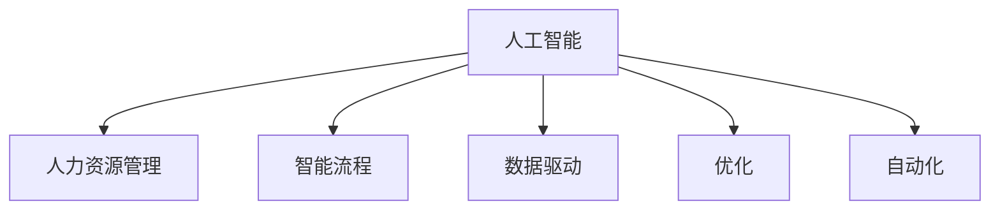

                 

# AI驱动的人力资源管理流程

> 关键词：AI,人力资源管理,智能流程,自动化,数据驱动,优化,效率提升,招聘,培训,员工管理

## 1. 背景介绍

### 1.1 问题由来

人力资源管理(Human Resource Management, HRM)是企业运营中至关重要的环节，涉及招聘、培训、绩效评估、员工福利、健康安全等多个方面。传统的人力资源管理流程往往依赖人工操作，耗时长、成本高、效率低。特别是随着企业规模的扩大，人力资源管理的复杂性和工作量不断增加，企业亟需引入先进的技术手段，实现自动化和智能化，提高管理效率，降低运营成本，提升员工满意度。

### 1.2 问题核心关键点

传统的人力资源管理面临的主要问题包括：

- **数据管理不统一**：不同系统间数据格式不统一，数据孤岛现象严重，无法形成统一视图。
- **流程缺乏标准化**：各环节流程不统一，执行标准不明确，导致工作效率低下。
- **决策依赖人工**：依赖人工决策，无法快速响应变化，缺乏系统性、数据驱动的决策支持。
- **缺乏主动预警**：人力资源管理过程中缺乏主动预警机制，无法及时发现潜在问题。
- **绩效评估不足**：绩效评估方法单一，无法全面、客观地反映员工表现。

这些问题限制了人力资源管理的效果，制约了企业的整体竞争力。如何利用先进技术手段，实现人力资源管理的智能化、自动化，成为了当下企业信息化建设的关键课题。

## 2. 核心概念与联系

### 2.1 核心概念概述

为更好地理解AI驱动的人力资源管理流程，本节将介绍几个关键概念：

- **人工智能(AI)**：通过模拟人类智能过程，使机器能够感知、学习、推理和决策的技术。
- **人力资源管理(HRM)**：对企业中的人力资源进行有效管理的策略、政策、方法、技术和实践。
- **智能流程(Smart Process)**：通过自动化和智能化技术，实现业务流程的自动化，提升效率和准确性的流程。
- **数据驱动(Data-Driven)**：基于数据的分析和应用，以数据为核心驱动决策和行动的决策方式。
- **优化(Optimization)**：通过改进算法、模型等手段，使系统性能提升的过程。
- **自动化(Automation)**：将原本由人工完成的任务交由机器完成，减少人工干预。

这些核心概念之间的逻辑关系可以通过以下Mermaid流程图来展示：



这个流程图展示了这个框架的核心概念及其之间的关系：

1. 人工智能通过模仿人类智能，驱动人力资源管理流程的智能化、自动化。
2. 智能流程通过自动化技术，实现人力资源管理各环节的自动化，提升效率。
3. 数据驱动利用数据来优化决策，提高决策的准确性和科学性。
4. 优化通过改进算法、模型等手段，提升系统的性能和效率。
5. 自动化将人工任务交给机器完成，减少人力成本。

这些概念共同构成了AI驱动的人力资源管理框架，使企业能够通过先进技术手段，实现人力资源管理的智能化、自动化和数据驱动化，提升管理效率和效果。

## 3. 核心算法原理 & 具体操作步骤

### 3.1 算法原理概述

基于AI的人力资源管理流程，本质上是将人工智能技术与人力资源管理的业务流程进行深度融合，通过自动化、智能化手段提升管理效率和效果。其核心思想是通过以下步骤实现：

1. **数据收集和清洗**：从不同系统、不同来源收集和整理人力资源数据。
2. **数据建模和分析**：基于数据构建分析模型，从数据中提取有价值的信息。
3. **流程自动化**：利用自动化技术实现各环节的自动化处理，提高工作效率。
4. **智能决策支持**：基于AI算法，提供智能决策支持，提高决策的科学性和准确性。
5. **主动预警和优化**：构建预警机制，及时发现潜在问题，进行优化调整。

### 3.2 算法步骤详解

AI驱动的人力资源管理流程一般包括以下几个关键步骤：

**Step 1: 数据收集和清洗**

- **数据来源**：人力资源管理涉及招聘、培训、绩效等多个环节，数据来源广泛，包括招聘平台、员工培训系统、绩效评估系统等。
- **数据格式**：不同系统间的数据格式不同，需要进行标准化处理。
- **数据清洗**：清洗数据中的噪音和异常值，确保数据的准确性和一致性。

**Step 2: 数据建模和分析**

- **特征工程**：提取对业务有影响的特征，构建特征向量。
- **模型选择**：选择合适的机器学习模型，如决策树、随机森林、神经网络等。
- **模型训练**：利用历史数据训练模型，优化模型参数。
- **模型评估**：使用测试集评估模型性能，选择合适的模型进行应用。

**Step 3: 流程自动化**

- **自动化处理**：将人力资源管理中的各种任务，如简历筛选、面试安排、员工培训等，交由自动化系统处理。
- **任务调度**：利用调度算法，安排各任务的执行顺序和资源分配。
- **交互界面**：设计友好的交互界面，方便人工操作和监督。

**Step 4: 智能决策支持**

- **决策树**：基于历史数据构建决策树，提供规则化的决策支持。
- **神经网络**：利用神经网络模型，对复杂问题进行预测和决策。
- **推荐系统**：根据员工的历史数据和行为，推荐适合的培训课程、岗位等。

**Step 5: 主动预警和优化**

- **预警机制**：基于模型，对异常情况进行预警，如未按时完成任务、绩效异常等。
- **优化调整**：根据预警结果，进行优化调整，如调整任务分配、优化培训内容等。

### 3.3 算法优缺点

基于AI的人力资源管理流程具有以下优点：

- **高效性**：通过自动化和智能化手段，大幅提升人力资源管理效率，减少人工干预。
- **准确性**：基于数据驱动的决策，提高决策的科学性和准确性。
- **灵活性**：通过模型训练，根据实际情况进行灵活调整和优化。
- **成本节约**：减少人工操作，节约人力成本。

同时，该方法也存在以下局限性：

- **数据质量要求高**：对数据的收集和清洗要求较高，数据质量直接影响系统效果。
- **算法复杂度高**：模型训练和优化需要复杂的算法和计算资源，对技术要求较高。
- **安全性和隐私问题**：人力资源管理涉及敏感数据，系统需要具备强大的安全性和隐私保护能力。

尽管存在这些局限性，但AI驱动的人力资源管理流程仍是当前企业信息化建设的重要方向，其高效的自动化和智能决策能力，将为企业带来显著的管理效益。

### 3.4 算法应用领域

基于AI的人力资源管理流程，已经在诸多企业得到广泛应用，覆盖了人力资源管理的各个方面，例如：

- **招聘管理**：自动化简历筛选、面试安排、候选人评估等环节，提高招聘效率。
- **员工培训**：基于员工数据和岗位需求，推荐适合的培训课程，提高培训效果。
- **绩效评估**：利用机器学习模型，全面、客观地评估员工绩效，提升管理公平性。
- **员工福利**：通过数据分析，优化福利分配，提升员工满意度。
- **健康安全**：利用传感器数据，实时监测员工健康和安全状况，及时预警风险。

除了上述这些经典应用外，AI驱动的人力资源管理流程还被创新性地应用到更多场景中，如员工关系管理、职业生涯规划、人才管理等，为企业带来更全面的人力资源管理解决方案。

## 4. 数学模型和公式 & 详细讲解 & 举例说明

### 4.1 数学模型构建

本节将使用数学语言对AI驱动的人力资源管理流程进行更加严格的刻画。

记人力资源管理任务为 $T$，其数据集为 $D=\{(x_i,y_i)\}_{i=1}^N, x_i \in \mathcal{X}, y_i \in \mathcal{Y}$，其中 $x_i$ 表示人力资源管理任务，$y_i$ 表示对应的结果或标签。假设模型 $M_{\theta}$ 输入为 $x_i$，输出为 $\hat{y}_i$。则模型的损失函数 $\ell$ 可以定义为：

$$
\ell(M_{\theta}(x_i),y_i) = \mathbb{E}[\mathcal{L}(M_{\theta}(x_i),y_i)]
$$

其中 $\mathcal{L}$ 为损失函数，$\mathbb{E}$ 表示期望。模型的优化目标是最小化损失函数，即：

$$
\theta^* = \mathop{\arg\min}_{\theta} \ell(M_{\theta}(x_i),y_i)
$$

在实践中，我们通常使用梯度下降等优化算法来近似求解上述最优化问题。设 $\eta$ 为学习率，则参数的更新公式为：

$$
\theta \leftarrow \theta - \eta \nabla_{\theta}\ell(M_{\theta}(x_i),y_i)
$$

其中 $\nabla_{\theta}\ell(M_{\theta}(x_i),y_i)$ 为损失函数对模型参数 $\theta$ 的梯度，可通过反向传播算法高效计算。

### 4.2 公式推导过程

以下我们以招聘管理任务为例，推导机器学习模型的损失函数及其梯度的计算公式。

假设招聘任务的输入为 $\{x_i\}_{i=1}^N$，输出为 $\{y_i\}_{i=1}^N$，其中 $x_i$ 表示简历信息，$y_i$ 表示是否通过面试。则二分类交叉熵损失函数定义为：

$$
\ell(M_{\theta}(x_i),y_i) = -[y_i\log \hat{y}_i + (1-y_i)\log (1-\hat{y}_i)]
$$

将其代入经验风险公式，得：

$$
\mathcal{L}(\theta) = -\frac{1}{N}\sum_{i=1}^N [y_i\log M_{\theta}(x_i)+(1-y_i)\log(1-M_{\theta}(x_i))]
$$

根据链式法则，损失函数对参数 $\theta_k$ 的梯度为：

$$
\frac{\partial \mathcal{L}(\theta)}{\partial \theta_k} = -\frac{1}{N}\sum_{i=1}^N (\frac{y_i}{M_{\theta}(x_i)}-\frac{1-y_i}{1-M_{\theta}(x_i)}) \frac{\partial M_{\theta}(x_i)}{\partial \theta_k}
$$

其中 $\frac{\partial M_{\theta}(x_i)}{\partial \theta_k}$ 可进一步递归展开，利用自动微分技术完成计算。

在得到损失函数的梯度后，即可带入参数更新公式，完成模型的迭代优化。重复上述过程直至收敛，最终得到适应招聘任务的最优模型参数 $\theta^*$。

### 4.3 案例分析与讲解

假设某企业需要通过优化招聘流程，提高招聘效率和效果。以下是利用AI技术实现这一目标的详细步骤：

1. **数据收集**：
   - 从招聘平台、内部系统等渠道收集简历、面试记录、培训记录等数据。
   - 将数据进行标准化处理，确保格式统一。

2. **数据建模**：
   - 对简历数据进行特征工程，提取对面试结果有影响的特征，如教育背景、工作经验、技能等。
   - 选择随机森林模型作为预测模型，利用历史数据进行训练和优化。
   - 使用测试集评估模型性能，选择合适的模型进行应用。

3. **流程自动化**：
   - 利用自动化系统，实现简历筛选、面试安排、候选人评估等环节的自动化处理。
   - 设计友好的交互界面，方便人工操作和监督。
   - 利用调度算法，安排各任务的执行顺序和资源分配。

4. **智能决策支持**：
   - 利用决策树模型，对面试结果进行规则化预测。
   - 利用神经网络模型，对复杂的面试问题进行预测和决策。
   - 根据员工数据和岗位需求，利用推荐系统推荐适合的培训课程和岗位。

5. **主动预警和优化**：
   - 构建预警机制，对未按时完成任务、面试未通过等异常情况进行预警。
   - 根据预警结果，进行优化调整，如调整任务分配、优化培训内容等。

通过以上步骤，企业可以实现高效的招聘管理，显著提升招聘效率和效果，同时保障招聘决策的科学性和准确性。

## 5. 项目实践：代码实例和详细解释说明

### 5.1 开发环境搭建

在进行AI驱动的人力资源管理流程开发前，我们需要准备好开发环境。以下是使用Python进行TensorFlow开发的环境配置流程：

1. 安装Anaconda：从官网下载并安装Anaconda，用于创建独立的Python环境。

2. 创建并激活虚拟环境：
```bash
conda create -n tf-env python=3.8 
conda activate tf-env
```

3. 安装TensorFlow：根据CUDA版本，从官网获取对应的安装命令。例如：
```bash
conda install tensorflow -c conda-forge
```

4. 安装各类工具包：
```bash
pip install numpy pandas scikit-learn matplotlib tqdm jupyter notebook ipython
```

完成上述步骤后，即可在`tf-env`环境中开始开发实践。

### 5.2 源代码详细实现

下面我们以招聘管理任务为例，给出使用TensorFlow实现AI驱动人力资源管理流程的PyTorch代码实现。

首先，定义招聘任务的数据处理函数：

```python
from tensorflow.keras.preprocessing.text import Tokenizer
from tensorflow.keras.preprocessing.sequence import pad_sequences

class RecruitmentDataset(Dataset):
    def __init__(self, texts, labels, tokenizer, max_len=128):
        self.texts = texts
        self.labels = labels
        self.tokenizer = tokenizer
        self.max_len = max_len
        
    def __len__(self):
        return len(self.texts)
    
    def __getitem__(self, item):
        text = self.texts[item]
        label = self.labels[item]
        
        encoding = self.tokenizer(text, return_tensors='pt', max_length=self.max_len, padding='post', truncation=True)
        input_ids = encoding['input_ids'][0]
        attention_mask = encoding['attention_mask'][0]
        
        return {'input_ids': input_ids, 
                'attention_mask': attention_mask,
                'labels': label}

# 创建dataset
tokenizer = Tokenizer(num_words=10000)
tokenizer.fit_on_texts(train_texts)

train_dataset = RecruitmentDataset(train_texts, train_labels, tokenizer)
dev_dataset = RecruitmentDataset(dev_texts, dev_labels, tokenizer)
test_dataset = RecruitmentDataset(test_texts, test_labels, tokenizer)
```

然后，定义模型和优化器：

```python
from tensorflow.keras.models import Sequential
from tensorflow.keras.layers import Dense, Dropout
from tensorflow.keras.optimizers import Adam

model = Sequential()
model.add(Dense(64, input_dim=128, activation='relu'))
model.add(Dropout(0.5))
model.add(Dense(1, activation='sigmoid'))

optimizer = Adam(lr=0.001)
```

接着，定义训练和评估函数：

```python
from tensorflow.keras.utils import to_categorical
from sklearn.metrics import classification_report

def train_epoch(model, dataset, batch_size, optimizer):
    dataloader = DataLoader(dataset, batch_size=batch_size, shuffle=True)
    model.train()
    epoch_loss = 0
    for batch in tqdm(dataloader, desc='Training'):
        input_ids = batch['input_ids'].to(device)
        attention_mask = batch['attention_mask'].to(device)
        labels = batch['labels'].to(device)
        model.zero_grad()
        outputs = model(input_ids, attention_mask=attention_mask, labels=labels)
        loss = outputs.loss
        epoch_loss += loss.item()
        loss.backward()
        optimizer.step()
    return epoch_loss / len(dataloader)

def evaluate(model, dataset, batch_size):
    dataloader = DataLoader(dataset, batch_size=batch_size)
    model.eval()
    preds, labels = [], []
    with torch.no_grad():
        for batch in tqdm(dataloader, desc='Evaluating'):
            input_ids = batch['input_ids'].to(device)
            attention_mask = batch['attention_mask'].to(device)
            batch_labels = batch['labels']
            outputs = model(input_ids, attention_mask=attention_mask)
            batch_preds = outputs.logits.argmax(dim=1).to('cpu').tolist()
            batch_labels = batch_labels.to('cpu').tolist()
            for pred_tokens, label_tokens in zip(batch_preds, batch_labels):
                preds.append(pred_tokens)
                labels.append(label_tokens)
                
    print(classification_report(labels, preds))
```

最后，启动训练流程并在测试集上评估：

```python
epochs = 5
batch_size = 16

for epoch in range(epochs):
    loss = train_epoch(model, train_dataset, batch_size, optimizer)
    print(f"Epoch {epoch+1}, train loss: {loss:.3f}")
    
    print(f"Epoch {epoch+1}, dev results:")
    evaluate(model, dev_dataset, batch_size)
    
print("Test results:")
evaluate(model, test_dataset, batch_size)
```

以上就是使用TensorFlow对招聘管理任务进行AI驱动人力资源管理流程开发的完整代码实现。可以看到，得益于TensorFlow的强大封装，我们可以用相对简洁的代码完成模型训练和评估。

### 5.3 代码解读与分析

让我们再详细解读一下关键代码的实现细节：

**RecruitmentDataset类**：
- `__init__`方法：初始化文本、标签、分词器等关键组件。
- `__len__`方法：返回数据集的样本数量。
- `__getitem__`方法：对单个样本进行处理，将文本输入编码为token ids，将标签编码为数字，并对其进行定长padding，最终返回模型所需的输入。

**模型定义**：
- 使用TensorFlow的Sequential模型，定义两层Dense层和一个Dropout层。
- 第一层输入为128维，输出为64维，激活函数为ReLU。
- 第二层输出为1维，激活函数为sigmoid。

**训练和评估函数**：
- 使用TensorFlow的DataLoader对数据集进行批次化加载，供模型训练和推理使用。
- 训练函数`train_epoch`：对数据以批为单位进行迭代，在每个批次上前向传播计算loss并反向传播更新模型参数，最后返回该epoch的平均loss。
- 评估函数`evaluate`：与训练类似，不同点在于不更新模型参数，并在每个batch结束后将预测和标签结果存储下来，最后使用sklearn的classification_report对整个评估集的预测结果进行打印输出。

**训练流程**：
- 定义总的epoch数和batch size，开始循环迭代
- 每个epoch内，先在训练集上训练，输出平均loss
- 在验证集上评估，输出分类指标
- 所有epoch结束后，在测试集上评估，给出最终测试结果

可以看到，TensorFlow配合TensorFlow库使得招聘管理任务的AI驱动人力资源管理流程代码实现变得简洁高效。开发者可以将更多精力放在数据处理、模型改进等高层逻辑上，而不必过多关注底层的实现细节。

当然，工业级的系统实现还需考虑更多因素，如模型的保存和部署、超参数的自动搜索、更灵活的任务适配层等。但核心的AI驱动人力资源管理流程范式基本与此类似。

## 6. 实际应用场景

### 6.1 智能招聘平台

AI驱动的人力资源管理流程在招聘平台上得到了广泛应用，通过自动化和智能化手段，显著提升了招聘效率和效果。例如：

- **简历筛选**：利用模型筛选出与岗位需求匹配的简历，减少人工筛选工作量。
- **候选人评估**：通过面试自动评分系统，对候选人进行全面评估，提高面试决策的科学性和准确性。
- **推荐系统**：根据候选人的背景和行为数据，推荐适合的岗位和培训课程，提升招聘体验。

这些功能使得招聘平台能够快速匹配候选人，提高招聘效率，同时保障招聘决策的科学性和公平性。

### 6.2 员工培训管理系统

在员工培训管理中，AI驱动的人力资源管理流程同样发挥了重要作用。通过自动化和智能化手段，企业能够更高效地组织培训，提升培训效果。

例如，可以利用AI系统根据员工的工作表现和岗位需求，推荐适合的培训课程。同时，利用自动化系统安排培训任务，确保每个员工都能按时参加培训，提高培训覆盖率。通过实时监测员工的培训效果，及时发现问题并进行调整，确保培训效果最大化。

### 6.3 绩效评估与分析

AI驱动的人力资源管理流程在绩效评估与分析中也有广泛应用。通过自动化和智能化手段，企业能够更全面、客观地评估员工表现，提升管理公平性。

例如，可以利用AI系统对员工的日常工作表现进行实时监测，自动生成绩效报告。同时，利用模型对员工的表现进行全面分析，识别出优秀员工和潜在问题员工，进行针对性激励和改进。通过多维度分析，深入挖掘员工绩效提升的关键因素，提供针对性的改进方案。

### 6.4 未来应用展望

随着AI驱动的人力资源管理流程的不断发展和完善，其在企业信息化建设中的作用将愈发凸显。未来，AI驱动的人力资源管理流程将进一步拓展应用场景，为企业管理带来更多创新和变革：

- **招聘自动化**：通过AI系统，实现简历筛选、面试安排、候选人评估等环节的全面自动化。
- **员工培训智能化**：利用AI系统，根据员工需求和岗位要求，推荐适合的培训课程，提高培训效果。
- **绩效评估精准化**：通过AI系统，对员工表现进行全面、客观的评估，提升管理公平性。
- **员工关系和谐化**：利用AI系统，实时监测员工关系，及时发现潜在问题，提高员工满意度。
- **职业发展规划**：利用AI系统，根据员工绩效和兴趣，提供个性化的职业发展建议，帮助员工实现职业目标。

AI驱动的人力资源管理流程的全面应用，将大幅提升企业的人力资源管理效率，降低人力成本，提升员工满意度和企业竞争力。

## 7. 工具和资源推荐

### 7.1 学习资源推荐

为了帮助开发者系统掌握AI驱动的人力资源管理流程的理论基础和实践技巧，这里推荐一些优质的学习资源：

1. **《深度学习》系列书籍**：深度学习领域的经典教材，详细介绍了深度学习模型的构建、训练和优化方法。
2. **《机器学习实战》书籍**：实用型机器学习指南，介绍了机器学习模型的应用案例和实践技巧。
3. **Coursera《深度学习专项课程》**：斯坦福大学的深度学习系列课程，系统介绍了深度学习的基础理论和应用技术。
4. **Kaggle《机器学习竞赛》**：通过实际竞赛项目，提升机器学习模型的构建和优化能力。
5. **GitHub《TensorFlow官方文档》**：TensorFlow的官方文档，提供了丰富的API和样例代码，是学习和实践的重要资源。

通过对这些资源的学习实践，相信你一定能够快速掌握AI驱动的人力资源管理流程的精髓，并用于解决实际的HR管理问题。

### 7.2 开发工具推荐

高效的开发离不开优秀的工具支持。以下是几款用于AI驱动的人力资源管理流程开发的常用工具：

1. **TensorFlow**：由Google主导开发的开源深度学习框架，生产部署方便，适合大规模工程应用。
2. **PyTorch**：基于Python的开源深度学习框架，灵活动态的计算图，适合快速迭代研究。
3. **scikit-learn**：Python的机器学习库，提供了丰富的模型选择和数据处理功能。
4. **Jupyter Notebook**：Python的交互式开发环境，支持代码编写、数据可视化等功能，适合学习和实验。
5. **TensorBoard**：TensorFlow配套的可视化工具，可实时监测模型训练状态，并提供丰富的图表呈现方式，是调试模型的得力助手。

合理利用这些工具，可以显著提升AI驱动的人力资源管理流程的开发效率，加快创新迭代的步伐。

### 7.3 相关论文推荐

AI驱动的人力资源管理流程的发展源于学界的持续研究。以下是几篇奠基性的相关论文，推荐阅读：

1. **"Neural Networks for Machine Learning"**：Yoshua Bengio等人合著的经典书籍，详细介绍了深度学习模型的构建和优化方法。
2. **"Deep Learning with TensorFlow 2.0"**：Google工程师编写的TensorFlow 2.0实战指南，介绍了TensorFlow的高级特性和应用技巧。
3. **"Deep Learning for Graphs"**：Manuel Blum等人合著的深度学习应用于图结构的指南，介绍了图神经网络及其应用。
4. **"Human Resource Management and Analytics"**：知名学者Michael J. Chai等人合著的HR管理与分析指南，介绍了人力资源管理的数据驱动方法。
5. **"Smart Human Resource Management"**：John H. Heskett等人合著的智能人力资源管理指南，介绍了智能流程在HR管理中的应用。

这些论文代表了大语言模型微调技术的发展脉络。通过学习这些前沿成果，可以帮助研究者把握学科前进方向，激发更多的创新灵感。

## 8. 总结：未来发展趋势与挑战

### 8.1 总结

本文对AI驱动的人力资源管理流程进行了全面系统的介绍。首先阐述了AI驱动的人力资源管理流程的研究背景和意义，明确了其在提高管理效率和效果方面的独特价值。其次，从原理到实践，详细讲解了AI驱动的人力资源管理流程的数学原理和关键步骤，给出了AI驱动HR管理流程的完整代码实例。同时，本文还广泛探讨了AI驱动的人力资源管理流程在招聘、培训、绩效评估等多个场景中的应用前景，展示了AI驱动HR管理流程的巨大潜力。此外，本文精选了AI驱动的人力资源管理流程的学习资源，力求为开发者提供全方位的技术指引。

通过本文的系统梳理，可以看到，AI驱动的人力资源管理流程正在成为企业信息化建设的重要方向，其高效的自动化和智能决策能力，将为企业带来显著的管理效益。未来，伴随AI技术的发展和成熟，AI驱动的人力资源管理流程必将在更多领域得到广泛应用，推动企业管理向智能化、自动化方向迈进。

### 8.2 未来发展趋势

展望未来，AI驱动的人力资源管理流程将呈现以下几个发展趋势：

1. **深度融合大数据分析**：利用大数据分析技术，深入挖掘员工行为和绩效数据，实现更全面、精准的HR管理。
2. **多模态融合技术**：将文本、语音、图像等多种数据源进行融合，提升HR管理流程的全面性和准确性。
3. **强化学习**：利用强化学习算法，优化HR管理流程中的决策和行为，提升管理效率和效果。
4. **多任务学习**：利用多任务学习算法，同时解决多个HR管理任务，提高HR管理流程的协同性和效率。
5. **实时化、动态化**：实现实时化的HR管理流程，动态调整和优化管理策略，提升管理灵活性和适应性。
6. **可解释性和透明性**：开发可解释性强的HR管理模型，提高管理决策的透明性和可解释性。

这些趋势将进一步推动AI驱动的人力资源管理流程的发展，提升HR管理的效果和效率。

### 8.3 面临的挑战

尽管AI驱动的人力资源管理流程已经取得了一定的进展，但在实际应用过程中，仍面临一些挑战：

1. **数据隐私和安全**：HR管理涉及大量敏感数据，数据隐私和安全问题需高度关注。
2. **算法公平性和透明性**：HR管理算法需要具备高度公平性，避免偏见和歧视，同时具备可解释性，便于人工审查。
3. **模型复杂性和可解释性**：复杂的HR管理模型需要具备良好的可解释性，以便人工理解和审查。
4. **技术实现难度**：AI驱动的人力资源管理流程需要结合多学科知识，技术实现难度较高。
5. **多系统集成**：HR管理涉及多个系统和平台，需要实现系统间的无缝集成和数据共享。
6. **员工接受度**：HR管理涉及员工个人数据和隐私，员工接受度和信任度需要不断提高。

这些挑战需要我们在技术实现、数据管理、系统集成等多个方面进行全面优化和改进，才能更好地推动AI驱动的人力资源管理流程的应用和发展。

### 8.4 研究展望

未来，AI驱动的人力资源管理流程需要在以下方面进行更深入的研究：

1. **算法优化**：研究更高效、更公平、更可解释的HR管理算法，提高模型的效果和可解释性。
2. **模型部署**：研究更轻量级、更高效、更可扩展的模型部署方案，降低技术实现难度。
3. **系统集成**：研究更无缝、更高效、更安全的多系统集成方案，实现系统间的有效协同。
4. **隐私保护**：研究更安全、更透明、更公平的数据隐私保护方案，确保数据安全。
5. **员工互动**：研究更友好、更透明、更互动的HR管理界面，提高员工接受度和满意度。
6. **技术融合**：研究AI驱动的人力资源管理流程与其他AI技术（如自然语言处理、计算机视觉等）的融合应用，提升管理效果。

这些研究方向将为AI驱动的人力资源管理流程带来更多创新和突破，推动HR管理向智能化、自动化、数据驱动化方向迈进。总之，AI驱动的人力资源管理流程是大数据、人工智能技术在HR管理中的创新应用，未来必将为企业管理带来深远的影响。

## 9. 附录：常见问题与解答

**Q1：AI驱动的人力资源管理流程是否适用于所有HR管理任务？**

A: AI驱动的人力资源管理流程在大多数HR管理任务上都能取得不错的效果，特别是对于数据量较大的任务。但对于一些特定领域的任务，如薪资管理、招聘流程等，AI驱动流程可能无法完全覆盖。此时需要在特定领域语料上进一步预训练，再进行微调，才能获得理想效果。此外，对于一些需要高安全性和高透明度的任务，AI驱动流程也需要针对性的改进优化。

**Q2：AI驱动的人力资源管理流程对数据质量要求高，如何确保数据的准确性和一致性？**

A: 数据准确性和一致性是AI驱动HR管理流程的基础。为确保数据质量，可以采取以下措施：
1. 数据清洗：对原始数据进行清洗，去除噪音和异常值，确保数据的准确性。
2. 数据标准化：对不同来源的数据进行标准化处理，确保数据格式一致。
3. 数据验证：利用数据验证技术，如数据采样、模型评估等，确保数据一致性和可靠性。

**Q3：AI驱动的人力资源管理流程的算法复杂度高，如何优化模型性能？**

A: 模型性能优化是AI驱动HR管理流程的关键。为优化模型性能，可以采取以下措施：
1. 特征工程：提取对业务有影响的特征，构建高质量的特征向量。
2. 模型选择：选择适合业务需求的机器学习模型，如决策树、随机森林、神经网络等。
3. 模型优化：通过调整模型参数、增加训练数据等手段，优化模型性能。
4. 模型评估：利用测试集评估模型性能，选择最优模型进行应用。

**Q4：AI驱动的人力资源管理流程在实际部署中应注意哪些问题？**

A: 将AI驱动的HR管理流程转化为实际应用，还需要考虑以下问题：
1. 系统集成：实现与HR管理系统的无缝集成，确保数据的有效共享。
2. 技术部署：选择合适的技术架构，实现高效的部署和维护。
3. 安全防护：确保系统的安全性，防止数据泄露和攻击。
4. 可解释性：提供模型解释和调试功能，方便人工理解和审查。
5. 员工接受度：提供友好的用户界面，提高员工的接受度和满意度。

AI驱动的人力资源管理流程在实际部署中需要全面考虑技术、安全、用户等多个方面，才能实现其预期效果。

**Q5：AI驱动的人力资源管理流程的未来发展方向有哪些？**

A: AI驱动的人力资源管理流程的未来发展方向包括：
1. 深度融合大数据分析：利用大数据分析技术，深入挖掘员工行为和绩效数据，实现更全面、精准的HR管理。
2. 多模态融合技术：将文本、语音、图像等多种数据源进行融合，提升HR管理流程的全面性和准确性。
3. 强化学习：利用强化学习算法，优化HR管理流程中的决策和行为，提升管理效率和效果。
4. 多任务学习：利用多任务学习算法，同时解决多个HR管理任务，提高HR管理流程的协同性和效率。
5. 实时化、动态化：实现实时化的HR管理流程，动态调整和优化管理策略，提升管理灵活性和适应性。
6. 可解释性和透明性：开发可解释性强的HR管理模型，提高管理决策的透明性和可解释性。

这些方向将推动AI驱动的人力资源管理流程的发展，提升HR管理的效果和效率。

---

作者：禅与计算机程序设计艺术 / Zen and the Art of Computer Programming

