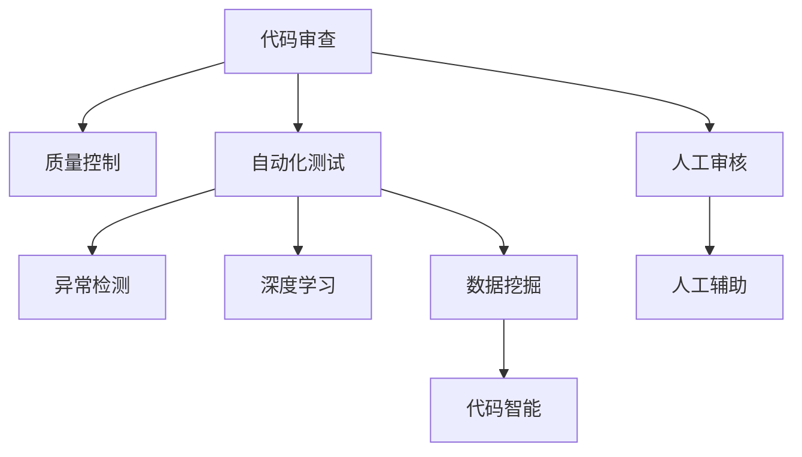

                 

# AI驱动的代码审查与质量控制

> 关键词：代码审查, 质量控制, 机器学习, 自动化测试, 数据挖掘, 异常检测, 深度学习, 代码智能

## 1. 背景介绍

在软件开发过程中，代码审查与质量控制是确保软件质量、减少缺陷的关键环节。传统的代码审查主要依赖人工进行，不仅耗时耗力，还容易受审查者主观偏见影响，审查结果难以保证客观公正。近年来，随着人工智能技术的发展，AI驱动的代码审查与质量控制开始成为业界关注的焦点。本文将全面介绍AI驱动代码审查与质量控制的原理、方法与实践，并探讨其在实际应用中的效果和挑战。

## 2. 核心概念与联系

### 2.1 核心概念概述

- **代码审查(Code Review)**：通过团队成员互相检查代码，确保代码符合设计规范、质量标准，减少错误和缺陷。

- **质量控制(Quality Control)**：通过一系列措施，确保软件产品在各个开发阶段满足预定的质量标准。

- **自动化测试(Automatic Testing)**：使用软件工具自动化执行测试用例，以发现和修复软件缺陷。

- **数据挖掘(Data Mining)**：通过算法从大量数据中提取有用信息和知识，辅助决策。

- **异常检测(Anomaly Detection)**：使用机器学习算法，从异常样本中识别和隔离缺陷代码。

- **深度学习(Deep Learning)**：一种基于神经网络的机器学习算法，通过多层次的非线性映射，从数据中自动提取特征。

- **代码智能(Code Intelligence)**：通过AI技术，提升代码审查与质量控制的智能化水平，自动化辅助开发团队。

这些核心概念之间的逻辑关系可以通过以下Mermaid流程图来展示：



这个流程图展示了几项关键技术之间的逻辑关系：

1. 代码审查是质量控制的重要环节之一，通过人工和自动化手段确保代码质量。
2. 自动化测试和异常检测通过机器学习算法提高检测效率和准确性。
3. 数据挖掘和深度学习可以从大量代码中自动提取关键信息，辅助代码审查。
4. 代码智能是AI驱动的集成技术，综合利用各种技术手段，提升代码审查与质量控制的智能化水平。

## 3. 核心算法原理 & 具体操作步骤

### 3.1 算法原理概述

AI驱动的代码审查与质量控制，本质上是通过机器学习算法从代码数据中提取特征，自动检测潜在问题，并通过智能推理和决策，辅助人工进行代码审查和质量控制。常用的算法包括但不限于以下几种：

- **异常检测(Anomaly Detection)**：基于统计模型和机器学习算法，识别代码中的异常模式，如代码重复、内存泄漏、异常使用等。

- **分类(Classification)**：通过训练分类模型，自动判断代码的语义是否符合规范或标准，如判断代码是否为空指针访问、是否为潜在安全漏洞等。

- **回归(Regression)**：通过回归模型预测代码的质量指标，如代码的复杂度、可维护性、可读性等。

- **聚类(Clustering)**：通过聚类算法，将代码按照质量特征进行分组，有助于识别代码集群中的问题代码。

- **序列模式分析(Time Series Analysis)**：通过序列模式分析算法，检测代码质量的变化趋势，及时预警代码质量下滑。

### 3.2 算法步骤详解

以下是AI驱动代码审查与质量控制的主要操作步骤：

**Step 1: 数据准备**

- 收集代码库中的源代码数据，包括代码文件、版本控制信息等。
- 从代码注释、提交信息、变更日志等非代码数据中提取语义信息。
- 对数据进行清洗、标注，去除噪声，保留有用信息。

**Step 2: 特征提取**

- 使用数据挖掘和特征提取算法，从代码和元数据中提取关键特征。
- 特征可以包括代码行数、注释比例、变量命名规范、函数复杂度等。

**Step 3: 模型训练**

- 使用监督学习算法（如决策树、支持向量机、神经网络等）对提取的特征进行训练，建立分类或回归模型。
- 在模型训练过程中，使用交叉验证等技术，避免过拟合。

**Step 4: 模型评估**

- 使用测试数据集对训练好的模型进行评估，计算准确率、召回率、F1分数等指标。
- 根据评估结果，调整模型参数，进一步优化模型性能。

**Step 5: 模型部署**

- 将训练好的模型部署到代码审查系统中，实时监测代码变更。
- 集成自动化测试工具，自动执行测试用例，发现和报告缺陷。

**Step 6: 人机结合**

- 在AI驱动的代码审查过程中，引入人工审核和辅助决策，确保审查结果的客观公正。
- 提供可视化工具，展示模型的推理过程和预测结果，帮助人工审核理解并决策。

### 3.3 算法优缺点

**优点**

- **高效准确**：AI驱动的代码审查与质量控制，能够快速识别代码中的潜在问题，提高审查效率和准确性。
- **全覆盖**：通过大规模数据训练，可以覆盖更多代码质量问题，减少漏检和误报。
- **无偏决策**：AI算法可以客观公正地进行代码审查，避免人工审查的主观偏见。
- **持续改进**：模型可以不断从新的数据中学习，逐步提高审查效果。

**缺点**

- **数据依赖**：模型的效果很大程度上依赖于训练数据的代表性，需要高质量的数据进行训练。
- **模型复杂**：训练深度学习等复杂模型，需要大量的计算资源和时间。
- **解释性差**：AI算法的决策过程难以解释，审查者难以理解模型的推理逻辑。
- **场景局限**：当前AI驱动的代码审查与质量控制技术，主要针对代码质量和结构问题，对于代码意图和设计方面的审查效果有限。

### 3.4 算法应用领域

AI驱动的代码审查与质量控制，已经在软件开发、代码托管平台、自动化测试等多个领域得到了广泛应用，以下是几个典型的应用场景：

- **软件开发**：在开发过程中，使用AI工具实时检测代码质量，自动生成代码规范和最佳实践指南，辅助开发者编写高质量代码。
- **代码托管平台**：如GitHub、GitLab等，集成AI代码审查工具，自动检测代码变更，提供即时反馈和建议，提升平台的用户体验。
- **自动化测试**：使用AI驱动的自动化测试工具，从代码数据中提取特征，预测代码的测试结果，提高测试覆盖率和质量。
- **异常检测**：通过AI算法，从代码变更中自动检测异常行为，如代码注入、恶意代码等，提升代码库的安全性。
- **代码智能助手**：结合代码审查和代码推荐，智能助手能够提供代码补全、变量命名建议、代码优化建议等功能，提升开发效率和代码质量。

## 4. 数学模型和公式 & 详细讲解 & 举例说明

### 4.1 数学模型构建

AI驱动的代码审查与质量控制，通常使用以下数学模型进行建模：

- **异常检测模型**：基于统计学方法（如均值漂移、孤立森林等）或机器学习算法（如支持向量机、随机森林等），构建异常检测模型。

- **分类模型**：使用决策树、支持向量机、神经网络等算法，构建分类模型，用于判断代码是否符合规范或标准。

- **回归模型**：使用线性回归、岭回归、深度神经网络等算法，构建回归模型，用于预测代码的质量指标。

- **聚类模型**：使用K-means、层次聚类、DBSCAN等算法，构建聚类模型，用于识别代码集群中的问题代码。

- **序列模式分析模型**：使用ARIMA、LSTM等算法，构建序列模式分析模型，用于检测代码质量的变化趋势。

### 4.2 公式推导过程

以下是几个典型模型的公式推导：

**异常检测模型**

- **均值漂移模型**：
$$
\mu = \frac{\sum_{i=1}^n x_i}{n}, \quad \Sigma = \frac{\sum_{i=1}^n (x_i - \mu)(x_i - \mu)^T}{n}
$$
- **孤立森林模型**：
$$
\text{Split Score} = \frac{\log_2 \sqrt{\frac{N}{N-1}} + \frac{N}{N-1}\frac{\log_2 \sqrt{n/N}}{n/N}
$$

**分类模型**

- **决策树模型**：
$$
T = \{\langle x_i, y_i\rangle\}_{i=1}^N
$$
- **支持向量机模型**：
$$
\min_{\omega, \beta} \frac{1}{2}\|\omega\|^2 + C\sum_{i=1}^N \xi_i
$$

**回归模型**

- **线性回归模型**：
$$
\hat{y} = \theta_0 + \theta_1x_1 + \cdots + \theta_nx_n
$$
- **神经网络模型**：
$$
\hat{y} = \sigma(\sum_{i=1}^n \theta_ix_i + b)
$$

**聚类模型**

- **K-means模型**：
$$
k = \min_{k=1,\cdots,K} \sum_{i=1}^N \|x_i - \mu_k\|^2
$$

**序列模式分析模型**

- **ARIMA模型**：
$$
y_t = c + \sum_{i=1}^p \phi_i y_{t-i} + \sum_{i=1}^d \theta_i \Delta^i y_t + \sum_{i=1}^q \Phi_i \epsilon_{t-i}
$$

### 4.3 案例分析与讲解

**案例一：代码重复检测**

- **问题描述**：代码重复是软件开发中的常见问题，容易引发维护困难和潜在风险。

- **解决方案**：使用文本相似度算法（如余弦相似度、Jaccard相似度等），构建代码重复检测模型。

- **算法步骤**：
1. 提取代码文件中的关键信息，如变量名、函数名、代码行等。
2. 计算代码片段之间的相似度。
3. 设定阈值，判断是否为重复代码。

- **模型公式**：
$$
similarity(x,y) = \cos(x,y) = \frac{x \cdot y}{\|x\|\|y\|}
$$

- **实现示例**：
```python
from sklearn.metrics.pairwise import cosine_similarity

def check_code_duplicate(code1, code2):
    # 提取代码中的关键信息
    tokens1 = tokenize(code1)
    tokens2 = tokenize(code2)
    
    # 计算代码相似度
    similarity = cosine_similarity([tokens1], [tokens2])[0][0]
    
    # 判断是否为重复代码
    if similarity > threshold:
        return True
    else:
        return False
```

**案例二：代码质量评估**

- **问题描述**：代码质量评估是代码审查中的重要环节，常用的质量指标包括代码复杂度、可读性、可维护性等。

- **解决方案**：使用回归模型，根据提取的代码特征，预测代码的质量指标。

- **算法步骤**：
1. 收集代码库中的源代码数据。
2. 提取代码的质量特征，如代码行数、函数复杂度等。
3. 使用回归模型，训练代码质量预测模型。
4. 根据模型预测结果，评估代码质量。

- **模型公式**：
$$
\hat{y} = \theta_0 + \theta_1x_1 + \cdots + \theta_nx_n
$$

- **实现示例**：
```python
from sklearn.linear_model import LinearRegression

# 收集代码质量数据
code_quality_data = collect_code_quality_data()

# 提取特征
X = extract_code_quality_features(code_quality_data)

# 训练回归模型
model = LinearRegression().fit(X, y)

# 预测代码质量
code_quality = model.predict(new_code_data)
```

## 5. 项目实践：代码实例和详细解释说明

### 5.1 开发环境搭建

在开发AI驱动的代码审查与质量控制系统时，需要安装Python及其相关库，如Pandas、NumPy、Scikit-learn、TensorFlow等。以下是一个基本的开发环境搭建流程：

1. 安装Anaconda：从官网下载并安装Anaconda，用于创建独立的Python环境。
2. 创建并激活虚拟环境：
```bash
conda create -n ai-code-review python=3.8 
conda activate ai-code-review
```
3. 安装依赖库：
```bash
conda install pandas numpy scikit-learn matplotlib tensorflow
```

### 5.2 源代码详细实现

以下是一个基于深度学习模型的代码质量评估系统实现示例：

```python
import pandas as pd
import numpy as np
from sklearn.model_selection import train_test_split
from sklearn.linear_model import LinearRegression
from sklearn.metrics import mean_squared_error, mean_absolute_error

# 数据准备
code_quality_data = pd.read_csv('code_quality.csv')
features = code_quality_data[['loc', 'noc', 'cyclomatic_complexity']]
targets = code_quality_data['quality_score']

# 特征提取
X_train, X_test, y_train, y_test = train_test_split(features, targets, test_size=0.2)

# 模型训练
model = LinearRegression()
model.fit(X_train, y_train)

# 模型评估
y_pred = model.predict(X_test)
mse = mean_squared_error(y_test, y_pred)
mae = mean_absolute_error(y_test, y_pred)
print('MSE:', mse)
print('MAE:', mae)
```

### 5.3 代码解读与分析

在上述代码中，我们首先读取了代码质量数据，提取了代码的特征（如代码行数、函数复杂度等），然后使用线性回归模型对代码质量进行预测。通过计算预测值与实际值的均方误差和平均绝对误差，评估模型的性能。

## 6. 实际应用场景

### 6.1 软件开发

在软件开发过程中，AI驱动的代码审查与质量控制可以显著提升开发效率和代码质量。具体应用场景包括：

- **代码重复检测**：使用文本相似度算法，检测代码中的重复部分，减少重复代码，提高代码质量。
- **代码风格统一**：通过分类模型，检测代码风格是否符合规范，确保代码风格一致性。
- **代码优化建议**：使用回归模型，根据代码特征，自动生成代码优化建议，提升代码可读性和可维护性。

### 6.2 代码托管平台

在代码托管平台中，AI驱动的代码审查与质量控制可以提升用户开发体验。具体应用场景包括：

- **代码质量评估**：对新提交的代码进行自动评估，给出代码质量评分，帮助开发者改进代码。
- **代码审查建议**：根据代码质量评估结果，自动生成代码审查建议，辅助人工审查。
- **代码变更检测**：实时监测代码变更，检测代码变更中可能引入的问题，及时预警。

### 6.3 自动化测试

在自动化测试中，AI驱动的代码审查与质量控制可以提升测试效率和质量。具体应用场景包括：

- **测试用例生成**：根据代码特征，自动生成测试用例，提高测试覆盖率。
- **测试结果预测**：使用异常检测模型，预测测试结果，提前发现潜在缺陷。
- **测试数据准备**：自动从代码中提取测试数据，准备测试用例。

### 6.4 未来应用展望

未来，AI驱动的代码审查与质量控制技术将进一步提升软件开发和质量控制的智能化水平。以下是几个可能的发展方向：

- **多模态融合**：结合代码、注释、提交信息等多模态数据，提高代码质量评估的准确性。
- **实时监控**：将代码审查与质量控制集成到持续集成(CI/CD)系统中，实现实时监控和预警。
- **自动化工具链**：开发统一的自动化工具链，集成代码审查、代码优化、测试用例生成等工具，简化开发流程。
- **智能决策**：结合专家知识库和规则库，开发智能决策系统，提升代码审查与质量控制的智能化水平。

## 7. 工具和资源推荐

### 7.1 学习资源推荐

以下是一些推荐的学习资源，帮助读者系统掌握AI驱动的代码审查与质量控制技术：

1. **《Python机器学习》**：scikit-learn官方文档，提供了丰富的机器学习算法和代码示例，适合入门学习。
2. **《TensorFlow实战》**：TensorFlow官方文档，介绍了TensorFlow的实现细节和常见应用场景。
3. **《深度学习入门》**：由李宏毅教授主讲的深度学习课程，详细讲解深度学习算法和实现。
4. **Kaggle**：机器学习竞赛平台，提供了大量的数据集和代码示例，适合实践学习。
5. **Github**：代码托管平台，提供了丰富的代码审查工具和实践经验。

### 7.2 开发工具推荐

以下是一些常用的开发工具，帮助读者高效开发AI驱动的代码审查与质量控制系统：

1. **PyCharm**：IDE工具，提供丰富的代码编辑器和调试工具。
2. **Jupyter Notebook**：轻量级编辑器，适合数据探索和模型验证。
3. **Anaconda Navigator**：可视化工具，方便安装和管理Python环境。
4. **GitHub Desktop**：代码管理工具，方便提交和合并代码变更。

### 7.3 相关论文推荐

以下是几篇经典的AI驱动代码审查与质量控制的论文，推荐读者阅读：

1. **CodeArcher: Guiding Developers towards Better Code through Deep Learning**：提出基于深度学习的代码质量评估系统，用于辅助软件开发。
2. **DeepCode: Deep Learning for Code Review**：提出基于深度学习的代码审查系统，用于检测代码缺陷和问题。
3. **AIReview: A Machine Learning-Based Code Review Tool**：提出基于机器学习的代码审查系统，用于提升代码质量。
4. **CodeSonar: Using Deep Learning for Code Review**：提出基于深度学习的代码审查系统，用于检测代码缺陷和问题。

## 8. 总结：未来发展趋势与挑战

### 8.1 研究成果总结

AI驱动的代码审查与质量控制技术已经在软件开发、代码托管平台、自动化测试等多个领域得到了广泛应用。通过深度学习、机器学习等技术，显著提升了代码审查与质量控制的智能化水平。未来，随着AI技术的进一步发展，代码审查与质量控制将更加智能化、自动化，助力软件开发和质量控制的全面升级。

### 8.2 未来发展趋势

未来，AI驱动的代码审查与质量控制技术将呈现以下几个发展趋势：

1. **多模态融合**：结合代码、注释、提交信息等多模态数据，提高代码质量评估的准确性。
2. **实时监控**：将代码审查与质量控制集成到持续集成(CI/CD)系统中，实现实时监控和预警。
3. **自动化工具链**：开发统一的自动化工具链，集成代码审查、代码优化、测试用例生成等工具，简化开发流程。
4. **智能决策**：结合专家知识库和规则库，开发智能决策系统，提升代码审查与质量控制的智能化水平。

### 8.3 面临的挑战

尽管AI驱动的代码审查与质量控制技术已经取得了一定的进展，但在实际应用中仍面临以下挑战：

1. **数据依赖**：模型的效果很大程度上依赖于训练数据的代表性，需要高质量的数据进行训练。
2. **模型复杂**：训练深度学习等复杂模型，需要大量的计算资源和时间。
3. **解释性差**：AI算法的决策过程难以解释，审查者难以理解模型的推理逻辑。
4. **场景局限**：当前AI驱动的代码审查与质量控制技术，主要针对代码质量和结构问题，对于代码意图和设计方面的审查效果有限。

### 8.4 研究展望

未来的研究需要在以下几个方面寻求新的突破：

1. **数据增强**：提高数据集的多样性和代表性，减少数据依赖。
2. **模型优化**：优化模型结构，降低计算复杂度，提高推理速度。
3. **可解释性**：开发可解释性强的模型，提高模型的透明度和可信度。
4. **跨模态融合**：结合代码、注释、提交信息等多模态数据，提升代码审查与质量控制的全面性。

这些研究方向的探索，必将引领AI驱动的代码审查与质量控制技术迈向更高的台阶，为软件开发和质量控制带来革命性的变化。只有不断创新和突破，才能真正实现代码审查与质量控制的智能化和自动化，推动软件开发和质量控制的全面升级。

## 9. 附录：常见问题与解答

### Q1：AI驱动的代码审查与质量控制技术是否适用于所有开发场景？

A: AI驱动的代码审查与质量控制技术主要适用于代码质量高、数据量大的开发场景。对于一些需要高精度判断的场景，如安全审计、合规审查等，仍需要人工辅助。

### Q2：如何选择合适的算法和模型？

A: 选择合适的算法和模型，需要考虑以下因素：
1. 数据特征：根据数据特征选择合适的算法和模型，如回归、分类、聚类等。
2. 应用场景：根据应用场景选择合适的算法和模型，如代码重复检测、代码质量评估等。
3. 计算资源：根据计算资源选择合适的算法和模型，如深度学习模型计算量大，需要高性能计算资源。

### Q3：如何提高模型的可解释性？

A: 提高模型的可解释性，可以采用以下方法：
1. 特征可视化：可视化模型的特征提取过程，帮助理解模型的决策逻辑。
2. 模型分解：将复杂模型分解为多个子模型，提高模型的可解释性。
3. 模型解释工具：使用模型解释工具，如SHAP、LIME等，提供模型特征贡献度的解释。

### Q4：如何处理多模态数据？

A: 处理多模态数据，可以采用以下方法：
1. 数据融合：将代码、注释、提交信息等数据融合，提取多模态特征。
2. 多模型融合：使用多个模型，结合多模态数据，提升模型的准确性。
3. 特征选择：选择对模型有帮助的多模态特征，提高模型的性能。

### Q5：如何平衡模型性能和推理速度？

A: 平衡模型性能和推理速度，可以采用以下方法：
1. 模型压缩：使用模型压缩技术，如剪枝、量化等，减少模型大小，提高推理速度。
2. 模型加速：使用模型加速技术，如GPU、TPU等，提高模型的推理速度。
3. 模型优化：优化模型结构，减少计算复杂度，提高推理速度。

---

作者：禅与计算机程序设计艺术 / Zen and the Art of Computer Programming

